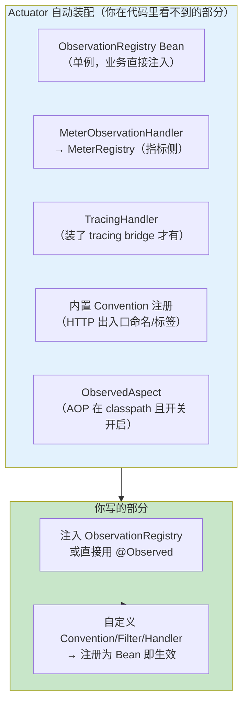
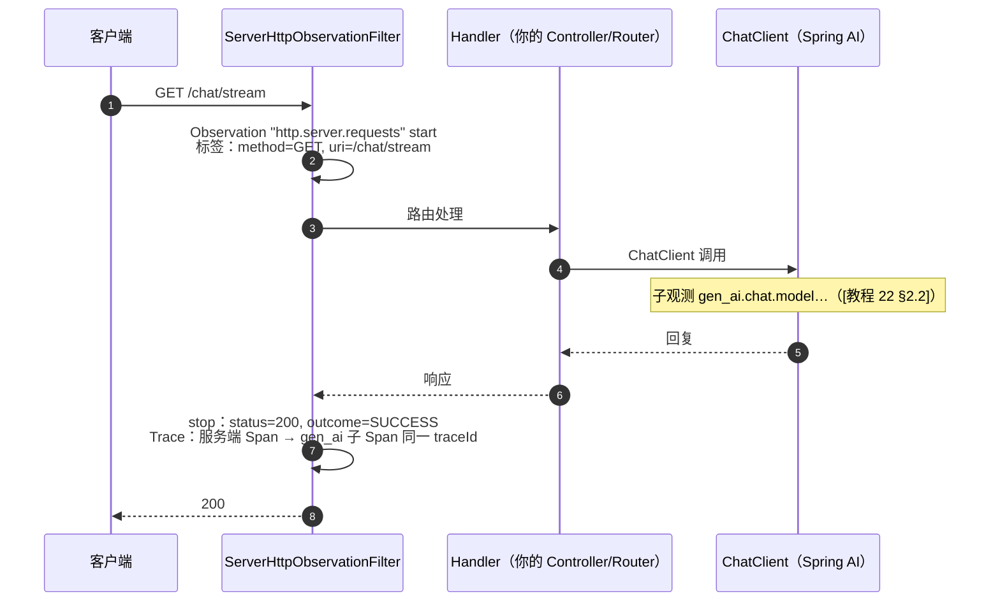
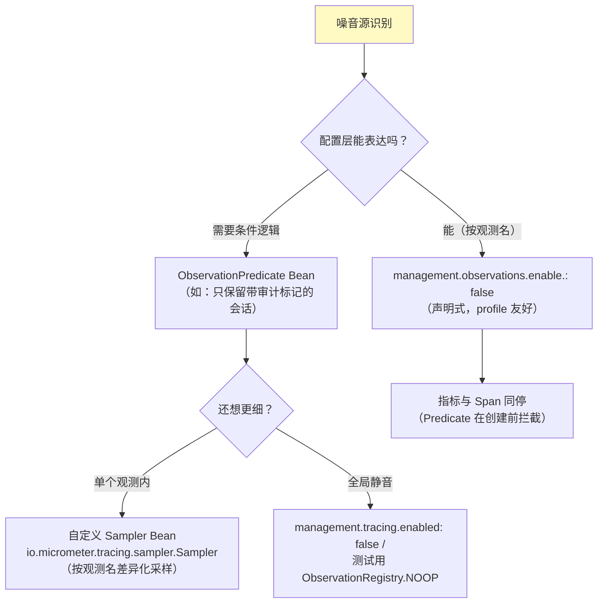

# Spring Boot 自动装配与配置

> **定位**：本文讲清 Spring Boot（4.1）里 Observation 是怎么"自动"起来的——一个 Actuator 依赖换来什么、自动装配了哪些 Bean、`management.*` 配置体系全表解、WebFlux/WebClient 出入口埋点的名字与标签、@Observed 注解的开启条件，以及降噪与关闭的正确姿势。
>
> **读者画像**：使用 Spring Boot 4.1 + WebFlux 的开发者；想要"不写插桩代码先获得 HTTP 出入口观测"或"关掉噪音埋点"的人。
>
> **前置阅读**：[附录 18-Observation/00]、[附录 18-Observation/01]；[教程 22-全链路可观测性 §5]（Spring AI 侧配置）。
>
> **版本基准**：Spring Boot 4.1（沿用 3.x 的 Actuator 可观测体系）；配置键以所引版本文档为准（历史版本键名有过演进）。

---

## 1. 一个依赖，换来自动化的什么

**需在 pom.xml 中添加依赖**（若尚未引入 Actuator）：

```xml
<dependency>
    <groupId>org.springframework.boot</groupId>
    <artifactId>spring-boot-starter-actuator</artifactId>
</dependency>
```

它传递引入 micrometer-core、micrometer-observation，并触发自动装配：



**关键设计**：所有扩展点（`ObservationRegistryCustomizer`、`GlobalObservationConvention`、`ObservationHandler`、`ObservationFilter`、`ObservationPredicate`）**注册为 Spring Bean 即被自动装配收集**——不需要自己碰 Registry 的装配代码（[教程 22 §5.3] 手工 `new ObservationRegistry()` 反而绕开了自动装配，应改为注入 Boot 的 Bean + Customizer）。

## 2. 自动埋点全景：你不写代码就有的观测

| 埋点 | 触发组件 | 观测名（指标名） | 关键低基数标签 |
|------|---------|-----------------|---------------|
| 服务端 HTTP | WebFlux（`ServerHttpObservationFilter` 自动注册） | `http.server.requests` | method、uri（路由模板）、status、outcome、exception |
| 客户端 HTTP | WebClient / RestClient / RestTemplate | `http.client.requests`（版本相关，以文档为准） | method、uri、status、outcome、client.name |
| 注解方法 | `@Observed` + ObservedAspect | 你给的 name | 你给的（注解只含 name/contextualName，[附录 05-02 §3.1] 基准） |
| Spring AI 全家 | ChatClient/ChatModel/Tool/VectorStore/Embedding | `gen_ai.*` / `spring.ai.*`（[教程 22 §2]） | gen_ai.system、gen_ai.request.model、tool.name 等 |
| Kafka | spring-kafka 客户端指标桥接 | 客户端指标体系（[17-Kafka/08 §6]） | — |

一次 WebFlux 请求的观测链：



注意 `uri` 标签是**路由模板**（`/chat/{sessionId}`）而不是真实 URL——这就是它低基数的原因，也是模板配置错误（路径未参数化）时基数爆炸的入口（排障口诀：`/actuator/metrics/http.server.requests` 看 tag 取值数）。

## 3. management.* 配置全表

### 3.1 Observation 通用

```yaml
management:
  observations:
    key-values:                    # 全局公共 KeyValue（≈ 旧版 common tags）
      application: ai-agent-service
      env: production
    annotations:
      enabled: true                # @Observed Aspect 开关（默认 true，需 AOP 依赖）
    enable:
      http.server.requests: true   # 按观测名前缀开关（false 即降噪）
```

### 3.2 Tracing 与采样（装了 bridge 才生效）

```yaml
management:
  tracing:
    enabled: true
    sampling:
      probability: 0.1             # 头采样：10%（开发 1.0，生产 0.1-0.2）
    baggage:
      remote-fields: tenant-id     # 跨服务传播的行李字段
      correlation-fields: tenant-id # 同时映射到日志 MDC
  otlp:
    tracing:
      endpoint: ${OTLP_ENDPOINT}   # OTLP Collector（推荐）
      # headers: Authorization=...
  zipkin:
    tracing:
      endpoint: http://zipkin:9411/api/v2/spans   # 本地开发常用
```

### 3.3 配置 vs Bean 的分工纪律

| 想做的事 | 用配置 | 用 Bean |
|---------|--------|--------|
| 关掉某类埋点 | `management.observations.enable.<name>: false` | `ObservationPredicate`（逻辑化条件，如"审计主题才开"） |
| 加公共标签 | `management.observations.key-values.*` | `ObservationRegistryCustomizer`（动态值） |
| 改指标/ Span 命名与标签 | — | `GlobalObservationConvention` Bean / `ObservationConvention` |
| 消费观测数据 | — | `ObservationHandler` Bean |
| Span 属性脱敏 | — | `ObservationFilter` Bean |

**优先级：能用配置的用配置（声明式、可按 profile 切换），逻辑性的才写 Bean。**

## 4. @Observed：注解即埋点

```xml
<!-- 需在 pom.xml 中添加依赖（AOP 支持，ObservedAspect 需要） -->
<dependency>
    <groupId>org.springframework.boot</groupId>
    <artifactId>spring-boot-starter-aop</artifactId>
</dependency>
```

```java
@Service
public class AgentService {

    private final ChatClient chatClient;

    public AgentService(ChatClient chatClient) {
        this.chatClient = chatClient;
    }

    // 注解只负责"有与名字"；KeyValue 一律用 Convention 补（[附录 05-02 §3.1]：
    // @Observed 没有 lowCardinalityKeyValue 单值属性——那是虚构 API）
    @Observed(name = "agent.conversation", contextualName = "handle-conversation")
    public String handleConversation(String userId, String message) {
        return chatClient.prompt().user(message).call().content();
    }
}
```

四条边界必须知道：

1. **走 Spring AOP 代理**——同类内部自调用（`this.handleConversation()`）不过代理，注解失效（经典 AOP 盲区，与 [教程 14-Advisor链与拦截器] 的代理语义同源）。
2. **方法内启动的子观测自动成为其子 Span**——AOP 在方法前后开/停 Observation + Scope，同线程内天然成树。
3. **异步/响应式方法（返回 Mono/Flux）要小心**：切面在**订阅前**就 stop 了——Mono 是冷流，真正执行发生在订阅时。返回响应式类型的方法**不要用 @Observed**，改用 Reactor 的观测方案（[附录 18-Observation/03 §5]、[04 §4]）。
4. **虚拟线程（Java 21）**：`spring.threads.virtual.enabled=true` 下注解照常工作（AOP 在执行线程上包裹），是阻塞式工具方法的省心选择。

## 5. 出入口标签定制：Convention Bean

替换 WebFlux 服务端默认标签（比如把业务渠道打进去）：

```java
@Bean
public ServerRequestObservationConvention customServerConvention() {
    return new DefaultServerRequestObservationConvention() {
        @Override
        public KeyValues getLowCardinalityKeyValues(ServerRequestObservationContext ctx) {
            return super.getLowCardinalityKeyValues(ctx)     // 保留 method/uri/status...
                    .and(KeyValue.of("agent.channel",         // 只加有界值
                            resolveChannel(ctx)));
        }
    };
}
```

这是"改框架埋点不改框架代码"的标准姿势（[附录 18-Observation/01 §5] 的解析顺序在起作用：注册的 Convention 覆盖默认命名）。渠道值必须从请求头/路由来（有界），**不要**把 userId 放进来（基数爆炸，[附录 18-Observation/00 §4]）。

## 6. 降噪与关闭：三层闸门



<!-- ⚠ 图中 io.micrometer.tracing.sampler.Sampler 需引入依赖 io.micrometer:micrometer-tracing（本地未下载，未 javap 实证；以引入依赖后 javap 输出为准） -->

为什么降噪重要：高频低值埋点（健康检查端点、每条 Kafka 消费）的指标时间序列和 Span 量会淹没真正有价值的 gen_ai 观测——**可观测系统自己也需要容量治理**（[教程 22 §10] 采样策略的机制层补全）。

## 7. 验证：三分钟自检清单

1. `GET /actuator/metrics` —— 指标列表里能看到 `http.server.requests`（打了请求之后）
2. `GET /actuator/metrics/http.server.requests` —— tag 维度正确（uri 是模板不是真实值）
3. 本地挂 `ObservationTextPublisher` Bean —— 控制台逐行看生命周期（[附录 18-Observation/01 §7.1]）
4. 装了 tracing bridge 后打几个请求 —— Zipkin/Grafana Tempo 里出现服务端 Span，且 gen_ai 子 Span 挂在下面（[教程 22 §3] 的树）

## 8. 适用场景与不适用场景

### 适用场景

- 标准 Spring Boot 服务"零插桩"获得 HTTP 出入口指标 + Span
- 多 profile 环境（dev 全采样 / prod 10% 采样）纯配置切换
- 团队级可观测规范：公共标签配置化 + Convention Bean 化，评审有抓手

### 不适用场景

- 非 Spring 环境（纯库）——直接用 `ObservationRegistry.create()` 手工装配（[附录 18-Observation/01]）
- 手写 `new ObservationRegistry()` 的念头——绕开自动装配后，Handler/Convention 全部失联；永远注入 Boot 的 Bean
- 想用 @Observed 标响应式方法——切面时序不匹配（§4 第 3 条），走 Reactor 方案

## 9. 常见误区与反模式

1. **手工 new Registry 和自动装配混用**——两套 Registry 各持一套 Handler，一半观测消失；正确姿势是 `ObservationRegistryCustomizer` 定制。
2. **uri 标签出现真实 URL/查询串**——路由未模板化或路径参数外泄，基数爆炸；上线前看 tag 基数（§2 排障口诀）。
3. **采样率 100% 上生产**——[教程 22 §10.1] 的采样表是起点；再加本篇 §6 的降噪三层闸门。
4. **给 @Observed 造不存在的属性**——`lowCardinalityKeyValue = {...}` 是虚构 API（[附录 05-02] 审计基准）；标签进 Convention。
5. **忘记 Actuator 端点暴露**——`management.endpoints.web.exposure.include` 没开 prometheus/metrics，指标采不到却以为是埋点问题。

## 10. 总结

Spring Boot 的 Observation 自动装配 = **一个 Actuator 依赖 + 配置键 + Bean 三层定制**：配置管开关/公共标签/采样（声明式），Bean 管 Convention/Filter/Handler/Predicate（逻辑式）；`http.server.requests` 是所有人共享的入口观测，@Observed 是方法边界的快捷方式（注意 AOP 自调用与响应式边界）。下一篇进入自定义扩展的实战：[附录 18-Observation/03-自定义观测点与扩展点]。

**外部来源**：[Spring Boot Observability](https://docs.spring.io/spring-boot/reference/actuator/observability.html) · [Micrometer Annotations](https://micrometer.io/docs/concepts#_annotations) · [Spring Framework ServerHttpObservationFilter](https://docs.spring.io/spring-framework/reference/integration/observability.html)
