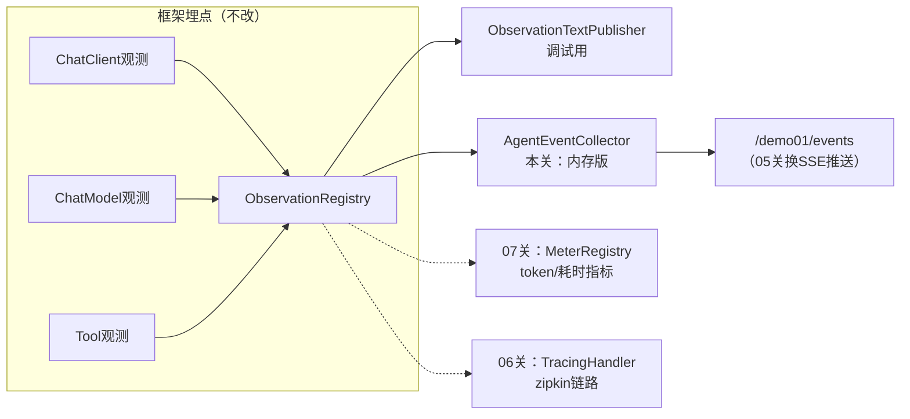

# 03 自定义 Handler：把 Agent 各阶段输出收集成事件流

> **定位**：console 散落的文本只适合单次调试。这一关做你要的第二层——**自定义消费**：写一个 Agent 事件收集 Handler，把 LLM 调用、工具执行、错误按阶段抽取成结构化事件（`AgentEvent`），存进按 traceId 归组的会话缓冲，并暴露查询接口。它是 05 关前端时间线的直接数据源。
>
> **前置阅读**：[附录 18-Observation/02]。

---

## 3.1 设计先行：工业级的事件模型

不直接把 `Observation.Context` 塞给前端——Context 是框架对象（含不可序列化字段），且暴露面失控。正确做法：**在 Handler 里抽取领域字段，产出自己的 DTO**（这与 CLAUDE.md"存可序列化 Map、读时重建"的教训同源——凡跨边界传对象，先定义稳定契约）：

```java
// src/main/java/demo/demo01/obs/AgentEvent.java
package demo.demo01.obs;

import java.time.Instant;

/** Agent 阶段事件的稳定契约：阶段类型 + 摘要 + 时间戳 */
public record AgentEvent(
        String phase,      // CHAT_CLIENT / LLM / TOOL / ERROR / BUSINESS
        String name,       // span 名或工具名
        String detail,     // 摘要（prompt片段/参数/结果）
        Instant time) {
}
```

## 3.2 收集器：一个 Handler，认领三类 Context

```java
// src/main/java/demo/demo01/obs/AgentEventCollector.java（完整文件，v1）
package demo.demo01.obs;

import io.micrometer.observation.Observation;
import io.micrometer.observation.ObservationHandler;
import org.springframework.ai.chat.client.observation.ChatClientObservationContext;
import org.springframework.ai.chat.observation.ChatModelObservationContext;
import org.springframework.ai.tool.observation.ToolCallingObservationContext;
import org.springframework.stereotype.Component;

import java.time.Instant;
import java.util.List;
import java.util.concurrent.ConcurrentHashMap;
import java.util.concurrent.CopyOnWriteArrayList;

@Component
public class AgentEventCollector implements ObservationHandler<Observation.Context> {

    /** 分组键 -> 事件序列；06 关引入 Tracer 后 key 换成真实 traceId，此处先用固定分组占位 */
    private final ConcurrentHashMap<String, List<AgentEvent>> buffer = new ConcurrentHashMap<>();

    @Override
    public boolean supportsContext(Observation.Context context) {
        return context instanceof ChatClientObservationContext
                || context instanceof ChatModelObservationContext
                || context instanceof ToolCallingObservationContext;
    }

    @Override
    public void onStop(Observation.Context context) {
        if (context instanceof ChatClientObservationContext) {
            accept(new AgentEvent("CHAT_CLIENT", "chat-client", "请求参数已送入", Instant.now()));
        } else if (context instanceof ChatModelObservationContext cm) {
            String prompt = String.valueOf(cm.getRequest().getContents());
            accept(new AgentEvent("LLM", "chat-model", "prompt摘要: " + prompt.substring(0, Math.min(80, prompt.length())), Instant.now()));
        } else if (context instanceof ToolCallingObservationContext tc) {
            accept(new AgentEvent("TOOL", tc.getToolDefinition().name(),
                    "参数=" + tc.getToolCallArguments() + " 结果=" + brief(tc.getToolCallResult()), Instant.now()));
        }
    }

    @Override
    public void onError(Observation.Context context) {
        accept(new AgentEvent("ERROR", "error", String.valueOf(context.getError()), Instant.now()));
    }

    /**
     * 事件唯一入口：分组入 buffer。
     * 设为 public 是刻意的——05 关的 SSE 推送在 09 关被 RAG Handler 复用，都走这个口，
     * 保证"任何来源的事件都经过同一条管线"。
     */
    public void accept(AgentEvent event) {
        buffer.computeIfAbsent(currentGroup(), k -> new CopyOnWriteArrayList<>()).add(event);
    }

    private String brief(String result) {
        if (result == null) return "null";
        return result.length() > 100 ? result.substring(0, 100) + "..." : result;
    }

    /** demo：固定分组；生产用 06 关 traceId 或业务会话号 */
    private String currentGroup() { return "default"; }

    public List<AgentEvent> drain(String group) { return buffer.getOrDefault(group, List.of()); }

    public List<AgentEvent> drain() { return drain("default"); }
}
```

要点：

- **`instanceof` 模式匹配分派**——一个 Handler 认领三类 Context，比写三个类更聚拢"事件流"这个概念；类多了再拆是 04 关之后的重构选项。
- **`accept()` 是事件唯一入口**——本关只做"入 buffer"，05 关在同一个方法里加 SSE 广播、09 关的 RAG Handler 也调它：管线单一出口，前端时间线不用区分事件来自哪个 Handler。
- **只存摘要不存全文**——prompt/结果截断。这是工业系统的边界纪律：观测系统自身不能成为内存泄漏源（LLM 长文本、大 JSON 结果很常见）。
- **ConcurrentHashMap + CopyOnWriteArrayList**——Handler 回调可能来自不同线程（WebFlux 事件循环），写侧并发安全是底线。

## 3.3 暴露查询接口（为 05 关前端做准备）

`InspectionController` 本关后的**完整文件**（v2：注入 `AgentEventCollector` + `/events`）：

```java
// src/main/java/demo/demo01/controller/InspectionController.java（本关完整版）
package demo.demo01.controller;

import demo.demo01.obs.AgentEvent;
import demo.demo01.obs.AgentEventCollector;
import demo.demo01.tools.TimeTool;
import org.springframework.ai.chat.client.ChatClient;
import org.springframework.ai.chat.model.ChatModel;
import org.springframework.web.bind.annotation.GetMapping;
import org.springframework.web.bind.annotation.RequestMapping;
import org.springframework.web.bind.annotation.RequestParam;
import org.springframework.web.bind.annotation.RestController;

import java.util.List;

@RestController
@RequestMapping("/demo01")
public class InspectionController {

    private final ChatClient chatClient;
    private final AgentEventCollector eventCollector;

    public InspectionController(ChatModel chatModel, TimeTool timeTool,
                                AgentEventCollector eventCollector) {
        this.chatClient = ChatClient.builder(chatModel)
                .defaultTools(timeTool)                        // 注册时间工具
                .build();
        this.eventCollector = eventCollector;
    }

    @GetMapping("/inspect")
    public String inspect(@RequestParam String prompt) {
        return chatClient.prompt().user(prompt).call().content();
    }

    @GetMapping("/events")
    public List<AgentEvent> events() {
        return eventCollector.drain();
    }
}
```

## 3.4 为什么这个架构是"工业可落地"的



这个"一源多消费者"结构就是管控分离思想在观测层的投影：**埋点（Data Plane）与消费（不同受众的观测视图）解耦**。生产演进路径也很清晰：把 `buffer` 换成 Redis/MQ、把 `drain` 换成 SSE——类边界都不用动。内存版之所以"简约但架构正确"，正因为它守住了接口契约（`AgentEvent`）和职责边界。

**何时该自定义 Handler、何时不用**：

| 场景 | 选择 |
|---|---|
| 只是本地调试看过程 | `ObservationTextPublisher` 够了，别写代码 |
| 要把过程给前端/审计/落库 | 自定义 Handler + 稳定 DTO（本关姿势） |
| 只要指标（QPS/耗时/token） | 不写 Handler，用 Micrometer（07 关，`ChatModelMeterObservationHandler` 已内置） |
| 要改标签/名称 | 不是 Handler 的事，用 Convention（04 关） |

## 3.5 Postman 测试

| 用例 | 方法/URL | 现象 |
|---|---|---|
| 触发一轮工具调用 | `GET http://localhost:8080/demo01/inspect?prompt=现在几点？当前是什么班次？给交接记录写一句总结` | 返回自然语言结论 |
| 查看事件流 | `GET http://localhost:8080/demo01/events` | JSON 数组，按序出现 `CHAT_CLIENT` → `LLM` → `TOOL(getCurrentTime)` → `TOOL(getCurrentShift)` → `LLM`，与你 01 关看到的 span 树一一对应 |
| 错误事件 | 在 `getCurrentShift` 里临时抛异常，重复上一用例，再查 `/events` | 数组中出现 `phase=ERROR` 条目，detail 含异常信息 |
| 无工具对比 | `GET /demo01/inspect?prompt=你好` 后查 `/events` | 只有 `CHAT_CLIENT`+`LLM`，无 `TOOL` |

**验证要点**：`/events` 的顺序与 `ObservationTextPublisher` 的输出顺序一致——同一事件流、两种消费形态，这就是 02 关广播机制的实证。

## 3.6 本关沉淀

- 自定义 Handler 的三步：稳定 DTO → 类型化认领 → `onStop` 抽取（错误另挂 `onError`）；
- 截断、并发安全、不外泄框架对象——观测代码自己的工程纪律；
- "内存 buffer + REST 查询"是通往生产存储（Redis/MQ）的最小正确骨架。

**下一关**：事件里想带班次等业务标签？想对观测内容做统一加工？→ Convention 与 Filter。[附录 18-Observation/04]
