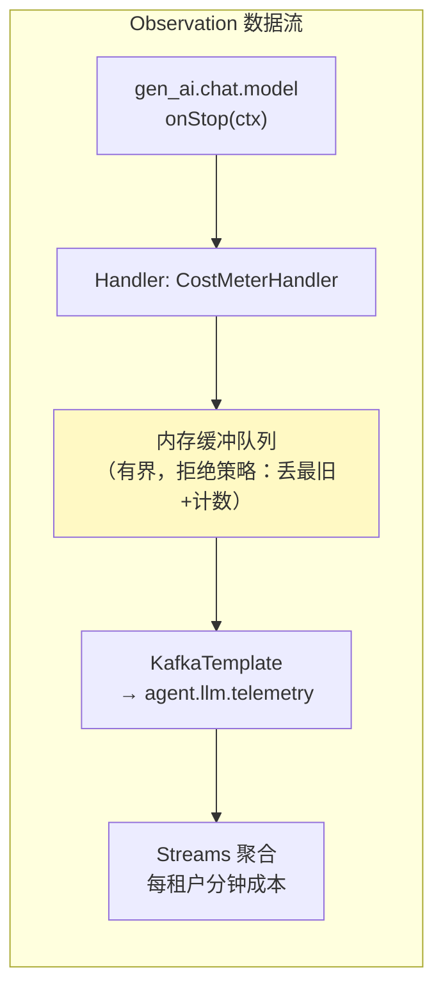
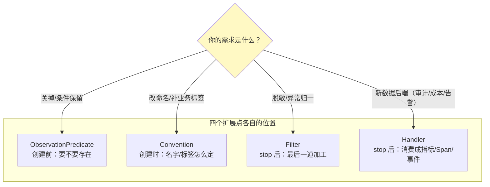

# 自定义观测点与扩展点

> **定位**：本文是动手篇——为 Agent 系统的四个真实需求写全套扩展：① 领域观测上下文（任务执行）+ 类型化 Handler；② ObservationConvention 定制 Spring AI 工具埋点；③ ObservationFilter 做业务上下文补全与 PII 脱敏；④ ObservationHandler 把观测流转成审计事件（发 Kafka）。每段都标注与 WebFlux 铁律的配合方式。
>
> **读者画像**：读完 [附录 18-Observation/00-02]、要给自己的 Agent 服务建审计/成本/质量观测闭环的工程师。
>
> **前置阅读**：[附录 18-Observation/01-核心API与生命周期 §4-§6]（Context/Convention/Handler 机制）；[教程 23-工具执行可观测与审计]（审计需求侧）；[教程 26-多租户隔离与资源治理 §3]（租户上下文传播——本文给出正确的桥接）。
>
> **版本基准**：Micrometer 1.1x / Spring Boot 4.1 / Spring AI 2.0（工具观测上下文以 [附录 05-02 §3.1] 基准为准）。

---

## 1. 案例①：领域观测上下文 + 类型化 Handler

需求：为"Agent 任务步骤"建观测，Handler 要拿到步骤定义与结果做审计。

```java
// ① 领域 Context——Handler 与业务之间只靠它传状态
public class TaskStepContext extends Observation.Context {
    private final String taskId;
    private final String stepName;
    private String result;               // stop 前写入
    // 构造器与 getter 略

    public TaskStepContext withResult(String r) { this.result = r; return this; }
}

// ② 类型化 Handler——只认自己的 Context
@Component
public class TaskStepAuditHandler implements ObservationHandler<TaskStepContext> {

    private final AuditEventPublisher publisher;      // → Kafka（[17-Kafka/09 §5]）

    public TaskStepAuditHandler(AuditEventPublisher publisher) {
        this.publisher = publisher;
    }

    @Override
    public boolean supportsContext(Observation.Context context) {
        return context instanceof TaskStepContext;    // 廉价短路，别做别的
    }

    // Observation.Context 无 getDuration()（javap 实证）；时长需 onStart 存起始、onStop 计算
    private static final Object START_KEY = new Object();

    @Override
    public void onStart(TaskStepContext ctx) {
        ctx.put(START_KEY, System.nanoTime());   // Observation.Context.put(Object, T)
    }

    @Override
    public void onStop(TaskStepContext ctx) {
        // traceId 走 Tracer 真实链路（[附录 05-02] 基准）
        Long startNanos = ctx.get(START_KEY);    // Observation.Context.get(Object)
        long durationMs = startNanos != null ? (System.nanoTime() - startNanos) / 1_000_000 : -1;
        publisher.publish(new StepAuditEvent(
                ctx.getTaskId(), ctx.getStepName(),
                durationMs,
                ctx.getError() != null ? ctx.getError().getClass().getSimpleName() : null,
                tracer.currentSpan() != null
                        ? tracer.currentSpan().context().traceId() : null));
    }
}
```

```java
// ③ 业务侧使用——函数式 + 领域 Context
public StepResult runStep(TaskStep step) {
    TaskStepContext ctx = new TaskStepContext(step.taskId(), step.name());
    return Observation.createNotStarted("agent.task.step", ctx, registry)
            .contextualName("step " + step.name())
            .lowCardinalityKeyValue("step.name", step.name())     // 有界
            .highCardinalityKeyValue("task.id", step.taskId())    // 无界
            .observe(() -> {
                StepResult r = executor.execute(step);
                ctx.withResult(r.summary());                       // stop 前写入 → onStop 可见
                return r;
            });
}
```

三个设计要点：**结果写回 Context 而不是 Handler 里反查业务对象**（Context 是唯一合法通道，[附录 18-Observation/01 §4]）；**traceId 在 Handler 里用 `Tracer.currentSpan()` 现取**（stop 时 Scope 已可能关闭，见 §6 的坑）；审计发布器必须异步缓冲（Handler 在业务线程上同步执行，[教程 23] 的异步落库同款纪律）。

## 2. 案例②：Convention 定制 Spring AI 工具埋点

不改业务代码，给 `spring.ai.tool` 观测补上租户与审批状态标签：

```java
// 自定义约定：基于框架的 ToolCallingObservationConvention 基类扩展
//（以所引 Spring AI 版本的真实基类为准，[附录 05-02 §3.1]）
@Component
public class TenantToolCallingObservationConvention implements ToolCallingObservationConvention {

    @Override
    public KeyValues getLowCardinalityKeyValues(ToolCallingObservationContext ctx) {
        return ToolCallingObservationDocumentation.DEFAULT           // 保留框架基线标签
                .getLowCardinalityKeyValues(ctx)
                .and(KeyValue.of("tenant.tier",
                        TenantContext.currentTier()));        // 有界：free/pro/enterprise
    }

    @Override
    public KeyValues getHighCardinalityKeyValues(ToolCallingObservationContext ctx) {
        return ToolCallingObservationDocumentation.DEFAULT
                .getHighCardinalityKeyValues(ctx)
                .and(KeyValue.of("tenant.id", TenantContext.currentTenantId()));  // 无界 → 只进 Span
    }
}
```

> **标注**：`ToolCallingObservationDocumentation` 等类名以所引 Spring AI 2.0 版本 Javadoc 为准（[附录 05-02] 纪律：存疑必标注）；模式本身（实现 Convention + super 基线 + and() 追加）是 Micrometer 标准做法。注册为 Bean 即被 Boot 收集（[附录 18-Observation/02 §1]）。

分层账目：`tenant.tier`（低基数）→ 你可以按租户等级聚合**工具失败率指标**；`tenant.id`（高基数）→ 排障时在 Span 里精确到租户。这正是 [教程 26] 租户治理在观测层的正确投影。

## 3. 案例③：ObservationFilter——补全与脱敏的统一闸口

Filter 在 **stop 之后、Handler 之前**执行（[附录 18-Observation/00 §3] 时序），是改 KeyValue 的最后机会：

```java
@Component
public class AgentObservationFilter implements ObservationFilter {

    private static final Pattern PII = Pattern.compile("\\b\\d{11,19}\\b");   // 手机/卡号

    @Override
    public Observation.Context map(Observation.Context context) {
        // A. PII 脱敏：覆盖将进 Span 的高基数内容
        context.getHighCardinalityKeyValues()
               .stream()
               .filter(kv -> kv.getKey().endsWith(".content"))
               .forEach(kv -> context.addHighCardinalityKeyValue(
                       KeyValue.of(kv.getKey(), mask(kv.getValue()))));

        // B. 异常标签归一化：把各种超时折叠成一个取值，保住低基数
        if (context.getError() instanceof TimeoutException) {
            context.addLowCardinalityKeyValue(KeyValue.of("error.type", "timeout"));
        }
        return context;
    }
}
```

对比错误做法（[教程 22 §5.3] 审计发现的模式）：Filter 里用 `MDC.get("userId")` 取业务上下文——**WebFlux 下 MDC 是 ThreadLocal，跨算子即失效**（[附录 06-WebFlux与响应式编程] 铁律）。正确链路是：**请求边界把业务身份写进 Observation Context（自定义 Convention 或 WebFilter 显式注入）→ Filter/Handler 从 context 读**——全程不碰 ThreadLocal。租户上下文从 Reactor Context 的桥接在 [附录 18-Observation/04 §4] 展开。

## 4. 案例④：Handler → 事件流的成本管道

把 gen_ai 的 Token 用量观测转成 Kafka 成本事件（[教程 27-成本治理] 的计量入口）：



```java
@Component
public class CostMeterHandler implements ObservationHandler<ChatModelObservationContext> {

    private final BlockingQueue<TelemetryEvent> buffer =
            new ArrayBlockingQueue<>(10_000);           // Handler 同步路径只做入队

    @Override
    public boolean supportsContext(Observation.Context ctx) {
        return ctx instanceof ChatModelObservationContext;
    }

    @Override
    public void onStop(ChatModelObservationContext ctx) {
        buffer.offer(TelemetryEvent.from(ctx));         // 非阻塞；满则丢最旧+自计数
    }

    @Scheduled(fixedDelay = 1000)                       // 异步批量出队发布
    void drain() {
        List<TelemetryEvent> batch = new ArrayList<>(512);
        buffer.drainTo(batch, 512);
        if (!batch.isEmpty()) publisher.publishBatch(batch);
    }
}
```

> **标注**：`ChatModelObservationContext` 为示意类型名，以所引 Spring AI 版本真实类为准（纪律同 §2）；Token 用量的真实取值路径是 Context 上的领域字段（响应与 Usage），不是字符串标签。

这个模式回答了 [教程 27] 计量管道的"事件从哪来"：**指标与成本事件同源**（同一个 onStop），不存在两套口径。

## 5. 响应式链路中的观测：Reactor 专属姿势

WebFlux 服务里最常见的错误是把同步 API 硬塞进响应式链。正确工具箱：

```java
// ① Reactor 原生观测（reactor-core 3.5+ 自带 Micrometer 集成）：
//    冷流语义下"订阅时才开始"——时序天然正确，补 @Observed 的盲区
Flux<Chunk> stream = chatClient.prompt().stream()
        .content()
        .name("agent.stream.chat")                          // 观测名
        .tap(Micrometer.observation(registry));             // 生命周期随订阅走

// ② 需要业务 KeyValue 时用 contextWrite 携带 + 自定义 SignalListener，
//    或在数据源一侧用 observe() 包裹"产生该 Flux 的调用"（如向量检索）
```

配合纪律（[附录 06-WebFlux与响应式编程]）：

| 场景 | 正确姿势 | 反模式 |
|------|---------|--------|
| Mono/Flux 方法边界 | `.name().tap(Micrometer.observation(...))` | `@Observed`（订阅前已 stop） |
| 链内取业务上下文 | Reactor Context / context-propagation | MDC / ThreadLocal |
| 阻塞工具在虚拟线程 | `@Observed` 或 observe()（同线程走完） | 在 EventLoop 上 block |
| 跨线程自动传播 | `Hooks.enableAutomaticContextPropagation()`（[附录 18-Observation/04 §4]） | 手动 ThreadLocal 传递 |

## 6. 扩展点全景与选择



Handler 里取 traceId 的坑（呼应 §1）：`onStop` 时 Scope 通常已关闭，`tracer.currentSpan()` 可能为 null——**traceId 应作为领域字段在 stop 前写入 Context**（或在 Handler 里从 `context` 的父链取），不要依赖"当前 Span"这个线程态。

## 7. 适用场景与不适用场景

### 适用场景

- 领域观测（任务/步骤/审批）+ 审计落库或事件转发
- 框架埋点定制（gen_ai/tool 加租户维度）
- 成本计量、质量采样等"从观测流派生"的管道
- PII 治理与异常归一（Filter 统一闸口）

### 不适用场景

- 高频内层循环逐条观测（Handler 开销，[附录 18-Observation/01 §8]）
- 同步阻塞业务逻辑硬塞 Handler（可观测变性能税；同步路径只入队）
- 用 Filter 做"路由/鉴权"类业务决策——它是观测数据的加工层，不是业务中间件

## 8. 常见误区与反模式

1. **Handler 直接写库/发 HTTP**——同步路径拖慢业务线程；缓冲 + 异步批出（§4 模式）。
2. **Filter/Handler 里 MDC 取上下文**——WebFlux 失效；业务身份走 Context（§3 正确链路）。
3. **Convention 里查外部服务补标签**——Convention 在 start 路径上同步执行，外部 RTT 直接加到业务延迟。
4. **脱敏只做指标侧**——PII 主要在高基数（Span/日志）里；Filter 要覆盖高基数内容标签（§3A）。
5. **一个 Handler 干所有事**（指标+审计+告警）——职责分离成多个 Handler，靠 `supportsContext` 各自分流，可独立开关。

## 9. 总结

自定义扩展的完整套路：**领域 Context 承状态 → Convention 定命名与维度（低/高基数分账）→ Filter 做最后加工（脱敏/归一）→ Handler 消费（同步只入队，异步出成本/审计事件）→ 响应式链路用 tap 而非 @Observed**。四个案例连起来就是 Agent 平台观测闭环的骨架。下一篇解决这条链跨服务、跨线程、跨消息Broker 的传播问题：[附录 18-Observation/04-链路追踪与上下文传播]。

**外部来源**：[Micrometer Observation – Handlers](https://micrometer.io/docs/observation#_handlers) · [Reactor Micrometer 集成](https://projectreactor.io/docs/core/release/reference/#observability) · [Micrometer Samples（官方示例集）](https://github.com/micrometer-metrics/micrometer-samples)
