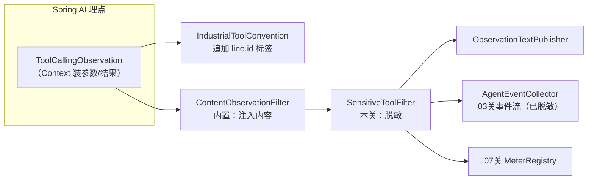
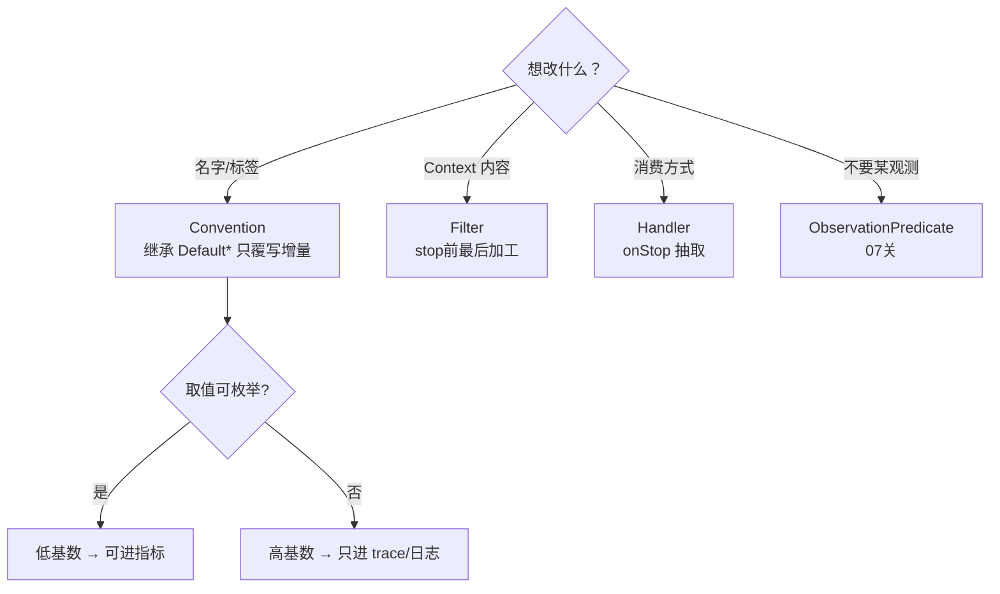

# 04 自定义 Convention 与 Filter：工业标签与内容脱敏

> **定位**：03 关的事件流没有"业务身份"——不知道是哪条产线、哪张工单；而 `log-prompt=true` 打开的内容裸奔在生产环境也不行。这一关用两个扩展点补齐：**Convention 给观测注入工业标签**（产线、工单类型），**Filter 在 stop 前做脱敏**（设备参数里的敏感字段）。这是"自定义什么、什么时候自定义"的决策地图篇。
>
> **前置阅读**：[附录 18-Observation/03]。

---

## 4.1 两个扩展点的分工（先立决策表）

| 需求 | 用什么 | 为什么不是另一个 |
|---|---|---|
| 给 span 加统一业务标签（产线/环境/租户） | **Convention** | 标签属于"命名格式"职责；Handler 拿到的 KeyValues 已定型 |
| 对 prompt/工具参数里的敏感值脱敏 | **Filter** | Filter 在 stop 前最后改 Context；Handler 收到时已脱敏 |
| 改 span 名（如工具名带产线前缀） | **Convention**（`getName/getContextualName`） | 同上 |
| 丢弃某类观测（采样/降噪） | **ObservationPredicate**（07 关） | Filter 是"改"，Predicate 是"掐" |

## 4.2 业务上下文怎么进 Convention：先解决"传值"

Convention 被框架回调时，只有 `ToolCallingObservationContext`——产线号在 HTTP 请求参数里，怎么传进来？先把候选通道和坑讲清（**这里是原理辨析，本关最终代码不采用**）：

- **a. Reactor Context**：WebFlux 下的"官方通道"（铁律：禁 ThreadLocal）。但 `chatClient...call()` 是同步阻塞调用，Reactor Context 在这条调用里**取不到**——只有换成 08 关的 `.stream()` 全响应式链路才成立。这是很多团队在 WebFlux + Spring AI 上踩的第一个坑：`.contextWrite()` 写了，工具/Convention 里读不到；
- **b. Spring AI 的 `ToolContext`**：`.prompt().toolContext(Map.of("line.id", line))` 把业务身份随提示传给工具执行链——生产推荐，工具回调里能拿到这个 Map；
- **c. 从领域数据解析**：设备编号本身含产线信息（`CNC-001`、`AGV-07`），Convention 直接从工具参数里解析产线前缀。

为了保持 demo 简约且贴工业真相，本关采用 **c**（b 在 08 关流式改造后再演示成本更低）。c 演示的本质不变——**Convention 能基于 Context 里的领域数据动态生成标签**。本关新增文件 `ObsConventionConfig`（完整文件）：

```java
// src/main/java/demo/demo01/obs/ObsConventionConfig.java（完整文件）
package demo.demo01.obs;

import io.micrometer.common.KeyValue;
import io.micrometer.common.KeyValues;
import org.springframework.ai.tool.observation.DefaultToolCallingObservationConvention;
import org.springframework.ai.tool.observation.ToolCallingObservationContext;
import org.springframework.context.annotation.Bean;
import org.springframework.context.annotation.Configuration;
import org.springframework.context.annotation.Primary;

@Configuration
public class ObsConventionConfig {

    /**
     * 覆盖默认工具 Convention：追加工业低基数标签 line.id。
     * @Primary：容器里已有自动装配的 DefaultToolCallingObservationConvention，
     * 显式声明优先级，确保装配不歧义。
     */
    @Bean
    @Primary
    public IndustrialToolConvention industrialToolConvention() {
        return new IndustrialToolConvention();
    }

    public static class IndustrialToolConvention extends DefaultToolCallingObservationConvention {

        @Override
        public KeyValues getLowCardinalityKeyValues(ToolCallingObservationContext context) {
            return super.getLowCardinalityKeyValues(context).and(lineId(context));
        }

        private KeyValue lineId(ToolCallingObservationContext context) {
            String args = String.valueOf(context.getToolCallArguments());   // {"deviceId":"CNC-001",...}
            java.util.regex.Matcher m = java.util.regex.Pattern
                    .compile("\"(CNC|AGV)-").matcher(args);
            String prefix = m.find() ? m.group(1) : "unknown";
            return KeyValue.of("line.id", prefix);   // CNC/AGV 可枚举 → 低基数，可进指标
        }
    }
}
```

> demo 里正则取前缀够用；生产推荐 `ToolContext` 或从配置中心拿"设备→产线"映射表（设备字典）。**原理不变：低基数标签必须可枚举**（`CNC/AGV/unknown` 三种，安全）；`deviceId` 全量值则永不进低基数。

`@Bean` 一个 Convention 即完成替换：Boot 自动装配发现容器里有 `ToolCallingObservationConvention` 类型的 Bean，`Default` 退位（同一类型取你的是否生效取决于装配覆盖规则——实测时若两者并存，用 `@Primary` 明确优先）。

## 4.3 Filter：stop 前的脱敏质检

`ToolCallingContentObservationFilter`（Spring AI 内置，随 `include-content=true` 起效）负责把内容放进 Context；我们要在它**之后**再洗一遍敏感字段。本关新增文件 `ObsFilterConfig`（完整文件）：

```java
// src/main/java/demo/demo01/obs/ObsFilterConfig.java（完整文件）
package demo.demo01.obs;

import io.micrometer.observation.Observation;
import io.micrometer.observation.ObservationFilter;
import org.springframework.ai.tool.observation.ToolCallingObservationContext;
import org.springframework.context.annotation.Bean;
import org.springframework.context.annotation.Configuration;

@Configuration
public class ObsFilterConfig {

    @Bean
    public ObservationFilter sensitiveToolFilter() {
        return context -> {
            if (context instanceof ToolCallingObservationContext tc
                    && tc.getToolCallResult() != null) {
                tc.setToolCallResult(mask(tc.getToolCallResult()));   // 结果里的敏感数值脱敏
            }
            return context;
        };
    }

    private static String mask(String s) {
        return s == null ? null : s.replaceAll("\"temp\"\\s*:\\s*[0-9.]+", "\"temp\":\"***\"");
    }
}
```

三个决策说明：

1. **脱敏放 Filter 不放 Handler**：Filter 在所有 Handler 的 stop 消费前执行（02 关时序图），一次加工、处处安全；放 Handler 则每个 Handler 都要记得洗，漏一个就泄露。
2. **只洗高基数内容字段**：`temp` 这类工艺参数在你厂里若属机密，就该这么拦；KeyValues 里的 `gen_ai.tool.call.name` 是可枚举工具名，无需洗。
3. **demo 用正则，生产用结构化方案**：JSON 用 Jackson 解析后按字段白名单重建——正则脱敏对复杂嵌套不可靠（这是刻意的工业提醒，不是本文偷懒）。

## 4.4 组件协作全景（本关后你的观测管线）



注意箭头顺序：Convention 决定的是**标签**（旁路），Filter 决定的是**Context 内容**（主线）——两者共同保证"消费侧拿到的都是合规数据"。

## 4.5 什么时候自定义——决策地图（本系列的进阶总纲之一）



## 4.6 Postman 测试

| 用例 | 请求 | 预期现象 |
|---|---|---|
| 标签生效 | `GET /demo01/inspect?prompt=查CNC-001状态`，看 console 的 tool 观测 | KeyValues 出现 `line.id='CNC'`；问 AGV-07 则为 `line.id='AGV'` |
| 脱敏生效 | 同上，看 `AgentEventCollector` 输出或 `/demo01/events` | `TOOL` 事件 detail 中 `"temp":78.5` 变为 `"temp":"***"` |
| 默认行为保留 | 任意工具调用 | `gen_ai.tool.call.name`、`spring.ai.kind` 等默认标签仍在（继承的增量式覆写没推翻默认） |
| 事件流对照 | `GET /demo01/events` | detail 已是脱敏后文本——验证 Filter 先于 Handler |

## 4.7 本关沉淀

- Convention 管标签/命名，Filter 管 Context 收尾加工，职责不混；
- 业务身份传值：WebFlux 下禁 ThreadLocal，demo 从领域数据解析，生产用 ToolContext/字典服务；
- 增量式覆写（继承 Default）优于推翻重写——默认行为是生态共识，别轻易丢；
- 脱敏必须在 Filter 层一次完成，正则只配 demo，生产用结构化白名单。

**下一关**：事件流已合规，把它推到前端页面实时展示。→ [附录 18-Observation/05]
