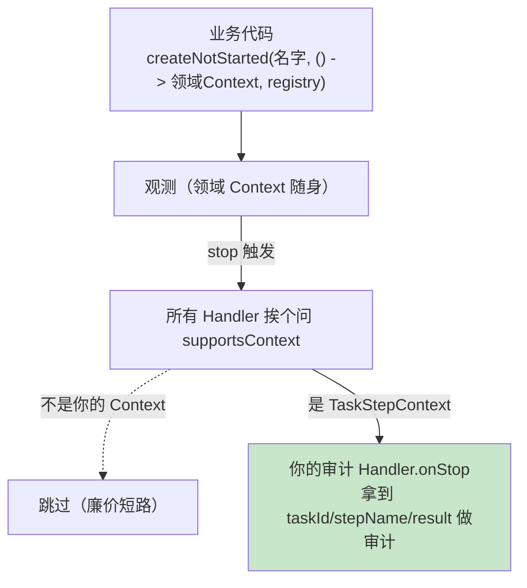

# 04 自定义扩展一：领域 Context 与类型化 Handler 做审计

> **定位**：第 03 关你看到的 `http.server.requests`、`gen_ai.*` 都很"通用"——它们不知道业务。这一关开始给观测装上**业务语义**：定义**领域 Context**（装"这是哪个任务/哪次工具调用"）+ **类型化 Handler**（只认自己的 Context，`onStop` 时拿业务字段做审计）。这是你"造自己观测类型"的第一步，也是 Spring AI 内部每个埋点（chat/model/tool）的同款机制——理解它，你就能定制框架埋点。
>
> **进阶路径**：在之前工程上加"领域观测"这一层。
>
> **前置**：[03 Boot 自动装配] 已引入注入 Bean。
>
> **版本基准**：Spring Boot 4.1.0 + micrometer 1.17。代码已实测。

---

## 1. 你现在的观测缺了什么

`http.server.requests` 很通用，但它**不知道业务**：这是"查天气"还是"下单"？工具调用结果多少、失败原因是什么？审计系统要的是**业务级**的观测。

Observation 解决这个的办法：**自定义 Context（领域上下文）+ 自定义 Handler（类型化）**。链路是这样：



核心两件事：
- **领域 Context**：把业务字段（taskId/stepName/result）放进 `Observation.Context` 子类。
- **类型化 Handler**：`supportsContext(context)` 判断"这观测是不是我要的那种"；是，就强转领域 Context 拿字段干活。

---

## 2. 动手：一个"Agent 任务步骤"的领域观测 + 审计 Handler

工程新增 `ObsStep5Config.java`（包 `demo.demo01.step5`）。这次**扩展 Bean 放独立 @Configuration**（避免第 03 关误区 4 的循环依赖），**接口沿用 `@RestController` 注册**。完整可复制：

```java
package demo.demo01.step5;

import io.micrometer.common.KeyValue;
import io.micrometer.observation.Observation;
import io.micrometer.observation.Observation.Context;
import io.micrometer.observation.ObservationRegistry;
import io.micrometer.observation.ObservationHandler;
import org.springframework.context.annotation.Bean;
import org.springframework.context.annotation.Configuration;
import org.springframework.web.bind.annotation.GetMapping;
import org.springframework.web.bind.annotation.RestController;
import java.time.Duration;

@RestController
public class ObsStep5Config {

    // ========== ① 领域 Context：装"哪个任务/哪个步骤"，Handler 靠它拿业务字段 ==========
    public static class TaskStepContext extends Context {
        private final String taskId;
        private final String stepName;
        private String result;                 // stop 前由业务写入

        public TaskStepContext(String taskId, String stepName) {
            this.taskId = taskId;
            this.stepName = stepName;
        }

        // —— 业务字段的 getter（"类型化取字段"：Handler 用它，不翻字符串标签）——
        public String getTaskId()   { return taskId; }
        public String getStepName() { return stepName; }
        public String getResult()   { return result; }
        public void setResult(String r) { this.result = r; }
    }

    // ========== ② 类型化 Handler：只认 TaskStepContext，onStart/onStop 做审计 ==========
    // （Observation.Context 没有 getDuration()，用 put/get 自记起止——[01 §回调]）
    private static final Object START_KEY = new Object();

    @Bean
    ObservationHandler<Context> taskStepAuditHandler() {
        return new ObservationHandler<>() {

            @Override
            public boolean supportsContext(Context ctx) {
                // ★ 廉价短路：判断"是不是我要的观测类型"（每个观测×每个 Handler 都会问）
                return ctx instanceof TaskStepContext;
            }

            @Override
            public void onStart(Context ctx) {
                ctx.put(START_KEY, System.nanoTime());      // 记起始时间（状态袋 put）
            }

            @Override
            public void onStop(Context ctx) {
                TaskStepContext t = (TaskStepContext) ctx;   // 强转拿领域字段
                Long st = ctx.get(START_KEY);
                long ms = st != null
                        ? Duration.ofNanos(System.nanoTime() - st).toMillis()
                        : -1;
                // ★ 这就是你的"审计落库点"（本 demo 打控制台；真实工程缓冲异步写——见 §6）
                System.out.println("[audit] task=" + t.getTaskId()
                        + " step=" + t.getStepName()
                        + " result=" + t.getResult()
                        + " durationMs=" + ms
                        + " error=" + (ctx.getError()==null ? "none" : ctx.getError().getClass().getSimpleName()));
            }
        };
    }

    // ========== ③ 业务侧：函数式 + 领域 Context；结果写进 Context（stop 前 → onStop 可见） ==========
    @GetMapping("/domain/task")
    public String doTask() {
        TaskStepContext ctx = new TaskStepContext("t-1", "extract");
        int n = Observation.createNotStarted("agent.task.step", () -> ctx, registry())
                .lowCardinalityKeyValue("step.name", "extract")   // 有界 → 指标 tag
                .highCardinalityKeyValue("task.id", "t-1")        // 无界 → 只进 Span
                .observe(() -> {
                    ctx.setResult("实体x3");                        // ★ stop 前写入 → onStop 可见
                    return 3;
                });
        return "n=" + n + ", result=" + ctx.getResult();
    }

    @GetMapping("/domain/task-error")
    public String doTaskError() {
        TaskStepContext ctx = new TaskStepContext("t-9", "failStep");
        try {
            Observation.createNotStarted("agent.task.step", () -> ctx, registry())
                    .observe(() -> { throw new IllegalStateException("任务步骤失败"); });
            return "不可能到这";
        } catch (IllegalStateException e) {
            return "task failed, error recorded";
        }
    }

    // ⚠ 教学用：自建 registry 并手工挂 Handler（见下方"接到 Boot 上"）。真实工程注入 Boot Bean
    private ObservationRegistry registry() {
        return ObsStep5BeansConfig.STANDALONE_REGISTRY;
    }
}

// ========== 独立配置类：教学用"standalone registry"承载 Handler ==========
class ObsStep5BeansConfig {
    static final ObservationRegistry STANDALONE_REGISTRY = ObservationRegistry.create();
    static {
        STANDALONE_REGISTRY.observationConfig()
                .observationHandler(new ObsStep5Config.TaskStepAuditHandlerSupplier().get());
    }
}
```

> **⚠ 教学说明**：第 04 关的重点是"领域 Context + Handler"机制，为让你先看懂，上面用了自建 registry + 手工挂 Handler。**真实工程请改用第 4 节的方式**：把 Handler 注册为 `@Bean`，boot 自动收集，业务注入 Boot 的 `ObservationRegistry`。

---

## 3. 关键认知：结果写回 Context，Handler 从 Context 读

第 04 关最反直觉也最重要的一点：**Handler 不反查你的业务对象，它只认 Context**。

| 正确（推荐） | 错误（不推荐） |
|---|---|
| 业务在 `observe` 里把 `result` 写进 `ctx`，`onStop` 从 `ctx.getResult()` 读 | Handler 里 `service.getCurrentTask()` 反查业务 |

**为什么？** Handler 与业务**解耦**——它不知道你业务怎么存状态，只认 Context 这个"唯一通道"。这也是 Spring AI 内部工具观测（`ToolCallingObservationContext`）的做法：装 `toolDefinition/toolCallArguments/toolCallResult`，Handler 强转取用。

**traceId 怎么拿？**（[07 §tracer]）`onStop` 时 Scope 通常已关闭，`Tracer.currentSpan()` 可能为 null——所以 **traceId 应在 stop 前写进 Context**，或走传播机制（[07]），别在 Handler 里寄望"当前 Span"这个线程态。

---

## 4. 把它接到 Boot 上（真实工程的姿势）

教学用的自建 registry + 手工注册，真实工程改成**注册为 Bean**——Boot 自动装配收集，业务注入 Bean registry：

```java
package demo.demo01.step5;

import io.micrometer.observation.Observation.Context;
import io.micrometer.observation.ObservationHandler;
import org.springframework.context.annotation.Bean;
import org.springframework.context.annotation.Configuration;
import java.time.Duration;

// ★ 独立 @Configuration：把 Handler 注册为 @Bean，Boot 自动装配收集
//   （别放进"构造器注入 registry 的主配置类"，避免循环依赖——[03 §误区4]）
@Configuration
public class ObsStep5BeansConfig {
    private static final Object START_KEY = new Object();

    @Bean
    ObservationHandler<Context> taskStepAuditHandler() {
        return new ObservationHandler<>() {
            @Override public boolean supportsContext(Context ctx) {
                return ctx instanceof ObsStep5Config.TaskStepContext;
            }
            @Override public void onStart(Context ctx) { ctx.put(START_KEY, System.nanoTime()); }
            @Override public void onStop(Context ctx) {
                ObsStep5Config.TaskStepContext t = (ObsStep5Config.TaskStepContext) ctx;
                Long st = ctx.get(START_KEY);
                long ms = st != null ? Duration.ofNanos(System.nanoTime() - st).toMillis() : -1;
                // ... 落审计事件（真实工程：写库/发 Kafka 请走 §6 的异步缓冲）
            }
        };
    }
}
```

Boot 的 `ObservationRegistryPostProcessor` 会把这个 Bean 收进自动装配的 registry——**你不需手工注册**。之后业务只需注入 Boot 的 `ObservationRegistry`（[03]），`createNotStarted(...)` 就会走这个 Handler。

---

## 5. 观察与测试

```bash
curl http://localhost:18080/domain/task
# 控制台： [audit] task=t-1 step=extract result=实体x3 durationMs=? error=none
curl http://localhost:18080/domain/task-error
# 控制台： [audit] task=t-9 step=failStep result=null durationMs=? error=IllegalStateException
```

**测试**——断言审计 Handler 记下了失败工具的异常类型（error 进观测）：

```java
package demo.demo01.step5;

import io.micrometer.observation.Observation;
import io.micrometer.observation.tck.TestObservationRegistry;
import io.micrometer.observation.tck.TestObservationRegistryAssert;
import org.junit.jupiter.api.Test;
import static demo.demo01.step5.ObsStep5Config.TaskStepContext;

class AuditHandlerTest {

    @Test
    void failed_step_is_captured_as_observation_with_error() {
        TestObservationRegistry reg = TestObservationRegistry.create();
        try {
            Observation.createNotStarted("agent.task.step", () -> new TaskStepContext("t", "s"), reg)
                    .observe(() -> { throw new IllegalStateException("boom"); });
        } catch (IllegalStateException ignored) {}
        TestObservationRegistryAssert.assertThat(reg).hasObservationWithNameEqualTo("agent.task.step");
        // 真实断言里可进一步检查该观测的 error 类型（遍历 Handler 或扩展断言）
    }
}
```

---

## 6. 一个易忽略但重要的纪律：Handler 同步路径只入队

`onStop` 在**业务线程上同步执行**——如果你的审计 Handler 在这里写库/发 HTTP/Kafka，它会**拖慢整个业务请求**（把可观测变成性能税）。

正确写法：**同步路径只入队，异步批量出**（缓冲 + 独立线程）。这是 [06 §成本管道]、[08 综合实战] 都会用到的模式，先记下纪律：

```java
private final java.util.concurrent.BlockingQueue<String> buffer =
        new java.util.concurrent.ArrayBlockingQueue<>(10_000);   // 有界，满则丢最旧+计数

@Override public void onStop(Context ctx) {
    buffer.offer("审计事件..." + ctx.getName());   // 同步只入队（非阻塞）
}

@org.springframework.scheduling.annotation.Scheduled(fixedDelay = 1000)
void drain() {
    java.util.List<String> batch = new java.util.ArrayList<>(512);
    buffer.drainTo(batch, 512);                    // 批量出队
    if (!batch.isEmpty()) {
        System.out.println("[drain] " + batch.size() + " 条审计待异步落库");
        // publisher.publishBatch(batch);          // 异步批量写库/发 Kafka
    }
}
```

> 需要 `@EnableScheduling`。队列有界 + 满则丢（并暴露丢弃计数指标）是这个模式的纪律（[06 §MeterFilter]、[08 §生产清单]）。

---

## 7. 这一关我该体会到的知识点（关联展开）

- **领域 Context = 方式② (自定义Context) 的真正用武之地**（[02 §1]）。
- **类型化 Handler（supportsContext 分流）**：一个观测会被发往所有 Handler，靠 supportsContext 各自认领——这是"一观测多消费"（指标+审计+日志）的机制基础（[01 §回调]）。
- **onStop 主战场**：你亲手上手了"在 onStop 落审计"（[01 §生命周期]）。
- **结果写回 Context，Handler 从 Context 读**：业务/Handler 解耦（[02 §Context 状态袋]）。
- **异步纪律**：Handler 同步只入队，异步批量出（[06 §成本管道]/[08]）。

---

## 8. 适用场景与不适用场景（这一关）

**适用**：给任务/工具/审批等**业务步骤**建带语义的观测 + 审计/事件消费；理解 Spring AI 内部埋点为何是"领域 Context + 类型化 Handler"；定制框架埋点（给 spring.ai.tool 补业务标签）。

**不适用**：只想要通用 HTTP 观测（[03]已给）；想在多个观察维度（指标/审计/告警）间用一个 Handler 干所有事——应拆成多个 Handler 靠 supportsContext 各自分流。

---

## 9. 常见误区（这一关）

1. **Handler 直接写库/发 HTTP**——`onStop` 同步执行，重活拖慢业务；同步只入队，异步批量出（§6）。
2. **Handler 反查业务对象拿结果**——应写进 Context、从 Context 读（解耦）。
3. **在 `supportsContext` 里做重逻辑/反射/IO**——每个观测 × 每个 Handler 都会调，代价线性放大。
4. **找 `Observation.Context.getDuration()`**——不存在（实测）；要时长用 `put/get` 自记起止（§2/§4）。
5. **把 Handler 放构造器注入 registry 的主类 @Bean**——循环依赖；独立 `@Configuration`。
6. **`createNotStarted(String, ctx, registry)` 直接传 Context 实例**——第二个参数是 `Supplier`，要 `() -> ctx`（[02 §1] 强调）。

---

## 10. 总结

这一关你给观测装了**业务语义**：定义领域 `TaskStepContext`、写类型化 `taskStepAuditHandler`（onStart 记时 / onStop 审计）、业务用 `observe()` + 领域 Context 并回写结果，还学会了异步落库纪律。你已经能**造出自己类型的观测**并消费它——这就是定制框架埋点的能力（[05] 会用它给 spring.ai.tool 补标签）。

下一关 [05 自定义扩展二]：用 **Convention（批量定标签）/ Filter（脱敏加工）/ Predicate（降噪）** 三个扩展点把观测打磨成你想要的形状。

**外部来源**：[Micrometer Observation – Handlers](https://micrometer.io/docs/observation#_handlers) · [Micrometer Observation – Context](https://micrometer.io/docs/observation#_context_view)
