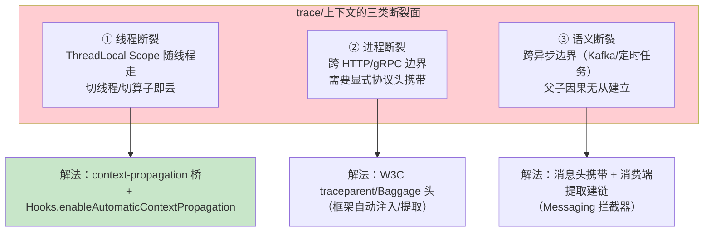
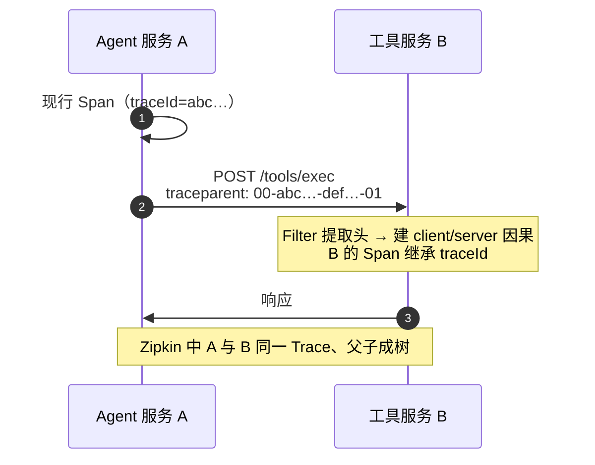
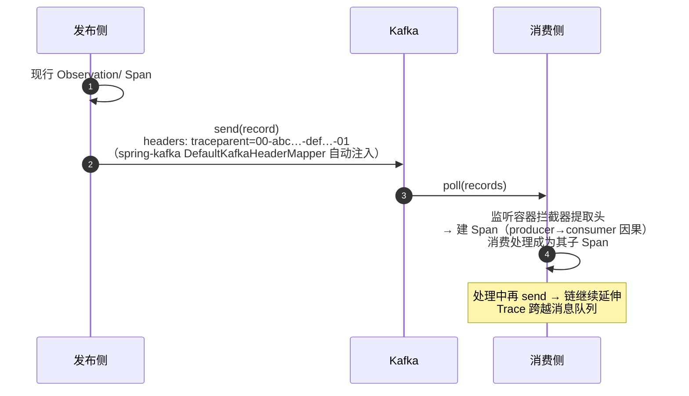

# 链路追踪与上下文传播

> **定位**：本文解决 Observation/Tracing 最难的部分——**跨越边界后 trace 还连得上吗**：HTTP 服务间传播（W3C Trace Context）、Reactor 链上 Scope/ThreadLocal 断裂与 context-propagation 桥、虚拟线程、Kafka 消息头、@Async/@Scheduled 与自定义线程池。每一节都是 WebFlux 铁律在观测层的落地（禁止 ThreadLocal 传递请求上下文 → 用 Reactor Context）。
>
> **读者画像**：读完 [附录 18-Observation/00-03]、要搭微服务链路（[教程 21-微服务拆分与Agent部署]）或排查"Trace 断在服务 B"问题的工程师。
>
> **前置阅读**：[附录 18-Observation/01 §2]（Scope 的 ThreadLocal 语义）；[附录 06-WebFlux与响应式编程/00-Reactor核心]；[17-Kafka/09-Spring集成与Agent事件驱动落地 §5]（消息层传播的架构位）。
>
> **版本基准**：Micrometer Tracing 1.x（Boot 4.1 管理）；context-propagation 库 1.x；OTel bridge。

---

## 1. 为什么会断：传播的三个断裂面



对应到本体系的真实事故面：①=教程 22/23 的 MDC 反模式（ThreadLocal 在 Reactor 下不可靠）；②=Agent 服务→工具服务（[教程 21 §5]）；③=事件骨干上的投影管道（[17-Kafka/09 §5]）。

## 2. Micrometer Tracing 门面与 bridge

依赖（**需在 pom.xml 中添加依赖**，Boot BOM 管理版本；二选一）：

```xml
<!-- 路线 A：OTel bridge（推荐，生态与 OTLP 直通） -->
<dependency>
    <groupId>io.micrometer</groupId>
    <artifactId>micrometer-tracing-bridge-brave</artifactId>
</dependency>
<dependency>
    <groupId>io.opentelemetry</groupId>
    <artifactId>opentelemetry-exporter-zipkin</artifactId>
</dependency>
<!-- 或路线 A：micrometer-tracing-bridge-otel + OTLP exporter -->
```

门面 API（业务代码只见它，不见 Brave/OTel）：

```java
// 真实 API（[附录 05-02 §3.1] 基准：Tracer.currentSpan() 是 traceId 的真实取法）
Tracer tracer;                                  // Boot 自动装配的 Bean
Span span = tracer.nextSpan().name("manual.step").start();
try (Tracer.SpanInScope ws = tracer.withSpan(span)) {
    // ... 业务
} finally {
    span.end();
}
String traceId = tracer.currentSpan().context().traceId();   // 当前 traceId
```

**分工纪律**：手写 Span 场景极少——优先用 Observation（自动带指标），Tracer 只用于"取当前 traceId 回填响应头/审计记录"这类读取型需求（[附录 18-Observation/03 §1]）。

## 3. HTTP 传播：自动注入/提取的条件

服务端（WebFlux ServerHttpObservationFilter）与客户端（WebClient）在 **bridge 存在 + 传播器可用**时自动做 W3C 注入/提取：



三个"自动"的前提，缺一即断：

1. 客户端用**框架内建通道**（WebClient/RestClient）——自己 `HttpClient.new()` 裸发不带头；
2. 双方 classpath 都有 **bridge + 传播器**；
3. 中间设施**不剥离未知头**（网关/Nginx 默认保留，自研代理要显式透传 `traceparent`/`tracestate`/`baggage`）。

Baggage（随 Trace 携带的业务行李，如 tenant-id）：`management.tracing.baggage.remote-fields: tenant-id` 声明后跨服务传播并可映射 MDC（本地日志关联，[附录 18-Observation/02 §3.2]）。

## 4. Reactor：Scope 断裂与自动传播

Reactor 的算子可能切线程（flatMap→boundedElastic），ThreadLocal Scope 在切点即丢。两层解法：

### 4.1 Hooks 自动传播（框架级，一次开启）

```java
// Boot 4.1：装了 context-propagation + tracing 后自动开启（可显式确认）
Hooks.enableAutomaticContextPropagation();
```

效果：Reactor 在订阅/信号传递时自动把 ThreadLocal 上下文（Observation Scope、MDC、SecurityContext 等）桥接到 Reactor Context 并在切换线程后恢复——[教程 26 §3.2] 的 WebFilter 写 Reactor Context、[附录 18-Observation/03 §3] 的 Filter 读上下文，从此自动闭环，不再需要手写桥接。

### 4.2 显式 Reactor Context（精确控制时）

```java
// 写入：边界处放业务身份（只对上游订阅链可见）
Mono<Void> pipeline = webFilterChain.filter(exchange)
        .contextWrite(ctx -> ctx.put("tenantId", resolveTenant(exchange)));

// 读取：deferContextual 惯用法——在链内同一段完成取值与消费
//（[附录 06-WebFlux与响应式编程/00-Reactor核心] 语义：Context 自下而上传播）
mono.flatMap(value -> Mono.deferContextual(ctx -> {
    String tenantId = ctx.get("tenantId");
    return doSomething(value, tenantId);      // 消费在同一段内完成
}));
```

原则不变：**Reactor 链上取业务身份，一律 Reactor Context（或 Hooks 自动桥），禁 ThreadLocal**。

### 4.3 判别表

| 你的场景 | 用什么 |
|---------|--------|
| 普通响应式服务（Boot 4.1） | 什么都不做：Hooks 自动传播 + Filter 自动建链 |
| 响应式链里开子观测 | `.name().tap(Micrometer.observation(registry))`（[附录 18-Observation/03 §5]） |
| 链里取租户/用户身份 | Reactor Context（contextWrite/deferContextual） |
| 日志想带 traceId | 依赖 MDC 映射 + Hooks（自动恢复），pattern 加 `%X{traceId}` |
| 阻塞代码（虚拟线程/MVC） | 传统 Scope/ThreadLocal 语义照常有效 |

## 5. 虚拟线程（Java 21）

虚拟线程仍是 Java 线程——**ThreadLocal 语义照常工作**，Observation Scope/MDC 在同一虚拟线程内连续执行时无断裂。两个注意点：

1. **海量虚拟线程 = 海量 ThreadLocal 副本**：不要把大对象塞 ThreadLocal 又长寿（[附录 00-Java21新特性/00-虚拟线程] 的同款提醒）；观测上下文是小对象，无碍。
2. **结构化并发/线程池内跳转**照旧会断——虚拟线程解决的是"阻塞不贵"，不是"上下文自动跨线程"；跨线程仍走 §4 的传播机制。

## 6. Kafka：跨消息的因果链

[17-Kafka/09 §5] 已给架构位，这里给机制细节：



要点：**开箱条件**是 spring-kafka 的 observation 集成（`KafkaTemplate`/listener 容器开启 observation，配置键随版本核对）+ bridge 存在；消费侧重试/DLT 传播由 spring-kafka 的错误处理路径保留头。自写消费者（reactor-kafka）时要**手动提取头并开启 Scope**（`KafkaReceiver` 的 receive 不自动建链——这是它与 @KafkaListener 的能力差）。

## 7. @Async / @Scheduled / 自定义线程池

三个常断点与修法：

| 断点 | 现象 | 修法 |
|------|------|------|
| `@Async` 方法 | trace 断在提交处 | Boot 自动配置的 executor 已包装上下文传播；**自建线程池必须包 `ContextExecutorService`/`ContextPropagatingTaskDecorator`**（context-propagation 提供） |
| `@Scheduled` 任务 | 无父 Span（本来就是根） | 正常：它就是新 Trace 的根；给任务自己包 Observation 即可 |
| `CompletableFuture.supplyAsync` | commonPool 无上下文 | 包 `ContextExecutorService`，或改用带传播装饰的 executor |

```java
// 自建线程池的正确包装（context-propagation 真实类）
ExecutorService instrumented = new ContextExecutorService(rawExecutor);
// 提交的任务自动携带提交线程的 ThreadLocal 上下文（含 Observation Scope）
```

## 8. 适用场景与不适用场景

### 适用场景

- 多微服务 Agent 平台（[教程 21]）的跨服务 Trace：HTTP + Kafka 双通道
- WebFlux 全栈自动传播（Hooks）+ 关键链路显式 Reactor Context
- 多租户 Baggage（tenant-id 跨服务传播，[教程 26]）

### 不适用场景

- 单进程单线程脚本——无边界即无传播问题
- 把 Baggage 当配置中心——它随每请求传播，放小而必要（租户/用户标识），不放业务参数
- 跨组织外呼（第三方 LLM API）——对方不回传 traceparent，链到你的出口 Span 为止（出口 Span 仍记录调用与耗时）

## 9. 常见误区与反模式

1. **"Trace 断了就调采样率"**——采样只影响"留多少"，断链是传播问题；先看 §2 三个前提（内建通道/bridge/头透传）。
2. **自建线程池裸提交**——上下文静默丢失，表现为"日志里 traceId 时有时无"；一律 ContextExecutorService 包装。
3. **MDC 与 Reactor 混用不装 Hooks**——就是 [教程 22/23] 审计反模式的根因；Boot 4.1 自动开启，升级后旧代码应删除手写桥接。
4. **把 userId 写进 Baggage 又映射 MDC 再当日志 tag**——MDC tag 无界，日志体量与索引爆炸；Baggage 只放标识，聚合维度进低基数标签。
5. **外呼第三方当作断链故障**——预期行为，出口 Span 即终点。

## 10. 总结

传播问题=三个断裂面三个解：**线程断裂 → context-propagation/Hooks（Reactor 自动桥）+ ContextExecutorService（线程池包装）；进程断裂 → W3C 头自动注入/提取（内建通道+bridge+透传）；语义断裂 → 消息头携带/消费端建链（Kafka observation 集成）**。Boot 4.1 下大部分自动，但"自建线程池、裸 HttpClient、自写消费者"三类逃逸路径要显式处理。最后一篇把这些组装成 Agent 平台的完整观测闭环：[附录 18-Observation/05-SpringAI与Agent全链路实战]。

**外部来源**：[Micrometer Tracing](https://docs.micrometer.io/tracing/reference/) · [context-propagation](https://github.com/micrometer-metrics/context-propagation) · [W3C Trace Context 规范](https://www.w3.org/TR/trace-context/) · [spring-kafka Observation](https://docs.spring.io/spring-kafka/reference/kafka/observability.html)
