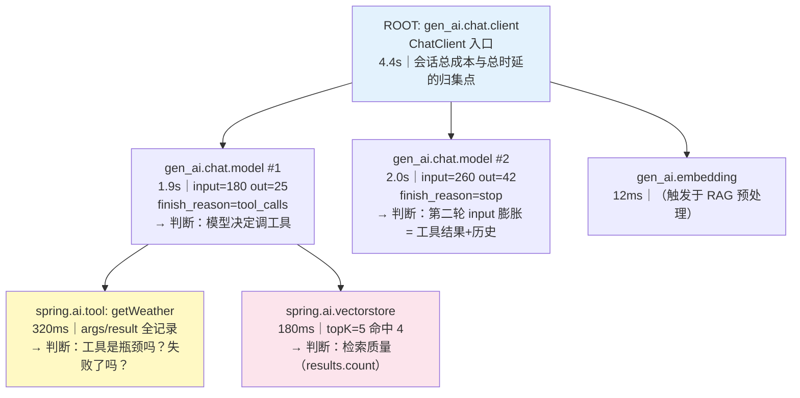
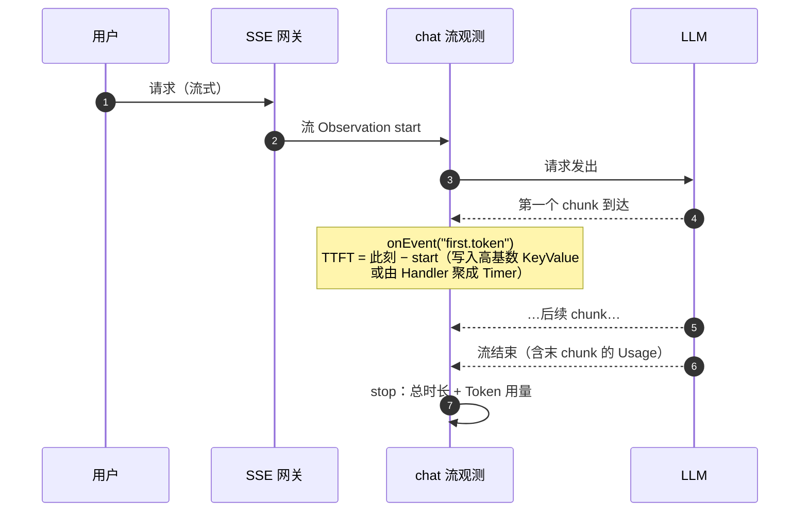
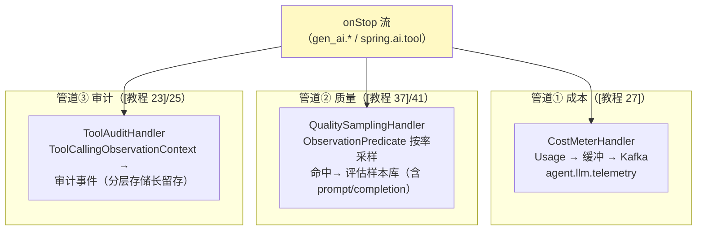

# Spring AI 与 Agent 全链路实战

> **定位**：Observation 主题收官篇——把前 5 篇组装成 Agent 平台的完整观测闭环：gen_ai 埋点全景与内容记录开关、一次多轮工具调用的 Span 树逐层解读、TTFT（首 Token 延迟）如何测、成本/质量/审计三条消费管道、生产清单与故障排查表。与 [教程 22-全链路可观测性]（需求侧总览）和 [教程 23-工具执行可观测与审计]（工具审计侧）互为表里：那两篇讲"要什么"，本文讲"机制怎么拼"。
>
> **读者画像**：正在把 Spring AI 2.0 Agent 服务推向生产的工程师；要为平台建成本计量（[教程 27]）、审计留存（[教程 25]）或质量监控（[教程 37]）的架构师。
>
> **前置阅读**：[附录 18-Observation/00-04] 全部；[教程 22 §4]（gen_ai 属性表）；[17-Kafka/09 §5]（观测→事件管道）。
>
> **版本基准**：Spring AI 2.0.0 + Spring Boot 4.1；所有 Spring AI 类型名以 [附录 05-SpringAI2-API基准/02] 为准。

---

## 1. gen_ai 埋点全景（机制层回顾）

[教程 22 §2] 已给总览，这里补机制视角的三个要点：

1. **Spring AI 的每个埋点都是"领域 Context + Convention"**（[附录 18-Observation/01 §4-§5] 的模式）：ChatClient/ChatModel/Tool/VectorStore/Embedding 各有自己的 ObservationContext 子类，Handler 用 `supportsContext` 类型分流——所以你写审计 Handler 时**不需要猜字符串**，按类型接（[附录 18-Observation/03 §1]）。
2. **内容记录是配置开关，不是默认**：聊天 Observation 的内容/日志开关是 `spring.ai.chat.observations.log-prompt` / `log-completion`（javap 实证 `ChatObservationProperties`，**无** `include-prompt-content` 键）；工具侧是 `spring.ai.tools.observations.include-content`（实证 `ToolCallingProperties$Observations`）——默认关闭是为了 PII 安全；开启时必须有配套脱敏（[附录 18-Observation/03 §3] Filter）。
3. **指标与 Span 同源**：同一个 onStop 派生 Timer 与 Span——"指标里工具失败率上涨 → Span 里点开看参数与结果"是同一次观测的两个视图（[附录 18-Observation/04 §1] 断裂面不存在，因为数据根本没分家）。

## 2. 一次多轮工具调用的完整 Span 树（逐层解读）

以"查北京天气并推荐穿搭"（2 轮 LLM + 1 工具 + 1 检索）为例，标注每层能回答什么问题：

解读示范（这就是排障工作流）：

- **总 4.4s 中 LLM 占 3.9s（89%）**→ 优化方向不在工具/检索，在模型侧（换档/减输入/并行，[教程 32-模型路由与降级]、[教程 38-Agent性能优化]）。
- **第二轮 input 260 > 第一轮 180**→ 工具结果与历史在膨胀上下文，长会话会恶化（[教程 34-上下文工程] 的数据证据）。
- **VectorStore 命中 4/5**→ 检索质量数据点，进质量管道（§4）。
- 每层的 traceId 相同——指标告警（失败率）与 Span 下钻（看 args）一次跳转（[附录 18-Observation/04 §3] 的同源机制）。

## 3. TTFT：流式 Agent 的第一 SLO

[教程 22] 审计指出 TTFT 承诺未兑现。机制层的落地法：

实现要点：TTFT 是**事件**不是 stop 差值——用 `observation.event(...)` 在首 chunk 处打点（[附录 18-Observation/01 §2.2]），Handler 聚合 `agent.ttft` Timer；**流式 Usage 在末 chunk**（[教程 02] 深化点同源），stop 时从 Context 领域字段取，别在首个 chunk 找。Reactor 侧打点嵌在 `.name().tap(...)` 管线里（[附录 18-Observation/03 §5]）。

## 4. 三条消费管道：成本 / 质量 / 审计

同一观测流，三种 Handler 分流（[附录 18-Observation/03 §4] 模式的三实例化）：

关键分工与纪律：

| 管道 | 触达条件 | 数据敏感性 | 量级控制 |
|------|---------|-----------|---------|
| 成本 | 全量（计量不能采样） | 低（无内容，只有 Usage/模型） | 缓冲批量 → Kafka，Streams 聚合（[17-Kafka/06 §4]） |
| 质量 | **采样**（Predicate 1-5%） | 高（含 prompt/completion）→ 必须脱敏（Filter） | 样本进评估集（[教程 41] 数据飞轮的在线采集端） |
| 审计 | 工具执行全量（合规要求） | 中-高（参数可能含 PII） | 分层存储 + 长留存（[17-Kafka/04 §5]） |

三条管道共用同一个 onStop——**口径永远一致**（这是"同源产出"的架构红利，[附录 18-Observation/00 §4]）。

## 5. 生产化清单（Observation 专项）

| # | 检查项 | 通过标准 |
|---|--------|---------|
| 1 | 依赖 | actuator + tracing bridge + exporter 三件齐（[附录 18-Observation/04 §2]） |
| 2 | 采样 | 生产头采样 ≤0.2；成本/审计管道不受采样影响（它们走 Handler，不走采样门） |
| 3 | 基数 | 每个低基数 tag 有界；`/actuator/metrics/<name>` 抽查 tag 取值数（[附录 18-Observation/02 §2]） |
| 4 | PII | include-content 开启处必有脱敏 Filter；审计事件入库前过 DLP（[教程 31-安全与权限控制]） |
| 5 | 传播 | 跨服务压测验证 trace 连续（网关透传 traceparent）；Kafka 链验证 producer→consumer 因果 |
| 6 | Handler 性能 | 同步路径只入队；队列有界 + 丢弃计数暴露为指标 |
| 7 | 埋点测试 | 关键 Handler 有 TestObservationRegistry 单测（[附录 18-Observation/01 §7.2]） |
| 8 | 噪音 | 健康检查/高频消费观测已 Predicate/配置降噪（[附录 18-Observation/02 §6]） |
| 9 | 端点 | `/actuator/prometheus`、`/actuator/metrics` 暴露且被采集 |
| 10 | 面板 | TTFT/P99/失败率/Token 趋势/租户成本五块基线面板（[教程 22 §7]） |

## 6. 故障排查表

| 症状 | 根因方向 | 快速验证 |
|------|---------|---------|
| 指标面板全空 | bridge/exporter 缺失或端点未暴露 | 清单 #1/#9；`/actuator/metrics` 列表 |
| Span 树只有一层 | 子观测发生在别的线程/未开启 Hooks | [附录 18-Observation/04 §4]；本地 TextPublisher 看父子 |
| 跨服务 Trace 断 | 头被剥离/裸 HttpClient/缺 bridge | 抓包看 traceparent；清单 #5 |
| Kafka 消费端无 Span | 自写 receiver 未建链 / 观测未开 | [附录 18-Observation/04 §6] |
| Prometheus 序列爆炸 | 高基数进低基数 | `/actuator/metrics/<name>` tag 数；清单 #3 |
| 延迟毛刺与 GC 同周期 | Handler 同步重活 | 队列指标；清单 #6 |
| traceId 日志时有时无 | 线程池裸提交 / MDC 未桥接 | [附录 18-Observation/04 §7]；ContextExecutorService |

## 7. 适用场景与不适用场景

### 适用场景

- 生产 Agent 平台的完整观测闭环（指标+Trace+成本+审计+质量采样同源）
- 需要向管理层/租户出成本报表（管道①直通 [教程 27] 的预算体系）
- 评估集在线采集（管道②喂 [教程 41] 飞轮）

### 不适用场景

- Demo/原型——Observation 全家桶是生产税；`ObservationRegistry.NOOP` 起步，结构留好（注入 Registry 而不是静态调用），后续无痛开启
- 无法落任何内容的强合规环境——关闭 include-content，只保留时长/用量/工具名（观测骨架仍然成立）
- 把观测流当业务数据源（如用 Span 里的参数做业务对账）——观测是观测，业务事件走 Outbox（[17-Kafka/03 §6]），两者目标与 SLA 不同

## 8. 常见误区与反模式

1. **三套口径**（指标一套、成本报表一套、审计一套）——全部收敛到同一 Handler 流；差异只在消费端（§4）。
2. **采样伤计量**——Trace 采样与 Handler 消费是两条门：计量/审计走 Handler（不采），Span 导出走采样（可采）；别用"我们采样了"解释成本报表缺数。
3. **TTFT 用总时长近似**——流式产品第一体验指标，必须首 chunk 打点（§3）。
4. **生产挂 TextPublisher / 全量 include-content**——性能与 PII 双输；本地工具不上生产。
5. **观测闭环没有"人"**——告警→面板→Span 下钻的路要打通（同一 traceId 串起指标与 Trace，[附录 18-Observation/04]），否则数据在、排障仍靠 grep。

## 9. 总结（主题总收束）

Observation 主题主线至此闭环：**[00] 门面模型（一次插桩三类数据）→ [01] API 与生命周期（函数式优先/基数分账）→ [02] Boot 自动装配（配置层开关/Bean 层定制）→ [03] 自定义扩展（Context/Convention/Filter/Handler 四件套）→ [04] 传播（线程/进程/消息三类断裂与桥接）→ [05] Agent 实战（gen_ai 定制/TTFT/三管道闭环）**。进阶两篇 [06-指标治理与Exemplars]（MeterFilter/SLO 桶/指标跳 Trace）与 [07-日志支柱与Collector]（traceId 进日志/尾采样）随后把数据面补全。它向上支撑 [教程 22-23] 的需求体系、[教程 27] 的成本治理、[教程 25] 的审计合规、[教程 41] 的数据飞轮——这就是"全链路可观测"四个字在机制层的全部含义。

**外部来源**：[Spring AI Observability](https://docs.spring.io/spring-ai/reference/api/observability.html) · [OTel gen_ai 语义约定](https://opentelemetry.io/docs/specs/semconv/gen-ai/) · [Micrometer Tracing](https://docs.micrometer.io/tracing/reference/)
