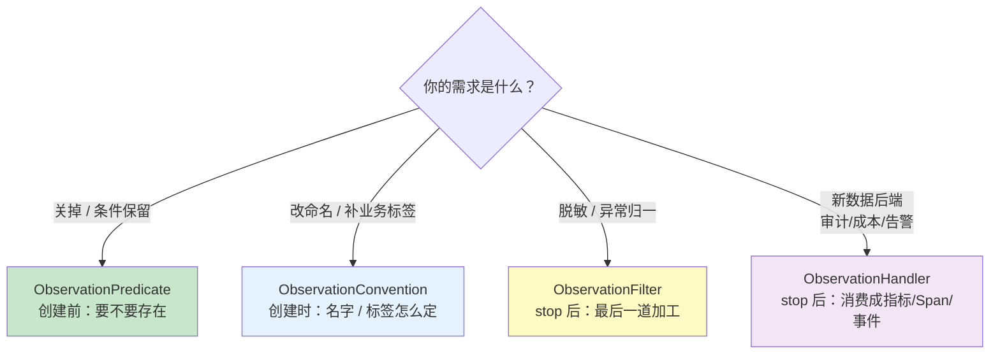

# 05 自定义扩展二：用 Convention、Filter、Predicate 打磨观测

> **定位**：第 04 关你造了"自己的观测类型"（领域 Context + Handler）。但还有三件打磨的事没解决：**不想每个观测手动加标签**（Convention）、**想在 stop 前脱敏/补全**（Filter）、**想掐掉不想要的观测**（Predicate）。这一关把这三个扩展点讲透——它们与 Handler 一起构成 Observation 的扩展点全家桶，也是"不改业务代码就定制观测"的钥匙。
>
> **进阶路径**：在之前工程上加"打磨"这一层。
>
> **前置**：[04 自定义扩展一]；[01 §5 生命周期]（Filter 在 stop 前）、[02 §3 基数]。
>
> **版本基准**：Spring Boot 4.1.0 + micrometer 1.17。代码已实测。

---

## 1. 先看扩展点全家桶四个就位

四个扩展点在一生观测量各管一段：



Handler（第 04 关）你已经用过。这一关专攻 **Convention / Filter / Predicate**——前两个改"观测长什么样"，Predicate 管"要不要有"。

---

## 2. Convention：不改业务代码，批量定命名与标签

**痛点**：你每个观测都想补 `tenant.tier`、`channel` 这类业务标签。一个个写 `lowCardinalityKeyValue` 很啰嗦，且改标签要改业务代码。

**Convention 的解法**：写一个约定，它替你"补全命名 + 标签"；业务代码只调 `createNotStarted(...)`，不用管标签。**把"命名/标签"从业务代码抽到一处，是零侵入定制框架埋点的关键。**

看一个真实 API 面（javap 实证 `ObservationConvention`）：

```
public interface ObservationConvention<T extends Observation.Context> {
    boolean supportsContext(Observation.Context);   // 唯一必须实现（abstract）
    // 以下全是 default，按需覆盖：
    default String getName();                        // 覆盖观测名（指标名）
    default String getContextualName(T ctx);         // 覆盖 Span 展示名
    default KeyValues getLowCardinalityKeyValues(T ctx);   // 补低基数标签
    default KeyValues getHighCardinalityKeyValues(T ctx);  // 补高基数标签
}
```

实现一个"聊天类"约定：

```java
package com.example.obsdemo.step6;

import io.micrometer.common.KeyValues;
import io.micrometer.observation.*;
import org.springframework.context.annotation.Bean;
import org.springframework.context.annotation.Configuration;
import org.springframework.web.reactive.function.server.RouterFunction;
import org.springframework.web.reactive.function.server.RouterFunctions;
import org.springframework.web.reactive.function.server.ServerResponse;
import static org.springframework.web.reactive.function.server.RequestPredicates.GET;

@Configuration
public class ObsStep6Config {

    // ① Convention：自动给"聊天类"观测补命名与标签
    public static class MyChatConvention implements ObservationConvention<Observation.Context> {

        @Override public boolean supportsContext(Observation.Context ctx) { return true; }

        // ① 覆盖观测名（实测：会覆盖 createNotStarted 里给的初始名）
        @Override public String getName() { return "agent.chat"; }

        // ② 补低基数（有界 → 指标 tag）
        @Override public KeyValues getLowCardinalityKeyValues(Observation.Context ctx) {
            return KeyValues.of("channel", "web", "tier", "pro");
        }

        // ③ 补高基数（无界 → 只进 Span）
        @Override public KeyValues getHighCardinalityKeyValues(Observation.Context ctx) {
            return KeyValues.of("user.id", "u-42");
        }
    }

    @Bean
    RouterFunction<ServerResponse> step6Routes() {
        return RouterFunctions.route(GET("/ext/conv"), req ->
            // 业务代码只给一个"初始名"，标签交给 Convention
            Observation.createNotStarted("explicit.name",
                        () -> new Observation.Context(), registry())
                    .observationConvention(new MyChatConvention())   // ★ 单观测挂载
                    .observe(() -> ServerResponse.ok().bodyValue("conv applied")));
    }

    private ObservationRegistry registry() { return ObsStep6Helper.REGISTRY; }
}

// 教学 helper（真工程注入 Boot Bean + Convention 也可注册为 Global Bean）
class ObsStep6Helper {
    static final ObservationRegistry REGISTRY = ObservationRegistry.create();
}
```

**实测效果**——即使你给了 `explicit.name`，Convention 的 `getName()` 把观测名改成了 `agent.chat`，并补上两个低基数 + 一个高基数：

```
START - name='agent.chat', low=[channel='web', tier='pro'], high=[user.id='u-42']
```

> **⚠ 解析顺序（重要，实测）**：`observationConvention(...)` 显式挂的 Convention **最优先**，覆盖 `createNotStarted` 里给的名字/标签。想改框架默认埋点（如 Spring AI 的 `spring.ai.tool`）标签而不动业务代码，就写一个 Convention 挂上去——这是 [03] 之后"零侵入定制"的标准姿势。

> **⚠ Registry 注册 vs 单观测挂载（易混，实测）**：`registry.observationConfig().observationConvention(conv)` **只接受 `GlobalObservationConvention`**（影响全部观测）；给**单个观测**定制用 `Observation.observationConvention(conv)`（挂类型化 `ObservationConvention`）。初学者常把类型化 Convention 传给 registry 编译报错。

---

## 3. Filter：stop 前最后一道加工（脱敏/归一）

**痛点**：开了内容记录（第 07/08 关 Spring AI 的 `log-prompt`），高基数里可能带手机号、卡号等 PII，必须脱敏。

**Filter 的定位**：在 **stop 之后、Handler 之前**执行（[01 §生命周期] 时序）——是"改 KeyValue 的最后机会"（`ObservationFilter.map(Context)`）。

```java
// ② Filter：把高基数 *.content 里的手机号/卡号打码
@Bean
ObservationFilter piiScrubbing() {
    java.util.regex.Pattern pii =
            java.util.regex.Pattern.compile("\\b\\d{11,19}\\b");   // 手机号/卡号形态
    return context -> {
        context.getHighCardinalityKeyValues().stream()
                .filter(kv -> kv.getKey().endsWith(".content"))
                .forEach(kv -> context.addHighCardinalityKeyValue(
                        io.micrometer.common.KeyValue.of(
                                kv.getKey(), pii.matcher(kv.getValue()).replaceAll("***"))));
        return context;
    };
}
```

**实测**——`/ext/pii?content=帮我查余额手机13800138000` 触发后，STOP 行里 `gen_ai.prompt.content` 从 `...13800138000` 变 `...***`：

```
START - name='chat.model', high=[gen_ai.prompt.content='帮我查余额手机13800138000']
  STOP - name='chat.model', high=[gen_ai.prompt.content='帮我查余额手机***']   ← 打码
```

> **为什么 PII 主要在 Filter 而不是 Handler？** PII 主要藏在高基数（Span/日志）里，[02 §3] 说高基数不进指标、只进 Span——所以要在**进 Span 之前**（Filter 在 stop 前，早于 Span 生成）打了。你开内容记录（第 07/08 关）必须有这个 Filter。

**Filter 还能做"异常归一"**：把各种超时折叠成一个低基数取值，保住低基数（[02 §3 训])。比如：

```java
if (context.getError() instanceof java.util.concurrent.TimeoutException) {
    context.addLowCardinalityKeyValue(io.micrometer.common.KeyValue.of("error.type", "timeout"));
}
```

---

## 4. Predicate：掐掉不想要的观测（降噪）

**痛点**：健康检查、内部轮询这类高频低值观测，既占指标序列又占 Span 存储。

**Predicate 在创建前拦截**（[01 ] 生命周期最早节点）：返回 `false` 表示"这个观测不要产生"——**连 Handler 的 `onStart` 都不会触发**。这才是真正的"降噪"（不只是少消费，是根本不产生）。

```java
// ③ Predicate：掐掉 internal.* 观测（ObservationPredicate extends BiPredicate<String, Context>）
@Bean
ObservationPredicate noiseControl() {
    return (name, ctx) -> !name.startsWith("internal.");
}
```

**实测**——触发 `internal.health` 观测，控制台**完全没有**该观测（只有外层 http.server.requests）：

```bash
curl http://localhost:18080/ext/noise
```

```
（只有 http.server.requests 的 START/STOP，没有任何 internal.health 观测）
```

> **降噪的代价意识**：为什么不全 Null？可观测系统自己也需要容量治理——高频低值观测会淹没真正有价值的 gen_ai.* 观测。用 Predicate 掐噪音，是"把监控预算花在刀刃上"（[06 §指标规范] 的大背景）。

> **Predicate vs 配置开关 vs 采样**（[05]/[03] 分工）：Predicate 是"条件化掐掉"（逻辑）；`management.observations.enable.<name>: false` 是"按观测名开关"（声明式）；sampler 是"按采样率留"（[07 §tracing] 的采样是另一维度）。**能用配置用配置，逻辑性才写 Bean**。

---

## 5. 完整 ObsStep6 扩展配置类（建议真实姿势：全部注册为 Bean）

把三个扩展点放独立 `@Configuration` 全注册为 `@Bean`（Boot 自动收集，[04 §4]），业务零感知：

```java
package com.example.obsdemo.step6;

import io.micrometer.common.KeyValue;
import io.micrometer.observation.*;
import org.springframework.context.annotation.Bean;
import org.springframework.context.annotation.Configuration;

@Configuration
public class ObsStep6ExtensionsConfig {

    // 降噪
    @Bean
    ObservationPredicate noiseControl() {
        return (name, ctx) -> !name.startsWith("internal.");
    }

    // 脱敏
    @Bean
    ObservationFilter piiScrubbing() {
        java.util.regex.Pattern pii = java.util.regex.Pattern.compile("\\b\\d{11,19}\\b");
        return context -> {
            context.getHighCardinalityKeyValues().stream()
                    .filter(kv -> kv.getKey().endsWith(".content"))
                    .forEach(kv -> context.addHighCardinalityKeyValue(
                            KeyValue.of(kv.getKey(), pii.matcher(kv.getValue()).replaceAll("***"))));
            return context;
        };
    }

    // Convention 若想全局生效：实现 GlobalObservationConvention 注册为 Bean
}
```

---

## 6. 这一关我该体会到的知识点（关联展开）

- **Convention** 补标签的"低/高基数分账" → 呼应 [02 §3]；解析顺序（显式挂载最优先）→ 呼应 [01/05]。
- **Filter** 脱敏 → 是[07/08]开内容记录的前提；也是 Agent 观测（[08]）的数据安全底线。
- **Predicate** 降噪 → 呼应 [03 §5 配置/逻辑分工]；可观测系统自身容量治理。
- **三个扩展点 + Handler**（[04])→ 扩展点全家桶齐了：Predicate(要不要)/Convention(怎么命名标签)/Filter(最后加工)/Handler(消费)。

---

## 7. 适用场景与不适用场景（这一关）

**适用**：批量给观测补业务标签（Convention）、高基数 PII 脱敏/异常归一（Filter）、按条件降噪（Predicate）。

**不适用**：用 Filter 做"路由/鉴权"类业务决策——它是观测数据加工层，不是业务中间件；Convention 里查外部服务补标签——它在 start 路径上同步执行，外部 RTT 直接加进业务延迟（[01 §生命周期]）。

---

## 8. 常见误区（这一关）

1. **`registry.observationConfig().observationConvention(conv)` 传类型化 Convention**——编译不过，Registry 只收 `GlobalObservationConvention`；单观测定制走 `Observation.observationConvention(conv)`（实测）。
2. **Convention 里查外部服务补标签**——start 路径同步执行，外部 RTT 加进业务延迟；补标签应只用已拿到的上下文。
3. **脱敏只做指标侧**——PII 主要在高基数（Span/日志），Filter 要覆盖高基数 content 标签（§3）；只脱低基数漏了 Span。
4. **Filter/Handler 里 `MDC.get("userId")` 取上下文**——WebFlux 下 ThreadLocal 失效（[07 §Reactor] 详讲）；业务身份走 Context 或 Reactor Context。
5. **降噪用 Filter 而非 Predicate**——Predicate 在创建前掐掉（不产生），Filter 是 stop 后加工；要"不产生"用 Predicate。

---

## 9. 总结

这一关你用三个扩展点把观测打磨成形：**Convention 自动补命名与标签、Filter 在 stop 前脱敏加工、Predicate 在创建前降噪**。与第 04 关的 Handler 一起，Observation 的扩展点全家桶集齐了——你已能**完全控制观测的形态与消费**，且不改业务代码。

下一关 [06 指标面板与治理]：把观测落到 Prometheus 面板，讲 SLO 桶、MeterFilter、Exemplars——让数据真正"看得见、能治理"。

**外部来源**：[Micrometer Observation–Conventions](https://micrometer.io/docs/observation#_observation_convention) · [Micrometer Observation–Filters/Predicates](https://micrometer.io/docs/observation#_observation_filters_observation_predicates)
