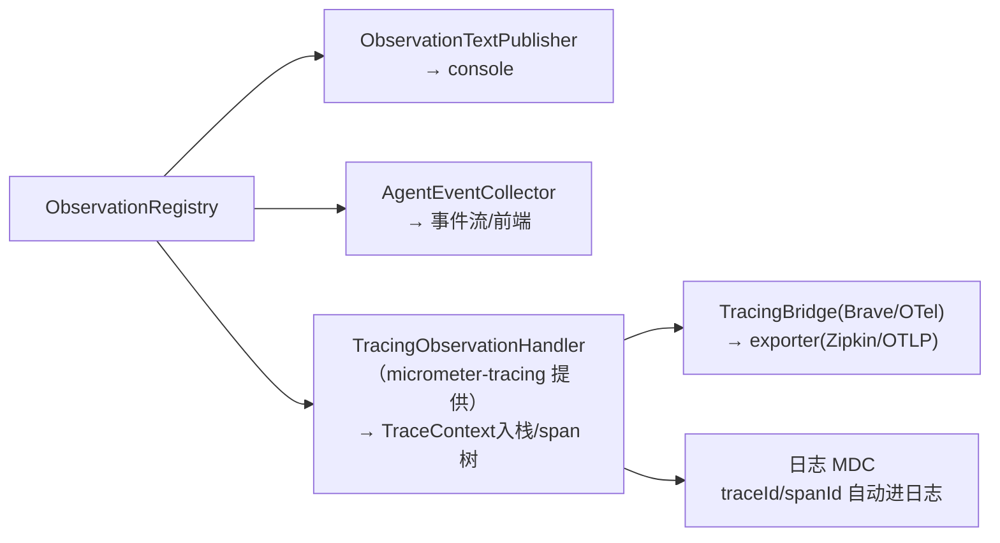
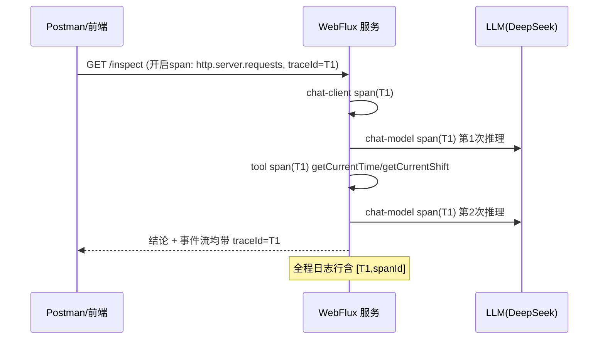

# 06 Trace 链路：traceId 贯穿 HTTP、LLM、工具与日志

> **定位**：你判断得对——Trace 与 Observation **天生一体**：Micrometer Tracing 就是一组特殊的 `ObservationHandler`（`TracingObservationHandler`），观测事件流转为 span 并织成链路。这一关引入 tracing bridge，让一次巡检请求拥有同一 `traceId`，并让日志带上看得见的 traceId——"报警时从日志一行定位全链路"正是工业运维的刚需。
>
> **前置阅读**：[附录 18-Observation/01]。

---

## 6.1 Trace 与 Observation 的关系（先破除神秘感）



核心认知：**你不需要"再学一套 Trace API"**——02 关那套 Registry/Handler 机制就是 Trace 的载具。引入 `micrometer-tracing-bridge-brave` 后，自动装配把 tracing Handler 挂进 Registry，既有的一切（事件流、Convention、Filter）原样工作，只是多了一条"span 树"输出。

WebFlux 关键一环：跨线程的 Reactor 链要开启上下文自动传播（06.3）。

## 6.2 依赖与配置

> **需在 pom.xml 中添加依赖**（新 profile，遵守 demo01 习惯——建议并入 `observation` profile 或单独 `tracing` profile）：

```xml
<dependency>
    <groupId>io.micrometer</groupId>
    <artifactId>micrometer-tracing-bridge-brave</artifactId>
</dependency>
<dependency>
    <groupId>io.zipkin.reporter2</groupId>
    <artifactId>zipkin-reporter-brave</artifactId>
</dependency>
<dependency>
    <groupId>io.zipkin.reporter2</groupId>
    <artifactId>zipkin-sender-urlconnection</artifactId>
</dependency>
```

（Boot 4.1 管理版本。OTel 桥 `micrometer-tracing-bridge-otel` 同理可选——工业里若已定 OTel 栈就选后者。）

```yaml
management:
  tracing:
    sampling:
      probability: 1.0        # demo 全采样；生产 0.05~0.2
  zipkin:
    tracing:
      endpoint: http://localhost:9411/api/v2/spans   # 需本地起 Zipkin（可选）
  endpoints:
    web:
      exposure:
        include: health,metrics,traces   # metrics 给 07 关用（Actuator 自带，零额外安装）
```

## 6.3 代码改动：三个 Java 文件 + 一段 yaml

**① `ApplicationDemo01`**（完整文件：main 里加一行 Reactor 自动传播，WebFlux 铁律的正解，02 关埋的伏笔）：

```java
// src/main/java/demo/demo01/ApplicationDemo01.java（本关完整版）
package demo.demo01;

import org.springframework.boot.SpringApplication;
import org.springframework.boot.autoconfigure.SpringBootApplication;
import reactor.core.publisher.Hooks;

@SpringBootApplication
public class ApplicationDemo01 {

    public static void main(String[] args) {
        Hooks.enableAutomaticContextPropagation();   // Reactor Context ↔ ThreadLocal 自动桥接（trace 跨线程不断）
        SpringApplication.run(ApplicationDemo01.class, args);
    }
}
```

**② `AgentEvent` 加 traceId 字段**（完整文件 v2）：

```java
// src/main/java/demo/demo01/obs/AgentEvent.java（本关完整版 v2）
package demo.demo01.obs;

import java.time.Instant;

/** Agent 阶段事件的稳定契约：阶段类型 + 摘要 + 链路号 + 时间戳 */
public record AgentEvent(
        String phase,      // CHAT_CLIENT / LLM / TOOL / ERROR / ADVISOR / RETRIEVAL
        String name,       // span 名或工具名
        String detail,     // 摘要（prompt片段/参数/结果）
        String traceId,    // 06 关起：链路号（无当前 span 时为 no-trace）
        Instant time) {
}
```

**③ `AgentEventCollector` 换真实 Tracer 分组**（完整文件 v3）：

```java
// src/main/java/demo/demo01/obs/AgentEventCollector.java（本关完整版 v3）
package demo.demo01.obs;

import io.micrometer.observation.Observation;
import io.micrometer.observation.ObservationHandler;
import io.micrometer.tracing.Span;
import io.micrometer.tracing.Tracer;
import org.springframework.ai.chat.client.observation.ChatClientObservationContext;
import org.springframework.ai.chat.observation.ChatModelObservationContext;
import org.springframework.ai.tool.observation.ToolCallingObservationContext;
import org.springframework.beans.factory.annotation.Autowired;
import org.springframework.stereotype.Component;
import reactor.core.publisher.Flux;
import reactor.core.publisher.Sinks;

import java.time.Instant;
import java.util.List;
import java.util.concurrent.ConcurrentHashMap;
import java.util.concurrent.CopyOnWriteArrayList;

@Component
public class AgentEventCollector implements ObservationHandler<Observation.Context> {

    @Autowired
    private Tracer tracer;   // ★ 引入 tracing bridge 后自动装配（demo01 习惯：字段注入）

    private final ConcurrentHashMap<String, List<AgentEvent>> buffer = new ConcurrentHashMap<>();

    private final Sinks.Many<AgentEvent> sink = Sinks.many().replay().limit(64);

    @Override
    public boolean supportsContext(Observation.Context context) {
        return context instanceof ChatClientObservationContext
                || context instanceof ChatModelObservationContext
                || context instanceof ToolCallingObservationContext;
    }

    @Override
    public void onStop(Observation.Context context) {
        String traceId = currentGroup();
        if (context instanceof ChatClientObservationContext) {
            accept(new AgentEvent("CHAT_CLIENT", "chat-client", "请求参数已送入", traceId, Instant.now()));
        } else if (context instanceof ChatModelObservationContext cm) {
            String prompt = String.valueOf(cm.getRequest().getContents());
            accept(new AgentEvent("LLM", "chat-model",
                    "prompt摘要: " + prompt.substring(0, Math.min(80, prompt.length())), traceId, Instant.now()));
        } else if (context instanceof ToolCallingObservationContext tc) {
            accept(new AgentEvent("TOOL", tc.getToolDefinition().name(),
                    "参数=" + tc.getToolCallArguments() + " 结果=" + brief(tc.getToolCallResult()),
                    traceId, Instant.now()));
        }
    }

    @Override
    public void onError(Observation.Context context) {
        accept(new AgentEvent("ERROR", "error", String.valueOf(context.getError()), currentGroup(), Instant.now()));
    }

    public void accept(AgentEvent event) {
        buffer.computeIfAbsent(event.traceId(), k -> new CopyOnWriteArrayList<>()).add(event);
        sink.tryEmitNext(event);
    }

    private String brief(String result) {
        if (result == null) return "null";
        return result.length() > 100 ? result.substring(0, 100) + "..." : result;
    }

    /** 真实分组：当前 span 的 traceId；采样关闭/无链路时为 no-trace */
    private String currentGroup() {
        Span span = tracer.currentSpan();
        return span != null ? span.context().traceId() : "no-trace";
    }

    public List<AgentEvent> drain(String group) { return buffer.getOrDefault(group, List.of()); }

    /** 无参 drain 兼容旧测试：返回全部事件的拼接视图 */
    public List<AgentEvent> drain() {
        return buffer.values().stream().flatMap(List::stream).toList();
    }

    public Flux<AgentEvent> stream() { return sink.asFlux(); }
}
```

> javap 实证补充：`Tracer.currentSpan()` 返回 `io.micrometer.tracing.Span`，`span.context().traceId()` 真实存在。**不要**试图从 `Observation.Context` 取 traceId——CLAUDE.md 铁律：`Observation.Context` 没有这个方法，链路身份只从 Tracer 取。

**④ 日志带 traceId**（零代码，application.yaml 追加；与 6.2 的 management 段同文件）：

```yaml
# application.yaml 追加（logging 段）
logging:
  pattern:
    level: "%5p [${spring.application.name:},%X{traceId:-},%X{spanId:-}]"
```

## 6.4 一次请求的完整链路（引入后）



## 6.5 Postman 测试

| 用例 | 操作 | 现象 |
|---|---|---|
| traceId 生成 | `GET /demo01/inspect?prompt=现在几点？当前是什么班次？` | ① `/demo01/events`（或 SSE 流）里所有事件携带**同一个** traceId；② console 日志行出现 `[app,64f...,c1a...]` 样式占位；③ 若起了 Zipkin（`docker run -p 9411:9411 openzipkin/zipkin`），打开 `http://localhost:9411` 能查到这条 trace 的 span 树 |
| 跨阶段贯穿验证 | 对比同一请求内 CHAT_CLIENT/LLM/TOOL 事件 | traceId 完全一致——"一条请求的一生"被串起来了 |
| 日志定位演练 | 在 `getCurrentShift` 打一条 `log.info("解析班次完成")` | 该行日志自动带 traceId，用它去 Zipkin/事件流反查整条链路 |
| 采样验证 | `probability` 改 0.0 重启再调 | 事件流 traceId 变 `no-trace`（无当前 span），日志占位为空——理解采样对观测面的影响 |

## 6.6 工业落地的三个决策点

1. **采样率**：LLM 调用成本高、频次相对低，**Agent 服务可全采样或高采样（0.5+）**——这与传统高 QPS 微服务 0.05 思路相反，因为这里的单请求价值高（一次巡检决策）。
2. **桥的选择**：已有 Zipkin/Jaeger 栈 → Brave 桥；全站 OTel 统一 → OTel 桥 + OTLP exporter。别混用两套。
3. **traceId 落库**：巡检记录表、审计表存 traceId——出质量问题（如 LLM 给错结论误导了交接）时可反查当时的完整链路与 prompt（合规审计刚需，呼应 [教程 25-历史记录持久化与合规]）。

## 6.7 本关沉淀

- Trace 是"特殊的 Handler"，不是另一套体系；引入 bridge 后既有观测管线零改动受益；
- WebFlux 下 `Hooks.enableAutomaticContextPropagation()` 是跨线程串联的关键开关；
- traceId 只从 `Tracer.currentSpan().context()` 取；日志用 `%X{traceId}` 占位零代码接入；
- Agent 服务采样策略与传统微服务相反：单请求价值高 → 高采样。

**下一关**：观测变指标——Token 计量、SLO 与基数熔断。→ [附录 18-Observation/07]
