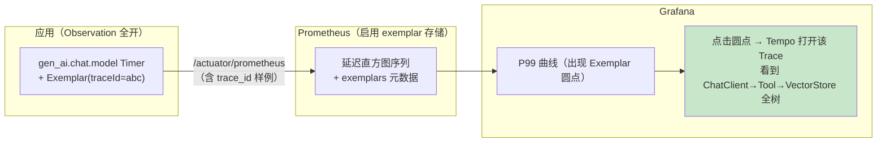

# 指标治理与 Exemplars

> **定位**：Observation 门面负责"产指标"，本文负责"指标本身的治理"——MeterFilter（开关/改名/熔断基数）、直方图与分位数（客户端 vs 服务端聚合的取舍）、SLO 桶、基数熔断的工程实现，以及 **Exemplars**（指标采样点内嵌 traceId，Grafana 从一条延迟曲线直接跳到那条 Trace）——这是"指标告警 → 链路下钻"最后一公里。收尾给 Observation 开销量化方法与其他自动埋点面清单。
>
> **读者画像**：指标已经跑起来、正在被时间序列数量和"P99 从哪来"折磨的工程师；要给 Agent 平台定指标规范与告警的架构师。
>
> **前置阅读**：[附录 18-Observation/00 §4]（低/高基数分账）；[附录 18-Observation/02]（Boot 配置体系）；[教程 22 §7]（面板与告警）。
>
> **版本基准**：Micrometer 1.1x + Prometheus（配置键以所引版本文档为准）。

---

## 1. 门面之后的半块问题

`MeterObservationHandler` 把 Observation 变成 Timer——但生产化还有三层治理没解决：

| 层 | 问题 | 本文方案 |
|----|------|---------|
| 命名与维度 | 指标名漂移、tag 组合爆炸 | 命名规范 + MeterFilter（§2-§3） |
| 分布统计 | 默认只有计数与总量，P99 算不出来或算不准 | 直方图/分位数/SLO 桶（§4） |
| 指标↔链路断层 | 曲线显示慢，但找不到"是哪一次调用慢" | **Exemplars**（§5） |

## 2. MeterFilter：指标的门面治理器

`MeterFilter` 是 MeterRegistry 级的拦截器，控制每个指标"存不存在、叫什么、带什么 tag"：

```java
@Bean
MeterFilter agentMetricsPolicy() {
    return new MeterFilter() {
        // ① 降噪：低价值高频指标直接丢弃（返回 MeterFilterReply.DENY）
        @Override
        public MeterFilterReply accept(Meter.Id id) {
            if (id.getName().startsWith("http.server.requests")
                    && "health".equals(id.getTag("uri"))) {
                return MeterFilterReply.DENY;
            }
            return MeterFilterReply.NEUTRAL;
        }
    };
}

// ② 基数熔断：单 tag 取值超上限，丢弃后续新组合（防爆炸闸门）
// 真实签名：maximumAllowableTags(tagKey, tagValuePrefix, maxValues, onMaxReached)
@Bean
MeterFilter maxTags() {
    return MeterFilter.maximumAllowableTags("tool.name", "", 100,
            MeterFilter.deny());          // 第 101 个工具名出现时开始拒新
}
@Bean
MeterFilter dropNoisy() {
    return MeterFilter.ignoreTags("session.id");   // 误进低基数的无界 tag 直接剥掉
}
```

配置侧等价物：`management.metrics.enable.<name>: false`（按前缀开关）。**纪律：逻辑性治理写 MeterFilter Bean，开关性治理写配置**（[附录 18-Observation/02 §3.3] 同款分工）。

## 3. 基数治理的完整账

一次复习（[附录 18-Observation/00 §4]）+ 落地三招：

```
时间序列数 = Σ(每个指标名 × 其 tag 取值组合数)
例：tool.exec{tool.name=50 个} × {status=3} × {tenant.tier=4} = 600 序列（可接受）
   tool.exec{session.id=10 万} = 10 万序列（Prometheus 内存爆炸）
```

1. **上线前审查**：每个低基数 tag 写出取值上界（写不出来的不许进低基数）。
2. **上线后熔断**：`maximumAllowableTags` 做保险丝——配错也不会把监控系统打死。
3. **日常抽查**：`GET /actuator/metrics/tool.exec` 看 tag 组合数；Grafana 里看 Prometheus `prometheus_tsdb_head_series` 增长曲线——它陡增就是有 tag 失控了。

## 4. 直方图与分位数：P99 到底怎么来的

默认 Timer 只有 count/totalTime——**分位数要么在客户端算，要么在服务端（Prometheus）算**：

| 方案 | 配置 | 原理 | 取舍 |
|------|------|------|------|
| 客户端分位数 | `management.metrics.distribution.percentiles.tool.exec=0.5,0.99` | 客户端 ring-buffer 估算 | 序列少（每分位 1 条）；但**不可跨实例聚合**（P99 的 P99 ≠ 全局 P99） |
| 直方图桶 | `management.metrics.distribution.percentiles-histogram.tool.exec=true` | 桶计数上传，服务端 `histogram_quantile()` | 可聚合（多实例求全局分位）；序列多（桶数 × tag 组合） |
| **SLO 桶** | `management.metrics.distribution.slo.tool.exec=300ms,1s,5s` | 只建业务关心的几只桶 | 序列最省 + 面板直观（"多少请求超 1s"直接读桶）；分位精度受桶边界限制 |

**Agent 平台推荐组合**：TTFT/端到端延迟用 SLO 桶（面板读"超 SLO 比例"最直观，[教程 22 §3] 的 TTFT 承诺在指标侧的落点）；需要精确全局 P99 的核心链路再加直方图；**不要全指标开直方图**——桶的序列成本 × tag 组合会吃掉治理预算。SLO 桶的另一价值：告警规则从"分位数超阈值"简化为"超桶比例 > x%"，比 histogram_quantile 便宜且稳定。

## 5. Exemplars：指标曲线上的 Trace 入口

**Exemplar = 附着在直方图桶/计数器采样点上的 traceId 样例**。开启后 Grafana 的延迟曲线上会出现小圆点——点一下直达那条 Trace（Tempo/Zipkin）。这是排障体验的分水岭：



开启条件（版本相关，以文档为准）：①classpath 同时有 **tracing bridge + micrometer-registry-prometheus**（Boot 检测到即自动附 Exemplar——Micrometer 经 tracing 的 SpanContext 供应商把当前 traceId 写进样例）；②Prometheus 启用 exemplar storage（`--storage.tsdb.path + enable-feature=exemplar-storage`）；③查询带 exemplars。约束：**Exemplar 只在直方图/计数器上有意义**（所以 §4 的直方图是它的前提）；样例是稀疏的（不是每个点都有）——它是"入口"不是"全集"。

这一节补上了 [附录 18-Observation/00] 门面模型的最后一块拼图：指标（第 4 节）与 Trace（[04-链路追踪与上下文传播]）不再两套系统两套跳转。

## 6. Agent 平台指标规范（模板）

| 规范项 | 规则 | 示例 |
|--------|------|------|
| 命名 | `agent.<域>.<动作>` 小写点分；框架名保持 gen_ai.*/spring.ai.* 原样 | `agent.task.step` |
| 低基数 tag 白名单 | name/status/tier/model/channel 类，逐个声明上界 | `tool.name≤100` |
| 高基数 | 一律 highCardinality（只进 Span），绝不进 tag | session.id / user.id |
| 分布 | 核心延迟用 SLO 桶；其余默认计数+总量 | TTFT: 200ms,1s,5s |
| 保险丝 | 每个低基数 tag 配 maximumAllowableTags 上限 | |
| 禁忌 | 不做指标聚合平台（那是 Prometheus/Streams 的事，[17-Kafka/06]） | |

## 7. Observation 开销量化

门面不是免费的，量化方法比数字重要（数字随版本/硬件漂移）：

1. **基线对比**：`ObservationRegistry.NOOP` vs 全装配（指标+tracing+采样 10%），同一压测（`wrk`/`ab` 打 /actuator 健康端点之外的固定接口）对比吞吐与 P99 差值——通常在个位数百分比内，超了说明 Handler 里有重活（[附录 18-Observation/03 §8] 反模式 1）。
2. **微基准**（可选）：JMH 对比 `observe(Supplier)` 包裹空方法的开销。
3. **横向确认**：GC 压力无抬升、`prometheus_tsdb_head_series` 平稳。指标体系自身的成本也该出现在成本账本里（[教程 27] 口径）。

## 8. 其他自动埋点面清单（装 starter 即有）

| 埋点面 | 来源 | 观测名/指标族 | 备注 |
|--------|------|--------------|------|
| JDBC | `datasource-micrometer`（需添加依赖） | 连接池/查询计时 | 慢 SQL 治理入口 |
| R2DBC | spring-r2dbc 观测集成 | 同上的响应式版 | WebFlux 栈优先 |
| RabbitMQ | spring-rabbit observation | publish/consume | 与 17-Kafka 对照 |
| Kafka 客户端 | spring-kafka `MicrometerConsumer/ProducerListener` | 客户端指标族 | [17-Kafka/08 §6] |
| HTTP 客户端 | WebClient/RestClient | `http.client.requests` | [附录 18-Observation/02 §2] |
| JVM/GC/线程 | micrometer-core Binder | jvm.* | 免费附赠，别忘看 |
| Logback | micrometer-core | logback.events | 日志速率告警可用 |

## 9. 适用场景与不适用场景

### 适用场景

- 生产指标治理（基数熔断/SLO 桶/命名规范）与"指标→Trace"跳转闭环
- 多实例需要聚合全局分位数的核心链路
- 观测系统自身的成本预算与开销验证

### 不适用场景

- 已有独立 APM 平台且不想双写——先定一个数据面（[附录 05 §3.2] 的 javaagent/手写二选一纪律同样适用于此）
- 全指标直方图全 Exemplars——序列与样例成本会吃掉治理收益
- 没有基线数据的"优化"——先跑 §7 的对比再谈

## 10. 常见误区与反模式

1. **客户端分位数跨实例相加**——P99 不满足可加性；多实例聚合只能走直方图。
2. **SLO 桶边界随手拍**——桶要贴业务 SLO（200ms/1s/5s），不是均匀切。
3. **maximumAllowableTags 设了 10 万**——保险丝失去意义；上限应贴着业务上界（工具数 100 级）。
4. **把 Exemplar 当全量数据**——它是稀疏样例，统计分析仍走 Trace 采样管道（[附录 18-Observation/05 §4]）。
5. **指标规范只在口头上**——§6 的模板落进 CODEOWNERS/评审清单，否则三个月后重新爆炸。

## 11. 总结

指标治理四件套：**MeterFilter 管门（deny/剥 tag/基数熔断）、SLO 桶管分位数（可聚合、省序列、贴业务）、Exemplars 管跳转（指标曲线上开门见山到 Trace）、开销量化管预算**。加上 [02] 的配置体系与 [03] 的 Handler 扩展，Observation 的指标侧闭环完成。最后一篇补第三根支柱与数据后端中间层：[附录 18-Observation/07-日志支柱与Collector]。

**外部来源**：[Micrometer – Meter Filter](https://micrometer.io/docs/concepts#_meter_filters) · [Spring Boot Metrics Distribution](https://docs.spring.io/spring-boot/reference/actuator/metrics.html) · [Prometheus Exemplars](https://prometheus.io/docs/prometheus/latest/feature_flags/#exemplar-storage) · [Micrometer Prometheus & Tracing（Exemplars 说明）](https://micrometer.io/docs/prometheus)
