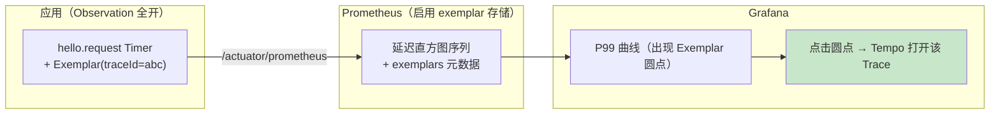

# 06 指标面板与治理：Prometheus、SLO 桶与基数熔断

> **定位**：前五关你产的观测**能看到了**——但那只是给单人看的控制台。这一关让它**规模化、可治理**：接到 Prometheus（`/actuator/prometheus` 暴露指标）、给核心延迟开 SLO 桶、用 MeterFilter 做基数熔断、用 Exemplars 把"指标曲线"连到"具体某次 Trace"。这是从"能观测"迈向"可治理"的关键一关，也是把第 02 关"基数纪律"落成生产保险丝的地方。
>
> **进阶路径**：在之前工程上加"指标面板与治理"这一层。
>
> **前置**：[03 Boot 自动装配]；[02 §3 基数]；[01 §5 生命周期]。
>
> **版本基准**：Spring Boot 4.1.0 + micrometer 1.17 + Prometheus 后端。**本篇会拉取 `micrometer-registry-prometheus`，本机需能联网。**

---

## 1. 从"控制台"到"指标面板"：引入 Prometheus

你已有的 `http.server.requests`、`hello.request` 这些观测，`MeterObservationHandler`（Boot 自动注册）已经把它们转成了 **Timer**（内存里）。问题是：**Timer 默认只在内存，Prometheus 拉不到**。需要给 Prometheus 一个"出口"。

### 依赖（需网上下载）

```xml
<dependency>
    <groupId>io.micrometer</groupId>
    <artifactId>micrometer-registry-prometheus</artifactId>
</dependency>
```

### 暴露端点（application.yaml）

```yaml
management:
  endpoints:
    web:
      exposure:
        include: health,metrics,prometheus   # 开 prometheus 端点
```

重启后访问：

```bash
curl http://localhost:18080/actuator/prometheus | head
```

你会看到 Prometheus 文本格式的指标（如 `http_server_requests_seconds_count`、`hello_request_seconds_count`）。**这是 Prometheus 采集（scrape）的人口**。

> 完整的指标面板体验需要**起一个 Prometheus + Grafana**（`docker run` 跑 prom/prometheus 并配 scrape `localhost:18080`，如 `--config.file` 里 `scrape_configs`→`job:`obs`、`static_configs`→`targets:['host.docker.internal:18080']`）。本关把"看得懂指标 + 拍板为何治理"讲透，面板部署放 [08 §生产化清单]。

---

## 2. 先看懂一个指标：为什么有 COUNT、TOTAL、MAX

`GET /actuator/metrics/hello.request`（[03 §3] 你看过 JSON 版，这里精读测量项）：

```json
{
  "availableTags": [{"tag":"path","values":["/hello"]},{"tag":"error","values":["none"]}],
  "measurements": [
    {"statistic":"COUNT","value":3.0},
    {"statistic":"TOTAL_TIME","value":0.154},
    {"statistic":"MAX","value":0.09}
  ],
  "name":"hello.request"
}
```

一个 Timer 给三类测量：
- **COUNT**：发生了几次（你 curl 了几次）——用于 QPS/速率
- **TOTAL_TIME**：总耗时（秒）——用于平均耗时
- **MAX**：单次最慢（秒）——快速看最坏情况

**但它没告诉你"有多少请求超了 1 秒"**——这就是 3 节 SLO 桶要解决的问题。

---

## 3. SLO 桶：让"超预算比例"直接可读

### 3.1 分位数在客户端还是服务端算（决策先厘清）

默认 Timer 只有 count/total/max，分位数要么在**客户端**算、要么在**服务端（Prometheus）**算：

| 方案 | 配置 | 原理 | 取舍 |
|------|------|------|------|
| 客户端分位数 | `percentiles` | 客户端 ring-buffer 估算 | 序列少；但不可跨实例聚合（P99 的 P99≠全局）|
| 直方图桶 | `percentiles-histogram` | 桶计数上传，服务端 `histogram_quantile()` | 可聚合；但序列多（桶数×tag）|
| **SLO 桶** | `slo` | 只建业务关心的几桶 | 序列最省 + 面板直观；分位精度受限 |

### 3.2 配置 SLO 桶

```yaml
management:
  metrics:
    distribution:
      slo:
        hello.request: 300ms,1s,5s      # 三只业务关心的桶
        http.server.requests: 300ms,1s,5s
```

### 3.3 触发几次再查

```bash
for i in $(seq 1 10); do curl -s http://localhost:18080/hello >/dev/null; done
curl http://localhost:18080/actuator/prometheus | grep hello_request
```

看到 `_bucket{le="0.3"}`、`{le="1"}`、`{le="5"}`、`{le="+Inf"}` 的累积计数——**相邻桶之差就是落在该区间的请求数**。"超 1s 的比例" = `(le="1"→le="+Inf" 之差)/total`，一眼看出来，不用 `histogram_quantile` 现场算。

> **Agent 平台推荐组合**：核心延迟（TTFT/端到端）用 SLO 桶（面板直接读"超 SLO 比例"，[07/08] 的 TTFT）；要求精确全局 P99 的核心链路才加直方图；**不要全指标开直方图/全 Exemplars**（桶 × tag 组合吃掉治理预算，[§8] 反模式）。

---

## 4. MeterFilter：指标的门面治理器（开关/剥 tag/基数熔断）

`MeterFilter` 在 MeterRegistry 层面拦截每个指标，管三件事——**存不存在、带什么 tag、要不要熔断基数**。都注册为 `@Bean` 即生效：

```java
package demo.demo01.step7;

import io.micrometer.core.instrument.Meter;
import io.micrometer.core.instrument.config.MeterFilter;
import io.micrometer.core.instrument.config.MeterFilterReply;
import org.springframework.context.annotation.Bean;
import org.springframework.context.annotation.Configuration;

@Configuration
public class ObsStep7MetricConfig {

    // ① 降噪：低价值高频指标直接丢弃
    @Bean
    MeterFilter dropHealthChecks() {
        return new MeterFilter() {
            @Override public MeterFilterReply accept(Meter.Id id) {
                if (id.getName().startsWith("http.server.requests")
                        && "health".equals(id.getTag("uri"))) {
                    return MeterFilterReply.DENY;      // 丢弃
                }
                return MeterFilterReply.NEUTRAL;        // 其他照常
            }
        };
    }

    // ② 基数熔断保险丝：某标签取值超过上限，拒绝新组合（防 Prometheus 序列爆炸）
    //    真实签名：maximumAllowableTags(tagKey, tagValuePrefix, maxValues, onMaxReached)
    @Bean
    MeterFilter maxToolNames() {
        return MeterFilter.maximumAllowableTags("tool.name", "", 100, MeterFilter.deny());
    }

    // ③ 剥掉误进低基数的无界标签（保险）
    @Bean
    MeterFilter ignoreSessionId() {
        return MeterFilter.ignoreTags("session.id");   // 误进低基数的高基数 tag 直接剥掉
    }
}
```

**为什么熔断重要**（[02 §3] 基数的生产落地）：时间序列数 = Σ(指标名 × tag 组合)。`tool.exec{tool.name=100 种} × {status=3} = 300` 可接受；若有人把 `session.id`（无界）放进低基数，就是上万条序列——Prometheus 内存爆炸。`maximumAllowableTags` 是"保险丝"：**配错了也不会把监控打死**。

> **配置与 Bean 的分工（呼应 [03]）**：逻辑性治理（熔断/剥 tag/降噪）写 MeterFilter Bean；开关性治理（`management.metrics.enable.<name>: false`）用配置。能用配置的用配置。

---

## 5. Exemplars：指标曲线上的 Trace 入口

**痛点**：P99 涨了，但曲线是"一堆请求的统计"，你不知道**具体哪一次**慢。**Exemplar = 附在直方图采样点上的 traceId 样例**——Grafana 曲线上点一下直达那条 Trace（Tempo/Zipkin）。



**开启条件**（版本相关，以文档为准）：① classpath 同时有 **tracing bridge + prometheus registry**（Boot 检测到即自动把当前 traceId 写进样例）；② Prometheus 启用 exemplar storage（`--storage.tsdb.path --enable-feature=exemplar-storage`）；③ 查询带 `exemplars`。

**约束**：Exemplar 只在**直方图/计数器**上有意义（所以 §3 的 SLO 桶/直方图是它的前提）；样例是**稀疏**的（不是每个点都有）——它是"入口"不是"全集"（完整跳转细节需要 [07] tracing 打通）。

> 这一节补上"指标（本关）与 Trace（[07]）不再两套系统两套跳转"的最后一公里。

---

## 6. 指标规范：给团队定规则（模板）

| 规范项 | 规则 | 示例 |
|--------|------|------|
| 命名 | `agent.<域>.<动作>` 小写点分；框架名保持 `gen_ai.*`/`spring.ai.tool` 原样 | `agent.task.step` |
| 低基数 tag 白名单 | name/status/tier/model/channel 类，逐个声明上界 | `tool.name≤100` |
| 高基数 | 一律 high（只进 Span），绝不进 tag | `session.id`/`user.id` |
| 分布 | 核心延迟用 SLO 桶；其余计数+总量 | `hello.request: 300ms,1s,5s` |
| 保险丝 | 每个低基数 tag 配 `maximumAllowableTags` | `tool.name≤100` |
| 禁忌 | 不做指标聚合平台（那是 Prometheus/Streams 的事） | — |

> 规范落不落进评审清单，决定三个月后序列是否又爆炸（[§8] 反模式）。参考：先给 1 个核心指标按 §3-§5 做通，其余维持默认识别。

---

## 7. Observation 开销量化（可观测也要有预算）

门面不是免费的。量化方法比数字重要（数字随版本/硬件漂移）：

1. **基线对比**：`ObservationRegistry.NOOP` vs 全装配（指标+tracing+采样），同一压测（`wrk`/`ab` 打固定接口）对比吞吐与 P99 差值——通常在个位数百分比内；超了说明 Handler 里有重活（[04 §6 反模式1]）。
2. **微基准**（可选）：JMH 对比 `observe(Supplier)` 包裹空方法的开销。
3. **横向确认**：GC 压力无抬升、Prometheus `prometheus_tsdb_head_series` 平稳。

---

## 8. 这一关我该体会到的知识点（关联展开）

- **SLO 桶 / "分位数在哪算"** → 客户端 vs 服务端（[02 §3 基数]之外的新视角）。
- **基数熔断** → 是 [02 §3] "低/高基数分家"在生产侧的保险丝。
- **MeterFilter vs ObservationFilter（别混，实测）**：MeterFilter 管**指标**（Meter 层面，`accept/ignoreTags/maximumAllowableTags`）；ObservationFilter 管**观测**（[05 §3]，`map(Context)`）。一个指指标账户、一个指观测模型。
- **Exemplars** → 需要 [07] tracing 才能真正点得进去；为 [08 综合实战] 的"指标告警→Trace 下钻"铺路。
- **可观测自身容量**：Predicate/MeterFilter/采样共同治理"观测噪音"（[05 §Predicate] 的延伸）。

---

## 9. 适用场景与不适用场景（这一关）

**适用**：生产指标治理（SLO 桶建档/基数熔断/命名规范）；"指标→Trace"跳转闭环；观测系统自身成本预算。

**不适用**：已有独立 APM 且不想双写——先定一个数据面（[附录05 §3.2] javaagent/手写二选一纪律同样适用于此）；全指标直方图 + 全 Exemplars（序列/样例成本吃掉收益）；没有基线数据的"优化"（先跑 §7 再谈）。

---

## 10. 常见误区（这一关）

1. **客户端分位数跨实例相加**——P99 不满足可加性；多实例全局分位只能走直方图（服务端聚合）。
2. **SLO 桶边界随手拍**——桶要贴业务 SLO（200ms/1s/5s），不是均匀切。
3. **`maximumAllowableTags` 上限设 10 万**——保险丝失去意义；上限贴业务上界（工具数 100 级）。
4. **把 Exemplar 当全量**——稀疏样例只做入口，统计分析仍走采样管道。
5. **指标规范只在口头**——模板落进评审清单，否则三个月后序列又爆炸。
6. **把 MeterFilter 与 ObservationFilter 混用**——一个管指标、一个管观测（§8）。

---

## 11. 总结

这一关你让观测**规模化并可治理**：接 Prometheus（`/actuator/prometheus`）、核心延迟开 SLO 桶（超预算比例直接读）、MeterFilter 做基数熔断、Exemplars 打通"指标→Trace"最后一公里（需 [07] tracing）。

下一关 [07 链路追踪与日志]：把观测串成**跨请求/跨线程/跨服务的链路**，让 traceId 贯穿日志，也让 Exemplars 真的能点进去。这是本系列最难也最值得的一关。

**外部来源**：[Spring Boot Micrometer Metrics](https://docs.spring.io/spring-boot/reference/actuator/metrics.html) · [Micrometer–MeterFilters](https://micrometer.io/docs/concepts#_meter_filters) · [Prometheus Exemplars](https://prometheus.io/docs/prometheus/latest/feature_flags/#exemplar-storage)
