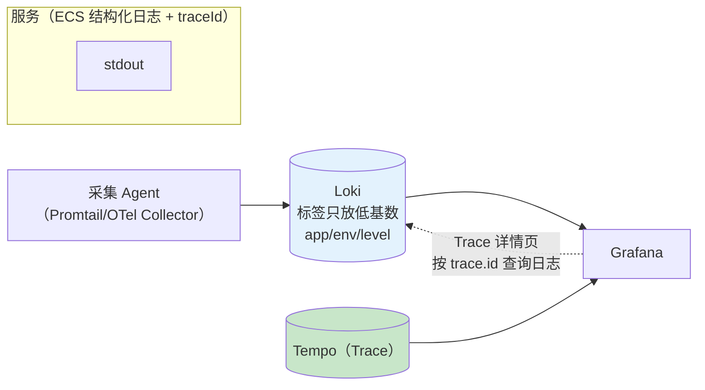
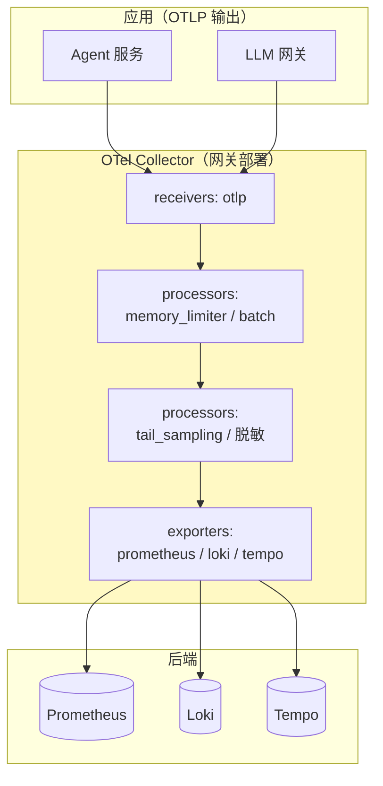

# 日志支柱与 Collector

> **定位**：Observation 主题收官篇——补齐第三根支柱（Logs）与数据后端中间层：traceId 自动进日志与结构化日志、Loki 的 trace-to-logs 关联、OTel Collector 的架构定位与**尾部采样/脱敏/多后端路由**（[教程 22] 审计点名的"Logs 支柱未落地、尾采样无实现路径"在此关闭），并附 Reactor 观测深水区小节。
>
> **读者画像**：三支柱里 Trace/Metrics 已通、被"日志查不到对应 Trace"和"采样策略只有头部概率"困扰的平台工程师。
>
> **前置阅读**：[附录 18-Observation/04-链路追踪与上下文传播]（头采样与传播）；[附录 18-Observation/06]（指标侧治理）；[教程 22 §1.2]（三支柱定位）。
>
> **版本基准**：Spring Boot 4.1（结构化日志沿用 3.4+ 能力）、OTel Collector（独立组件，版本随发行）。

---

## 1. 日志为什么总是"断"的

三类断法，各自的解法不同：

| 断法 | 症状 | 解法 |
|------|------|------|
| 无 traceId | 一条 ERROR 日志不知道属于哪次请求 | tracing bridge 自动写 MDC（§2） |
| 格式不统一 | 逐服务 grep，无法被检索系统理解 | 结构化日志（§3） |
| 与 Trace 两套体系 | Trace 详情页看不到当时的日志 | Loki trace-to-logs 关联（§4） |

## 2. traceId 进日志：自动的，但要知道开关在哪

装了 tracing bridge 后，**traceId/spanId 由桥接器在 Span 生命周期内写入 MDC**（OTel 桥走 correlation 机制，[附录 18-Observation/04 §2]）——你要做的只是 pattern 里留位置：

```xml
<!-- logback-spring.xml：traceId 为空时显示 - -->
<pattern>%d{HH:mm:ss} [%thread] [%X{traceId:-}] [%X{spanId:-}] %-5level %logger{36} - %msg%n</pattern>
```

三个边界：

1. **异步/响应式下 MDC 的可靠性**依赖 context-propagation 的自动桥（`Hooks.enableAutomaticContextPropagation()`，[附录 18-Observation/04 §4]）——这正是 [教程 22/23] 审计反模式（裸 MDC）的正解所在。
2. **Baggage 也能进日志**：`management.tracing.baggage.correlation-fields: tenant-id` 后 `%X{tenant-id}` 可用——租户日志过滤免掉查 Trace 的跳转。
3. **没有 Span 的代码没有 traceId**（后台任务在观测外启动时）——给任务包一层 Observation（[附录 18-Observation/03 §1]）而不是手动塞 MDC。

## 3. 结构化日志：给检索系统的日志

Spring Boot 3.4+ 内置结构化日志格式（ECS/Logstash 等），一行配置：

```yaml
logging:
  structured:
    format: ecs          # Elastic Common Schema：字段名标准化（trace.id/span.id/服务名已内置）
```

**ECS 的关键红利**：traceId/spanId/服务名是标准字段——Loki/ELK 无需自定义解析规则就能索引与关联。加上 Micrometer 的 `LoggingHandler`（micrometer-core，对选定 Observation 输出生命周期日志，适合低频关键观测如审批/告警事件），日志侧与 Observation 的衔接就完整了：**结构化日志做日常洪流，LoggingHandler 做精选观测事件的同步落地**。

## 4. Loki 与 trace-to-logs



两条纪律：**Loki 标签只放低基数**（app/env/level；traceId 做标签 = 每个 trace 一条流 = 灾难——它走查询过滤器而不是标签）；**关联靠标准字段**（Tempo 的 trace-to-logs 按 `trace.id` 标签查询自动注入过滤器，Grafana 里 Trace 详情页一键"查看相关日志"）。至此三支柱在 UI 层互通：指标圆点（Exemplars，[06 §5]）→ Trace → 日志，一条动线。

## 5. OTel Collector：数据后端的中间层



为什么需要它：**应用只管 OTLP 输出**（换后端零改动）；采集侧集中做批处理/限流/**尾部采样**/脱敏/复制分发。

### 尾部采样（tail_sampling processor）——[教程 22 §10.1] 的实现路径

头采样（[附录 18-Observation/02 §3.2]）在请求开始就决定去留——**看不到结局**。尾采样在 Collector 缓存完整 Trace 后按结果决策：

```yaml
processors:
  tail_sampling:
    decision_wait: 10s          # 等待 Trace 聚齐
    policies:                   # 命中任一策略即保留
      - name: errors-kept
        type: status_code
        status_code: {status_codes: [ERROR] }
      - name: slow-kept
        type: latency           # 超过 3s 的慢 Trace 全保留
        latency: {threshold_ms: 3000}
      - name: sample-rest
        type: probabilistic
        probabilistic: {sampling_percentage: 10}
```

对照表：

| 维度 | 头采样（应用侧） | 尾采样 |
|------|-----------------|--------|
| 决策时机 | 请求开始 | Trace 完整后 |
| 能否"错误 100% 保留" | 不能（采样后才知错误） | **能**（这正是生产刚需） |
| 成本 | 零缓冲 | Collector 内存缓冲（decision_wait + 限流纪律） |
| 组合策略 | 单一概率 | 多策略 or 组合 |

**最佳实践是两级**：应用侧头采样 100%（全量发 OTLP，内网带宽便宜）+ Collector 尾采样（错误/慢全保、正常 10%）——[教程 22 §10.1] 表格的工程化形态。注意 tail_sampling 需要单点聚合（同一 trace 的 span 到同一 Collector 实例——按 traceId 负载均衡），网关多实例时要配 LB 策略。

### 脱敏（在数据离开应用之后再保险一道）

Collector 的 transform/attributes processor 可按规则抹除高敏属性（如 `gen_ai.prompt.content`）——作为 [附录 18-Observation/03 §3] 应用侧 Filter 的第二道防线，覆盖"忘了配 Filter 的服务"。

## 6. Reactor 观测深水区（小节）

`Flux.name("x").tap(Micrometer.observation(registry))`（[附录 18-Observation/03 §5]）之下的机制，知道边界即可：

1. **观测绑定订阅语义**：一次订阅 = 一次 Observation（冷流重订阅/重试会再来一次——与 [教程 42 §3] 的 retryWhen 重放是同一根源，指标上表现为计数翻倍而非错误）。
2. **信号→事件**：tap 的 SignalListener 把 onNext/onError 等信号映射为 Observation 事件/终止路径（错误进 error()，取消也有对应路径）——想自定义事件需要写 SignalListener，属于低频高级用法。
3. **别忘了时序**：`.name()` 只影响其后声明的操作符区间——观测的"覆盖范围"是链上的一段，不是整个流。

## 7. 适用场景与不适用场景

### 适用场景

- 三支柱统一检索动线（Exemplars → Trace → Logs）的平台建设
- 生产"错误/慢请求全保留 + 正常采样"的尾采样策略
- 多后端/换后端诉求（应用只管 OTLP，Collector 管分发）
- 结构化日志标准化（ECS）统一团队日志字段

### 不适用场景

- 单服务小规模部署——Collector 引入第二套运维，日志直接 stdout+ELK 更实际
- 日志内容强合规（不能出域）——Collector 反而扩大了数据流经面，脱敏要前置到应用侧
- 把 Collector 当流处理引擎做业务逻辑——它只做采集侧管道加工

## 8. 常见误区与反模式

1. **Loki 标签放了 traceId/userId**——标签高基数 = Loki 曲线化死亡；转过滤器。
2. **头采样 10% 又想要错误 Trace**——头采样看不到结局；错误保留只能靠尾采样（§5 对照表）。
3. **尾采样没配聚合负载均衡**——同一 trace 的 span 分散到多实例 Collector，决策错乱。
4. **日志 pattern 手写 traceId 字段名与后端约定不一致**——ECS 结构化日志直接消灭这类事故。
5. **Collector 无 memory_limiter**——尾采样缓冲在洪峰下 OOM，先限流再采样。

## 9. 总结（Observation 主题终章）

日志支柱三步：**traceId 自动进 MDC（桥接器）→ 结构化日志（ECS 标准化）→ Loki trace-to-logs 关联**；后端中间层一步：**OTel Collector 集中做尾采样/脱敏/分发**，把 [教程 22] 的采样表落成可运行的策略。至此 Observation 主题 8 篇闭环：门面模型 → API → Boot 装配 → 扩展 → 传播 → Agent 实战 → 指标治理 → 日志与 Collector——三支柱一根动线，这是"全链路可观测"在机制层与数据面的完整答案。

**外部来源**：[Spring Boot Structured Logging](https://docs.spring.io/spring-boot/reference/features/logging.html#features.logging.structured) · [Loki 标签最佳实践](https://grafana.com/docs/loki/latest/get-started/labels/) · [Grafana Trace to logs](https://grafana.com/docs/tempo/latest/logs/) · [OTel Collector tail_sampling](https://opentelemetry.io/docs/collector/configuration/#processors) · [Micrometer LoggingHandler](https://micrometer.io/docs/concepts#_logging_handler)
