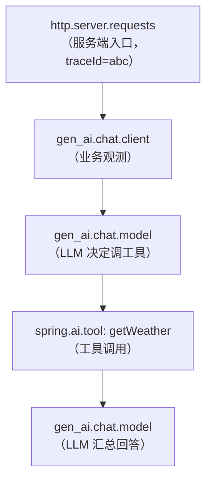
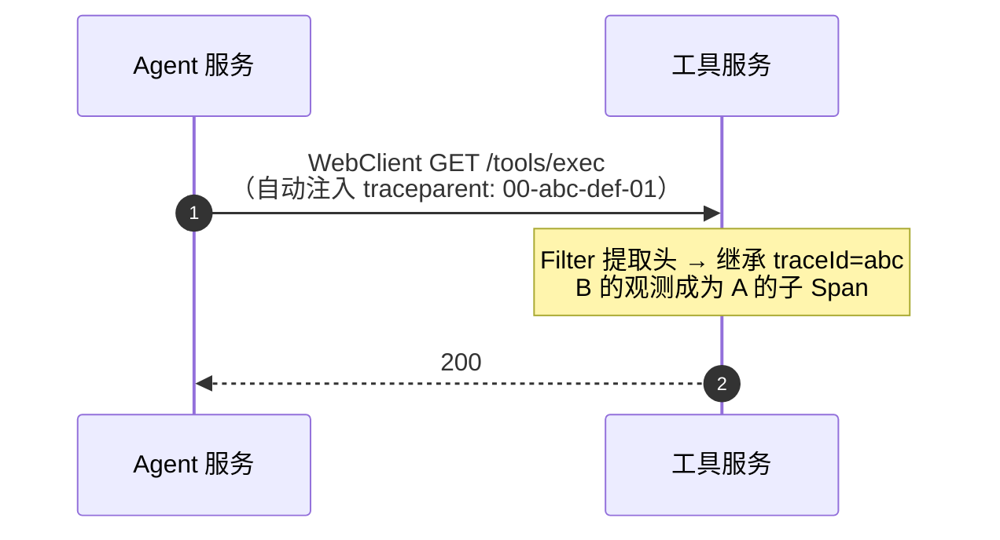
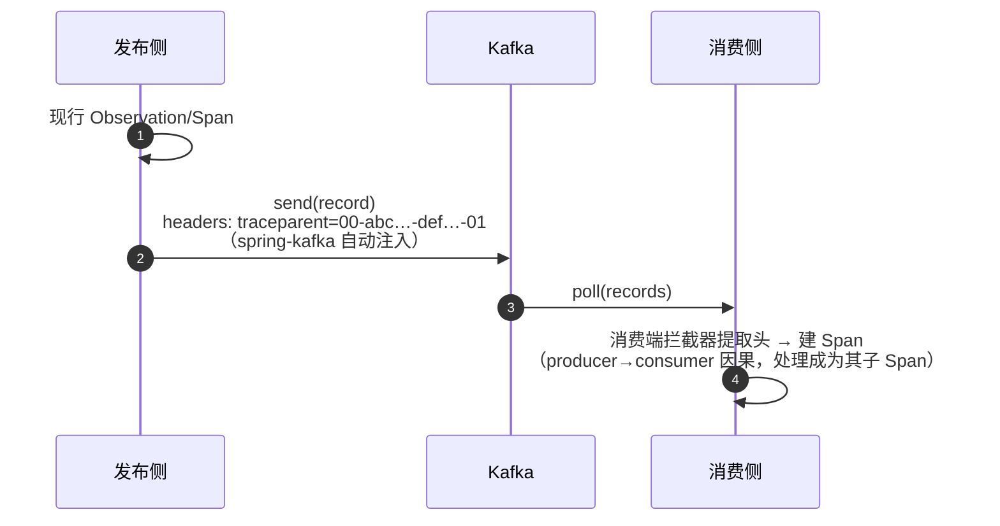
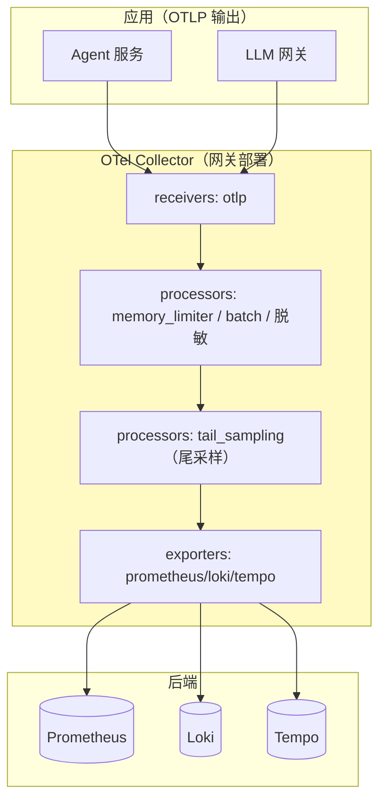

# 07 链路追踪与日志：traceId 贯穿请求 · 线程 · 服务 · 消息

> **定位**：前六关观测都是"单点"的——每个观测各自记录，但**它们之间怎么串起来**（一个请求里 HTTP 观测 → 业务观测 → 工具观测为什么是"同一件事"）还没解决。这一关引入**链路追踪（Trace）**：让整个请求——跨线程、跨服务、甚至跨消息队列——拥有同一个 `traceId`，并让日志带上它。这是从"一堆观测"到"一条可跨线程/跨服务追踪的全链路"的关键一跃，也是本系列信息量最大的一关。
>
> **进阶路径**：在之前工程上加"链路与日志"这一层。需要引入 tracing bridge。
>
> **前置**：[01 §3 Scope 语义]、[03 Boot 自动装配]、[06 Exemplars]。
>
> **版本基准**：Spring Boot 4.1.0 + micrometer-tracing（bridge） + context-propagation。**需联网下载依赖。**

---

## 1. 为什么会"断"：Scope 的 ThreadLocal 语义

[01 §3 选型图] 提过：Scope 是 **ThreadLocal 语义**。一次 `observe()` 用 `openScope()` 进入"现行"——但**一旦切换线程/运算符/跨进程，这个"现行"就丢了**。三类典型的"断"，三个对应的解：

| 断裂面 | 症状 | 解法 | 对应小节 |
|--------|------|------|---------|
| ① 线程断裂 | flatMap 切到别的线程，Scope 丢 | context-propagation 自动桥 + `ContextExecutorService` | §4、§6 |
| ② 进程断裂 | 跨 HTTP/gRPC 服务，无头可传 | W3C `traceparent` 头 | §5 |
| ③ 语义/异步断裂 | @Async/Kafka，父子因果丢 | 消息头携带 / 包装线程池 | §7 |

> 你前几关看到的 `parentObservation=null`、观测之间仿佛"平级"，根源就在这——单线程没问题，一跨就断。本书正确做法：**Boot 4.1 默认已开自动传播，多数情况你什么都不用做**，但必须理解何时需要显式处理。

---

## 2. 引入 tracing bridge：让观测变成 Span 树

`MeterObservationHandler` 只把观测变成**指标**（Timer）。要变成 **Span/Trace**，需要 tracing bridge（Micrometer Tracing 的接线）。依赖（OTel bridge 推荐，[附录05 §3.2] javaagent/手写二选一纪律：用 Observation 体系就走 bridge 管理自己的 SDK，不挂 javaagent）：

```xml
<dependency>
    <groupId>io.micrometer</groupId>
    <artifactId>micrometer-tracing-bridge-otel</artifactId>
</dependency>
```

装了之后，Boot 自动注册 `TracingObservationHandler`——**同一套观测，除了出指标，还出 Span**（这就是"一次插桩、三类数据同源产出"的完整形态，[00/01] 反复说的门面模型）。请求进来，观测自动嵌套成树（父子由 `openScope` 的 ThreadLocal 决定，[01 §Scope]）：



> 这棵树里每一环你前面都埋过（[_]http + gen_ai.* + spring.ai.tool），现在因为 bridge 的存在**自动变成了 Span 树**，且**同一个 `traceId`** 贯穿——你能在 Zipkin/Tempo 里搜 traceId 看全貌，配合 [06 §Exemplars] 从指标曲线跳进来。

**手动用 Tracer（少见，读取型才用）**——业务代码一般只见 Observation；`Tracer` 用于"取当前 traceId 回填响应头/审计"这类读取型：

```java
// 真实 API（[附录05 §3] 基准）：Tracer.currentSpan() 是 traceId 的真实取法
Tracer tracer;                                   // Boot 自动装配的 Bean
String traceId = tracer.currentSpan() != null
        ? tracer.currentSpan().context().traceId() : null;   // 当前 traceId
```

> **分工纪律**：手写 `tracer.nextSpan().start()` 这类"造新 Span"场景极少——优先用 Observation（自动带指标）。Tracer 只用于读取型需求（取 traceId）。

---

## 3. traceId 进日志：自动的，但要知道开关在哪

装 bridge 后，**traceId/spanId 由桥接器在 Span 生命周期内自动写入 MDC**。你要做的只是 pattern 里留位置：

```xml
<!-- logback-spring.xml -->
<pattern>%d{HH:mm:ss} [%thread] [%X{traceId:-}] [%X{spanId:-}] %-5level %logger{36} - %msg%n</pattern>
```

调任意接口，日志每行出现同一 `traceId`（你要的"这条是那个请求"的关联就来自这里）:

```
15:46:28 [ctor-http-nio-2] [traceId=abc] [spanId=1] INFO ... http.server.requests ...
15:46:28 [ctor-http-nio-2] [traceId=abc] [spanId=8] INFO ... gen_ai.chat.client ...
```

**三个边界**（[附录07 §2]）：
1. **异步/响应式下的 MDC 可靠性**依赖 context-propagation 自动桥（§4）——否则 MDC 也断（[附录06-WebFlux] 铁律：禁裸 MDC 传请求上下文）。
2. **Baggage 也能进日志**：配 `management.tracing.baggage.correlation-fields: tenant-id` → `%X{tenant-id}` 可用（租户日志过滤免查 Trace）。
3. **没有 Span 的代码没有 traceId**（后台任务在观测外启动）——给任务包一层 Observation（[04]）而不是手动塞 MDC。

---

## 4. Reactor / 线程切换：让 trace 不断（ThreadLocal → Reactor Context）

### 4.1 Hooks 自动传播（Boot 已默认）

Boot 4.1 装了 context-propagation + tracing 后，**默认已开 `Hooks.enableAutomaticContextPropagation()`**——Reactor 在订阅/切线程时自动把 ThreadLocal（Observation Scope、MDC 等）桥到 Reactor Context 并恢复。**普通响应式服务你什么都不用做。**

### 4.2 需要显式处理的"逃逸路径"

需要你动手的只有"绕开框架"的路径：

```java
// 自建线程池裸提交 → 上下文丢（表现为日志 traceId 时有时无）
ExecutorService raw = Executors.newFixedThreadPool(2);
raw.submit(() -> logger.info("无上下文"));

// 包装线程池 → 上下文自动跨线程（context-propagation 真实类）
ExecutorService wrapped = new io.micrometer.context.ContextExecutorService(raw);
wrapped.submit(() -> logger.info("traceId 带过来了"));
```

### 4.3 判别表

| 你的场景 | 用什么 |
|---------|--------|
| 普通响应式服务（Boot 4.1） | 什么都不做：Hooks 自动传播 + Filter 自动建链 |
| 响应式链里开子观测 | `.name().tap(Micrometer.observation(registry))`（§8）|
| 链里取租户/用户身份 | Reactor Context（`contextWrite`/`deferContextual`）|
| 日志想带 traceId | MDC 映射 + Hooks，pattern 加 `%X{traceId}` |
| 阻塞代码（虚拟线程）| 传统 Scope/ThreadLocal 语义照常有效（§7）|

---

## 5. 跨服务传播：三个自动前提

微服务里 `Agent 服务 → 工具服务`，要让 trace 连到对端，三个前提**缺一即断**：

1. 客户端用**框架内建通道**（WebClient/RestClient）——裸 `HttpClient.new()` 不带 traceparent。
2. 双方都有 **bridge + 传播器**。
3. 中间设施**不剥离未知头**（网关/Nginx 默认保留；自研代理要显式透传 `traceparent`/`tracestate`/`baggage`）。



**Baggage（随 Trace 携带的业务行李，如租户）**：`management.tracing.baggage.remote-fields: tenant-id` 声明后跨服务传播并可映射 MDC（§3 边界 2）。**放小而必要的标识（租户/用户），别放业务参数**（它随每请求传播）。

> 收到 traceparent 的一方，观测与发起方同一 `traceId`、成父子树。你 [04] 的审计 Handler 想记 traceId，用 §2 的 `Tracer.currentSpan()` 或提前写进 Context。

---

## 6. 异步边界：@Async / @Scheduled / 自定义线程池（语义断裂）

| 断点 | 现象 | 修法 |
|------|------|------|
| `@Async` 方法 | trace 断在提交处 | Boot 自动配置的 executor 已包装传播；**自建池必须包 `ContextExecutorService`** |
| `@Scheduled` 任务 | 无父 Span（本就是根） | 正常，它就是新 Trace 的根；给任务自己包 Observation 即可 |
| `CompletableFuture.supplyAsync` | commonPool 无上下文 | 包 `ContextExecutorService`，或换带传播装饰的 executor |
| **Kafka 消息** | producer→consumer 因果断 | 消息头携带 traceparent + 消费端拦截器建链（§7）|

---

## 7. Kafka：跨消息的因果链（语义断裂的经典解）

[17-Kafka/09 §5] 给了架构位，这里给机制：消息在出队/入队时把头带进去，消费端提取头建链。



- **开箱条件**：spring-kafka 的 observation 集成 + tracing bridge 存在。
- **配置键**随 spring-kafka 版本核对（[17-Kafka/08 §6]）。
- **自写消费者（reactor-kafka）**：`KafkaReceiver.receive()` **不自动建链**——需手动提取头并开启 Scope。这是它与 `@KafkaListener` 的能力差（[04 §链路/17-Kafka]）。

---

## 8. Reactor 深水区 + 虚拟线程：两个特殊语义

### 8.1 Reactor 观测（冷流别用 @Observed）

`@Observed`（[03 §4]）在返回 Mono/Flux 时会在**订阅前** stop（Mono 真执行在订阅时）。正确用 Reactor 内建观测（需 `reactor-core-micrometer`，标注需引入依赖）：

```java
// 观测量链上的一段；订阅时才 start，随订阅语义走
Flux.just("a","b")
    .name("agent.stream.chat")                     // 观测名
    .tap(Micrometer.observation(registry));        // 挂到 Reactor 观测
```

**三个边界**（[附录07 §6]）：① 一次订阅=一次 Observation（冷流重订阅/重试会再来一次）；② tap 的 SignalListener 把 onNext/onError 映射为事件/终止路径；③ `.name()` 只影响其后操作符区间。

> **标注**：`Micrometer.observation(registry)` 精确写法随 reactor-micrometer 版本有差异；落项目前 javap 实证（[附录05 §3] 纪律）。

### 8.2 虚拟线程（Java 21）

虚拟线程仍是 Java 线程——**ThreadLocal 语义照常工作**，Observation Scope/MDC 在同一虚拟线程内连续执行时无断裂（[附录00-Java21/00-虚拟线程]）。两个注意点：
1. **海量虚拟线程 = 海量 ThreadLocal 副本**——别塞大对象又长寿；观测上下文是小对象，无碍。
2. **结构化并发/线程池内跳转照旧会断**——虚拟线程解决"阻塞不贵"，不解决"上下文自动跨线程"；跨线程仍走 §4 传播。

---

## 9. 日志支柱：结构化 + Collector + 尾采样（让 traceId 真正可检索、可采样）

### 9.1 结构化日志（ECS，[附录07 §3]）

Boot 4.1 内置结构化日志格式，一行配置让 stdout 变成标准 JSON 字段：

```yaml
logging:
  structured:
    format: ecs          # Elastic Common Schema：trace.id/span.id/服务名已内置
```

**ECS 红利**：traceId/spanId/服务名是标准字段——Loki/ELK 无需自定义解析就索引关联（§9.2）。这是"日志能关联到 Trace 详情页"的前提。

### 9.2 Loki 与 trace-to-logs（[附录07 §4]）

三支柱在 UI 层互通：指标圆点（Exemplars [06]）→ Trace → 日志，一条动线。

**两条纪律**：① Loki 标签只放低基数（app/env/level）；traceId **做标签 = 灾难**（每 trace 一条流），它走**查询过滤器**。② 关联靠标准字段（Tempo 按 `trace.id` 自动注入查询，Grafana Trace 详情页一键"查看相关日志"）。

### 9.3 OTel Collector + 尾采样（[附录07 §5]，含此前缺的尾采样）

**为什么需要 Collector**：应用只管 OTLP 输出（换后端零改动），采集侧集中做批处理/限流/**尾采样**/脱敏/分发。



**尾采样（tail_sampling）——[教程22 §10.1] 的实现路径**：头采样在请求开始就决定去留（看不到结局）；尾采样在 Collector 缓存完整 Trace 后**按结果决策**——错误 100% 保留、慢请求全保、正常才采样：

```yaml
processors:
  tail_sampling:
    decision_wait: 10s            # 等待 Trace 聚齐
    policies:                     # 命中任一策略即保留
      - name: errors-kept
        type: status_code
        status_code: {status_codes: [ERROR]}
      - name: slow-kept
        type: latency
        latency: {threshold_ms: 3000}
      - name: sample-rest
        type: probabilistic
        probabilistic: {sampling_percentage: 10}
```

**对照表**：

| 维度 | 头采样（应用侧） | 尾采样（Collector） |
|------|----------------|--------------------|
| 决策时机 | 请求开始 | Trace 完整后 |
| "错误100%保留" | 不能（采样后才知） | **能**（生产刚需）|
| 成本 | 零缓冲 | Collector 内存缓冲（decision_wait+限流纪律）|
| 组合策略 | 单一概率 | 多策略 or 组合 |

**最佳实践是两级**：应用侧头采样 100%（全量发 OTLP，内网便宜）+ Collector 尾采样（错误/慢全保、正常 10%）。注意 tail_sampling 需**单点聚合**（同一 trace 的 span 到同一 Collector 实例——按 traceId 负载均衡）。

**脱敏的第二道闸**：Collector 的 transform/attributes processor 可按规则抹除高敏属性（如 `gen_ai.prompt.content`），作为 [05 §Filter] 应用侧脱敏后的第二道防线，覆盖"忘了配 Filter 的服务"。

---

## 10. 这一关我该体会到的知识点（关联展开）

1. **三个断裂面三个解**：线程(§4)/进程(§5)/语义异步(§6-§7)。
2. **同一套观测同时出指标+Span** → 门面模型完整形态（[00/01]）。
3. **traceId 进日志 + 结构化 ECS** → 三支柱（Trace/Metrics/Logs）同根互通（[附录07/06]）。
4. **Exemplars 现在能点进去了** → 呼应 [06 §5]。
5. **Reactor 用 tap 而非 @Observed**、**虚拟线程 ThreadLocal 照常** → 响应式/webflux 铁律在地观测层的落地。
6. **Collector 尾采样** → [教程22 §10.1] 采样表的工程化；多后端分发让应用只管 OTLP。

---

## 11. 适用场景与不适用场景（这一关）

**适用**：需要追踪"一个请求跨线程/跨服务/跨消息是同一件事"（微服务 Agent、事件驱动）；日志想带 traceId；Exemplars 想真正跳转；生产"错误/慢全保留 + 正常采样"。

**不适用**：单进程单线程（无边界即无传播问题）；把 Baggage 当配置中心（随每请求传播，放小而必要的租户/用户标识）；跨第三方 LLM 外呼想要完整链（对方不回传 traceparent，链到你出口 Span 为止——预期行为，出口 Span 仍记录调用与耗时）。

---

## 12. 常见误区（这一关）

1. **trace 断就调采样率**——采样管"留多少"，断链是传播问题；先查内建通道/bridge/头透传/自建池（§4-§5）。
2. **自建线程池裸提交**——上下文静默丢，日志 traceId 时有时无；`ContextExecutorService` 包装（§4/§6）。
3. **MDC 与 Reactor 混用不装 Hooks**——MDC 跨算子失效；Boot 4.1 自动开，别手写 threadlocal 桥（§4）。
4. **把 userId 写进 Baggage 又映射 MDC 再加日志 tag**——MDC tag 无界，日志爆炸；Baggage 只放标识（§5）。
5. **外呼第三方当断链故障**——预期行为，出口 Span 即终点（§11）。
6. **Loki 标签放了 traceId/userId**——高基数标签 = Loki 流爆炸；转过滤器（§9.2）。
7. **尾采样没配聚合 LB**——同一 trace 的 span 分散多 Collector，决策错乱（§9.3）。
8. **Collector 无 memory_limiter**——尾采样缓冲在洪峰下 OOM；先限流再采样（§9.3）。
9. **给 @Observed 标返回 Mono/Flux 的方法**——订阅前已 stop；用 Reactor tap（§8.1）。

---

## 13. 总结

这一关你打通了"同一件事"的贯穿——三个断裂面三个解：

| 断裂 | 解 |
|------|-----|
| 线程断裂 | context-propagation/Hooks（Reactor 自动桥）+ `ContextExecutorService`（线程池包装）|
| 进程断裂 | W3C `traceparent` 头（内建通道 + bridge + 头透传）|
| 语义/异步断裂 | 消息头携带 + 消费端建链（Kafka）、包装线程池 |

并且：traceId 进日志（MDC + 结构化 ECS）、Collector 尾采样（错误/慢全保）、Exemplars（[06]）现在真的能点进具体那次 Trace——**指标 → 链路 → 日志一条动线**。

下一关 [08 综合实战：客服 Agent 的完整可观测闭环]：把 00-07 全部知识点融合进一件完整作品——你自己的可观测 Agent。

**外部来源**：[Micrometer Tracing](https://docs.micrometer.io/tracing/reference/) · [context-propagation](https://github.com/micrometer-metrics/context-propagation) · [W3C Trace Context](https://www.w3.org/TR/trace-context/) · [OTel Collector tail_sampling](https://opentelemetry.io/docs/collector/configuration/#processors) · [Grafana Trace-to-logs](https://grafana.com/docs/tempo/latest/logs/)
