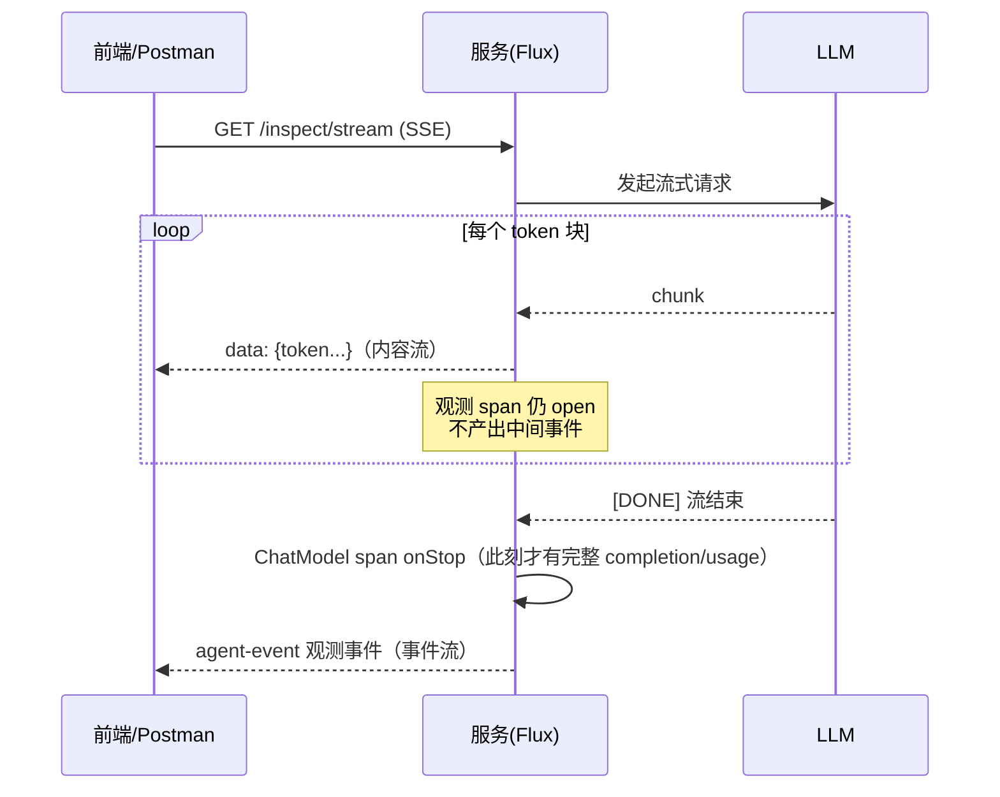
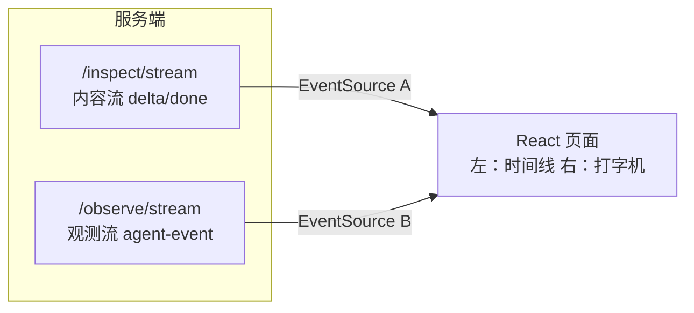

# 08 流式响应的观测：stream() 模式下的 span 闭合与部分结果

> **定位**：真实工业 Agent 的前端几乎都是流式的（打字机效果，呼应 [教程 10-SSE流式通信]）。流式给观测带来三个新问题：**span 何时闭合？中断了怎么办？事件流和内容流怎么并行推送？** 这一关把巡检 Agent 升级为 `.stream()`，让观测体系跟上流式时代。
>
> **前置阅读**：[附录 18-Observation/00]~[05]。

---

## 8.1 流式观测与同步观测的差异

javap 实证：`ChatModelObservationContext` 有 `isStreaming()` 方法——框架埋点自己区分了流式。关键行为差异：

| 维度 | `.call()` | `.stream()` |
|---|---|---|
| ChatModel span 的 stop 时机 | 拿到完整 ChatResponse 后 | **流终止（完成/取消/错误）后** |
| `log-completion` 内容 | 完整回复 | 聚合后的完整文本（框架在流结束时聚合） |
| usage（token） | response 携带 | 流末 chunk 携带，中断则缺失 |
| 中断场景 | 少（同步） | 常见：前端关页面、网络断 |



**认知要点**：观测是"段落级"的，token 是"字符级"的——**不要试图为每个 token 发观测事件**（那会把观测系统变成第二倍的流量），内容流与观测流分开推。

## 8.2 代码：流式巡检接口（`InspectionController` v4 完整文件）

```java
// src/main/java/demo/demo01/controller/InspectionController.java（本关完整版 v4）
package demo.demo01.controller;

import demo.demo01.obs.AgentEvent;
import demo.demo01.obs.AgentEventCollector;
import demo.demo01.tools.DeviceTools;
import io.micrometer.observation.Observation;
import io.micrometer.observation.ObservationRegistry;
import org.springframework.ai.chat.client.ChatClient;
import org.springframework.ai.chat.model.ChatModel;
import org.springframework.http.codec.ServerSentEvent;
import org.springframework.web.bind.annotation.GetMapping;
import org.springframework.web.bind.annotation.RequestMapping;
import org.springframework.web.bind.annotation.RequestParam;
import org.springframework.web.bind.annotation.RestController;
import reactor.core.publisher.Flux;

import java.util.List;

@RestController
@RequestMapping("/demo01")
public class InspectionController {

    private final ChatClient chatClient;
    private final AgentEventCollector eventCollector;
    private final ObservationRegistry registry;   // 08 关起：手动埋"中断观测"用

    public InspectionController(ChatModel chatModel, DeviceTools deviceTools,
                                AgentEventCollector eventCollector,
                                ObservationRegistry registry) {
        this.chatClient = ChatClient.builder(chatModel)
                .defaultTools(deviceTools)
                .build();
        this.eventCollector = eventCollector;
        this.registry = registry;
    }

    @GetMapping("/inspect")
    public String inspect(@RequestParam String prompt) {
        return chatClient.prompt().user(prompt).call().content();
    }

    @GetMapping("/events")
    public List<AgentEvent> events() {
        return eventCollector.drain();
    }

    @GetMapping(value = "/observe/stream", produces = "text/event-stream")
    public Flux<ServerSentEvent<AgentEvent>> observeStream() {
        return eventCollector.stream()
                .map(e -> ServerSentEvent.<AgentEvent>builder(e).event("agent-event").build());
    }

    @GetMapping(value = "/inspect/stream", produces = "text/event-stream")
    public Flux<ServerSentEvent<String>> inspectStream(@RequestParam String prompt) {
        String reqId = String.valueOf(System.nanoTime());   // demo 关联号；生产用 06 关 traceId
        return doStream(prompt)
                .doOnCancel(() -> Observation
                        .createNotStarted("agent.stream.cancelled", Observation.Context::new, registry)
                        .highCardinalityKeyValue("stream.req", reqId)
                        .observe(() -> { }))                 // 立即 start+stop 的事件观测
                .doOnError(e -> Observation
                        .createNotStarted("agent.stream.error", Observation.Context::new, registry)
                        .lowCardinalityKeyValue("phase", "stream")
                        .error(e)                            // 实例方法：记录异常（javap 实证，无静态 error(e, registry)）
                        .observe(() -> { }));
    }

    /** 内容流本体：同一套工具/观测埋点，换成 stream() */
    private Flux<ServerSentEvent<String>> doStream(String prompt) {
        return chatClient.prompt()
                .system("你是工厂设备巡检助手。查询工具返回 JSON 指标；温度>75 或振动>4 判定异常。")
                .user(prompt)
                .stream()
                .content()
                .map(token -> ServerSentEvent.<String>builder(token).event("delta").build())
                .concatWith(Flux.just(ServerSentEvent.<String>builder("[完成]").event("done").build()));
    }
}
```

原来的 `AgentEventCollector`、04 关 Convention/Filter、07 关指标 Handler **全部零改动**——这就是 02 关"生产者不认识消费者"架构的红利：埋点从 call 换 stream，消费侧原样工作。

## 8.3 中断与部分结果：观测的"如实记录"

WebFlux 铁律场景：客户端断开 → 上游取消 → Flux 终止。上面 `inspectStream` 里的 `doOnCancel`/`doOnError` 就是观测的正确姿势——**记录中断本身**，而不是假装没发生。三个设计说明：

1. `doOnCancel`/`doOnError` 是 Reactor 的生命周期钩子（[教程 42-响应式错误处理]），在此处埋"中断 span"最贴切——它标记的是**流的死亡方式**，业务上区分"用户主动取消"（cancel）与"系统异常"（error）。
2. `stream.req` 用高基数——它是流水号，只进 trace/事件流。
3. **部分结果的价值**：中断前已生成的 token 前端已经看到了，但 ChatModel span 的 stop 可能拿不到完整 completion。工业落地的思路：前端把已收到的 delta 上报回服务端存"部分结果"（断点续看的基础，[教程 24-多页面流式响应与会话管理]），观测侧记录中断原因即可，两者在审计层用 traceId 拼回完整现场。

## 8.4 事件流与内容流的并轨（前端时间线升级）

05 关的 `/observe/stream` 推观测事件，本关的 `/inspect/stream` 推内容。前端两条 EventSource 并联：



前端体验：打字机逐字输出的同时，右侧时间线依次点亮 `CHAT_CLIENT → LLM → TOOL → LLM`——**用户第一次"看见 Agent 思考"**。这也是 Agentic UI 的核心手法之一（[教程 18-Agentic-UI设计]）。

## 8.5 Postman 测试

| 用例 | 操作 | 现象 |
|---|---|---|
| 流式巡检 | `GET http://localhost:8080/demo01/inspect/stream?prompt=巡检CNC-001并给出建议` | Postman 逐条收到 `event: delta` 的 token，最后 `event: done` |
| 观测滞后性验证 | 同时订阅 `/observe/stream`，再发上面请求 | LLM 相关观测事件在**流结束后**才出现（span 在流终止时 stop）——与 8.1 时序图一致 |
| 中断观测 | 发起流式请求后，立即在 Postman 点 Cancel | console 出现 `agent.stream.cancelled` 观测；无 ERROR 事件（cancel 不是 error） |
| 工具照常 | 流式 prompt 里要求查两台设备 | 内容流里能观察到"卡顿-恢复"节奏（工具执行时不吐 token），时间线出现 TOOL 事件——用户可感知的工具等待 |
| 事件流对照 | `GET /demo01/events` | 与同步模式结构一致（CHAT_CLIENT/LLM/TOOL），验证消费侧零改动 |

## 8.6 本关沉淀

- 流式下 span 在**流终止时**才闭合，usage/completion 此刻才完整；中断则如实记录；
- 内容流与观测流分离推送，绝不为每 token 发观测；
- `doOnCancel`/`doOnError` 是中断观测的正确挂点；cancel ≠ error，业务含义不同；
- 埋点从 call 换 stream，Handler/Convention/Filter 零改动——架构红利的直接验证。

**下一关**：Advisor 链与 RAG 检索的观测。→ [附录 18-Observation/09]
