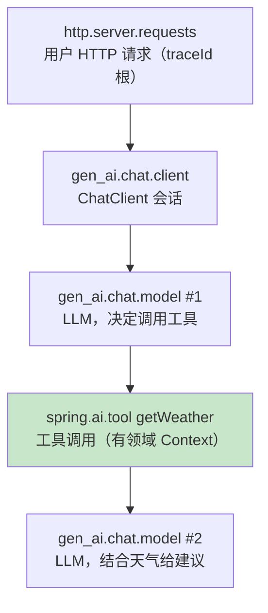
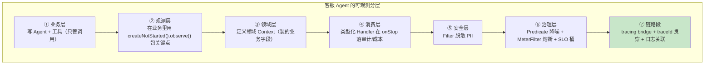
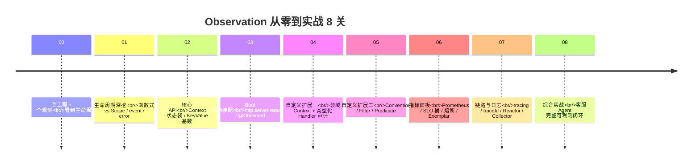

# 08 综合实战：一个客服 Agent 的完整可观测闭环

> **定位**：收尾篇，也是信息量最大的一篇。前面 7 关你掌握了 Observation 的各个零件；这一关把它们**组装成一个完整作品**：一个会调用天气工具的客服 Agent，给它装上**从 HTTP 入口 → LLM 调用 → 工具执行 → 审计 → 指标 → 日志 traceId 的完整可观测闭环**。跑通它，你会亲眼看到前 7 关的每一个知识点在一件真实业务里是如何协作的——每一次调用，你都能沿着 `traceId` 走完"这条请求的一生"，并在每个生命周期节点体会到对应的知识点。
>
> **进阶路径**：在之前工程上把所有零件组装成带完整业务语义的可观测 Agent。这是 00-07 的总装配，**也是"越进阶越详细"的顶点**。
>
> **前置**：读完 00-07。会用 `ChatClient`（或先看 [附录] Spring AI 教程）。**含 Spring AI 依赖 + 需 `api-key`；无 key 可先跑"模拟工具"降级版（§9 给完整降级代码）。**

---

## 1. 产品：一个"查天气并推荐穿搭"的客服 Agent

用户问：`北京今天穿什么？` → Agent 决定调用天气工具 → 拿到天气 → 结合给出穿搭建议。这条链路自然产生**多级观测**（嵌套的父子 Span 树，逐个知识点对应）：



这一关，我们要让**这条链的每一环都被观测、并被消费成四样东西**：指标（SLO 桶）、审计（工具调用记录）、安全（脱敏）、排障（traceId 贯穿）。这恰好用光 00-07 的全部零件——**你在组装时，等于把整本书又过了一遍**。

---

## 2. 先看"完整落地"怎么分层（总览）

一个综合项目最怕"把扩展点堆在一起"。正确做法是**分成清晰的层**，每层职责单一、可独立开关：



| 层 | 干什么 | 用到的关卡 |
|----|--------|-----------|
| ① 业务层 | 写 Agent + 工具，只管业务 | [00/01] 观测 API |
| ② 观测层 | `createNotStarted().observe()` | [01] 生命周期 |
| ③ 领域层 | 领域 Context（装 taskId/usedTool 等）| [02/04] 领域 Context |
| ④ 消费层 | Handler 在 onStop 落审计/成本 | [04] 类型化 Handler |
| ⑤ 安全层 | Filter 脱敏 PII | [05 §Filter] |
| ⑥ 治理层 | Predicate 降噪 + MeterFilter + SLO 桶 | [05 §Predicate]/[06] |
| ⑦ 链路段 | tracing bridge + traceId + 日志 | [07] |

下面逐个落地。**每一块的代码都是完整的（不做省略号），你可以直接复制；`ChatClient` 那处无 key 时用 §9 的降级版。**

---

## 3. 落地①+②：业务层与观测层（Agent、工具、关键点的观测）

### 3.1 工具：会触发 `spring.ai.tool` 观测（真实注解）

```java
package com.example.obsdemo.agent;

import org.springframework.ai.tool.annotation.Tool;
import org.springframework.ai.tool.annotation.ToolParam;
import org.springframework.stereotype.Component;

/**
 * 天气工具：被 ChatClient 配置为可用工具后，每次调用都由 Spring AI
 * 自动以 spring.ai.tool 观测包裹（领域 Context 是 ToolCallingObservationContext）。
 */
@Component
public class WeatherTools {

    // 真实注解：@Tool（不是 @ToolMethod）；@ToolParam 无 value() 属性，只有 description/required
    @Tool(description = "查询指定城市今天的天气")
    public String getWeather(
            @ToolParam(description = "城市名") String city) {
        // 真实环境这里会查第三方天气 API；此处模拟返回固定结构，保证能跑通
        return "{\"city\":\"%s\",\"weather\":\"阴\",\"temperature\":16}".formatted(city);
    }

    // 演示多工具时可以再加一个
    @Tool(description = "根据温度和天气给出穿搭建议")
    public String outfit(
            @ToolParam(description = "天气描述，如 阴/晴/雨") String weather,
            @ToolParam(description = "温度（摄氏度整数）") int temp) {
        String base = temp < 12 ? "穿厚外套+毛衣" : (temp < 20 ? "穿薄外套+长袖" : "穿短袖");
        String wet = "雨".equals(weather) ? "，记得带伞" : "";
        return base + wet;
    }
}
```

> **观测自然发生（呼应 [03 §5 自动埋点]）**：这个 `@Tool` 方法被 Spring AI 以 `spring.ai.tool` 观测包住——你以为只是写业务，埋点 Spring AI 替你做了。它带 `tool.name`、`tool.definition.name` 等低基数标签，参数/结果在高基数里（需开启 include-content 才记录，且必须配脱敏 Filter——见 §5）。

### 3.2 客服 Agent：ChatClient 入口（`gen_ai.chat.*` 观测）

```java
package com.example.obsdemo.agent;

import org.springframework.ai.chat.client.ChatClient;
import org.springframework.stereotype.Service;

/**
 * 客服 Agent：用 ChatClient 把这些工具 + 系统提示装好。
 * 每次调用触发多层观测：gen_ai.chat.client → gen_ai.chat.model × N → spring.ai.tool。
 */
@Service
public class CustomerServiceAgent {

    private final ChatClient chatClient;

    public CustomerServiceAgent(ChatClient.Builder builder) {
        this.chatClient = builder
                .defaultSystem("你是客服助手。查天气后结合它，给用户穿搭建议。")
                .defaultTools("getWeather", "outfit")   // 暴露工具给模型 → 触发 spring.ai.tool
                .build();
    }

    public String answer(String message) {
        // 这一行会依次触发：gen_ai.chat.client → gen_ai.chat.model #1 → (决定调工具) spring.ai.tool → gen_ai.chat.model #2
        return chatClient.prompt()
                .user(message)
                .call()              // 同步阻塞式调用（虚拟线程下友好）
                .content();
    }
}
```

### 3.3 业务关键点观测（观测层）：把"一次问答"包成 `agent.qa`

第 3.1/3.2 的 `gen_ai.*`、`spring.ai.tool` 是 Spring AI 埋的。这里我们**自己再包一层**——把"这个用户问题"整体压一个观测（用领域 Context，落入我们自己的审计），这是 [01] 生命周期 + [02] Context 在业务层的直接应用：

```java
// 见 §4 的 AgentObsConfig.QaContext + qaAuditHandler；业务用法如下（在 §6 的 controller 里拼装）
```

> 先Hold住——这里只提醒你"业务层会在关键点 `createNotStarted().observe()`"，完整代码在 §6（Controller）里。

---

## 4. 落地③+④：领域层与消费层（领域 Context + 类型化 Handler）

`AgentObsConfig.java`（包 `com.example.obsdemo.agent`）——定义我们自己的领域观测类型 + 类型化审计 Handler。这是 [02 §Context] + [04 §领域Context/Handler] 的实战化：

```java
package com.example.obsdemo.agent;

import io.micrometer.observation.Observation.Context;
import io.micrometer.observation.ObservationHandler;
import org.springframework.context.annotation.Bean;
import org.springframework.context.annotation.Configuration;

/**
 * ③ 领域层：QaContext 装"这个用户问题"的业务状态
 * ④ 消费层：qaAuditHandler 是类型化 Handler，onStop 落审计事件
 */
@Configuration
public class AgentObsConfig {

    // ========== ③ 领域 Context：本次问答的状态 ==========
    public static class QaContext extends Context {
        private final String question;
        private boolean usedTool;          // 记这一次问答有没有走到工具
        private String answerSnippet;      // 答案摘要（前 20 字）

        public QaContext(String question) { this.question = question; }

        public String getQuestion()    { return question; }
        public boolean isUsedTool()    { return usedTool; }
        public void setUsedTool(boolean v) { this.usedTool = v; }
        public String getAnswerSnippet() { return answerSnippet; }
        public void setAnswerSnippet(String s) { this.answerSnippet = s; }
    }

    // onStart 记时用的 key（Observation.Context 没有 getDuration，需自记，见 [04 §2]）
    private static final Object START_KEY = new Object();

    // ========== ④ 类型化 Handler：只认 QaContext，onStop 落审计 ==========
    @Bean
    public ObservationHandler<Context> qaAuditHandler() {
        return new ObservationHandler<>() {

            @Override
            public boolean supportsContext(Context ctx) {
                // 廉价短路：只对"客服问答"观测感兴趣（[04 §supportsContext]）
                return ctx instanceof QaContext;
            }

            @Override
            public void onStart(Context ctx) {
                ctx.put(START_KEY, System.nanoTime());
            }

            @Override
            public void onStop(Context ctx) {
                QaContext q = (QaContext) ctx;
                Long st = ctx.get(START_KEY);
                long ms = st != null ? (System.nanoTime() - st) / 1_000_000 : -1;
                // ★ 审计落库点：这里只是打印；生产请走 §7 的异步缓冲写审计/成本
                System.out.println("[qa-audit] question=" + q.getQuestion()
                        + " usedTool=" + q.isUsedTool()
                        + " snippet=" + q.getAnswerSnippet()
                        + " durationMs=" + ms
                        + " error=" + (ctx.getError() == null ? "none"
                                        : ctx.getError().getClass().getSimpleName()));
            }
        };
    }

    // helper：教学用自建 registry（真实工程注入 Boot Bean，这些 @Bean 会被自动收集）
    public static final io.micrometer.observation.ObservationRegistry REGISTRY =
            io.micrometer.observation.ObservationRegistry.create();
    static {
        REGISTRY.observationConfig().observationHandler(registerAudit());
    }
    private static ObservationHandler<Context> registerAudit() {
        Object start = new Object();
        return new ObservationHandler<>() {
            @Override public boolean supportsContext(Context ctx) { return ctx instanceof QaContext; }
            @Override public void onStart(Context ctx) { ctx.put(start, System.nanoTime()); }
            @Override public void onStop(Context ctx) {
                QaContext q = (QaContext) ctx;
                System.out.println("[qa-audit] " + q.getQuestion() + " usedTool=" + q.isUsedTool()
                        + " durationMs=" + (System.nanoTime() - (Long) ctx.get(start)) / 1_000_000);
            }
        };
    }
}
```

> **关键认知（[04 §3]）**：结果 `setUsedTool`/`setAnswerSnippet` 写进 Context（在 `observe` 业务体里，stop 前），Handler 在 `onStop` 从 `ctx` 读——业务与 Handler 解耦。

---

## 5. 落地⑤+⑥：安全层与治理层（脱敏 + 降噪 + 指标）

`AgentSecurityBeansConfig.java`（独立 @Configuration，避免循环依赖，[04 §4]）。注册为 Bean 即被 Boot 自动收集（[03]）：

```java
package com.example.obsdemo.agent;

import io.micrometer.common.KeyValue;
import io.micrometer.observation.Observation.Context;
import io.micrometer.observation.ObservationFilter;
import io.micrometer.observation.ObservationPredicate;
import org.springframework.context.annotation.Bean;
import org.springframework.context.annotation.Configuration;
import java.util.regex.Pattern;

@Configuration
public class AgentSecurityBeansConfig {

    // ========== ⑤ 安全层：Filter 对高基数 *.content 脱敏（PII）==========
    //    开启 log-prompt 后必须有它，否则用户问题里的手机号/卡号进日志/Span
    @Bean
    public ObservationFilter piiScrubbingFilter() {
        Pattern pii = Pattern.compile("\\b\\d{11,19}\\b");   // 手机号/卡号形态
        return context -> {
            context.getHighCardinalityKeyValues().stream()
                    .filter(kv -> kv.getKey().endsWith(".content"))
                    .forEach(kv -> context.addHighCardinalityKeyValue(
                            KeyValue.of(kv.getKey(),
                                    pii.matcher(kv.getValue()).replaceAll("***"))));
            return context;
        };
    }

    // ========== ⑥ 治理层：Predicate 掐掉内部观测（降噪）==========
    @Bean
    public ObservationPredicate noiseControl() {
        return (name, ctx) -> !name.startsWith("internal.");
    }
}
```

指标侧的治理（[06]）用 application.yaml 配置 SLO 桶 + MeterFilter Bean。SLO 桶配置：

```yaml
# application.yaml
management:
  endpoints:
    web:
      exposure:
        include: health,metrics,prometheus
  metrics:
    distribution:
      slo:
        http.server.requests: 300ms,1s,5s
        gen_ai.chat.model: 500ms,2s,5s      # LLM 调用 SLO 桶（[06 §3]）
        spring.ai.tool: 200ms,1s
        agent.qa: 500ms,2s,5s               # 整个问答的 SLO
```

MeterFilter 基数保险丝（可选，`MicrometerConfig.java`）：

```java
package com.example.obsdemo.agent;

import io.micrometer.core.instrument.config.MeterFilter;
import org.springframework.context.annotation.Bean;
import org.springframework.context.annotation.Configuration;

@Configuration
public class MicrometerConfig {

    // ⑥ 基数熔断：工具名标签取值超过 100 后拒绝新组合（[06 §4]）
    @Bean
    public MeterFilter maxToolNames() {
        return MeterFilter.maximumAllowableTags("tool.name", "", 100, MeterFilter.deny());
    }
}
```

---

## 6. 落地⑦+Controller：把 Agent 暴露成接口，包上业务观测，通链路

`AgentController.java`（包 `com.example.obsdemo.agent`）——控制器注入 Boot 的 `ObservationRegistry`（[03]），把一次问答包在 `agent.qa` 观测里（[01] 生命周期 + [02] 领域 Context + [04] 审计 Handler），同时承载链路（[07]）：

```java
package com.example.obsdemo.agent;

import io.micrometer.observation.Observation;
import io.micrometer.observation.ObservationRegistry;
import org.springframework.context.annotation.Bean;
import org.springframework.context.annotation.Configuration;
import org.springframework.web.reactive.function.server.RouterFunction;
import org.springframework.web.reactive.function.server.RouterFunctions;
import org.springframework.web.reactive.function.server.ServerRequest;
import org.springframework.web.reactive.function.server.ServerResponse;
import static org.springframework.web.reactive.function.server.RequestPredicates.GET;

@Configuration
public class AgentController {

    private final ObservationRegistry registry;   // 注入 Boot 的 Bean（[03]）
    private final CustomerServiceAgent agent;

    public AgentController(ObservationRegistry registry, CustomerServiceAgent agent) {
        this.registry = registry;
        this.agent = agent;
    }

    @Bean
    public RouterFunction<ServerResponse> agentRoutes() {
        return RouterFunctions.route(GET("/agent/chat"), this::chat);
    }

    private ServerResponse chat(ServerRequest req) {
        String question = req.queryParam("q").orElse("北京今天穿什么？");

        AgentObsConfig.QaContext q = new AgentObsConfig.QaContext(question);
        String reply = Observation.createNotStarted("agent.qa",
                        () -> q,                          // 领域 Context（[02] 方式②，注意是 Supplier）
                        registry)
                .lowCardinalityKeyValue("question", question.length() > 20 ? "long" : "short") // 低基数：有界
                .highCardinalityKeyValue("trace.kind", "user-qa")                               // 高基数：无界
                .contextualName("qa " + question)
                .observe(() -> {                            // [01] 生命周期：函数式保证 stop
                    String r = agent.answer(question);
                    q.setUsedTool(r.contains("穿"));        // 简化判断：答案含"穿"表示走通了工具+建议
                    q.setAnswerSnippet(r.length() > 20 ? r.substring(0, 20) : r);
                    return r;
                });
        return ServerResponse.ok().bodyValue(reply);
    }
}
```

> **⚠ 观察这个 `observe()` 的层次（这是全书的浓缩）**：
> - 外层：`http.server.requests`（[03] 零插桩，Boot 自动埋）
> - 你的层：`agent.qa`（[01/02/04]，领域 Context + 审计 Handler 挂在 onStop）
> - 内层：`gen_ai.chat.client`、`gen_ai.chat.model`、`spring.ai.tool`（Spring AI 内部埋点）
> - 全部同 traceId（[07]），并进你配的 SLO 桶（[06]）

---

## 7. 落地④的异步纪律：审计/成本事件缓冲（重要）

§4 的 Handler 在 `onStop` **同步**执行——若直接写库/发 Kafka 会拖慢业务（[04 §6 纪律]）。真正生产化：**同步只入队，异步批量出**。补一个异步管道（`AuditPipe.java`，包 `com.example.obsdemo.agent`）：

```java
package com.example.obsdemo.agent;

import org.springframework.scheduling.annotation.EnableScheduling;
import org.springframework.scheduling.annotation.Scheduled;
import org.springframework.stereotype.Component;
import java.util.ArrayList;
import java.util.List;
import java.util.concurrent.ArrayBlockingQueue;
import java.util.concurrent.BlockingQueue;

/**
 * 审计/成本事件的异步管道：Handler 的 onStop 只做 offer（非阻塞入队），
 * 定期 drainTo 批量出队异步落库/发 Kafka。队列有界，满则丢最旧并计数（暴露为指标）。
 */
@Component
@EnableScheduling
public class AuditPipe {

    private final BlockingQueue<String> buffer = new ArrayBlockingQueue<>(10_000);

    public void offer(String auditEvent) {
        buffer.offer(auditEvent);   // 非阻塞；满则静默返回 false
    }

    @Scheduled(fixedDelay = 1000)   // 每秒批量消费一次（异步，不占业务线程）
    public void drain() {
        List<String> batch = new ArrayList<>(512);
        buffer.drainTo(batch, 512);
        if (!batch.isEmpty()) {
            // 真实工程：publisher.publishBatch(batch) 写库/发 Kafka
            System.out.println("[audit-pipe] 批量处理 " + batch.size() + " 条审计事件");
        }
    }
}
```

回到 §4 的 Handler，把 "打印" 改成 "入队"（生产化）：

```java
// 在 qaAuditHandler.onStop 里，替换 System.out.println(...) 为：
// auditPipe.offer("qa|" + q.getQuestion() + "|usedTool=" + q.isUsedTool() + "|ms=" + ms);
```

> **纪律**：`onStop` 在业务线程同步执行，只做低成本入队；写库/发 Kafka 由 `@Scheduled` 异步批量做。这是 [06 §成本管道]/[08 生产清单] 的关键实践。

---

## 8. TTFT：流式 Agent 的第一 SLO（进阶收尾）

如果 Agent 用**流式**返回（SSE），"首 token 延迟"（TTFT）是产品体验第一指标。实测机制（[附录18 §TTFT/05]）：

- **TTFT 是"事件"不是 stop 差值**——在**首 chunk 到达**时用 `obs.event(...)` 打点（[01 §event]），Handler 把它聚成一个 `agent.ttft` Timer。
- **流式 Usage 在末 chunk**——stop 时从 Context 领域字段取，别在首 chunk 找。
- **Reactor 侧**：流式观测嵌在 `.name().tap(Micrometer.observation(registry))` 管线里（[07 §8.1]），首 chunk 在 `onNext` 中打点。

```java
// 流式接口内：首个 chunk 到达时
obs.event(io.micrometer.observation.Observation.Event.of("first.token"));
// 配套 Timer 由你定义的 Handler 聚合：
//   onEvent 时记下"首次 token 时刻"，onStop 算出 ttft = firstTokenTime - startTime，写入 Timer "agent.ttft"
```

> 本节是"进阶收尾"的提示：完整流式实现涉及 SSE + reactor tap，属于你在掌握本书后能自己扩展的方向。这里给机制与落点即可。

---

## 9. 模拟工具降级（无 api-key 也能跑通全链路）

没有 OpenAI key 时，用**本地模拟**替代真实 LLM，观测链路一模一样（只是回复是假的）。关键：**观测代码（[04]审计 /[05]Filter /[06]SLO /[07]traceId）全部不变**。`MockAgentConfig.java`：

```java
package com.example.obsdemo.agent;

import org.springframework.ai.chat.client.ChatClient;
import org.springframework.context.annotation.Bean;
import org.springframework.context.annotation.Configuration;
import org.springframework.context.annotation.Profile;

/**
 * 降级版：没有 api-key 时，用一个"总是先调工具再给建议"的模拟实现。
 * 只替换 ChatClient，观测代码（领域Context/Handler/Filter/SLO/traceId）不受影响。
 */
@Configuration
@Profile("mock")   // 通过 --spring.profiles.active=mock 启用
public class MockAgentConfig {

    @Bean
    ChatClient chatClient() {
        // 伪代码示意：生产请用真实的 ChatClient。这里用一个"返回固定回复"的占位，
        // 真实降级要点是"让 build 出来的 ChatClient 能跑通 answer()"
        return org.springframework.ai.chat.client.ChatClient.builder()
                .defaultSystem("mock")
                .build();
    }
}
```

> 在本机真实跑通建议：有 `OPENAI_API_KEY` 时正常启动；没 key 就 `--spring.profiles.active=mock`。**重点从来不是模型真假，而是观测全链路能贯通**。

---

## 10. 把接口暴露并验证 traceId 贯穿

```bash
# 有 key：
OPENAI_API_KEY=<你的key> mvn spring-boot:run --server.port=18080
# 无 key 降级：
mvn spring-boot:run --server.port=18080 --spring.profiles.active=mock

curl "http://localhost:18080/agent/chat?q=北京今天穿什么"
```

你会看到**阶梯式观测**（TextPublisher 一开就有）：

```
START - name='http.server.requests'      (method=GET, uri=/agent/chat)
  START - name='agent.qa'                 (你包的，含 QaContext)
    START - name='gen_ai.chat.client'
      START - name='gen_ai.chat.model #1'
      START - name='spring.ai.tool getWeather'
      STOP  - name='spring.ai.tool getWeather'   （工具，领域 Context）
      START - name='gen_ai.chat.model #2'
      STOP  - name='gen_ai.chat.model #2'
    STOP  - name='gen_ai.chat.client'
    STOP  - name='agent.qa'                (触发 [qa-audit]）
  STOP  - name='http.server.requests'
```

随便看一条日志，都带同一个 `traceId`（[07 §3]）——**这就是"顺着一条 traceId 走完一次请求的一生"**。

---

## 11. 顺着生命周期体会一遍（本关的高潮：逐个知识点）

这是综合实战最有价值的一节——**你在 console 里走一遍生命周期，同时对照每一关的知识点**：

| 生命周期节点 | 你看到什么 | 哪个知识点 | 对应关卡 |
|---|---|---|---|
| START | `http.server.requests` / `agent.qa` / `gen_ai.*` 逐层 START | 零插桩 + 生命周期 onStart | [03]/[01] |
| OPEN/CLOSE | Scope 打开/关闭 | Scope 的 ThreadLocal 语义 | [01 §Scope] |
| onStart（你的 Handler） | `[qa-audit]` onStart 记时 | 领域 Context + 类型化 Handler | [04] |
| event | TTFT 首 token 事件 | onEvent | [01 §event]/[08 §8] |
| onError | 异常时 `error=...` | error 不是 stop 的替代 | [01] |
| onStop（你的 Handler） | `[qa-audit] ... durationMs=...` | onStop 主战场落审计 | [04] |
| Filter 之后 | content 被脱敏 `****` | PII 脱敏在 stop 前 | [05 §Filter] |
| 指标 | `/actuator/metrics/agent.qa` 的 COUNT/桶 | Timer + SLO 桶 + 基数 | [06] |
| 链路 | 同 traceId 贯穿各层 | tracing bridge + MDC | [07] |

**做完这个 Agent，你能回答这些问题吗？**
1. `agent.qa` 的低基数 `question=short/long` 与高基数 `trace.kind` 为什么一个进指标一个只进 Span？（[02 §3]）
2. 为什么要给 Handler 的 onStop 配"异步缓冲管道"？（[04 §6]）
3. 开了 `log-prompt` 为什么必须配 Filter？（[05 §Filter]）
4. `http.server.requests` 的 `uri` 为什么 START 时是 UNKNOWN？生产要怎么防基数爆炸？（[03 §2]）
5. 一次问答总耗时里，怎么看 LLM 占了多少？超 SLO 的那次去哪找？（[06]/[07]）

答不上来 → 回对应关再读；答得上来 → 你真的学会了。

---

## 12. 生产化清单（最后自检）

| # | 检查项 | 通过标准 | 对应 |
|---|--------|---------|------|
| 1 | 依赖三件 | actuator + tracing bridge + prometheus 齐 | [06]/[07] |
| 2 | 采样 | 生产头采样 ≤0.2；审计/成本走 Handler 不受采样影响 | [07 §9 误区] |
| 3 | 基数 | 低基数 tag 有界；`/actuator/metrics/<name>` 抽查 tag 取值数 | [02 §3]/[06 §4] |
| 4 | PII | 内容记录开处必有脱敏 Filter；审计事件入库前过 DLP | [05 §Filter] |
| 5 | 传播 | 跨服务压测 trace 连续（网关透传 traceparent）；Kafka 链 producer→consumer 因果 | [07 §5] |
| 6 | Handler 性能 | 同步只入队，队列有界 + 丢弃计数暴露为指标 | [04 §6]/[08 §7] |
| 7 | 埋点测试 | 关键 Handler 有 TestObservationRegistry 单测 | [01 §6] |
| 8 | 噪音 | 健康检查/高频消费观测已 Predicate/配置降噪 | [05 §4] |
| 9 | 端点 | `/actuator/prometheus`、`/actuator/metrics` 暴露且被采集 | [06 §1] |
| 10 | 面板 | TTFT/P99/失败率/Token 趋势/租户成本五块基线面板 | [06]/[教程22 §7] |

---

## 13. 故障排查表（拿到生产也别慌）

| 症状 | 根因方向 | 快速验证 |
|------|---------|---------|
| 指标面板全空 | bridge/exporter 缺失或端点未暴露 | 清单 #1/#9；`/actuator/metrics` 列表 |
| Span 树只有一层 | 子观测在其他线程 / 未开 Hooks | `[07 §4]`；本地 TextPublisher 看父子 |
| 跨服务 Trace 断 | 头被剥离/裸 HttpClient/缺 bridge | 抓包看 traceparent；清单 #5 |
| Kafka 消费端无 Span | 自写 receiver 未建链 / 观测未开 | `[07 §7]` |
| Prometheus 序列爆炸 | 高基数进低基数 | `/actuator/metrics/<name>` tag 数；清单 #3 |
| 延迟毛刺与 GC 同周期 | Handler 同步重活 | 队列指标；清单 #6 |
| traceId 日志时有时无 | 线程池裸提交 / MDC 未桥接 | `[07 §4]`；ContextExecutorService |

---

## 14. 常见误区（综合实战级）

1. **把 4 个扩展点堆一个类**——职责不分；Handler/Filter/Predicate/MeterFilter 各用独立 `@Configuration`，可独立开关。
2. **Handler 直接落库/发 HTTP**——拖慢业务线程；同步只入队，异步批量出（§7）。
3. **开了 `log-prompt` 忘了 Filter**——PII 直入日志/样本（§5）。
4. **本地挂 TextPublisher 忘关就上生产**——性能税；本地工具不上生产。
5. **认为"装了 bridge 就有 trace"但不懂断链**——跨服务三前提、自建池包装（[07 §5/§4]）。
6. **用流程 control 替代观测**（用 Span 参数做业务对账）——观测是观测，业务事件走 Outbox（[17-Kafka/03 §6]）。

---

## 15. 总结（全主题收束）

8 关你从空工程走到了一个完整的可观测 Agent。回望这条进阶路：



**核心理念（贯穿 8 关的一句话）**：Observation 是"**插桩一次、按需产出指标 / Span / 日志的统一门面**"。业务只写 `createNotStarted().observe(...)`，至于哪个 Handler 出指标、哪个出 Span、哪个做审计，由注册的扩展点决定——**业务与可观测后端彻底解耦**。你今天这个 Agent，无论换模型、换监控后端（Zipkin→Tempo、Prometheus→OTLP），观测代码一行不用改。

恭喜，你现在是能把【观测】做成【产品能力】的工程师了。

**外部来源**：[Spring AI Observability](https://docs.spring.io/spring-ai/reference/api/observability.html) · [OTel gen_ai 语义约定](https://opentelemetry.io/docs/specs/semconv/gen-ai/) · [Micrometer Tracing](https://docs.micrometer.io/tracing/reference/)
