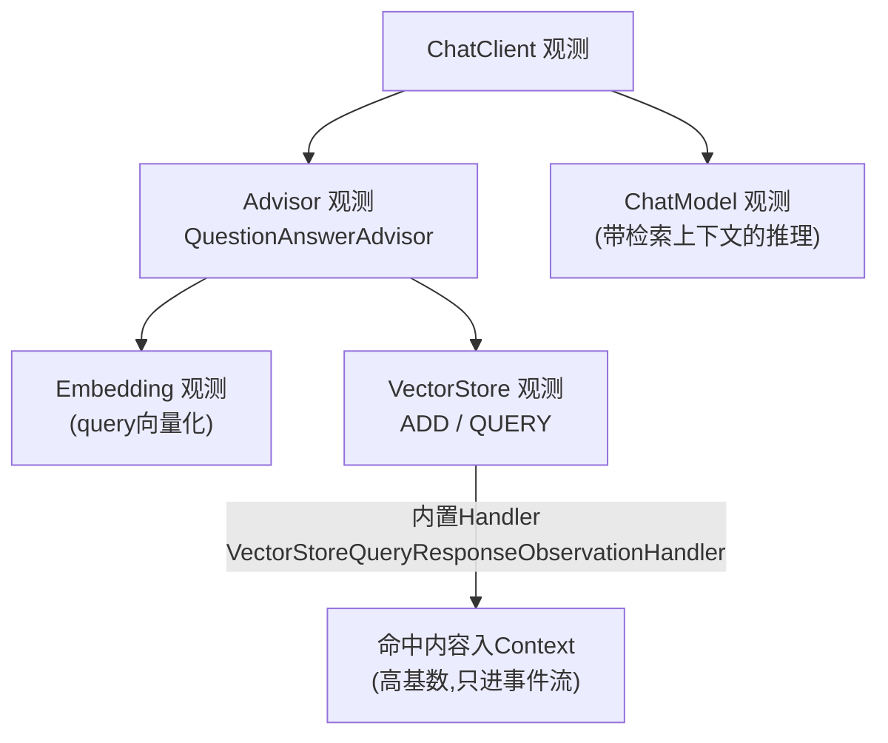
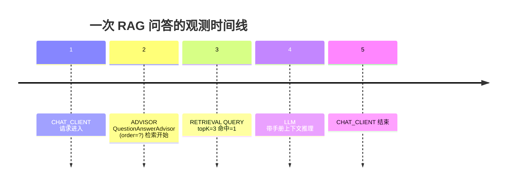

# 09 Advisor 与 RAG 观测：让检索质量可观测

> **定位**：Agent 一旦上 RAG（工业场景：设备手册、维修知识库），"检索得好不好"直接决定回答质量——而检索是黑盒重灾区。这一关观测两条链路：**Advisor 链**（RAG 就是通过 Advisor 注入的）与**向量检索**（TopK、命中文档数、相似度阈值、耗时）。javap 实证载体：`AdvisorObservationContext`（`getAdvisorName/getOrder/getChatClientRequest`）与 `VectorStoreObservationContext`（`getQueryRequest/getQueryResponse/getDimensions/getSimilarityMetric`）。
>
> **前置阅读**：[教程 05-RAG检索增强生成]、[教程 14-Advisor链与拦截器]、[附录 18-Observation/02]。

---

## 9.1 RAG 场景下你要回答的三个观测问题

1. **这次回答检索了吗？**（Agentic 场景下检索可能是模型决策的）——看有没有 `db` 观测；
2. **检索回了什么？**（命中文档数、相似度）——高基数内容，只进事件流/trace；
3. **Advisor 耗时分布如何？**（embedding + 检索占了总时延多少）——Advisor span 与 VectorStore span 的嵌套关系直接可见。



## 9.2 依赖与准备

> **需在 pom.xml 中添加依赖**（demo01 已有 pgvector profile：`-Ddemo.pgvector=pgvector` 激活，含 vector-store + advisor）：

向量库用 PgVector（`spring-ai-starter-vector-store-pgvector` + `spring-ai-vector-store-advisor`）。**没有本地 PG 也能学**：本关核心是观测结构，VectorStore 换 `SimpleVectorStore`（内存实现，spring-ai-vector-store 自带）全部结论不变——学习第一，零安装（与 07 关同一原则）。新增两个配置类（完整文件）：

```java
// src/main/java/demo/demo01/config/SimpleVectorStoreConfig.java（完整文件，零安装路线）
package demo.demo01.config;

import org.springframework.ai.embedding.EmbeddingModel;
import org.springframework.ai.vectorstore.SimpleVectorStore;
import org.springframework.ai.vectorstore.VectorStore;
import org.springframework.context.annotation.Bean;
import org.springframework.context.annotation.Configuration;

@Configuration
public class SimpleVectorStoreConfig {

    @Bean
    public VectorStore vectorStore(EmbeddingModel embeddingModel) {
        return SimpleVectorStore.builder(embeddingModel).build();
    }
}
```

```java
// src/main/java/demo/demo01/config/KnowledgeBaseInitializer.java（完整文件）
package demo.demo01.config;

import org.springframework.ai.document.Document;
import org.springframework.ai.vectorstore.VectorStore;
import org.springframework.boot.ApplicationRunner;
import org.springframework.stereotype.Component;

import java.util.List;

/** 启动时一次性灌入"设备手册"，模拟工业知识库（ApplicationRunner：容器就绪后执行） */
@Component
public class KnowledgeBaseInitializer implements ApplicationRunner {

    private final VectorStore vectorStore;

    public KnowledgeBaseInitializer(VectorStore vectorStore) {
        this.vectorStore = vectorStore;
    }

    @Override
    public void run(org.springframework.boot.ApplicationArguments args) {
        vectorStore.add(List.of(
                new Document("CNC-001 主轴温度超过75度需停机检查冷却系统，常见原因是冷却液不足或散热器堵塞。"),
                new Document("AGV-07 振动超过4说明导轮磨损，建议更换导轮并校准轨道。")));
    }
}
```

## 9.3 RAG Agent：Advisor 注入检索（`InspectionController` v5 完整文件）

```java
// src/main/java/demo/demo01/controller/InspectionController.java（本关完整版 v5）
package demo.demo01.controller;

import demo.demo01.obs.AgentEvent;
import demo.demo01.obs.AgentEventCollector;
import demo.demo01.tools.DeviceTools;
import io.micrometer.observation.Observation;
import io.micrometer.observation.ObservationRegistry;
import org.springframework.ai.chat.client.ChatClient;
import org.springframework.ai.chat.client.advisor.vectorstore.QuestionAnswerAdvisor;
import org.springframework.ai.chat.model.ChatModel;
import org.springframework.ai.vectorstore.SearchRequest;
import org.springframework.ai.vectorstore.VectorStore;
import org.springframework.http.codec.ServerSentEvent;
import org.springframework.web.bind.annotation.GetMapping;
import org.springframework.web.bind.annotation.RequestMapping;
import org.springframework.web.bind.annotation.RequestParam;
import org.springframework.web.bind.annotation.RestController;
import reactor.core.publisher.Flux;

import java.util.List;

@RestController
@RequestMapping("/demo01")
public class InspectionController {

    private final ChatClient chatClient;
    private final AgentEventCollector eventCollector;
    private final ObservationRegistry registry;

    public InspectionController(ChatModel chatModel, DeviceTools deviceTools,
                                AgentEventCollector eventCollector,
                                ObservationRegistry registry,
                                VectorStore vectorStore) {
        this.chatClient = ChatClient.builder(chatModel)
                .defaultTools(deviceTools)
                .defaultAdvisors(QuestionAnswerAdvisor.builder(vectorStore)
                        .searchRequest(SearchRequest.builder()
                                .topK(3)
                                .similarityThreshold(0.5)
                                .build())
                        .build())
                .build();
        this.eventCollector = eventCollector;
        this.registry = registry;
    }

    @GetMapping("/inspect")
    public String inspect(@RequestParam String prompt) {
        return chatClient.prompt().user(prompt).call().content();
    }

    @GetMapping("/events")
    public List<AgentEvent> events() {
        return eventCollector.drain();
    }

    @GetMapping(value = "/observe/stream", produces = "text/event-stream")
    public Flux<ServerSentEvent<AgentEvent>> observeStream() {
        return eventCollector.stream()
                .map(e -> ServerSentEvent.<AgentEvent>builder(e).event("agent-event").build());
    }

    @GetMapping(value = "/inspect/stream", produces = "text/event-stream")
    public Flux<ServerSentEvent<String>> inspectStream(@RequestParam String prompt) {
        String reqId = String.valueOf(System.nanoTime());
        return doStream(prompt)
                .doOnCancel(() -> Observation
                        .createNotStarted("agent.stream.cancelled", Observation.Context::new, registry)
                        .highCardinalityKeyValue("stream.req", reqId)
                        .observe(() -> { }))
                .doOnError(e -> Observation
                        .createNotStarted("agent.stream.error", Observation.Context::new, registry)
                        .lowCardinalityKeyValue("phase", "stream")
                        .error(e)
                        .observe(() -> { }));
    }

    private Flux<ServerSentEvent<String>> doStream(String prompt) {
        return chatClient.prompt()
                .system("你是工厂设备巡检助手。查询工具返回 JSON 指标；温度>75 或振动>4 判定异常。")
                .user(prompt)
                .stream()
                .content()
                .map(token -> ServerSentEvent.<String>builder(token).event("delta").build())
                .concatWith(Flux.just(ServerSentEvent.<String>builder("[完成]").event("done").build()));
    }
}
```

## 9.4 观测侧：新增 Advisor 与 VectorStore 两个 Handler（完整文件）

```java
// src/main/java/demo/demo01/obs/RagObservationHandlers.java（完整文件）
package demo.demo01.obs;

import io.micrometer.observation.Observation;
import io.micrometer.observation.ObservationHandler;
import io.micrometer.tracing.Span;
import io.micrometer.tracing.Tracer;
import org.springframework.ai.chat.client.advisor.observation.AdvisorObservationContext;
import org.springframework.ai.vectorstore.observation.VectorStoreObservationContext;
import org.springframework.context.annotation.Configuration;
import org.springframework.stereotype.Component;

import java.time.Instant;

/** Advisor + 检索质量观测：产出"检索环节"专属事件（一个文件两个 Handler，事件都走 collector.accept 统一出口） */
@Configuration
public class RagObservationHandlers {

    @Component
    public static class AdvisorTraceHandler implements ObservationHandler<AdvisorObservationContext> {

        private final AgentEventCollector collector;
        private final Tracer tracer;

        public AdvisorTraceHandler(AgentEventCollector collector, Tracer tracer) {
            this.collector = collector;
            this.tracer = tracer;
        }

        @Override
        public boolean supportsContext(Observation.Context ctx) {
            return ctx instanceof AdvisorObservationContext;
        }

        @Override
        public void onStop(AdvisorObservationContext ctx) {
            collector.accept(new AgentEvent("ADVISOR", ctx.getAdvisorName(),
                    "order=" + ctx.getOrder(), traceId(), Instant.now()));
        }

        private String traceId() {
            Span span = tracer.currentSpan();
            return span != null ? span.context().traceId() : "no-trace";
        }
    }

    @Component
    public static class VectorStoreTraceHandler implements ObservationHandler<VectorStoreObservationContext> {

        private final AgentEventCollector collector;
        private final Tracer tracer;

        public VectorStoreTraceHandler(AgentEventCollector collector, Tracer tracer) {
            this.collector = collector;
            this.tracer = tracer;
        }

        @Override
        public boolean supportsContext(Observation.Context ctx) {
            return ctx instanceof VectorStoreObservationContext;
        }

        @Override
        public void onStop(VectorStoreObservationContext ctx) {
            String detail = "operation=" + ctx.getOperationName()
                    + " topK=" + (ctx.getQueryRequest() != null ? ctx.getQueryRequest().getTopK() : "?")
                    + " 命中=" + (ctx.getQueryResponse() != null ? ctx.getQueryResponse().size() : 0);
            collector.accept(new AgentEvent("RETRIEVAL", ctx.getOperationName(), detail, traceId(), Instant.now()));
        }

        private String traceId() {
            Span span = tracer.currentSpan();
            return span != null ? span.context().traceId() : "no-trace";
        }
    }
}
```

两个工程细节：

- `collector.accept(...)` 是 03 关就留下的公共入口（05 关接 SSE 也在它里面）——本关两个 Handler 直接复用，前端时间线不用区分事件来自哪个 Handler。**注意**：若你未做 06 关（没引 tracing bridge），去掉 `Tracer` 相关字段即可，traceId 传 `"no-trace"`。
- **`getQueryResponse()` 可能为 null**——ADD 操作没有查询结果；QUERY 操作才有。观测代码对 null 的容忍不是防御式编程，是这个 API 的真实状态机。
- 内置的 `VectorStoreQueryResponseObservationHandler`（javap 实证存在于 spring-ai-vector-store）会把命中内容放入高基数标签——**生产慎用**：命中文档正文进标签 = 基数灾难 + 内容泄露，自建 Handler 只取 `size()` 正是 07 关基数纪律的实践。

## 9.5 RAG 全链路的观测事件序列（预期）

一次 `CNC-001 主轴温度高怎么办？` 的 `/ask` 请求：



回答质量排障的黄金路径：**答案胡说 → 查 RETRIEVAL 事件 → 命中 0 或命中了无关文档 → 调 topK/阈值/切库**。观测把"模型问题"和"检索问题"切开了——这是 RAG 可观测的核心价值。

## 9.6 Postman 测试

| 用例 | 操作 | 现象 |
|---|---|---|
| RAG 问答 | `GET /demo01/inspect?prompt=CNC-001主轴温度高该怎么处理` | 回答含手册内容（冷却系统/散热器），而非泛泛建议 |
| 检索事件 | 查 `/demo01/events` 或订阅 SSE | 出现 `ADVISOR(QuestionAnswerAdvisor)` 与 `RETRIEVAL(QUERY topK=3 命中=1)` 事件，位于两个 LLM 事件之间 |
| 命中数变化 | 问一个知识库没有的问题（"食堂菜单"） | `命中=0`，回答退化为模型常识——用观测解释"为什么答得差" |
| 工具 vs 检索对比 | `prompt=查CNC-001实时状态` | 无 RETRIEVAL 事件、有 TOOL 事件；RAG 问答反之——两种知识来源在时间线上一眼可辨 |
| Embedding 观测 | 观察事件流/console | RETRIEVAL 前有 embedding 相关 span（query 向量化）——检索耗时的大头常在这里 |

## 9.7 本关沉淀

- Advisor/VectorStore/Embedding 都有原生观测点，加 Handler 即可消费；
- 检索质量三要素：检索了吗（有无 span）、命中多少（size）、命中好坏（内容看 trace）；前两个进事件流，第三个只进 trace；
- 内置 QueryResponse Handler 会把文档正文放高基数标签，生产用自建 Handler 只取聚合值；
- RAG 排障先看时间线再怀疑模型——观测切开"检索问题"与"模型问题"。

**下一关**：观测代码自己怎么测？trace 怎么跨服务传？→ [附录 18-Observation/10]
