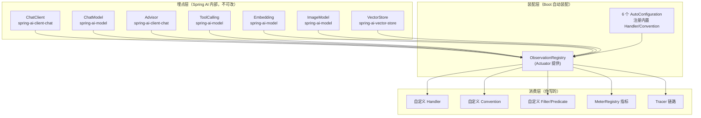

# 11 深度整合：Spring AI 2.0 与 Observation 的完整结合面

> **定位**：实战总装前的**深度基准篇**。00-10 你逐关学会了用观测，这一关把镜头拉远：Spring AI 2.0 到底在**哪些位置**埋了观测、每个位置**给你什么**、**全部配置键**长什么样、Boot **自动装配链**如何把它们串起来、你在**每个环节**的替换点在哪。全部结论来自本地 2.0.0 jar 的 javap/字节码实证（铁律 0），读完这一篇，Spring AI 2.0 的观测整合面在你手里没有盲区。
>
> **前置阅读**：[附录 18-Observation/00]~[10]。**读者画像**：准备把 Observation 用进生产、需要一张"完整地图"再动手的架构师。
>
> **版本基准**：Spring Boot 4.1.0 + Spring AI 2.0.0 + micrometer-observation 1.17.0。

---

## 11.1 整合全景：三层结构一张图

Spring AI 与 Observation 的结合是清晰的三层——**埋点层（框架代码里的 Observation 调用）→ 装配层（Boot 自动装配把 Registry/Handler/Convention 连起来）→ 消费层（你写的 Handler/指标/trace/前端）**：



**核心契约**：埋点层只依赖 `ObservationRegistry` 一个接口——所以消费层加多少种消费者，框架代码零感知（00 关"收音机"比喻的架构保障）。

## 11.2 七大观测点完全清单（jar 实证）

| # | 观测点 | 领域 Context（真实 FQCN） | 所在 jar | span 名（DEFAULT_NAME 实证） | 你能拿到什么 |
|---|---|---|---|---|---|
| 1 | ChatClient 调用 | `o.s.ai.chat.client.observation.ChatClientObservationContext` | spring-ai-client-chat | `spring.ai.chat.client` | 请求上下文、advisor/工具清单（高基数） |
| 2 | ChatModel 调用 | `o.s.ai.chat.observation.ChatModelObservationContext` | spring-ai-model | `gen_ai.client.operation`（contextual 名 `chat "provider"`） | 完整 Prompt、ChatResponse、**Usage/Token**、全部请求参数（temperature/topK…） |
| 3 | Advisor 执行 | `o.s.ai.chat.client.advisor.observation.AdvisorObservationContext` | spring-ai-client-chat | —（按 advisor 名） | `getAdvisorName()/getOrder()/getChatClientRequest()/getChatClientResponse()` |
| 4 | 工具调用 | `o.s.ai.tool.observation.ToolCallingObservationContext` | spring-ai-model | `spring.ai.tool` | `getToolDefinition()`（名/描述/Schema）、`getToolCallArguments()`、`setToolCallResult()`、`getToolType()/getToolCallId()` |
| 5 | Embedding | `o.s.ai.embedding.observation.EmbeddingModelObservationContext` | spring-ai-model | `gen_ai.client.operation`（embedding 语境） | 输入文本数、维度（`getDimensions()`）、usage |
| 6 | ImageModel | `o.s.ai.image.observation.ImageModelObservationContext` | spring-ai-model | — | prompt、options |
| 7 | VectorStore | `o.s.ai.vectorstore.observation.VectorStoreObservationContext` | spring-ai-vector-store | 按 operation | `getOperationName()/getDatabaseSystem()/getCollectionName()/getQueryRequest()/getQueryResponse()/getDimensions()/getSimilarityMetric()` |

> 这张表就是"你能观测什么"的上限——任何监控需求，先到这里找对应的 Context；表里没有的（如"模型排队时间"），才需要自己埋业务观测（01 关的 `shift.resolve` 姿势）。

## 11.3 配置键总表（全量 9 个，全部本地 2.0.0 metadata 实证）

| 配置键 | 默认 | 作用层 | 说明 |
|---|---|---|---|
| `spring.ai.chat.client.observations.log-prompt` | false | **ChatClient 层** | 请求 prompt 进 ChatClient 观测上下文 |
| `spring.ai.chat.client.observations.log-completion` | false | **ChatClient 层** | 回复内容进 ChatClient 观测上下文 |
| `spring.ai.chat.observations.log-prompt` | false | **ChatModel 层** | 发给 LLM 的完整 prompt 进 ChatModel 观测 |
| `spring.ai.chat.observations.log-completion` | false | **ChatModel 层** | LLM 回复进 ChatModel 观测 |
| `spring.ai.chat.observations.include-error-logging` | false | ChatModel 层 | 错误信息进观测 |
| `spring.ai.image.observations.log-prompt` | false | ImageModel 层 | 图像 prompt 进观测 |
| `spring.ai.tools.observations.include-content` | false | **ToolCalling 层** | 工具参数+结果进观测 |
| `spring.ai.vectorstore.observations.log-query-response` | false | **VectorStore 层** | 检索命中文档进观测 |

**两个易踩的细节**（实证发现，多数教程讲错）：

1. **`chat.client` 与 `chat` 是两层不同的观测**：`spring.ai.chat.client.observations.*` 控制 ChatClient 层 span 的内容；`spring.ai.chat.observations.*` 控制 ChatModel 层。同一次请求里两层 span 都存在（01 关 span 树），打开哪层的内容就在哪层看；
2. **全部默认 false 不是偷懒，是合规设计**：内容（prompt/参数/结果）都是高基数+潜在敏感数据，默认不进观测管道；打开必须配套脱敏（04 关范式）。

## 11.4 自动装配解剖：六个 AutoConfiguration 与 Tracer 双分支

jar 实证的装配类与关键行为：

| 模块（autoconfigure artifact） | AutoConfiguration 类 | 装配了什么 |
|---|---|---|
| model-chat-client | `ChatClientAutoConfiguration` | ChatClient.Builder（观测随 Registry 自动生效）+ chat.client 层内容 handler |
| model-chat-observation | `ChatObservationAutoConfiguration` | `ChatModelMeterObservationHandler`（token/耗时指标）+ 内容/错误 handler |
| model-tool | `ToolCallingAutoConfiguration` | 工具内容 filter/handler（`include-content` 开关） |
| model-embedding-observation | `EmbeddingObservationAutoConfiguration` | embedding 指标 handler |
| model-image-observation | `ImageObservationAutoConfiguration` | image 内容 handler |
| vector-store-observation | `VectorStoreObservationAutoConfiguration` | `VectorStoreQueryResponseObservationHandler`（`log-query-response` 开关） |

**TracerPresent / TracerNotPresent 双分支**（javap 实证存在于 `ChatObservationAutoConfiguration` 内部类）：classpath 有 tracing bridge 时，`ErrorLoggingObservationHandler` 走带 `Tracer` 的构造（错误日志带 traceId），否则走降级构造。**这就是 06 关"引一个依赖，错误日志自动带链路号"的装配层原理**——你不用配任何东西，Boot 按依赖在场与否自动选择。

**你的替换点规则**（与 04 关实践互为印证）：

| 想替换什么 | 怎么做 | 装配依据 |
|---|---|---|
| 默认 Convention | 容器里放同类型 Bean（必要时 `@Primary`） | 自动装配 `@ConditionalOnMissingBean` 退位 |
| 加 Handler | `@Component`/`@Bean` 即自动挂 Registry | Boot 收集所有 `ObservationHandler` Bean |
| 加 Filter | `@Bean ObservationFilter` | 同上 |
| 掐观测 | `@Bean ObservationPredicate` | 同上 |

## 11.5 标签字典：三套 KeyNames 枚举全量（实证枚举值）

**ChatClient 观测**（`ChatClientObservationDocumentation`）：

| 基数 | 枚举 | 落到标签的 key |
|---|---|---|
| Low | `SPRING_AI_KIND` / `STREAM` | `spring_ai_kind`、是否流式 |
| High | `CHAT_CLIENT_ADVISORS` / `CHAT_CLIENT_TOOL_NAMES` / `CHAT_CLIENT_CONVERSATION_ID` | advisor 清单、工具名清单、会话 id |

**ChatModel 观测**（`ChatModelObservationDocumentation`）——**成本治理的金矿**：

| 基数 | 枚举 | key |
|---|---|---|
| Low | `AI_OPERATION_TYPE` / `AI_PROVIDER` / `REQUEST_MODEL` / `RESPONSE_MODEL` | `gen_ai.operation.name`、`gen_ai.system.provider`、请求/响应模型名 |
| High | `REQUEST_TEMPERATURE/TOP_P/TOP_K/MAX_TOKENS/FREQUENCY_PENALTY/PRESENCE_PENALTY/STOP_SEQUENCES/STREAM/TOOL_NAMES`、`RESPONSE_ID/FINISH_REASONS`、**`USAGE_INPUT_TOKENS/OUTPUT_TOKENS/TOTAL_TOKENS/CACHE_READ_INPUT_TOKENS/CACHE_WRITE_INPUT_TOKENS`** | 全部推理参数 + Token 四件套 + 缓存命中 |

**ToolCalling 观测**（`ToolCallingObservationDocumentation`）：

| 基数 | 枚举 | key |
|---|---|---|
| Low | `AI_OPERATION_TYPE` / `AI_PROVIDER` / `SPRING_AI_KIND` / `TOOL_DEFINITION_NAME` / `TOOL_TYPE` | 工具名、工具类型（可聚合） |
| High | `TOOL_DEFINITION_DESCRIPTION` / `TOOL_DEFINITION_SCHEMA` / `TOOL_CALL_ID` / `TOOL_CALL_ARGUMENTS` / `TOOL_CALL_RESULT` | 描述/Schema/调用号/参数/结果 |

读法示范：`USAGE_CACHE_READ_INPUT_TOKENS`（缓存读 token）——DeepSeek 这类支持上下文缓存的模型，这个标签直接量化"缓存省了多少钱"，是 07 关成本计量的框架原生增强点（你只需在 Handler 里从 ChatResponse usage 取数，标签名对齐此约定即可与生态工具互通）。

## 11.6 完整整合工程（demo01 风格，零省略）

把上述整合面落成一个"全开关"配置——这是**风格基准版**：ChatClient 在 `ChatConfig` 里用自动装配的 `ChatClient.Builder` 建、controller 只 `@Autowired` 现成 Bean、工具类不挂容器、方法参数隐式绑定（与你的 src 完全同构）：

```java
// src/main/java/demo/demo01/config/ChatConfig.java（完整文件，整合基准版）
package demo.demo01.config;

import demo.demo01.tools.TimeTool;
import org.springframework.ai.chat.client.ChatClient;
import org.springframework.context.annotation.Bean;
import org.springframework.context.annotation.Configuration;

@Configuration
public class ChatConfig {
    @Bean
    public ChatClient chatClient(ChatClient.Builder builder) {
        return builder
                .defaultTools(new TimeTool())   // 工具对象不进容器，注册即用（demo01 习惯）
                .build();                       // Builder 内部已带 ObservationRegistry——观测自动生效
    }
}
```

```java
// src/main/java/demo/demo01/controller/InspectionController.java（完整文件，整合基准版）
package demo.demo01.controller;

import org.springframework.ai.chat.client.ChatClient;
import org.springframework.beans.factory.annotation.Autowired;
import org.springframework.web.bind.annotation.GetMapping;
import org.springframework.web.bind.annotation.RequestMapping;
import org.springframework.web.bind.annotation.RestController;
import reactor.core.publisher.Flux;

@RestController
@RequestMapping("/demo01")
public class InspectionController {
    @Autowired
    private ChatClient client;

    @GetMapping("/inspect")
    public String inspect(String prompt) {           // 隐式参数绑定（demo01 习惯）
        return client.prompt().user(prompt).call().content();
    }
}
```

```yaml
# src/main/resources/application-demo01.yaml（observation 段，全键总览）
spring:
  ai:
    chat:
      observations:
        log-prompt: true            # ChatModel 层：完整 prompt 入观测
        log-completion: true        # ChatModel 层：回复入观测
        include-error-logging: true # 错误信息入观测（排障期打开）
    chat.client:
      observations:
        log-prompt: true            # ChatClient 层：请求侧内容
        log-completion: true        # ChatClient 层：响应侧内容
    tools:
      observations:
        include-content: true       # 工具参数+结果入观测
    vectorstore:
      observations:
        log-query-response: true    # 检索命中文档入观测（RAG 排障用）
management:
  endpoints:
    web:
      exposure:
        include: health,metrics
```

**架构师读法**：`ChatClient.Builder` 是 Boot 自动装配的——它内部已注入 `ObservationRegistry`，所以**你从不用手动把 Registry 塞给 ChatClient**；观测生效与否的唯一开关是 classpath（Actuator 在不在）。这就是"约定优于配置"在观测层的完整形态。

## 11.7 每层自定义入口汇总（决策速查）

| 层 | 自定义入口 | 典型场景（本系列实证过的） |
|---|---|---|
| ChatClient 观测 | `ChatClientObservationConvention` Bean | 加会话/租户标签（多租户归因） |
| ChatModel 观测 | `ChatModelObservationConvention` Bean | 04 关 shift 班次标签；对齐 gen_ai 语义约定 |
| ToolCalling 观测 | `ToolCallingObservationConvention` Bean | 工具名规范化、工具分级标签 |
| VectorStore 观测 | `VectorStoreObservationConvention` Bean | 检索库/集合名标签 |
| 任意层 Handler | `ObservationHandler<T>` + `supportsContext` | 03 关事件流、07 关 token/耗时、11 关审计 |
| 内容收尾 | `ObservationFilter` | 04 关审计标记/脱敏位 |
| 观测降噪 | `ObservationPredicate` | 07 关 security 噪声掐除 |
| 指标兜底 | `MeterFilter` | 07 关基数熔断 |

**选型口诀**：改标签找 Convention、拿数据找 Handler、改内容找 Filter、砍流量找 Predicate、保指标找 MeterFilter——五个动词对应五类组件，永不再混。

## 11.8 Postman 验证（整合面自查清单）

| # | 用例 | 操作 | 验收现象 |
|---|---|---|---|
| 1 | 全观测点生效 | 按上文建好 ChatConfig/controller/yaml，`GET /demo01/inspect?prompt=现在几点？当前什么班次？` | console（TextPublisher 在场时）同时出现 `spring.ai.chat.client`、`gen_ai.client.operation`（contextual `chat "deepseek..."`）、`spring.ai.tool` 三类 span |
| 2 | 两层内容键独立 | 把 `chat.client.observations.log-prompt` 关掉、`chat.observations.log-prompt` 留着 | ChatClient 层 span 无 prompt 内容、ChatModel 层仍有——验证 11.3 细节 1 |
| 3 | 工具内容开关 | `tools.observations.include-content` 改 false | tool span 里无 `gen_ai.tool.call.arguments/result` |
| 4 | Token 四件套 | 打开 log-completion 后查 ChatModel span 高基数标签 | 出现 `gen_ai.usage.input_tokens/output_tokens/total_tokens`（缓存标签视模型支持） |
| 5 | 替换点验证 | 容器放 04 关 `ShiftChatModelConvention`（@Primary） | ChatModel span 多出 `shift` 标签，默认标签不丢 |

## 11.9 本篇沉淀

- 三层结构（埋点/装配/消费）+ 七观测点 + 九配置键 + 六装配类 = Spring AI 2.0 观测整合面的完整清单；
- `chat.client` 与 `chat` 是两层观测、两套内容键；内容键默认全关是合规设计；
- `ChatClient.Builder` 自带 Registry——观测开关在 classpath，不在代码；
- TracerPresent/NotPresent 双分支解释了 tracing bridge 的"零配置生效"；
- Token 四件套（含缓存读/写）是成本治理的框架原生数据源。

**下一关**：带着这张完整地图，进入总装配。→ [附录 18-Observation/12]
