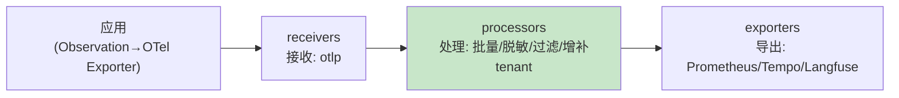

# 00-OTel 管道与 gen_ai 语义

> **定位**：教程 [31-全链路可观测性](../../教程/04-企业级架构主干/02-全链路可观测性.md) 与 [项目28-可观测平台](../../项目/28-企业级Agent统一可观测平台/00-需求分析与架构设计.md) 的下钻层。深挖两件事：**① OTel Collector 管道工程**（接收/处理/导出三段，Agent 遥测的管道骨架）② **gen_ai 语义约定落地**（LLM 调用/工具/检索 Span 的标准属性，跨厂商可对齐）。读完你能把"散落各服务的 Span"组织成一条可查询、可聚合、语义统一的 Agent 遥测管道。
>
> **前置阅读**：[教程 04-企业级架构主干/02-全链路可观测性](../../教程/04-企业级架构主干/02-全链路可观测性.md)、[教程 05-Observation可观测/00-最小闭环：Agent各阶段输出打印到控制台](../../教程/05-Observation可观测/00-最小闭环：Agent各阶段输出打印到控制台.md)。

---

## 1. 为什么需要 Collector 管道

应用直连后端（Prometheus/Tempo/Langfuse）的问题是：**每加一个后端就要改应用、每条遥测重复发送、无统一清洗**。OTel Collector 的三段管道解决：



| 段 | Agent 场景关键能力 |
|----|-------------------|
| receivers | OTLP 接收（gRPC/HTTP），多服务统一入口 |
| processors | **batch**（吞吐）、**attributes**（补租户/业务线标签）、**redaction**（Prompt 脱敏——遥测里的敏感内容处理）、tail_sampling（按错误/慢调用采样保留） |
| exporters | 指标→Prometheus、Trace→Tempo/Jaeger、LLM 专用→Langfuse |

**要点**：**脱敏放 processor**——Prompt/补全内容进遥测前统一清洗（呼应 [教程 03-React前端与AgenticUI/01-React状态管理](../../教程/04-企业级架构主干/05-历史记录持久化与合规.md)），应用侧不用每处自己脱敏。

## 2. gen_ai 语义约定（Span 的标准词汇）

OpenTelemetry 的 **gen_ai 语义约定**让不同框架/厂商的 LLM 遥测**说同一种话**——Span 属性有统一名：

| Span 类型 | 关键属性（gen_ai.*） |
|-----------|---------------------|
| LLM 调用 | `gen_ai.system`（openai/deepseek…）、`gen_ai.request.model`、`gen_ai.usage.input_tokens`/`output_tokens`、`gen_ai.response.finish_reason` |
| 工具调用 | 工具名/入参摘要/结果状态（呼应 [教程 04-企业级架构主干/03-工具执行可观测与审计](../../教程/04-企业级架构主干/03-工具执行可观测与审计.md) 的 ToolCallingObservationContext） |
| 检索 | 查询摘要/命中数/topk |

```java
// 概念代码：按 gen_ai 语义打点（Micrometer Observation → OTel 语义桥接）
Observation.createNotStarted("chat.completion", registry)
    .lowCardinalityKeyValue("gen_ai.system", "openai")
    .lowCardinalityKeyValue("gen_ai.request.model", "gpt-4o-mini")
    .observe(() -> callModel(...));
// usage 在 stop 时通过 Observation.Context 放入(Spring AI 的 chat observation 自动带 usage,
// 配置 spring.ai.chat.observations.log-prompt 等, 见 CLAUDE.md 配置键基准)
```

**价值**：语义统一后，"所有服务的 Token 消耗""所有工具 P95 延迟"可以**跨服务聚合查询**——这是项目28 单一玻璃板的地基。

## 3. tail_sampling（Agent 遥测的取舍）

Agent 一次会话几十个 Span，全量留存成本高。**尾部采样**策略：
- 错误/DEGRADED 的 trace **必留**（排障证据）。
- 慢调用（P99 之外）**必留**。
- 正常快调用按比例采样（如 5%）。
- **但成本相关指标（usage）不走采样**——指标是预聚合的，不受 trace 采样影响（呼应 [教程 03-React前端与AgenticUI/03-Agentic-UI设计](../../教程/04-企业级架构主干/07-成本治理与Token计量.md)）。

## 4. 落地清单

1. 应用：Micrometer Observation + OTel Exporter（Spring Boot starter 集成，配置键见附录18）。
2. Collector：receivers(otlp) → processors(batch+attributes 补租户+redaction) → exporters(三路)。
3. 语义：LLM/工具/检索 Span 按 gen_ai 约定命名（自定义扩展用自有前缀避免冲突）。
4. 采样：错误/慢全留 + 正常按比；usage 走指标不采样。

---

## 总结

Agent 可观测的管道工程 = **Collector 三段（接收/处理/导出）+ gen_ai 统一语义 + 尾部采样取舍**。三条纪律：脱敏在 processor 统一做；语义按 gen_ai 约定说标准话；错误 trace 永不全采样。完整平台落地（单一玻璃板/成本归因/告警根因）→ [项目28-企业级Agent统一可观测平台](../../项目/28-企业级Agent统一可观测平台/00-需求分析与架构设计.md)。
