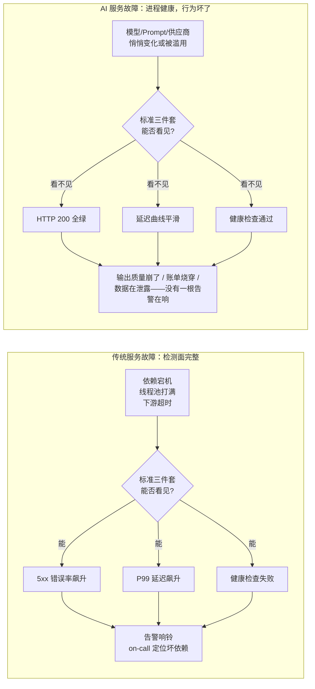
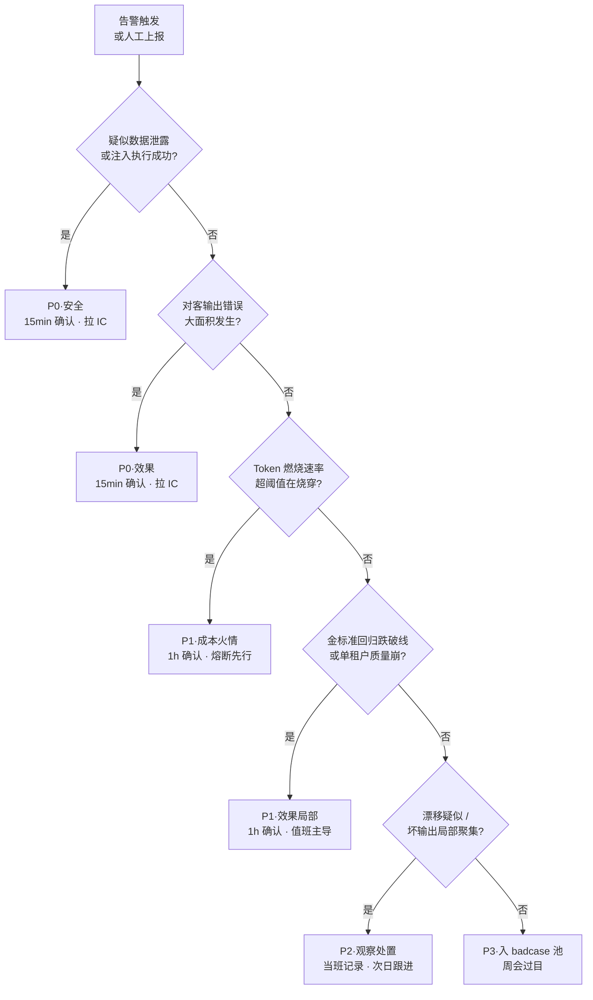
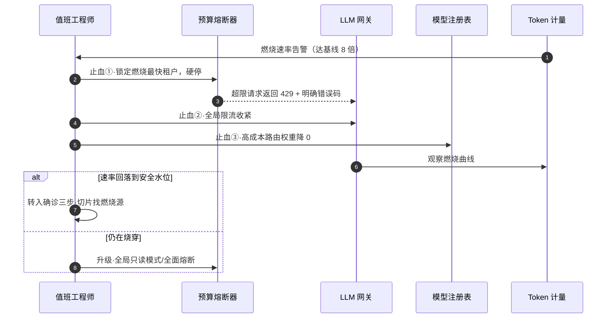
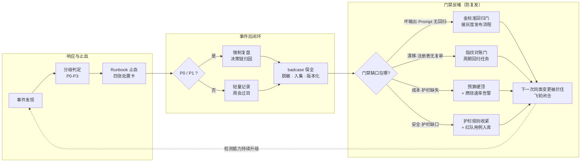

# 01-AI 事件响应工程

> **定位**：本篇是可观测系列的"最后一公里"——**事件响应（Incident Response for LLM Services）**。[附录 18-可观测平台实践/00-OTel管道与gen_ai语义](00-OTel管道与gen_ai语义.md) 解决"遥测怎么出海"，教程 05 系列解决"看得懂"，[教程 10-调优实战与方法论/00-Agent病理总论](../../教程/10-调优实战与方法论/00-Agent病理总论.md) 解决"怎么归因"，本篇解决最后一环：**告警响了（或该响没响）之后，值班工程师按什么流程处置、止血、复盘**。全体系此前对"事件响应"只有零星清单项（如 [附录 12-AI治理与合规/00-NIST-AI-RMF框架](../12-AI治理与合规/00-NIST-AI-RMF框架.md) 的响应职能矩阵、[项目 08-Agent供应链安全网关/07-事件响应与取证](../../项目/08-Agent供应链安全网关/07-事件响应与取证.md) 的安全取证专篇），本篇给出**跨项目通用的 LLM 服务事件响应工程**：四种 AI 特有事件形态 → P0-P3 分级 → 四张 Runbook 处置卡 → 告警分层设计 → 闭环复盘与门禁反哺 → 演练。
>
> **读者画像**：Agent 平台 / LLM 服务的 on-call 工程师、SRE、平台负责人——你已经建好了观测与灰度设施，现在要让它们在凌晨三点真的能用。
>
> **前置阅读**：[附录 18-可观测平台实践/00-OTel管道与gen_ai语义](00-OTel管道与gen_ai语义.md)、[教程 05-Observation可观测/07-指标治理：Token计量、SLO与基数熔断](../../教程/05-Observation可观测/07-指标治理：Token计量、SLO与基数熔断.md)、[教程 04-企业级架构主干/09-灰度发布与版本管理](../../教程/04-企业级架构主干/09-灰度发布与版本管理.md)。

---

## 1. 为什么 AI 事件不是"传统故障的加速版"

传统服务故障的本质是**依赖坏**：数据库连不上、线程池打满、下游超时。这类故障有完整的检测面——错误率、延迟、健康检查三板斧几乎总能看见，on-call 的核心工作是"定位哪个依赖坏了"。**AI 服务故障的本质常常是"行为坏"**：进程完全健康、HTTP 200 全绿、延迟曲线平滑，但输出质量崩了、账单在燃烧、供应商悄悄换了模型、攻击者在批量试探。传统检测面对这四类故障**整体失明**。



这不是说观测体系白建了——恰恰相反，**AI 事件响应的所有确诊手段都建立在观测资产之上**。三者的分工可以用急诊医学类比：观测体系（[附录 18-可观测平台实践/00-OTel管道与gen_ai语义](00-OTel管道与gen_ai语义.md)、[教程 05-Observation可观测/06-Trace链路：traceId贯穿HTTP、LLM、工具与日志](../../教程/05-Observation可观测/06-Trace链路：traceId贯穿HTTP、LLM、工具与日志.md)）是 CT 机和化验单，负责把证据采集出来；分环节体检（[教程 10-调优实战与方法论/01-环节体检：五环节指标与判病阈值](../../教程/10-调优实战与方法论/01-环节体检：五环节指标与判病阈值.md)）是临床判读，负责把症状钉到具体环节；**本篇是急诊流程**——病人送进来之后谁拍板、先做什么后做什么、什么算处置完成。没有前两者，本篇是空转的流程文件；没有本篇，前两者只是躺在 Grafana 里的好看曲线。

AI 事件响应与传统事件响应还有两个工程上的关键差异，贯穿全篇：

1. **止血手段不同**。传统止血是"回滚版本/切流量/扩容"；AI 止血多了三类独特开关——**模型注册表一键回切、Prompt 版本回滚、语义缓存全量清空**。这些开关必须是**预授权的一键动作**，不能等事件发生时再走审批。
2. **"健康"的定义不同**。AI 服务的 SLO 不只有可用性和延迟，还有**效果 SLO**（拒答率、负反馈率、金标准回归分）和**成本 SLO**（token 燃烧速率）。没有效果与成本两个 SLO 面，四类 AI 事件里有三类根本无法"发现"——这是告警设计（§5）要解决的核心问题。

## 2. AI 事件的四种特有形态

四种形态的共性：**传统可观测信号（错误率/延迟/CPU）全部正常或接近正常**。逐一看症状、根因与"为什么传统告警哑火"。

### 2.1 坏输出风暴（Bad-Output Storm）

**定义**：一次模型/Prompt/检索变更导致大面积低质量回答，服务层面"完全健康"。典型引入路径：Prompt 模板上线的一个措辞改动破坏了 few-shot 对齐；模型注册表切了新版本但 System Prompt 未适配；灰度比例配置错误让未验证版本吃到了 100% 流量。

**为什么传统告警哑火**：模型对任何输入都会"成功返回"——哪怕答非所问。状态码、耗时、token 数都正常。唯一的异常在**语义层**：拒答率上升、负反馈按钮被点爆、回答与问题不相关。这要求效果类信号（§5.1）作为一等告警源存在。

**与体系资产的接口**：确诊靠 [教程 10-调优实战与方法论/01-环节体检：五环节指标与判病阈值](../../教程/10-调优实战与方法论/01-环节体检：五环节指标与判病阈值.md) 的分环节指标把"效果差"钉到五环节之一；止血靠 [教程 04-企业级架构主干/09-灰度发布与版本管理](../../教程/04-企业级架构主干/09-灰度发布与版本管理.md) 的 Prompt 版本回滚与灰度比例一键收缩。

### 2.2 成本火情（Cost Fire）

**定义**：账单以小时级速度烧穿预算。三大燃烧源：**Agent 循环不收敛**（工具返回错误信息 → 模型重试 → 再失败 → 轮次打满）、**工具重试风暴**（下游抖动触发无上限重试，每次重试都携带完整上下文重新计费）、**攻击者刷量**（盗用 key 或业务逻辑漏洞批量调用）。

**为什么传统告警哑火**：每次调用都成功、延迟正常——只是**调用量与单位调用 token 翻了几倍**。绝对值阈值告警（"日预算超 1000 元"）发现时已经烧完；必须用**燃烧速率**（当前速率 / 基线速率的倍数）才能在烧穿前数小时发现（§5.2）。

**与体系资产的接口**：计量靠 `gen_ai.client.token.usage` 指标（[教程 05-Observation可观测/07-指标治理：Token计量、SLO与基数熔断](../../教程/05-Observation可观测/07-指标治理：Token计量、SLO与基数熔断.md)、[教程 04-企业级架构主干/07-成本治理与Token计量](../../教程/04-企业级架构主干/07-成本治理与Token计量.md)）；止血靠租户级预算熔断与循环护栏（最大轮次/最大 token 硬顶）。

### 2.3 静默模型漂移（Silent Drift）

**定义**：供应商端点**悄悄替换了底层模型**（同名模型升级、路由策略调整），效果在数天到数周内缓降，全程无任何日志异常。与 2.1 的区别：**没有你方的变更可对账**——变更加在供应商侧，你的变更对账系统永远查不到。

**为什么传统告警哑火**：供应商不会发公告，API 合同（模型名）没变，成功率与延迟甚至可能更好。唯一的信号是**效果曲线的缓慢下滑**——这正是 [教程 08-架构师进阶/10-多模型协作与供应策略](../../教程/08-架构师进阶/10-多模型协作与供应策略.md) §6 注册表复审机制存在的原因：金标准问题集的周期回归是漂移的**唯一可靠探针**。

**与体系资产的接口**：发现靠金标准集周期回归（[教程 10-调优实战与方法论/01-环节体检：五环节指标与判病阈值](../../教程/10-调优实战与方法论/01-环节体检：五环节指标与判病阈值.md) 的金标准问题集与对照法）；止血靠多供应商冗余切换（[教程 08-架构师进阶/10-多模型协作与供应策略](../../教程/08-架构师进阶/10-多模型协作与供应策略.md)）。

### 2.4 安全事件爆发（Injection Burst）

**定义**：提示注入、越狱、数据泄露的**批量尝试**——红队威胁模型（[附录 08-Agent安全深度/04-红队与对抗测试方法论](../08-Agent安全深度/04-红队与对抗测试方法论.md)）的"活体版"。红队篇教你**主动**找漏洞，本形态处理**被动**挨打的时刻：有人正在批量试探你的系统。攻击形态从单发注入（[附录 08-Agent安全深度/00-Prompt注入分类与案例](../08-Agent安全深度/00-Prompt注入分类与案例.md)）升级为聚簇流量：单账号高频异构 prompt、模板化越狱批量投放、对工具参数边界的系统性探测。

**为什么传统告警哑火**：WAF 看到的是正常 API 调用；注入文本对 LLM 服务是"合法输入"。检测必须依赖**护栏触发计数**与**输入语义聚类**——前者是护栏组件的观测输出，后者要求对输入样本做周期聚类分析（§5.3）。

**与体系资产的接口**：确诊与取证深化见 [项目 08-Agent供应链安全网关/07-事件响应与取证](../../项目/08-Agent供应链安全网关/07-事件响应与取证.md)；护栏建设见 [教程 04-企业级架构主干/14-输入输出护栏与内容审核](../../教程/04-企业级架构主干/14-输入输出护栏与内容审核.md)。

### 四形态总览

| 形态 | 一句话症状 | 传统信号 | 唯一可靠的发现信号 | 第一止血动作 |
|------|-----------|---------|-------------------|-------------|
| 坏输出风暴 | 大面积答非所问，服务"全绿" | 全正常 | 效果类：拒答率/负反馈率/抽检 | Prompt 版本回滚或模型回切 |
| 成本火情 | 账单小时级烧穿 | 全正常 | 成本类：token 燃烧速率倍数 | 预算熔断（不是找根因） |
| 静默模型漂移 | 效果数日缓降无日志异常 | 全正常 | 金标准集周期回归跌破线 | 注册表权重降 0 切备份 |
| 安全事件爆发 | 批量注入/泄露尝试 | 全正常 | 安全类：护栏触发计数/聚类 | 收紧护栏 + 冻结涉案账号 |

## 3. 事件分级：P0-P3

分级回答两个问题：**多快要动手**（响应时限）与**谁能拍板**（升级路径）。AI 事件的分级判据必须包含效果、成本、安全三个面，传统服务的"可用性"只是 P0 的充分条件之一而非必要条件。

| 级别 | 定义 | 典型判据 | 确认时限 | 缓解时限 | 升级路径与决策权 |
|------|------|---------|---------|---------|----------------|
| **P0** | 对客伤害正在发生且大面积 | ① 对客输出错误大面积发生（效果 SLO 跌破底线且影响多租户）；② 数据泄露疑似（护栏拦到真实泄露迹象或泄露路径成立）；③ 注入执行成功的实锤（工具被诱导执行了写操作） | 15 分钟 | 1 小时内完成止血或降级 | 立即拉起 Incident Commander（IC）；平台 owner 到场；涉泄露时知会法务/合规，对外沟通由 IC 统一决策；全员停止非相关发布 |
| **P1** | 明确损失在累积但可控 | ① Token 燃烧速率超阈（如基线 8 倍）；② 单租户输出质量崩（坏输出聚集于单租户/单场景）；③ 金标准回归跌破门禁线 | 1 小时 | 4 小时内缓解 | 值班工程师主导，平台 owner 远程待命；可动用全部预授权止血开关 |
| **P2** | 异常确认但损失速率低 | 漂移疑似（金标准缓降未破线）；坏输出局部聚集但影响面小 | 当班内 | 次日 | 值班工程师记录并开跟进单，纳入周会 |
| **P3** | 观察项 | 单次 badcase、无聚簇迹象的负反馈 | — | 排期 | 入 badcase 池，周会过目 |

两条纪律让分级不只是表格：**其一，"疑似即升级"**——数据泄露疑似就是 P0，不需要等实锤（泄露的代价是时间的非线性函数）；**其二，升级降级都要留痕**——判定理由写进事件单，复盘时校准判据本身。



## 4. Runbook：四张处置卡（本篇核心）

### 统一处置骨架与三条纪律

每张卡都是同一个骨架的五段展开：**发现信号 → 确诊三步 → 止血动作 → 根因归位 → 复盘**。三条纪律先于一切细节：

1. **先止血，后根因**。所有根因分析都在止血完成之后进行。成本火情的第一动作是熔断不是找根因——追根因的每一分钟账单都在烧。
2. **止血开关必须预授权**。模型回切、Prompt 回滚、缓存清空、预算熔断这四个开关在演练中验证过、在制度上免审批。事件中现走审批的 Runbook 是文学创作。
3. **每步有完成判据**。"已回滚"不是完成判据；"金标准 10 分钟子集回归分回到基线 ±3%，持续 15 分钟"才是。没有判据的步骤会被"看起来做了"糊弄过去。

### 4.1 坏输出风暴处置卡

| 阶段 | 动作 | 依赖资产 | 完成判据 |
|------|------|---------|---------|
| 发现信号 | 效果类告警：拒答率/负反馈率超阈、LLM-as-Judge 抽检不合格率突增、用户渠道反馈聚集 | §5.1 效果告警、[教程 08-架构师进阶/03-自我反思与Agent评估](../../教程/08-架构师进阶/03-自我反思与Agent评估.md) 的评估闭环 | 分级为 P0/P1，事件单建立 |
| 确诊① | **变更对账**：列出近 24h 全部变更——Prompt 版本、模型注册表、路由权重、灰度比例、上游端点配置 | 灰度设施的变更审计日志（[教程 04-企业级架构主干/09-灰度发布与版本管理](../../教程/04-企业级架构主干/09-灰度发布与版本管理.md)） | 得到带时间戳的变更清单 |
| 确诊② | **分环节定位**：用五环节体检把"效果差"钉到检索/工具/模型/上下文/编排之一——比如检索环节正常而模型环节掉分，嫌疑收敛到模型/Prompt 变更 | [教程 10-调优实战与方法论/01-环节体检：五环节指标与判病阈值](../../教程/10-调优实战与方法论/01-环节体检：五环节指标与判病阈值.md) | 问题钉到具体环节 |
| 确诊③ | **金标准快速回归**：跑 10 分钟子集，对比变更前后得分 | 金标准集（评测集治理见 [附录 11-评估与可观测生态/02-评估数据集管理与版本化](../11-评估与可观测生态/02-评估数据集管理与版本化.md)） | 变更前后的量化得分差 |
| 止血 | **按确诊结果二选一或叠加**：Prompt 回滚到上一版本（灰度设施一键回退）；模型注册表回切旧版本/权重降 0。两者都无效 → 切降级话术或只读模式，保住可用性底线 | 灰度设施、模型注册表（[教程 04-企业级架构主干/12-模型路由与降级](../../教程/04-企业级架构主干/12-模型路由与降级.md)） | 效果告警回落、金标准子集回到基线 ±3% 持续 15 分钟 |
| 根因归位 | 把问题钉到具体变更的具体缺陷（如"few-shot 示例与新版 System Prompt 指令冲突"），并回答**为什么门禁没拦住** | 变更记录 + 确诊③得分差 | 根因一句话 + 门禁缺口一句话 |
| 复盘 | badcase 入集；决策链归因（§6）；按缺口新增门禁规则 | §6 闭环流程 | 门禁规则合入并生效 |

### 4.2 成本火情处置卡

| 阶段 | 动作 | 依赖资产 | 完成判据 |
|------|------|---------|---------|
| 发现信号 | 成本类告警：token 燃烧速率达基线倍数阈值（非绝对值） | §5.2 燃烧速率告警 | 分级 P1（伴随服务受损则 P0），事件单建立 |
| 止血①（**第一动作**） | **租户级预算熔断**：锁定燃烧最快的租户/会话，硬停并返回明确错误码 | 预算熔断器（[教程 04-企业级架构主干/07-成本治理与Token计量](../../教程/04-企业级架构主干/07-成本治理与Token计量.md)） | 燃烧曲线出现明显拐点 |
| 止血② | **限流收紧**：全局 RPM/TPM 阈值下调，给确诊争取时间 | 网关限流设施 | 全局调用速率压到安全水位 |
| 止血③ | 若单模型/单路由是燃烧主体：该路由**权重降 0**，流量切到低成本模型 | 模型注册表、路由权重（[教程 08-架构师进阶/10-多模型协作与供应策略](../../教程/08-架构师进阶/10-多模型协作与供应策略.md)） | 高成本路由归零 |
| 确诊① | **切片找燃烧源**：按租户/用户/会话/工具聚合 token 消耗，取 Top-N | `gen_ai.client.token.usage` 按标签聚合（§5.2） | 燃烧源定位到具体维度值 |
| 确诊② | **定性燃烧模式**：循环不收敛（trace 里同工具反复调用）/ 重试风暴（trace 里下游错误 + 重试链）/ 刷量（单账号高频异构请求） | Trace 链路（[教程 05-Observation可观测/06-Trace链路：traceId贯穿HTTP、LLM、工具与日志](../../教程/05-Observation可观测/06-Trace链路：traceId贯穿HTTP、LLM、工具与日志.md)） | 模式定性完成 |
| 确诊③ | 按定性走分支：循环 → 检查工具返回是否给了可行动错误信息（[教程 10-调优实战与方法论/03-工具调优上：接口设计学](../../教程/10-调优实战与方法论/03-工具调优上：接口设计学.md)）；重试风暴 → 检查重试参数；刷量 → 转 4.4 安全卡 | 对应调优篇目 | 燃烧根因一句话 |
| 根因归位 | 循环护栏缺失 / 重试无上限 / 租户配额缺失 / 鉴权漏洞，四选一或并存 | — | 缺口清单 |
| 复盘 | 按缺口新增护栏：最大轮次硬顶、重试上限与退避、租户日预算硬顶 | §6 门禁反哺 | 护栏合入并在预发实测触发 |

止血动作的时序如下——注意熔断（第 1-2 步）先于一切确诊（第 5 步之后）：



### 4.3 静默模型漂移处置卡

| 阶段 | 动作 | 依赖资产 | 完成判据 |
|------|------|---------|---------|
| 发现信号 | 金标准集**周期回归**跌破线（如日环比降 5%）；或用户效果投诉缓升 + 无对应变更 | 周期回归任务（注册表复审，[教程 08-架构师进阶/10-多模型协作与供应策略](../../教程/08-架构师进阶/10-多模型协作与供应策略.md) §6） | 分级 P2（伴随大面积坏输出升 P0/P1） |
| 确诊① | **分类型拆解**：金标准分按问题类型拆开，看是全谱系掉分（模型整体变了）还是某类掉分（如长文档类） | 金标准集分类型标注 | 掉分谱系画像 |
| 确诊② | **模型指纹核对**：响应元数据中的模型标识与注册表登记比对；对同批输入做**双模型对照实验**（当前端点 vs 上次已知好版本），量化行为差异 | 对照法（[教程 10-调优实战与方法论/01-环节体检：五环节指标与判病阈值](../../教程/10-调优实战与方法论/01-环节体检：五环节指标与判病阈值.md)） | 漂移实锤 + 差异量化 |
| 止血 | 该端点**权重降 0**，流量切到备份供应商/备份版本；通知供应商要求解释与补偿方案 | 多供应商冗余（[教程 08-架构师进阶/10-多模型协作与供应策略](../../教程/08-架构师进阶/10-多模型协作与供应策略.md)） | 金标准子集回归到基线水位 |
| 根因归位 | 缺口不是"供应商换了模型"（这无法控制），而是**我方为何第 N 天才发现**——周期回归的频率/覆盖是否足够，模型指纹对账是否在自动执行 | — | 检测延迟的量化（发现时已漂移多少天） |
| 复盘 | 周期回归频率上调或覆盖面扩大；注册表增加指纹自动对账项 | §6 门禁反哺 | 复审机制升级合入 |

### 4.4 安全事件爆发处置卡

| 阶段 | 动作 | 依赖资产 | 完成判据 |
|------|------|---------|---------|
| 发现信号 | 安全类告警：护栏触发计数突增、单账号高频异构 prompt、注入特征聚类命中 | §5.3 安全告警、护栏观测（[教程 04-企业级架构主干/14-输入输出护栏与内容审核](../../教程/04-企业级架构主干/14-输入输出护栏与内容审核.md)） | 分级（疑似成功即 P0，否则 P1/P2） |
| 确诊① | **攻击样本聚类**：把触发样本按模式归类（直接注入/间接注入/越狱模板/编码绕过），看是否同一套模板批量投放 | 聚类分析 + [附录 08-Agent安全深度/00-Prompt注入分类与案例](../08-Agent安全深度/00-Prompt注入分类与案例.md) 的分类法 | 攻击模板画像 |
| 确诊② | **判定是否成功**：抽查护栏拦截日志之外的"放行"请求——注入文本是否真的改变了行为（泄露了系统提示、诱导了工具调用）。**这一步决定 P0 还是 P1** | 输出抽检 + Trace 审计 | 成功/未成功的实锤结论 |
| 确诊③ | **溯源**：账号/IP/会话聚集度、时间分布、是否盗用 key | 审计日志（[教程 04-企业级架构主干/05-历史记录持久化与合规](../../教程/04-企业级架构主干/05-历史记录持久化与合规.md)） | 攻击源画像 |
| 止血 | 护栏规则紧急收紧（新增攻击模板特征）；涉案账号/key 冻结；受影响能力降级到只读或白名单工具集；确认泄露成立时按 P0 升级流程通报合规 | 预授权护栏热更新、账号管控 | 攻击成功率归零、燃烧源冻结 |
| 根因归位 | 泄露/执行路径成立的根因（护栏缺口、工具权限过宽）→ **红队用例库反哺**：本轮攻击模板全部变成回归用例 | [附录 08-Agent安全深度/04-红队与对抗测试方法论](../08-Agent安全深度/04-红队与对抗测试方法论.md) | 红队用例库新增并纳入门禁 |
| 复盘 | 取证与留痕深化见 [项目 08-Agent供应链安全网关/07-事件响应与取证](../../项目/08-Agent供应链安全网关/07-事件响应与取证.md)；决策链归因（§6） | §6 | 复盘报告 + 门禁规则 |

### 止血工具箱

四张卡的止血动作收敛为四个预授权开关，逐一明确**前置条件**——没有前置条件的开关在事件中不可信：

| 开关 | 作用 | 前置条件（平时建成） | 关联设施 |
|------|------|---------------------|---------|
| 模型一键回切 | 注册表改权重/摘端点，秒级生效，不动代码 | 注册表热更新 + 权重校验 + 回切演练 | [教程 04-企业级架构主干/12-模型路由与降级](../../教程/04-企业级架构主干/12-模型路由与降级.md) |
| Prompt 版本回滚 | 灰度设施回退到上一已验证版本 | Prompt 版本化 + 每版绑定金标准回归分 | [教程 04-企业级架构主干/09-灰度发布与版本管理](../../教程/04-企业级架构主干/09-灰度发布与版本管理.md)、[教程 10-调优实战与方法论/02-Prompt调优工程](../../教程/10-调优实战与方法论/02-Prompt调优工程.md) |
| 语义缓存全量清空 | 被污染/失效的缓存答案一键下线 | 缓存键带 Prompt 版本号 + 清空接口幂等 | [附录 09-语义缓存与性能/00-语义缓存实现](../09-语义缓存与性能/00-语义缓存实现.md) |
| 限流/预算熔断 | 租户级硬停、全局降级、只读模式 | 租户配额体系 + 熔断器 + 明确错误码 | [教程 04-企业级架构主干/07-成本治理与Token计量](../../教程/04-企业级架构主干/07-成本治理与Token计量.md) |

## 5. 告警设计：AI 特有指标与防疲劳分层

### 5.1 三类告警源

**效果类**。质量无法全量人工判，靠代理指标 + 抽检组合：结构化拒答率（模型显式拒答的比例）、用户负反馈率（点踩/重问率）、LLM-as-Judge 抽检不合格率（工程化见 [附录 11-评估与可观测生态/01-LLM-as-Judge工程化](../11-评估与可观测生态/01-LLM-as-Judge工程化.md)）、金标准集周期回归分。前两个是分钟级在线信号，后两个是小时/天级离线信号——**在线信号负责快，离线信号负责准**。

**成本类**。核心设计决策：**用燃烧速率而非绝对值阈值**。绝对值阈值（"日预算剩 20%"）发现时损失已成定局；速率告警（"当前小时 token 量为上周同时段 8 倍"）在烧穿前数小时就响。速率需要差分计算——Micrometer Counter 是自启动以来的累计值，告警任务保存上次快照做差（见下方代码）。

**安全类**。护栏触发计数（按规则类型分维度）、单账号请求模式异常（高频 + 输入语义异构）、注入特征命中率。安全告警天然偏低频高信噪，重点是**聚簇判定**：单发注入是 P3 样本，聚簇爆发才是事件。

### 5.2 指标底座（实证）

燃烧速率与成本归因的指标底座是 Spring AI 2.0.0 原生产出的 Micrometer 指标（本地 jar 字节码实证，非文档转述）：

| 元素 | 实证结果 | 实证方式 |
|------|---------|---------|
| 指标名 | `AiObservationMetricNames.TOKEN_USAGE` = `gen_ai.client.token.usage`；`OPERATION_DURATION` = `gen_ai.client.operation.duration` | spring-ai-commons 2.0.0 `javap -c`，字节码 `ldc` 常量 |
| 计量维度标签 | `AiObservationMetricAttributes.TOKEN_TYPE` = `gen_ai.token.type`，取值 `input` / `output` / `total`（`AiTokenType` 枚举） | 同上 |
| 告警分组标签 | `AiObservationAttributes`：`gen_ai.operation.name`、`gen_ai.system`（供应商）、`gen_ai.request.model`、`gen_ai.request.stream` 等 | 同上 |
| 生成链路 | `ChatModelMeterObservationHandler(MeterRegistry)` 在 `onStop` 读取 `ChatResponseMetadata.getUsage()`，经 `ModelUsageMetricsGenerator.generate(Usage, Observation.Context, MeterRegistry)` 注册 `Counter` 并按 token 类型累加 | spring-ai-model 2.0.0 `javap -c` 逐条方法签名 |
| 查询 API | `MeterRegistry.find(String)` → `Search`，`.tag(k,v).counters()` 返回 `Collection<Counter>`（`find` 查不到返回空，不抛异常；`get` 版本查不到抛 `MeterNotFoundException`，告警代码用 `find` 更稳） | micrometer-core 1.15.12 `javap` |

只要 `spring-boot-starter-actuator` 在 classpath，`ChatModelMeterObservationHandler` 自动装配、无需写代码——这与 [教程 05-Observation可观测/07-指标治理：Token计量、SLO与基数熔断](../../教程/05-Observation可观测/07-指标治理：Token计量、SLO与基数熔断.md) 的结论一致。燃烧速率检测在其上做差分与倍数判定：

```java
// 依赖：spring-boot-starter-actuator（demo01 pom 已有）；需 @EnableScheduling 开启调度
// 指标名/标签名/查询 API 均经本地 2.0.0 jar javap 实证（见 §5.2 表格）
// Spring AI 2.0.0 / Boot 4.1.0 / Java 21
@Component
public class TokenBurnRateAlarm {

    private final MeterRegistry meterRegistry;      // io.micrometer.core.instrument.MeterRegistry
    private final AlarmNotifier notifier;           // 自研：接值班响应通道（P1 响呼）

    private double lastTotal = -1;                  // Counter 是累计值，用快照差分出速率
    private Instant windowStart = Instant.now();

    public TokenBurnRateAlarm(MeterRegistry meterRegistry, AlarmNotifier notifier) {
        this.meterRegistry = meterRegistry;
        this.notifier = notifier;
    }

    @Scheduled(fixedDelay = 60_000)                 // 每分钟差分一次
    public void checkBurnRate() {
        // find：查不到返回空集合而非抛异常，适合告警侧容错
        Collection<Counter> counters = meterRegistry.find("gen_ai.client.token.usage")
                .tag("gen_ai.token.type", "total")   // AiObservationMetricAttributes.TOKEN_TYPE 的取值之一
                .counters();

        double total = counters.stream().mapToDouble(Counter::count).sum();

        if (lastTotal >= 0) {
            double perMinute = total - lastTotal;    // 本分钟 token 增量
            double baseline = baselinePerMinute();   // 上周同时段基线（自研：从指标仓库取历史值）
            if (baseline > 0 && perMinute / baseline >= 8.0) {
                notifier.page("P1", "token-burn-rate",
                        "token 燃烧速率为基线 %.1f 倍（%d/min vs %d/min），疑似成本火情，按 Runbook 4.2 止血"
                                .formatted(perMinute / baseline, (long) perMinute, (long) baseline));
            }
        }
        lastTotal = total;
    }

    private double baselinePerMinute() { /* 从指标持久化仓库取上周同时段均值，略 */ return 0; }
}
```

`counters()` 返回集合——`gen_ai.client.token.usage` 下每个标签组合（不同模型、不同供应商）各有一个 Counter 实例，聚合求和即全局速率；按 `gen_ai.request.model` 分组聚合即定位"哪个模型在烧"（确诊①切片）。

### 5.3 防疲劳分层

AI 告警的疲劳风险高于传统服务：效果类信号天生嘈杂（负反馈有大量噪声），如果全进响呼通道，一周之内值班就会开始忽略手机。三层分流：

| 层 | 通道 | 准入条件 | 典型内容 |
|----|------|---------|---------|
| **L1 响呼** | 电话/短信/IM 强提醒，7×24 | 必须对应 P0/P1 判据；**必须有 Runbook 链接，无 Playbook 不准上线** | 燃烧速率 8 倍、注入疑似成功、效果 SLO 跌破底线 |
| **L2 工单** | IM 群/工单系统，工作时段 | 明确异常但未达 P1（如金标准缓降 3%） | 单租户坏输出聚集、漂移疑似、护栏触发缓升 |
| **L3 看板** | Grafana 大盘，无人订阅 | 一切要"看得见"但不要求"被叫醒"的 | 各类抽检趋势、成本分摊、缓存命中率 |

两条治理纪律：**L1 每月复盘误报率**——连续两周误报过半的规则降级到 L2，直到修好信噪比；**告警规则与 Runbook 同生命周期**——新增告警必须同时有处置卡段落，处置卡变更必须检查关联告警条件是否仍成立。告警没有 Playbook 就上线，等于在路口立了块没有地图的路牌。

## 6. 事件后闭环：badcase 入集、复盘与门禁反哺

止血成功不是事件结束。AI 事件的特殊性在于：**同一根因会以不同面目复发**（Prompt 的措辞缺陷修了，但导致它上线的"无门禁直发"流程还在），所以闭环的重心是**把单次事件转化为系统性防御**。

**第一步：badcase 入集**。事件中的真实输入/输出样本是评测集最宝贵的增量——它们是"真实世界刚刚打败过你的数据"。流程：现场保全（采样日志与 Trace 固定存档，防滚动丢失）→ 脱敏（租户信息、个人数据按 [教程 04-企业级架构主干/05-历史记录持久化与合规](../../教程/04-企业级架构主干/05-历史记录持久化与合规.md) 的留存规范处理）→ 入集并打标（事件编号、失败环节、严重度）→ 版本化（[附录 11-评估与可观测生态/02-评估数据集管理与版本化](../11-评估与可观测生态/02-评估数据集管理与版本化.md)）。入集的验收判据：这批 case 在**当前**版本上能否稳定复现失败——能复现才有回归价值。

**第二步：决策链归因复盘**。AI 事件的复盘模板比传统多一整条链——**变更链**。传统事件问"什么坏了"，AI 事件必须追问"**哪次变更把它放进来，为什么门禁没拦住，还有哪些同类变更正在路上**"。模板：

| 复盘项 | 填写要求 | 反例（不合格的填写） |
|--------|---------|---------------------|
| 时间线 | 发现/确认/止血/恢复四个时刻，含发现延迟 | "当天下午发现的" |
| 影响面 | 租户数、请求数、错误输出数、成本损失、数据泄露与否 | "影响了一些用户" |
| 直接根因 | 一句话钉死技术缺陷 | "模型不行" |
| **变更引入点** | 哪次变更（PR/配置/Prompt 版本）引入，谁审核的 | 只写根因不追变更链 |
| **门禁缺口** | 为什么门禁没拦住：没有门 / 门存在但判据太松 / 门存在但被跳过 | "以后多注意" |
| **在途同类风险** | 正在灰度/排期的变更中，哪些带同样模式 | 缺省（大多数复盘漏掉这条） |
| 门禁反哺动作 | 新增/收紧的具体门禁规则 + 验收方式 | "加强评审" |

**第三步：门禁反哺**。硬性制度：**每次 P0/P1 事件必须新增或收紧至少一条门禁规则**，且该规则要能在预发环境实测触发。四种事件形态各自对应的门禁落点：



落到体系已有设施上：坏输出事件的门禁落点是 **Prompt 回归门禁**（[教程 10-调优实战与方法论/02-Prompt调优工程](../../教程/10-调优实战与方法论/02-Prompt调优工程.md)）与灰度金丝雀的效果指标门（[教程 04-企业级架构主干/09-灰度发布与版本管理](../../教程/04-企业级架构主干/09-灰度发布与版本管理.md)）；成本事件的落点是**预算硬顶 + 燃烧速率告警**（[教程 04-企业级架构主干/07-成本治理与Token计量](../../教程/04-企业级架构主干/07-成本治理与Token计量.md)）；漂移事件的落点是**注册表复审制度化**（[教程 08-架构师进阶/10-多模型协作与供应策略](../../教程/08-架构师进阶/10-多模型协作与供应策略.md) §6）；安全事件的落点是**护栏规则 + 红队用例库**（[附录 08-Agent安全深度/04-红队与对抗测试方法论](../08-Agent安全深度/04-红队与对抗测试方法论.md)）。评估闭环的方法论底座（在线监控 + 离线评估如何互相喂养）见 [教程 08-架构师进阶/03-自我反思与Agent评估](../../教程/08-架构师进阶/03-自我反思与Agent评估.md)。

## 7. 演练：Runbook 没演练过就等于不存在

文档在事件中的可用性 = 文档质量 × 演练次数。未经演练的 Runbook 存在三个隐形地雷：开关实际不可用（权限没开、接口幂等性是假的）、步骤顺序错误（先确诊后熔断导致多烧一小时）、完成判据无法度量。三种演练形态：

| 演练 | 形式 | 脚本要点 | 验收判据 | 频率 |
|------|------|---------|---------|------|
| 注入爆发桌面推演 | 白板推演，投屏攻击样本（来自红队用例库） | 给值班一组聚簇注入样本，走完 4.4 卡全流程；中途注入一个"护栏放行"的干扰项，考察是否升级 P0 | 分级判定正确、升级时机正确、涉案处置无遗漏；总时长 ≤ 60 分钟 | 季度 |
| 模型回滚实操 | 预发环境真实执行 | 把注册表某端点权重降 0，验证流量切换、延迟抖动、指标标签变化全程符合预期 | 回切全程 < 10 分钟；期间无请求失败；切换被 Trace/指标如实记录 | 季度（新注册表功能上线后一周内加演） |
| 成本熔断触发实测 | 预发环境用影子预算真触发 | 制造超预算流量（回放放大的历史流量），验证熔断器动作、429 错误码、燃烧曲线拐点 | 熔断触发 < 5 分钟；超限请求全部被正确拒绝；正常租户不受影响 | 季度 |

演练纪律：**预发执行、生产观测**——回滚与熔断的"开关通路"在预发验证，生产的开关状态与指标链路每天巡检确认可用；**演练暴露的问题当天回写 Runbook**（修订版本号 +1，下次演练先验新增段落）；**新 Runbook 入册两周内必须首演**，未首演的处置卡在告警系统的 Playbook 链接上标注"未验证"。季度节奏建议错开三种演练（如 Q1 推演 / Q2 回滚 / Q3 熔断 / Q4 全链路联合），年底联合演练把三种形态串成一条"发现→分级→止血→复盘"完整时间线。

## 8. 交接班与知识转移

事件不挑值班表的边界。AI 事件尤其容易死在交接缝里：静默漂移以"天"为尺度演化，交接班一断，前一个班次观察到的"今天漂移速率好像变陡了"就丢了——下一个班次从零开始积累怀疑，发现时间平白翻倍。所以交接班不是"口头说一下在忙什么"，而是一份**强制填写的四栏清单**，接班人签收才算交完：

| 栏目 | 交接什么 | 合格标准 | 反例 |
|------|---------|---------|------|
| **在跟事件** | 每个 open 状态事件的编号、当前阶段（发现/确诊/止血/恢复）、下一步动作与触发条件 | 接班人读完能直接接手下一步，不需要回看聊天记录 | "P1 那个还在看"——阶段与下一步缺失 |
| **近期变更** | 交接窗口前 24h 内的上线/配置/Prompt 版本变更（与 §6 复盘的"变更引入点"同一张账） | 每条变更带变更单号与回退方式 | 只写"下午发过一版" |
| **静默告警** | 已静默/降级的告警：谁静默的、为什么、何时恢复——防"静默期里事件溜过去" | 每条带恢复时间，到期自动提醒复核 | 静默原因"太吵了"，无恢复期限 |
| **待观察项** | 尚不构成事件的异常苗头（成本曲线抬头、某工具成功率缓降、漂移指标连升三天） | 带观察指标名与恶化阈值——恶化到什么程度升级为事件 | "感觉有点怪"，无可执行判据 |

其中"待观察项"是 AI 事件特有的关键栏：§2 的四种形态里，静默模型漂移和慢性成本泄漏都不会触发页面级告警，它们的唯一观测载体就是班次之间的接力怀疑。接班 15 分钟内对接一遍四栏，交接双方共同确认，这份清单同时是事后追"发现延迟"的证据（§3 分级判据里的发现时刻以清单为准）。

知识转移的另一半是**复盘沉淀的回流链**——§6 的复盘产出了决策链归因和门禁反哺动作，如果这些结论只躺在复盘文档里，下一个遇到同形态事件的值班人依然要用肉身再踩一遍。回流链三站：

1. **postmortem → Runbook 处置卡**：复盘钉死的"确诊三步里哪一步走错了、哪个止血开关预授权不够"，当天回写进 §4 对应形态的处置卡（修订版本号 +1）——这与 §7 演练纪律是同一条规则的两端：演练暴露的问题回写，复盘暴露的问题也回写；
2. **Runbook 处置卡 → 值班手册**：跨形态的通用经验（如"成本火情先熔断再找根因"升级为值班纪律、"疑似泄露即 P0"写入升级路径默认值）沉淀进值班手册的总则页，让不熟悉单张处置卡的新值班人也能守住底线动作；
3. **值班手册 → 新人培训**：值班手册与 badcase 评测集（§6 第一步的入集产物）共同构成新 on-call 的上岗教材——培训不看文档看真实 case，上岗先过一次桌面推演（§7 第一种演练形态）。

判据一句话：**复盘的结论必须在 24 小时内出现在下一版的处置卡或值班手册里**，否则这次事件的知识只活在与会者的记忆里——人会离职、会忘记，Runbook 不会。

## 适用场景

- 已建成观测与灰度设施（教程 05 系列 + 教程 04/09）的 Agent/LLM 平台，要把"看得见"升级为"处置得了"
- 建立 LLM 服务 on-call 制度、值班分级与升级路径的团队
- 有多供应商/多模型注册表，需要漂移防御与回切能力的架构
- 面向外部用户、需要成本与安全双重护栏的 toC/toB 服务

## 不适用场景

- **没有效果与成本观测底座的系统**——本篇所有"发现信号"都建立在 [教程 05-Observation可观测/07-指标治理：Token计量、SLO与基数熔断](../../教程/05-Observation可观测/07-指标治理：Token计量、SLO与基数熔断.md) 的指标之上，没有计量就没有燃烧速率告警，Runbook 全部失明。请先补观测
- **没有灰度/注册表设施的系统**——四个止血开关依赖 Prompt 版本化、模型注册表、租户配额，设施缺位时先建设施（教程 04/07、04/09、04/12），否则 Runbook 写了也执行不了
- **原型/Demo 阶段**——单机 demo 没有 on-call 语境，P0-P3 分级与演练是纯开销；效果问题直接走 [教程 10-调优实战与方法论/06-综合实战：一个效果差Agent的治愈全过程](../../教程/10-调优实战与方法论/06-综合实战：一个效果差Agent的治愈全过程.md) 的调优路径更直接
- **深度安全取证**——本篇安全卡只覆盖"爆发时的处置"，恶意样本逆向、攻击者画像、司法取证属专门领域，见 [项目 08-Agent供应链安全网关/07-事件响应与取证](../../项目/08-Agent供应链安全网关/07-事件响应与取证.md)

## 总结

AI 事件响应工程补上可观测的最后一公里：**看见之后，处置得了，下次不再**。

- **四种特有形态**（坏输出风暴/成本火情/静默漂移/安全爆发）的共性是传统信号全绿——发现必须依赖效果、成本、安全三类 AI 特有信号
- **P0-P3 分级**把效果、成本、安全三个面纳入判据，"疑似泄露即 P0"与"升级降级留痕"是两条纪律
- **四张 Runbook 处置卡**共享"发现→确诊三步→止血→根因归位→复盘"骨架；成本火情第一动作是熔断不是找根因；四个止血开关（模型回切/Prompt 回滚/缓存清空/预算熔断）必须预授权
- **告警三层分流**（L1 响呼/L2 工单/L3 看板）防疲劳：无 Playbook 不准进 L1；成本告警用燃烧速率倍数而非绝对值
- **闭环三板斧**：badcase 入集、决策链归因复盘（哪次变更引入→为什么门禁没拦住→在途同类风险）、每次 P0/P1 必须新增一条门禁规则
- **演练制度**让 Runbook 从文档变成能力：推演/实操/实测三种形态，预发执行、问题回写
- **交接班四栏清单**（在跟事件/近期变更/静默告警/待观察项）接住班次边界，复盘结论 24 小时内回流 Runbook 卡与值班手册，事件知识不随班次蒸发

下一篇建议继续深入 [教程 10-调优实战与方法论/06-综合实战：一个效果差Agent的治愈全过程](../../教程/10-调优实战与方法论/06-综合实战：一个效果差Agent的治愈全过程.md)——它演示了"没到事件级别"的效果问题如何走调优路径，与本篇的事件路径互为补集。
