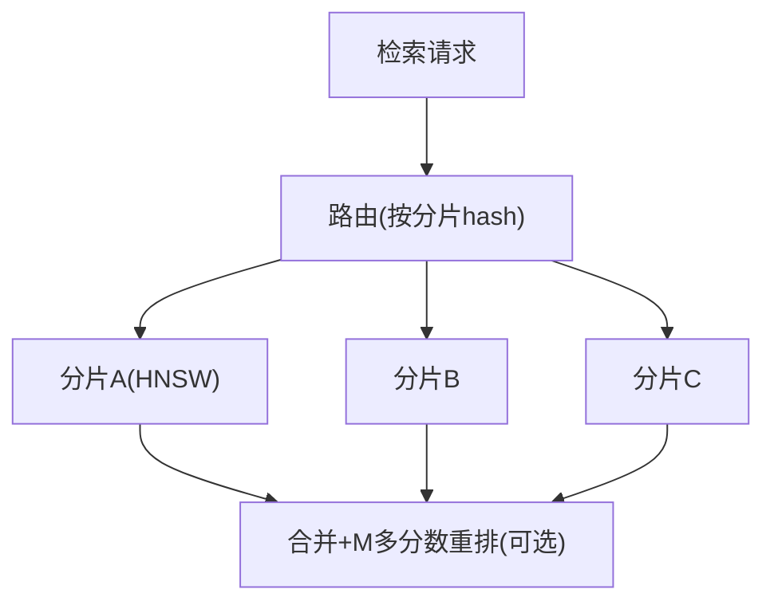

# 00-索引与检索工程深度

> **定位**：教程 [06-向量数据库选型](../../教程/00-基础与核心/06-向量数据库选型.md) 与 [35-高级RAG](../../教程/08-架构师进阶/01-高级RAG与AgenticRAG.md) 的下钻层。深挖**检索工程的"最后一公里"**：**① 索引算法（HNSW/IVF/pq 量化）与参数调优 ② 延迟-召回率权衡曲线 ③ 分片与高并发检索 ④ 混合检索融合重排工程**。读完你能把"选了个向量库"升级为"把检索做到又快又准"。
>
> **前置阅读**：[06-向量数据库选型](../../教程/00-基础与核心/06-向量数据库选型.md)、[78-高级RAG与AgenticRAG](../../教程/08-架构师进阶/01-高级RAG与AgenticRAG.md)、[附录 01-LLM基础理论/01-Embedding原理](../../附录/01-LLM基础理论/01-Embedding原理.md)。

---

## 1. 索引算法选型（HNSW / IVF / 量化）

| 算法 | 原理 | 速度 | 召回率 | 内存 | 适用 |
|------|------|------|--------|------|------|
| **暴力检索** | 全量线性扫 | 最慢 | 100% | 低 | 测试/小库 |
| **HNSW** | 分层可导航小世界图 | 快（对数） | 高 | 高（图边）| 高并发在线（默认首选） |
| **IVF** | 倒排聚簇（先粗分桶再桶内） | 中 | 中（受 nlist）| 低 | 大库、召回略降可接受 |
| **PQ/标量量化** | 向量压缩 | 非常快 | 中低 | 很低 | 亿级库、内存受限 |

**选型口诀**：在线高并发 → HNSW；超大规模+内存紧张 → IVF+PQ；追求极致召回 → 保真（暴力/HNSW 高 M）。

## 2. HNSW 参数与延迟-召回率曲线

```yaml
# 概念参数：HNSW（以 pgvector/Redis/Supabase 理念的 hnsw.ef_search 类比）
M: 16            # 每层最大连接数: 越大召回越高、内存越大
ef_construction: 64   # 建索引时候选集: 越大索引质量越高、建索越慢
ef_search: 40         # 查询时候选集: 越大召回越高、查询越慢
```

**核心工程实践**：对**每个应用**画**ef_search 的延迟-召回率曲线**（同一批 query 在该数据集上）：

| ef_search | P95 延迟 | Recall@10 |
|-----------|---------|-----------|
| 20 | 2ms | 78% |
| 40 | 5ms | 89% |
| 80 | 11ms | 94% |
| 160 | 24ms | 96% |

**取合理值而非最大值**——召回 94%→96% 要延迟翻倍，但 6 分→7 分的 RAG 质量增益常不匹配延迟代价（呼应 [38-性能优化](../../教程/08-架构师进阶/04-Agent性能优化.md) 的延迟预算）。**参数要按业务场景标定，不是抄默认值**。

## 3. 分片与高并发检索

单分片 HNSW 在高并发下成为瓶颈。横向扩展模式：



**三种分片策略**：
- **按内容路由**（业务隔离开启分片）：租户/文档集用户可接受（[26-多租户](../../教程/04-企业级架构主干/06-多租户隔离与资源治理.md)）。
- **按 hash 均分**：查询需广播多分片合并（召回需全分片），延迟高但水平扩展。
- **副本+就近**：读多场景加副本，延迟低。

## 4. 混合检索融合重排（工程版）

[35-高级RAG](../../教程/08-架构师进阶/01-高级RAG与AgenticRAG.md) 提了混合检索概念，工程落地三步：

```java
// 概念代码：混合召回 → 融合 → 重排
List<Doc> recall = concat(vectorTopK(query), bm25TopK(query), rrf fuse);
// ①混合召回: 向量+关键词都拉(多一路召回补向量对精确词/新词的弱)
// ②RRF融合: Σ 1/(rank+k) 合并排序(对权重不敏感,稳定)
// ③重排器: 用 cross-encoder 对 top50 重排(精排1遍, 贵但只对候选)
```

**关键取舍**：**混合解决召回**（找全），**重排解决排序**（排准）。重排交叉编码器算力贵，只对候选再精排——召回阶段宁多勿漏（recall），精排阶段宁准勿多（precision）。

## 5. 与工程链路的关系

- 索引参数（本附录）**直接决定 25 记忆中枢的语义召回、18 知识检索、28 可观测的检索层性能**。
- 检索延迟进入 [28-容量画像](../../项目/28-企业级Agent统一可观测平台/10-容量与性能观测.md)、Token 预算进 [31-上下文](../../项目/31-企业级Agent上下文管理平台/04-分层Token配额治理.md)。

---

## 总结

检索工程深度 = **算法选型（HNSW/IVF/量化）+ 参数按场景标定（延迟-召回曲线）+ 分片高并发 + 混合召回/精排重排**。三条纪律：参数不抄默认（画曲线）；召回宁多精排收（两阶段）；分片策略按读模式选。落地旗舰落地见 [25 记忆中枢](../../项目/25-企业级Agent记忆中枢/04-语义召回与混合检索.md)、[18 知识中枢](../../项目/18-企业级Agent数据与知识中枢/06-检索服务化.md)。
