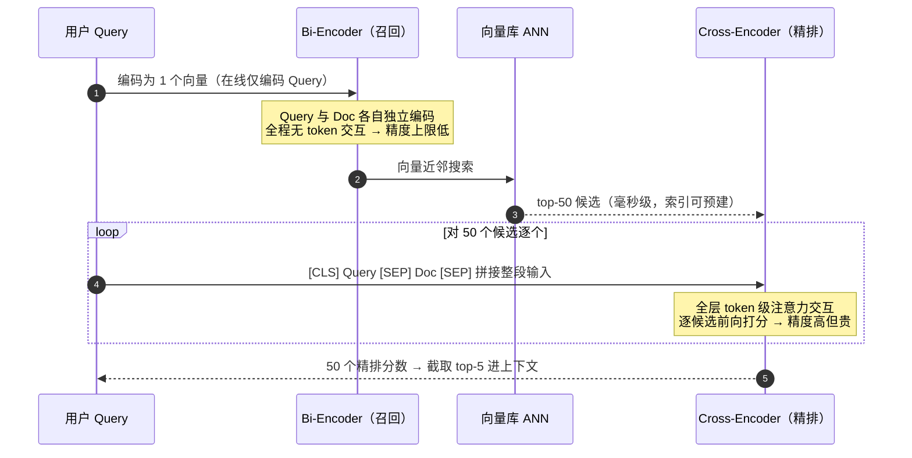
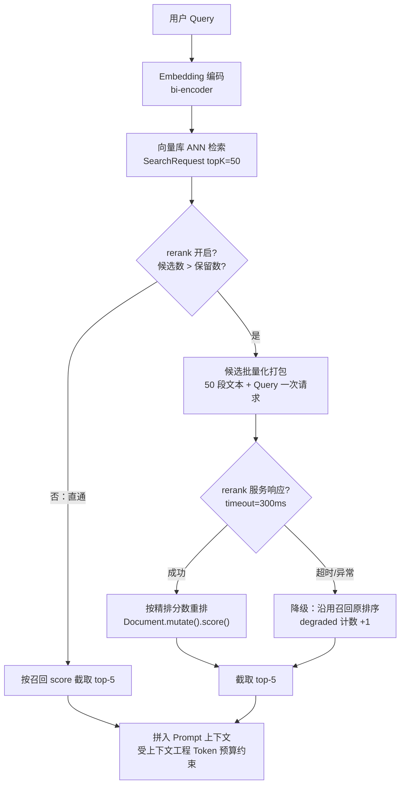
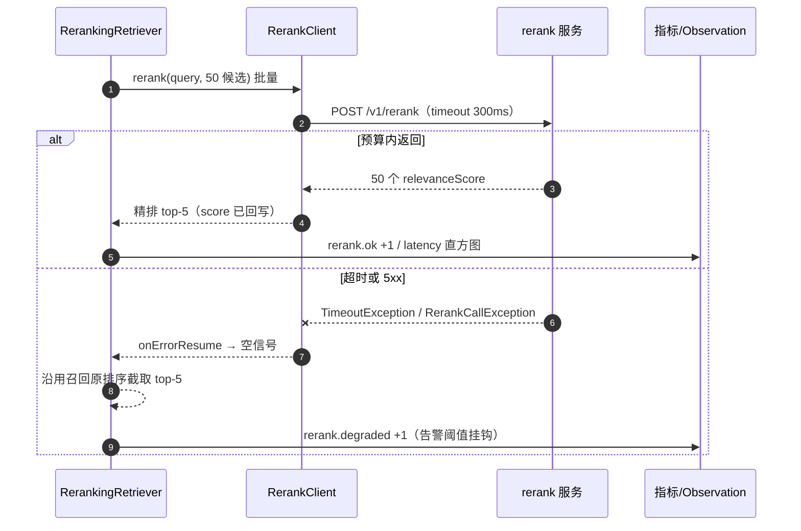

# 01-重排序与Rerank工程

> **定位**：本文是对 [教程 08-架构师进阶/01-高级RAG与AgenticRAG](../../教程/08-架构师进阶/01-高级RAG与AgenticRAG.md) §3 与 [教程 00-基础与核心/05-RAG检索增强生成](../../教程/00-基础与核心/05-RAG检索增强生成.md) §3.4 的**检索工程下钻**。教程回答了"重排是什么、为什么需要"；本篇回答"生产上怎么落地"：**① 为什么向量检索的 top-k 不是最终排序（bi-encoder vs cross-encoder 结构性差异）② rerank 技术选型三路线（专用 Cross-Encoder / LLM-as-reranker / 评分融合）③ 两阶段检索管线的 Spring AI 2.0 完整实现（两种挂接方式）④ 延迟与成本预算（批量化、缓存、降级）⑤ 增益评估与"rerank 不能修复召回"铁律**。读者画像：已跑通基础 RAG、发现"检索到的文档在 top-k 里但答案质量不稳"、准备把检索从 demo 级升级到生产级的中高级 Java 开发者。
>
> **前置阅读**：[教程 00-基础与核心/05-RAG检索增强生成](../../教程/00-基础与核心/05-RAG检索增强生成.md)、[附录 01-LLM基础理论/01-Embedding原理](../../附录/01-LLM基础理论/01-Embedding原理.md)、[附录 19-向量数据库与检索工程/00-索引与检索工程深度](00-索引与检索工程深度.md)。

---

## 0. 一个实证前提：Spring AI 2.0.0 没有内置 Rerank 组件

按本项目铁律 0（一切以本地 jar 实证为准），先立一个事实基线：对本地 Maven 仓库 2.0.0 的 `spring-ai-vector-store`、`spring-ai-rag`、`spring-ai-model`、`spring-ai-client-chat`、`spring-ai-commons`、`spring-ai-vector-store-advisor` 六个核心 jar 执行 `jar tf | grep -i -E "rerank|rank"`，**零命中**。

这个实证结论直接决定本篇的实现路线：**rerank 能力必须自研封装**（外部 rerank 服务 + WebClient 调用 + `Document` 重排序），而不是找一个"官方 RerankModel"来接。这也意味着：本篇代码中凡是与外部 rerank 服务相关的 **HTTP 契约（请求/响应 JSON 结构）都是概念层**，会显式标注「概念代码」；而 **Spring AI 与 Reactor/WebClient 侧的全部 API 均经本地 jar javap 实证**，可放心照写。

Spring AI 侧已经实证可用的关键落点（// Spring AI 2.0.0）：

| 实证 API | 签名要点 | 在 rerank 管线中的角色 |
|----------|----------|------------------------|
| `SearchRequest.builder()` | `query(String)` / `topK(int)` / `similarityThreshold(double)` | 召回阶段拉 top-50 候选 |
| `Document.getScore()` | 返回 `java.lang.Double` | 读召回分数 |
| `Document.mutate()` → `Document.Builder.score(Double)` | Builder 链式 | **rerank 分数原生回写**（一等公民，不必塞 metadata） |
| `DocumentRetriever.retrieve(Query)` | `org.springframework.ai.rag.retrieval.search`，同步接口 | rerank 装饰器的挂接点 |
| `RetrievalAugmentationAdvisor.builder()` | `org.springframework.ai.rag.advisor` | 方式 A 的组装容器 |
| `BaseAdvisor` | `before/after` 双参，带 `DEFAULT_SCHEDULER` | 解释同步边界为何合法（§3.3） |

---

## 1. 为什么 top-k 不是最终排序：bi-encoder 与 cross-encoder 的结构性差异

### 1.1 bi-encoder：召回快的代价是"没有交互"

向量检索（ANN）底层是 **bi-encoder（双塔/双编码器）**：Query 和 Document 分别独立过一遍 Encoder，各产出一个向量，相关性 = 两向量的余弦相似度。这个结构有三个天然的工程后果：

1. **Doc 向量可以离线预计算**，在线只需编码 Query 一次 + 一次 ANN 搜索，这是它毫秒级延迟的来源（索引算法与延迟-召回权衡见 [附录 19-向量数据库与检索工程/00-索引与检索工程深度](00-索引与检索工程深度.md) §2）；
2. **Query 和 Doc 从未"见过面"**——两段文本在编码过程中没有任何 token 级交互，"Query 里的'注销'是否对上了 Doc 里的'退订流程'"这种细粒度对齐，只能靠压缩到 768/1024 维之后的点积间接猜；
3. 因此 bi-encoder 的精度有**结构性上限**：它擅长"这堆文档里哪些大概相关"（区分相关与无关），但不擅长"这几篇都相关的文档里哪篇最相关"（区分相关与更相关）。

这正是教程 [05-RAG检索增强生成](../../教程/00-基础与核心/05-RAG检索增强生成.md) 中"无重排：Top-K 里最相关的未必排第一"的病根——**不是你的向量库不行，是 bi-encoder 的结构本来就不该被指望做精排**。

### 1.2 cross-encoder：精度来自 token 级交互

**Cross-Encoder（交叉编码器）** 把 Query 和候选 Doc **拼接成一段输入**（`[CLS] Query [SEP] Document [SEP]`），整段过一遍 Transformer，取输出做相关性打分。因为 Query 的每个 token 和 Doc 的每个 token 在每一层注意力里**充分交互**，它能捕捉到双塔结构原理上不可能捕捉的细粒度匹配。代价是：每个 (Query, Doc) 对都要跑一次完整前向，**无法预计算、无法建索引**——50 个候选就是 50 次前向。

两种结构的推理旅程对比：



### 1.3 结构性差异对比表

| 维度 | bi-encoder（双塔） | cross-encoder（交叉） |
|------|--------------------|-----------------------|
| 编码方式 | Query、Doc **独立**编码 | 拼接后**联合**编码 |
| token 交互 | 无（仅向量点积） | 全层注意力交互 |
| 预计算 | Doc 向量可离线算、可建 ANN 索引 | 不可预计算，每个 pair 实时前向 |
| 精度 | 中（区分"相关/无关"） | 高（区分"相关/更相关"） |
| 单次延迟 | 毫秒级（1 次编码 + 1 次搜索） | 每候选一次前向，50 候选约几十至几百毫秒 |
| 成本随候选数 | 几乎无关 | **线性增长**（候选越多越贵越慢） |
| 角色 | **召回**（宁多勿漏，recall） | **精排**（宁准勿多，precision） |

### 1.4 分工结论

一句话记住分工：**召回阶段解决"找没找到"（recall），精排阶段解决"排没排对"（ranking quality）**。两阶段架构的本质是用 cross-encoder 的"贵而准"替换 bi-encoder 的"快而糙"，但只在 top-50 这个小集合上替换——把贵算力集中在边际收益最高的地方。这就是 [附录 19-向量数据库与检索工程/00-索引与检索工程深度](00-索引与检索工程深度.md) §4 说的"召回宁多勿漏、精排宁准勿多"的完整工程展开。

---

## 2. Rerank 技术选型：三条路线

### 2.1 路线一：专用 Cross-Encoder（bge-reranker 类）

开源专用重排模型（如 bge-reranker 系列 [BAAI/bge-reranker-large](https://huggingface.co/BAAI/bge-reranker-large)、cross-encoder/ms-marco 系列 [sbert Cross-Encoders](https://www.sbert.net/examples/applications/cross-encoder/README.html)）通常以独立推理服务部署（HTTP/gRPC，常见于 vLLM/TEI/Ollama 等推理引擎托管，见 [附录 15-AIInfra与推理部署](../15-AIInfra与推理部署)），Java 侧通过 WebClient 调用。特征：

- **延迟可控**：模型小（0.5B~2B 级别），批量化后 50 候选 p50 几十毫秒；
- **成本稳定**：自有 GPU 或按 token 计费的专用 rerank API，无 LLM 长上下文开销；
- **只输出相关性分数**：不能"读懂"业务规则（如"优先返回内部文档"），规则要另做。

### 2.2 路线二：LLM-as-reranker

直接让 ChatModel 给候选打分/排序，两种范式：

- **pointwise（逐点打分）**：对每个候选问一次"这段内容与 Query 相关吗？0-10 分"。精度好、但 50 候选 = 50 次 LLM 调用（哪怕合并成一次多段输入，token 消耗也是候选全文总量），**延迟与成本都随候选线性爆炸**；
- **listwise（列表排序）**：把候选编号后一次性给 LLM："按相关性输出编号排序"。次数少，但受上下文窗口与"中间位置遗忘"（lost in the middle）影响，候选多时尾部质量差。

```text
// 概念代码：listwise rerank 的 Prompt 骨架（真实生产 Prompt 需按业务调优与评测）
请根据与查询的相关性对以下文档片段排序，只输出编号序列（最相关在前）。
查询：{query}
[1] {doc_1 截断至 300 字}
[2] {doc_2 截断至 300 字}
...
```

**适用定位**：小候选集（top-5 → top-3 的二次精排）、需要"理解"语义外规则（时效性、权限、业务偏好）的场景；或作为高价值低 QPS 场景（如内部分析型 Agent）的精排器。

### 2.3 路线三：评分融合（RRF / 加权融合）

严格说这不是"模型"，是**不引入新模型的排序数学**，两种公式：

**RRF（Reciprocal Rank Fusion，[Cormack et al., SIGIR 2009](https://plg.uwaterloo.ca/~gvcormac/cormacksigir09-rrf.pdf)）**——多路召回的排名融合：

```text
RRF_score(d) = Σ_i  1 / (k + rank_i(d))      # k 常取 60；rank_i(d) 是 d 在第 i 路的排名（1 起）
```

只看**排名不看原始分**，因此天然规避"余弦相似度和 BM25 分数纲不同没法加"的问题，对权重不敏感、极其稳定——这是混合检索（向量 + BM25）融合的标准答案。

**加权融合**——同纲分数的线性加权：

```text
score(d) = α · norm(vec_score(d)) + (1-α) · norm(bm25_score(d))    # norm 建议 min-max 归一到 [0,1]
```

需要调 α，且各路分数必须先归一化，对分布漂移敏感。**定位**：多路融合的"排序器"，不是语义精排器——它不会把"向量分 0.81 但实际答非所问"的文档排下去。

### 2.4 三路线对比与选型决策

| 维度 | 专用 Cross-Encoder | LLM-as-reranker（listwise） | 评分融合（RRF/加权） |
|------|--------------------|------------------------------|----------------------|
| 语义精排能力 | 强（token 级交互） | 强+可理解业务规则 | 无（纯数学合并） |
| 50 候选增量延迟 | p95 约几十~200ms | 数秒（LLM 生成） | <1ms |
| 边际成本 | 低（自有 GPU/廉价 API） | 高（LLM token） | 零 |
| 新增组件 | 推理服务一个 | 无（复用 ChatModel） | 无 |
| 失败模式 | 服务超时（可降级） | 幻觉/格式漂移 | 分数纲不齐 |
| 典型位置 | 召回 top-50 → top-5 | 精排 top-5 → top-3 | 多路召回合并 |

**选型决策**（生产推荐组合，而非三选一）：

1. **有 GPU 资源或预算允许** → 专用 Cross-Encoder 打主力（50→5）；
2. **多路召回（向量+BM25）** → RRF 做第一层融合，Cross-Encoder 做第二层精排，两层叠加；
3. **高价值低 QPS、候选已很少** → LLM listwise 做末端二筛；
4. **延迟预算 <50ms 或无法新增组件** → 只用 RRF/加权融合，放弃语义精排；
5. **LLM-as-reranker 不适合做主力**（成本延迟双高），只做末端补充——这是"把它放哪一层"的决策，不是"用不用"的决策。

---

## 3. 工程管线：两阶段检索的完整实现

### 3.1 目标管线拓扑

生产管线的核心不是"加一个 rerank 调用"，而是**把降级路径和开关设计进管线**：



三个设计点：**开关判断**（候选不足时重排无增益，省一次调用）、**超时分支**（rerank 挂了检索不能挂）、**分数回写**（用 Spring AI 原生 `Document.Builder.score`，下游无感知）。

### 3.2 RerankClient：WebClient 非阻塞调用

HTTP 契约为概念层；WebClient/Reactor 写法为 Spring Framework 7.0 / Reactor 3.5 真实 API（`post()`/`bodyValue()`/`onStatus()`/`bodyToMono()`/`timeout()`/`onErrorResume()` 均经本地 jar javap 实证）。

```java
// RerankClient.java —— HTTP 契约（/v1/rerank 的 JSON 结构）为概念代码；
// WebClient 链路为真实 API（// Spring Framework 7.0 / Reactor 3.5，本地 jar 实证）
package com.example.rag.rerank;

import java.time.Duration;
import java.util.List;

import org.springframework.beans.factory.annotation.Value;
import org.springframework.http.HttpHeaders;
import org.springframework.http.HttpStatusCode;
import org.springframework.http.MediaType;
import org.springframework.stereotype.Component;
import org.springframework.web.reactive.function.client.WebClient;
import reactor.core.publisher.Mono;

@Component
public class RerankClient {

    private final WebClient webClient;

    public RerankClient(WebClient.Builder builder,
                        @Value("${app.rerank.base-url}") String baseUrl,   // 形如 http://reranker.internal:8000，禁止硬编码
                        @Value("${app.rerank.api-key}") String apiKey) {
        this.webClient = builder
                .baseUrl(baseUrl)
                .defaultHeader(HttpHeaders.AUTHORIZATION, "Bearer " + apiKey)
                .build();
    }

    /** 批量重排：一次 HTTP 携带全部候选（严禁循环逐条调用，见 §4.2） */
    public Mono<List<RerankResult>> rerank(String query, List<String> documents) {
        return webClient.post()
                .uri("/v1/rerank")
                .contentType(MediaType.APPLICATION_JSON)
                .bodyValue(new RerankRequest("bge-reranker-large", query, documents))
                .retrieve()
                .onStatus(HttpStatusCode::isError, resp ->
                        resp.bodyToMono(String.class)
                            .defaultIfEmpty("")
                            .map(body -> new RerankCallException("rerank 服务错误: " + body)))
                .bodyToMono(RerankResponse.class)
                .map(RerankResponse::results)
                .timeout(Duration.ofMillis(300));   // 预算化：超时在这里转成 TimeoutException，交给上层降级
    }

    // —— 概念契约 DTO（字段结构为概念层，按所选 rerank 服务实际契约调整）——
    record RerankRequest(String model, String query, List<String> documents) {}
    record RerankResult(int index, double relevanceScore) {}
    record RerankResponse(List<RerankResult> results) {}

    static class RerankCallException extends RuntimeException {
        RerankCallException(String msg) { super(msg); }
    }
}
```

### 3.3 挂接方式 A：装饰 DocumentRetriever，接入 RetrievalAugmentationAdvisor

`DocumentRetriever` 是同步接口（`Function<Query, List<Document>>`），于是出现本篇最关键的**同步/非阻塞边界问题**：同步接口里怎么消费 `Mono`？

答案分两层：

- **纪律层（WebFlux 铁律）**：禁止在 Netty EventLoop 上 `block()`——EventLoop 线程被阻塞会拖垮整个进程的事件循环（详见 [教程 08-架构师进阶/08-响应式错误处理](../../教程/08-架构师进阶/08-响应式错误处理.md)）；
- **合法性来源（实证）**：`RetrievalAugmentationAdvisor` 走 `BaseAdvisor` 体系，其 `before/after` 默认在 `DEFAULT_SCHEDULER`（boundedElastic 专用调度器）上执行，**不在 EventLoop 上**。因此在 Advisor 链内的同步 `retrieve()` 里做一次**带超时的 `block()`** 是安全的——前提是它永远只运行在该调度器线程上，绝不能被挪到 controller 的响应式链里直接调。

```java
// RerankingRetriever.java —— 装饰器模式：包住向量召回，输出精排后的文档
// DocumentRetriever/Query/Document 均为 // Spring AI 2.0.0（本地 jar javap 实证）
package com.example.rag.rerank;

import java.time.Duration;
import java.util.Comparator;
import java.util.List;

import org.slf4j.Logger;
import org.slf4j.LoggerFactory;
import org.springframework.ai.document.Document;
import org.springframework.ai.rag.Query;
import org.springframework.ai.rag.retrieval.search.DocumentRetriever;
import reactor.core.publisher.Mono;

public final class RerankingRetriever implements DocumentRetriever {

    private static final Logger log = LoggerFactory.getLogger(RerankingRetriever.class);

    private final DocumentRetriever delegate;   // 向量召回（top-50），如 VectorStoreDocumentRetriever
    private final RerankClient rerankClient;
    private final int keepTopN;                 // 精排后保留数（如 5）

    public RerankingRetriever(DocumentRetriever delegate, RerankClient rerankClient, int keepTopN) {
        this.delegate = delegate;
        this.rerankClient = rerankClient;
        this.keepTopN = keepTopN;
    }

    @Override
    public List<Document> retrieve(Query query) {
        List<Document> candidates = delegate.retrieve(query);        // ① 召回 top-50（含原生 score）
        if (candidates.size() <= keepTopN) {
            return candidates;                                        // ② 开关：候选不足，重排无增益
        }
        List<String> texts = candidates.stream().map(Document::getText).toList();

        List<RerankClient.RerankResult> results = rerankClient.rerank(query.text(), texts)
                .onErrorResume(e -> {                                 // ③ 降级：沿用召回原排序
                    log.warn("rerank 降级，沿用召回排序: {}", e.toString());
                    return Mono.empty();
                })
                .block(Duration.ofMillis(500));                       // ④ 同步边界：合法位置=BaseAdvisor 的 boundedElastic 调度器
        if (results == null) {
            return candidates.stream().limit(keepTopN).toList();      // 降级出口：原排序截取
        }

        return results.stream()                                       // ⑤ 按精排分数重排 + 分数回写
                .limit(keepTopN)
                .map(r -> candidates.get(r.index()).mutate()
                        .score(r.relevanceScore())                    // Document.Builder.score(Double)：Spring AI 2.0.0 实证
                        .build())
                .toList();
    }
}
```

装配进 Spring AI 原生 RAG 组件链（各 API 实证见文首表格）：

```java
// 概念代码：装配层（Bean 组合，非可运行完整类）—— // Spring AI 2.0.0
import org.springframework.ai.chat.client.ChatClient;
import org.springframework.ai.rag.advisor.RetrievalAugmentationAdvisor;
import org.springframework.ai.rag.Query;
import org.springframework.ai.rag.retrieval.search.DocumentRetriever;
import org.springframework.ai.rag.retrieval.search.VectorStoreDocumentRetriever;
import org.springframework.ai.vectorstore.VectorStore;

@Bean
DocumentRetriever rerankingRetriever(VectorStore vectorStore, RerankClient rerankClient) {
    DocumentRetriever vectorRecall = VectorStoreDocumentRetriever.builder()
            .vectorStore(vectorStore)
            .topK(50)                       // 召回阶段：宁多勿漏
            .similarityThreshold(0.0)       // 阈值放宽：精排阶段的活，别在召回阶段抢
            .build();
    return new RerankingRetriever(vectorRecall, rerankClient, 5);
}

@Bean
ChatClient ragChatClient(ChatClient.Builder builder, DocumentRetriever rerankingRetriever) {
    return builder
            .defaultAdvisors(RetrievalAugmentationAdvisor.builder()
                    .documentRetriever(rerankingRetriever)
                    .build())
            .build();
}
```

注意 `similarityThreshold(0.0)` 的取舍：**召回阶段放宽阈值，把"过滤"的责任移交给精排**——rerank 后取 top-5 天然完成了筛选。召回端阈值收紧 + 精排取 5，等于用两把刀各砍一次，第一刀砍掉的候选精排永远看不到。

### 3.4 挂接方式 B：全响应式检索服务，编排层直接消费

当检索需要**多路融合（向量+BM25 + RRF）、缓存、租户级路由**等编排能力时，把它封装成独立的响应式服务更合适（此时不经过 `RetrievalAugmentationAdvisor`，由服务层直接消费 `Mono<List<Document>>`，全程无 `block`）：

```java
// RagRetrievalService.java —— 全响应式管线（方式 B 骨架）
// // Spring AI 2.0.0 + Reactor 3.5（实证 API）
package com.example.rag.retrieval;

import java.time.Duration;
import java.util.List;

import org.springframework.ai.document.Document;
import org.springframework.ai.rag.Query;
import org.springframework.ai.rag.retrieval.search.DocumentRetriever;
import org.springframework.stereotype.Service;
import reactor.core.publisher.Mono;
import reactor.core.scheduler.Schedulers;

@Service
public class RagRetrievalService {

    private final DocumentRetriever vectorRecall;   // 向量召回（top-50）
    private final RerankClient rerankClient;

    public RagRetrievalService(DocumentRetriever vectorRecall, RerankClient rerankClient) {
        this.vectorRecall = vectorRecall;
        this.rerankClient = rerankClient;
    }

    public Mono<List<Document>> retrieve(String queryText) {
        return Mono.fromCallable(() -> vectorRecall.retrieve(new Query(queryText)))  // 同步召回移出调用线程
                .subscribeOn(Schedulers.boundedElastic())                            // 铁律：不占 EventLoop（实证 API）
                .flatMap(candidates -> rerankClient
                        .rerank(queryText, candidates.stream().map(Document::getText).toList())
                        .timeout(Duration.ofMillis(300))
                        .map(results -> results.stream()
                                .limit(5)
                                .map(r -> candidates.get(r.index()).mutate()
                                        .score(r.relevanceScore()).build())
                                .toList())
                        .onErrorResume(e -> Mono.just(                               // 降级：原排序 top-5
                                candidates.stream().limit(5).toList())));
    }
}
```

若仍要挂进 Advisor 链，可再写一层 `CallAdvisor`：在 `adviseCall(ChatClientRequest, CallAdvisorChain)` 里（// Spring AI 2.0.0 实证签名）取 `request.prompt()` 中的用户文本 → 调 `retrieve()` → 将文档写回 `request.context()` 并改写消息后 `chain.nextCall(...)`。骨架级伪代码：

```java
// 伪代码，真实 Advisor 契约见 [附录 05-SpringAI2-API基准] 与 scripts/api-baseline-spring-ai-2.0.0.md
public ChatClientResponse adviseCall(ChatClientRequest req, CallAdvisorChain chain) {
    var docs = retrievalService.retrieve(extractUserText(req)).block();  // 仅示意；生产应在 before/after 语义内处理
    return chain.nextCall(withContext(req, docs));
}
```

### 3.5 两种挂接方式对比

| 维度 | 方式 A：装饰 DocumentRetriever | 方式 B：独立检索服务 |
|------|-------------------------------|----------------------|
| 侵入性 | 零（Advisor 链无感） | 需服务层显式编排 |
| 多路融合/缓存/租户路由 | 难塞进装饰器 | 天然承载 |
| 线程模型 | 同步接口，依赖 BaseAdvisor 调度器合法性 | 全响应式，无 block |
| 适用 | 标准 RAG 单路召回、快速接入 | 检索平台化（多路+缓存+治理） |

**决策**：从 A 起步（一行 Advisor 装配即得精排收益），当出现多路召回或独立检索服务的拆分需求（呼应管控分离，见 [教程 04-企业级架构主干](../../教程/04-企业级架构主干)）时演进到 B。A 与 B 共享同一个 `RerankClient`，演进不重写。

---

## 4. 延迟与成本预算

### 4.1 p95 延迟账本

rerank 不是免费午餐，先算账（量级参考，需按自有环境压测定标，方法见 [教程 08-架构师进阶/04-Agent性能优化](../../教程/08-架构师进阶/04-Agent性能优化.md)）：

| 阶段 | p50 | p95 | 说明 |
|------|-----|-----|------|
| Query embedding | ~15ms | ~30ms | 1 次编码 |
| ANN 检索 top-50 | ~5ms | ~25ms | HNSW 参数决定 |
| **rerank（50 候选批量）** | **~40ms** | **~150-300ms** | **本篇新增的净增量** |
| LLM 首字（TTFT） | ~400ms | ~1500ms | 原有主体 |

结论：rerank 的 p95 增量（约 150-300ms）相对整条链不算小，但**远小于它换来的重问率下降**——前提是候选数克制（50 而非 200）且批量化。若 p95 增量超过 LLM TTFT 的 1/3，应先收缩候选数，而不是换更大的 rerank 模型。

### 4.2 批量化纪律

**一次 HTTP 携带全部 50 个候选**（§3.2 的 `rerank(query, documents)` 就是批量契约）。反模式是循环逐条调用：50 次 HTTP 的连接/序列化开销 + 无批内并行，p95 直接劣化一个数量级。同时控制**输入截断**：每候选截断至 300-500 字再送 rerank（cross-encoder 的注意力随长度平方增长，长文档精度收益边际递减）。

### 4.3 缓存

rerank 结果按 `(query 归一化, 候选集指纹)` 缓存：同一 query 重复请求（会话追问、重试、多轮改写后语义相同）直接命中。键设计注意**候选集指纹**——文档库更新后候选集变，指纹必须失效。完整语义级缓存（含相似 query 命中）见 [附录 09-语义缓存与性能/00-语义缓存实现](../09-语义缓存与性能/00-语义缓存实现.md)。

### 4.4 降级策略：rerank 超时，检索不能挂

降级是管线的一等公民（§3.1 流程图的超时分支），完整时序：



三档策略：**① 超时降级**（`timeout(300ms)` + `onErrorResume`，用原排序，本篇默认）；**② 开关降级**（服务连续失败 N 次后熔断直通，恢复探测后再启用——熔断器模式）；**③ 预算降级**（高峰期候选数 50→20，延迟换成本）。`degraded` 计数必须进指标并在超阈值时告警——**静默降级会让"rerank 失效"伪装成"模型变笨"**，排查方向全错（观测挂点见 [教程 05-Observation可观测/09-Advisor与RAG观测：检索质量可观测](../../教程/05-Observation可观测/09-Advisor与RAG观测：检索质量可观测.md)）。

---

## 5. 效果评估：重排增益怎么测

### 5.1 指标：nDCG@k / HitRate@k / MRR

检索排序质量的标准指标（对"重排前后"各算一次，差值即增益）：

- **HitRate@k（命中率）**：top-k 里是否至少有一个相关文档。重排若有效，HitRate@5 应不低于 HitRate@5_召回序（重排不丢候选，只动顺序）；
- **MRR（平均倒数排名）**：第一个相关文档排名倒数的均值。对"正确答案排第几"最敏感，RAG 场景主力指标；
- **nDCG@k（归一化折损累计增益）**：考虑分级相关性与位置折损，排序质量金标准：

```text
DCG@k   = Σ_{i=1..k} (2^rel_i − 1) / log2(i + 1)
nDCG@k  = DCG@k / IDCG@k        # IDCG 为理想排序的 DCG，归一到 (0,1]
```

Java 实现很小，够用就行：

```java
// Ndcg.java —— nDCG@k（rel 按 0/1 二值即可起步；分级标注可后续升级）
import java.util.ArrayList;
import java.util.Comparator;
import java.util.List;

public final class Ndcg {
    private Ndcg() {}

    /** rels 按系统排序的顺序给出每篇文档的相关度（0/1/2...），k 为截断 */
    public static double ndcgAtK(List<Integer> rels, int k) {
        double dcg = 0.0;
        for (int i = 0; i < Math.min(k, rels.size()); i++) {
            dcg += (Math.pow(2, rels.get(i)) - 1) / (Math.log(i + 2) / Math.log(2));
        }
        List<Integer> ideal = new ArrayList<>(rels);
        ideal.sort(Comparator.reverseOrder());
        double idcg = 0.0;
        for (int i = 0; i < Math.min(k, ideal.size()); i++) {
            idcg += (Math.pow(2, ideal.get(i)) - 1) / (Math.log(i + 2) / Math.log(2));
        }
        return idcg == 0.0 ? 0.0 : dcg / idcg;
    }
}
```

### 5.2 评测流程

1. **建评测集**：50-200 条真实业务 query，人工标注"哪个候选文档相关"（标注成本高就先用 HitRate@5 + MRR 二值版）；
2. **A/B 对照**：同一评测集分别跑"召回原排序"与"rerank 后排序"，各算 nDCG@5 / MRR；LLM 生成质量可用 LLM-as-Judge 兜底评估（见 [附录 11-评估与可观测生态/01-LLM-as-Judge工程化](../11-评估与可观测生态/01-LLM-as-Judge工程化.md)、[附录 11-评估与可观测生态/00-Langfuse与Ragas集成](../11-评估与可观测生态/00-Langfuse与Ragas集成.md)）；
3. **上线验证**：按 query 抽样记录 `rerank.ok / rerank.degraded` 与端到端重问率，灰度对照（在线实验方法见 [附录 11-评估与可观测生态/03-在线实验与AB统计](../11-评估与可观测生态/03-在线实验与AB统计.md)）。

**判读基线**：离线 nDCG@5 提升 < 0.02 且 MRR 持平 → 别上线，先查 §5.3。

### 5.3 "rerank 不能修复召回"铁律

本篇最重要的负知识。数学上很直白：**cross-encoder 只能对送进来的候选排序——正确文档不在 top-50 候选里，再强的精排器也只能在 50 个错误答案里选一个"最像的"**。精排的天花板 = 召回的命中率。

由此得出诊断顺序铁律：

```text
HitRate@50 低（<85%）  → 问题在召回：先修 embedding/分块/混合召回，此时上 rerank 是浪费钱
HitRate@50 高、MRR 低  → 问题在排序：rerank 的正确战场，预期收益最大
```

对应地，rerank **无效或负收益**的典型场景：召回本身不足（上述铁律）；候选全是"同质文档"（50 段内容几乎一样，排序无意义）；Query 过短过泛（精排器也分不出意图）；以及把 rerank 当"相关性过滤器"用（它给的是相对分不是绝对分，跨 query 不可比）。

---

## 适用场景

- **主答质量不稳**：top-k 里"看着都相关"，但答案常引用排序靠后的次优文档——MRR 低是典型症状，rerank 收益最大；
- **多路召回后需要合并**：向量 + BM25 各拉一路，RRF 融合 + Cross-Encoder 精排的两层结构；
- **上下文 Token 预算紧张**：只能喂 top-5，必须保证"喂进去的就是最相关的"（与 [教程 08-架构师进阶/00-上下文工程](../../教程/08-架构师进阶/00-上下文工程.md) 的预算分配直接衔接）；
- **对延迟敏感但可接受 100-300ms 增量**的在线 RAG 服务，且降级路径已按 §4.4 设计。

## 不适用场景

- **召回本身不足**（HitRate@50 低）：先修 embedding 模型、分块策略、混合召回——精排救不了召回（§5.3 铁律）；
- **候选集同质化**：50 段内容雷同（如同一模板的变体），排序无信息量；
- **文档库小且全量可控**（如 <100 篇 FAQ）：直接全量召回 + 精排甚至不用 ANN，两阶段架构是过度设计；
- **无法容忍 >50ms 检索延迟**且无降级预算的高频短查询链路：只上 RRF/加权融合；
- **rerank 服务不可观测**：没有 `degraded` 指标与告警的 rerank 是定时炸弹——静默降级会把检索质量劣化伪装成模型问题。

---

## 总结

重排序是 RAG 主线缺失的最后一环，其工程本质是**用算力换排序精度，但只在召回候选这个小集合上换**：

1. **结构性分工**：bi-encoder（快、无交互、上限低）管召回，cross-encoder（贵、全交互、精度高）管精排——top-50 → top-5 是标准形状；
2. **选型组合而非三选一**：Cross-Encoder 打主力，RRF 做多路融合前置层，LLM-as-reranker 只做末端补充；
3. **Spring AI 2.0.0 无内置 rerank**（jar 实证零命中），自研路径为 `SearchRequest` 召回 → WebClient 批量精排 → `Document.mutate().score()` 回写，挂接从装饰 `DocumentRetriever`（方式 A）起步，平台化后演进到独立检索服务（方式 B）；
4. **降级是一等公民**：timeout + 原排序 + `degraded` 指标告警，rerank 挂了检索不能挂；
5. **先测召回再上精排**：HitRate@50 低先修召回——**rerank 不能修复召回**，这是本篇必须带走的铁律。
