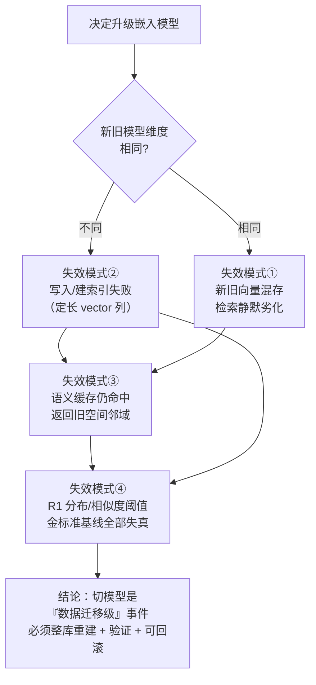
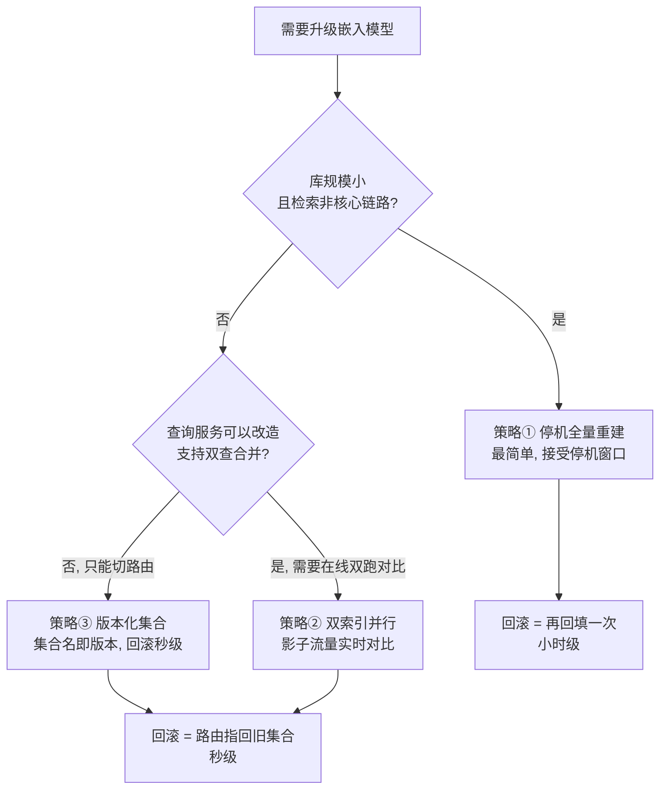
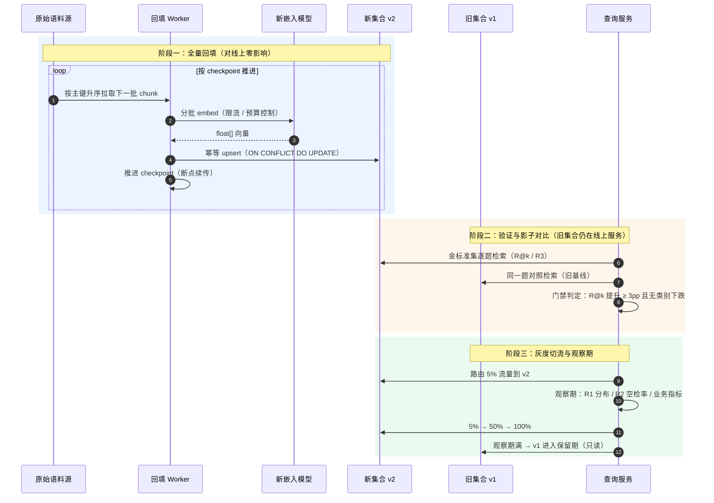
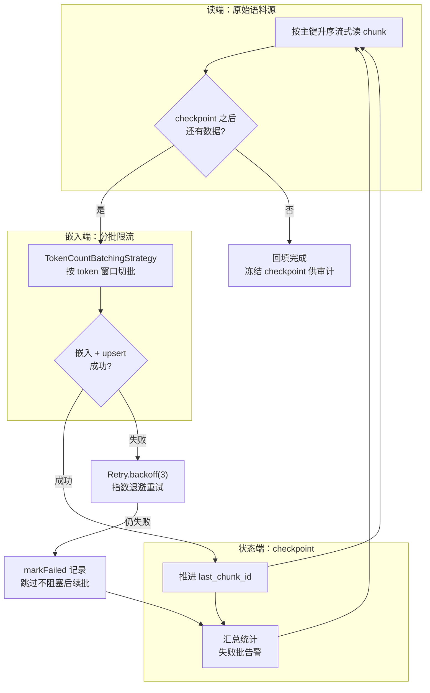
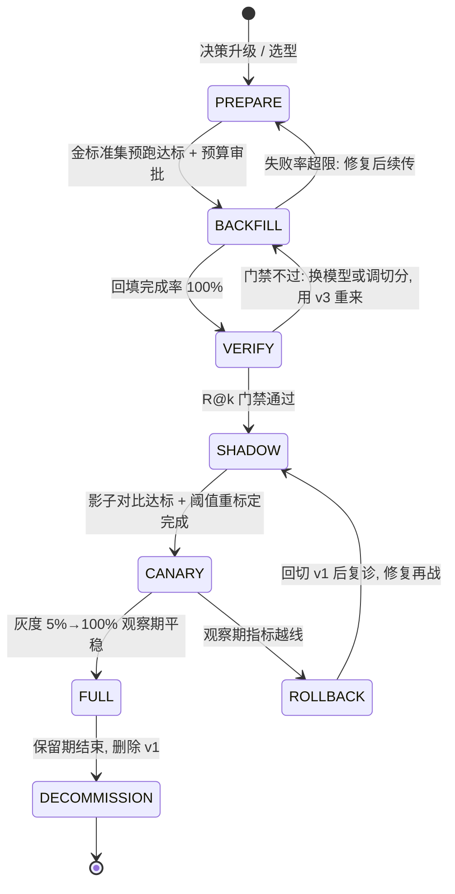

# 03-嵌入模型升级与索引迁移

> **定位**：本篇是附录 19（向量数据库与检索工程）的第三篇，回答一个体系里此前只有"一句话提及"的问题——**换 Embedding 模型时，向量索引怎么办**。教程里多处写着"可换更好的 Embedding 模型"（如 [教程 00-Agent核心概念]、[教程 05-Embedding原理]），但换模型的**工程过程**是零覆盖的：新旧向量空间不可比 → 存量向量全部作废 → 全量重建 → 怎么不停机、怎么验证新模型真的更好、怎么一键回滚。本篇把这整条迁移链路讲透：**三选型对比、回填管线（限流/幂等/断点续传）、验证闭环（金标准 R@k + 影子对比 + 门禁重标定）、回滚设计、成本核算、上层联动（语义缓存全量失效等）**。
>
> **读者画像**：已在生产运行 RAG/Agent 系统、准备升级嵌入模型的中高级 Java 开发者与架构师；以及正在做"检索效果差"归因、走到"该换嵌入模型了吗"这一步的调优者（[教程 10-调优实战与方法论/01-环节体检：五环节指标与判病阈值](../../教程/10-调优实战与方法论/01-环节体检：五环节指标与判病阈值.md) 的 R 环节结论会指向本篇）。
>
> **前置阅读**：[附录 19-向量数据库与检索工程/00-索引与检索工程深度](./00-索引与检索工程深度.md)（索引算法与延迟-召回率权衡）、[教程 10-调优实战与方法论/01-环节体检：五环节指标与判病阈值](../../教程/10-调优实战与方法论/01-环节体检：五环节指标与判病阈值.md)（R1/R2/R3 指标与金标准问题集）、[附录 09-语义缓存与性能/00-语义缓存实现](../09-语义缓存与性能/00-语义缓存实现.md)（第 8 节连锁影响的对象）。

---

## 1. 为什么嵌入模型升级是"大版本事件"，不是"改个配置"

换一个 Embedding 模型，在工程上等价于**把整个检索系统的坐标系换掉**。三条物理事实决定了它的严重级别：

**事实一：不同模型的向量空间不可比。** 每个嵌入模型把自己的输出空间和"语义相似"的定义**一起训练**出来：模型 A 里的余弦相似度 0.86 和模型 B 里的 0.86，**不是同一个东西**，数值上没有任何可比性。更致命的是，新旧模型的向量**混存在同一个集合里**时，检索仍然"能跑、不报错"——查询向量只与同空间（同模型）的旧向量偶然相近，与混进来的新向量彻底失配。结果不是报错，而是**检索质量静默劣化**：你发现 topK 结果开始"答非所问"，但没有任何异常日志。

**事实二：分数跨模型不可比，连带所有阈值失真。** 你的 `similarityThreshold` 是在旧模型的分数分布上标定的（比如 0.75 以下丢弃）；换了模型，"相关文档"的分数分布整体漂移（可能 p50 从 0.82 掉到 0.58），旧阈值要么滤掉全部结果（空检索率飙升），要么放进大量噪声。[教程 10-调优实战与方法论/01-环节体检：五环节指标与判病阈值](../../教程/10-调优实战与方法论/01-环节体检：五环节指标与判病阈值.md) 的 **R1（相关分数分布 p25/p50/p95）基线在切模型瞬间整体作废**，必须重测重建。

**事实三：dim（维度）变化直接撞上存储层硬约束。** pgvector 的 `vector(N)` 列是**定长**的：旧表 1536 维、新模型 3072 维，写入直接失败；就算维度恰好相同（如 1024 → 1024 的两代模型），也躲不开事实一，而且是**最危险的形态**——连"写入失败"这个警报都没有，全靠事实一导致的静默劣化提醒你出事了。

把三条事实合起来，换模型会同时触发四类失效模式：



- **① 静默劣化**：混存或直接切查询模型，检索不报错但结果失配——最危险，因为没有任何告警。
- **② 写入失败**：dim 不同时，`add()` 在存储层直接抛异常——这是"好事"，至少看得见。
- **③ 缓存污染**：语义缓存的 key 是查询向量，切模型瞬间旧缓存条目的邻域关系全部失真，命中即返回错配内容（第 8 节展开）。
- **④ 基线失真**：R1 分数分布、similarityThreshold、金标准 R3 的绝对值全部跨模型不可比，回归门禁需要重新校准。

**一句话总结本节**：换嵌入模型 = 检索系统的"数据大迁移"，与换数据库同级，必须按迁移工程来设计——选策略、建管线、做验证、留回滚。这正是余下各节的内容。

## 2. 迁移策略三选型：停机重建 / 双索引并行 / 版本化集合

三条主流路线，成本与回滚能力差异巨大，先给对比表再逐个展开：

| 维度 | ① 停机全量重建 | ② 双索引并行（dual-index） | ③ 版本化集合（collection per model version） |
|------|----------------|---------------------------|---------------------------------------------|
| 思路 | 停写停读 → 删旧建新 → 全量回填 → 恢复 | 新建第二个索引全量回填，线上查询新旧各查一次，验证后一次性切换 | 集合名带模型版本（`kb_docs__emb_v1/v2`），写入写当前版本，查询路由指向当前版本 |
| 适用规模 | 小库（< 10 万 chunk）或非核心业务 | 中大库、检索是核心链路 | 任意规模，**企业级默认推荐** |
| 停机窗口 | 小时级~天级 | 零 | 零 |
| 存储成本 | 无额外 | 峰值 2×（两份全量索引） | 峰值 2×（旧集合保留期内） |
| Embedding 成本 | 1× 回填 | 1× 回填 + 影子期双份查询 embed（查询量小，可忽略） | 1× 回填 |
| 回滚能力 | 差：回滚 = 再做一次全量回填（小时级） | 好：流量比例拨回，秒级 | **最好**：路由配置指回旧集合名，秒级 |
| 改造成本 | 低（一次性脚本） | 高：查询服务要双查、合并、对比 | 中：写入/查询路由读一个"当前版本"配置 |
| 主要风险 | 停机超预算；回填中途中败无退路 | 双查合并逻辑复杂；影子期两套分数不可比 | 需要元数据管理"哪个集合是哪个模型" |

**为什么推荐③作为默认**：它把"迁移"变成了"配置变更"。集合名本身就是版本号，回滚 = 把路由指回旧名；灰度 = 按流量比例路由到不同集合名；下线 = 观察期结束后删旧集合。存储上与②同为 2×，但省掉了②的双查合并逻辑——**②的"双查对比"能力在③里由金标准集与影子评估离线完成**，不必挂在在线链路上。

三种策略的选型判据（有分支，才有决策价值）：



> **想深入？** 索引建好后 HNSW/IVF 参数要按新模型重新标定（换模型后向量分布变了，ef_search 的延迟-召回率曲线也变了），见 [附录 19-向量数据库与检索工程/00-索引与检索工程深度](./00-索引与检索工程深度.md) §2。

## 3. 版本化集合方案：Spring AI 2.0 落地

### 3.1 双集合装配（`PgVectorStore.builder` 实证）

Spring AI 2.0.0 的 `PgVectorStore` 提供建造器 `PgVectorStore.builder(JdbcTemplate, EmbeddingModel)`，`vectorTableName`/`schemaName`/`dimensions` 均为实证方法（javap，`spring-ai-pgvector-store 2.0.0`），天然支持按版本建集合：

```java
// 版本化集合装配：集合名 = 业务名 + 模型版本（Spring AI 2.0.0，签名经 javap 实证）
package com.example.agent.rag.migration;

import javax.sql.DataSource;

import org.springframework.ai.embedding.EmbeddingModel;           // spring-ai-model 2.0.0
import org.springframework.ai.vectorstore.VectorStore;             // spring-ai-vector-store 2.0.0
import org.springframework.ai.vectorstore.pgvector.PgVectorStore;  // spring-ai-pgvector-store 2.0.0
import org.springframework.beans.factory.annotation.Qualifier;
import org.springframework.context.annotation.Bean;
import org.springframework.context.annotation.Configuration;
import org.springframework.jdbc.core.JdbcTemplate;

@Configuration
public class VersionedVectorStoreConfig {

    @Bean
    public JdbcTemplate vectorJdbcTemplate(DataSource dataSource) {
        return new JdbcTemplate(dataSource);
    }

    // v1：当前线上集合（旧模型，dim=1536）
    @Bean
    @Qualifier("vectorStoreV1")
    public VectorStore vectorStoreV1(JdbcTemplate vectorJdbcTemplate, EmbeddingModel embeddingModel) {
        return PgVectorStore.builder(vectorJdbcTemplate, embeddingModel)   // 实证
                .schemaName("rag")
                .vectorTableName("kb_docs__emb_v1")                        // 实证：表名带版本后缀
                .dimensions(1536)                                          // 实证：显式声明，勿依赖探测
                .initializeSchema(true)                                    // 实证
                .build();
    }

    // v2：新模型集合（dim=3072），回填期间对线上查询不可见
    @Bean
    @Qualifier("vectorStoreV2")
    public VectorStore vectorStoreV2(JdbcTemplate vectorJdbcTemplate, EmbeddingModel embeddingModel) {
        return PgVectorStore.builder(vectorJdbcTemplate, embeddingModel)   // 实证
                .schemaName("rag")
                .vectorTableName("kb_docs__emb_v2")
                .dimensions(3072)
                .initializeSchema(true)
                .build();
    }
}
```

不想写 Java 装配时，等价的配置键路径同样实证存在：`spring.ai.vectorstore.pgvector.table-name`（属性类 `PgVectorStoreProperties` 有 `getTableName()/setTableName()`，配置前缀 `spring.ai.vectorstore.pgvector` 从 class 常量池实证）。**集合名是版本路由的核心**——路由服务读一个"当前集合名"配置，切换/回滚就是改这一个值。

注意一个隐含约束：`PgVectorStore.builder(jdbcTemplate, embeddingModel)` 持有的 `embeddingModel` 是**写入与查询共用的**。版本化方案下 v2 集合必须配 v2 的 `EmbeddingModel` Bean——这也是为什么"查询 embed 必须与集合内向量同模型"这条铁律要在 Bean 装配层就锁死，而不是靠运行时纪律。

### 3.2 迁移全流程

版本化集合 + 影子验证 + 灰度切流的完整时序（回滚路径见第 6 节状态机）：



阶段一与阶段二完全并行于线上（旧集合继续服务），这是"零停机"的来源；真正的风险全部集中在阶段三的切流，所以灰度与观察期的设计要按 [教程 10-调优实战与方法论/05-架构调优](../../教程/10-调优实战与方法论/05-架构调优.md) 的**可逆性设计**（影子双跑、灰度放量、回滚预案）执行。

## 4. 回填管线：限流、幂等、断点续传

### 4.1 先踩一个 API 坑：VectorStore 没有"遍历全库"的接口

Spring AI 2.0.0 的 `VectorStore` 接口实证方法只有 `add(List<Document>)`、`delete(List<String>)`、`delete(Filter.Expression)`、`delete(String)`、`getNativeClient()` 与检索侧 `similaritySearch(SearchRequest)`（经 `VectorStoreRetriever`）——**没有任何 list/enumerate/iterate API**。这意味着：

- **回填的正确数据源是"原始语料源"**（业务库、对象存储、文档仓库），而不是旧向量集合。恰好这还是更正确的架构：chunk 切分参数往往随模型一起调整（新模型上下文窗口不同、最优 chunk 长度不同），从源重切比重用旧 chunk 更干净。
- 确实需要"从旧集合反向导出"（源数据已丢失的补救场景）时，只能 `getNativeClient()` 下沉到底层原生客户端去查表——这是逃生门，不是正路。

### 4.2 幂等 upsert：为什么"先删后加"是坑

回填不是一次性跑通就结束的：失败重试、断点续传、二次回滚后重跑，都会让**同一批 Document 被写入多次**。回填管线必须按 Document id 幂等。好消息是 pgvector 存储的底层 SQL 已实证支持这一点（从 `spring-ai-pgvector-store 2.0.0` 字节码常量池提取）：

```sql
-- 实证：PgVectorStore 底层写入 SQL（字节码常量池提取）
INSERT INTO <table> (id, content, metadata, embedding)
VALUES (?, ?, ?::jsonb, ?)
ON CONFLICT (id) DO UPDATE SET content = ?, metadata = ?::jsonb, embedding = ?;
```

`ON CONFLICT (id) DO UPDATE`——**同 id 重复写入是覆盖而不是重复行**，重跑天然安全。

对比一个常见反模式：在**同一个集合**上"先 `delete(List<String>)` 再 `add()`"。两步之间存在时间窗口，窗口内的检索查不到这批文档——形成**检索空洞**；如果 delete 成功、add 失败，空洞就永久留下，而且没有任何报错提醒。版本化集合方案里新集合从零开始、只增不改，**结构性地消灭了这个坑**；如果必须在原集合上操作（唯一剩下的场景），也要改成"先写后删旧 id"把窗口压到最短。

### 4.3 回填服务代码：分批 + 背压 + 重试 + checkpoint

WebFlux 技术栈下，阻塞的 `store.add()`（内部同步调 `EmbeddingModel`）必须移到 `boundedElastic` 调度器上执行，不能占用 EventLoop（WebFlux 铁律）；批次间用 `concatMap` 顺序推进形成天然限流，配 `Retry.backoff` 做单批重试：

```java
// 回填管线（Spring AI 2.0.0 / Boot 4.1 / Java 21；API 签名均 javap 实证）
package com.example.agent.rag.migration;

import java.time.Duration;
import java.util.List;

import org.springframework.ai.document.Document;                    // spring-ai-commons 2.0.0
import org.springframework.ai.embedding.BatchingStrategy;           // 实证：batch(List<Document>) → List<List<Document>>
import org.springframework.ai.embedding.TokenCountBatchingStrategy; // 实证：构造器 (TokenCountEstimator, int, double, ContentFormatter, MetadataMode)
import org.springframework.ai.vectorstore.VectorStore;              // 实证：add(List<Document>)
import org.springframework.beans.factory.annotation.Qualifier;
import org.springframework.stereotype.Service;

import reactor.core.publisher.Flux;
import reactor.core.publisher.Mono;
import reactor.core.scheduler.Schedulers;
import reactor.util.retry.Retry;

@Service
public class EmbeddingBackfillService {

    /** 单批 Document 数：与供应商 API 单请求上限、maxDocumentBatchSize 对齐 */
    private static final int BATCH_SIZE = 128;
    /** 批间节奏间隔：与嵌入 API 限流配额匹配（限流的最朴素实现） */
    private static final Duration PACING = Duration.ofMillis(200);

    private final ChunkSource chunkSource;                        // 原始语料源（非 VectorStore，见 §4.1）
    private final VectorStore newStore;                           // @Qualifier("vectorStoreV2")
    private final MigrationCheckpointRepository checkpoints;      // checkpoint 持久化（表结构见 §4.4）

    private final BatchingStrategy batching =
            new TokenCountBatchingStrategy();                     // 实证：按 token 窗口切批

    public EmbeddingBackfillService(ChunkSource chunkSource,
                                    @Qualifier("vectorStoreV2") VectorStore newStore,
                                    MigrationCheckpointRepository checkpoints) {
        this.chunkSource = chunkSource;
        this.newStore = newStore;
        this.checkpoints = checkpoints;
    }

    /**
     * 全量回填：从原始语料源按主键升序流式读取 → 分批 embed+upsert → 推进 checkpoint。
     * 幂等性由底层 upsert（ON CONFLICT (id) DO UPDATE）保证，重跑安全。
     * @return 成功回填的 Document 总数
     */
    public Mono<Long> backfillAll() {
        String collection = "kb_docs__emb_v2";
        return chunkSource.streamAfter(checkpoints.lastChunkId(collection))  // Flux<Chunk> 断点续传的起点
                .map(this::toDocument)
                .window(BATCH_SIZE)
                .concatMap(window -> window.collectList()
                        // 阻塞调用必须离开 EventLoop：boundedElastic（WebFlux 铁律）
                        .flatMap(batch -> embedAndUpsert(batch)
                                .doOnSuccess(n -> checkpoints.advance(collection, batch))
                                // 单批重试：退避 + 上限；upsert 幂等所以重试安全
                                .retryWhen(Retry.backoff(3, Duration.ofSeconds(2)))
                                // 失败批不中断整体：记录失败 checkpoint，续跑补齐
                                .onErrorResume(e -> {
                                    checkpoints.markFailed(collection, batch, e);
                                    return Mono.empty();
                                }))
                        // 批间节奏：顺序 concatMap + delay = 朴素限流
                        .delayElement(PACING))
                .count();
    }

    private Mono<Integer> embedAndUpsert(List<Document> batch) {
        return Mono.fromCallable(() -> {
                    newStore.add(batch);            // 实证：add(List<Document>)，内部同步调 EmbeddingModel
                    return batch.size();
                })
                .subscribeOn(Schedulers.boundedElastic());   // 阻塞 IO 移出 EventLoop
    }

    private Document toDocument(Chunk chunk) {
        return Document.builder()                   // 实证：Document.builder()
                .id(chunk.id())                     // 稳定 id 是幂等 upsert 的前提
                .text(chunk.text())                 // 实证：builder().text(String)
                .metadata(chunk.metadata())         // 实证：builder().metadata(Map)
                .build();
    }
}
```

三个工程细节：

1. **背压链路**：`window(BATCH_SIZE)` 把无限流切成有限批，`concatMap` 保证批与批顺序执行（并发=1，天然限流），每批内部一次 `add()` 完成嵌入+写入。需要更高吞吐时，把 `concatMap` 换成 `flatMap(fn, N)`（N=2~4）并用供应商限流配额校准 N——**不要**上来就并发拉满，嵌入 API 的 429 会以重试风暴反噬回填速度。
2. **失败续传**：`streamAfter(lastChunkId)` 从 checkpoint 起点续流；失败批进 `markFailed` 不中断整体，跑完汇总告警、修复后整管线重跑（已成功的批被 upsert 幂等吸收，不会重复计费——但注意 `add()` 内部嵌入调用发生在写入前，失败批的嵌入费用已花掉，重跑会再花一次，所以失败率要控制）。
3. **嵌入选项覆盖**：若需要按请求覆盖模型或维度（如用同一 `EmbeddingModel` Bean 以 `EmbeddingOptions.builder().model("...").dimensions(1024)` 指定目标模型——两者均实证存在），可显式走两步：`embeddingModel.embed(List<Document>, EmbeddingOptions, BatchingStrategy)`（实证 default 方法）拿向量后自行 upsert。默认场景下 `store.add()` 内部完成嵌入已足够，少一层手写少一层错。

### 4.4 checkpoint 表结构

```sql
-- 断点续传 checkpoint（自建表，随迁移项目交付）
CREATE TABLE IF NOT EXISTS migration_backfill_checkpoint (
    collection_name varchar(128) PRIMARY KEY,
    last_chunk_id   varchar(64)  NOT NULL,      -- 该集合已成功写入到的最后一个 chunk 主键
    total_upserted  bigint       NOT NULL DEFAULT 0,
    failed_batches  int          NOT NULL DEFAULT 0,
    updated_at      timestamptz  NOT NULL DEFAULT now()
);
```

`collection_name` 做主键意味着**每个集合版本独立续传**，v2 中断不影响将来 v3 的迁移。

回填管线的完整控制流（含失败分支与 checkpoint 回环）：



## 5. 验证闭环：别把"能跑"当成"能用"

回填完成 ≠ 迁移完成。**新模型是否真的更好，必须用与旧模型升级前相同的题目、相同的判据重测**——这就是体系里已有的金标准问题集（[教程 10-调优实战与方法论/01-环节体检：五环节指标与判病阈值](../../教程/10-调优实战与方法论/01-环节体检：五环节指标与判病阈值.md) §金标准）：每环节 20–50 题 + 全链路 50–100 题，人工标注预期文档。

### 5.1 金标准重跑：R@k 对比

```java
// 金标准集在指定集合上的 R@k 计算（Spring AI 2.0.0，签名 javap 实证）
package com.example.agent.rag.migration;

import java.util.List;

import org.springframework.ai.document.Document;      // spring-ai-commons 2.0.0
import org.springframework.ai.vectorstore.SearchRequest;   // 实证：builder()
import org.springframework.ai.vectorstore.VectorStore; // 实证：similaritySearch(SearchRequest)

public class RetrievalRecallEvaluator {

    /** recall@k：预期文档出现在 topK 的题目占比（对应环节体检 R3 金标准召回率） */
    public double recallAtK(VectorStore store, List<GoldCase> cases, int k) {
        long hit = cases.stream()
                .filter(c -> {
                    List<Document> docs = store.similaritySearch(       // 实证
                            SearchRequest.builder()                     // 实证：builder()
                                    .query(c.query())                   // 实证
                                    .topK(k)                            // 实证
                                    .similarityThresholdAll()           // 实证：不设阈值，先看真实召回
                                    .build());                          // 实证
                    return docs.stream().anyMatch(d -> d.getId().equals(c.expectedDocId()));  // 实证：getId()
                })
                .count();
        return cases.isEmpty() ? 0.0 : (double) hit / cases.size();
    }
}
```

判定规则沿用环节体检的**差值判读**：R@k 提升 ≥ 3pp 且无单类别下跌 > 10pp 才算"真更好"。只跑总分不看类别，会漏掉"整体涨了、某类语料（如表格类、代码类）塌了"的局部塌方——而局部塌方往往就是上线后的 badcase 来源。

### 5.2 影子 A/B 评估

金标准集之外，用**真实流量样本**做影子对比：同一批线上 query 分别查 v1 与 v2，对比三方一致性——topK 文档重合率（Jaccard）、排序相关性（Spearman）、抽样人工/LLM 判分。影子期 v2 的查询 embed 成本可忽略（query 短），但**分数绝对值不要对比**（跨模型不可比），只对比"序"与"命中"。

### 5.3 阈值与门禁重新校准

`similarityThreshold` 与所有"分数 < X 则降级"的业务规则，**必须在新模型上重新标定**，方法：用金标准集跑出新模型下「应检回文档分数分布」与「噪声文档分数分布」，取两者分离点（如应检回的 p5 与噪声的 p95 之间的空隙）作为新阈值。环节体检的 R1 指标（topK 分数 p25/p50/p95）此时同步重建基线——**旧 R1 基线在新模型下整体漂移，拿来当回归门禁会把好结果判成劣化**。

| 验证项 | 判据（示例门禁） | 不过时的动作 |
|--------|------------------|--------------|
| R3 金标准召回率（R@5） | 新 ≥ 旧 + 3pp，且单类别下跌 ≤ 10pp | 回到模型选型/切分参数，重做回填（v3 集合） |
| topK 重合率（影子 vs 旧） | ≥ 60%（过低说明行为剧变，需逐类排查） | 按类别聚类 badcase，定位是模型问题还是 chunk 问题 |
| R1 分数分布分离度 | 应检回 p5 > 噪声 p95 | 调整 similarityThreshold 或 topK，再重测 |
| R2 空检索率（灰度期） | < 2% | 阈值重标定（见上），必要时回切 |
| 业务侧抽检 | 人工好评率不低于旧模型 | 回切路由至 v1，问题归档后重启迁移 |

## 6. 回滚设计：把"后悔药"做成一等公民

回滚能力按策略递减：③版本化集合 = 配置指回旧集合名（秒级）；②双索引 = 流量比例拨回（秒级）；①停机重建 = 没有回滚，只能"用旧模型再回填一遍"（小时级）——这也是①只适合小库的根本原因。

**版本化集合方案的三个配套纪律**：

- **旧集合保留期**：建议 ≥ 2 × 观察期时长 + 一个回填周期。理由：观察期发现的慢性问题（某类查询劣化）可能触发回切；回切后再发现是误判想切回 v2，需要 v1 仍完好。保留期内 v1 **只读不写**——业务数据更新必须同时写进 v2（双写或从 v2 起为唯一写入点 + v1 停更），否则回切后检索的是过期语料。停更的取舍要在迁移方案里显式决策：短期迁移（天级）选"v1 冻结 + 回切可接受少量过期"，长期影子期选"双写"。
- **观察期指标**：R1 分布（对齐重标定后的新基线）、R2 空检索率 < 2%、金标准 R3 周期性重跑、业务侧转化率/采纳率。任一越线即触发回切评审，而不是硬撑到观察期结束。
- **一键回切**：路由配置从 `kb_docs__emb_v2` 改回 `kb_docs__emb_v1` + 该集合对应模型的查询 embed Bean 同步回切（**查询模型必须与集合同版本**，这是铁律）。演练过才算存在：回切按钮要在灰度前就演练一次。

迁移生命周期状态机（每个状态都标注了退路）：



注意 `VERIFY --> BACKFILL` 这条回边：门禁不过时**删掉 v2 集合重来**，沉没的只有嵌入费用；只要不进入 CANARY，线上用户全程无感。这就是版本化方案"迁移即配置变更"的含义——**风险被隔离在路由切换前的一切阶段之外**。

## 7. 成本核算：回填要花多少钱，值不值

**回填嵌入费用估算公式**：

> 回填费用 ≈ 全库 chunk 总 token 数 × 新模型单价 × (1 + 重试余量 15%) (+ 二次回填余量，若门禁可能不过)

token 数估算：英文经验值约 4 字符 ≈ 1 token；中文约 1–1.5 字符 ≈ 1 token；更稳的做法是用 `TokenCountEstimator`（`TokenCountBatchingStrategy` 构造器实证接受的类型）在抽样 chunk 上实测再外推。**示例**（单价仅为演示量级，以供应商定价页为准）：50 万 chunk × 平均 500 token = 2.5 亿 token；便宜档模型 $0.02/M → 约 $5；强档模型 $0.13/M → 约 $33。加 15% 重试余量与一次门禁不过的二次回填余量，最坏情况 ≈ 2.4 倍单价。结论：**大多数中型库的回填嵌入费是十美元级，真正的成本在工程人力与验证流程**——不要为了省几十美元的嵌入费跳过金标准验证。

**值不值的判据**（与 [教程 10-调优实战与方法论/05-架构调优](../../教程/10-调优实战与方法论/05-架构调优.md) 的调优阶梯对齐）：换嵌入模型属于 L1 单环工程手段，按"成本-效果帕累托排序"，它应该排在 Prompt 调优、切分参数调优**之后**还是之前，由体检数据说了算：

1. 先用**小样本预跑**（金标准集 × 新模型，费用 = 题数 × 每题 query embed，通常不到 1 美元）测出新模型的 R@k 上限；
2. R@k 提升 < 3pp → 不立项，回填成本不值得（先去调切分与 Prompt）；
3. R@k 提升 ≥ 3pp 且集中在某类语料 → 先做定向优化（该类语料的切分/增强），仍不行再全量换模型。

便宜模型 vs 强模型的 ROI：强模型往往 dim 更大（存储/索引内存 2 倍以上）、延迟更高、单价 5–10 倍，只有当金标准证明强模型在你**自己的语料**上显著更好时才值得——公开 MTEB 榜单分数与你的领域分布没有保证的相关性，**一切以金标准集实测为准**。

## 8. 与上层联动的连锁影响：切模型不止动检索层

嵌入模型切换会沿依赖链向上传播，四处必须显式处理：

**① 语义缓存必须全量失效。** 语义缓存（[附录 09-语义缓存与性能/00-语义缓存实现](../09-语义缓存与性能/00-语义缓存实现.md)）以查询向量的邻域命中为依据；切模型的瞬间，缓存里的旧向量邻域关系全部失真——新模型向量查旧模型向量库，命中的是"旧空间里语义相近"的条目，返回的却可能是完全错配的缓存答案。**且这一失效是静默的**：缓存命中率看起来正常，答案在悄悄变错。处理：切流开始前清空语义缓存（全量失效，不是 TTL 等过期），切流后按附录 09 的预热策略重建；缓存的 similarityThreshold 同样要在新模型分数分布上重标。

**② Prompt Cache / KV Cache 不受影响。** 其缓存键是 prompt 文本/token 前缀（[附录 09-语义缓存与性能/01-Prompt缓存与KVCache](../09-语义缓存与性能/01-Prompt缓存与KVCache.md)），与嵌入向量无关——检索结果变好/变坏只会改变**下游拼接进 prompt 的 RAG 上下文内容**，只影响命中率的自然波动，不需要任何失效动作。这是少数"切模型不用管"的层。

**③ 体检基线全部重测。** [教程 10-调优实战与方法论/01-环节体检：五环节指标与判病阈值](../../教程/10-调优实战与方法论/01-环节体检：五环节指标与判病阈值.md) 中 R 环节的全部基线——R1 分数分布、R2 阈值、R3 金标准召回率、`similarityThreshold` 门禁——在切模型日作废重建。漏掉这一步的后果：下一次"检索变差"的告警对着一组错误的基线比较，归因直接带偏方向（病理总论说的"症状相同、病因不同"）。

**④ 消费检索分数的业务逻辑同步改。** 任何"分数 < 0.3 触发降级 / 分数 > 0.9 跳过重排"之类的硬编码规则都跨模型不可比，与新 `similarityThreshold` 一起重标。若链路里有 rerank（[附录 19-向量数据库与检索工程/01-重排序与Rerank工程](./01-重排序与Rerank工程.md)），其输入是候选文本、多数独立于双塔向量，可不做迁移，但 rerank 后的最终分数分布如有被业务消费，同样需要重标。

依赖全景：**嵌入层换血 → 检索层整库重建（本篇）→ 语义缓存清空重建 → 分数类业务规则重标 → 体检基线重建**；Prompt 层与 Prompt Cache 层不动。

## 适用场景

- 检索效果归因（环节体检 R 环节劣化）已指向"嵌入模型天花板"，需要换模型并保障线上无感。
- 供应商模型下架/停服，被迫迁移到替代嵌入模型。
- 多租户平台中部分租户要求本地化/私有化嵌入模型，需要按租户版本化集合。
- 语料结构大改（如新增代码类文档），旧模型的切分与表征都不适配，随迁移一并重切 chunk。

## 不适用场景

- **增量换模型**（部分文档用新模型、部分用旧）：不存在这种东西——新旧向量空间不可比，任何"只换一半"的方案都落入静默劣化。必须整库同版本。
- 小于 1 万 chunk 的玩具库直接停机重建即可，本篇的双集合/灰度/影子流程是过度设计。
- 以为换模型能解决"检索差"的一切：若环节体检显示病根在切分策略或 query 改写，换模型不解决且白付迁移成本——先归因，后换模。
- 每月例行"追新模型"：迁移是有真实工程成本的大版本事件，按第 7 节 ROI 判据立项，不追榜。

## 总结

- **换嵌入模型 = 数据迁移级事件**：向量空间不可比（静默劣化）、分数跨模型不可比（阈值与基线失真）、dim 变化撞存储约束（写入失败）——四类失效模式决定了必须整库重建，不存在增量方案。
- **三策略**：停机重建（小库）、双索引并行（需在线双跑对比时）、**版本化集合（默认推荐，集合名即版本，回滚 = 改配置）**。
- **回填管线四件套**：从原始语料源读取（`VectorStore` 无遍历 API，实证）、`TokenCountBatchingStrategy` 分批 + boundedElastic 背压、`ON CONFLICT (id) DO UPDATE` 幂等 upsert（实证，结构性消灭"先删后加"的检索空洞）、checkpoint 断点续传。
- **验证闭环**：金标准 R@k（R3）提升 ≥ 3pp 且无类别塌方才切流；影子对比只看"序"不看分数绝对值；`similarityThreshold` 与 R1 基线在新模型分布上重标定。
- **回滚三纪律**：旧集合保留期 ≥ 2× 观察期、观察期指标越线即回切评审、一键回切提前演练（查询模型与集合版本锁定同步回切）。
- **成本**：嵌入费通常是十美元级，真正的成本是验证流程；立项判据 = 金标准预跑提升 ≥ 3pp，与调优阶梯的"成本-效果帕累托"一致。
- **连锁影响**：语义缓存全量失效、体检基线全部重测、分数类业务规则重标；Prompt Cache 不受影响。

> **遇到阻塞？** 检索指标怎么量化、金标准问题集怎么建 → [教程 10-调优实战与方法论/01-环节体检：五环节指标与判病阈值]；灰度放量与回滚预案的通用设计 → [教程 10-调优实战与方法论/05-架构调优]；索引参数按新模型重新标定 → [附录 19-向量数据库与检索工程/00-索引与检索工程深度]；语义缓存失效与预热的具体实现 → [附录 09-语义缓存与性能/00-语义缓存实现]。
