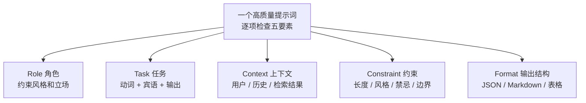
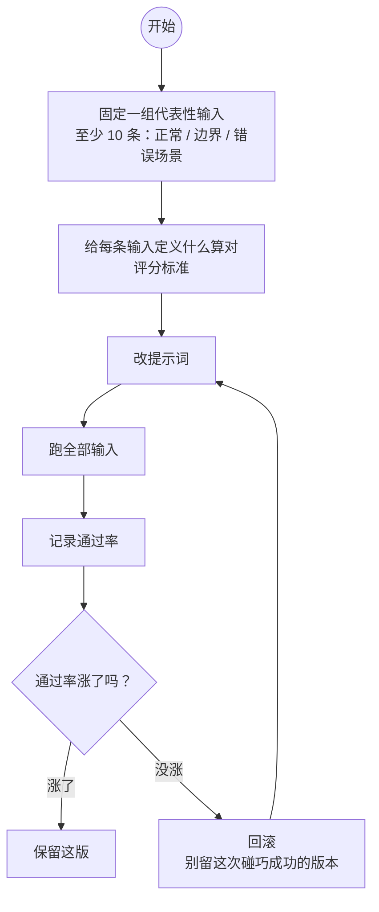

# 提示词工程入门——现代范式

> **这份文档是什么**：直接回答两个问题——**"大模型时代，我该不该学提示词工程？"** 和 **"怎么写提示词才算好？"** 它是仓库 AI 资料里最入门的一篇，不涉及框架代码；读完你会有正确的预期、会写出结构化的提示词，并且知道"什么时候该停下去做 Agent"。
>
> 前置：无（会发 ChatGPT / Claude 对话即可）。进阶：读完可去 [`spring-ai-2.0/23-Prompt工程深入`](../../tutorials/spring-ai-2.0/23-Prompt工程深入.md) 学 CoT / ReAct 等高级模式。

---

## 0. 一句话回答"该不该学"

> **该学，但只学 20% 的精华，别学 80% 的"话术套路"。** 对一个写业务代码的 Java 工程师，提示词工程的真正价值不是"把提示词写得更花哨"，而是：
> ① 把需求说清楚（角色 / 任务 / 上下文 / 约束 / 输出格式）；
> ② 让输出结构化成代码能直接解析的 JSON；
> ③ 改提示词时**带评测地改**，而不是碰运气。
>
> 做到这三点，你已经超过大多数"会聊天但不会用"的人。至于 CoT / ToT / Self-Consistency 这些进阶套路，是给高可靠场景准备的——仓库里 [23 号文档](../../tutorials/spring-ai-2.0/23-Prompt工程深入.md) 有全套，按需再学。

---

## 1. 先认清：提示词工程已经变了

### 1.1 2023 年的套路 vs 2026 年的现实

| 旧印象（2023） | 现实（2026） |
|--------------|------------|
| 提示词是"魔法咒语"，背几个模板就厉害 | 提示词是**接口设计**，重点是结构不是咒语 |
| 想让模型思考就写 "Let's think step by step" | **推理模型**（o1 / R1 / Claude 新系列）内部已经会思考，外显 CoT 增益变小 |
| 调参（temperature）是主要杠杆 | 给模型**更好的上下文**（角色、示例、检索结果、工具描述）才是主要杠杆 |
| 提示词写死在一行代码里 | 提示词是**要版本化、要评测、要 A/B** 的工程资产 |

> 关键认知：**提示词工程的杠杆，从"说服模型"转向了"给模型喂对的信息"**。业界把这个叫 **上下文工程（Context Engineering）**——你不只是写一句话，你在设计"模型看到了什么"。这和 Java 里的"接口文档"思维完全一致：参数越清晰、契约越明确，调用方（模型）越不会犯错。

### 1.2 对 Java 开发者，这更像个好消息

提示词工程**不是一门新语言**，它和你写代码的思维方式高度重合：

- 写接口要定义入参 / 出参 → 写提示词要定义输入 / 输出格式
- 写代码要处理边界情况 → 写提示词要写清楚约束和"不确定时怎么办"
- 改代码要回归测试 → 改提示词要回归评测

所以别把它当玄学学，**把它当"给一个很聪明但很鲁莽的新同事写需求文档"**——这个类比 80% 能覆盖你需要的技巧。

---

## 2. 提示词五要素（90% 的价值）

一个高质量提示词由五个部分构成。写提示词时逐项检查，就比 90% 的人强。

| 要素 | 作用 | 一句话 |
|------|------|--------|
| **Role** | 角色设定，约束风格和立场 | "你是财务系统的资深顾问" |
| **Task** | 明确做什么（动词 + 宾语 + 输出） | "分析这份账单，找出异常项" |
| **Context** | 给模型背景（用户、历史、检索结果） | "用户是 VIP，近 30 天无投诉" |
| **Constraint** | 约束（长度、风格、禁忌、边界） | "不确定的信息不要编造，明说需要确认" |
| **Format** | 输出结构（JSON / Markdown / 表格） | "输出 `{answer, confidence, needsHuman}`" |

**五要素**：写提示词时逐项检查这五部分，就比 90% 的人强。



### 2.1 反模式：全部塞进一句 user 消息

```
❌ 帮我看看这份日志有什么问题，用中文回答，不超过200字，要专业，输出json格式带confidence字段……
```

模型容易丢约束、输出结构全靠猜。这是新手最常见的问题。

### 2.2 正模式：分层 + 逐要素

```
【System】
你是运维值班助手。
# 约束
- 回答不超过 200 字
- 不确定的事直接说"需要人工确认"，不要编造
- 只根据提供的日志分析，不要猜测日志之外的系统状态
# 风格
- 简洁、结论先行

【User】
# 背景
以下是生产环境订单服务最近 1 小时的错误日志。

# 任务
找出 1 条最可能导致问题的原因，并给出排查建议。

# 日志
{日志内容}

# 输出
严格按 JSON：{"root_cause": "...", "evidence": "...", "suggestion": "..."}
```

> 为什么这样更好？**约束放 System**（模型对 system 的遵守度更高）、**背景和任务放 User**（每次请求会变）、**输出格式单独强调**。这就是 [23 号文档 §1](../../tutorials/spring-ai-2.0/23-Prompt工程深入.md) 的"五要素拆三段"——一句话：**System 和 User 都把 Format 单独强调**。

### 2.3 一个可复制的通用模板 + 自查清单

写任何提示词，从下面这个骨架开始填：

```
【System】你是 {角色}。
# 约束
- {长度 / 风格 / 禁忌 / 边界，逐条列出}
# 风格
- {语气}

【User】
# 背景
{给模型的上下文：用户是谁、有什么历史、检索到了什么}

# 任务
{动词 + 宾语 + 输出要求}

# 数据
{输入内容}

# 输出
{输出格式：JSON 结构 / 字段 / 取值范围}
```

填完逐项打钩：

| 要素 | 自查 | ✅ |
|------|------|:--:|
| Role | 角色、立场、风格有没有定？ | |
| Task | 是不是"动词 + 宾语 + 输出"？ | |
| Context | 模型需要知道的背景都给全了吗？ | |
| Constraint | 边界、禁忌、"不确定怎么办"写了吗？ | |
| Format | 输出格式明确到字段级了吗？ | |
| 评测 | 这次改动有固定输入 + 通过率吗？ | |

> 一句提醒：`temperature` 调高更"发散"、调低更"保守"，是个真实可用的旋钮，但**优先级排在"把上下文和格式写对"之后**——先写对，再微调。

---

## 3. 结构化输出：让提示词落地成代码

提示词写得再漂亮，如果输出是自由文本，代码解析起来就全是坑。**真正让提示词工程生效的是结构化输出**。

```
告诉我情绪 → ❌ 解析依赖模型心情
输出 {"sentiment": "positive|negative|neutral", "confidence": 0~1} → ✅ 代码直接反序列化
```

- 明确告诉模型**输出 JSON，字段名、类型、取值范围**。
- 在 Spring AI / LangChain4j 里，直接声明一个 Java record + `.entity(Class)`，框架自动反序列化（[spring-ai 的 05 结构化输出](../../tutorials/spring-ai/05-结构化输出与Prompt模板.md)）。
- 字段缺了 / 类型错了怎么办？让模型**看错误信息自我修复**（Spring AI 的 `StructuredOutputValidationAdvisor`，见 [23 号文档 §8](../../tutorials/spring-ai-2.0/23-Prompt工程深入.md)）。

> 一句话：**提示词的"输出契约"比"话术"更重要**。先定好 JSON 结构，再写提示词。

---

## 4. 改提示词的正确姿势：带评测地改

新手最大的幻觉是"多试几个说法，看哪个对"。**没有评测的调提示词 = 碰运气**，换一次输入就翻车。

正确的循环：

```
1. 固定一组"代表性输入"（至少 10 条，覆盖正常 / 边界 / 错误场景）
2. 给每条输入定义"什么算对"（评分标准）
3. 改提示词 → 跑全部输入 → 记录通过率
4. 通过率没涨，就回滚，别留着"这次碰巧成功"的版本
```

这就是 **LLM 应用的测试驱动开发**。仓库里有完整方案：[spring-ai-2.0/12-评估闭环与Prompt版本管理](../../tutorials/spring-ai-2.0/12-评估闭环与Prompt版本管理.md)。

**带评测地改的循环**：



---

## 5. Java 工程师的提示词工程，主要用在哪三处

| 用在哪 | 为什么 |
|--------|--------|
| **Tool 的描述（最关键）** | Agent 靠工具描述决定"什么时候调它、传什么参"——描述不清楚，Agent 永远调不对（[tutorials/agent/01-Tool设计原则](../../tutorials/agent/01-Tool设计原则.md)） |
| **System Prompt（人设 + 约束）** | 客服 / 运维 / 文档助手类 Agent 的"性格"和"红线"全在这里 |
| **Few-shot 示例（教模型怎么做）** | 分类、抽取等"边界模糊"的任务，给 1-3 个示例比说一百句规则有用 |

> 有意思的发现：在 Agent 场景里，**工具描述写得好不好，比主 prompt 写得好不好更影响成败**。因为 Agent 的多轮正确性，取决于每一步"该调哪个工具"判断得准不准，而这个判断完全靠工具描述。

---

## 6. 调试：模型不听话怎么办

模型不是代码，没有"堆栈"。但常见症状有规律，按症状对症下药：

| 症状 | 最常见原因 | 先试这个 |
|------|-----------|---------|
| **不按格式输出** | Format 没写清楚，或约束埋在长段里 | 把 JSON 结构单独一行、字段说明写全；必要时用结构化输出校验重试（见 [§3](#3-结构化输出让提示词落地成代码)） |
| **编造 / 一本正经胡说** | 信息不足，模型"脑补" | 加约束"不确定就明说"；给检索结果（RAG）；让它引用来源 |
| **答非所问 / 跑偏** | Task 不具体，或上下文太长淹没重点 | 把任务改成"动词 + 宾语 + 输出"；精简上下文 |
| **拒绝回答（太保守）** | 约束写得太死，或安全策略误伤 | 检查 Constraint 是否过度限制；放宽边界 |
| **啰嗦 / 不简洁** | 没有长度约束，或 Few-shot 示例本身就长 | 加"不超过 N 字"；换更短的示例 |
| **中文夹杂英文 / 语气不对** | 风格没写，或示例风格污染 | 在 System 里明确语言和语气；检查 Few-shot 风格 |

> 调试原则：**一次只改一个变量**，改完跑一遍评测集看通过率（[06-怎么评估一个Agent](./06-怎么评估一个Agent.md)）。"这次碰巧对了"不算改好。

---

## 7. 反模式速查

| 反模式 | 后果 | 修复 |
|--------|------|------|
| 五要素全塞一句 user 消息 | 约束丢失、输出随意 | 拆 System / User / Format 三段 |
| 输出不指定格式 | 解析全靠猜 | 给 JSON 结构 + 字段说明 |
| 没有示例就做边界模糊的分类 | 结果不稳 | 上 1-3 个 Few-shot |
| 改提示词不带评测 | 换输入就翻车 | 建评测集，通过率说话 |
| 把提示词写死在代码里 | 无法 A/B、无法回滚 | 外部化 + 版本管理（[12 号文档](../../tutorials/spring-ai-2.0/12-评估闭环与Prompt版本管理.md)） |
| 拿 CoT / ToT 套普通问答 | 成本翻几倍、收益为零 | 简单任务直接问；高级模式按需（[23 号文档](../../tutorials/spring-ai-2.0/23-Prompt工程深入.md) 决策树） |

---

## 8. 练手

1. 把 §2.2 的"分析日志找根因"示例写进任意一个 ChatClient / 聊天界面，对比"一段话版"和"五要素版"的输出。
2. 给自己手头一个 AI 功能（客服 / 总结 / 分类）定义输出 JSON 结构，再写提示词。
3. 攒 10 条代表性输入，对同一个功能做一次"改提示词 → 跑评测"的循环，记录通过率变化。
4. 用 `git` 管理提示词改动，每版记录"为什么改、评测通过率多少"。

---

## 9. 理解检查

1. 为什么说 2026 年提示词工程的杠杆从"说服模型"转向了"喂对信息"？
2. 五要素分别该放在哪一层（System / User / 单独强调）？
3. 为什么"输出格式契约"比"话术"更重要？
4. 调提示词不评测，会有什么后果？
5. Agent 场景里，为什么"工具描述"比"主提示词"更影响成败？

---

## 10. 相关文档

- [07-怎么写好提示词-实用技巧](./07-怎么写好提示词-实用技巧.md) —— 写作手艺：具体 / 给例子 / 留退路 / 一次一变量
- [16-框架提示词案例库](./16-框架提示词案例库.md) —— 五要素 / 结构化 / Few-shot 的 Spring AI + LangChain4j 双框架代码
- [`spring-ai-2.0/23-Prompt工程深入`](../../tutorials/spring-ai-2.0/23-Prompt工程深入.md) —— CoT / ToT / ReAct / Self-Consistency 全套，含 Spring AI 代码
- [`spring-ai-2.0/12-评估闭环与Prompt版本管理`](../../tutorials/spring-ai-2.0/12-评估闭环与Prompt版本管理.md) —— 评测 + 版本化
- [`spring-ai/05-结构化输出与Prompt模板`](../../tutorials/spring-ai/05-结构化输出与Prompt模板.md) —— 框架层结构化输出
- [`tutorials/agent/01-Tool设计原则`](../../tutorials/agent/01-Tool设计原则.md) —— 提示词工程的真正主战场
- [Anthropic: Prompt Engineering 官方文档](https://docs.anthropic.com/en/docs/build-with-claude/prompt-engineering/overview)
- [OpenAI: Prompt Engineering Guide](https://platform.openai.com/docs/guides/prompt-engineering)

下一篇：[02-Agent是什么与核心心智模型](./02-Agent是什么与核心心智模型.md)
