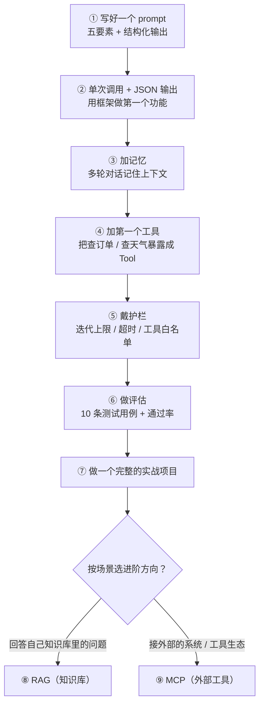
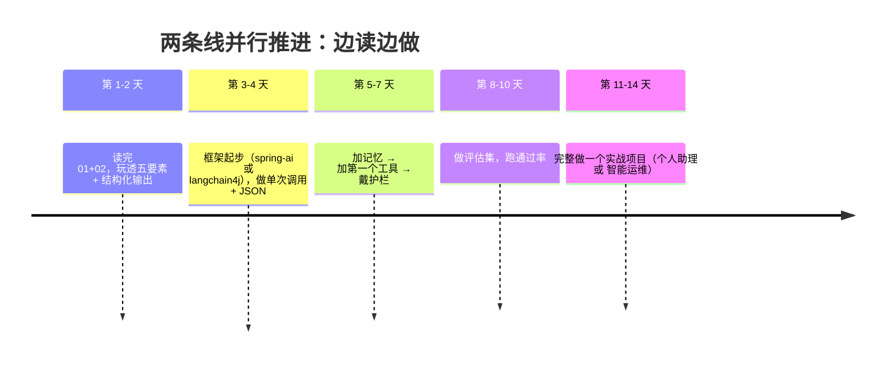

# 上手路径与避坑——从哪开始、怎么少踩坑

> **这份文档是什么**：给"决定学 Agent 了"的读者一条**具体的上手路线**（七步，每步对应仓库里的哪份文档），外加**六大坑**和一份**全仓库 AI 学习资源地图**。
>
> 前置：[01](./01-提示词工程入门-现代范式.md) + [02](./02-Agent是什么与核心心智模型.md)。

---

## 0. 三条原则（先读）

1. **不要一上来就学框架，先玩心智模型**：先在聊天界面把"五要素提示词"和"结构化输出"玩明白，再碰 Spring AI / LangChain4j。
2. **一次只加一个变量**：能单次调用解决的就别上循环，能一个工具就别上三个。每加一层，先想清楚"不加行不行"。
3. **从第一行代码就带评测和护栏**：这两样"补不了"，越晚越痛。

---

## 1. 七步上手路线

| 步骤 | 做什么 | 用仓库里哪份 |
|:---:|--------|------------|
| **①** | 写好一个 prompt：五要素 + 结构化输出 | [01-提示词工程入门](./01-提示词工程入门-现代范式.md) |
| **②** | 用框架做一个"单次调用 + JSON 输出"的功能 | [spring-ai/01-快速起步](../../tutorials/spring-ai/01-快速起步.md) 或 [langchain4j/01-快速起步](../../tutorials/langchain4j/01-快速起步.md) |
| **③** | 加记忆：让多轮对话记住上下文 | [langchain4j/02-ChatMemory](../../tutorials/langchain4j/02-ChatMemory.md) 或 [spring-ai-2.0/25-Agent记忆架构](../../tutorials/spring-ai-2.0/25-Agent记忆架构.md) |
| **④** | 加第一个工具：把"查订单 / 查天气"暴露成 Tool | 先读 [08-Agent开发的提示词实战](./08-Agent开发的提示词实战.md) → [tutorials/agent/01-Tool设计原则](../../tutorials/agent/01-Tool设计原则.md) |
| **⑤** | 戴护栏：迭代上限、超时、工具白名单 | [tutorials/agent/02-防止Agent失控](../../tutorials/agent/02-防止Agent失控.md) |
| **⑥** | 做评估：10 条测试用例 + 通过率 | [06-怎么评估一个Agent](./06-怎么评估一个Agent.md)（入门）→ [tutorials/agent/06-评估与测试](../../tutorials/agent/06-评估与测试.md)（实操） |
| **⑦** | 做一个完整的实战项目 | 按 [09-练手项目](./09-练手项目.md) 把概念串一遍 → 再用框架实现：[tutorials/agent/04-个人助理](../../tutorials/agent/04-实战项目-个人助理.md) 或 [05-智能运维](../../tutorials/agent/05-实战项目-智能运维.md) |

> 七步走完，你就完成了 [tutorials/agent](../../tutorials/agent/00-阶段总览.md) 整套阶段 4——从"会聊天"到"能写进简历的 Agent 项目"。

**七步上手路线**：

### 1.1 进阶两步（按需）：RAG 和 MCP

七步是最小闭环。现实中 90% 的 Agent 还会碰到两件事：**要回答自己知识库里的问题**（RAG），**要接外部的系统 / 工具生态**（MCP）。做完基础七步后，按你的场景选：

| 方向 | 解决什么 | 从这读 |
|------|---------|--------|
| **⑧ RAG（知识库）** | 让 Agent 查企业私有文档、产品手册再回答，而不是靠模型记的"旧知识"瞎编 | [04-RAG入门](./04-RAG入门-让Agent查自己的知识库.md) |
| **⑨ MCP（外部工具）** | 让 Agent 直接调用"别的团队 / 别的语言 / 独立部署"的工具服务 | [05-MCP入门](./05-MCP入门-Agent怎么接外部工具生态.md) |

---

## 2. 六大坑（新手最容易踩）

### 坑 1：把 Agent 当普通函数用 / 把简单任务硬套 Agent
- **表现**：一个固定规则的分类任务，套上 Agent 循环，又慢又贵还不稳。
- **解法**：先用 [02 的决策树](./02-Agent是什么与核心心智模型.md) 判断——流程固定用 Workflow，能单次调用就不上循环。

### 坑 2：工具写得不合格
- **表现**：Agent "经常不调工具 / 调错参数 / 查不到就编造"。
- **解法**：90% 是工具描述问题，不是模型问题。去读 [01-Tool设计原则](../../tutorials/agent/01-Tool设计原则.md)，每个工具写清：作用、参数含义、返回、失败行为（现成案例：[16 场景四](./16-框架提示词案例库.md)）。

### 坑 3：提示词写死在代码里
- **表现**：改个语气要改代码、没法 A/B、没法回滚。
- **解法**：提示词外部化（PromptRepo / resources/prompts）+ 版本管理，见 [spring-ai-2.0/12-评估闭环与Prompt版本管理](../../tutorials/spring-ai-2.0/12-评估闭环与Prompt版本管理.md)。

### 坑 4：没有评测，靠"这次碰巧成功"调参
- **表现**：换个输入就翻车，说不清为什么。
- **解法**：固定 10+ 条代表性输入，定义"什么算对"，改完跑一遍通过率。这是 LLM 应用的 TDD（具体怎么做见 [06-怎么评估一个Agent](./06-怎么评估一个Agent.md)）。

### 坑 5：护栏后补
- **表现**：一次死循环烧掉几百块 token，或者 Agent 调了不该调的工具。
- **解法**：初学就加迭代上限、超时、工具白名单，见 [02-防止Agent失控](../../tutorials/agent/02-防止Agent失控.md)。**护栏不是进阶内容，是必修内容。**

### 坑 6：没有日志，Agent 像个黑盒
- **表现**：出错时不知道 Agent 当时"想了什么、调了哪个工具、哪一步崩的"，只能反复重试碰运气。
- **解法**：加可观测性——记录每次调用的完整轨迹（用户输入、模型输出、工具调用、工具结果、耗时、token）。详见 [spring-ai-2.0/15-可观测性与成本治理](../../tutorials/spring-ai-2.0/15-可观测性与成本治理.md) 或 [33a-Agent可观测性最小实战](../../tutorials/spring-ai-2.0/33a-Agent可观测性最小实战.md)。

---

## 3. 全仓库 AI 学习资源地图

### 3.1 本仓库（按阅读顺序）

| 层次 | 文档 |
|------|------|
| **入门（本专题）** | [01-提示词](./01-提示词工程入门-现代范式.md) → [02-Agent心智模型](./02-Agent是什么与核心心智模型.md) → 本页 |
| **提示词写作（本专题进阶）** | [07-写作技巧](./07-怎么写好提示词-实用技巧.md) → [08-Agent提示词实战](./08-Agent开发的提示词实战.md) → [16-案例库](./16-框架提示词案例库.md) |
| **收官（本专题动手）** | [09-练手项目](./09-练手项目.md)（把 01-08 串成客服 Agent） |
| **架构师之路（本专题进阶）** | [10-路线](./10-从入门到Agent架构师.md) → [11-决策框架](./11-Agent系统设计决策框架.md) → [15-模式全集](./15-Agent架构模式全集.md) → [12-案例复盘](./12-案例复盘.md) → [13-面试自测](./13-Agent架构师面试与自测.md) → [14-前沿眼界](./14-Agent前沿地图.md) |
| **框架起步** | [spring-ai 全套](../../tutorials/spring-ai/01-快速起步.md) 或 [langchain4j 全套](../../tutorials/langchain4j/01-快速起步.md)（二选一，对照 [07-SpringAI与LangChain4j对比](../../tutorials/spring-ai/07-与LangChain4j对比.md) 选） |
| **Agent 工程化** | [tutorials/agent 00-06](../../tutorials/agent/00-阶段总览.md)（Tool / 防失控 / 编排 / 两个实战 / 评估） |
| **评估（怎么知道好不好用）** | [06-怎么评估一个Agent](./06-怎么评估一个Agent.md) → 深：[tutorials/agent/06-评估与测试](../../tutorials/agent/06-评估与测试.md)、[spring-ai-2.0/12-评估闭环](../../tutorials/spring-ai-2.0/12-评估闭环与Prompt版本管理.md)、[13-测试工程化](../../tutorials/spring-ai-2.0/13-测试工程化.md) |
| **Spring AI 2.0 系统课** | [spring-ai-2.0/00-目录索引](../../tutorials/spring-ai-2.0/00-目录索引.md)（02 工具、10 多Agent、11 Workflow、23 Prompt、25 记忆、12 评估、15 可观测） |
| **RAG（知识库方向）** | [04-RAG入门](./04-RAG入门-让Agent查自己的知识库.md) → 深：[spring-ai-2.0/09-RAG工程化实战](../../tutorials/spring-ai-2.0/09-RAG工程化实战.md)、[20-RAG高级篇](../../tutorials/spring-ai-2.0/20-RAG高级篇.md)、[reference/02-RAG深度优化](../../reference/理论基础/02-RAG深度优化.md) |
| **MCP（外部工具方向）** | [05-MCP入门](./05-MCP入门-Agent怎么接外部工具生态.md) → 深：[spring-ai-2.0/05-06-07 三部曲](../../tutorials/spring-ai-2.0/05-MCP协议全解.md) |
| **原理与参考** | [reference/理论基础/03-Agent原理](../../reference/理论基础/03-Agent原理.md)、[04-多模态与多Agent](../../reference/理论基础/04-多模态与多Agent.md) |
| **安全（提示词注入等）** | [08-Agent提示词实战](./08-Agent开发的提示词实战.md) §6 → 深：[spring-ai-2.0/14-安全工程与红队](../../tutorials/spring-ai-2.0/14-安全工程与红队.md) |
| **实战串讲** | [spring-ai-2.0/21-端到端案例](../../tutorials/spring-ai-2.0/21-端到端案例.md)、[35-管数分离实战](../../tutorials/spring-ai-2.0/35-管数分离实战-从Sinks到Kafka演进.md)（把 Kafka / Redis / Reactor 和 AI 串起来） |

### 3.2 外部资源（官方优先）

| 资源 | 讲什么 | 链接 |
|------|--------|------|
| Anthropic Prompt Engineering | 官方提示词工程文档（五要素同源） | https://docs.anthropic.com/en/docs/build-with-claude/prompt-engineering/overview |
| Anthropic Building Effective Agents | **Workflow vs Agent 权威判据**（很短，必读） | https://www.anthropic.com/engineering/building-effective-agents |
| OpenAI Prompt Engineering Guide | 官方提示词指南 | https://platform.openai.com/docs/guides/prompt-engineering |
| OpenAI "A practical guide to building agents" | Agent 落地清单（工具设计 / 护栏 / 评测） | https://platform.openai.com/docs/guides/agents |
| Spring AI Prompt 工程参考 | 框架层提示词模式 | https://docs.spring.io/spring-ai/reference/api/chat/prompt-engineering-patterns.html |

> 外部资料**不需要都看**：入门阶段读 Anthropic 的 Prompt Engineering 总览 + Building Effective Agents 两篇就够；其余的等遇到具体问题再查。

---

## 4. 一条建议的节奏

> 之后按需深入：要做知识库客服加 [04-RAG入门](./04-RAG入门-让Agent查自己的知识库.md)、要接外部工具生态加 [05-MCP入门](./05-MCP入门-Agent怎么接外部工具生态.md)、要上生产看 [spring-ai-2.0/15-可观测性与成本治理](../../tutorials/spring-ai-2.0/15-可观测性与成本治理.md)、要做多 Agent 看 [10-多Agent编排实战](../../tutorials/spring-ai-2.0/10-多Agent编排实战.md)。

**建议节奏**：

---

## 5. 回到附录

读完后，回到 [附录总览](../00-学习路线总览.md) 看整条路线。

下一篇：[04-RAG入门——让 Agent 查自己的知识库](./04-RAG入门-让Agent查自己的知识库.md)
