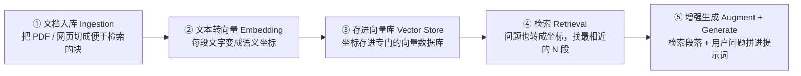
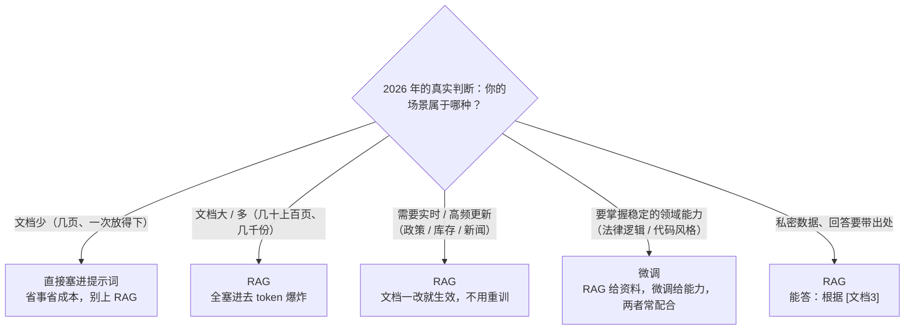

# RAG 入门——让 Agent 查自己的知识库

> **这份文档是什么**：Agent 最常见的两种落地方向之一（另一种是 [MCP](./05-MCP入门-Agent怎么接外部工具生态.md)）。讲清 RAG 解决什么问题、五步管道、什么时候该用 RAG（而不是微调或直接塞长上下文）。不贴代码，代码在深处文档里。
>
> 前置：[01-提示词工程入门](./01-提示词工程入门-现代范式.md) + [02-Agent是什么与核心心智模型](./02-Agent是什么与核心心智模型.md)。
> 进阶（要写代码）：[spring-ai-2.0/09-RAG工程化实战](../../tutorials/spring-ai-2.0/09-RAG工程化实战.md)（100 行跑通"问 PDF"）、[20-RAG高级篇](../../tutorials/spring-ai-2.0/20-RAG高级篇.md)、[reference/02-RAG深度优化](../../reference/理论基础/02-RAG深度优化.md)。

---

## 0. 一句话

> **RAG（Retrieval-Augmented Generation，检索增强生成）= 让模型回答前，先去知识库里"查一下"再回答。**
> 模型不再是靠"训练时记住的东西"瞎答，而是**以检索到的真实资料为依据**生成答案。

---

## 1. 解决什么问题：模型的三个天生缺陷

| 缺陷 | 表现 | RAG 的解法 |
|------|------|-----------|
| **知识有截止日期** | 问 2026 年的新政策，模型只会"我不知道"或瞎编 | 去知识库查最新文档 |
| **不知道你的私有数据** | 你的产品手册、售后话术、内部流程，公开训练数据里没有 | 把私有文档切好存进向量库，随时可查 |
| **爱编造（幻觉）** | 记不清的时候会一本正经地编 | 检索到原文，生成时"照着说"，还方便溯源 |

> **一句话类比**：RAG 像给一个"很聪明但会吹牛"的专家配了一台**永远最新的档案柜**——他不确定时先翻档案，而不是凭印象胡诌。这也正是做"知识库客服"最标准的技术方案。

---

## 2. 五步管道（理解即可，不用背代码）

```
① 文档入库（Ingestion）   ② 文本转向量（Embedding）   ③ 存进向量库（Vector Store）
④ 检索（Retrieval）       ⑤ 拼进提示词再生成（Augment + Generate）
```

| 步骤 | 做什么 | 通俗类比 |
|------|--------|---------|
| **① 切分入库** | 把 PDF / 网页切成一段段"便于检索"的块，附上来源信息 | 把档案按主题归档、贴好标签 |
| **② 转向量** | 每段文字用 Embedding 模型变成一串"语义坐标" | 给每份档案编一个"内容指纹" |
| **③ 存向量库** | 坐标存进专门的向量数据库 | 档案上架，按指纹排序 |
| **④ 检索** | 把用户问题也转成坐标，找出"语义上最相近"的 N 段 | 按指纹在档案柜里翻出最相关几份 |
| **⑤ 增强生成** | 把检索到的段落 + 用户问题一起拼进提示词，让模型"照着说" | 把档案原文递给专家，让他引着档案回答 |

> **五步里，真正决定效果的是 ① 切分和 ④ 检索**——文档切得好不好、检索得准不准，直接决定答案质量。这两步的优化在 [09 号文档第 3-6 章](../../tutorials/spring-ai-2.0/09-RAG工程化实战.md)。

**五步管道**：



### 2.1 五步里唯一"你写"的提示词：增强提示词

第 ⑤ 步把检索到的段落 + 用户问题拼进提示词——这段**是 RAG 里唯一由你写的提示词**，模板如下：

```
根据下面的资料回答问题。若资料里找不到答案，直接说"资料中未找到"，不要编造。

# 资料
{检索到的 N 段文本}

# 问题
{用户问题}
```

> 关键就一句：**"找不到就明说，不要编造"**——这是抑制 RAG 幻觉的第一道闸（[07 技巧五](./07-怎么写好提示词-实用技巧.md) 的"退路"在 RAG 里的应用）。完整双框架代码见 [16-框架提示词案例库 场景六](./16-框架提示词案例库.md)。

---

## 3. 什么时候该用 RAG？（2026 年的真实判断）

长上下文模型（一次能读几十万字）出现后，"要不要 RAG"有了新答案。**别无脑上 RAG**：

| 场景 | 用哪种 |
|------|--------|
| 文档**少**（几页、一次放得下） | **直接塞进提示词**就行，别上 RAG（省事省成本） |
| 文档**大**或**多**（几十上百页、几千份） | **RAG**（全塞进去 token 爆炸、模型也容易抓不住重点） |
| 需要**实时 / 高频更新**（政策、库存、新闻） | **RAG**（文档一改就生效，不用重训） |
| 要模型掌握**稳定的领域能力**（法律逻辑、代码风格、行业话术） | **微调**（RAG 给"资料"，微调给"能力"，两者常配合） |
| 私密数据、要求**回答带出处** | **RAG**（能答"根据 [文档3]"） |

> **一句话**：RAG 解决"信息更新 / 量大 / 要出处"的问题，微调解决"能力固化"的问题，长上下文解决"数据不多"的问题。**先用最省的方案，撑不住了再升级。**

**选型决策**：



---

## 4. RAG 和 Agent 的关系：RAG 是一个特殊的 Tool

你可能已经发现：**RAG 本质上就是给 Agent 加了一个"查知识库"的工具。**

```
普通 Agent 工具：getOrderStatus(orderId)        → 查订单系统
RAG 这个"工具"：searchKnowledgeBase(question)  → 返回最相关的文档段落
```

区别只在返回内容：订单工具返回结构化数据，RAG 工具返回**一段文本**。所以 Agent 会自己决定"这个问题要不要先查知识库"——这正是 [02](./02-Agent是什么与核心心智模型.md) 里说的"模型在循环里做决策"。

> 生产里两者经常叠着用：客服 Agent = 知识库 RAG（回答政策 / 流程）+ 订单工具（查状态）+ 工单工具（升级人工）。

---

## 5. 从哪动手

1. 先读 [spring-ai-2.0/09-RAG工程化实战](../../tutorials/spring-ai-2.0/09-RAG工程化实战.md) 第 1 章——100 行代码让"问 PDF 一个问题"跑通，**连 docker 都不用起**（内存向量库）。
2. 跑通后再按 [09 第 2-9 章](../../tutorials/spring-ai-2.0/09-RAG工程化实战.md) 逐章升级：生产级存储 → 切分优化 → 查询改写 → 混合检索 → 重排 → 引用溯源 → 评估闭环 → 上生产。
3. 想学原理和选型（向量库对比、Embedding 选型）看 [reference/02-RAG深度优化](../../reference/理论基础/02-RAG深度优化.md) 和 [spring-ai-2.0/24-向量模型选型与微调](../../tutorials/spring-ai-2.0/24-向量模型选型与微调.md)。
4. 想串成完整项目，[spring-ai-2.0/21-端到端案例](../../tutorials/spring-ai-2.0/21-端到端案例.md) 有 RAG 端到端。

---

## 6. 理解检查

1. 用一句话解释 RAG 解决了模型的哪个核心缺陷。
2. 五步管道里，哪两步最影响效果？
3. 文档只有 3 页，该不该上 RAG？为什么？
4. "做知识库客服要微调模型吗？"——你的回答？
5. 为什么说"RAG 本质上是一个特殊的 Tool"？

---

## 7. 相关文档

- [spring-ai-2.0/09-RAG工程化实战](../../tutorials/spring-ai-2.0/09-RAG工程化实战.md) —— 从 100 行跑通到上生产的完整实战
- [spring-ai-2.0/20-RAG高级篇](../../tutorials/spring-ai-2.0/20-RAG高级篇.md) —— 高级检索策略
- [reference/理论基础/02-RAG深度优化](../../reference/理论基础/02-RAG深度优化.md) —— 原理与选型
- [spring-ai-2.0/24-向量模型选型与微调](../../tutorials/spring-ai-2.0/24-向量模型选型与微调.md) —— Embedding 选型
- 下一篇：[05-MCP入门——Agent 怎么接外部工具生态](./05-MCP入门-Agent怎么接外部工具生态.md)
