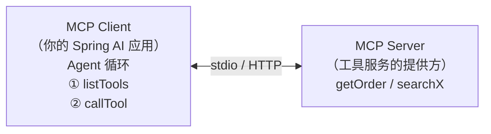
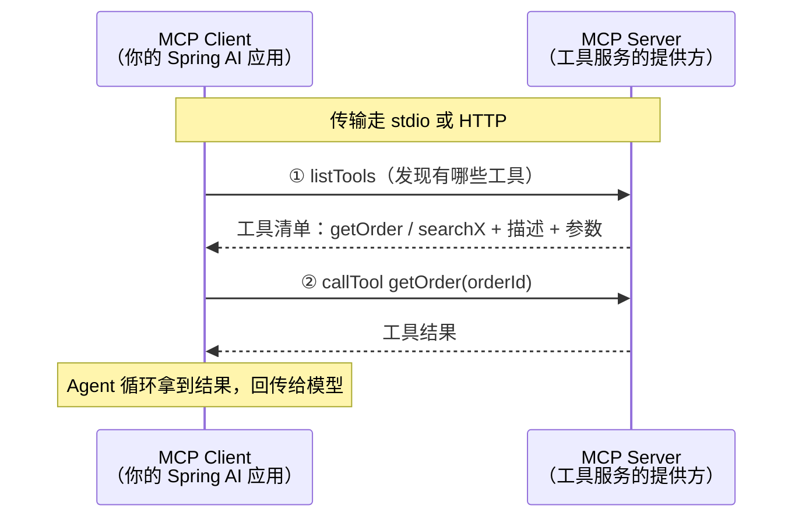
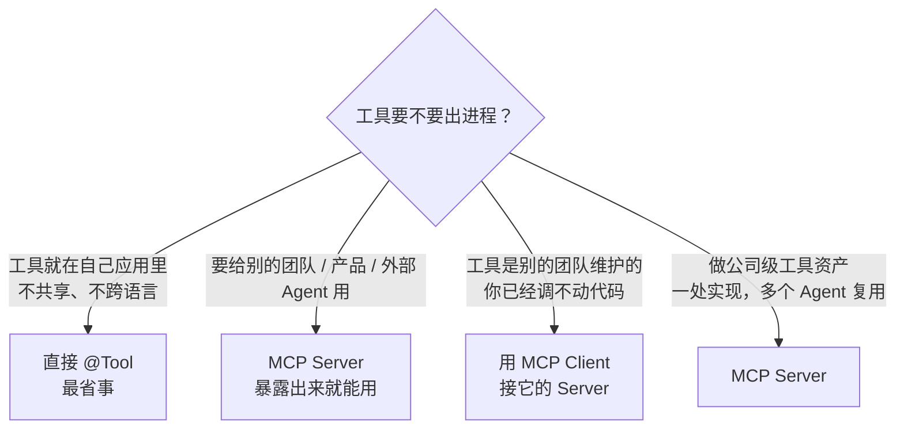

# MCP 入门——Agent 怎么接外部工具生态

> **这份文档是什么**：Agent 最常见的两种落地方向之一（另一种是 [RAG](./04-RAG入门-让Agent查自己的知识库.md)）。讲清 MCP 解决什么问题、Client/Server 心智模型、什么时候用 MCP 而不是直接写 `@Tool`。不贴代码，代码在深处文档里。
>
> 前置：[02-Agent是什么与核心心智模型](./02-Agent是什么与核心心智模型.md)（懂"工具"是什么即可）。
> 进阶（要写代码）：[spring-ai-2.0/05-06-07 MCP 三部曲](../../tutorials/spring-ai-2.0/05-MCP协议全解.md)。

---

## 0. 一句话

> **MCP（Model Context Protocol）= 把"工具"从你的程序里，搬到"独立运行的服务器"里的标准化协议。**
> 一个工具服务只要按 MCP 暴露出来，任何 Agent（Spring AI、LangChain4j、Claude Desktop、Cursor……）都能自动发现并调用——就像 USB 插上就能用。

---

## 1. 为什么需要它：进程内 Tool 的天花板

在 [02](./02-Agent是什么与核心心智模型.md) 里，你给 Agent 加工具是直接写一个 Java 方法：

```java
@Component
public class OrderTools {
    @Tool(description = "根据订单号查询订单状态")
    public Order getOrder(String id) { ... }
}
```

这能解决 80% 的场景，但四类情况它搞不定：

| 场景 | 进程内 `@Tool` | MCP Server |
|------|---------------|-----------|
| **别的产品要复用你的工具**（Claude Desktop / Cursor / 别的 Agent） | ❌ 工具在 JVM 里，外部进不来 | ✅ 暴露出来就能用 |
| **多个 Agent 共享同一套工具**（HR / 订单 / 运维） | 每个 Agent 各写一份 | ✅ 一处实现处处可用 |
| **工具是别的团队 / 别的语言写的**（Python 算法、Go 中台） | ❌ Java 调不动 | ✅ 协议跨语言 |
| **工具要独立部署、独立升级、独立鉴权** | 和主程序绑死 | ✅ 天然拆分 |

> **一句话类比**：MCP 是"LLM 的 USB 协议"。USB 让任意鼠标、键盘、硬盘插上电脑就能用；MCP 让任意工具服务接上 Agent 就能用——不再为每个工具写专属适配代码。

---

## 2. 心智模型：Client 和 Server



| 角色 | 是谁 | 做什么 |
|------|------|--------|
| **MCP Server** | 工具服务的提供方（可独立部署、另一种语言） | 向外界声明"我有这些工具"，并响应调用 |
| **MCP Client** | 你的 Agent 应用 | 发现 Server 的工具 → Agent 决定调用 → 拿到结果回传 |

两件事就构成协议的核心：**① listTools（发现有哪些工具）② callTool（调用某个工具）**。传输走 stdio 或 HTTP。

> 关键认知：**对 Agent 而言，MCP 工具和本地 `@Tool` 没有区别**——它看到的是同样的"工具名 + 描述 + 参数"。MCP 只是让这些工具可以来自"别处"。

**调用流程**（协议核心就两步：发现 + 调用）：



### 2.1 MCP 工具在模型眼里长什么样（本质也是"提示词"）

MCP Client 把 Server 的 `listTools` 结果转成模型能读的格式——这段"工具描述"就是 MCP 场景下的提示词：

```
工具名：getOrderStatus
描述：根据订单号查询订单状态；订单号不存在时返回 null。
参数：{"orderId": {"type": "string", "description": "订单号，如 ORD-1001"}}
```

> 和对 `@Tool` 的要求完全一样（[08 §2](./08-Agent开发的提示词实战.md)）：**描述写得好不好，决定模型调不调得对**。MCP 只是把这段描述从"进程内"搬到了"跨进程"——内容没变，位置变了。双框架完整代码见 [16 场景四](./16-框架提示词案例库.md)。

---

## 3. 什么时候用 MCP？什么时候直接写 @Tool？

| 情况 | 用哪种 |
|------|--------|
| 工具就在自己应用里、不共享、不跨语言 | **直接 `@Tool`**（最省事） |
| 工具要给"别的团队 / 别的产品 / 外部 Agent"用 | **MCP Server** |
| 工具是别的团队维护的（你已经调不动代码） | 用 **MCP Client** 接它的 Server |
| 做公司级"工具资产"：一处实现，多个 Agent 复用 | **MCP Server** |

> 一句话：**先直接写 `@Tool`，等"工具要出进程了"（共享 / 跨语言 / 独立部署）再上 MCP。** 别为了用 MCP 而用 MCP。

**选型决策**：



---

## 4. MCP 和整个 Agent 的关系

把 [02](./02-Agent是什么与核心心智模型.md) 的五零件放回来看，MCP 只在"工具"这一个零件上做了扩展：

```
本地工具：@Tool Java 方法（进程内）
MCP 工具：某个 Server 暴露的远程工具（跨进程）→ 接到 Agent 上看不出来区别
```

Agent 的循环（Thought → Action → Observation）完全不变，变的只是 Action 那一步：调用本地方法 or 调远程 Server。

---

## 5. 从哪动手

1. 先读 [spring-ai-2.0/05-MCP协议全解](../../tutorials/spring-ai-2.0/05-MCP协议全解.md) —— 把一个已存在的 MCP Server 接进 Spring AI，当 Client 跑通。
2. 再读 [06-MCP-Server开发实战](../../tutorials/spring-ai-2.0/06-MCP-Server开发实战.md) —— 自己写一个 Server 暴露工具。
3. 最后 [07-MCP-Server高阶与生态](../../tutorials/spring-ai-2.0/07-MCP-Server高阶与生态.md) —— 端到端整合、Hub、性能、安全。

---

## 6. 理解检查

1. 用一句话说明 MCP 和"进程内 @Tool"的本质差别。
2. Client 和 Server 各自是谁？核心的两个操作是什么？
3. "我的工具只给自己这个 Agent 用"——该用 MCP 吗？
4. 为什么说"对 Agent 而言，MCP 工具和本地工具没有区别"？
5. 举一个"MCP 能解决、@Tool 解决不了"的真实场景。

---

## 7. 相关文档

- [spring-ai-2.0/05-MCP协议全解](../../tutorials/spring-ai-2.0/05-MCP协议全解.md) —— Client 通关
- [spring-ai-2.0/06-MCP-Server开发实战](../../tutorials/spring-ai-2.0/06-MCP-Server开发实战.md) —— 自己造 Server
- [spring-ai-2.0/07-MCP-Server高阶与生态](../../tutorials/spring-ai-2.0/07-MCP-Server高阶与生态.md) —— 端到端 + 生态
- [reference/生产化与运营/14-MCP协议与生态](../../reference/生产化与运营/14-MCP协议与生态.md) —— MCP 生态全景

下一篇：[06-怎么评估一个Agent](./06-怎么评估一个Agent.md)
