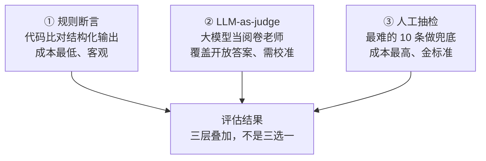
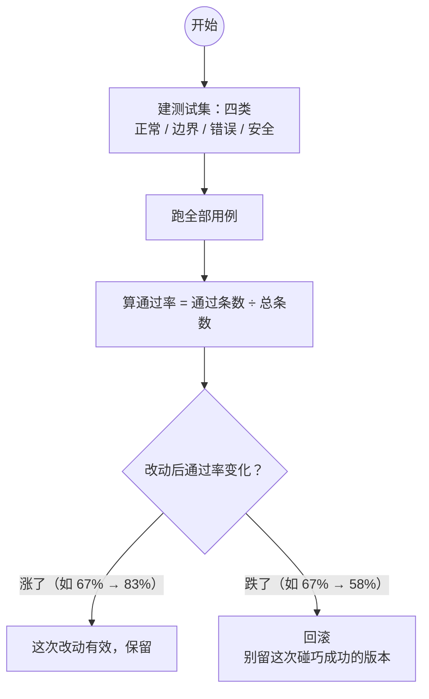

# 怎么评估一个 Agent——从"凭感觉"到"通过率说话"

> **这份文档是什么**：回答初学者做完 Agent 后最常问的问题——**"我怎么知道它好用不好用？"** 讲评估的两个维度、三种方法、怎么从 10 条用例开始。不贴代码，代码在深处文档里。
>
> 前置：[01-提示词工程入门](./01-提示词工程入门-现代范式.md) + [02-Agent是什么与核心心智模型](./02-Agent是什么与核心心智模型.md)。
> 进阶（要写代码）：[tutorials/agent/06-评估与测试](../../tutorials/agent/06-评估与测试.md)（准确率测试实操）、[spring-ai-2.0/12-评估闭环与Prompt版本管理](../../tutorials/spring-ai-2.0/12-评估闭环与Prompt版本管理.md)（评估 + 版本化闭环）、[13-测试工程化](../../tutorials/spring-ai-2.0/13-测试工程化.md)（进 CI）。

---

## 0. 一句话

> **评估 = 在固定的一组测试输入上，量化"回答对不对"。** 它把"这个 Agent 好不好用"从**主观感觉**变成**一个数字**——通过率。没有这个数字，你改进的任何一步都是碰运气。

---

## 1. 为什么必须有评估

LLM 不是代码，有三个特性决定了"凭感觉"必翻车：

| 特性 | 表现 | 没有评估的后果 |
|------|------|---------------|
| **概率性** | 同一问题这次对、下次错 | 你"测试"了 3 次都行，上线 100 次里错 20 次 |
| **幻觉是概率事件** | 偶尔一本正经地编 | 手工抽几例看不出，一上量就暴露 |
| **改动有涟漪** | 改一处 prompt，可能让另一类问题变差 | 你只看了"这次改好的例子"，没看到被改坏的那批 |

> **一句话**：提示词 / 工具的每次改动，都是**没做回归测试的代码改动**。评估就是给 LLM 应用补上"回归测试"。

---

## 2. 评估一个 Agent，要看两个维度

这是 Agent 评估和普通 LLM 评估**最大的区别**：

```
普通 LLM：只测最终输出对不对（一句话总结得好不好）
Agent   ：输出要对，过程也要对（有没有调错工具、绕圈、越权）
```

| 维度 | 问什么 | 典型问题 |
|------|--------|---------|
| **① 最终输出对不对** | 答案质量 | 回答是否准确、完整、符合格式 |
| **② 过程对不对** | 每一步决策 | 该调的工具调了吗？参数对吗？绕圈子了吗？调了不该调的工具吗？ |

> **为什么过程这么重要**：一个 Agent 就算最终回答对了，如果它"调了 5 个工具绕了一圈才答对"，成本是别人的 5 倍，而且放大风险（每多一步就多一次出错和越权机会）。**只看最终答案，会放过 80% 的生产事故源。**

---

## 3. 三种评估方法（从省到贵）

| 方法 | 怎么评 | 适合 | 成本 | 精度 |
|------|--------|------|:---:|:---:|
| **① 规则断言** | 用代码比对结构化输出（JSON 字段值、是否含关键词） | 有明确答案的任务（抽取、分类、工具调用参数） | 最低 | 高（客观） |
| **② LLM-as-judge** | 让一个大模型当"阅卷老师"打分 | 开放答案（总结、建议、对话质量） | 中 | 中（有偏差，需校准） |
| **③ 人工抽检** | 人逐条评 | 少量高价值样本、最终上线前 | 最高 | 最高（金标准） |

> **常用组合**：**规则断言打底**（能自动化的都自动化）+ **LLM 判卷覆盖开放题** + **人工抽检最难的 10 条**做兜底。三种不是三选一，是三层叠加。

**三层叠加**：



### 3.1 LLM-as-judge 的判卷提示词（可直接抄）

判卷提示词**必须给可对齐的评分标准**，否则同一份答案不同模型给分都不同、结果不可复现。模板：

```
你是评分员。按下面的标准给"回答"打分，只输出 JSON。
- 准确性（0-5）：是否与资料/事实一致，有没有编造
- 完整性（0-5）：是否覆盖用户问题
- 简洁性（0-5）：是否废话过多
总分 = 三项平均。低于 3 分必须给出 reason。

# 用户问题
{question}
# 回答
{answer}

输出：{"total": 0~5, "reason": "..."}
```

> 完整双框架代码（Spring AI 的 `judgeClient` / LangChain4j 的 Judge 接口）见 [16-框架提示词案例库 场景七](./16-框架提示词案例库.md)。

---

## 4. 从 10 条用例开始

不要追求用例多，先保证**覆盖**。给一个 Agent 建测试集，最少这四类：

| 类别 | 覆盖什么 | 示例 |
|------|---------|------|
| **正常** | 最常见的输入 | "查一下我的订单 ORD-1001" |
| **边界** | 极端但合法 | 空输入、超长输入、只给订单号不说是查询 |
| **错误** | 数据不存在 / 工具失败 | 订单号查不到、工具抛异常 |
| **安全** | 越权 / 诱导 | 让 Agent 取消别人的订单、让它泄露 prompt |

然后算一个数字：**通过率 = 通过条数 ÷ 总条数**。

**通过率决策**：



---

## 5. 一组常用指标

| 指标 | 是什么 | 看什么 |
|------|--------|--------|
| **回答准确率** | 最终输出对的占比 | 最核心的"好不好用" |
| **工具调用成功率** | 该调的工具调对 + 参数正确的占比 | Agent 会不会用工具（[02](./02-Agent是什么与核心心智模型.md) 里说的成败关键） |
| **平均步数** | 完成任务平均调几次工具 | 绕不绕圈（绕圈 = 慢 + 贵 + 易错） |
| **平均成本 / token** | 每任务平均花多少 | 贵不贵（决定能不能上生产） |
| **兜底率** | 该说"需要人工"时说对的比例 | 该承认不会时会不会硬编 |

> 前两个是"质量"，后三个是"成本与风险"。**上线前四个都要有数字，否则上线后没法解释任何一次线上事故。**

---

## 6. Agent 特有的"过程指标"怎么测

过程看不到、但能通过**留痕**来测：

| 想测的 | 怎么测 |
|--------|--------|
| 有没有绕圈 | 记录每次调用的**步数**，设阈值报警 |
| 有没有越权 | 工具调用全部打日志，对比白名单 |
| 有没有编造 | 开启**引用溯源**（RAG 答"根据 [Doc3]"），检查回答是否都有出处 |
| 有没有反复失败 | 记录工具报错 + 重试次数 |

> 这也是为什么"日志 / 可观测性"是必修（[03 的坑 6](./03-上手路径与避坑.md)）——**没有轨迹，过程指标无从谈起。**

---

## 7. 从哪动手

1. 先给手头那个 Agent 建 10-12 条测试用例（§4 的四类各来几条），算出**基线通过率**——先有数字，再谈改进。
2. 用 [tutorials/agent/06-评估与测试](../../tutorials/agent/06-评估与测试.md) 把规则断言跑起来。
3. 引入 [LLM-as-judge](../../tutorials/spring-ai-2.0/12-评估闭环与Prompt版本管理.md) 覆盖开放题，并把"改 prompt → 跑评估 → 记录通过率"变成固定流程（[01 的 §4](./01-提示词工程入门-现代范式.md)）。
4. 要上生产，把评估接进 CI（[13-测试工程化](../../tutorials/spring-ai-2.0/13-测试工程化.md)）。

---

## 8. 理解检查

1. 为什么 LLM 应用"凭感觉"改进必翻车？
2. 评估 Agent 和评估普通 LLM，多出来哪个维度？为什么？
3. 规则断言 / LLM 判卷 / 人工抽检各适合什么任务？
4. 建测试集至少要覆盖哪四类用例？
5. 除了回答准确率，还有哪四个指标要在上线前拿到数字？

---

## 9. 相关文档

- [tutorials/agent/06-评估与测试](../../tutorials/agent/06-评估与测试.md) —— 准确率测试、回归测试实操
- [spring-ai-2.0/12-评估闭环与Prompt版本管理](../../tutorials/spring-ai-2.0/12-评估闭环与Prompt版本管理.md) —— 评估 + 版本化闭环
- [spring-ai-2.0/13-测试工程化](../../tutorials/spring-ai-2.0/13-测试工程化.md) —— 把评估接进 CI
- [spring-ai-2.0/15-可观测性与成本治理](../../tutorials/spring-ai-2.0/15-可观测性与成本治理.md) —— 日志轨迹 + 成本监控

下一篇：[07-怎么写好提示词-实用技巧](./07-怎么写好提示词-实用技巧.md)
