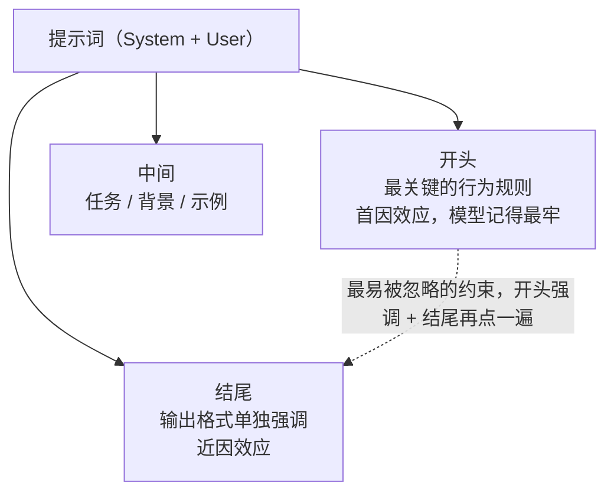

# 怎么写好提示词——实用技巧

> **这份文档是什么**：[01](./01-提示词工程入门-现代范式.md) 讲的是"该不该学 + 结构（五要素 / 分层 / 输出契约）"，这篇讲的是**写作本身的手艺**——七条可迁移的技巧，每条都是"坏例子 → 好例子"。读完你能把任何一段模糊需求，改写成模型稳定执行的提示词。
>
> 前置：[01-提示词工程入门](./01-提示词工程入门-现代范式.md)。
> 进阶：想在 **Agent 开发**里写提示词，下一篇 [08-Agent开发的提示词实战](./08-Agent开发的提示词实战.md)。

---

## 0. 一句话

> **提示词写作的核心是四个词：具体、给例子、留退路、一次一变量。**
> 别想着"把话说得漂亮"，要想着"让模型没有任何发挥空间也能做对"。

---

## 1. 技巧一：把"模糊要求"翻译成"可检查的要求"

模型不知道你说的"专业""自然""好一点"是什么意思。**每个要求都要具体到"能写进测试断言"**。

```
❌ "把这份日志总结得专业一点。"
   —— 什么叫"专业"？模型只能猜。

✅ "把这份日志总结成 3 点，每点格式：『现象 → 可能原因 → 建议』。
    第 1 点必须是影响最大的那个。不要超过 150 字。"
   —— 每条都能写成断言：数量=3？有"现象→原因→建议"三段？字数≤150？开头是影响最大？
```

> 判断标准：**如果一个要求没法写成 if 判断，它就不够具体**。写之前先问自己"我怎么验证模型做到了"。

---

## 2. 技巧二：给例子，正例 + 反例

对"边界模糊"的任务，1-3 个例子比一百句规则管用。**而且一定要给反例**——反例告诉模型"别这么做"。

```
❌ "对用户评论做情感分类，输出 积极/消极/中性。"
   —— 模型可能把"还可以"算成消极。

✅ 输入：这家店服务太差了 → 输出：消极
   输入：东西不错，就是发货慢 → 输出：中性      ← 边界样例（有褒有贬=中性）
   输入：比上次买的好用多了 → 输出：积极
   # 以下不是积极：带讽刺的夸（"真棒，又坏了"）
   ...
```

> 三个注意：① 示例的顺序有 bias——把正例放最后，模型倾向输出正类；② 示例的风格就是隐式指令——示例都是三字标签，模型不会写长答案；③ 示例和你的**评测集要分开**，否则指标虚高。

---

## 3. 技巧三：重要指令放开头和结尾

模型对提示词**开头和结尾**的记忆力最好（首因 + 近因效应）。所以：

- **最关键的行为规则 → 放 System 开头**
- **输出格式 → 放最后单独强调**
- **最容易被忽略的约束 → 重复一次**（开头强调、结尾再点一遍）

```
❌ "请分析这份财报，输出 json。注意：一定要在 json 里包含 revenue 字段。另外语气要专业。最后，如果数据缺失就说不知道，别编造。"
   —— 一堆要求平铺，模型记不全。

✅ System 开头：你是财务分析师，只根据给定数据回答，数据缺失时明说"无法确认"。
   末尾输出段：严格输出 JSON：{"revenue": number, "missing_data": string[]}
```

**开头 / 结尾布局**：



---

## 4. 技巧四：先说要做什么，再列"不做什么"

"不做什么"（禁忌 / 边界）要**单独成段、单独成条**，别混进任务描述里——混进去的禁忌最容易丢。

```
✅ # 任务
   根据订单历史，判断是否可能退货，输出 JSON。

   # 绝对不要做
   - 不要输出任务之外的推理过程
   - 不要猜测订单历史里没有的信息
   - 不要使用"可能"“大概"这类不确定措辞（要就给结论，要不就说数据不足）
```

> 禁忌和边界分开列，模型反而遵守得更好——因为它能看到"任务清单"和"红线清单"是两张表。

---

## 5. 技巧五：给模型一条"退路"（不确定怎么办）

幻觉的最大来源是**模型被逼着回答**。给它一个体面的"我不知道"，它就不必编。

```
❌ "帮我查一下这个客户的合同金额。"   ← 没有合同数据时，模型会编一个

✅ "帮我查一下这个客户的合同金额。如果系统里查不到，直接回复『未查询到该客户合同』，不要编造数字。"
```

> 这条在 Agent 里尤其重要：**工具查不到、返回 null 时，模型要能说"查不到"，而不是顺着编**。退路 = 幻觉的解药。

---

## 6. 技巧六：用格式帮模型和代码"双向解析"

提示词里的格式不只是给模型看的，也是给代码看的。善用分隔符、编号、JSON。

```
✅ # 数据（用 --- 分隔，防止模型把上下文和正文混淆）
---
{日志原文}
---

# 输出（严格 JSON，字段到级）
{"root_cause": "...", "evidence": "...", "suggestion": "..."}
```

> 关联 [01 的 §3](./01-提示词工程入门-现代范式.md)：**输出契约定了，提示词就成功了一半**。

---

## 7. 技巧七：一次只改一个变量，用评测说话

这是最容易忽略、也最"工程"的一条：

```
❌ 同时改了语气、加了例子、换了输出格式 → 效果好，但不知道是哪个起效的
✅ 一次只改一个变量 → 跑评测集 → 通过率涨了才保留
```

> 配套 [06-怎么评估一个Agent](./06-怎么评估一个Agent.md)：没有评测的"技巧"，只是另一个版本的碰运气。

---

## 8. 从差到好：一个完整改写示例

**差（新手版）：**

```
帮我总结这个会议纪要，写得专业一点，不要太长。
```

**好（逐条技巧落地）：**

```
【System】
你是会议纪要助手。
# 规则
- 只根据提供的纪要内容总结，不补充内容
- 不确定的决策项标注"待确认"

【User】
# 任务
把纪要总结成 4 部分：结论 / 待办 / 风险 / 后续会议，每部分用列表。

# 待办格式（可检查）
每条待办 = "负责人 - 事项 - 截止时间"，缺截止时间写"待定"。

# 纪要
---
{会议纪要原文}
---

# 输出
严格 JSON：{"结论": "...", "待办": ["..."], "风险": ["..."], "后续会议": "..."}
```

**改写结构**：

```mermaid
flowchart TD
    BAD["差版（新手）<br/>帮我总结会议纪要，写得专业一点，不要太长<br/>——"专业 / 不要长"都没法检查"] -->|"逐条技巧落地"| GOOD["好版"]
    GOOD --> G1["System：角色 + 规则<br/>只根据纪要总结 / 待确认标注"]
    GOOD --> G2["User 任务<br/>总结成 4 部分：结论 / 待办 / 风险 / 后续"]
    GOOD --> G3["待办格式（可检查）<br/>负责人 - 事项 - 截止时间"]
    GOOD --> G4["输出（格式到字段级）<br/>严格 JSON 四个字段"]
```

一眼能看出差在哪：**具体、可检查、给了退路、格式到字段级**。

---

## 9. 常见写作错误速查

| 错误 | 例子 | 改法 |
|------|------|------|
| 模糊形容词 | "专业一点""自然一点" | 换成可检查的量化描述 |
| 只给正例 | 只有"这样做"的样本 | 补 1 个"别这样做"的反例 |
| 禁忌混进任务 | "总结...不要跑题" | 禁忌单独成段 |
| 没有退路 | 逼模型一定给出答案 | 加"查不到就明说" |
| 要求平铺 | 10 条要求一股脑 | 规则放开头，格式放结尾 |
| 一次改一堆 | 效果说不清谁起效 | 一次一变量 + 评测 |

---

## 10. 理解检查

1. 为什么提示词里"模糊形容词"是最大的坑？
2. 反例（negative example）的价值是什么？
3. 重要指令为什么放开头和结尾？
4. "退路"为什么能抑制幻觉？
5. 七条技巧里，哪条和"工程化"关系最大？

---

## 11. 相关文档

- [01-提示词工程入门](./01-提示词工程入门-现代范式.md) —— 结构：五要素 / 分层 / 输出契约
- [06-怎么评估一个Agent](./06-怎么评估一个Agent.md) —— 每条技巧都要用评测验证
- [08-Agent开发的提示词实战](./08-Agent开发的提示词实战.md) —— 把这里的技巧用在 Agent 上
- [16-框架提示词案例库](./16-框架提示词案例库.md) —— 每条技巧的现成提示词 + 双框架代码
- [Anthropic: Prompt Engineering](https://docs.anthropic.com/en/docs/build-with-claude/prompt-engineering/overview)
- [OpenAI: Prompt Engineering Guide](https://platform.openai.com/docs/guides/prompt-engineering)

下一篇：[08-Agent开发的提示词实战](./08-Agent开发的提示词实战.md)
