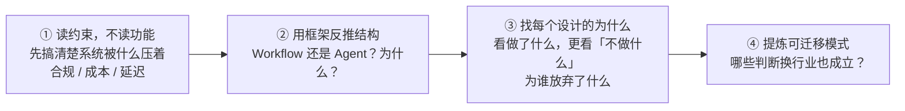
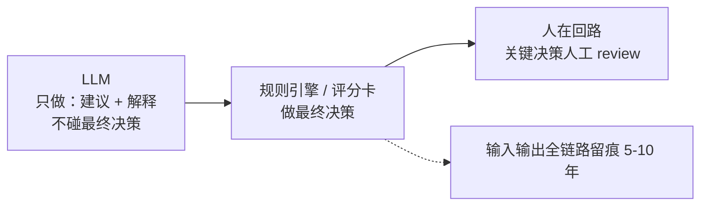
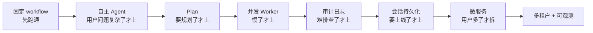

# 案例复盘——用决策框架解剖真实 Agent 系统

> **这份文档是什么**：架构师的进阶学习法——**不再看"怎么做"的教程，而是用 [11 的决策框架](./11-Agent系统设计决策框架.md) 解剖真实系统**，提取"为什么这么设计、能迁移什么"。本专题已经走到"理论 + 动手"，这一篇带你**从别人的系统里偷师**。
>
> 前置：[11-Agent系统设计决策框架](./11-Agent系统设计决策框架.md)。

---

## 0. 一句话

> **复盘 = 对任何一个真实 Agent 系统问四个问题：① 结构为什么这么选？② 五层各做了什么决策？③ 放弃了什么、为谁放弃？④ 换成你，会怎么设计？**
> 架构师看系统的眼光，不是"它用了什么技术"，而是"**每个设计背后压着哪个约束**"。

---

## 1. 复盘方法论（4 步）

**复盘 4 步**：



> **铁律**：真正体现架构水平的，往往是**"不做什么"**——那才是约束和权衡的痕迹。

---

## 2. 案例一：金融风控 Agent——风险压过一切

**原文**：[29-金融风控Agent](../../tutorials/spring-ai-2.0/29-金融风控Agent.md)（信贷审批 / 反欺诈 / 合规）

### 2.1 先读约束（复盘第①步）

这个系统被**监管合规**死死压着：信贷决策要求"可解释、可追溯、可干预"，AI Act 把信贷审批列为"高风险 AI"。

### 2.2 用框架反推结构（复盘第②步）

| 框架问题 | 它的答案 |
|---------|---------|
| **结构** | 表面是 Agent，骨子里是 **"Workflow + 人在回路"**——流程固定（审批/反欺诈/合规各一条线），LLM 只在节点内做"建议 + 解释"，不碰决策 |
| **五层·工具** | 只暴露**只读 / 建议类**工具，**不暴露**任何"执行"工具 |
| **五层·验证** | 用"人工 review 才能进业务流"当兜底评估 |
| **权衡** | **风险 > 准确率 > 成本 > 延迟**——宁可慢、宁可贵，也要可解释、可留痕 |

### 2.3 它的"不做什么"（复盘第③步）

```
❌ 不做：让 LLM 直接给出"批 / 不批"
✅ 做：LLM 给"建议 + 依据"，规则引擎 / 评分卡做最终决策
❌ 不做：全自动无人工
✅ 做：人在回路，关键决策人工 review
❌ 不做：不留痕
✅ 做：输入输出全链路留痕 5-10 年
```

**架构范式**（风险压过一切）：



**那 LLM 实际收到的是什么提示词？**（"建议 + 解释"，不是决策）：

```
# 任务
根据以下信贷申请信息，输出"审批建议"——最终决策由规则引擎做。
# 约束
- 只给建议和依据，不要直接给出"批 / 不批"结论
- 依据必须可追溯（引用具体数据字段）
- 禁止用种族 / 性别 / 宗教等敏感信息参与判断
# 输出
{"建议": "approve|review|reject", "依据": ["..."], "风险点": ["..."]}
```

> 看这个提示词：**约束写的是"别做什么"（不给结论、不碰敏感信息），输出契约是"建议 + 依据"而不是"决策"**——这就是"LLM 做建议，规则做决策"在提示词层面的落地。

### 2.4 可迁移模式（复盘第④步）

> **"LLM 做建议，规则做决策，人做复核"——这是所有高风险行业的架构范式**（金融 / 医疗 / 法律）。架构师接这类项目，第一件事不是选模型，是**搞清楚行业红线**。

---

## 3. 案例二：研究 Agent——从简单演进到生产级

**原文**：[34-研究Agent与知识库实战](../../tutorials/spring-ai-2.0/34-研究Agent与知识库实战.md)

### 3.1 先读约束（复盘第①步）

任务**开放**（研究什么问题用户说了算）、要**跨多种数据源**（网页 / 知识库）、要**多轮可追溯**。它是典型的"动态 + 复杂"。

### 3.2 用框架反推结构（复盘第②步）

| 框架问题 | 它的答案 |
|---------|---------|
| **结构** | 最终用 **Plan-Execute-Aggregate**——先规划、再多 Worker 并发调研、再聚合。**不是让 Agent 自由 ReAct 乱逛**，这正印证 [11 的决策树](./11-Agent系统设计决策框架.md)：动态 + 复杂 → Plan-Execute，而不是裸单 Agent |
| **演进方式** | 固定 workflow → 自主 Agent → Plan → 并发 → 审计日志 → 会话持久化 → 微服务 → 多租户 → 可观测。**每章都是"上一阶段出问题了才进下一阶段"** |
| **五层·记忆** | 会话持久化（ChatMemory 落库）——产品级必须"刷新不丢" |
| **五层·验证** | 结构化审计日志——流程可追溯，出问题能定位是哪一步 |

### 3.3 它的"演进哲学"（复盘第③步）

```
❌ 反模式：一上来就铺全架构（微服务 + 多租户 + 可观测……）
✅ 正模式：固定 workflow 先跑通 → 用户问题复杂了才上 Agent → 慢了才上并发
          → 难排查了才上审计日志 → 要上线了才上持久化 → 用户多了才拆服务
```

**演进路线**（每个组件都是被真实问题逼出来的）：



> 这是对 [11 的"先最简方案"](./11-Agent系统设计决策框架.md) 最完整的一次实战演示——**每一个新组件都是被一个真实问题逼出来的，不是被想象力提前造出来的**。

### 3.4 可迁移模式（复盘第④步）

> **演进式架构是架构师防"过度设计"的解药**。判断一个系统"够不够先进"，不看它用了多少组件，看**每个组件是否都有对应的问题**。

---

## 4. 案例三：你的练习——复盘你自己的系统

用上面 4 步，复盘 [35-管数分离实战](../../tutorials/spring-ai-2.0/35-管数分离实战-从Sinks到Kafka演进.md)，或你自己做过的一个 Agent 系统：

```
① 约束：这个系统被什么压着？（成本 / 合规 / 并发 / 用户数 / 可维护性）
② 结构：结构选对了吗？换成 Workflow / 单 Agent / 多 Agent 会怎样？
③ 取舍：它的"不做什么"是什么？为了哪个目标放弃了什么？
④ 迁移：这套设计换到别的业务，哪些成立？
```

> 写下来。**能写清楚"为什么这么设计"的人，才是架构师；只会说"用了什么框架"的，还是工程师。**

---

## 5. 理解检查

1. 复盘 4 步分别问什么？为什么第①步是"读约束"而不是"读功能"？
2. 金融风控为什么结构是"Workflow + 人在回路"，而不是自由 Agent？
3. 研究 Agent 从"固定 workflow"演进到"Plan-Execute"，触发它升级的那个"问题"是什么？
4. "演进式架构"和"过度设计"的分界线在哪？
5. 用 4 步复盘 35 号文档，它最关键的约束是什么？

---

## 6. 相关文档

- [11-Agent系统设计决策框架](./11-Agent系统设计决策框架.md) —— 本篇的分析工具
- [29-金融风控Agent](../../tutorials/spring-ai-2.0/29-金融风控Agent.md) —— 案例一（风险权衡 / 人在回路）
- [34-研究Agent与知识库实战](../../tutorials/spring-ai-2.0/34-研究Agent与知识库实战.md) —— 案例二（演进式架构 / Plan-Execute）
- [35-管数分离实战](../../tutorials/spring-ai-2.0/35-管数分离实战-从Sinks到Kafka演进.md) —— 你的练习
- 更多可解剖：[30-医疗问诊Agent](../../tutorials/spring-ai-2.0/30-医疗问诊Agent.md)、[31-法律咨询Agent](../../tutorials/spring-ai-2.0/31-法律咨询Agent.md)、[32-多源检索Agent](../../tutorials/spring-ai-2.0/32-多源检索Agent与MCP生态整合.md)

复盘不是终点。带着这套眼光回去重读 [10](./10-从入门到Agent架构师.md) 和 [11](./11-Agent系统设计决策框架.md)，你会看到之前没看到的东西——**这就是"越读越深"的架构师循环。**

下一篇：[13-Agent架构师面试与自测](./13-Agent架构师面试与自测.md)
