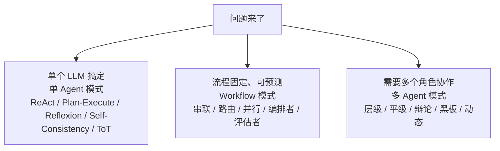

# Agent 架构模式全集——架构师的"模式字典"

> **这份文档是什么**：把所有 Agent 架构模式系统化收录成一本**字典**，分三层：**单 Agent 模式 / Workflow 模式 / 多 Agent 模式**，外加支撑架构。每个模式都写：一句话、结构、适用、何时不用、权衡、仓库里哪篇深挖。
> **怎么用**：要"选型"看 [11-决策框架](./11-Agent系统设计决策框架.md)；要"查某个模式是什么"来这里。模式是字典，不是小说——用到再查，别一次全背。
>
> 前置：[02-Agent是什么](./02-Agent是什么与核心心智模型.md) + [11-Agent系统设计决策框架](./11-Agent系统设计决策框架.md)。

---

## 0. 一句话

> **架构模式 = 解决"某一类结构问题"的命名方案。** 架构师的功力，一半在于**脑子里装着多少模式**，另一半在于**知道什么时候该用哪个、什么时候不该用**。

---

## 1. 三层结构总览（先记住这张图）

```
问题来了
  ├── 单个 LLM 搞定 → 单 Agent 模式（ReAct / Plan-Execute / Reflexion…）
  ├── 流程固定、可预测 → Workflow 模式（串联 / 路由 / 并行 / 编排者 / 评估者）
  └── 需要多个角色协作 → 多 Agent 模式（层级 / 平级 / 辩论 / 黑板 / 动态）
```

> 这正好对应 [11 的决策树](./11-Agent系统设计决策框架.md)：**动态 → 单 Agent；固定 → Workflow；复杂到单 Agent 扛不住 → 多 Agent**。

**三层结构总览**：



---

## 2. 单 Agent 模式（5 个）

### 2.1 ReAct（Reasoning + Acting）——最基础

```
Thought: 我需要查订单 → Action: 调工具 → Observation: 结果 → Thought: 再决策…
```

| 项 | 说明 |
|----|------|
| **适用** | 开放任务、需要动态决定"下一步用什么工具" |
| **何时不用** | 流程固定（用 Workflow）；单次调用能解决（别上循环） |
| **权衡** | 灵活，但可能绕圈 / 陷入局部最优；要配迭代上限 |
| **深挖** | [02 §1](./02-Agent是什么与核心心智模型.md)、[spring-ai-2.0/23 §7](../../tutorials/spring-ai-2.0/23-Prompt工程深入.md) |

### 2.2 Plan-and-Execute（先规划再执行）——长任务

```
Planner: 拆成 N 步 → Executor: 逐步执行 → Replanner: 看结果决定重规划 or 收尾
```

| 项 | 说明 |
|----|------|
| **适用** | 长流程、多步骤、要"先想清楚再动手"（研究、周报、多步骤查询） |
| **何时不用** | 短任务（规划成本 > 收益）；流程固定（用 Workflow） |
| **权衡** | 比 ReAct 有条理，但第一步规划错则全盘错，必须有 Replanner 纠偏 |
| **深挖** | [34 号研究 Agent](../../tutorials/spring-ai-2.0/34-研究Agent与知识库实战.md) 的 Plan-Execute-Aggregate、[spring-ai-2.0/10](../../tutorials/spring-ai-2.0/10-多Agent编排实战.md) |

### 2.3 Reflexion（自我反思）——高可靠

```
答一版 → 让模型挑毛病（critique）→ 带反思重写 → 直到"无问题"
```

| 项 | 说明 |
|----|------|
| **适用** | 写作、代码生成、离线高可靠场景 |
| **何时不用** | 实时对话（延迟翻倍）；开放式闲聊 |
| **权衡** | token 成本 ×2~3；换来的是"自我纠错" |
| **深挖** | [spring-ai-2.0/23 §5](../../tutorials/spring-ai-2.0/23-Prompt工程深入.md) |

### 2.4 Self-Consistency（多次采样投票）——有标准答案

```
同一问题跑 K 次 → 投票取多数 → 答案
```

| 项 | 说明 |
|----|------|
| **适用** | 有明确答案的任务（数学、抽取、分类） |
| **何时不用** | 开放式生成（没有"多数对"）；推理模型（内部已采样） |
| **权衡** | 成本 ×K；K=5 是性价比拐点 |
| **深挖** | [spring-ai-2.0/23 §4](../../tutorials/spring-ai-2.0/23-Prompt工程深入.md) |

### 2.5 ToT / LATS（树 / 图搜索）——最难推理

```
生成多个候选思路 → 逐个打分 → 剪枝 → 在最好的分支上继续展开
```

| 项 | 说明 |
|----|------|
| **适用** | 复杂规划、24 点、迷宫这类"有明确目标可评估"的问题 |
| **何时不用** | 绝大多数业务任务（成本高 10 倍，收益为零） |
| **权衡** | 效果上限最高，但**成本极高**；生产里几乎不用，是研究/竞赛向 |
| **深挖** | [spring-ai-2.0/23 §6](../../tutorials/spring-ai-2.0/23-Prompt工程深入.md) |

---

## 3. Workflow 模式（Anthropic 五模式）

> 出处：Anthropic [Building effective agents](https://www.anthropic.com/engineering/building-effective-agents)。**Workflow = 固定代码路径 + LLM 只负责其中某些节点**，适合"流程可预测"的任务。中文展开在 [spring-ai-2.0/11](../../tutorials/spring-ai-2.0/11-五大Workflow模式与代码评审助手.md)。

| 模式 | 结构一句话 | 适用 | 何时不用 |
|------|-----------|------|---------|
| **① 串联（Prompt Chaining）** | 上一步输出 → 下一步输入，N 个步骤串行 | 每步有明确产出、一步错会污染后续（先抽取 → 再生成 → 再格式化） | 一步能做完的（串联增加延迟） |
| **② 路由（Routing）** | 先分类输入，再分发给专门的 prompt / 工具 | 不同类型问题走不同专家路径（简单问题走快路径、复杂走深路径） | 类型单一（路由本身是浪费） |
| **③ 并行（Parallelization）** | 分两型：**分段**（不同子任务并行）+ **投票**（同一任务多次取多数） | 子任务独立可并行；或高准确率要求（投票） | 任务串行依赖（并行反而乱） |
| **④ 编排者-工人（Orchestrator-Workers）** | 中心 LLM 拆任务 → 派给多个 Worker → 汇总 | 任务可拆成多个独立子任务（文档多段分析） | 子任务强耦合（拆不动） |
| **⑤ 评估者-优化者（Evaluator-Optimizer）** | 生成 → 另一个 LLM 评估 → 不合格重写，循环 | 有清晰评估标准、迭代改质量高（文案、代码） | 没有客观评估标准（评估靠运气） |

---

## 4. 多 Agent 模式（5 个）

> 铁律（[02 §3.3](./02-Agent是什么与核心心智模型.md)）：**95% 场景一个 Agent 就够**。上多 Agent 前先问"一个 Agent 为什么不行"。深挖在 [spring-ai-2.0/10-多Agent编排实战](../../tutorials/spring-ai-2.0/10-多Agent编排实战.md)。

| 模式 | 结构一句话 | 适用 | 主要代价 |
|------|-----------|------|---------|
| **① 层级 / 监督者（Supervisor）** | 一个"领导" Agent 拆活、派活、收结果 | 任务可拆、需要统一指挥（项目调研） | 领导 Agent 是瓶颈（单点） |
| **② 平级协作（Collaborative）** | 多个专业 Agent 各干各的、共享结果 | 角色天然解耦（研究 + 写作 + 审查） | 协调成本高、结果难对齐 |
| **③ 辩论（Debate）** | 两个 Agent 互相挑错、迭代收敛 | 有争议的判断（评审、立场分析） | 可能空转 / 互相带偏 |
| **④ 黑板（Blackboard）** | 共享一块"黑板"，各 Agent 读写、接力 | 复杂问题分阶段求解、逐步逼近 | 状态管理复杂、难调试 |
| **⑤ 动态角色（Swarm）** | Agent 动态生成/委派新 Agent（非固定结构） | 探索性极强、角色事先不明 | 最不可控，生产慎用 |

---

## 5. 支撑架构（不是"模式"但必须懂）

| 支撑 | 解决什么 | 去哪学 |
|------|---------|--------|
| **RAG** | 给 Agent "查知识库"的工具 | [04](./04-RAG入门-让Agent查自己的知识库.md) |
| **Tool-use / Function Calling** | Agent "动手"的通道 | [08](./08-Agent开发的提示词实战.md) |
| **MCP** | 工具跨进程 / 跨系统标准化 | [05](./05-MCP入门-Agent怎么接外部工具生态.md) |
| **记忆架构** | 短期 / 长期 / 知识三类记忆 | [02 §2.1](./02-Agent是什么与核心心智模型.md)、[spring-ai-2.0/25](../../tutorials/spring-ai-2.0/25-Agent记忆架构.md) |

---

## 6. 怎么选模式（快速指引）

```
任务流程可预测吗？
├── 是 → Workflow（5 种：串联 / 路由 / 并行 / 编排者 / 评估者，按"依赖关系"选）
│         ├── 串行依赖 → 串联
│         ├── 输入要分类 → 路由
│         ├── 子任务独立 → 并行
│         ├── 能拆成多 Worker → 编排者-工人
│         └── 有评估标准可迭代 → 评估者-优化者
└── 否 → 单 Agent：
         ├── 短任务 → ReAct（或直接单次调用）
         ├── 长任务 → Plan-and-Execute
         ├── 高可靠离线 → Reflexion
         └── 有标准答案 → Self-Consistency
   单 Agent 扛不住？→ 先问"为什么"，再考虑多 Agent（层级 / 平级 / 辩论…）
```

> **选型口诀**：**能单次就不循环，能 Workflow 就不 Agent，能单 Agent 就不多 Agent，能用简单模式就别上复杂模式。**

**选型决策**：

```mermaid
flowchart TD
    Q{"任务流程可预测吗？"}
    Q -->|"是 → Workflow"| WF{"按依赖关系选"}
    WF -->|"串行依赖"| W1["串联"]
    WF -->|"输入要分类"| W2["路由"]
    WF -->|"子任务独立"| W3["并行"]
    WF -->|"能拆成多 Worker"| W4["编排者-工人"]
    WF -->|"有评估标准可迭代"| W5["评估者-优化者"]
    Q -->|"否 → 单 Agent"| SA{"按任务特点选"}
    SA -->|"短任务"| S1["ReAct（或直接单次调用）"]
    SA -->|"长任务"| S2["Plan-and-Execute"]
    SA -->|"高可靠离线"| S3["Reflexion"]
    SA -->|"有标准答案"| S4["Self-Consistency"]
    SA -.单 Agent 扛不住？先问"为什么".-> MA["多 Agent<br/>层级 / 平级 / 辩论 / 黑板 / 动态"]
```

---

## 7. 模式速查表（一页背完）

| 模式 | 一句话 | 成本 | 用在哪层 |
|------|--------|:---:|---------|
| ReAct | 想-做-观察循环 | 低-中 | 单 Agent |
| Plan-Execute | 先规划再执行 | 中 | 单 Agent |
| Reflexion | 反思后重写 | 高 | 单 Agent |
| Self-Consistency | 采样投票 | 高 | 单 Agent |
| ToT / LATS | 树搜索 + 剪枝 | 极高 | 单 Agent（研究向） |
| 串联 | 上步接下步 | 低 | Workflow |
| 路由 | 分类后分发 | 低 | Workflow |
| 并行 | 分段 / 投票 | 低-中 | Workflow |
| 编排者-工人 | 中心拆活派活 | 中 | Workflow |
| 评估者-优化者 | 生成-评估-重写 | 中-高 | Workflow |
| 层级 / 平级 / 辩论 / 黑板 / 动态 | 多 Agent 协作 | 高 | 多 Agent |

---

## 8. 每个模式的"提示词种子"（怎么用提示词触发）

选好模式后，怎么用提示词把它"叫出来"？下面是每种模式的提示词种子（骨架句式，不是完整版）：

| 模式 | 提示词种子（核心句式） |
|------|----------------------|
| **ReAct** | "按循环工作：先想需要什么信息，再调用工具，看到结果后决定下一步。" |
| **Plan-Execute** | "先输出完整计划（拆成 N 步），再逐步执行；结果不符预期就重新规划。" |
| **Reflexion** | "先给答案；再挑出其中的漏洞；带着反思重写一版。" |
| **Self-Consistency** | "用 K 种不同思路各解一遍，最后投票给多数答案。"（靠代码做 K 次采样） |
| **串联** | "把上一步的输出作为下一步的输入，不要跳过任何一步。" |
| **路由** | "先判断输入属于哪类，再走对应路径（简单 / 复杂）。" |
| **并行** | "把任务拆成 N 个互不依赖的子任务，并行完成，最后汇总。"（靠代码并行） |
| **编排者-工人** | "你是指挥：把任务拆给多个执行者，收集结果后汇总成最终输出。" |
| **评估者-优化者** | "先生成一版；再按标准评估；不合格就带着评估意见重写。" |
| **多 Agent 协作** | "你们是不同角色（研究 / 写作 / 审查），各司其职后汇总。"（靠框架编排） |

> 提示词只是**种子**，真正的模式要靠**代码编排**（循环 / 并行 / 分工）来实现——这正是 [11](./11-Agent系统设计决策框架.md) 说的"Workflow 用代码编排，LLM 只干其中某些步骤"。双框架完整案例见 [16](./16-框架提示词案例库.md)。

---

## 9. 理解检查

1. 单 Agent / Workflow / 多 Agent 三层，分别对应 [11](./11-Agent系统设计决策框架.md) 决策树的哪个分支？
2. 为什么"动态 + 长任务"通常选 Plan-Execute 而不是裸 ReAct？
3. Anthropic 五模式里，"评估者-优化者"和 Reflexion 的区别是什么？
4. 多 Agent 五模式的共同前提是什么（先答哪个问题）？
5. 用 §6 指引，给你 [09 的客服 Agent](./09-练手项目.md) 走一遍选型——它为什么是"单 Agent + 工具"而不是 Workflow？

---

## 10. 相关文档

- [11-Agent系统设计决策框架](./11-Agent系统设计决策框架.md) —— 怎么选（本篇是"有哪些"）
- [spring-ai-2.0/11-五大Workflow模式](../../tutorials/spring-ai-2.0/11-五大Workflow模式与代码评审助手.md) —— Workflow 五模式的代码实现
- [spring-ai-2.0/10-多Agent编排实战](../../tutorials/spring-ai-2.0/10-多Agent编排实战.md) —— 多 Agent 实现
- [spring-ai-2.0/23-Prompt工程深入](../../tutorials/spring-ai-2.0/23-Prompt工程深入.md) —— ReAct / Reflexion / ToT 的代码模板
- [34-研究Agent与知识库实战](../../tutorials/spring-ai-2.0/34-研究Agent与知识库实战.md) —— Plan-Execute-Aggregate 的完整实战
- Anthropic [Building effective agents](https://www.anthropic.com/engineering/building-effective-agents) —— Workflow 五模式 + 代理判据的权威出处

模式记完了，回 [11](./11-Agent系统设计决策框架.md) 用起来——**字典背得再多，不如写对一张架构图。**

下一篇：[16-框架提示词案例库](./16-框架提示词案例库.md)
