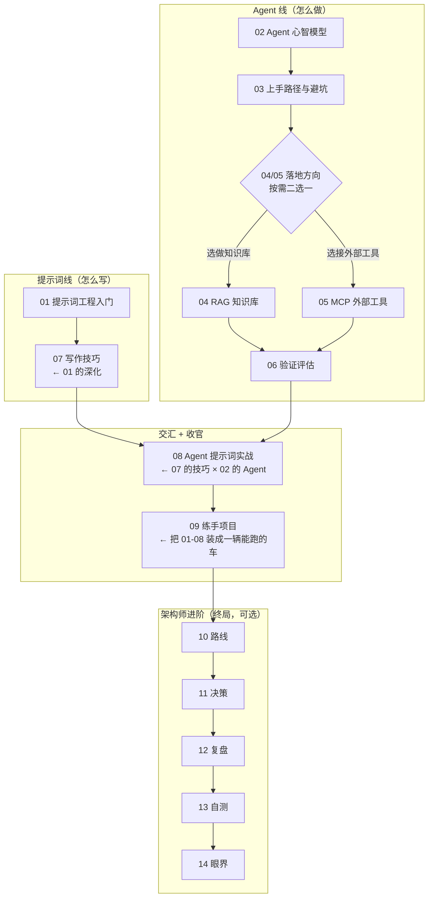

# Agent 与提示词工程专题（学习顺序）

本文件夹是**附录里第一个和大模型应用直接相关的专题**，解决初学者最常问的两个问题：**"我该不该学提示词工程？"** 和 **"Agent 是什么、我要不要学？"**

它是整个仓库 AI 资料的**入门入口**——只讲"心智模型 + 最少的必要知识"，把深入的内容（框架代码、生产化）留在入口里链到的那些文档里。

---

## 0. 学习逻辑（先看这条线，别把编号当顺序平读）

本专题按"两条主线 → 一条收官 → 一条架构师进阶"铺开：

**学习逻辑**：

- **先读**：01 → 02 → 03，建立"是什么 + 怎么开始"的完整认知。
- **按需**：04（RAG）/ 05（MCP）是 03 之后按落地方向二选一。
- **收尾**：06 评估，做完项目用它证明"确实好用"。
- **精进**：07 深化"怎么写"，**建议写了几条真实提示词后再回读**（有手感才吸收得了技巧）；08 在**开始给 Agent 写工具时必读**。
- **收官**：09 练手项目，**最后做**——把 01-08 的零件装成一个能跑、通过率 ≥80% 的客服 Agent，做完才真正"会用"。
- **架构师（目标为架构师者必读）**：10 是三阶段路线（会用 → 会设计 → 会架构）；11 是核心技能（需求 → 架构决策）；12 是案例复盘（解剖真实系统）；13 是面试自测（验证你在哪一步）；14 是前沿眼界。不是目标可以不读，但读完才知道"天有多高"。

---

## 1. 学习顺序表

| 阶段 | 文档 | 你将达到 |
|:---:|------|---------|
| **① 认知·先读** | [01 提示词工程入门](./01-提示词工程入门-现代范式.md) | 该不该学、2026 年的提示词工程、五要素、结构化输出——提示词的**结构** |
| **① 认知·先读** | [02 Agent 是什么](./02-Agent是什么与核心心智模型.md) | Agent 循环、何时该用、记忆与多 Agent——Agent 的**心智模型** |
| **② 动手** | [03 上手路径与避坑](./03-上手路径与避坑.md) | 七步路线 + 六大坑，知道从哪开始 |
| **② 动手·按需** | [04 RAG 入门](./04-RAG入门-让Agent查自己的知识库.md) | 方向①知识库：五步管道、什么时候用 RAG vs 微调 vs 长上下文 |
| **② 动手·按需** | [05 MCP 入门](./05-MCP入门-Agent怎么接外部工具生态.md) | 方向②外部工具：什么时候用 MCP、什么时候直接写 `@Tool` |
| **③ 验证·收尾** | [06 怎么评估一个 Agent](./06-怎么评估一个Agent.md) | 把"好不好用"从凭感觉变成通过率，两个维度 + 三种方法 |
| **④ 精进·回读** | [07 怎么写好提示词](./07-怎么写好提示词-实用技巧.md) | 七条写作硬技巧（具体 / 给例子 / 留退路 / 一次一变量）——01 的深化 |
| **④ 精进·回读** | [08 Agent 开发的提示词实战](./08-Agent开发的提示词实战.md) | 工具描述 + System Prompt 的决策规则 + 提示词注入——**写工具前必读**（07 × 02） |
| **④ 精进·回读** | [16 框架提示词案例库](./16-框架提示词案例库.md) | **配套案例库（用到时查）**：7 个场景现成可抄——提示词原文 + Spring AI / LangChain4j 双框架代码 |
| **⑤ 动手·收官** | [09 练手项目：从零做一个客服 Agent](./09-练手项目.md) | **最后做**：把 01-08 串成一辆车——3 个工具 + 决策规则 + 护栏 + 12 条评估集，目标通过率 ≥80% |
| **⑥ 架构师·进阶** | [10 从入门到 Agent 架构师](./10-从入门到Agent架构师.md) | 三阶段路线：会用 → 会设计 → 会架构，每阶段"掌握清单 + 路线图 + 收官项目" |
| **⑥ 架构师·进阶** | [11 Agent 系统设计决策框架](./11-Agent系统设计决策框架.md) | 架构师核心技能：需求 → 结构 → 五层设计 → 权衡与评审清单 |
| **⑥ 架构师·进阶** | [12 案例复盘：解剖真实 Agent 系统](./12-案例复盘.md) | 用决策框架解剖真实系统（金融风控 / 研究 Agent / 你自己的项目），提炼可迁移模式 |
| **⑥ 架构师·进阶** | [13 架构师面试与自测](./13-Agent架构师面试与自测.md) | 三阶段 24 题 + 3 加分题，自测你到哪一步了，也是面试准备 |
| **⑥ 架构师·进阶** | [14 Agent 前沿地图](./14-Agent前沿地图.md) | 四个方向：推理模型 / MCP 标准化 / 平台化 / 多 Agent 协议——保持敏感但不追新 |
| **⑥ 架构师·进阶** | [15 Agent 架构模式全集](./15-Agent架构模式全集.md) | **模式字典**：单 Agent 5 种 / Workflow 5 种 / 多 Agent 5 种 + 支撑架构，选型时来查 |

> **建议节奏**：01 直接回答"我该不该学"——**值得学，但学的重心不是"话术"，而是上下文工程和评估闭环**；02 建立 Agent 心智模型后再决定要不要深入；03 是路线图和避坑，动手前读一遍；**04 / 05 是两个最常见的落地方向**——做知识库客服读 04，接外部系统工具读 05；**06 评估是收尾**——做完项目用它证明"确实好用"；**07 在写了几条真实提示词后回读**，**08 在开始给 Agent 写工具时必读**；**09 是收官**——01-08 全读完动手做，做完才真正"会用"；**目标是 Agent 架构师的话，再走 10 → 14**——把"会做"升级成"会选 / 会扛"，最后用 13 自测水平、14 保持眼界。

---

## 2. 和仓库其他 AI 资料的关系（本专题讲"该学什么"，下面这些讲"怎么实现"）

| 你想深入的方向 | 去读 |
|--------------|------|
| 提示词的进阶模式（CoT / ReAct / ToT / Self-Consistency，带 Spring AI 代码） | [spring-ai-2.0/23-Prompt工程深入](../../tutorials/spring-ai-2.0/23-Prompt工程深入.md) |
| Agent 的原理级解读（范式演进、框架对比） | [reference/理论基础/03-Agent原理](../../reference/理论基础/03-Agent原理.md) |
| 用 Java 框架写 Agent：Tool 设计、防失控、多 Tool 编排、评估 | [tutorials/agent 全套](../../tutorials/agent/00-阶段总览.md) |
| Spring AI 2.0 的 Tool / AgentLoop、多 Agent、Workflow 模式 | [spring-ai-2.0 的 02/10/11 篇](../../tutorials/spring-ai-2.0/00-目录索引.md) |
| RAG：让 Agent 查知识库（工程化落地） | [spring-ai-2.0/09-RAG工程化实战](../../tutorials/spring-ai-2.0/09-RAG工程化实战.md)、[20-RAG高级篇](../../tutorials/spring-ai-2.0/20-RAG高级篇.md) |
| MCP：Agent 接外部工具生态（Client/Server/开发） | [spring-ai-2.0/05-06-07 MCP 三部曲](../../tutorials/spring-ai-2.0/05-MCP协议全解.md) |
| 评估：怎么知道 Agent 好不好用 | [tutorials/agent/06-评估与测试](../../tutorials/agent/06-评估与测试.md)、[spring-ai-2.0/12-评估闭环与Prompt版本管理](../../tutorials/spring-ai-2.0/12-评估闭环与Prompt版本管理.md)、[13-测试工程化](../../tutorials/spring-ai-2.0/13-测试工程化.md) |
| 架构师进阶（生产化 / 平台化 / 路线） | 见 [10-从入门到Agent架构师](./10-从入门到Agent架构师.md)；深资料：[reference/长期方向/13](../../reference/长期方向/13-架构师进阶.md)、[spring-ai-2.0/17/18/19/26](../../tutorials/spring-ai-2.0/17-AI原生系统设计.md)、[reference/生产化与运营](../../reference/生产化与运营/16-Agent可靠性工程Java视角.md) |
| Anthropic 官方 "Building effective agents"（Workflow vs Agent 权威判据） | 见 [03-上手路径与避坑](./03-上手路径与避坑.md) 的外部资源表 |
