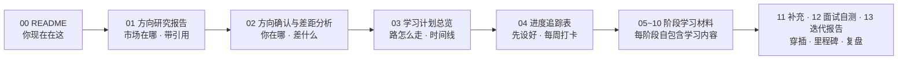
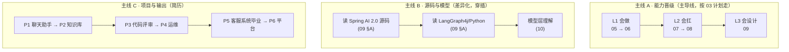
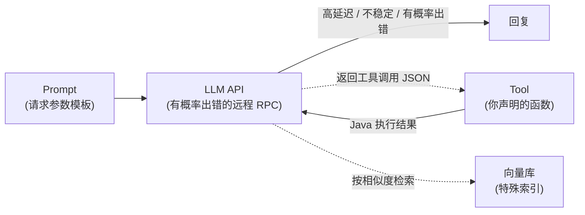

# Agent 架构师晋升路线（自包含学习专题）
> 📌 辅线定位：专为《理论/13-架构师进阶 与 教程/00-目录索引》补充架构师成长路线

> **这份专题做什么**：为一名 **1-3 年 Java 后端工程师**提供一条通往**全栈 AI Agent 架构师**的完整路线——从真实招聘市场倒推方向，再生成自包含的中文学习材料。
>
> **三个硬性设计原则**：
> 1. **市场锚定**：方向不是拍脑袋定的，是深度调研真实招聘信息（104 个研究 agent、24 个来源、17 条经三轮对抗式验证的结论）得出的。
> 2. **自包含**：本专题每份材料都能独立阅读，不依赖你仓库里的其他文档。
> 3. **验收可量化**：每个阶段都有"做出来 + 能量化"的验收标准，不做"看完就算会"。

---

## 1. 阅读顺序（按编号）

| 编号 | 文档 | 角色 | 什么时候看 |
|:---:|------|------|-----------|
| 00 | 专题 README | 索引 + 使用指南 | 现在 |
| 01 | 招聘市场深度研究报告 | 方向依据（带来源与置信度） | 开始前必读 |
| 02 | 方向确认与差距分析 | 你的现状 vs 目标的差距 | 开始前必读 |
| 03 | 学习计划总览 | 主控文档：阶段/时间线/验收 | **每天对照走** |
| 04 | 进度追踪表 | 每周打卡，把计划变成现实 | **每周** |
| 05 | 阶段 0-1 材料 | LLM 心智模型 + 应用基础 | 第 1-8 周 |
| 06 | 阶段 2 材料 | 评估方法论 + RAG | 第 9-14 周 |
| 07 | 阶段 3 材料 | Agent 循环 + Workflow + MCP | 第 15-24 周 |
| 08 | 阶段 4 材料 | 可观测 + 成本 + 安全 + 可靠 | 第 25-32 周 |
| 09 | 阶段 5-6 材料 | 源码精读 + 平台设计 | 第 15-44 周 |
| 10 | 阶段 7 材料 | 模型原理 + 选型 + 部署 | 穿插，持续 |
| 11 | 补充 · 低代码与国产模型平台 | 迭代发现的缺口补齐（Dify/MaxKB + 百炼/千帆） | 阶段 3 后穿插 |
| 12 | 求职面试自测 | L1/L2/L3 三级自测，求职前体检 | 里程碑达成后 |
| 13 | 迭代检查报告 | 往复检查、循环迭代的记录 | 复盘时 |

---

## 2. 三条主线（学习时保持并行）

- **主线 A**：按市场职级推进（AI 应用开发 → AI Agent 开发 → 架构师）。
- **主线 B**：贯穿的差异化——读源码（市场溢价硬门槛）+ 模型层理解（跟算法团队对话）。
- **主线 C**：每个阶段必须有可演示、可量化、可写进简历的项目。

---

## 3. 使用纪律

1. **每天**：对照 03 学习计划总览看今天的任务，做完勾选。
2. **每阶段**：先读该阶段的材料（05-10）→ 动手做项目 → 跑验收标准 → 才进下一阶段。
3. **任何改动带评估**：改 prompt / 换模型 / 调参数，必须跑评估集对比（没有评估 = 玄学）。
4. **每周输出**：1 篇笔记 + 5 次 Git 提交 + 记录卡点。
5. **自测**：每完成一个里程碑，用 13 迭代检查报告的检查项自测，查漏补缺。

---

## 4. 核心心智模型（一图记住）

> **把"模型推理"看作一个特殊的微服务**：高延迟、不稳定、有概率出错。

- **LLM = 有概率出错的远程 RPC**，你已有 Java 后端经验 → 约 80% 能力直接迁移（网关/缓存/限流/监控/降级 → AI 网关/语义缓存/护栏/Agent 追踪）。
- **Agent = `while(true){decide(); act(); observe();}`**——模型在循环里做决策。
- **框架是组合不是冠军**：入门 LangChain 系，主栈 Java（Spring AI 2.0），读得懂 Python 框架源码。

---

## 5. 专题完整性说明

本专题基于 2026-08 的招聘市场调研生成。市场变化快，数据是"时点值"（完整来源与置信度说明见本专题 01 方向研究报告第 8 节）。每个阶段的"高质量英文资料"清单给的是官方一手来源——**中文材料帮你建立认知，英文官方资料帮你保持更新**，两者配合使用。
