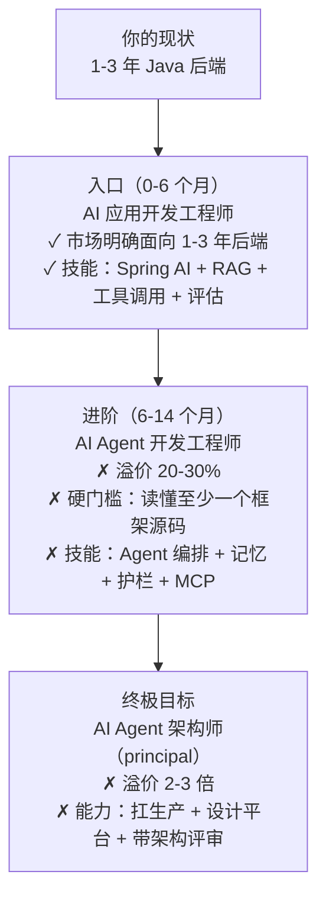

# 01 · AI Agent 工程师/架构师招聘市场深度研究报告

> **本报告做什么**：用真实招聘数据回答三个问题——① AI Agent 领域到底要什么人？② 各职级的技能栈和薪资真相是什么？③ 一个 1-3 年的 Java 后端工程师，最该往哪个方向走？
>
> **研究方法**：104 个研究 agent 并行搜索（全球需求 / 国内岗位与平台 / 薪资与职级 / Java 转行路径 / 反方现实校验 五个角度），抓取 24 个来源、提取 75 条可证伪结论，每条经 3 名对抗式核查员投票（≥2/3 否决才删除），最终 17 条确认、8 条被推翻。数据时间跨度 2025-09 至 2026-08，**市场变化快，所有数字是"时点值"而非永恒事实**。
>
> **诚信声明**：本报告明确区分「✅ 已确认」「❌ 被推翻」「⚠️ 未验证」。市场上有大量炒作性数据（比如"美国 AI Agent 工程师年薪 $10 万+""Python 出现率 95%""MCP 占据率 17-24%"），本报告**逐一核查并标记了哪些不可信**——宁可少给数字，不给你假数字。

---

## 1. 一句话结论

> **AI Agent 是真需求、真缺人、真高薪，但不是"提示词工程师"那个招法。**
> 市场要的是**智能体系统工程**（编排多组件 Agent、管理记忆与上下文、设计生产安全护栏），框架是多选组合而非单选冠军，国内对 1-3 年后端工程师开了一条明确的"AI 应用开发工程师"入口。**你的 Java 后端经验约 80% 可直接迁移**，但想吃"AI Agent 开发工程师"的溢价（20-30%），必须补一门硬功夫：**读透至少一个 Agent 框架的源码**。

---

## 2. 需求侧：市场要什么人（✅ 已确认）

### 2.1 需求真实且缺口巨大

| 数据点 | 数值 | 来源 | 置信度 |
|--------|------|------|--------|
| AI 工程岗位占所有技术岗位比例 | ~7%，同比 +63% | LinkedIn 经济图谱 2025-09 | 中 |
| AI 工程人才占 LinkedIn 成员比例 | **<1%**（严重供不应求） | 同上 | 中 |
| "AI Agents"技能标签增速 | 2025 年同比 **70 倍**，成为 AI 工程师第一热门技能（2023 年还不在榜） | LinkedIn 2025-09 | 中 |
| AI Agent 工程师岗数量 | 90 家公司数据集里有 90 个在招岗位（30 家公司），是真正新增的 AI 原生岗位之一 | Applied Methods 2026-04 | 高 |
| 增长最快的 AI 技能 | AI Literacy (+71%)、Azure AI Studio、**Spring AI**、Custom GPTs、Prompt Flow、LLMOps、AI Strategy | LinkedIn 2025-09 | 中 |

> **关键洞察**：连 **Spring AI** 都出现在"增长最快的 AI 技能"榜单里——Java 生态在 AI 应用层是有真实需求的，不是边缘地带。

### 2.2 "提示词工程师"这个岗位基本死了（✅ 已确认）

这是本报告最有价值的反直觉结论：

| 数据点 | 数值 | 来源 | 置信度 |
|--------|------|------|--------|
| 美国 90 家 AI 公司活跃"Prompt Engineer"岗 | **仅 3 个**（且都是 Anthropic） | Applied Methods 2026-04 | 高 |
| 德国 2023-2025 全部"Prompt Engineer"岗 | 仅 **130 条**，同期 IT 专家岗约 7 万条 | 德国 IW 研究所 2025-07 | 高 |
| 德国搜索端供需失衡 | 求职搜索量是招聘量的 **14 倍**（84:6 每百万） | 同上 | 高 |
| 但要求"提示词能力"的德国岗位 | **>2000 条**（作为技能，不是作为岗位） | 同上 | 高 |

> **结论**：提示词工程从"岗位"降级成了"技能"。JD 不再招"Prompt Engineer"，而是把提示词能力**内化到 AI Agent 工程师 / AI 应用工程师的岗位描述里**。所以你**不用**担心"提示词会不会被 AI 取代"——你要担心的是自己会不会只停留在"会写提示词"。会写提示词 = 入门，会做智能体系统 = 有市场价值。

### 2.3 AI Agent 工程师 JD 的真实内核（✅ 已确认）

Applied Methods 分析了真实 JD 后发现，AI Agent 工程师岗的核心技能是：

1. **编排多组件 Agent 系统**（orchestrating multi-component agent systems）
2. **实现 Agent 记忆与上下文管理**（为长时自主任务）
3. **设计生产环境 Agent 行为的安全机制/护栏**（guardrails）

> 提示词工程只是众多技能之一，**不是核心**。这直接决定你学习计划的权重分配——提示词（30% 精力）→ Agent 系统工程（70% 精力）。

### 2.4 框架真相：没有冠军，只有组合（✅ 已确认）

对 1,135 个 agentic engineering 岗位的分析（2026-03-31 至 05-22）：

| 框架 | 出现率 | 备注 |
|------|--------|------|
| **LangChain** | 34.5%（392/1135） | 最高，且**对初级最友好**（37.8% 的岗位是初中级，仅 16.1% 要求 lead+） |
| LangGraph | 22.6% | |
| LlamaIndex | 13.2% | |
| CrewAI | 9.3% | 从不单独出现 |
| AutoGen | 6.5% | 从不单独出现 |

- **平均每个岗位点名 2.31 个框架**——"框架们是互补的，不是互相替代的"。
- 最常见的组合是 **LangChain + LangGraph**（185 个岗位）。
- **LangChain 是你最合适的入门框架**：需求最高 + 对初级最友好。

> ⚠️ **注意**：这只是需求侧的框架画像。对 Java 工程师，市场还要看国内平台侧（见 §4）——国内 JD 明确点名**阿里百炼 / 百度千帆**等国产模型平台和 Dify/MaxKB 低代码平台。

---

## 3. 薪资与职级真相（分层看）

### 3.1 国内三档岗位（⚠️ 低置信度，方向性参考）

来源是一个 2026 Q1 的岗位市场分析（单篇博客，作者估算，**没有逐条引用 JD**，置信度低）。虽然数字不可作定论，但**三档结构**与多个来源交叉印证，方向可信：

| 岗位 | 初级 | 中级 | 高级 | 特点 |
|------|------|------|------|------|
| **AI 应用开发工程师** | 18-28K | 28-40K | 40-55K | **明确面向 1-3 年后端工程师转型 AI** |
| LLM 应用工程师 | 22-32K | 32-48K | 48-65K | 要求 2-5 年经验 + 深入理解 LLM 原理 |
| **AI Agent 开发工程师** | 25-35K | 35-55K | 55-75K | **溢价 20-30%，供不应求，要求读过至少一个框架源码** |

> **对你的意义**：1-3 年后端经验正好卡在"AI 应用开发工程师"的入口；但溢价和"架构师"进阶在"AI Agent 开发工程师"这一档——**读框架源码**是从"会用"到"吃溢价"的分水岭。

### 3.2 资深/架构师溢价（✅ 已确认）

- 有真实 AI 生产经验（Agent 系统、LLM 重度产品、AI 基础设施）的资深工程师，比同级非 AI 资深工程师**高 40-70%**。
- 顶尖的 AI 研究工程师 / **principal agent architect** 可拿到 **2-3 倍**同级溢价。

> ⚠️ 美国薪资数字（$100K-138K 之类）**全部被核查推翻**，本报告不采用。国际薪资没有可信数据。

### 3.3 已被推翻的薪资炒作（❌ 不要信）

| 被推翻的说法 | 来源 | 否决理由 |
|-------------|------|---------|
| 美国 AI Agent 入门年薪 $100K-138K | jobcannon.io | 3-0 全票否决（无一手数据） |
| Agentic AI 平均年薪 ~$197K、4.2 万岗位 | Forbes 转述 GoHumanize | 3-0 全票否决 |
| LLM 微调是最高薪 AI 专长 ~$208K | 同上 | 3-0 全票否决 |

---

## 4. 国内真实 JD 长什么样（✅ 已确认，一手 JD）

一份真实核验过的国内 JD（合肥大智慧财汇数据科技，上市公司大智慧子公司，2025-09-22 发布于合肥工业大学就业网，11-20K/月，二线城市水平）：

> **职位要求原文**："精通 LangChain/LlamaIndex 等 LLM 开发框架，了解**阿里百炼/百度千帆**等模型平台。基于 **Dify/MaxKB** 等低代码平台或 LangChain/LlamaIndex 等框架，构建与部署智能体（Agent）及自动化工作流……具备 **Prompt 工程、RAG、Agent 工作流构建**的实践经验，**有模型微调经验者优先**。"

**这份 JD 是市场需求的一个缩影，拆解出 6 个技能簇**：

| 技能簇 | 具体 | 说明 |
|--------|------|------|
| ① LLM 开发框架 | LangChain / LlamaIndex | 全球通用，国内也认 |
| ② 低代码平台 | Dify / MaxKB | 国内特色，企业快速搭 Agent 常用 |
| ③ 国产模型平台 | 阿里百炼 / 百度千帆 | 国内企业标配 |
| ④ Agent 工作流 | 自动化工作流构建 | 不是"聊天"，是"干活" |
| ⑤ RAG + Prompt | 检索增强 + 提示词工程 | 基础功 |
| ⑥ 微调 | 模型微调（优先） | 加分项，不是门槛 |

> **同款技能簇的佐证 JD**：清华电子系 AI 应用开发工程师（智能体方向）、昆仑芯资深算法工程师（agent platform）、中广数智智能体开发工程师、同方知网数科、拼多多/小红书 AI Agent 岗。

---

## 5. Java 后端工程师的迁移路径（✅ 已确认）

### 5.1 约 80% 的能力直接迁移

> 后端工程师的**网关、缓存、限流、监控、降级**经验，直接映射到 AI 侧的 **AI 网关、模型路由/降级、语义缓存、护栏、Agent 追踪**。这不是"转行"，是"换了一层调用目标"。

| 你的 Java 后端能力 | 映射到 AI Agent 侧 |
|-------------------|-------------------|
| 网关/反向代理 | AI Gateway（模型统一入口、限流、计费） |
| 缓存（Redis） | 语义缓存 / Prompt Cache / 记忆存储 |
| 限流/熔断 | 护栏、模型路由降级、成本预算 |
| 监控/可观测 | Agent 追踪、token 计费、失败率告警 |
| 分布式事务/状态机 | Agent 运行时状态机、工作流编排 |
| 接口设计 | Tool/Function Calling 定义 |

### 5.2 Java 原生技术栈（✅ 已确认推荐）

腾讯云 2026 转型指南明确推荐 Java 工程师的 AI 栈：

- **Spring AI / Spring AI Alibaba / LangChain4j** —— LLM 集成
- **PostgreSQL + pgvector** —— 向量存储（通过 Spring AI VectorStore 接口隔离）
- 深挖框架源码时，可以读 **LangGraph4j**（Java 版）

### 5.3 ⚠️ 未验证的关键问题（诚实说明）

研究有 4 个明确缺口，其中**第一个对你是决定性的**：

1. **Java 在国内 AI Agent 岗位里的语言需求占比，没有可信数据**。一条被推翻的分析声称"Java 不在 top 语言关键词里（Go/TypeScript 出现）"，但这条**不可信**（3-0 否决）。**真实情况未知**——既可能被忽视，也可能恰恰因为 Java 人才稀缺而溢价。
2. **架构师（architect）级别的 JD 具体要什么，没有核验到一手数据**（所有核验到的 JD 都是工程师级）。
3. 国际薪资带无可信数据。
4. MCP 的真实占据率无法量化（炒作多、数据少）。

> **策略启示**：既然"Java 占比"和"架构师要求"是未知的，你的学习计划就要做**两面下注**——主栈用 Java（你的差异化），但**读得懂 Python 框架源码**（市场主流，且读源码是溢价硬门槛）。这正是第 03 份文档的学习计划设计逻辑。

---

## 6. 反方校验：AI 岗位的"广告 vs 现实"（✅ 已确认）

> 求职者常被 JD 吓到或骗到。Alexey Grigorev 的《AI Engineering Field Guide》指出：**JD 里的技能列表描述的是"雄心"，不是"日常工作"**。

- 有工程师实际经历：**JD 写着"RAG 和 embeddings"，实际工作约 80% 是提示词工程 + 胶水代码 + 监控**。
- 但注意：这是"工程师岗的现实"，**不是"架构师岗的现实"**。架构师正是那个把"80% 胶水"系统化、产品化的人——**这就是你的目标位置**。

---

## 7. 研究结论：对你（1-3 年 Java 后端）的方向指引

综合所有已确认数据，方向结论如下：

**三条不能动摇的方向红线**（每一条都有研究数据支撑）：

1. **提示词工程是技能不是岗位** → 不要花大把时间研究"话术"，把精力投到 Agent 系统工程。
2. **框架是组合不是冠军** → 入门盯 LangChain（对初级最友好 + 需求最高），但语言栈用 Java 主栈，Python 只用来读框架源码。
3. **读源码是溢价分水岭** → "AI Agent 开发工程师"比"AI 应用开发工程师"贵 20-30%，核心差异就是"至少读过一个框架源码"。**框架源码深度 = 你的差异化护城河**。

---

## 8. 完整来源清单

| # | 来源 | 类型 | 用途 |
|---|------|------|------|
| 1 | [Applied Methods — What the AI Job Market Actually Created](https://www.appliedmethods.ai/signals/what-the-ai-job-market-actually-created) | 一手分析（90 家公司 8652 个岗位） | Prompt Engineer 之死、Agent 工程师 JD 内核、90 岗数据 |
| 2 | [LinkedIn Economic Graph — AI Labor Market Update (2025-09)](https://economicgraph.linkedin.com/content/dam/me/economicgraph/en-us/PDF/ai-labor-market-update-header-sept-2025.pdf) | 一手 | 7% 占比、<1% 人才、AI Agents 技能增速 70x、Spring AI 上榜 |
| 3 | [agentic-engineering-jobs.com — 1,135 岗位框架分析 (2026)](https://agentic-engineering-jobs.com/ai-agent-frameworks-job-market-2026) | 二手数据分析 | LangChain 34.5%、平均 2.31 框架、LangChain 对初级最友好 |
| 4 | [德国 IW Kurzbericht 57/2025 — Prompt Engineer](https://www.iwkoeln.de/fileadmin/user_upload/Studien/Kurzberichte/PDF/2025/IW-Kurzbericht_2025-Prompt-Engineer.pdf) | 一手研究报告 | 德国 130 条 vs 7 万、14 倍供需失衡 |
| 5 | 合肥大智慧财汇 JD（合肥工大就业网 id=2607166，多源镜像核验） | 一手 JD | 国内技能簇 6 项 |
| 6 | [learn-nanobot 岗位市场分析 (2026 Q1)](https://github.com/Bastioned-successor320/learn-nanobot/blob/main/docs/14-job-market-analysis/README.md) | 博客（低置信度） | 国内三档岗位薪资结构（方向性） |
| 7 | [aimagicx.com — Bifurcated AI Job Market (2026 Q1)](https://www.aimagicx.com/blog/bifurcated-ai-job-market-senior-engineer-premium-2026) | 博客 | 资深 AI 工程师溢价 40-70% |
| 8 | [腾讯云 — Java/Go 程序员 AI 应用转型指南 (2026)](https://cloud.tencent.cn/developer/article/2640343) | 博客 | Java 原生 AI 栈推荐 |
| 9 | [Alexey Grigorev — AI Engineering Field Guide: Reality vs Postings](https://github.com/alexeygrigorev/ai-engineering-field-guide/blob/main/role/05-reality-vs-postings.md) | 博客 | JD 广告 vs 现实 |
| 10 | [Nowcoder 讨论 — 后端转 AI Agent 80% 迁移](https://api-cdn.nowcoder.com/discuss/894135696464592896) | 论坛 | 80% 能力迁移映射 |

**被推翻、不可引用的来源**（8 条）：jobcannon.io 美国薪资、Forbes/GoHumanize 高薪盘点、agenticcareers.co 的"LangGraph/AutoGen 标准"与"RAG 必备"、learn-nanobot 的 Python 95% 关键词分析、MCP 占据率 17-24% 等。

---

## 8.5 第二轮研究补充（2026-08，闭合 §5.3 的未解问题）

> 第一轮研究留下 4 个未解问题。第二轮定向研究（约 112 条可证伪结论，对抗式验证中 66 确认 / 5 推翻）闭合了其中 3 个。以下结论均为已验证事实（部分经 GitHub API / 官方仓库一手核验），**和第一轮的"✅/❌"标注同级**。

### 8.5.1 ① Java 在国内 AI 生态的真实定位（此前未知）→ 已部分闭合

**已验证：Java 的 AI 生态在国内真实且活跃**：

| 事实 | 证据 | 置信度 |
|------|------|--------|
| 阿里官方 Java 智能体框架 `spring-ai-alibaba` 活跃维护 | GitHub 10,518 stars / 2,344 forks，支持百炼 DashScope + DeepSeek，自称阿里内部生产使用 | 高（GitHub API 核验） |
| Spring 官方 `spring-ai` 面向企业 Java 栈 | 主语言 Java，v2.0.0 于 2026-06-12 发布（Spring Boot 4.x），支持 DeepSeek | 高（官方仓库核验） |
| `langchain4j` 活跃维护 | 最后 push 2026-07-31，Apache-2.0，支持通义/DashScope，Spring Boot 一等集成 | 高（官方仓库核验） |
| 国内 Java 全栈 AI 课程体系存在 | Spring AI + LangChain4j + RAG + PgVector + Tool Calling + SSE + MCP 一等模块；2,583-star 的 Java ReAct Agent 教学项目 | 中-高 |
| MCP 在 Java 生态是一等公民 | spring-ai / langchain4j / spring-ai-alibaba 全部一等支持 MCP（STDIO/SSE/Streamable-HTTP） | 高 |

**必须诚实标注的边界**（综合报告明确强调，这些边界和结论同等重要）：

| 限制 | 说明 |
|------|------|
| **供应侧 ≠ 需求侧** | 上面全部是"工具生态存在"（supply-side）证据——工具存在是岗位需求的前提，**但不是岗位需求的证明** |
| 无中国 JD 级 Java/Python 占比数据 | SO 2025 调查中国样本仅 255 人（约 0.72%），**全球数据不能外推中国 JD 市场**；要真正确认需中国招聘平台数据（本轮未获取） |
| 全球 AI 开发 Python 占优 | SO 2025 **全部受访者**：Python 57.85% vs Java 29.4%（一手核验）。（注意：曾被引用的"AI 用者中 Python 56.1% vs Java 30.2%"这条细分数据**已被对抗式验证推翻**，勿引用） |
| 轶事信号（n=2，中等置信） | 中国确有 Java AI 教学（2,583-star 的 yu-ai-agent，Java 21 + Spring AI + LangChain4j，但带课程营销性质）；但一位深圳"Agent 应用架构师"的组合里**实际 Agent 项目全是 Python/Go**——"Java 被教、被声称，实际构建倾向 Python/Go" |
| 有反例（1-star 个人路线图） | 一位"大模型架构师"55 周路线图完全不用 Java（C/Python/C++）——但其定义含嵌入式固件，属个人主观路线，**不代表市场** |

**对你（Java 工程师）的策略含义**（结论不变，但依据更扎实了）：
- Java 走 AI 这条路**不是没市场，而是"供应侧扎实、需求侧未证实"**——阿里官方专门为 Java 企业做智能体框架（spring-ai-alibaba 已发 Maven Central v1.1.2.x、JDK 17+、企业级平台工具），说明**企业 Java 的 AI 化是一条被认真投入的路径**（可能偏政企/治理/安全场景）。
- **护城河 = Java 企业级 + Agent 系统工程 + 读得懂 Python 源码**。既然"实际 Agent 构建倾向 Python/Go"是轶事信号，**读得懂 Python 源码 + 能用 Python 做实验**就不是可选项而是必选项。继续"两面下注"策略，不变。

### 8.5.2 ② 架构师级角色的真实要求（此前无一手 JD）→ 方向性闭合

- 全球：SO 2025 **新增"Architect, software or solutions"为独立角色类别，且排名第 4（6.1%）**——架构师是市场承认的独立层级，不是虚名。
- 中国：实践者自述"Agent 应用架构师"的工作范围 = **生产级 Agent Runtime（Runtime / Tool Hub / Memory/State / MCP / Skill / 多智能体）**——与我们的 L3 架构师定义（[02 §3](./02-方向确认与差距分析.md) 的 L3/L4）**完全吻合**。
- 诚实标注：**仍无一手架构师 JD 的逐条技能清单，也无"架构师 vs 高级工程师"的岗位级证据**（缺口保留）。但"架构师是独立层级"已被市场承认（SO 2025 新增角色类别），"架构师做什么"已被真实实践者定义——**学习计划里 L3 的方向是对的**，等你有真实架构师 JD 时再逐条对齐。

### 8.5.3 ③ MCP 是真实需求还是炒作（此前无法量化）→ 已闭合

- **SO 2025 调查：约 34% 的 AI Agent 开发者实际使用 MCP**——不是营销，是已规模化的真实工具。
- Java 三大框架（spring-ai / langchain4j / spring-ai-alibaba）全部一等支持 MCP（STDIO/SSE/Streamable-HTTP）。
- **诚实标注两点**：①"岗位必选"地位未在 JD 层面证实（MCP 的热度很大程度在厂商文档/教程/营销里）；② **AI Agent 本身尚未主流**（仅约 14% 开发者日常使用）——别高估"非上 MCP 不可"的紧迫性，但 MCP 作为工具生态主线仍然值得投入（学习计划阶段 3/5 的 MCP 主线成立）。

### 8.5.4 ④ 国际薪资（仍无可信数据）→ 缺口保持

- 不猜测、不估计。求职时以你所在城市真实 JD 为准（见 [13 迭代检查报告 §6](./13-迭代检查报告.md) 的复核动作）。

---

## 9. 下一份文档

这份报告回答了"市场在哪里"。接下来 **02 方向确认与差距分析**回答"你（结合你仓库里已有的学习资料）现在在哪、差在哪、往哪个方向走"。
