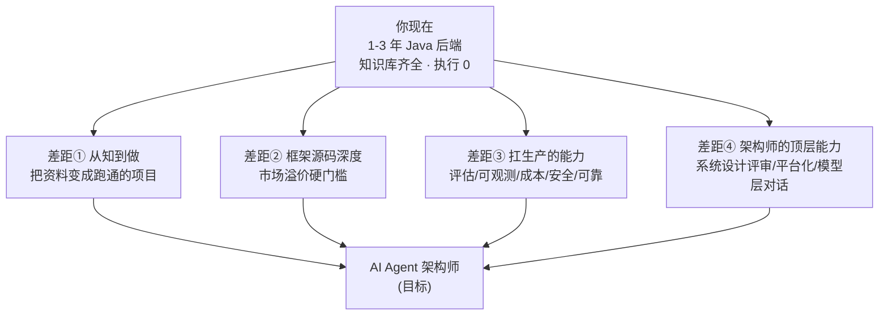
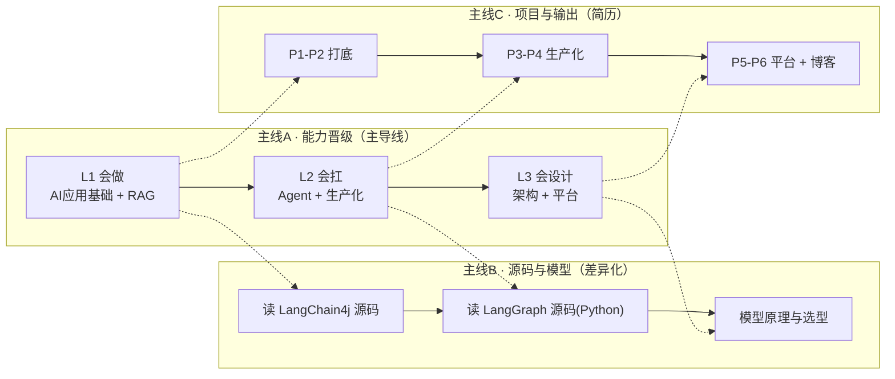

# 02 · 方向确认与差距分析

> **本份做什么**：把 01 方向研究报告的市场结论，套到"你"这个具体的人身上，回答三个问题——① 方向定没定？② 你现在在哪？③ 离"非常厉害的 AI Agent 架构师甚至更高"差什么？
>
> **依据**：你的背景（1-3 年 Java 后端、每周 10-20 小时、要中文材料）+ 本仓库已有的学习资料盘点 + 招聘市场研究。

---

## 0. 一句话结论

> **方向定了：走"Java 主栈 + 读得懂 Python 框架源码 + 扛得住生产"的全栈 AI Agent 架构师路线。**
> 你现在**不缺资料、缺执行**——仓库里已有大量高质量内容（计划、教程、项目文档），但执行进度是 0。真正的差距不是"学什么"，而是"从学到做"和"从做到扛"。

---

## 1. 方向确认：三重证据指向同一方向

### 证据 A：市场（来自 01 报告）

- 需求端要的是**智能体系统工程**，不是提示词；框架是组合，LangChain 最友好；国内 JD 认 LangChain + 国产平台 + Dify。
- 1-3 年后端有明确入口（AI 应用开发工程师）；溢价在"读得懂框架源码"的 AI Agent 工程师。

### 证据 B：你的目标

你选择了"**全栈 AI Agent 架构师**"——即从应用层到平台层都掌握，最终能设计企业级 Agent 系统。这与市场的"principal agent architect 溢价 2-3 倍"完全吻合。

### 证据 C：你的仓库现状（诚实盘点）

| 你已有的 | 覆盖程度 | 缺什么 |
|---------|---------|--------|
| 学习计划（docs/plan，8 阶段 P1-P6） | 结构完整，**执行进度 0** | 时间线没有真正走起来 |
| Agent 专题（16 篇，含 L1/L2/L3 架构师路线） | 概念层覆盖好 | 没有对应"读完"的动手验证 |
| Spring AI 2.0 教程（39 篇） | **深度已达应用层架构师** | 全停在文档，代码是否落地未知 |
| web-claude 项目（Claude Code 风格） | 真实做过 Agent 系统 | 需要总结成简历级成果 |
| ai-serving 文档（网关/向量库/多租户） | 平台层有雏形 | 需要工程化落地 |

> **核心判断**：你的知识体系其实已经覆盖了"AI 应用架构师"的广度（RAG、Agent、MCP、评估、可观测、平台全都有文档）。**瓶颈不是知道，而是做过和扛过。** 架构师 = 会设计 + 会决策 + 会扛生产，前两个你有资料，第三个必须靠动手项目练出来。

---

## 2. 差距分析：从"现在"到"非常厉害的架构师甚至更高"

按四条差距线拆解。每条都对应学习计划里的一个阶段或一条长期主线。

### 差距① 从知到做：知识 → 项目（最优先）

**现状**：计划写了 8 阶段、P1-P6 六个项目，进度表全是 ⬜。
**差距**：没有"能演示、能讲清楚、能量化指标"的项目成果。
**为什么最优先**：JD 和市场认可的是"做过"，不是"学过"。简历上写"完成过企业级客服 Agent，faithfulness 0.87，QPS 50" 比写"看过 39 篇教程"值钱 100 倍。

### 差距② 框架源码深度：会用 → 读透

**现状**：你文档里用的是 Spring AI + LangChain4j，但没有证据表明读过框架源码。
**差距**：市场溢价分水岭——AI Agent 工程师要求"至少读过一个框架源码"。
**具体差距**：
- 没读过 `ChatClient` / `ToolCallingAdvisor` / Agent Loop 的源码实现
- 没读过 LangGraph（Python）或 LangGraph4j 的状态机实现
- 没读过 MCP 协议的 Java SDK 实现

### 差距③ 扛生产的能力：demo → 生产

**现状**：文档里写了评估、可观测、成本、安全、可靠性的理论。
**差距**：没有"能扛住生产"的实证：
- 没有自己的评估集 + 评估闭环进 CI
- 没有真实的 token 成本监控与预算治理
- 没有 Prompt Injection 的红队测试记录
- 没有 SLO / 熔断 / 幂等的压测数据

### 差距④ 架构师顶层能力：会用/扛住 → 会设计/会评审

**现状**：参考文档里有"架构师进阶"内容。
**差距**：
- 没有面对需求 → 30 分钟出架构选型的实战训练
- 没有给别人的系统做过架构评审
- 没有设计过 Agent 平台（多租户、计费、网关、观测一体的平台）
- 没有跟算法/模型团队对话的能力（模型层理解）

---

## 3. "非常厉害甚至更高"怎么定义

我们把它拆成**四级可验证的里程碑**（每个都有验收标准，不是口号）：

| 级别 | 你是谁 | 可验证标志 |
|:---:|--------|-----------|
| **L1 会做** | AI 应用开发工程师 | 独立完成 1 个带 RAG + 工具 + 评估的 Agent 项目，有量化指标，能讲清设计 |
| **L2 会扛** | AI Agent 开发工程师 | 项目能上生产：评估闭环 + 可观测 + 成本治理 + 安全护栏 + SLO，读过框架源码 |
| **L3 会设计** | AI Agent 架构师 | 面对需求 30 分钟出选型与权衡；能给陌生系统做架构评审；能设计 Agent 平台 |
| **L4 会引领** | 主架构师 / 团队技术负责人 | 有真实落地的大规模 Agent 系统；带团队建立规范；在行业有输出（博客/开源/演讲） |

> **"甚至更高"** = L4 + 模型层理解（能跟算法团队对话）+ 开源影响力。这是 2-3 年的长期目标，学习计划只规划到 L3 的路线，L4 是持续积累。

---

## 4. 学习计划的设计逻辑（三条主线）

基于以上差距，学习计划（本专题 03 学习计划总览）采用**三条主线并行推进**：

- **主线 A**：按市场职级（应用开发 → Agent 开发 → 架构师）推进能力。
- **主线 B**：贯穿始终的差异化——读框架源码（Java 版为主，Python 版为辅）+ 模型层理解，这是溢价和架构师对话能力的来源。
- **主线 C**：所有阶段必须有可演示、可量化、可写进简历的项目产出。

---

## 5. 关键决策记录（这些决策改变了学习方向）

| # | 决策 | 依据 | 影响 |
|---|------|------|------|
| 1 | **不学"独立提示词工程"**，提示词作为技能穿插 | 市场已证明 Prompt Engineer 岗位消失（01 §2.2） | 省下大块时间投给 Agent 系统工程 |
| 2 | **主栈 Java（Spring AI 2.0）**，但必须读得懂 Python 框架源码 | Java 占比未知但 Spring AI 上榜热门技能；读源码是溢价硬门槛 | 语言学习策略：主写 Java，副读 Python 源码 |
| 3 | **入门框架看 LangChain 系**（LangChain4j → LangGraph4j），不押注冷门框架 | LangChain 需求最高且对初级最友好（01 §2.4） | 框架学习顺序确定 |
| 4 | **每个阶段必须有量化验收**，不做"看完就算会" | 你的差距①：从知到做 | 计划全部改为"做出来 + 能量化" |
| 5 | **读源码从自己用的框架开始**，不直接从 LangGraph 论文读起 | 架构师对话能力需要源码级理解，但要从熟悉的开始 | 主线 B 的顺序 |
| 6 | **评估方法论前置**到 RAG 之前 | LLM 应用没有评估 = 玄学，所有改动要量化 | 阶段顺序微调（与现有仓库 plan 一致） |

---

## 6. 下一份文档

方向已定、差距已明。下一步是 **03 学习计划总览**——把差距翻译成一条有时间线、有里程碑、有验收标准的学习路线。
