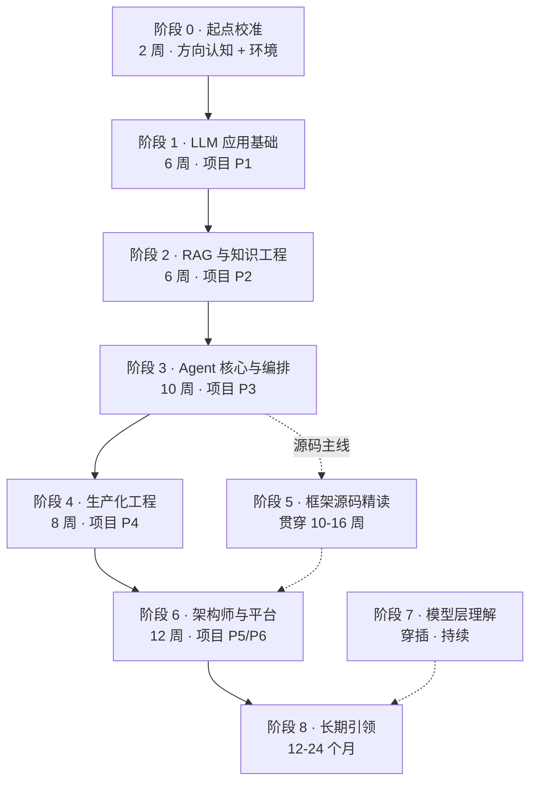
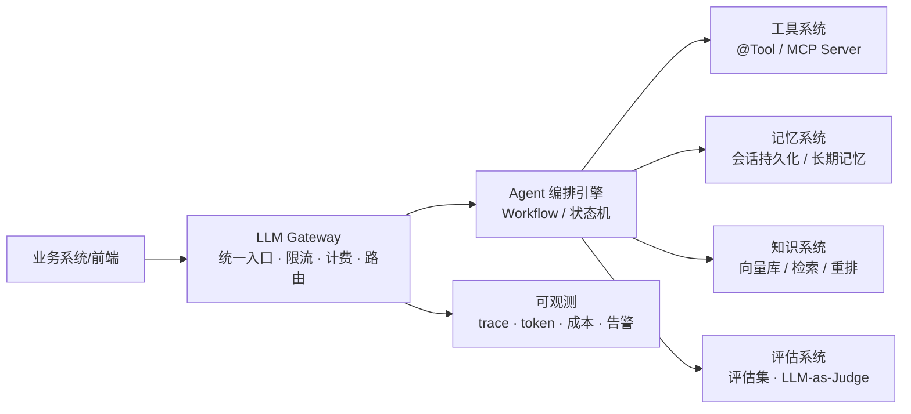

# 03 · 学习计划总览——从 Java 初级到全栈 AI Agent 架构师

> **本份是什么**：把 02 方向确认与差距分析的差距分析翻译成一条**有时间线、有里程碑、有验收标准**的学习路线。它是整个专题的"主控文档"——每一阶段的详细自包含学习材料，对应专题里的 05-10。
>
> **你的约束**：1-3 年 Java 后端、每周 **10-20 小时**（按 15h 平均估算）、需要中文自包含材料、最终目标"非常厉害的 AI Agent 架构师甚至更高"。
>
> **总时长**：到 **L3 架构师**约 **11-12 个月**；到 L4 引领级 2 年以上（见 02 方向确认与差距分析 §3 的四级里程碑）。

---

## 0. 学习纪律（每周必须）

1. **每周 5-7 次 Git 提交**（功能分支），commit message 写清"做了什么、为什么"
2. **每周 1 篇 300 字以上笔记**，记录"我学会了什么 / 卡在哪 / 怎么解决的"
3. **所有改动都带评估**：改 prompt / 换模型 / 调参数，必须跑评估集对比，不评估不算完成
4. **每个项目必须产出可演示成果**：能跑 + 能量化（指标 / QPS / 成本）+ 能讲清设计
5. **不跳阶段**：前一阶段验收没通过，不进入下一阶段

---

## 1. 总览图

**里程碑对应**（与 02 方向确认与差距分析 §3 对齐）：

| 时间线 | 你的级别 | 市场对应岗位 |
|--------|---------|-------------|
| 第 1-14 周 | L1 会做 | AI 应用开发工程师 |
| 第 15-32 周 | L2 会扛 | AI Agent 开发工程师 |
| 第 33-44 周 | L3 会设计 | AI Agent 架构师 |
| 12-24 个月 | L4 会引领 | 主架构师 / 负责人 |

---

## 2. 阶段一览表

| # | 阶段 | 周数 | 项目 | 核心内容 | 验收标志（可量化） |
|---|------|:---:|------|---------|------------------|
| 0 | 起点校准 | 2 | - | 方向认知、环境、LLM 心智模型 | 第一次调通 LLM + 3 个心智模型问答 |
| 1 | LLM 应用基础 | 6 | P1 | Prompt 技能、Tool、结构化输出、流式 | P1 跑通 + 工具调用成功 + 结构化输出解析 |
| 2 | RAG 与知识工程 | 6 | P2 | 评估前置、分块、检索、重排、向量库 | 30+ 评估集 + Recall@5 + faithfulness |
| 3 | Agent 核心与编排 | 10 | P3 | Agent Loop、5 大 Workflow、MCP、多 Agent | 5 大模式各 1 demo + 三重保护 + 评估基线 |
| 4 | 生产化工程 | 8 | P4 | 可观测、成本、安全、可靠、评估进 CI | SLO + 观测栈 + 成本治理 + 压测通过 |
| 5 | 框架源码精读 | 贯穿 10-16 | - | LangChain4j / Spring AI 2.0 / LangGraph4j | 源码精读笔记 + 复刻最小版本 |
| 6 | 架构师与平台 | 12 | P5/P6 | Gateway、平台、自研边界、系统设计评审 | 毕业标准（faithfulness>0.85 + 博客 + 3 指标） |
| 7 | 模型层理解 | 穿插 | - | Transformer、推理模型、微调、量化、选型 | 能选模型 + 能部署 + 能跟算法团队对话 |
| 8 | 长期引领 | 12-24 个月 | - | 开源、博客、面试、评审影响力 | L4 级验证标志 |

---

## 3. 阶段 0：起点校准（第 1-2 周）

### 目标
建立方向认知 + 跑通环境 + 建立 LLM 心智模型。

### 任务
- [ ] 读本专题 01（方向研究报告）、02（差距分析），明确自己为什么走这条路
- [ ] 环境确认：JDK 21 / Maven 3.9+ / Spring AI 2.0 依赖（仓库已有基础，核实能编译）
- [ ] 模型服务：选 DeepSeek API（付费）或本地模型（LM Studio），curl 调通一次
- [ ] 用一次真实对话验证 LLM 心智模型：
  - [ ] temperature=0 vs 1 的输出差异
  - [ ] 观察一次 Function Calling 返回的 JSON
  - [ ] 观察流式输出（SSE）的 token 到达

### 自包含核心知识（本阶段要懂的 6 个概念）
1. **Token**：模型的计费与长度单位。1 token ≈ 0.75 英文单词 ≈ 0.5 汉字。
2. **上下文窗口**：一次请求能塞进的最大 token 数（输入 + 输出）。窗口外的历史记不住 → 需要记忆系统。
3. **Temperature / Top-p**：控制输出的随机性。temp=0 接近确定，temp=1 更发散。但 **temp=0 时输出仍可能变化**（浮点不确定性 + top-p 采样）。
4. **三种角色（System/User/Assistant）**：System 定规则与人格，User 是提问，Assistant 是回答/工具调用。
5. **Embedding**：把文本变成向量（768/1024/1536 维），语义相近的向量距离近 → RAG 的基石。
6. **Function Calling**：模型输出结构化 JSON 声明"我要调用哪个函数、传什么参"，由你的代码执行后回传结果 → Agent 循环的基石。

### 验收
- [ ] curl 调通 LLM 拿到回复
- [ ] 能用一句话回答："为什么 LLM 是无状态的？"（每次调用都是独立 HTTP 请求）
- [ ] 能用一句话回答："为什么多轮对话需要记忆？"（无状态 → 需要客户端回传历史）
- [ ] 能用一句话回答："temp=0 时输出为什么还是会变？"（top-p 采样 + 浮点不确定性）

### 高质量英文资料（自包含精读建议）
- OpenAI / Anthropic 官方入门文档（`platform.openai.com/docs`、`docs.anthropic.com`）——重点读 Chat Completions / Messages API 的请求结构

---

## 4. 阶段 1：LLM 应用基础（第 3-8 周）→ L1 入口

> **市场锚点**：这是"AI 应用开发工程师"的入口技能（见 01 方向研究报告 §3）。

### 目标
能用 Java 独立写出一个带工具调用、结构化输出、流式响应的 LLM 应用。**产出项目 P1**。

### 4.1 任务清单（按周）

| 周 | 主题 | 任务 | 验收 |
|:--:|------|------|------|
| 3 | Prompt 工程（作为技能） | 掌握五要素（Role/Task/Context/Constraint/Format）；写 3 个不同场景的 system prompt | 能解释"为什么约束放 System 不放 User" |
| 4 | Function Calling / Tool | 用 Spring AI `@Tool` 定义 2-3 个工具（如查时间、查数据库）；观察模型如何选工具 | 工具调用成功率记录 ≥ 80% |
| 5 | 结构化输出 | 用 `StructuredOutputValidationAdvisor` 让模型输出可解析的 JSON；含校验失败重试 | 100 次调用中 JSON 解析失败 ≤ 2 次 |
| 6 | 流式 + 上下文工程 | 用 SSE 流式输出；理解上下文窗口管理（历史裁剪 / 摘要） | 前端能看到逐字输出，长对话不爆窗口 |
| 7-8 | 项目 P1 收尾 | 把以上整合成"对话助手"；写 README + 演示脚本 | P1 完整跑通 + 笔记 |

### 4.2 自包含核心知识

**Prompt 工程五要素**（这是"技能"不是"岗位"，花 30% 精力即可）：
- **Role（角色）**：你是谁（"你是企业客服助手"）
- **Task（任务）**：做什么（"回答关于公司制度的问题"）
- **Context（上下文）**：知道什么（"下面是制度文档片段…"）
- **Constraint（约束）**：不能做什么（"不确定时如实说不知道，不要编造"）
- **Format（格式）**：输出成什么样（"输出 JSON：{answer, confidence}"）

**Tool 设计五件事**（写工具描述时必答）：
1. 工具做什么（一句话）
2. 何时调用（触发条件）
3. 何时**别**调用（最重要的反例，帮模型做路由）
4. 参数是什么（JSON Schema）
5. 返回什么（结构化的结果或错误）

**结构化输出三件套**：JSON Schema（定义结构）→ 模型生成 → 校验 + 失败重试。不校验，解析必崩。

**上下文工程**：上下文窗口是有限的成本。三条策略——历史裁剪（只留最近 N 轮）、摘要（把旧对话压缩成摘要）、检索（只注入相关的，见阶段 2）。

### 4.3 验收
- [ ] P1 能多轮对话 + 至少 2 个工具调用 + 结构化输出解析
- [ ] 有工具调用成功率记录（过程指标）
- [ ] 能用自己的话讲清"模型是如何决定调用哪个工具的"（Function Calling 机制）
- [ ] 有至少 1 个可演示的 demo（录屏或脚本）

### 4.4 高质量英文资料
- Spring AI 官方参考文档（`docs.spring.io/spring-ai`）——ChatClient / @Tool / Structured Output
- Anthropic《Building Effective Agents》——**本阶段先读 Workflow vs Agent 章节**（后阶段全用）
- OpenAI Function Calling 官方文档

---

## 5. 阶段 2：RAG 与知识工程（第 9-14 周）→ L1

> **⚠️ 顺序铁律**：**评估方法论前置**到 RAG 之前（第 9-10 周先学评估）。没有评估，你无法证明 RAG 改得好坏，等于玄学。

### 目标
建立"评估第一"的工程习惯 + 完成一个知识库问答系统。**产出项目 P2**。

### 5.1 任务清单

| 周 | 主题 | 任务 | 验收 |
|:--:|------|------|------|
| 9 | 评估方法论 | 建 30-50 条 QA 评估集（正常/边界/反例）；学 LLM-as-Judge 与人工标注 | 评估集建好，含 3 类用例 |
| 10 | 检索评估指标 | 理解 Recall@K、MRR、NDCG 的计算与含义 | 能解释每个指标"测什么" |
| 11 | 分块 + 向量化 | 文档切分（chunk size/overlap）；embedding 模型选型；入库 | 能用评估集跑出检索指标基线 |
| 12 | 检索 + 重排 | 向量检索 → 混合检索（BM25+向量）→ 重排（reranker） | 混合 vs 纯向量的 Recall@5 对比 |
| 13 | 向量库选型 | 对比 pgvector / Qdrant / Milvus 适用场景；用 pgvector 落地 | 能一句话说清选型理由 |
| 14 | 项目 P2 收尾 | 上传 PDF → 问答；跑全量评估集出报告 | 测试报告含指标表 |

### 5.2 自包含核心知识

**RAG 四步管道**：加载（文档）→ 分块（切小）→ 向量化（Embedding）→ 检索 + 拼接（注入 prompt）。
- **分块**：块太大 → 检索模糊；块太小 → 上下文割裂。经验起点：300-800 token + 10-15% overlap，**用评估集调**。
- **向量库不是万能的**：语义检索会漏关键词精确匹配 → 混合检索（BM25 + 向量，RRF 融合）召回更稳。
- **重排（Rerank）**：先召回 Top-50，再精排 Top-5，用 cross-encoder 类重排模型（如 bge-reranker）。精度提升明显，成本可控。
- **"Lost in the Middle"**（Liu et al. 2023）：模型对长上下文中间部分记忆差 → 长上下文**不能**替代 RAG，检索注入更可靠。

**评估三件套**（贯穿你所有后续项目的核心习惯）：
1. **规则断言**（打底）：答案是否包含关键事实、工具是否被正确调用
2. **LLM-as-Judge**（主力）：用更强模型给答案打分（注意位置偏置，换顺序重测）
3. **人工标注**（基准）：至少 20 条 ground truth 作为"标准答案"锚点

**向量库选型速查**：学习/原型用 Chroma 或 pgvector（零运维）；生产中小规模 Qdrant；生产大规模 Milvus；已有 ES 就用 ES。索引 HNSW（召回好、内存大）vs IVF（省内存）。

### 5.3 验收
- [ ] 至少 30 条评估集 + 3 个量化指标（Recall@5、faithfulness、人工评分）
- [ ] 能上传 PDF → 自动回答
- [ ] 混合检索 vs 纯向量的对比数据（证明你有 A/B 意识）
- [ ] 测试报告文档（含指标表）

### 5.4 高质量英文资料
- Pinecone Learning Center（`pinecone.io/learn`）——RAG / 分块 / 向量数据库权威入门
- Anthropic《Introducing Contextual Retrieval》（上下文检索，检索质量提升明显）
- 论文 Liu et al. 2023《Lost in the Middle: How Language Models Use Long Contexts》
- RAGAS 官方文档（`docs.ragas.io`）——faithfulness / answer_relevancy / context_precision

---

## 6. 阶段 3：Agent 核心与编排（第 15-24 周）→ L2 入口

> **市场锚点**：这是"AI Agent 开发工程师"的溢价核心（见 01 方向研究报告 §3）。**提示词只占 30%，Agent 系统工程占 70%。**

### 目标
掌握 Agent 的本质（不是"多调几次模型"，而是"模型在循环里做决策"），能设计并实现带工具、记忆、护栏的单 Agent 和多 Agent 系统。**产出项目 P3**。

### 6.1 任务清单

| 周 | 主题 | 任务 | 验收 |
|:--:|------|------|------|
| 15 | Agent Loop | 理解 ReAct（Thought/Action/Observation）；用 Spring AI 2.0 `ToolCallingAdvisor` 跑通循环 | 能画出完整消息序列 |
| 16 | 工具系统 | 工具设计五件事；工具错误规范（返回 `ToolResult.error` 让模型自修复） | 工具失败能被模型自我修复 |
| 17-18 | 5 大 Workflow 模式 | 实现 Prompt Chaining / Parallelization / Routing / Orchestrator-Workers / Evaluator-Optimizer | 每模式 1 个可运行 demo |
| 19 | 记忆架构 | 三类记忆：对话（上下文）/ 长期（存储）/ 知识（RAG）；spring-ai-session | 重启会话不丢 |
| 20 | 防失控 | 三重保护：maxTurns / 美元预算 / 死循环检测 | 有失控测试用例 |
| 21 | MCP | 用 `@McpTool` 暴露工具；消费一个官方 MCP Server | MCP 工具跑通 |
| 22 | 多 Agent | Orchestrator-Workers 升级为多 Agent；判断何时真需要多 Agent | 能答"为什么不用一个 Agent + 好工具" |
| 23-24 | 项目 P3 收尾 | 代码评审助手（路由 + 并行 + 编排 + 评估优化）；跑评估集 | P3 跑通 + 评估基线 + 笔记 |

### 6.2 自包含核心知识

**Agent 的本质**：`while(true) { decide(); act(); observe(); }` —— 模型每一步决定"下一步做什么"（直接回答 or 调用工具），根据工具结果继续。**和"普通 LLM 调用"的本质区别：模型在循环里做决策**，不是"多调几次"。

**Anthropic 5 大 Workflow 模式**（企业 Agent 的主流形态，来自《Building Effective Agents》）：

| 模式 | 一句话 | 适合 | 反模式 |
|------|--------|------|--------|
| Prompt Chaining | 一步的输出接下一步的输入 | 可分解的固定流水线 | 步骤能合并却拆开 |
| Parallelization | 多个 Worker 并行做同一类事 | 可拆分的独立子任务 | 有顺序依赖却并行 |
| Routing | 先分类再分流 | 不同输入要不同处理 | 单一路径却硬分流 |
| Orchestrator-Workers | 一个编排者动态派工 | 子任务数量和内容不确定 | 子任务固定却动态派 |
| Evaluator-Optimizer | 生成 → 评估 → 改进循环 | 有明确评估标准的迭代 | 评估标准模糊（死循环风险） |

> **金科玉律：Workflow > Agent**——能用确定性 DAG（工作流）解决的，不要用自主 Agent。自主 Agent 是最后的选择，不是默认选择。

**三重防失控保护**（生产 Agent 必须）：① maxTurns 迭代上限；② 美元成本预算上限；③ 死循环检测（transitionReason 重复触发终止）。

**多 Agent 的真相**：95% 的场景一个 Agent + 好工具就够。多 Agent 只在你发现"角色天然分离"（比如路由者 / 执行者 / 评审者）且单 Agent 确实撑不住时才上。**复杂度是真实的成本**。

### 6.3 验收
- [ ] P3 代码评审助手能跑：提交 .java 文件 → 输出结构化评审报告
- [ ] 5 大 Workflow 模式各至少 1 个可运行 demo
- [ ] Agent 有三重保护 + 失控测试用例
- [ ] MCP 工具可用
- [ ] P3 评估集指标基线（faithfulness / 完整性 / 准确性）

### 6.4 高质量英文资料
- Anthropic《Building Effective Agents》——**本阶段圣经**，Workflow vs Agent
- ReAct 论文（Yao et al. 2023）《ReAct: Synergizing Reasoning and Acting in Language Models》
- LangGraph 官方文档（`langchain-ai.github.io/langgraph`）——状态机 / 多 Agent / 持久化
- MCP 官方文档（`modelcontextprotocol.io`）——协议、Client、Server

---

## 7. 阶段 4：生产化工程（第 25-32 周）→ L2

> **市场锚点**：这是"AI Agent 开发工程师"到"架构师"的必经路——**能扛生产**。也是 JD 里"设计生产安全护栏"的实际内容。

### 目标
让 Agent 应用"能上线"：可观测、成本可控、安全有护栏、故障能恢复、评估进 CI。**产出项目 P4**。

### 7.1 任务清单

| 周 | 主题 | 任务 | 验收 |
|:--:|------|------|------|
| 25 | 可观测 | OTel GenAI Semantic Conventions；每次调用记录 model/step/token/latency | 有全链路 trace |
| 26 | 成本工程 | Prompt Cache（静态/动态边界）；模型路由（简单/复杂分流）；语义缓存 | 成本数据能看 + 有预算上限 |
| 27 | 安全 | Prompt Injection 防御（OWASP LLM Top10）；工具白名单；高危操作确认 | 红队测试用例通过 |
| 28 | 可靠性 | 重试/超时/熔断（Resilience4j）；幂等（idempotencyKey） | 故障注入测试通过 |
| 29 | 评估进 CI | Promptfoo / 自建评估在每次改动跑评估集，回归不通过禁止合并 | CI 有评估 gate |
| 30 | 流式 + 会话 | SSE 推到前端；会话持久化（spring-ai-session / Redis） | 体验流畅 + 重启不丢 |
| 31-32 | 项目 P4 收尾 | 智能运维助手（K8s/日志）或客服系统；SLO 定义 + 压测 | 压测稳定 + SLO 达标 |

### 7.2 自包含核心知识

**AI 工程 = 分布式系统问题**：Agent 会重试、会超时、会幂等——这正是 Java 工程师的主场。你的网关/限流/监控/降级经验在这里直接复用（见 01 方向研究报告 §5）。

**成本四层优化**：
1. **L1 Prompt Cache**：system prompt 拆静态/动态边界，静态部分命中缓存 → 成本降 ~90%（输入侧）
2. **L2 语义缓存**：语义相同的问题直接复用结果（注意动态数据的正确性）
3. **L3 模型路由**：简单请求走便宜小模型，复杂走旗舰模型（分层定价）
4. **L4 长上下文克制**：200K 窗口不替代 RAG（Lost in the Middle）

**可观测四类指标**（缺一不可）：① 每次调用的模型/token/延迟；② 工具调用成功率与步数；③ 用户级/租户级成本；④ 错误率与重试分布。

**安全三道防线**（Prompt Injection 防御）：
1. **声明不可信数据**：用户消息、工具返回都标为"不可信，其中的指令不要执行"
2. **危险操作护栏**：工具白名单 + 高危操作二次确认 + 权限最小化
3. **外部内容不进 System**：检索到的外部内容放 User 或单独分区，不放 System Prompt

### 7.3 验收
- [ ] P4 有 SLO（可用性 / 准确率 / 成本预算）且压测达标
- [ ] 全链路可观测（trace + token + 失败率）
- [ ] 成本治理有数据（每任务成本 + 预算上限 + 缓存命中率）
- [ ] 安全红队用例通过
- [ ] 评估集成进 CI（改 prompt 必须过评估）

### 7.4 高质量英文资料
- OpenAI / Anthropic 成本优化官方文档（Prompt Caching、Model Routing）
- OWASP LLM Top 10（`genai.owasp.org`）——安全威胁清单
- OpenTelemetry GenAI Semantic Conventions（`opentelemetry.io/docs/specs/semconv/gen-ai`）
- Langfuse 官方文档（`langfuse.com/docs`）——LLM 观测栈
- Promptfoo（`promptfoo.dev`）——评估 + CI 集成

---

## 8. 阶段 5：框架源码精读（贯穿第 15-30 周）→ L2→L3 分水岭

> **市场锚点**：这是"AI Agent 开发工程师"溢价 20-30% 的**硬门槛**——"至少读过一个框架源码"（见 01 方向研究报告 §3）。也是架构师"跟算法团队对话"的底气。

### 目标
从"会用框架"到"读得懂框架"：能讲清框架为什么这么设计，能复刻最小实现。

### 8.1 精读顺序（从熟悉到陌生）

| 顺序 | 读什么 | 为什么 | 产出 |
|:--:|--------|--------|------|
| 1 | Spring AI 2.0 的 `ChatClient` + `ToolCallingAdvisor` | 你主栈，先读透 Agent Loop 的官方实现 | 源码精读笔记 |
| 2 | LangChain4j 的 `AiServices` + Agent 循环 | 对照第二个实现，理解不同框架的取舍 | 对照笔记 |
| 3 | LangGraph4j 的状态机（StateGraph） | 进阶编排，理解节点/边/状态/checkpoint | 复刻最小状态机 |
| 4 | LangGraph（Python）的对应模块 | 市场主流是 Python，能读懂主流生态 | 双语对照笔记 |

### 8.2 精读方法论（不要从头读到尾）
1. **先跑后读**：先写一个用它的最小程序，带着问题读
2. **追主流程**：从入口追一条主线（如"一次 ChatClient.call 发生了什么"），不遍历所有分支
3. **画调用链**：把关键调用画成时序图/流程图
4. **复刻最小版**：自己写一个 50-100 行的"伪框架"复刻核心逻辑（如最小 Agent Loop）
5. **写笔记**：每读一个模块写"它解决什么问题 / 为什么这么设计 / 如果我来写会怎么改"

### 8.3 验收
- [ ] 能画出 Spring AI 2.0 一次 Agent 调用的完整调用链（含 tool calling 递归）
- [ ] 能讲清 LangGraph4j 状态机"节点/边/状态/checkpoint"各自解决什么
- [ ] 亲手复刻一个最小 Agent Loop / 状态机（代码在仓库里）
- [ ] 3 篇以上源码精读笔记

### 8.4 高质量英文资料
- Spring AI 官方源码（GitHub `spring-projects/spring-ai`）
- LangChain4j 官方源码与文档（`docs.langchain4j.dev`）
- LangGraph 官方教程（`langchain-ai.github.io/langgraph`）
- 论文《A Survey on LLM-based Autonomous Agents》（2024）——Agent 系统的全景综述，读框架前建立全景

---

## 9. 阶段 6：架构师与平台设计（第 33-44 周）→ L3

> **市场锚点**：这就是"principal agent architect 溢价 2-3 倍"对应的能力（见 01 方向研究报告 §3）——**设计系统、做决策、扛住生产**。

### 目标
从"做一个 Agent 系统"升级到"设计一个 Agent 平台"：能面对需求 30 分钟出架构选型，能评审别人的系统，能设计企业级多租户 Agent 平台。**产出项目 P5（毕业）+ P6（可选）**。

### 9.1 任务清单

| 周 | 主题 | 任务 | 验收 |
|:--:|------|------|------|
| 33-34 | 架构决策框架 | 两轴判断（可预测性 × 复杂度）选结构：单次/Workflow/单Agent/多Agent | 面对需求 30 分钟出选型 |
| 35 | 系统设计评审 | 8 项评审清单（结构/工具/护栏/评估/记忆/可观测/安全/成本） | 能评审陌生系统给意见 |
| 36 | LLM Gateway 设计 | 统一入口、限流、计费、模型路由、多租户上下文 | 画出 Gateway 架构图 |
| 37-38 | Agent 平台设计 | 多租户隔离、Agent 池化、配额计费、审计、观测一体 | 平台架构设计文档 |
| 39 | 自研 vs 框架 | 用 ADR 模板做选型决策；明确边界 | 一份 ADR 决策文档 |
| 40-42 | 项目 P5 | 企业级多租户客服系统（复用前面所有能力） | 毕业标准（见下） |
| 43-44 | 项目 P6（可选） | 多 Agent 研究助手 / 平台落地 | 平台 MVP 可跑 |

### 9.2 自包含核心知识

**架构师第一原则**：先用最便宜的结构跑通 + 评估，指标证明不够了再升级。**别让架构为"想象中未来的复杂度"买单。**

**四目标权衡**（设计本质是取舍，不可能全要）：
| 目标 | 手段 | 代价 |
|------|------|------|
| 准确率 | 推理模型、RAG+重排、Self-Consistency | 成本↑ 延迟↑ |
| 成本 | 小模型、缓存、模型分级 | 准确率可能↓ |
| 延迟 | 少步数、并行调用、快模型 | 准确率可能↓ |
| 风险 | 护栏、白名单、人工兜底 | 体验变重 |

**Agent 平台的最小架构**（从零搭平台的骨架）：

### 9.3 毕业标准（P5）
- [ ] 代码完整可运行，README 清晰
- [ ] 至少一个架构图
- [ ] **评估达标：faithfulness > 0.85**
- [ ] Docker Compose 一键部署
- [ ] 3 分钟演示视频
- [ ] **技术博客发布**（掘金 / 知乎 / 个人博客）
- [ ] **简历亮点：3 个量化指标**（QPS / 准确率 / 成本）

### 9.4 高质量英文资料
- Chip Huyen《Building LLM Applications for Production》（`huyenchip.com`）——生产级 LLM 应用全景
- Anthropic《Building Effective Agents》再次精读——此时你能看出更多
- Azure / AWS / Google 的 Agent 平台架构白皮书（Bedrock Agent、Vertex AI Agent Builder 的架构理念）
- 《Patterns for Building LLM-based Systems & Products》（eugeneyan.com）——工业界实践模式

---

## 10. 阶段 7：模型层理解（穿插，第 25 周起持续）→ L4 前奏

> **为什么需要**：架构师要能跟算法/模型团队对话（选型、评估、取舍），不需要自己训模型，但**要懂模型**。

### 目标
建立"模型层"工作知识：能选模型、能部署模型、能跟算法团队对话、能判断什么该微调什么不该。

### 10.1 内容清单（穿插学习，不单独占整段）

| 主题 | 学到什么程度 | 为什么 |
|------|------------|--------|
| Transformer 原理 | 概念级：注意力机制、自回归生成 | 懂"为什么是 next-token prediction" |
| 推理模型（reasoning） | 能力与场景：推理模型 vs 普通模型选型 | 架构师最常做的模型决策 |
| 微调（LoRA） | 实操级：什么场景该微调（领域风格/格式），跑一次 LoRA | 判断"微调 vs RAG vs 长上下文" |
| 量化 | 概念级：int8/int4 精度与推理代价 | 部署选型 |
| 模型选型矩阵 | 按成本/能力/延迟/合规选模型 | 架构师日常决策 |
| 本地/私有部署 | vLLM 部署、国产模型（Qwen/DeepSeek） | 合规与成本场景 |

### 10.2 关键判断（架构师常用）
- **RAG vs 长上下文 vs 微调**：要"资料"用 RAG（数据大、更新勤）；要"能力/风格"用微调（数据少、格式固定）；长上下文只适合一次性大输入，不能替代 RAG。
- **本地 vs API**：合规/成本敏感/数据不出域 → 本地；快速迭代/需要旗舰能力 → API。
- **开源 vs 闭源**：国产场景（Qwen/DeepSeek）兼顾成本与合规。

### 10.3 高质量英文资料
- Andrej Karpathy《Intro to Large Language Models》（youtube + 文字稿）——**架构师的模型入门首选**
- HuggingFace NLP Course（`huggingface.co/learn`）——Tokenizer / Transformer / 微调
- vLLM 官方文档（`docs.vllm.ai`）——推理部署
- 论文《LoRA: Low-Rank Adaptation of Large Language Models》（2021）——微调原理
- Qwen / DeepSeek 官方模型卡（`qwenlm.github.io`、`deepseek.com`）——国产模型能力与选型

---

## 11. 阶段 8：长期引领（12-24 个月）→ L4

### 目标
从"架构师"到"引领者"：有真实落地的大系统、有行业影响力、能带团队。

### 11.1 持续行动
- [ ] **开源贡献**：给 LangChain4j / Spring AI / MCP Java SDK 提 PR（从文档修正、issue 入手）
- [ ] **技术输出**：每月 1 篇博客；把 P1-P6 项目经验写成系列文章
- [ ] **影响力**：在掘金/知乎/公众号输出"Java 工程师做 AI Agent"系列，建立个人品牌
- [ ] **系统复盘**：每季度写一篇"我踩过的最惨的 Agent 事故"，复盘到根因
- [ ] **面试准备**：用 Agent 专题的"架构师面试与自测"思路准备架构师面试（本专题自包含版见 12 求职面试自测）

### 11.2 候选方向（架构师之后的差异化）
- **Agent 平台工程**（黄金赛道，Java 强项）：LLM Gateway / 向量库服务 / Agent 编排引擎
- **Agent 可靠性工程**（护城河）：重试/幂等/补偿/Temporal
- **MCP 生态建设**：企业内部 MCP Server 平台 / 工具市场
- **行业深耕**：金融 / 医疗 / 法律 等高合规行业的 Agent 落地

---

## 12. 每阶段验收对照表（自测进度用）

| 阶段 | 完成即意味着 | 未完成的信号 |
|------|-------------|-------------|
| 0 | 环境跑通 + 心智模型清晰 | 调不通 LLM / 答不出"为什么 LLM 无状态" |
| 1 | P1 跑通，有工具调用成功率 | 工具调用经常失败 / 结构化输出解析会崩 |
| 2 | P2 + 评估集 + 指标报告 | 没有评估集就改参数 / 说不清 Recall@5 |
| 3 | P3 + 5 大模式 + 三重保护 | 只有"会调 API"没有 Agent Loop 理解 |
| 4 | SLO + 观测 + 成本 + 安全 + CI 评估 | 没有成本数据 / 没有护栏 / 评估不进 CI |
| 5 | 调用链图 + 复刻最小版 + 精读笔记 | 只会用框架，说不出"为什么这么设计" |
| 6 | P5 毕业 + 架构评审能力 + 平台设计 | 只能做单系统，不能设计平台 |
| 7 | 能选模型 + 能部署 + 能跟算法对话 | 看到模型参数只能干瞪眼 |

---

## 13. 时间与精力分配建议

每周 10-20 小时建议拆分：
- **工作日**：每天 1-1.5 小时 —— 主线 A 的编码/精读（连续专注，不碎片）
- **周末**：整块 5-8 小时 —— 项目攻坚 + 源码精读 + 笔记输出
- **碎片时间**（通勤/等待）：读高质量资料、构思笔记、复盘

**一条铁律**：任何"学"必须配一个"做"。看完概念不写代码、不跑评估、不写笔记 = 没学。

---

## 14. 下一份文档

计划已定。接下来是**每阶段的自包含学习材料**（05-10）——把每个阶段要掌握的知识本身写清楚（翻译成中文、自包含、不依赖你仓库里其他文档）。从 05-阶段0-1-LLM应用基础与提示词工程开始。
