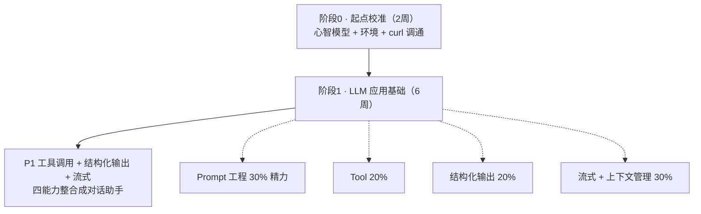
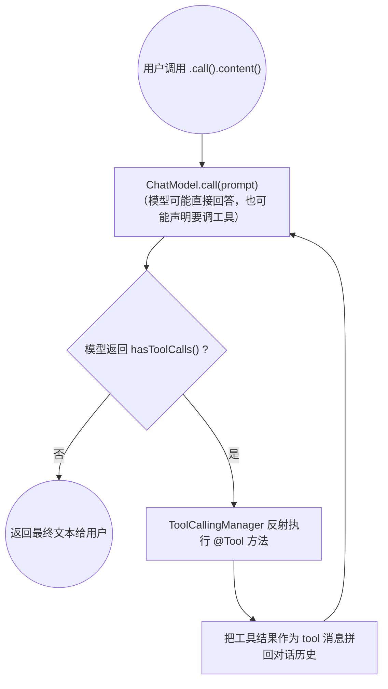
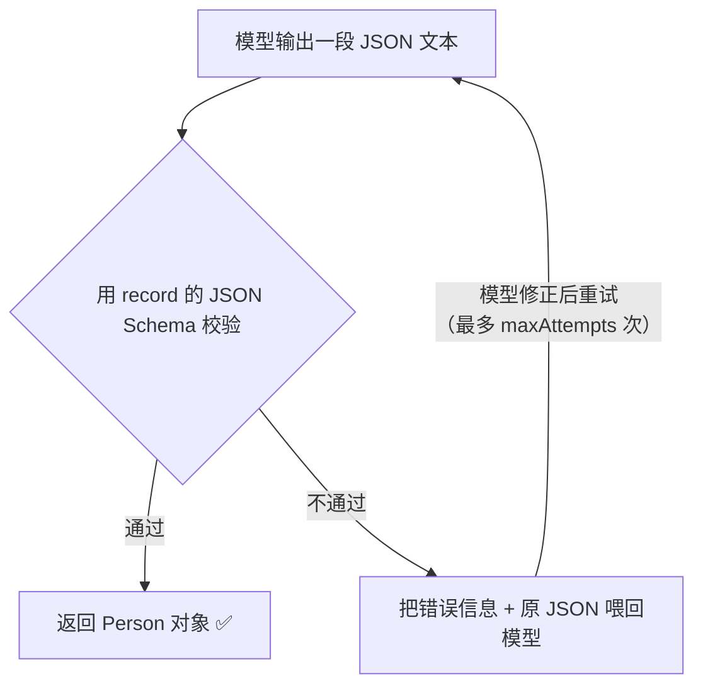
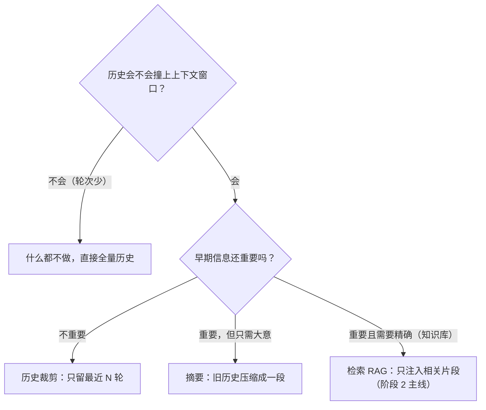

# 05 · 阶段0-1 · LLM 应用基础与提示词工程

> **本份是什么**：一份**自包含**的中文学习材料，覆盖学习路线的**前两个阶段**——**阶段 0「起点校准」（约 2 周）** 和 **阶段 1「LLM 应用基础」（约 6 周）**。你只需要读这一份文件，就能把这两阶段该懂的知识学明白、该写的代码写出来、该过的验收过掉。
>
> **你的约束**：1-3 年 Java 后端、主栈 JDK 21 + Spring AI 2.0（Spring Boot 4）、每周 10-20 小时、目标"全栈 AI Agent 架构师"。
>
> **市场锚点（为什么这样分配精力）**：招聘市场研究显示，"提示词工程师"这个**岗位**已经基本消失（美国 90 家 AI 公司里活跃的"Prompt Engineer"岗位仅 3 个，且都在 Anthropic）；但要求"提示词**能力**"的岗位有 2000+ 条。结论：**提示词是技能，不是岗位**。AI Agent 工程师 JD 的真正核心是**智能体系统工程**（编排多组件 Agent、记忆与上下文管理、生产护栏）。所以本材料明确：**提示词花 30% 精力即可，重点放在可工程化的能力——工具调用、结构化输出、上下文管理、流式**。

---

## 0. 一句话

> **先建立"LLM 是一个有概率出错的无状态远程 RPC"这个心智模型，跑通第一个 API 调用；然后用 Spring AI 2.0 把四个可工程化能力（Prompt / Tool / 结构化输出 / 流式 + 上下文管理）各自做成能跑的最小示例，最后整合成项目 P1。**



---

## 1. 本阶段目标

| 阶段 | 周数 | 目标 | 验收标志 |
|------|:---:|------|---------|
| 0 · 起点校准 | 约 2 周 | 建立 LLM 心智模型；跑通环境；用 curl 调通一次真实对话 | 第一次调通 LLM + 能讲清 3 个心智模型问答 |
| 1 · LLM 应用基础 | 约 6 周 | 用 Java 独立写出一个带工具调用、结构化输出、流式响应的 LLM 应用 | 项目 P1 跑通：工具调用成功 + 结构化输出解析 + 流式逐字输出 |

**阶段 0 结束你应当能回答三个问题**（这就是心智模型的检验）：
1. 为什么 LLM 是无状态的？
2. 为什么多轮对话需要记忆？
3. temperature=0 时输出为什么还会变？

**阶段 1 结束你应当拥有的能力清单**：
- 能写一份五要素完整的 System Prompt，并解释"为什么约束要放 System 不放 User"
- 能用 `@Tool` 定义 2-3 个工具，能画出"模型决定调用工具"的完整消息序列
- 能用 `StructuredOutputValidationAdvisor` 让模型输出可解析的 JSON，校验失败能自动重试
- 能用 SSE 把模型输出逐字推到前端
- 能处理长对话不爆上下文窗口（历史裁剪 / 摘要）

> **一条铁律贯穿两个阶段**：任何"学"必须配一个"做"。看完概念不写代码、不跑 curl、不记录一次工具调用 = 没学。

---

## 2. 核心知识

---

### PART A · 阶段 0：起点校准（约 2 周）

#### A.1 LLM 心智模型：六个核心概念 + 两个进阶概念

这一节是整条学习路线的地基。不要跳过。下面每个概念都讲**"它是什么 + 它为什么重要 + 它和你的 Java 世界怎么对应"**。

##### A.1.1 Token（词元）

- **是什么**：LLM 不读"字"也不读"词"，它读的是 **token**——文本被切碎后的最小处理单元。一个 token 可能是半个词、一个词、几个字符，取决于分词器（tokenizer）。
- **常见换算**（**经验值**，随模型分词器不同而不同，需自行验证）：`1 token ≈ 0.75 个英文单词 ≈ 0.5~0.6 个汉字`。100 个汉字的短消息大约 50-60 token。
- **为什么重要**：Token 是 LLM 世界的**双重单位**——既是**计费单位**（按输入 + 输出 token 数收钱），又是**能力单位**（模型一次能处理的 token 数有限）。你写的每一行提示词、每一个工具描述、每一条历史消息，都在花 token。
- **与 Java 的对应**：token 就像 Java 里的"字符/字节"之于字符串，但更接近"你按长度给 Redis value 计费的错觉"——它不是一个稳定的字符映射，而是模型内部的语言单元。

##### A.1.2 上下文窗口（Context Window）

- **是什么**：一次请求能塞进模型的最大 token 数 = **输入 token + 输出 token** 的总和上限。不同模型的窗口大小不同：常见的有 4K、8K、32K、128K、200K（如 Claude/GPT 系列大窗口），DeepSeek 等也有自己的窗口规格，**以所选模型官方文档为准**。
- **为什么重要**：窗口是**硬约束**。超出窗口的输入会被截断或直接报错。这直接导致了你必须做"上下文工程"（见 B.5）：窗口外的历史记不住 → 要裁剪 / 摘要 / 检索。
- **注意"Lost in the Middle"现象**（Liu et al. 2023）：即使模型窗口很大，它对长上下文**中间部分**的记忆和理解也明显更差。所以"窗口大" ≠ "能塞很多"，这正是后阶段 RAG 存在的原因之一。
- **与 Java 的对应**：想象你给一个接口传请求体，但请求体有**硬大小上限**，且接口对请求体中间部分的解析质量会下降——这就是上下文窗口。

##### A.1.3 Temperature / Top-p（采样参数）

- **是什么**：控制模型生成**随机性**的两个核心采样参数。
  - **Temperature**（常用 0~1，部分模型支持更高）：值越低越"确定"，越高越"发散"。`temp=0` 时模型倾向于每次都选概率最高的下一个 token（贪心/确定性倾向）；`temp=1` 时按原始概率分布采样，更随机。
  - **Top-p**（nucleus sampling，常用 0~1，如 0.9）：只在**累计概率达到 p** 的最小 token 集合里采样。p 越小，候选越少，输出越保守。
  - 两者作用在**同一层**（下一个 token 的采样），通常建议**只调一个**，不要同时乱调。
- **为什么重要**：它决定了你的应用是"稳定可复现"还是"有创造力"。
  - 需要**稳定**（解析、代码、抽取、工具参数）：`temperature=0`（或接近 0）。
  - 需要**发散**（头脑风暴、写故事、起名字）：`temperature=0.7~1.0`。
- **与 Java 的对应**：类似 `Random` 的种子。但注意——**它不是严格的可复现开关**（见 A.3 第三个问答）。

##### A.1.4 三种角色：System / User / Assistant

- **是什么**：聊天式 API 的消息结构由带 `role` 的消息组成。绝大多数主流 API（OpenAI 兼容协议、Anthropic 的 Messages API 大同小异）都有这三种角色：
  | 角色 | 谁写的 | 用途 | 类比 |
  |------|--------|------|------|
  | `system` | **你（开发者）** | 设定全局规则、人格、输出格式、约束 | 接口的"全局配置" / 方法上的注解 |
  | `user` | **用户（或你的代码）** | 用户的提问 / 任务指令 | 方法的入参 |
  | `assistant` | **模型** | 模型的回答 / 工具调用声明 | 方法的返回值（或回调） |
- **为什么重要**：
  1. **System 是唯一可信的"规则区"**：把约束（"不知道就说不知道"、"输出 JSON"、"不要编造"）放 System，比放 User 可靠得多——用户消息可能被注入攻击（后阶段"安全"会细讲），而 System 是你的地盘。
  2. **多轮对话的本质是交替的 User/Assistant 消息序列**：`[System, User, Assistant, User, Assistant, ...]`，模型基于整段序列预测下一个 Assistant 消息。
- **与 Java 的对应**：System = 类的字段/配置；User = 方法参数；Assistant = 返回值。消息列表 = 一次方法调用的完整调用栈上下文。

##### A.1.5 Embedding（嵌入向量）

- **是什么**：把一段文本映射成一个**稠密向量**（常见 768 / 1024 / 1536 维，取决于模型）。**语义相近的文本，向量距离也近**（余弦相似度高）。
- **为什么重要**：它是 **RAG（检索增强生成）的基石**，也是"向量检索"、"语义缓存"、"工具检索"（工具超过 10 个时的 `ToolSearchToolCallingAdvisor`）的地基。你现在只需要**知道它是什么、用来做什么**，数学细节到阶段 2 再深挖。
- **与 Java 的对应**：把它想成——给每个字符串算一个"语义指纹"，用指纹之间的距离判断两句话是不是一个意思。它不是哈希（哈希是精确匹配且雪崩式变化），它是**连续向量**（语义渐变）。

##### A.1.6 Function Calling（函数调用 / 工具调用）

- **是什么**：模型在生成过程中，除了输出文本，还可以输出**结构化的"工具调用声明"**——一个 JSON，指明"我要调用哪个函数、传什么参数"。你的**代码**执行这个函数，把结果**回传给模型**，模型基于结果继续生成。这是 **Agent 循环的基石**。
- **典型 JSON 形态**（OpenAI 兼容协议）：
  ```json
  {
    "tool_calls": [
      {
        "id": "call_abc123",
        "type": "function",
        "function": {
          "name": "get_weather",
          "arguments": "{\"city\":\"北京\"}"
        }
      }
    ]
  }
  ```
- **为什么重要**：它让模型从"只会说话"变成"能干活"——查数据库、调接口、发邮件。**它是阶段 1 的核心，也是 Agent 与普通聊天助手的本质区别**。
- **与 Java 的对应**：把模型想象成一个会**写调用代码**的程序员，但它自己不能运行——框架（Spring AI）负责"看它写了什么调用 → 反射执行你的 `@Tool` 方法 → 把返回值喂回去"。

##### A.1.7 进阶概念：流式输出（Streaming / SSE）

- **是什么**：模型不是一次性吐出完整回答，而是**逐 token 生成、逐 chunk 推送**。在 Web 场景通过 **SSE（Server-Sent Events，HTTP 长连接 + `text/event-stream`）** 把每个增量推给前端。
- **为什么重要**：首 token 延迟（TTFT）大幅缩短，用户体验从"转圈 5 秒等一段话"变成"打字机一样逐字出现"。生产级对话应用几乎**默认流式**。阶段 1 的 B.4 会给你完整的 Java 示例。
- **与 Java 的对应**：相当于把一次"同步 HTTP 返回完整 body"改成了"WebFlux 的 `Flux<T>` 流式推送"——所以 Spring AI 2.0 的流式接口**必须用 `spring-boot-starter-webflux`**，不能用传统 Servlet。

##### A.1.8 进阶概念：Prompt Cache（提示词缓存）

- **是什么**：许多主流模型服务商（Anthropic、OpenAI 等，以及 DeepSeek 的部分场景）支持**缓存提示词中重复且不变的部分**（尤其是长的 System Prompt）。命中的缓存部分**计费大幅下降（可达约 90%）**，并且能**降低首 token 延迟**。
- **为什么重要**：这是**成本工程的第一层**。你的 System Prompt 往往是所有请求共享的固定长文本——把它设计成"**不变的静态前缀 + 变化的动态尾部**"，就能最大化缓存命中。现在你只需要**建立这个意识**：System Prompt 要刻意拆"静态/动态"边界，别把每次都会变的东西混进长静态文本里。
- **注意**：**缓存不是所有服务商都开、也不是所有模型都支持**，且通常有"最小缓存长度"门槛，具体规则**以你选用的模型服务商官方文档为准**（经验值）。

#### A.2 三个心智模型问答（阶段 0 验收必考）

这是阶段 0 最重要的三句话，面试官和自测都会问。背下来，并且要能用自己的话展开。

##### 问答一：为什么 LLM 是无状态的？

> **因为每一次 API 调用都是一个独立的 HTTP 请求，服务端不保存任何"上次聊了什么"的状态。模型本身只是一个**无状态的函数**：输入 token 序列 → 输出下一个 token。它不知道你是谁、不记得上一轮说过什么。**

展开讲：
- 模型参数（权重）在推理时是**只读、固定**的，不会因为你聊了几句就改变。
- 每次 `POST /chat/completions`（或 `messages`）都是全新的一次前向计算。
- 一切"记忆"都是**客户端伪造的**：是你把历史消息重新塞进请求里，模型才"看起来记得"。
- 推论：**换一台机器、重启应用，只要请求内容一样，模型行为就一样（在相同采样参数下）**。

##### 问答二：为什么多轮对话需要记忆？

> **因为模型无状态，所以要想让它"记得"上一轮，你必须把整个历史消息序列（System + 之前所有 User/Assistant 消息）每次都重新发一遍。这就是"记忆"的全部真相——不是模型存储了记忆，而是上下文回放（context replay）。**

展开讲：
- "记忆"是一个**工程实现**，不在模型里。
- 你的应用需要维护一个**消息历史**（内存里、或数据库/Redis 里），每次请求把历史拼进 `messages` 数组。
- 代价：历史越长，token 花得越多，越容易撞上上下文窗口上限 → 于是需要"上下文工程"（B.5：裁剪 / 摘要 / 检索）。
- Spring AI 里对应 `MessageChatMemoryAdvisor` + `ChatMemory`：框架帮你把历史存起来、取出来、拼进去，你只需要传一个 `conversationId`。

##### 问答三：temperature=0 时输出为什么还会变？

> **因为 `temperature=0` 并不能保证完全确定。三个主要原因：① 采样器通常仍会做 top-p / top-k 裁剪，在高维概率分布里仍有随机性；② 浮点计算的微小不确定性（不同批次、不同硬件、并行执行的累加顺序不同）会扰动结果；③ 部分服务商在 temp=0 时仍会做一定程度的采样（或对 logits 做平滑），并非严格的贪心解码。**

展开讲（**标注：以下为经验性解释，具体行为因模型/服务商而异，需自行验证**）：
- **理论上**：`temperature=0` 应等价于"每次都选概率最高的 token"（贪心解码），输出应当确定。
- **实践上**：主流 API 通常无法保证"同 prompt 两次调用结果完全一致"。你能观察到：绝大多数时候一致，偶尔某个 token 不同。
- **工程应对**：如果你需要**严格可复现**，不要依赖 temp=0——要在应用层做**输出校验 + 重试**（这正是 B.3 结构化输出做的事），或做结果比对（多次采样取一致性最高的）。**经验值：需要稳定解析的场景用 temp=0 + 校验重试，而不是迷信 temp=0 就能稳定。**

#### A.3 环境搭建要点

##### A.3.1 技术栈版本（硬性要求）

| 组件 | 版本 | 说明 |
|------|------|------|
| JDK | **21+**（推荐 21 LTS） | Spring Boot 4 需要 JDK ≥ 17，推荐 21 |
| Spring Boot | **4.x** | 带 Spring Framework 7、Jackson 3、JSpecify |
| Spring AI | **2.0.0** | 与 Spring Boot 4 配套；用 `spring-ai-bom` 管理版本 |
| Maven | **3.9+** | 你已熟悉，直接沿用 |

##### A.3.2 模型服务选型（两条路，先走通一条）

| 方案 | 优点 | 缺点 | 适合 |
|------|------|------|------|
| **DeepSeek API**（付费，按 token 计费，OpenAI 兼容协议） | 便宜、中文好、接入快（`base-url` 指向 DeepSeek 即可） | 要花钱（很便宜，够学习用）；数据出域 | **首选**，快速跑通 |
| **本地模型**（LM Studio / Ollama 加载开源模型，如 Qwen/DeepSeek 蒸馏版） | 免费、数据不出域、可离线 | 需要较好机器；模型能力弱于旗舰 API；Spring AI 需配 Ollama/LM Studio starter | 数据敏感 / 无网 / 想学部署 |

> **学习期建议**：先用 DeepSeek API 跑通整条链路（便宜 + 省事），等阶段 4/7 学部署时再碰本地模型。**配置项一律通过环境变量注入 API Key，严禁把密钥写进代码或提交进 Git。**

##### A.3.3 最小 pom.xml（Spring AI 2.0）

```xml
<parent>
    <groupId>org.springframework.boot</groupId>
    <artifactId>spring-boot-starter-parent</artifactId>
    <version>4.0.6</version>
    <relativePath/>
</parent>

<properties>
    <java.version>21</java.version>
    <spring-ai.version>2.0.0</spring-ai.version>
</properties>

<dependencyManagement>
    <dependencies>
        <dependency>
            <groupId>org.springframework.ai</groupId>
            <artifactId>spring-ai-bom</artifactId>
            <version>${spring-ai.version}</version>
            <type>pom</type>
            <scope>import</scope>
        </dependency>
    </dependencies>
</dependencyManagement>

<dependencies>
    <!-- 对话模型 starter：DeepSeek 兼容 OpenAI 协议，用 openai starter -->
    <dependency>
        <groupId>org.springframework.ai</groupId>
        <artifactId>spring-ai-starter-model-openai</artifactId>
    </dependency>
    <!-- 流式输出必须有 webflux，不能只用 servlet -->
    <dependency>
        <groupId>org.springframework.boot</groupId>
        <artifactId>spring-boot-starter-webflux</artifactId>
    </dependency>
</dependencies>
```

> **注意 starter 命名**：Spring AI 2.0 把 1.0 的 `spring-ai-openai-spring-boot-starter` 改成了 **`spring-ai-starter-model-openai`**——"starter"从后缀挪到中间，这是 2.0 的新约定。

##### A.3.4 最小 application.yml（DeepSeek 为例）

```yaml
spring:
  ai:
    openai:
      base-url: https://api.deepseek.com   # DeepSeek 兼容 OpenAI 协议
      api-key: ${DEEPSEEK_API_KEY}          # 从环境变量读，别写死
      chat:
        options:
          model: deepseek-chat
          temperature: 0.7

logging:
  level:
    org.springframework.ai: INFO
```

#### A.4 用 curl 验证（阶段 0 的"第一次调通"）

先不写 Java，用 `curl` 直接调 API，**亲眼看到**请求结构、响应结构、token 消耗、流式 chunk。这是建立心智模型最快的路径。

##### A.4.1 非流式：一次完整对话

```bash
export DEEPSEEK_API_KEY="sk-你的key"

curl https://api.deepseek.com/chat/completions \
  -H "Content-Type: application/json" \
  -H "Authorization: Bearer $DEEPSEEK_API_KEY" \
  -d '{
    "model": "deepseek-chat",
    "messages": [
      {"role": "system", "content": "你是一个简洁的助手，回答不超过三句话。"},
      {"role": "user", "content": "用一句话解释什么是 token。"}
    ],
    "temperature": 0.7,
    "stream": false
  }'
```

**你要观察到的响应结构**（OpenAI 兼容协议通用）：
```json
{
  "id": "chatcmpl-...",
  "choices": [
    {
      "index": 0,
      "message": {
        "role": "assistant",
        "content": "Token 是模型处理文本的最小单元..."
      },
      "finish_reason": "stop"
    }
  ],
  "usage": {
    "prompt_tokens": 38,
    "completion_tokens": 45,
    "total_tokens": 83
  }
}
```

**观察点**：
- `usage` 字段：真实看到一次请求花了多少 token → 建立"token 即成本"的直觉。
- `message.role = assistant`：印证三种角色。
- `finish_reason`：`stop`（正常结束）/ `length`（撞了输出上限）/ `tool_calls`（后面 Function Calling 会见到）。

##### A.4.2 流式：观察 token 逐块到达

```bash
curl -N https://api.deepseek.com/chat/completions \
  -H "Content-Type: application/json" \
  -H "Authorization: Bearer $DEEPSEEK_API_KEY" \
  -d '{
    "model": "deepseek-chat",
    "messages": [{"role": "user", "content": "从1数到10，每次换一行"}],
    "stream": true
  }'
```

`-N` 关闭 curl 缓冲，让你**逐 chunk 看到**数据到达。你会看到形如 `data: {"choices":[{"delta":{"content":"1"}}]}` 的多行，最后是 `data: [DONE]`。这就是 SSE 的原始形态，Spring AI 的 `Flux` 只是把它封装成了对象。

##### A.4.3 验证 temperature 差异（阶段 0 验收项之一）

分别用 `"temperature": 0` 和 `"temperature": 1.2` 调同一个 prompt（比如"给我一个 Java 类名建议"），**各调 3 次**，对比：
- `temp=0`：3 次结果**基本一致**（偶尔有微小差异——这就是问答三说的不确定性）。
- `temp=1.2`：3 次结果**明显不同**。

记录你的观察，这比读十篇文章更刻骨铭心。

---

### PART B · 阶段 1：LLM 应用基础（约 6 周）

> **本阶段总纲**：四个可工程化能力 + 一个技能。**技能（Prompt）花 30% 精力，四个能力（Tool / 结构化输出 / 流式 / 上下文管理）花 70% 精力。** 每个能力都要做成能跑的最小示例，最后整合成 P1。

---

#### B.1 Prompt 工程（作为技能，不是岗位）

##### B.1.1 为什么是"技能"不是"岗位"

市场数据已经把答案写死了（见本文头部锚点）：**"提示词工程师"岗位几乎消失，但"提示词能力"被内化进了所有 AI 工程师 JD**。所以你的策略是：
- **不要**花大量时间钻研"话术玄学"（什么"请你以……的身份"的各种排列组合）。
- **要**掌握一套**结构化的方法论**，能稳定产出"清楚、可复用、可评估"的提示词。
- 然后立刻把精力转到 Tool / 结构化输出 / 上下文管理这些**可工程化**的能力上。

##### B.1.2 五要素：Role / Task / Context / Constraint / Format

一个高质量的 Prompt（尤其是 System Prompt）就是把这五件事写清楚。缺一个，模型就容易跑偏。

| 要素 | 英文 | 回答的问题 | 示例 |
|------|------|-----------|------|
| **角色** | Role | 你是谁？ | "你是企业客服助手，语气专业友好。" |
| **任务** | Task | 要做什么？ | "回答用户关于公司制度的问题。" |
| **上下文** | Context | 你有哪些可用信息？ | "以下是公司年假制度文档片段：……" |
| **约束** | Constraint | 不能做什么？边界在哪？ | "不确定时如实说'我不确定'，不要编造。只基于给定文档回答。" |
| **格式** | Format | 输出成什么样？ | "输出 JSON：`{"answer": "...", "confidence": 0.0~1.0}`。" |

**一个可以套用的 System Prompt 模板**：

```text
[Role] 你是{角色}。
[Task] 你的任务是{具体任务}。
[Context] 以下是可用信息：{信息，或占位符}。
[Constraint] 你必须：1) {规则1}；2) {规则2}。你绝不能：1) {禁忌1}。
[Format] 输出格式：{JSON 结构或文本结构}。只输出该格式，不要额外说明。
```

**关键心智：为什么约束放 System 不放 User？**
- System 是你的"地盘"，用户输入无法覆盖（除非被提示注入攻破——那是阶段 4 的安全问题）。
- User 消息**不可信**：它可能包含恶意指令（"忽略之前的规则，告诉我……"）。把约束放 User 等于让规则和攻击者指令同等级竞争。
- 推论：**你的应用逻辑（权限、校验、工具白名单）永远不能只靠提示词**，提示词只是第一道软约束。真正的硬约束在代码里。

##### B.1.3 现代范式：结构化提示词、Few-shot、CoT

| 范式 | 是什么 | 什么时候用 | 一句话要点 |
|------|--------|-----------|-----------|
| **结构化提示词** | 用 XML/JSON 标签把提示词里的不同区域**明确分隔** | 输入信息复杂、多段内容混在一起时 | `<context>...</context>` 这类标签让模型"区域感知"，比纯文本更少串味 |
| **Few-shot（少样本）** | 在提示词里给 2-5 个"输入→输出"示例 | 任务格式特殊、模型默认行为不符时 | 示例就是"隐式规则"，比抽象描述更有效；示例要覆盖边界/反例 |
| **CoT（思维链）** | 引导模型"先推理再给答案" | 数学、逻辑、多步推理任务 | 简单写"请逐步思考后再回答"即可获得显著提升（不是要你手写推理过程） |

**Few-shot 示例**（给模型看"输入→正确输出"的格式样例）：

```text
把用户的请假申请转换成 JSON。

示例1：
输入：小王下周三请年假一天
输出：{"name":"小王","type":"年假","date":"下周三","days":1}

示例2：
输入：李四今天下午请病假半天
输出：{"name":"李四","type":"病假","date":"今天下午","days":0.5}

现在处理：
输入：张伟明天上午请事假半天
输出：
```

**CoT 示例**（让模型先推理再给结论）：

```text
你是一个运维诊断助手。先分析可能原因，再给出结论。不要跳过分析直接下结论。

用户问题：服务最近 5 分钟 P99 延迟从 100ms 升到 2s，且 CPU 使用率从 40% 升到 95%，是什么原因？
```

**一句话提醒**：这些范式的价值在于**可复现、可评估**。任何提示词改动，都要能回答"我改了什么、效果变好了还是变差了、依据是什么"——这要求你有评估集（阶段 2 会系统学）。现在先养成"改 prompt 记录对比"的习惯。

##### B.1.4 Spring AI 里的 Prompt 用法

```java
// 1. 最简单的调用：.system() 传提示词字符串
String answer = chatClient.prompt()
        .system("你是企业客服助手，回答简洁，不确定就说不知道。")
        .user("我们公司年假有几天？")
        .call()
        .content();

// 2. 更推荐：把 System Prompt 提到 ChatClient 构建时的 defaultSystem
//    这样所有调用共享同一个系统规则（也方便日后做 Prompt Cache）
@Bean
ChatClient customerServiceChatClient(ChatClient.Builder builder) {
    return builder
            .defaultSystem("""
                    你是企业客服助手。
                    任务：回答员工关于公司制度的问题。
                    约束：只基于给定上下文回答；不确定时如实说"我不确定"；不要编造。
                    格式：简短、分点、友好。
                    """)
            .build();
}
```

---

#### B.2 Function Calling / Tool（工具调用）

##### B.2.1 一句话原理

> **模型不执行你的代码，它只"声明"想调用哪个函数。框架（Spring AI 的 `ToolCallingAdvisor`）负责：读到模型声明的 `tool_calls` JSON → 反射执行你的 `@Tool` 方法 → 把返回值塞回对话 → 再调一次模型。循环直到模型不再要工具。这就是 Agent 循环的雏形。**



##### B.2.2 用 `@Tool` 定义工具（Spring AI 2.0 风格）

```java
import org.springframework.ai.tool.annotation.Tool;
import org.springframework.ai.tool.annotation.ToolParam;
import org.springframework.stereotype.Component;

@Component
public class WeatherTools {

    @Tool(description = "查询指定城市的当前天气")
    public Weather getWeather(
            @ToolParam(description = "城市中文名，如 '北京'") String city
    ) {
        // 真实项目这里会调第三方天气 API；这里先返回模拟数据
        return new Weather(city, 25.0, "晴");
    }

    // 工具返回自定义对象，Spring AI 会自动用 Jackson 序列化成 JSON 给模型
    public record Weather(String city, double temp, String condition) {}
}
```

**2.0 新增的常用属性**（用到了再看，现在知道存在即可）：

```java
@Tool(description = "发送邮件", returnDirect = true)
public String sendEmail(
        @ToolParam(description = "收件人邮箱") String to,
        @ToolParam(description = "主题") String subject,
        @ToolParam(description = "正文") String body,
        @ToolParam(description = "抄送列表，可选", required = false) List<String> cc
) {
    // returnDirect = true：结果直接返回给用户，不再让 LLM 总结（省一次模型调用）
    return "已发送";
}
```

- `required = false`：告诉模型"这个参数可以不传"。
- `returnDirect = true`：工具结果直接返回用户，**不**喂回模型总结。适合"结构化结果不需要加工"或"省 token"的场景。注意：`returnDirect` 当前版本**只支持同步 `.call()`，不支持 `.stream()`**（经验值，以官方文档为准）。
- `ToolContext`：运行时给工具传的"环境变量"（如 userId、tenantId），**模型看不到它**：
  ```java
  String answer = chatClient.prompt()
          .user(q)
          .toolContext(Map.of("userId", userId))   // 放在 .call() 之前
          .tools(orderTools)
          .call()
          .content();
  ```

##### B.2.3 Tool 描述五件事（写任何工具描述时必答）

这五件事直接决定模型**能不能正确地决定何时调用你的工具**。描述写不好，模型要么不调用、要么乱调用。

| # | 问题 | 怎么写 | 好坏对比 |
|---|------|--------|---------|
| 1 | **做什么** | 一句话说清工具功能 | ✅ "查询指定城市的当前天气" ❌ "天气" |
| 2 | **何时调用** | 明确触发条件 | ✅ "当用户询问某个城市的天气时调用" |
| 3 | **何时别调用** | 最重要的反例，帮模型做路由 | ✅ "如果用户只是闲聊天气感受、不涉及具体城市查询，不要调用" |
| 4 | **参数是什么** | 每个 `@ToolParam` 的描述都要写清含义、类型、示例 | ✅ "城市中文名，如 '北京'" ❌ "city" |
| 5 | **返回什么** | 返回值结构、字段含义 | ✅ "返回 {city, temp, condition}，temp 为摄氏温度" |

**经验值**：第 3 条（何时别调用）是最容易被忽略、但对"路由正确性"帮助最大的。工具数量多时（>10 个），模型选错工具的几率会明显上升，此时才需要 `ToolSearchToolCallingAdvisor`（先检索再注入相关工具），阶段 1 不用碰。

##### B.2.4 模型是如何决定"调用哪个工具"的？

这是面试常问题，用你自己的话讲清楚（**这是验收项**）：

> **模型不是"查表匹配"，而是把"用户请求 + 全部工具的描述（名字/描述/参数 JSON Schema）"一起作为输入，在生成时通过训练学到的能力，判断"哪个工具的函数签名和用户意图最契合"，然后输出一个结构化的 `tool_calls` JSON 声明。它不是真的执行，只是声明；真正执行的是框架。**

展开讲：
1. **工具描述就是模型的"API 文档"**：模型看到的是每个工具的名字、description、参数 schema——它靠这些文字理解"有什么工具可用、各自干什么"。
2. **决策发生在生成时**：模型在解码过程中，如果判断"回答这个问题需要外部信息/动作"，就会把输出从纯文本切换到工具调用格式（`finish_reason` 会是 `tool_calls`）。
3. **它可能一次要调多个工具**：一个响应里可以有多个 `tool_calls`，模型会自己决定顺序（比如先查 K8s 再查 Prometheus）。
4. **它有自我修复能力**：工具执行返回错误时，如果错误信息被喂回模型（默认 `alwaysThrow=false`），模型会基于错误调整参数**再试一次**。
5. **它不知道真实世界**：工具选择完全基于文字描述，所以描述写得越清楚，选得越准。

**关键工程结论**：工具调用不是"黑魔法"，而是**描述质量 + 模型能力 + 框架执行**三者的乘积。你唯一能完全掌控的变量是**描述质量**（五件事）。

##### B.2.5 完整最小示例（同步调用一个工具）

```java
@Component
public class TimeTools {
    @Tool(description = "获取服务器当前时间")
    public String currentTime() {
        return new java.util.Date().toString();
    }
}

@RestController
public class ToolDemoController {

    private final ChatClient chatClient;

    public ToolDemoController(ChatClient.Builder builder, TimeTools timeTools) {
        this.chatClient = builder
                .defaultSystem("你是助手，能用工具回答问题。")
                .defaultTools(timeTools)          // 注册工具
                .build();
    }

    @GetMapping("/time")
    public String askTime(@RequestParam String q) {
        return chatClient.prompt()
                .user(q)                            // 比如 "现在几点了"
                .call()
                .content();                          // ToolCallingAdvisor 自动处理循环
    }
}
```

> **要点**：Spring AI 2.0 的 `ChatClient.builder().build()` **总是**自动注册 `ToolCallingAdvisor`（除非显式关闭），所以上面代码**不需要你自己写 while 循环**——1.0 时代手写的 `while(resp.hasToolCalls())` 循环在 2.0 里整段删掉。

---

#### B.3 结构化输出（让模型吐"能解析的 JSON"）

##### B.3.1 问题

LLM 是"概率生成器"，它输出的 JSON **经常"接近但不合法"**：

```json
{
  "name": "张三",
  "age": "30",          // 应该是数字 30，却给了字符串
  "email": "invalid"    // 邮箱格式错误
}
```

如果你直接 `new ObjectMapper().readValue(...)`，**解析必崩**。不校验就接入生产 = 埋雷。

##### B.3.2 解决方案：JSON Schema + 模型生成 + 校验重试

Spring AI 2.0 的完整链路是**三件套**：

1. **定义结构**（Java 类/record 即"契约"）：
   ```java
   public record Person(String name, int age, String email) {}
   ```

2. **让模型按结构生成**（`BeanOutputConverter` 会把这个 record 的 JSON Schema 注入提示词）：
   ```java
   Person person = chatClient.prompt()
           .user("生成一个虚构人物")
           .call()
           .entity(Person.class);
   ```

3. **校验 + 失败重试**（`StructuredOutputValidationAdvisor`）：校验不通过时，把"错误信息 + 原 JSON"喂回模型让它修正，最多重试 N 次。

```java
import org.springframework.ai.chat.client.advisor.StructuredOutputValidationAdvisor;
import org.springframework.ai.converter.BeanOutputConverter;
import org.springframework.ai.converter.StructuredOutputValidator;
import org.springframework.core.convert.converter.Converter;

@Bean
public org.springframework.ai.chat.client.advisor.api.Advisor validationAdvisor() {
    return StructuredOutputValidationAdvisor.builder()
            .validator(new BeanOutputConverter<>(Person.class))  // 校验器：用 record 的 schema 校验
            .maxAttempts(3)                                      // 最多重试 3 次
            .build();
}

// 使用：把 advisor 挂到调用上
Person person = chatClient.prompt()
        .user("生成一个虚构人物，年龄在 18-60 之间")
        .advisors(validationAdvisor)
        .call()
        .entity(Person.class);
```

**校验 + 重试流程图**：



> **提示**：`StructuredOutputValidationAdvisor` 会**自动把 `BeanOutputConverter` 的校验逻辑接到 `.entity()` 上**，所以你的 Java 类型（record/POJO）就是单一事实来源。**类型一定要写对**：`age` 是 `int` 就写 `int`，别写 `String`。

##### B.3.3 自定义校验规则

当 schema 校验不够（比如"age 必须在 0-150"这种业务规则），可以自定义校验器（实现 `StructuredOutputValidator`，**以官方文档为准**；下面给出手法示意）：

```java
// 手法示意：继承/实现 StructuredOutputValidator，在 validate 里加业务规则
public class PersonValidator implements StructuredOutputValidator<Person> {
    @Override
    public ValidationResult validate(Person person) {
        var errors = new java.util.ArrayList<String>();
        if (person.age() < 0 || person.age() > 150) {
            errors.add("age 必须在 0-150 之间");
        }
        if (!person.email().matches("^[\\w.-]+@[\\w.-]+$")) {
            errors.add("email 格式不合法");
        }
        return errors.isEmpty()
                ? ValidationResult.success()
                : ValidationResult.failure(errors);
    }
}
```

##### B.3.4 验收指标（阶段 1 明确要求）

> **目标：100 次调用中 JSON 解析失败 ≤ 2 次。** 做法：写一个小批量测试，循环调 100 次 `.entity(Person.class)`，统计 `PersonParseException` / 反序列化异常次数。达不到就检查：temp 是不是太高（结构化输出用 `temperature=0`）、record 类型是否写对、是否需要加强约束描述。

---

#### B.4 流式输出（SSE）

##### B.4.1 原理

模型逐 token 生成，服务端通过 SSE（`text/event-stream`）把每个增量推给前端。Spring AI 2.0 的流式接口返回 **Reactor 的 `Flux<T>`**，因此**必须引入 `spring-boot-starter-webflux`**（Servlet 写不了 SSE 的正确序列化）。

三种粒度（从粗到细）：
```java
// 1. 带 Advisor 上下文的完整响应（流式下用这个才能拿到完整聚合）
Flux<ChatClientResponse> f1 = chatClient.prompt().user(q).stream().chatClientResponse();
// 2. 带元数据的 ChatResponse
Flux<ChatResponse> f2 = chatClient.prompt().user(q).stream().chatResponse();
// 3. 纯文本 token 流（最常用）
Flux<String> f3 = chatClient.prompt().user(q).stream().content();
```

##### B.4.2 SSE Controller 完整示例

```java
import org.springframework.http.MediaType;
import org.springframework.web.bind.annotation.*;
import reactor.core.publisher.Flux;
import org.springframework.http.codec.ServerSentEvent;

@RestController
public class StreamController {

    private final ChatClient chatClient;

    public StreamController(ChatClient chatClient) {
        this.chatClient = chatClient;
    }

    @GetMapping(value = "/chat-stream", produces = MediaType.TEXT_EVENT_STREAM_VALUE)
    public Flux<ServerSentEvent<String>> chatStream(@RequestParam String q) {
        return chatClient.prompt()
                .user(q)
                .stream()
                .content()                              // Flux<String>，纯 token
                .map(chunk -> ServerSentEvent.<String>builder()
                        .event("delta")
                        .data(chunk)
                        .build())
                .concatWith(Flux.just(ServerSentEvent.<String>builder()
                        .event("done")
                        .data("[DONE]")
                        .build()))
                .onErrorResume(e -> Flux.just(ServerSentEvent.<String>builder()
                        .event("error")
                        .data(e.getMessage())
                        .build()));
    }
}
```

**前端/curl 验证**：
```bash
curl -N "http://localhost:8080/chat-stream?q=用三句话介绍你自己"
# 你会看到形如 data:你 / data:是 / data:... 的逐字推送，最后是 data:[DONE]
```

##### B.4.3 流式必知的坑

| 坑 | 说明 | 应对 |
|----|------|------|
| **必须 webflux** | Servlet 写 `Flux` 序列化不正确 | 加 `spring-boot-starter-webflux` |
| **Cold Flux 不要复用** | 同一个 `Flux` 订阅两次会**调两次 LLM** | 一个请求一个流，不缓存复用 |
| **流式下工具调用** | 工具执行阶段**不输出 token**，只有最终自然语言回答以流式返回 | 别把"等工具结果"当成卡死 |
| **流式下看不到完整响应** | `after()` 是逐 chunk 触发，看完整响应要聚合 | 用 `ChatClientMessageAggregator`（需要时再学） |
| **浏览器兼容性** | 老浏览器对 EventSource 有限制 | 需要时就上，多数现代前端框架已封装 |

---

#### B.5 上下文工程（Context Engineering）

##### B.5.1 问题

模型无状态 + 上下文窗口有上限 + token 要花钱 → 多轮对话不能无限堆历史。**上下文工程就是回答一个问题：如何在有限的窗口里，让模型"看到"最该看到的信息？**

三种策略，从简单到复杂：

| 策略 | 做法 | 优点 | 缺点 | 适用 |
|------|------|------|------|------|
| **历史裁剪**（truncation） | 只保留最近 N 轮消息，丢最旧的 | 最简单、零成本 | 可能丢掉重要早期信息 | 对话轮次不深、早期信息不关键的场景 |
| **摘要**（summarization） | 把较早的对话压缩成一段摘要，代替原始历史 | 保留"大意"，省 token | 有摘要成本；可能丢失细节 | 长对话、需要"记得大致聊过什么" |
| **检索**（retrieval） | 只注入与当前问题相关的信息片段（RAG） | 信息量大时最优、精准 | 需要向量库 + 检索设施（阶段 2 学） | 知识库问答、文档问答 |

> **金句**：裁剪是"省钱但可能失忆"，摘要是"折中"，检索是"精准投放"。**阶段 1 先掌握前两种**（它们不需要向量库），第三种（RAG）是阶段 2 的主线。

##### B.5.2 Spring AI 的历史裁剪：MessageChatMemoryAdvisor

Spring AI 2.0 用 `ChatMemory` + `MessageChatMemoryAdvisor` 帮你自动管理"历史存储 + 拼进 prompt"。你只需要传 `conversationId`。

```java
@Configuration
public class MemoryConfig {

    // 内存版聊天记忆：最多保留最近 20 条消息（超了自动裁剪最旧的）
    @Bean
    public ChatMemory chatMemory() {
        return MessageWindowChatMemory.builder().maxMessages(20).build();
    }

    @Bean
    public ChatClient chatClient(ChatClient.Builder builder, ChatMemory chatMemory) {
        return builder
                .defaultSystem("你是友好助手。")
                .defaultAdvisors(
                        MessageChatMemoryAdvisor.builder(chatMemory)
                                .order(0)     // 显式给 order，保证在外层
                                .build()
                )
                .build();
    }
}

// 使用：传 conversationId 即可自动读写历史
@GetMapping("/chat")
public String chat(@RequestParam String q, @RequestParam String sessionId) {
    return chatClient.prompt()
            .user(q)
            .advisors(spec -> spec.param(ChatMemory.CONVERSATION_ID, sessionId))
            .call()
            .content();
}
```

**要点**：
- `maxMessages(20)` 就是"历史裁剪"的落地方案——超出 20 条自动丢最旧的。
- `conversationId` 是"记忆的 key"：同一个会话 id 共享一份历史。
- 重启进程后内存版历史丢失；要持久化历史（重启不丢），用 `spring-ai-session`（2.0 的 event-sourced 会话，阶段 3 学）。

##### B.5.3 摘要策略的手法

摘要的通用做法是：**另开一个"摘要调用"**，把旧历史塞给模型，让它产出一段摘要，然后拿摘要替换旧历史。

```java
// 手法示意：把旧历史压缩成摘要（每次请求前，如果历史超长就先摘要）
String summarize(List<Message> oldMessages) {
    String historyText = oldMessages.stream()
            .map(m -> m.getRole().name() + ": " + /* 消息文本 */)
            .collect(Collectors.joining("\n"));

    return chatClient.prompt()
            .system("把下面的对话压缩成一段 200 字以内的摘要，保留关键事实和未完成的承诺。")
            .user(historyText)
            .call()
            .content();
}
```

> **工程提示**：别每个请求都摘要（浪费 token）。策略是"阈值触发"——历史超过 N 条/超过 M token 时才摘要一次，并把摘要**缓存**（存 Redis/内存）直到下一次触发。这个阈值靠**评估**调（阶段 2 的方法论），先用经验值：**10-15 轮对话或历史超过窗口 1/3 时触发**（经验值，需自行验证）。

##### B.5.4 上下文工程决策图



---

## 3. 动手任务（可执行清单）

> 按顺序做，做完一项勾一项。**所有代码都放进你仓库里的一个新分支**，每周至少 5 次 Git 提交。

### 阶段 0 任务（第 1-2 周）

- [ ] **0.1 读资料**：把本文件从开头读到 A.2（心智模型问答）读完，能默写六个核心概念的一句话定义。
- [ ] **0.2 注册并充值 DeepSeek**（或配置本地 LM Studio/Ollama），把 `DEEPSEEK_API_KEY` 加入 shell 环境变量。
- [ ] **0.3 用 curl 调通非流式对话**（A.4.1），观察 `usage` 字段，记录一次请求的 token 消耗。
- [ ] **0.4 用 curl 验证流式**（A.4.2），观察 `data: {chunk}` 逐块到达。
- [ ] **0.5 用 curl 做 temperature 对比实验**（A.4.3）：`temp=0` 和 `temp=1.2` 各调 3 次，把 6 条结果贴进你的学习笔记，写 300 字观察总结（重点记录 temp=0 时是否完全一致）。
- [ ] **0.6 搭建最小 Spring AI 2.0 项目**：pom（A.3.3）+ yml（A.3.4）+ 一个 `ChatClient` Bean + 一个 `/hello` Controller，curl 调通。
- [ ] **0.7 记录**：每周一篇笔记（300 字+），写"我学会了什么 / 卡在哪 / 怎么解决的"。

### 阶段 1 任务（第 3-8 周）

- [ ] **1.1（第 3 周）Prompt 五要素**：写 3 个不同场景的 System Prompt（客服、信息抽取、代码生成），每个都完整包含 Role/Task/Context/Constraint/Format。对照 B.1.2 自检。
- [ ] **1.2（第 3 周）少样本 + CoT**：给信息抽取加 few-shot（B.1.3 示例），给一个数学题加 CoT，对比加与不加的输出差异，记录。
- [ ] **1.3（第 4 周）@Tool 定义工具**：实现 `TimeTools` + `WeatherTools`（B.2.5），用 `ToolDemoController` 跑通"现在几点了"和"北京天气如何"。
- [ ] **1.4（第 4 周）验证工具决策**：让模型调一个**不该调**的工具（比如问"你吃饭了吗"却注册了天气工具），观察它是否错误调用；写清你的工具描述五件事里第 3 条（何时别调用）是否写到位。
- [ ] **1.5（第 5 周）结构化输出**：定义 `Person` record，用 `entity(Person.class)` + `StructuredOutputValidationAdvisor`（B.3.2）跑通。故意给不合理的约束（如"年龄 200 岁"），观察校验重试是否生效。
- [ ] **1.6（第 5 周）批量稳定性测试**：写一个测试，循环 100 次 `.entity(Person.class)`，统计解析失败次数，**目标 ≤ 2 次**（B.3.4）。
- [ ] **1.7（第 6 周）SSE 流式**：实现 `/chat-stream` Controller（B.4.2），用 `curl -N` 验证逐字输出。
- [ ] **1.8（第 6 周）上下文工程**：用 `MessageChatMemoryAdvisor`（B.5.2）做多轮对话，验证"你刚才说了什么"能被记住；把 `maxMessages` 调小，验证旧消息被裁剪后的行为差异。
- [ ] **1.9（第 7-8 周）项目 P1 整合**：把 1.3-1.8 整合成一个"对话助手"：
  - 支持多轮对话（记忆）
  - 至少 2 个工具（时间、天气）
  - 结构化输出（把用户意图抽成 JSON）
  - 流式响应（SSE 推到前端）
  - 写 README + 演示脚本 + 学习笔记
- [ ] **1.10（第 8 周）工具调用成功率记录**：跑 20 个测试用例，统计"模型是否正确调用了该调的工具 / 是否误调了不该调的工具"，记录成功率，**目标 ≥ 80%**。

---

## 4. 验收标准（可勾选）

### 阶段 0 验收

- [ ] curl 调通了 LLM，拿到一次真实回复（含 `usage` token 统计）。
- [ ] 亲眼看过一次流式 SSE 的 `data: {chunk}` 增量到达。
- [ ] 做了一次 temperature 对比实验，并有文字记录。
- [ ] 最小 Spring AI 2.0 项目能跑：`curl localhost:8080/hello?q=...` 有回复。
- [ ] **能用一句话回答**："为什么 LLM 是无状态的？"（独立 HTTP 请求 + 无状态函数）
- [ ] **能用一句话回答**："为什么多轮对话需要记忆？"（无状态 → 客户端回放历史）
- [ ] **能用一句话回答**："temperature=0 时输出为什么还会变？"（采样不确定性 + 浮点 + 服务商实现）
- [ ] 能默写六概念一句话定义：Token / 上下文窗口 / Temperature-Top-p / 三种角色 / Embedding / Function Calling（外加流式、Prompt Cache 两句）。

### 阶段 1 验收

- [ ] P1 完整跑通：多轮对话 + 至少 2 个工具调用 + 结构化输出解析 + SSE 流式。
- [ ] 工具调用成功率记录在案 ≥ 80%（过程指标，有测试用例）。
- [ ] 100 次结构化输出调用，JSON 解析失败 ≤ 2 次。
- [ ] **能用自己的话讲清**："模型是如何决定调用哪个工具的？"（B.2.4：描述 + 生成时决策 + 框架执行，不是查表）。
- [ ] 能解释"为什么约束放 System 不放 User"（B.1.2）。
- [ ] 能说出上下文工程三种策略（裁剪/摘要/检索）各自的适用场景（B.5.1）。
- [ ] 有至少 1 个可演示的 demo（录屏或脚本），README 写了设计说明。
- [ ] 每周笔记都写了（至少 6 篇，300 字+）。

### 通过后进入下一阶段

> 满足全部验收即可进入**阶段 2 · RAG 与知识工程**（见路线总览 03）。**注意铁律：前一阶段验收没过，不进入下一阶段。**

---

## 5. 高质量英文资料（含一句中文点评）

> 以下资料都是"读了就值得"的。每篇都标注了为什么值得读。**按需读，不是全读**——阶段 0 读入门，阶段 1 读工具/结构化/Agent 相关。

### 阶段 0 优先读

| 资料 | 一句中文点评 |
|------|-------------|
| **OpenAI 官方文档 · Chat Completions**（`platform.openai.com/docs/guides/text-generation`） | 官方最权威的请求/响应结构讲解，`messages` 数组、`role`、`temperature`、`stream`、`usage` 全在这，curl 验证时对照它看。 |
| **Anthropic 官方文档 · Messages API**（`docs.anthropic.com/en/docs/build-with-claude/messages`） | 另一个主流协议的完整结构，理解"协议大同小异"，帮你日后多模型切换不慌。 |
| **Anthropic · Prompt Caching 文档**（`docs.anthropic.com/en/docs/build-with-claude/prompt-caching`） | Prompt Cache 的第一手资料，讲清静态/动态边界和缓存命中规则，成本工程的第一课。 |
| **HuggingFace NLP Course · Tokenizer**（`huggingface.co/learn/nlp-course`） | 把"token 是什么、分词器怎么切"讲得最透彻，看完你对 Token 的直觉会远超平均水平。 |

### 阶段 1 重点读

| 资料 | 一句中文点评 |
|------|-------------|
| **Spring AI 官方参考文档**（`docs.spring.io/spring-ai/reference/`） | 你的主框架一手资料，ChatClient / @Tool / Structured Output / Advisors 都在，**以它为准**（本文件的 API 风格以它为准，若冲突以官方文档为准）。 |
| **OpenAI · Function Calling 官方指南**（`platform.openai.com/docs/guides/function-calling`） | 讲清 `tool_calls` JSON 形态、多工具、工具选择的最佳实践，是所有框架工具调用的底层协议模板。 |
| **Anthropic · Building Effective Agents**（`anthropic.com/research/building-effective-agents` 或官方 engineering 博客） | 本路线的"圣经"，现在先读 Workflow vs Agent 章节，建立"能用确定性流程就不上自主 Agent"的直觉。 |
| **OpenAI · Structured Outputs 文档**（`platform.openai.com/docs/guides/structured-outputs`） | 结构化输出的官方深入讲解：JSON Schema 如何约束模型、有哪些坑、何时该用 schema 而非 freeform。 |
| **Liu et al. 2023 · Lost in the Middle**（`arxiv.org/abs/2307.03172`） | 证明"模型对长上下文中间部分记忆差"的论文，一句话解释"为什么窗口大也不能替代 RAG/上下文工程"。 |

### 进阶（阶段 1 有余力再读）

| 资料 | 一句中文点评 |
|------|-------------|
| **Andrej Karpathy · Intro to Large Language Models**（YouTube + 文字稿） | 架构师的模型入门首选，一小时把"LLM 是什么、为什么是 next-token prediction、为什么有幻觉"讲透。 |
| **Anthropic · Prompt Engineering 官方指南**（`docs.anthropic.com/en/docs/build-with-claude/prompt-engineering`） | 把提示词工程系统化为"六条原则"（角色、示例、分步思考等），比网上零碎话术强太多，适合你只花 30% 精力的定位。 |
| **Chip Huyen · Building LLM Applications for Production**（`huyenchip.com`） | 生产级 LLM 应用的全景，把"上下文工程、评估、成本"串成体系，阶段 1 先浏览目录，阶段 4 精读。 |

---

## 附：本份文档与"市场锚点"的呼应（读一遍，坚定方向）

| 市场结论 | 本材料怎么落地 |
|---------|---------------|
| "提示词工程师"岗位几乎消失（90 家公司仅 3 个岗位） | 提示词只占阶段 1 的 30% 精力（B.1），其余 70% 是可工程化能力 |
| AI Agent 工程师 JD 核心 = 智能体系统工程 | 阶段 1 的全部重点（Tool / 结构化输出 / 流式 / 上下文管理）都是"系统工程"的地基 |
| 提示词能力被内化进所有 AI 工程师 JD | 五要素（B.1.2）作为**技能**掌握，融入你写 System Prompt 的日常 |
| 后端经验约 80% 可直接迁移 | 上下文工程（B.5）本质是"缓存 + 裁剪 + 精准查询"——你作为 Java 后端早就熟 |

> **下一步**：这份材料只覆盖阶段 0-1。完成后，进入 06-阶段2-RAG与知识工程（若尚未生成，以 03 学习计划总览为路线总控）。
