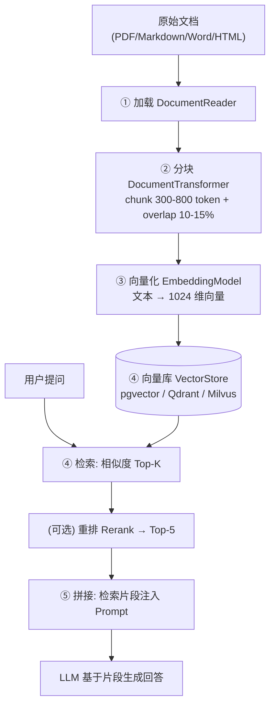
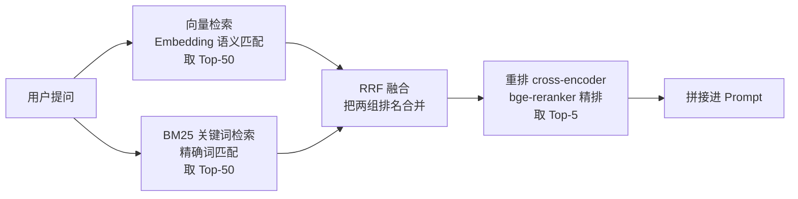

# 06 · 阶段2 · RAG 与知识工程（约 6 周）

---

## 0. 一句话

> **本阶段你只学一件事：把"让大模型基于你的私有知识回答"这件事，从"调参玄学"变成"可度量、可优化的工程"。核心方法论是——先学会评估，再用评估来驱动 RAG 的每一步决策。没有评估，RAG 就是玄学；有了评估，RAG 才是工程。**

---

## 1. 本阶段目标

### 1.1 目标与产出

- **能力目标**：能独立完成一个"上传文档 → 自动问答"的知识库系统（项目 P2），并且能用**量化指标**证明它好在哪里、改了哪里变好了。
- **认知目标**：建立"评估第一"的工程习惯——这个习惯会贯穿你之后所有的 Agent 项目。改 prompt、换模型、调参数之前，先想"我怎么度量这次改动是变好还是变坏"。
- **产出物**：
  1. 一份 30-50 条的 QA 评估集（含正常 / 边界 / 反例三类）；
  2. 一套评估脚本（检索指标 + 生成指标，能跑 A/B 对比）；
  3. 一个可运行的 RAG 问答系统（加载 → 分块 → 向量化 → 检索 → 拼接）；
  4. 一份测试报告：含指标表、A/B 对比结论、选型理由。

### 1.2 市场洞察（为什么要学这个）

- 在国内真实 JD 中，**RAG + Prompt 工程是 AI 应用岗位的基础功**，几乎是"默认会"的硬性要求；只写"会用大模型 API"在简历上没有区分度。
- 在 **AI Agent 工程师 JD** 中，"检索增强（Retrieval-Augmented Generation）"是核心技能簇：Agent 需要记忆、需要工具上下文、需要企业知识，全部依赖检索能力。
- **评估能力是你简历上"能写量化指标"的来源**：大多数候选人只能写"我做过 RAG"，而你能写"我用 40 条评估集验证，把 Recall@5 从 0.52 提到 0.78，faithfulness 稳定在 0.9 以上"。这就是从"会做"到"会扛"的差距。
- 本阶段对应的岗位层级：**L1"会做"（AI 应用开发工程师）**，并为 L2 的 Agent 工程师打基础。

### 1.3 学习纪律：评估前置铁律

> **⚠️ 顺序铁律：评估方法论前置到 RAG 之前。** 第 1-2 周先学评估、先建评估集，第 3 周才开始搭 RAG 管道。理由很简单：
>
> - 没有评估集，你改 chunk size 就是掷骰子；
> - 没有指标，你无法在混合检索 vs 纯向量之间做决定；
> - 没有 A/B 流程，你换了一个 embedding 模型却不知道是好是坏。
>
> **"没评估的改动 = 没做改动"**，这是本阶段及以后所有阶段的纪律。

### 1.4 周任务排期（按每周 10-20 小时安排）

| 周 | 主题 | 产出 | 对应知识小节 |
|:--:|------|------|-------------|
| 第 1 周 | 评估方法论：评估集 + 检索指标 | 30-50 条 QA 评估集（三类用例） | 2.1.2 / 2.1.3 |
| 第 2 周 | 生成评估三件套 + RAGAS | 评估脚本 v1（规则断言 + LLM-as-Judge） | 2.1.4 / 2.1.5 / 2.1.7 |
| 第 3 周 | RAG 管道：加载 + 分块 | 能打印出分块结果，肉眼检查分块质量 | 2.2 |
| 第 4 周 | 向量化 + 向量库 + 检索 | 纯向量检索跑通，产出检索指标**基线** | 2.3 / 2.4 |
| 第 5 周 | 混合检索 + 重排 | 混合 vs 纯向量的 A/B 对比数据 | 2.5 / 2.6 |
| 第 6 周 | 项目 P2 收尾 | 上传 PDF → 问答；全量评估报告 | 全章 |

---

## 2. 核心知识

### 2.0 心智模型：RAG 是什么，为什么不是"调一调就能用"

**RAG（Retrieval-Augmented Generation，检索增强生成）**：当用户提问时，先从你的知识库里检索出相关片段，把片段拼进 Prompt 里，再让大模型基于这些片段回答。

它的存在是因为两个残酷事实：

1. **大模型的知识有截止日期**，训练完就冻结了，不知道你公司内部的最新制度、你的代码库、你的私有数据。
2. **大模型的记忆不可靠**，即使把几千字塞进上下文，它对中段的记忆也差（见 2.6"Lost in the Middle"）。

RAG 的核心理念是"**不背答案，只查答案**"：模型不"记住"你的知识，而是在每次回答前去查。这让知识可以**随时更新**（换文档不用重训模型）、**有据可依**（可以追到是哪篇文档支撑的回答）、**可控成本**（只注入相关片段，不塞整个文档）。



> 注意上图有 5 步但标题说"四步管道"——因为"检索 + 拼接"通常算一步（检索是为了拼接）。本阶段统一用这个心智模型：**加载 → 分块 → 向量化 →（检索 + 拼接）**。

**常见误解破除**：
- ❌ "RAG 就是向量检索" → 向量检索只是中间一步，还有分块、重排、拼接、评估。
- ❌ "文档直接整个塞给模型就行" → 长上下文不能替代 RAG（见 2.6）。
- ❌ "向量库越强 RAG 越强" → 检索质量大部分取决于**分块和 embedding 选型**，向量库只是存储与检索引擎。

---

### 2.1 评估方法论（前置，最重要）

> 这一节是你本阶段**投入产出比最高**的部分。它不只属于 RAG，你以后的 Agent、生产化、架构设计全都要用。

#### 2.1.1 为什么要"评估前置"

没有评估 = 不知道系统好不好、不知道改动有没有用。RAG 系统里每一步都有很多可调旋钮（分块大小、重叠、embedding 模型、TopK、是否重排、是否混合检索、Prompt 措辞），**旋钮越多，越需要一把尺子**。

评估能回答三个问题：
1. **现状**：我的 RAG 现在处于什么水平？（基线 baseline）
2. **改动**：我把 A 改成 B，是变好还是变坏？（A/B 对比）
3. **回归**：我改了分块，会不会把之前的检索搞坏？（回归测试）

评估的完整体系分三层：

| 层 | 对象 | 工具 | 回答什么 |
|----|------|------|---------|
| 检索评估 | 检索结果（Top-K 片段） | Recall@K / MRR / NDCG | 该不该被找出来的，找出来没有 |
| 生成评估 | 最终回答 | 规则断言 / LLM-as-Judge / 人工标注 | 答案对不对、完不完整、有没有编造 |
| 端到端评估 | 整个系统 | RAGAS（faithfulness 等） | 检索 + 生成合起来好不好 |

#### 2.1.2 构建评估集：30-50 条 QA，覆盖正常 / 边界 / 反例

评估集是所有指标的地基。**没有好的评估集，指标再花哨也是空中楼阁。**

**规模**：起步 30-50 条。太多（几百条）初期人工标注成本高；太少（<20 条）指标波动太大，一次改动可能因为噪声误判。30-50 是一个"能看出趋势"的规模（经验值，可随项目扩大）。

**三类用例，缺一不可**：

| 类型 | 定义 | 作用 | 示例（以公司制度文档为例） |
|------|------|------|---------------------------|
| **正常**（normal） | 知识库里有明确答案的常规问题 | 测主路径，占 60-70% | "年假有几天？""报销流程第一步是什么？" |
| **边界**（boundary） | 需要跨多个片段、或模糊、或近似主题的问题 | 测检索与推理的极限 | "年假和病假的区别？"（跨两篇）"加班到晚上十点算调休吗？"（需要组合推断） |
| **反例**（negative） | 知识库里**没有**答案的问题 | 测系统会不会**编造** | "公司有团建旅游福利吗？"（文档里根本没提）——正确行为是"根据现有资料，我无法回答"，而不是胡编 |

**反例是最容易被忽略、也最能暴露问题的用例**。没有反例，你可能做出一个"什么都敢答"的幻觉机器。

**每个用例的字段**（用 JSON 存储，方便脚本读取）：

```json
{
  "id": "Q-001",
  "type": "normal",
  "question": "公司年假制度是怎样的？",
  "relevant_doc_ids": ["doc-012", "doc-013"],
  "gold_reference": "员工入职满一年后享有 5 天年假，每满一年增加 1 天，上限 15 天。"
}
```

字段说明：
- `question`：用户真实问法，不要写得太工整，尽量来自真实使用场景。
- `relevant_doc_ids`：**ground truth（标准答案）**——这条问题应该命中哪些文档片段。这个字段是算 Recall@K / MRR / NDCG 的依据，也是最费人工的部分。
- `gold_reference`：人工标注的标准参考答案。**至少 20 条**必须有这个字段（作为"人工基准"）。

**评估集来源的三个好渠道**：
1. **真实用户日志**：从已有系统/客服记录里翻真实问题（最贴近实际）。
2. **文档事实反推**：把文档里每个明确事实变成一个问题（"文档说了 X，就造一个问 X 的问题"）。每个事实性问题对应一个 `relevant_doc_ids`。
3. **文档结构**：表格、FAQ、章节标题都可以直接转成问答。

> **坑**：评估集与调参"过拟合"。反复用同一评估集调参，系统会慢慢"背下"评估集答案，指标虚高但真实场景不行。缓解：定期从真实日志补充新题，或留 20% 评估集做"留出集"只在最后测一次。

#### 2.1.3 检索评估指标：Recall@K / MRR / NDCG

这三个指标评估**检索这一步**：给定问题，检索返回的 Top-K 片段里，该命中的命中了吗？命中的排得靠前吗？

它们共同的前提是评估集里每条问题有 `relevant_doc_ids`（标准答案文档）。下面给出定义、公式、含义，以及一个统一的工作示例。

**示例数据**：问题 Q 在知识库里有 3 篇相关文档（A、B、C），检索系统返回了 5 条：`[X, A, Y, B, Z]`（X/Y/Z 是无关文档）。

##### (1) Recall@K —— "该找的，找全了吗"

**定义**：前 K 条结果里命中的相关文档数 ÷ 该问题在知识库中的相关文档总数。

```
Recall@K = |返回的前 K 条中命中的相关文档| / |知识库中全部相关文档|
```

**计算**（K=5）：命中 A、B 两篇 → `Recall@5 = 2/3 ≈ 0.67`。

**测什么**：检索的**查全率**——相关的没被漏掉。RAG 里漏掉关键片段 = 回答必然缺料。Recall@5 是本阶段最核心的检索指标。

##### (2) MRR（Mean Reciprocal Rank）—— "第一个对的，排多靠前"

**定义**：对每条问题，取"第一个命中的相关文档"的排名的倒数；多问题取平均。

```
MRR = (1/|Q|) · Σ_{q∈Q} 1 / rank_q
rank_q = 第一个相关文档在返回列表中的位置（从 1 开始）
```

**计算**：返回 `[X, A, Y, B, Z]`，第一个相关文档 A 在第 2 位 → 该问题贡献 `1/2 = 0.5`。若三条查询的第一个命中分别在第 1、3、5 位，则 `MRR = (1/1 + 1/3 + 1/5)/3 ≈ 0.511`。

**测什么**：检索的"首答质量"——它不关心找到几个，只关心**第一个对的多快出现**。适合"用户只想要一个答案"的场景。注意 MRR 只奖励第一条命中的位置，后面的命中它完全无视。

##### (3) NDCG@K（Normalized Discounted Cumulative Gain）—— "排得有多理想"

**定义**：对返回列表按"位置越靠前权重越大"打分，再用理想排序归一化。

```
DCG@K = Σ_{i=1..K} (2^rel_i − 1) / log₂(i + 1)
NDCG@K = DCG@K / IDCG@K
IDCG@K = 把相关文档全部排在最前面时算出的 DCG@K（理想情况）
```

其中 `rel_i ∈ {0,1}`（二元相关：命中=1，无关=0），也可以用分级相关（0/1/2）。

**计算**（K=5，返回 `[X, A, Y, B, Z]` → 相关性 `[0,1,0,1,0]`）：
- `DCG@5 = 0/log₂2 + 1/log₂3 + 0 + 1/log₂5 + 0 = 1/1.585 + 1/2.322 ≈ 0.631 + 0.431 ≈ 1.062`
- 理想排序 `[A, B, C]` 对应相关性 `[1,1,1,0,0]`：`IDCG@5 = 1/log₂2 + 1/log₂3 + 1/log₂4 = 1 + 0.631 + 0.5 = 2.131`
- `NDCG@5 = 1.062 / 2.131 ≈ 0.498`

**测什么**：**排名质量**——不只关心有没有命中，还惩罚"命中的排太靠后"。它是三者里信息量最大的，既看查全又看排序。

##### 三者对比速查

| 指标 | 公式一句话 | 测什么 | 忽略什么 | RAG 里怎么用 |
|------|-----------|--------|---------|-------------|
| Recall@K | 命中的 ÷ 全部相关 | 查全率 | 排序位置 | **主指标**：漏料必出错 |
| MRR | 第一个命中的排名的倒数 | 首答位置 | 命中数量 | 单答案问答场景 |
| NDCG@K | 按位置加权后的归一化 | 排序质量 | （不忽略，信息最全） | 精排/重排效果的衡量 |

**这三个指标怎么一起看**：Recall@K 低 → 检索根本没召回，先改分块/embedding/检索方式；Recall@K 高但 NDCG 低 → 相关文档被召回了但排得靠后，考虑重排或调整 TopK。

**Java 参考实现**（可直接用在你的评估脚本里）：

```java
public record RetrievalMetrics(double recallAt5, double mrr, double ndcgAt5) {}

// 注意：评估脚本里"相关文档"用 id 判断，所以检索结果必须能拿到 Document.getId()
public static RetrievalMetrics computeMetrics(List<String> retrievedIds, Set<String> relevantIds) {
    return new RetrievalMetrics(
        recallAtK(retrievedIds, relevantIds, 5),
        mrr(retrievedIds, relevantIds),
        ndcgAtK(retrievedIds, relevantIds, 5)
    );
}

static double recallAtK(List<String> retrieved, Set<String> relevant, int k) {
    if (relevant.isEmpty()) return 0;
    long hit = retrieved.stream().limit(k).filter(relevant::contains).count();
    return (double) hit / relevant.size();
}

static double mrr(List<String> retrieved, Set<String> relevant) {
    for (int i = 0; i < retrieved.size(); i++) {
        if (relevant.contains(retrieved.get(i))) return 1.0 / (i + 1);
    }
    return 0;
}

static double ndcgAtK(List<String> retrieved, Set<String> relevant, int k) {
    double dcg = 0;
    for (int i = 0; i < Math.min(retrieved.size(), k); i++) {
        int rel = relevant.contains(retrieved.get(i)) ? 1 : 0;
        if (rel > 0) dcg += rel / (Math.log(i + 2) / Math.log(2)); // log2(i+1)
    }
    // 理想排序：所有相关文档排在最前
    double idcg = 0;
    int n = Math.min(relevant.size(), k);
    for (int i = 0; i < n; i++) {
        idcg += 1.0 / (Math.log(i + 2) / Math.log(2));
    }
    return idcg == 0 ? 0 : dcg / idcg;
}
```

#### 2.1.4 生成评估三件套

检索指标只证明"片段找得对不对"，不证明"回答好不好"。**回答质量**需要另一套体系，业界沉淀出"三件套"，按成本从低到高：

##### 第 1 件：规则断言（打底，成本最低）

用**确定性代码**检查回答是否满足硬性要求，不依赖任何 LLM。

| 断言类型 | 例子 | 怎么实现 |
|---------|------|---------|
| 关键事实包含 | 回答必须包含"5 天""年假" | `answer.contains("5")`（粗糙）；更稳：用正则或分词匹配关键词 |
| 格式正确 | 必须输出 JSON、必须提到引用来源 | 正则 / 解析 |
| 反例不发散 | 反例问题的回答**不能**出现特定断言 | 检查回答是否含"无法回答/资料中没有"这类措辞 |
| 长度合理 | 回答过长过短都警告 | `answer.length()` |

**优点**：零成本、100% 确定性、跑一万次结果一致。**缺点**：只能检查表面的、可枚举的规则，测不了"语义对不对"。所以它叫"打底"——保证硬底线，不测软质量。

**反例用例的规则断言很有价值**：对每条反例，断言"回答里要么说不知道、要么给的是资料内内容，绝不能自信地编造"。这是防幻觉的第一道闸。

##### 第 2 件：LLM-as-Judge（主力，成本中等）

用一个 LLM 给另一个 LLM 的回答打分（或做比较）。这是本阶段**最重要的评估手段**，因为回答质量本质上是语义问题，规则写不全，只能让模型判断。

三种判题范式：

| 范式 | 做法 | 适用 |
|------|------|------|
| **评分（pointwise）** | 给回答按 1-5 分打分（带评分标准 rubric） | 绝对质量 |
| **对比（pairwise）** | 两个回答放一起，判谁更好 | A/B 对比 |
| **多维度** | 分"忠实度/完整性/格式"等多个维度各打分 | 需要细粒度反馈 |

**判题示例**（评分 + rubric）：

```
你是一名严格的 RAG 系统质量评审员。请按以下维度给回答打分（1-5）：
- 忠实度（faithfulness）：回答是否完全基于给定的参考片段，有没有编造；
- 完整性（completeness）：问题问到的点是否都答到了；
- 简洁性（conciseness）：有没有废话。

问题：{{question}}
参考片段：{{retrieved_context}}
回答：{{answer}}

请输出 JSON：{"faithfulness": 4, "completeness": 3, "conciseness": 5}
```

> **注意**：判题模型建议用比生成模型更强/不同的模型，避免"自己判自己"过于宽容（同源模型的系统性偏差）。生产实践里常见"生成用 A 模型、裁判用 B 模型（更强）"。

##### 第 3 件：人工标注（基准，最贵但最权威）

人工对**至少 20 条**评估集给出"标准答案"（`gold_reference`）和相关文档（`relevant_doc_ids`）。它的三个用途：

1. **验证检索指标**：`relevant_doc_ids` 是算 Recall@K 的依据；
2. **校准 LLM-Judge**：拿这 20 条让 Judge 打分，看 Judge 和人的一致率（如 Cohen's Kappa）。一致率低 → Judge 的 rubric 或模型选得不对，要调整；
3. **作为终极基准**：任何自动化指标都不能替代人在关键用例上的判断。

**三层协作关系**：规则断言守底线 → LLM-Judge 批量铺量 → 人工标注抽检校准。**没有人工，Judge 可能"自嗨"；没有人看 Judge，规则就永远测不到语义。**

#### 2.1.5 LLM-as-Judge 的两个经典坑

**坑 1：位置偏置（Position Bias）**。做 A/B 对比时，同一个回答放在前面 vs 放在后面，Judge 给出的结论会不同——模型有"偏好第二个/偏好第一个"的系统性倾向。

**缓解手段**（择一或组合）：
1. **随机打乱顺序**：每条对比做两次，A/B 和 B/A 各跑一次，取"两次都说同一个好"的才算赢；
2. **改为评分制**（pointwise）：不直接比，而是各自打分再比分数，绕过"排序"本身；
3. **换更强模型做裁判**：强模型的位置偏置更弱。

**坑 2：自我偏好偏置（Self-Preference Bias）**。Judge 模型和自己同源时，会倾向给自己同类模型的输出打高分。缓解：裁判用不同厂商/更强模型，或至少和生成模型不同型号。

**坑 3：判题 prompt 不固定**。每次判题 prompt 微调，结果就不可比。评估判题 prompt 一旦定稿就**冻结**，跟代码一起进版本管理。

#### 2.1.6 A/B 对比方法论：一次只改一个变量

你要比较"方案 A vs 方案 B"（比如 chunk 400 vs chunk 800、纯向量 vs 混合检索），必须遵守纪律：

1. **一次只改一个变量**。改了 chunk size 就不要再同时换 embedding 模型，否则指标变了你不知道是谁的功劳/锅。
2. **跑全量评估集**。不要只跑几条"看起来有意思"的问题——那叫挑数据。
3. **控制一切无关条件**：同一个评估集文件、同一个向量库数据、同一个温度（建议温度固定 0，减少生成随机性）、同一批评估脚本。
4. **记录配置快照**：每次实验记录"模型版本、embedding 模型、chunk 参数、检索方式、TopK、是否重排、Prompt 版本、评估集版本"。用一个 `experiments.md` 或表格维护，否则两周后你就忘了哪个指标对应哪个配置。
5. **结论用数据说话**：输出"配置 A：Recall@5=0.72，faithfulness=0.88；配置 B：Recall@5=0.78，faithfulness=0.90 → 结论：B 在召回上更优，收益主要来自混合检索，代价是 30ms 延迟"。
6. **对噪声要有认知**：30-50 条评估集的指标有波动，单条差异 <2-3% 不一定可信（经验值）。要更严谨需配对显著性检验或扩大评估集。

**实验记录表模板**：

| 日期 | 实验 ID | 改动变量 | 其他配置 | Recall@5 | MRR | NDCG@5 | faithfulness | 结论 |
|------|:--:|---------|---------|:--:|:--:|:--:|:--:|------|
| 08-05 | E01 | 基线：纯向量 topK5 | bge-m3 / chunk400 | 0.52 | 0.61 | 0.48 | 0.86 | 基线 |
| 08-05 | E02 | 分块 400→800 | 同上 | 0.58 | 0.64 | 0.53 | 0.87 | 大块召回更好 |
| 08-07 | E03 | 加 BM25+RRF | 同上 | 0.71 | 0.73 | 0.66 | 0.89 | 混合检索明显提升 |
| 08-07 | E04 | 加 rerank top5 | 同上 | 0.72 | 0.75 | 0.74 | 0.90 | 重排提升排序 |

#### 2.1.7 RAGAS 框架：三个开箱即用的生成指标

**RAGAS**（Retrieval-Augmented Generation Assessment）是目前最流行的 RAG 评估开源框架（Python），它把"回答质量"拆成几个可自动计算的指标。你需要**理解它三个核心指标的原理**，这样哪怕你在 Java 里自己实现（或只跑一个 Python 报告脚本），也能对齐业界口径。

##### (1) faithfulness（忠实度）—— 回答有没有"凭空编造"

**含义**：回答里的论断，有多大比例能被检索到的上下文支撑。

**原理**（两步，都靠 LLM）：
1. 把回答拆成若干**事实论断**（claims），每条是一个可判断真假的陈述句；
2. 逐条问 LLM"该论断是否被给定上下文支持"；
3. `faithfulness = 被支持的论断数 / 论断总数`。

**取值范围** [0,1]，越高越好。**它直接测幻觉**：如果回答编造了上下文里没有的内容，论断落空，faithfulness 就低。**它独立于"答案对不对"**——哪怕答案是错的，只要错的内容是上下文里写的，faithfulness 也可以是 1.0（所以必须配合检索指标一起看）。

```
faithfulness = |被上下文支持的论断| / |回答中的全部论断|
```

**Java 参考实现**（用 LLM 做两步判断）：

```java
@Component
public class FaithfulnessScorer {

    private final ChatClient judgeClient;

    public FaithfulnessScorer(ChatModel judgeModel) {
        this.judgeClient = ChatClient.builder(judgeModel).build();
    }

    public double score(String question, String answer, String context) {
        // 第一步：让 LLM 从回答中抽取论断，一行一条
        String extractPrompt = """
            从下面的回答中抽取所有"事实论断"（可独立判断真假的陈述句），
            每行输出一条，不要编号，不要额外解释。

            回答：
            %s
            """.formatted(answer);
        String claims = judgeClient.prompt().user(extractPrompt).call().content();
        if (claims == null || claims.isBlank()) return 0.0;

        List<String> claimList = claims.lines()
                .map(String::trim).filter(s -> !s.isEmpty()).toList();
        if (claimList.isEmpty()) return 0.0;

        // 第二步：逐条判断是否被上下文支持
        long supported = claimList.stream()
                .filter(claim -> isSupported(claim, context))
                .count();
        return (double) supported / claimList.size();
    }

    private boolean isSupported(String claim, String context) {
        String prompt = """
            判断下面这条论断是否被参考上下文支持。只回答 yes 或 no。

            论断：%s

            参考上下文：
            %s
            """.formatted(claim, context);
        String r = judgeClient.prompt().user(prompt).call().content();
        return r != null && r.trim().toLowerCase().startsWith("yes");
    }
}
```

> 生产环境请用结构化输出（`call().entity(...)`）替代脆弱的字符串解析（阶段 1 已学过结构化输出）。上面的解析方式仅用于理解原理。

##### (2) answer_relevancy（答案相关性）—— 回答是不是"答非所问"

**含义**：回答与问题的相关程度，同时惩罚"冗余废话"。

**原理**（RAGAS 的经典实现）：
1. 让 LLM 根据**回答**反推若干条"这个回答能回答的问题"（生成式）；
2. 把这些反推问题 embedding，与原问题 embedding 逐一算余弦相似度；
3. 取平均。回答越冗余、越偏离原问题 → 反推问题和原问题越不像 → 分数越低。

**取值范围** [0,1]，越高越好。**注意它的奇怪之处**：它不直接看"回答内容对不对"，而是看"回答像不像在回答这个问题"——所以它测的是**偏离度**，不是正确性。faithfulness 管"没编造"，answer_relevancy 管"没跑题"。

##### (3) context_precision（上下文精度）—— 检索到的片段是不是"有用"

**含义**：检索到的上下文片段里，有多大比例是对回答该问题有用的，并且**有用的排得越靠前越好**。

**原理**：
1. 对每个检索到的片段，用 LLM 判断它是否与问题相关（是/否）；
2. 用类似 NDCG 的"位置加权精度"聚合：`context_precision@K = Σ_k (precision@k × v_k) / 相关片段总数`，其中 `v_k` 是第 k 位片段是否相关，`precision@k` 是前 k 位的命中率。

**取值范围** [0,1]，越高越好。**它测检索的"纯度"**：召回了一堆片段，但前面全是无关的 → 分低。这个指标和检索指标（Recall/MRR）互补：检索指标用人工标注的 `relevant_doc_ids` 算，context_precision 用 LLM 自动判断，能在大规模上跑。

**RAGAS 指标总览**：

| 指标 | 一句话 | 测什么 | 用 LLM 吗 | 依赖 |
|------|--------|--------|:--:|------|
| faithfulness | 论断被上下文支持的比例 | 幻觉 | ✅ | 检索片段 + 回答 |
| answer_relevancy | 回答是否答非所问/冗余 | 跑题 | ✅ | 原问题 + 回答 |
| context_precision | 检索片段有用且排得前 | 检索纯度 | ✅ | 问题 + 检索片段 |

> **实操建议**：RAGAS 本身是 Python 库，你的主栈是 Java。推荐两种方式：① 在 Java 里按上面原理自己实现 faithfulness（代码示例已给），其余指标照公式实现；② 项目收尾时写一个小的 Python 报告脚本调 RAGAS，输出与 Java 指标互相印证。**你懂原理，工具只是实现细节。**

---

### 2.2 RAG 四步管道

#### 2.2.1 管道总览

Spring AI 用三个抽象把管道串起来，理解它们你就懂了整个框架的 RAG 设计：

| 抽象 | 接口 | 作用 | 对应管道步骤 |
|------|------|------|-------------|
| `DocumentReader` | `List<Document> get()` | 把各种格式的原始文件读成 `Document` | ① 加载 |
| `DocumentTransformer` | `List<Document> apply(List<Document>)` | 对文档做变换（分块、清洗、切段） | ② 分块 |
| `DocumentWriter` | `void write(List<Document>)` | 把文档写进存储（向量库） | ③④ 入库 |
| `VectorStore` | `add() / similaritySearch()` | 存储向量 + 相似度检索 | ③④ 检索 |
| `QuestionAnswerAdvisor` | 聊天 Advisor | 检索并把片段拼进 Prompt | ⑤ 拼接 |

`Document` 的结构：`id`（唯一标识）、`text`（文本内容）、`metadata`（KV 元数据，如来源文件名、页码、章节）。**在算检索指标时，`id` 就是 `relevant_doc_ids` 对应的键，所以入库时务必保证 id 稳定可追踪。**

#### 2.2.2 加载（DocumentReader）

把 PDF / Word / Markdown / HTML / 网页 / JSON 等读成 `List<Document>`。

Spring AI 常用实现：

| 类 | 用途 |
|----|------|
| `TikaDocumentReader` | 万金油：PDF、Word、HTML 等都能解，靠 Apache Tika |
| `ParagraphPdfDocumentReader` / `PagePdfDocumentReader` | 专门读 PDF，按段落/按页切 |
| `MarkdownDocumentReader` | 读 Markdown，能保留标题结构到 metadata |
| `JsonReader` | 读 JSON，按字段切 |
| `TextDocumentReader` | 读纯文本 |

```java
// 加载一个 PDF：Tika 自动识别格式
DocumentReader reader = new TikaDocumentReader(new ByteArrayResource(pdfBytes));
List<Document> rawDocs = reader.get();
// rawDocs 里的 Document 默认 metadata 带文件名、页码等信息
```

> **坑**：PDF 里的表格、扫描件（图片型 PDF）Tika 解出来可能是乱码或无内容。扫描件需要 OCR（超出本阶段范围，知道有这回事即可）。加载后**务必抽样打印几条**，确认没解成乱码再往下走。

#### 2.2.3 分块（DocumentTransformer）—— 最影响检索质量的一步

分块为什么重要：向量检索是"整段匹配语义"，块太大，块内主题混杂，query 的语义被稀释，检索模糊；块太小，语义不完整，单块提供不了回答所需信息，且块数暴增、索引变大。

**经验起点（需用评估集调）**：
- **chunk size（块大小）：300-800 token**；
- **overlap（相邻块重叠）：10-15%**（防止关键句正好被切在块边界上而丢失）；
- 中文按 token 估算：**1 token ≈ 0.5 个汉字**（经验值），所以 400 token ≈ 800 汉字左右。

```java
// 分块：按 token 数切，400 token 一块
DocumentTransformer splitter = TokenTextSplitter.builder()
    .defaultTokenSize(400)      // 目标块大小 400 token
    .minTokenSize(80)           // 太短的块并入相邻块（经验值）
    .keepSeparator(true)        // 保留段落分隔符，避免句子被硬切
    .build();
List<Document> chunks = splitter.apply(rawDocs);
```

> ⚠️ **API 说明**：Spring AI 不同版本 `TokenTextSplitter.builder()` 的方法名/是否支持 overlap 有差异，**以上写法为 1.x-2.x 常见形态，具体字段名以官方文档为准**。若你用的版本不支持 overlap，可改用 chunk 稍小 + 自定义切分（例如先按段落切、再把超长段落按 token 切）。

**分块不是无脑按字符数切**，常见的分块策略（从粗到细）：

| 策略 | 做法 | 优点 | 缺点 | 适用 |
|------|------|------|------|------|
| 固定字符/token | 按固定长度切 + overlap | 简单、可控 | 可能切断语义（切在句子中间） | 起步 |
| 按段落/标题切 | 以 Markdown 标题、段落为边界 | 语义完整 | 段落可能过长/过短不均 | 结构良好的文档 |
| 递归字符切 | 按优先级（段落→句子→词）逐级切 | 兼顾完整与均匀 | 实现略复杂 | 生产常用 |
| 语义切 | 按语义相似度聚簇切 | 块内主题最纯 | 计算成本高 | 进阶 |

**用评估集调 chunk 的方法**：固定其他配置不变，分别跑 chunk=300/400/600/800 的四组实验（A/B/C/D），对比 Recall@5 和 faithfulness，选最优。**不要凭感觉定 chunk，要让数据替你定。**

**两个常见分块坑**：
1. **表格/代码被切碎**：表格的一行被分到两个块里，语义断裂。处理：表格类文档先按行/整表作为一个"原子块"保护起来，再分其他文本。
2. **块边界切断关键句**："……导致**系统崩溃**"被切在"崩溃"之前，块里只剩"系统"。overlap 就是为缓解这个问题，但治本要靠"按语义边界切"。

#### 2.2.4 向量化 + 入库

分块后，把每个块文本用 embedding 模型转成向量，连同 `Document` 一起写进向量库。**这一步通常由 `vectorStore.add(chunks)` 一步完成**——Spring AI 的 `VectorStore` 实现内部会调用 `EmbeddingModel`。

```java
// 一步完成：向量化 + 入库
vectorStore.add(chunks);
```

> 概念上它做了两件事：① 用 EmbeddingModel 把每块文本变成向量；② 把 `(id, 向量, 原文, metadata)` 存进向量库。理解这个"两步"很重要，因为**查询时只对 query 做向量化，不重新向量化整个库**。

**入库的两个附加责任**（生产才做，本阶段了解）：
- **去重/幂等**：重复 ingest 同一文档会产生重复块。用文档 hash 或 `id` 约定处理。
- **增量更新**：文档更新后，只重传该文档相关的块，而不是清库重来（用 metadata 里的文档级 id 删除旧块）。

#### 2.2.5 检索 + 拼接（QuestionAnswerAdvisor）

检索：把用户 query 向量化，在向量库里找最相似的 Top-K 块。

```java
// 直接检索（评估脚本里就这么用）
List<Document> topK = vectorStore.similaritySearch(
    SearchRequest.builder()
        .query("公司年假制度是怎样的？")
        .topK(5)                    // 返回 5 条
        .similarityThreshold(0.0)   // 相似度下限，太严会漏检
        .build()
);
```

拼接：把 Top-K 块的文本拼进 Prompt，让 LLM 基于片段回答。Spring AI 的 `QuestionAnswerAdvisor` 封装了这步——它拦截请求，自动检索、自动拼接、自动把来源元数据放进响应。

```java
// 配置一个"带 RAG 的 ChatClient"
@Configuration
public class RagConfig {

    @Bean
    ChatClient ragChatClient(ChatModel chatModel, VectorStore vectorStore) {
        return ChatClient.builder(chatModel)
            .defaultAdvisors(new QuestionAnswerAdvisor(
                vectorStore,
                SearchRequest.builder().topK(5).build()
            ))
            .build();
    }
}

// 使用：像普通聊天一样提问，Advisor 自动完成检索+拼接
@RestController
public class AskController {

    private final ChatClient ragChatClient;

    public AskController(ChatClient ragChatClient) {
        this.ragChatClient = ragChatClient;
    }

    @PostMapping("/ask")
    public String ask(@RequestBody String question) {
        return ragChatClient.prompt()
            .user(question)
            .call()
            .content();
    }
}
```

> **QuestionAnswerAdvisor 在 Spring AI 2.x 中的包路径为 `org.springframework.ai.chat.client.advisor`。若你用的版本类名/包名有调整，以官方文档为准。** 它底层做的拼接类似："下面是检索到的资料片段，请基于它们回答问题：\n[片段1]\n[片段2]..."。你也可以在 Prompt 里自定义拼接模板。

**检索为空的处理**（反例用例的现实版）：检索 Top-5 相似度都很低时，说明知识库里没有相关内容。正确做法是让模型回答"资料中没有相关信息"，而不是硬答。可以在 Prompt 里加一条约束："若检索片段与问题无关，如实告知没有找到相关资料，不要编造。"**这条约束配合反例评估集验证，就是你防幻觉的第一道防线。**

---

### 2.3 Embedding：把文本变成向量

#### 2.3.1 什么是向量、为什么语义相近向量就相近

**Embedding（嵌入）**：把一段文本映射成一个固定长度的浮点数数组（向量），比如 `[0.021, -0.118, ..., 0.064]`（1024 个数字）。关键性质：**语义相近的文本，向量在空间里距离更近**。

原理层面一句话：embedding 模型是经过"对比学习"训练的神经网络——它被训练成"语义相关的句子对，输出向量要靠近；无关句子对，输出向量要远离"。于是"苹果"和"苹果汁"的向量比"苹果"和"数据库"的向量更接近。

> 这不是"模型真的懂语义"，而是**统计共现的模式**——相似的文本在训练语料里以相似的方式出现，于是向量落在相近区域。理解这一点就够了：embedding 是"用向量表达语义相似性"的工程手段，不是魔法。

#### 2.3.2 维度

维度就是向量的长度（数组元素个数）。常见模型维度：

| 模型 | 维度 | 说明 |
|------|:--:|------|
| OpenAI text-embedding-3-small | 1536（可降维到 512 等） | 英文为主，多语能力一般 |
| OpenAI text-embedding-3-large | 3072 | 更准更贵 |
| OpenAI text-embedding-ada-002 | 1536 | 老一代，已被 3 系列取代 |
| **BAAI bge-m3** | **1024** | **中文强，支持 dense/sparse/multi-vector** |
| BAAI bge-large-zh-v1.5 | 1024 | 中文 |
| 各类小模型（text2vec 等） | 768 | 社区模型，参数量小 |

> 维度数字以各模型卡为准（OpenAI 已支持通过 `dimensions` 参数降维）。**三个必须记住的点**：① 维度一旦定下来，全库统一，不能混；② 向量库建表时就要指定维度（`PgVectorStore.dimensions(1024)`），换模型维度不同会导致库不兼容；③ 维度越高表达能力越强但越贵越慢，选型是权衡。

#### 2.3.3 嵌入模型选型（中文场景）

中文场景的实用建议：

| 场景 | 推荐 | 理由 |
|------|------|------|
| 中文为主、要开源可私有部署 | **bge-m3** | 中文检索 SOTA 之一、1024 维、支持多语言，Ollama 一键跑 |
| 中文为主、要走 API | 国产厂商的 embedding API 或 OpenAI 3-large | 看成本与合规 |
| 英文为主 | OpenAI text-embedding-3-small | 性价比高 |
| 预算敏感、本地跑不了大模型 | 小模型（如 bge-small-zh） | 维度低、快，牺牲精度 |

**选型的两个硬标准**：
1. **"同一语言"优先**：中文检索用中文训练的模型（bge-m3 这类），英文模型对中文的语义理解明显差；
2. **"检索时用的模型必须和入库时用的模型完全一致"**——这是最隐蔽的坑：入库用模型 A、查询用模型 B，两个模型的向量空间完全不同，检索必然失效。

**本阶段落地方式**（本地 Ollama 跑 bge-m3，最省事）：

```yaml
spring:
  ai:
    ollama:
      base-url: http://localhost:11434
      embedding:
        options:
          model: bge-m3
```

```bash
# 拉模型（一行搞定）
ollama pull bge-m3
```

#### 2.3.4 相似度度量：余弦

向量间的"距离"有很多种度量，RAG 里最常用**余弦相似度**：

```
cos(q, d) = (q·d) / (‖q‖ · ‖d‖)
          = Σᵢ(qᵢ·dᵢ) / ( √Σqᵢ² · √Σdᵢ² )
```

- 取值范围 **[-1, 1]**，越接近 1 表示方向越一致（越相似）。文本向量基本都是正值，所以实际落在 [0, 1] 附近。
- **重要性质**：余弦相似度对"向量的模长"不敏感，只关心**方向**。这正合适——两个文本一个长一个短，只要语义方向一致，就算相似（不会因为长度差异被冤枉）。

其他度量对比：

| 度量 | 公式要点 | 何时用 |
|------|---------|--------|
| 余弦相似度 cos | 看方向，忽略长度 | **默认选择** |
| 点积 dot | `Σ qᵢ·dᵢ`，同时看方向和长度 | 向量已归一化时 ≈ 余弦；模型/库默认有时用 |
| 欧氏距离 L2 | `√Σ(qᵢ−dᵢ)²`，越小越近 | 某些库默认；注意是"越小越好"，和相似度方向相反 |

> **工程细节**：几乎所有向量库都会在入库时对向量做 **L2 归一化**（把向量长度变成 1），归一化之后"点积 = 余弦相似度"，所以很多库底层用点积实现余弦。你在选 `distanceType` 时（如 pgvector 的 `COSINE_DISTANCE`），知道它在归一化后等价于点积即可，不必纠结。

---

### 2.4 向量库：存向量、查近邻

向量库的职责：存向量 + 做**近似最近邻（ANN）**检索——给定一个 query 向量，快速返回距离最近的 K 个。注意是"近似"，因为精确最近邻在百万级数据上太慢，工业界用近似算法换速度。

#### 2.4.1 主流向量库适用场景对比

| 向量库 | 形态 | 适用场景 | 特点 |
|--------|------|---------|------|
| **pgvector** | Postgres 扩展 | 已有 Postgres、数据量 ≤ 千万级、想和业务数据放一起 | **零额外组件**，SQL 可查，支持 HNSW/IVFFlat，Java 生态最顺 |
| **Chroma** | 嵌入式/本地服务 | 原型、学习、本地单机 | 轻量，Python 生态为主，Java 支持弱 |
| **Qdrant** | 独立服务（Rust） | 中小规模生产，过滤查询多 | 性能好、payload 过滤强、内存可控 |
| **Milvus** | 分布式集群 | 亿级向量、大规模生产 | 功能全、可水平扩展，但运维重 |
| Elasticsearch 8.x | 独立服务 | 已有 ES 的团队 | dense_vector + 关键词检索天然一体，适合混合检索 |
| Redis（RediSearch） | 内存 | 低延迟、小数据集 | 内存贵，适合缓存级场景 |

**一句话选型**（经验值，按你的情况套）：
- **学习/原型**：pgvector（你如果是 Java 后端，Postgres 大概率已是基操，直接用 pgvector 零新组件）。
- **生产中小规模**：Qdrant（性能好、部署简单）。
- **生产大规模（亿级）**：Milvus。
- **公司已有 ES**：直接用 ES 的向量检索，省一套系统。

#### 2.4.2 索引类型：HNSW vs IVF

向量库都靠索引加速 ANN。主流两类索引：

| 维度 | **HNSW**（Hierarchical Navigable Small World） | **IVF**（Inverted File） |
|------|------|------|
| 原理 | 多层近邻图，从粗到细贪心搜索 | 先 K-Means 聚类，搜时定位到最近聚类再桶内扫 |
| 召回率 | 高（图搜索质量好） | 依赖 `nprobe`（探查的聚类数），偏低 |
| 内存占用 | **高**（图结构基本驻留内存） | **低**（聚类 + 可量化压缩） |
| 建索引 | 逐点插入，较慢 | 快，但需要先"训练"聚类（要有足够数据） |
| 关键参数 | `M`（每节点边数）、`efConstruction`、`efSearch` | `nlist`（聚类数）、`nprobe`（搜索时探查几个聚类） |
| 适用 | **默认推荐**，数据量中等的绝大多数场景 | 数据量很大、内存受限 |

**经验参数起点**（以官方文档和实测为准）：
- HNSW：`M=16`，`efConstruction=200`，查询时 `efSearch=50~500`（越大越准越慢）；
- IVF：`nlist≈sqrt(N)`（N 为向量总数），`nprobe` 从 8~32 起步；
- **召回率 vs 速度是 trade-off**，用你的评估集实测：`efSearch`/`nprobe` 增大，Recall@K 上升但延迟上升，找一个"指标不掉、延迟可接受"的点。

**Spring AI + pgvector 落地示例**：

```java
@Bean
VectorStore vectorStore(EmbeddingModel embeddingModel, JdbcTemplate jdbcTemplate) {
    return PgVectorStore.builder(jdbcTemplate, embeddingModel)
        .dimensions(1024)                              // 和 bge-m3 对齐
        .distanceType(VectorStore.DistanceType.COSINE_DISTANCE)
        .indexType(VectorStore.IndexType.HNSW)         // 默认即可，也可 IVFFLAT
        .schemaName("public")
        .vectorTableName("knowledge_chunks")
        .initializeSchema(true)                        // 自动建表
        .build();
}
```

> ⚠️ **API 说明**：`PgVectorStore.builder(...)` 在 Spring AI 2.x 中仍在，但 `IndexType` 枚举值（HNSW / IVFFLAT 等）与 builder 字段**以官方文档为准**。更省事的做法是用自动配置：引入 `spring-ai-starter-vector-store-pgvector` 后，在 yml 里写 `spring.ai.vectorstore.pgvector.*` 配置，框架自动装配 `VectorStore` Bean（你只需注入）。两种方式都能落地，手动 Bean 的好处是参数显式可控，适合学习。

**Spring AI VectorStore 抽象的价值**：`VectorStore` 是统一接口，pgvector / Chroma / Qdrant / Milvus 都有对应实现。你的业务代码只依赖接口，换向量库只换 starter 依赖和配置，业务逻辑不动——这就是抽象的意义，也是你后面做"向量库选型"能快速验证不同库的基础。

**向量库的三个坑**：
1. **维度不匹配**：库建表用 1536 维，换 bge-m3（1024 维）后 `add` 直接报错。换模型必须重建表。
2. **相似度阈值设太狠**：`similarityThreshold(0.8)` 会把很多其实相关的片段过滤掉 → 召回率暴跌。起步设 0，靠 TopK 控制，不要靠阈值。
3. **没建索引**：小数据没感觉，数据一多全表扫描慢到不可用。生产务必建 HNSW/IVF 索引（`initializeSchema(true)` 或手动建索引）。

---

### 2.5 混合检索 + 重排：召回更稳、排序更准

#### 2.5.1 为什么纯向量检索不够

向量检索（语义）有它的盲区：**它对精确关键词匹配不敏感**。"Spring AI 2.0 的 ChatClient 怎么用"——向量检索可能把"聊聊 Spring AI 的新特性"的语义相似片段召回来，却漏掉真正写"ChatClient"用法的那一段。反过来说，BM25 这类关键词检索能精确命中"ChatClient"，但对同义词、口语化表达无能为力。

**结论**：语义检索和关键词检索是互补的。混合检索 = 两种都跑 + 融合结果。



#### 2.5.2 BM25：关键词检索

BM25 是"改进版 TF-IDF"：给每个文档和 query 算相关性分。核心直觉：
- 词在文档里出现得多 → 相关（TF 部分）；
- 词在**整个语料**里越稀有 → 越有区分度（IDF 部分）；
- 文档越长，对词的"多"越宽容（长度归一化）。

`BM25(d, q) = Σ_{term∈q} IDF(term) · [ f(term,d)·(k₁+1) ] / [ f(term,d) + k₁·(1 − b + b·|d|/avgdl) ]`

参数：`k₁`（词频饱和，默认 1.2~2.0）、`b`（长度惩罚，默认 0.75）。**这些默认值基本不用动，理解"它是关键词检索"即可，细节以你选用的检索实现文档为准。**

在 Java 里做 BM25 有两条路：① 用 Elasticsearch / OpenSearch 的关键词查询；② 用 PostgreSQL 的全文检索（`tsvector`，配 pgvector 同一个库就能实现混合）。本阶段若只想跑通混合检索，pgvector 同库做 BM25 是性价比最高的（不用引新系统）。

#### 2.5.3 RRF 融合（Reciprocal Rank Fusion）

混合检索要回答一个问题：向量检索和 BM25 各给了一份排名，**怎么合并成一份**？

最简单的合并是分数加权，但两种检索的分数尺度完全不同（余弦相似度 0~1，BM25 分可以到几十），直接加没意义。**RRF 不比较分数，只比较排名**：

```
RRF(d) = Σ_{r ∈ 检索器集合} 1 / (k + rank_r(d))
```

- `rank_r(d)`：文档 d 在检索器 r 的返回列表中的排名；
- `k`：平滑常数，**经验默认 60**（来自 RRF 原始论文的调优）；
- 直觉：在任一检索器里排第 1 → 贡献 `1/61`；排第 50 → 贡献 `1/110`。**两边都排得靠前的文档，RRF 分最高。**

**为什么 RRF 好用**：它对排名敏感、对分数尺度不敏感、实现简单、鲁棒——这就是它成为工业默认融合法的原因。

**RRF 的局限**：它对"某个检索器强烈认为相关、另一个完全没召回"的文档不友好（只有单边贡献，分不高）。所以混合检索里两个检索器的 TopK 都要给够（如各取 Top-50 再融合），别只取 Top-5。

#### 2.5.4 重排（Rerank）：cross-encoder

检索（召回阶段）用**bi-encoder**（双塔：query 和 doc 分别过编码器算相似度）——快，但 query 和 doc 之间没有交互，精度有限。**重排用 cross-encoder**：把 query 和 doc **拼在一起**喂给模型，让模型逐词比对，直接输出相关性分——慢，但准得多。

```
双塔/向量检索（bi-encoder）:  q → 向量     d → 向量       cos(q,d)     快，粗筛
重排（cross-encoder）:         [q;d] → 模型 → 相关性分     慢，精排
```

**典型流程**：向量/混合检索先召回 Top-50 → cross-encoder 对这 50 条逐条打分 → 取 Top-5 进 Prompt。这样 5 万条文档也只对 50 条做昂贵精排，成本可控。

**中文重排模型**：BAAI 的 **bge-reranker 系列**（如 `BAAI/bge-reranker-v2-m3`）。它是 cross-encoder，直接给"query-passage"对打分。

**Spring AI 落地**：Spring AI 提供 `DocumentRanker` 抽象（`List<Document> rank(String query, List<Document> documents)`），实现有基于 ONNX 的 `OnnxDocumentRanker`（可加载 bge-reranker 转出的 onnx 模型）和基于 HuggingFace TEI 服务的 `TeiDocumentRanker`。

```java
// 流程：召回 Top-50 → 重排 → Top-5
List<Document> candidates = vectorStore.similaritySearch(
    SearchRequest.builder().query(question).topK(50).build()
);

List<Document> reranked = documentRanker.rank(question, candidates);  // cross-encoder 打分排序
List<Document> top5 = reranked.stream().limit(5).toList();
```

> ⚠️ **API 说明**：`DocumentRanker` 的接口方法与实现类（ONNX/TEI）在 Spring AI 2.x 中**以官方文档为准**。若不引额外组件，本阶段最小做法：先用 Spring AI 的 `VectorStore` 检索 + 自己写一个简单的重排（比如基于 BM25 二次打分，或直接调用一个本地 reranker 服务的 HTTP 接口），体会"先召回后精排"的思想即可。

**重排能带来什么**：召回阶段"该有的都召回了但顺序乱"时，重排提升最明显——NDCG、MRR 会显著上升，而 Recall 变化不大（Recall 是召回阶段决定的）。**用你的评估集分别测"不重排 vs 重排"的 MRR/NDCG，用数据决定要不要上重排。**

---

### 2.6 "Lost in the Middle"：长上下文不能替代 RAG

**论文**：Liu et al. 2023, *Lost in the Middle: How Language Models Use Long Contexts*。

**核心发现**：把关键信息放在长上下文的不同位置，模型的使用效果呈 **U 形曲线**——**开头和结尾的信息用得好，中间的信息最容易"丢失"**。实验覆盖了 GPT-3.5-turbo、Claude 1.3 等多个模型，均观察到该现象（论文实验的模型为当时的主流模型；2024 年后更强的模型在长上下文上有改善，但多文档、中段推理的退化仍然存在，且代价随长度线性增长）。

**U 形曲线怎么读**（示意，非精确数值）：横轴是信息在上下文中的位置（从开头到结尾），纵轴是模型"成功利用该信息的概率"。开头段利用率最高，随位置深入中间持续走低（谷底在全文约 50% 处），到结尾段又回升。即：**两头高、中间低**。

**对工程的三条启示**：

1. **长上下文 ≠ RAG 替代品**。把 10 万 token 的文档整个塞进上下文，中间的事实照样记不住，而且：
   - 成本随长度线性增长（输入 token 全计费）；
   - 延迟变长；
   - 关键信息被淹没。→ **用 RAG 只注入相关片段，信息密度高、成本低、可更新。**

2. **Prompt 布局有讲究**：把最重要的信息放在 Prompt 的**开头**（紧跟 system）或**结尾**（紧跟用户问题），别埋中间。如果拼接了多条检索片段，把最相关的那条放最前。

3. **"长上下文 vs RAG"是取舍不是二选一**：
   | 场景 | 选 |
   |------|-----|
   | 一次性给模型一份大文档让读完全局 | 长上下文 |
   | 持续更新、大语料、只回答相关问题 | RAG |
   | 又要全局又要相关 | 混合：RAG 检索 + 相关片段放首尾 |

> 这个知识点也是你后面"成本工程"（阶段 4）里"L4 长上下文克制"的理论依据——能克制住"能用 200K 窗口就不想搭 RAG"的冲动，是有研究支撑的。

---

### 2.7 进阶主题（本阶段可提、别展开，知道"有这些武器"即可）

以下都是 RAG 的进阶增强手段，**本阶段只需各用两三句话理解"解决什么问题、怎么工作"**，留待生产化阶段（阶段 4/6）深入。

#### (1) Contextual Retrieval（上下文检索，Anthropic 2024）

**问题**：单个块脱离文档上下文后，语义变模糊（一块写着"它的价格是 500 元"，"它"指什么没人知道）。embedding 时信息不足 → 检索失败。

**做法**：入库前，给每个块**拼上它所在的上下文说明**再向量化——用 LLM 生成"这个块所属文档/前文主旨"的一句话，加在块前面（对 BM25 也生效，Anthropic 报告把检索失败率降低约三分之一到一半，**具体数字以原文为准**）。代价是每块额外 token 成本。

```
原块: "它的价格是 500 元"
处理后: "[这是关于'公司 XX 产品订阅套餐'文档的片段：] 它的价格是 500 元"
```

#### (2) Parent-Child 分块（父子分块）

**问题**：小块检索精确但上下文不足；大块上下文足但检索模糊。

**做法**：**索引小块（child）、返回大块（parent）**。检索时用小块的向量精确定位，命中后把包含该小块的大块（父块）拼进 Prompt，保证"定位准 + 上下文全"。

#### (3) HyDE（Hypothetical Document Embeddings, Gao et al. 2022）

**问题**：query 和文档的"表述风格"经常不一致（用户口语 vs 文档书面语），检索匹配不佳。

**做法**：检索前先让 LLM **根据 query 生成一段假设性的答案文档**，把这段"假设答案"拿去向量化检索，用它和文档匹配（文档更可能和"答案"相似，而不是和"问题"相似）。适合生成能力强的模型；代价是额外一次 LLM 调用。

#### (4) Query Rewrite（查询改写）

**问题**：用户问得模糊、口语化、或包含指代（"那它呢？"），直接拿去检索效果差。

**做法**：检索前先让 LLM 把 query **改写成适合检索的规范表述**（补全指代、展开缩写、提取关键词）；变体还有 **Multi-Query**（把一个问题拆成多个角度分别检索再合并）。

---

## 3. 动手任务（可执行清单）

> 建议顺序就是执行顺序。每完成一项打勾，并写进你的实验记录表。

### 阶段 A：评估先行（第 1-2 周）

- [ ] **A1. 选一个知识库主题**：用你自己熟悉的内容（如你公司的某份制度文档、某开源项目 README、你写的技术笔记），**中文文档 5-20 页**。
- [ ] **A2. 建评估集**：手写 30-50 条 QA，存成 JSON（字段含 id/type/question/relevant_doc_ids/gold_reference），覆盖：
  - [ ] 正常 60-70%
  - [ ] 边界 15-20%（跨片段、需要组合推断）
  - [ ] 反例 10-15%（知识库里没有答案）
  - [ ] 其中 **至少 20 条**人工写好 `gold_reference`
- [ ] **A3. 写检索指标计算脚本**：用 2.1.3 的 Java 代码实现 `computeMetrics`（Recall@5 / MRR / NDCG@5），能读评估集 JSON 并输出汇总。
- [ ] **A4. 写生成评估脚本 v1**：实现规则断言（至少覆盖：正常用例关键事实包含 + 反例用例"没有编造"断言）。
- [ ] **A5. 搭 LLM-as-Judge**：实现 faithfulness 打分（2.1.7 代码）和一个 1-5 分 rubric 评分。
- [ ] **A6. 校准 Judge**：拿人工标注的 20 条，对比 Judge 分数与人工判断，记录一致率；若明显不一致，调整判题 prompt（冻结判题 prompt）。

### 阶段 B：搭管道（第 3-5 周）

- [ ] **B1. 加载**：用 `TikaDocumentReader` 读你的文档，打印 3 条原始 Document 确认解析正确。
- [ ] **B2. 分块**：用 `TokenTextSplitter` 分块，肉眼检查 5 个块：有没有切断句子、有没有丢表头。调整参数直到分块"看起来合理"。
- [ ] **B3. 向量化 + 入库**：配置 bge-m3（Ollama）或你选的 embedding 模型，`vectorStore.add(chunks)` 入库，打印向量库记录数。
- [ ] **B4. 检索基线**：用评估集全部问题跑 `similaritySearch`，算出 **Recall@5 / MRR / NDCG@5 基线**，记进实验记录表（E01）。
- [ ] **B5. chunk 实验**：跑 chunk=300/400/600/800 四组对比，选最优（E02 等）。
- [ ] **B6. 问答跑通**：配 `QuestionAnswerAdvisor`，能对评估集问题给出回答，并对反例问题验证"不乱编"。
- [ ] **B7. 混合检索**：向量 + BM25（pgvector 全文检索或 ES），RRF 融合；对比"纯向量 vs 混合"的检索指标（E03）。
- [ ] **B8.（可选）重排**：上 `DocumentRanker` 或自定义重排，对比 MRR/NDCG 变化（E04）。
- [ ] **B9. 端到端评估**：跑全量评估集，输出 faithfulness / answer_relevancy（自实现或 RAGAS），填完整实验记录表。

### 阶段 C：收尾（第 6 周）

- [ ] **C1. 写测试报告**：含指标总表、A/B 对比结论、每个决策的理由（为什么这个 chunk、这个向量库、要不要重排）。
- [ ] **C2. 写 README + 演示脚本**：能一键上传 PDF → 问答。
- [ ] **C3. 输出简历素材**：用你自己的话写一段"我建了 40 条评估集，把 Recall@5 从 X 提到 Y，faithfulness 达到 Z"。

---

## 4. 验收标准（可勾选）

> 全部通过才进入下一阶段。硬指标标注"最低要求"。

- [ ] **评估集**：≥30 条 QA，三类用例齐全，≥20 条含人工 `gold_reference`
- [ ] **检索指标**：能独立写出并解释 Recall@K / MRR / NDCG 的计算代码
- [ ] **生成评估**：规则断言 + LLM-as-Judge + 人工标注三件套齐备，能说明各自职责
- [ ] **Judge 校准**：能用人工标注说明 Judge 的可信度（一致率）
- [ ] **A/B 意识**：实验记录表 ≥3 组实验（如 E01 基线、E02 chunk、E03 混合），每组"只改一个变量"
- [ ] **RAG 管道**：能上传 PDF → 自动回答（加载/分块/向量化/检索/拼接全链路跑通）
- [ ] **量化指标**：报告含 ≥3 个指标（如 Recall@5、MRR、faithfulness）
- [ ] **混合检索对比**：有"纯向量 vs 混合"的对比数据与结论
- [ ] **反例不编造**：反例用例上，系统正确说"资料中没有"，不硬编
- [ ] **能讲清三件事**：① 为什么分块 + overlap；② 为什么混合检索；③ 为什么长上下文不能替代 RAG
- [ ] **Git 纪律**：每周 ≥5 次提交，commit message 写清"做了什么、为什么"

---

## 5. 高质量英文资料（自包含精读建议）

> 以下资源按"先看哪个"排序。每一份都给了中文点评，精读建议：先看 1、2、3，再按需看 4、5。

1. **Pinecone Learning Center**（`pinecone.io/learn`）—— RAG 领域最权威的入门系列，从向量、相似度到检索的每一步都讲得最透，配图极好。**你的第一站。**
2. **论文《Lost in the Middle: How Language Models Use Long Contexts》（Liu et al., 2023）**—— 长上下文 U 形记忆曲线的实证论文，"长上下文不能替代 RAG"的第一手依据。读摘要 + 看那几张曲线图就够。
3. **Anthropic《Introducing Contextual Retrieval》（2024）**—— 上下文检索的工程化标杆实践，讲清"为什么每个块要带上下文再入库"，并给了成本分析。**进阶阶段再看，但可以先收藏。**
4. **RAGAS 官方文档**（`docs.ragas.io`）—— faithfulness / answer_relevancy / context_precision 等指标的定义与计算公式的权威出处。对照本材料的 2.1.7 一起看。
5. **综述论文《Retrieval-Augmented Generation for Large Language Models: A Survey》（Gao et al., 2023）**—— RAG 全景综述：训练/推理时 RAG、各环节增强手段、评估方法。篇幅大，按目录挑"评估"和"增强"两节读。
6. **BAAI 模型卡：`BAAI/bge-m3` 与 `BAAI/bge-reranker-v2-m3`**（HuggingFace）—— 中文检索/重排模型的官方说明，含维度、评测基准、使用方式。**中文场景选型的直接依据。**
7. **Spring AI Reference Documentation**（`docs.spring.io/spring-ai`）—— 你的主栈 API 手册，查 `VectorStore` / `DocumentReader` / `DocumentTransformer` / `DocumentWriter` / `QuestionAnswerAdvisor` / `DocumentRanker` 的准确用法。**代码细节以它为准，比任何博客都新。**
8. **论文《Reciprocal Rank Fusion Outperforms Condorcet and Individual Rank Learning Methods》（Cormack et al., 2009）**—— RRF 融合算法的原始论文，很短，看公式和 k=60 的调优即可。
9. **论文《Precise Zero-Shot Dense Retrieval without Relevance Labels》（Gao et al., 2022，即 HyDE）**—— HyDE 的出处，进阶时读。
