# 07 · 阶段3 · Agent 核心与编排（约 10 周）

> **本份是什么**：本阶段的自包含学习材料。它是"AI Agent 开发工程师"的溢价核心——读完这一份，你应当能独立讲清 Agent 的本质、跑通带工具/记忆/护栏的单 Agent 与多 Agent 系统，并完成项目 P3（代码评审助手）。
>
> **你的定位**：1-3 年 Java 后端、每周 10-20 小时、已完成 LLM 应用基础（阶段1）与 RAG + 评估方法论（阶段2）。本阶段以 Spring AI 2.0（Spring Boot 4 / JDK 21）为实操栈。
>
> **权重提醒**：本阶段贯穿一个市场结论——**提示词只占 30%，Agent 系统工程占 70%**。国内真实 JD 的核心技能是"编排多组件 Agent 系统 / Agent 记忆与上下文管理 / 生产护栏设计"（agentic systems engineering），提示词只是众多技能之一。这也是"AI Agent 开发工程师"比"AI 应用开发工程师"溢价 20-30% 的差异所在——**读透至少一个 Agent 框架源码**是溢价硬门槛（阶段5 专门做，本阶段先把"用的功夫"练扎实）。

---

## 0. 一句话

> **Agent = 让模型在循环里做决策的运行时系统。** 它不是"多调几次模型"，而是 `while(true){ decide(); act(); observe(); }`：每一步由模型决定"直接回答还是调用工具"，系统负责执行工具、把结果喂回去、并防止它失控。**能用确定性 Workflow 解决的，就不要用自主 Agent——自主 Agent 是最后的选择，不是默认选择。**

---

## 1. 本阶段目标

### 1.1 目标（10 周后你要成为谁）

学完本阶段，你应当：

| 能力 | 具体表现 | 对应市场技能 |
|------|---------|-------------|
| **讲透 Agent 本质** | 能画出完整消息序列，说清"模型在循环里做决策"和"普通调 API"的区别 | 面试必考题 |
| **建工具系统** | 会按"设计五件事"定义工具、用 `ToolResult.error` 让模型自我修复 | JD: 工具调用 / Function Calling |
| **实现 5 大 Workflow** | Prompt Chaining / Parallelization / Routing / Orchestrator-Workers / Evaluator-Optimizer 各 1 个可运行 demo | JD: **Agent 工作流构建**（核心技能簇） |
| **设计记忆架构** | 分清三类记忆；会用 spring-ai-session 做事件溯源会话持久化 | JD: Agent 记忆与上下文管理 |
| **上生产护栏** | maxTurns / 美元预算 / 死循环检测三重保护 + 失控测试用例 | JD: 生产环境 Agent 行为的安全机制 |
| **接 MCP** | 会用 `@McpTool` 暴露工具、会消费外部 MCP Server、能决策"用 MCP 还是直接 @Tool" | JD: 工具生态 / MCP |
| **判断多 Agent** | 能回答"为什么 95% 场景一个 Agent + 好工具就够"，并能用编排模式实现真正的多 Agent | 架构师判断力 |

**产出项目 P3**：一个**代码评审助手**——提交 .java 文件，输出结构化评审报告。它天然要用到 路由（简单/复杂文件分流）+ 并行（多文件并行评审）+ 编排（Orchestrator 拆任务）+ 评估优化（Evaluator 把关），是 5 大 Workflow 的综合考场。

### 1.2 与前后阶段的衔接

- **从阶段2 继承**：评估方法论（30+ 评估集、faithfulness）、RAG 管道。本阶段的记忆架构里的"知识记忆"直接复用 RAG。
- **为阶段4 铺垫**：本阶段的三重保护是"护栏"，阶段4 会补全可观测 / 成本治理 / 安全红队 / 可靠性。本阶段练的是"系统设计感"，阶段4 练的是"生产化工程"。
- **为阶段5 铺垫**：本阶段所有功能都用 Spring AI 2.0 实现——记录下每个"我猜它底层是怎么做的"问题，阶段5 精读源码时逐一验证。

### 1.3 市场洞察（为什么这块最值钱）

1. **真实国内 JD**（如合肥大智慧等）明确要求："基于 LangChain/LlamaIndex 或低代码平台，**构建与部署智能体（Agent）及自动化工作流**……具备 **Agent 工作流构建**的实践经验。"——"Agent 工作流"不是加分项，是 JD 明写的技能簇。
2. **溢价来自系统工程**：Applied Methods 分析真实 JD 后得出，AI Agent 工程师的核心技能是 ①编排多组件 Agent 系统 ②实现 Agent 记忆与上下文管理 ③设计生产护栏。**提示词只是技能之一**，所以本阶段你几乎不再学"话术"，全部精力放在"系统怎么转、怎么管、怎么护"。
3. **"至少读过一个框架源码"** 是 AI Agent 开发工程师溢价 20-30% 的硬门槛——本阶段把"会用"练到极致，阶段5 再读源码，正好接上。

---

## 2. 核心知识

---

### 2.1 Agent 的本质：从"调模型"到"让模型干活"

#### 2.1.1 最小循环：decide / act / observe

一个 Agent 最抽象的描述就是一个循环：

```text
while (true) {
    decide();   // 模型决定：直接回答，还是调用某个工具
    act();      // 如果是调用工具，执行它
    observe();  // 把执行结果写回上下文，让模型看到
}
```

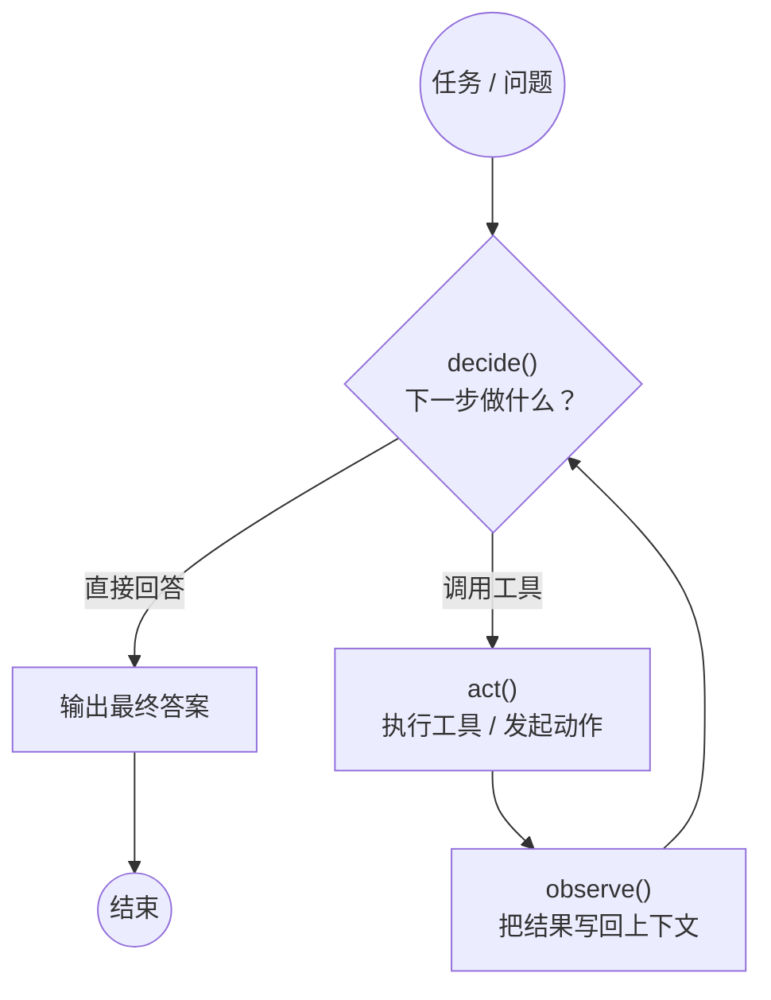

**关键理解**：循环的"决策者"是模型。每一步，模型既可能给出最终答案，也可能输出"我要调用工具 X、参数是 Y"。系统（框架代码）负责在模型和工具之间搬运消息，直到模型决定"直接回答"或达到安全上限。

#### 2.1.2 与"普通 LLM 调用"的本质区别

很多人把 Agent 理解成"多调几次模型"，这是错的。区别在于**谁在循环里做决策**：

| 维度 | 普通 LLM 调用 | Agent |
|------|--------------|-------|
| 控制流 | **代码**决定：一次请求 → 一次响应，结束 | **模型**在循环里决定下一步做什么 |
| 步骤数 | 固定（1 次） | 不固定（0~N 次工具调用后才回答） |
| 工具 | 代码硬编码是否调用、何时调用 | 模型按需声明调用哪个工具、传什么参 |
| 反馈回路 | 无：模型看不到"做了之后的结果" | 有：工具结果（observation）喂回模型，影响下一步 |
| 状态 | 无状态，每次独立 | 有上下文累积（记忆） |
| 风险 | 低：不会失控 | 高：可能死循环、超预算、越权 → 需要护栏 |

> 用后端类比：普通 LLM 调用是"一次 RPC"；Agent 是一个**事件循环 + 状态机**，模型是状态机里的决策组件。你之前学的网关/重试/状态机经验，在这里直接复用。

#### 2.1.3 五个零件：哪些决定"能跑"，哪些决定"能生产"

Agent 系统可以拆成五个零件：

| 零件 | 回答什么问题 | 责任 |
|------|-------------|------|
| **① 模型** | "谁在思考？" | 决策、推理、生成。选型决定能力天花板 |
| **② 工具** | "靠什么动手？" | 与外部世界交互：查库、调 API、执行动作 |
| **③ 循环** | "谁把它串起来？" | 运行时：把模型输出解析成工具调用、执行、回传、再调用（框架提供） |
| **④ 记忆** | "还记得什么？" | 上下文窗口管理、跨会话持久化、知识检索 |
| **⑤ 护栏** | "失控了怎么办？" | 迭代上限、预算、死循环检测、权限控制 |

**分组**（这是架构判断力的起点）：

- **① + ② + ③ = "能跑"**：这三件套是一个"最小可用 Agent"。模型会想、工具能执行、循环能把两者连起来。跑通一个 demo 只需要它们。
- **④ + ⑤ = "能生产"**：记忆让 Agent 跨会话有用、多轮不丢上下文；护栏让 Agent 不会烧钱、不会卡死、不会越权。**没有记忆和护栏的 Agent 只能算 demo**。从 demo 到生产，差的正是这两件（再加阶段4 的可观测/评估/成本治理）。

> 市场 JD 里"实现 Agent 记忆与上下文管理"和"设计生产护栏"之所以被单列为核心技能，正是因为这两件决定"能不能上线"。

**一句话定义**：Agent 是一个让模型在循环中做决策、通过工具作用于世界、并配以记忆和护栏的运行时系统。

---

### 2.2 ReAct 范式：Agent 的思考-行动循环

#### 2.2.1 Thought / Action / Observation

ReAct（**Re**asoning + **Ac**ting，来自论文 Yao et al. 2023《ReAct: Synergizing Reasoning and Acting in Language Models》）是 Agent 最经典的思考范式。它的循环是：

```text
Thought（思考）: 我需要什么信息？下一步怎么办？
Action（行动）:  调用工具 / 发起动作
Observation（观察）: 工具返回了什么结果？
── 回到 Thought，直到得出结论 ──
```

以"帮我查订单 1024 的物流"为例：

```text
Thought: 用户想知道订单 1024 的物流状态，我需要调用订单查询工具。
Action: query_order(orderId="1024")
Observation: { status: "已发货", tracking: "SF123456", eta: "明天" }
Thought: 订单已发货，物流单号是 SF123456，预计明天到。
Action: 直接回答用户。
```

**ReAct 的价值**：把"推理"（Thought）和"行动"（Action）交替进行，让模型不是一次性拍脑袋，而是**边做边想**——拿到工具的真实反馈后再继续。这比"让模型直接编一个答案"可靠得多。

#### 2.2.2 Function Calling：ReAct 的结构化收敛

论文里的 ReAct 用自由文本表达 Thought/Action；**生产上我们不会让模型输出自由文本动作**，因为无法稳定解析、无法校验。生产上的标准做法是 **Function Calling（函数调用 / 工具调用）**：

- 模型输出**结构化 JSON**，声明"我要调用 `query_order`，参数是 `{"orderId": "1024"}`"。
- 框架解析这个 JSON，**确定性**地执行对应的 Java 方法。
- 把方法返回值作为"Observation"追加回消息，再让模型继续。

所以：**Function Calling 是 ReAct 在工程上的结构化收敛**——Thought 可以保留在模型内部（或 system prompt 里要求输出），但 Action 从"自由文本"收敛成"可解析、可校验、可执行的 JSON"。这样做的收益：

1. **可执行**：JSON → 方法调用，一行映射代码。
2. **可校验**：参数对不上 JSON Schema 可以拒绝，而不是让模型随意发挥。
3. **可追踪**：每个工具调用都留下记录（为阶段4 的可观测、成本统计打基础）。
4. **可护栏**：在"执行工具前"插入权限检查、预算检查。

#### 2.2.3 完整消息序列（必须能画出来）

在 Function Calling 下，一次"Agent 回答"在消息层面是**多次模型调用**的组合。用 Spring AI 2.0 的视角，完整序列如下：

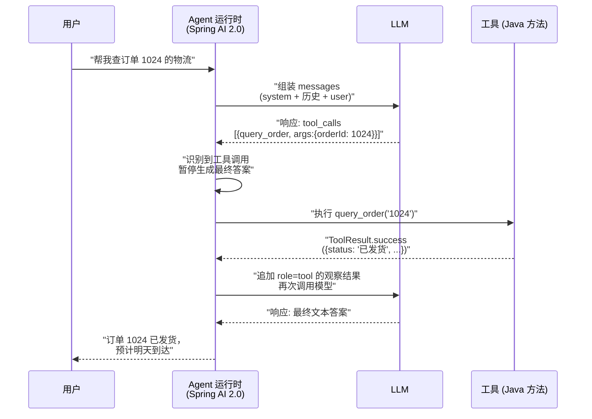

**消息序列的细节（面试/笔试高频）**：

| 步骤 | 消息角色 | 内容 | 说明 |
|:---:|---------|------|------|
| 1 | `user` | 用户问题 | 加上 system 指令和历史（记忆） |
| 2 | `assistant` | 带 `tool_calls` 字段的响应 | 模型"决定"调用工具，**不包含最终答案** |
| 3 | `tool` | 工具执行的返回结果 | 必须以 `tool_call_id` 关联第 2 步的那个调用 |
| 4 | `assistant` | 最终答案（或再一次 `tool_calls`） | 如果还要调工具，回到第 2 步循环 |

**两个容易踩的坑**：
1. **role=tool 必须配对**：每个 `tool` 消息必须对应一个 `assistant` 消息里已声明的 `tool_call_id`，否则模型会困惑。
2. **历史要带全**：第 4 步再调用时，前面第 2、3 步的消息必须全部留在上下文里，模型才能"记得"自己刚才做了什么、看到了什么。

#### 2.2.4 在 Spring AI 2.0 里跑起来

Spring AI 2.0 把上述循环封装成了 **`ToolCallingAdvisor`**（一个"顾问" Advisor，插在 ChatClient 调用链上）。它做的事正好是 2.2.3 的循环：检测 `tool_calls` → 执行工具 → 追加 `tool` 消息 → 再调模型 → 直到没有工具调用或达到 `maxToolCallIterations`。

```java
// Spring AI 2.0：配置一个带工具循环的 ChatClient
@Configuration
public class AgentConfig {

    @Bean
    ChatClient agentChatClient(ChatClient.Builder builder, ChatModel chatModel,
                               OrderTools orderTools) {
        // 1. 工具循环顾问：识别并执行 tool_calls，最多迭代 5 次
        ToolCallingAdvisor toolCalling = new ToolCallingAdvisor(chatModel);
        toolCalling.setMaxToolCallIterations(5);

        return builder
                .defaultSystem("你是一个订单助手。需要订单数据时调用工具，不要编造。")
                // 2. 注册工具：OrderTools 里所有 @Tool 方法
                .defaultTools(orderTools)
                // 3. 挂上顾问链
                .defaultAdvisors(toolCalling)
                .build();
    }
}
```

调用方式（对使用者透明，循环在框架内部跑）：

```java
String answer = agentChatClient.prompt()
        .user("帮我查订单 1024 的物流")
        .call()
        .content();
// 模型可能先调 query_order 工具，再基于结果回答——这些都在内部完成
```

> 体验一下：**你自己没有写任何循环代码**，循环是框架通过 Advisor 机制注入的。这正是阶段5 要精读的源码核心——`ToolCallingAdvisor` 内部就是 2.2.3 的循环。API 细节（构造器、builder）以官方文档为准。

---

### 2.3 工具系统：Agent 的手

工具（Tool）是 Agent 与外部世界交互的唯一通道。工具设计的好坏，直接决定 Agent 的成功率和可靠度。

#### 2.3.1 工具设计五件事

定义每一个工具时，都要能回答这五个问题（这是阶段1 已学过、本阶段要内化的基本功）：

| # | 问题 | 示例（query_order） |
|:---:|------|---------------------|
| ① | **做什么**（一句话） | "根据订单号查询订单当前状态与物流信息" |
| ② | **何时调用**（触发条件） | "用户询问订单进度、物流、发货状态时" |
| ③ | **何时别调用**（最重要的反例） | "用户只是吐槽订单，没有索要状态时不要调；订单号缺失时先索要订单号" |
| ④ | **参数是什么**（JSON Schema） | `orderId: string`（必填），可加 `currency: string`（选填） |
| ⑤ | **返回什么** | 结构化结果：`{status, trackingNo, eta}` 或明确的错误 |

**为什么"何时别调用"最重要**：模型的工具选择靠的是工具描述（description）。描述里只说"何时调用"，模型会把相似场景都误路由到这个工具；把"何时别调用"写清楚，等于帮模型做了一次**路由消歧**。多个工具描述互相重叠时尤其关键。

#### 2.3.2 工具错误规范：返回 `ToolResult.error`，不要抛异常

这是本阶段最重要的工程规范之一。

**反例（新手常见错误）**：

```java
@Tool(description = "根据订单号查询订单状态")
public Order queryOrder(String orderId) {
    return orderService.findById(orderId);   // 订单不存在 → 抛 NoSuchElementException
}
```

问题：异常抛出后，模型的循环被打破——它**看不到发生了什么**，只知道"出错了"，无法自我修复。如果是框架兜底把异常转成一句"调用失败"，模型更是拿不到任何可用的修复信息。

**正例：返回结构化错误**：

```java
// 统一的工具返回载体：成功带数据，失败带"错误码 + 说明 + 修复提示"
public record ToolResult(boolean success, String code, String message, Object data) {

    public static ToolResult ok(Object data) {
        return new ToolResult(true, "OK", null, data);
    }

    public static ToolResult fail(String code, String message, String fixHint) {
        return new ToolResult(false, code, message, fixHint);
    }
}

@Component
public class OrderTools {

    @Tool(name = "query_order",
          description = "根据订单号查询订单状态。用户询问订单进度/物流时调用。" +
                         "不要编造订单信息；订单号不合法时请向用户索要正确订单号。")
    public ToolResult queryOrder(@ToolParam(description = "订单号，如 1024") String orderId) {
        try {
            Order order = orderService.findById(orderId);
            return ToolResult.ok(order);
        } catch (OrderNotFoundException e) {
            // 关键：把错误作为"观察结果"返回给模型，让模型看到并自我修复
            return ToolResult.fail("ORDER_NOT_FOUND", "订单不存在: " + orderId,
                                   "请向用户确认订单号是否正确，或建议用户核对后再试");
        } catch (Exception e) {
            return ToolResult.fail("ORDER_SERVICE_ERROR", "订单服务暂时不可用",
                                   "告诉用户稍后重试，不要编造订单状态");
        }
    }
}
```

**原理**：把错误变成"Observation"喂回给模型，模型就会进入 ReAct 循环的自我修复路径——它读到 `ORDER_NOT_FOUND` + 修复提示后，会调整策略（索要正确订单号 / 换个工具 / 如实告知）。这比抛异常多了一个**让模型参与修复**的机会。

**规范总结**（写进你自己的工程准则）：

| 情况 | 正确做法 |
|------|---------|
| 业务失败（没查到、参数错、无权限） | 返回 `ToolResult.fail(code, message, fixHint)` |
| 临时故障（服务不可用、超时） | 返回 `ToolResult.fail(..., "稍后重试")`，让模型决定重试或告知用户 |
| 参数不合法 | 返回带 `fixHint` 的错误，让模型主动向用户澄清 |
| 程序性 bug（NPE 这类代码缺陷） | 可以抛异常（这不该由模型修复，应该由你修代码），并记录日志 |
| 高危操作（删数据、转账） | **不能**只靠模型自觉，还要加确认/权限护栏（见 2.6） |

#### 2.3.3 工具粒度与重叠

**粒度（granularity）**：工具拆多大合适？

| 粒度 | 问题 | 判断标准 |
|------|------|---------|
| 过细 | 模型要调很多次才能完成一件事 → 上下文膨胀、延迟高、失败点多 | 一个工具是否小到"单独调用没有意义" |
| 过粗 | 工具耦合多种逻辑 → 模型难组合、难复用、参数混乱 | 一个工具是否塞进了多个"能力单元" |

经验起点（**经验值，需自行验证**）：按"业务能力单元"划分——一次查询、一次写入、一个领域动作。例如订单域拆成 `query_order` / `create_order` / `cancel_order`，而不是拆成 `get_order_id` / `get_order_status` / `get_order_amount`（过细），也不是 `do_order_stuff`（过粗）。

**重叠（overlap）**：多个工具描述描述相近的能力，模型会选错。两条对策：
1. **用"何时别调用"消歧**：让每个工具的边界互斥。
2. **描述里互相引用**：例如 `query_order` 里写"如需退款请用 refund 工具，不要在这里处理退款"。

> 自测：给你 3 个工具写描述，写完后用 20 条真实问题跑一遍，统计"工具选对率"——低于 80% 优先怀疑工具描述的重叠和歧义（这是可量化验证的，别拍脑袋）。

#### 2.3.4 工具的可测试性

工具是纯代码，应该像普通方法一样写单元测试（边界、异常、参数校验）。工具层的 bug 是 Agent 错误的头号来源之一——因为模型会把工具的错误结果当成事实继续推理。**工具稳，Agent 才可能稳。**

---

### 2.4 Anthropic 5 大 Workflow 模式（企业 Agent 的主流形态）

出处：Anthropic《Building Effective Agents》（2024）——这是 Agent 工程领域的"圣经"级文章。它把"带 LLM 的系统"分成两类：

- **Workflow**：LLM 和工具被**预定义的代码路径**编排（代码决定控制流，LLM 只负责其中某些节点）。
- **Agent**：LLM **动态地**决定自己的控制流（模型在循环里决策）。

**金科玉律（背下来）**：**能用确定性 Workflow 解决的，就不要用自主 Agent。** 自主 Agent 灵活，但不可预测、成本高、难测试。Workflow 可预测、可测试、便宜。生产上**大多数任务应该用 Workflow**，自主 Agent 是"简单方案不够了"之后的最后选择。

下面详解五个模式。

#### 2.4.1 Prompt Chaining（串联）

**定义**：把任务拆成**固定顺序**的步骤，每步 LLM 调用的输出是下一步的输入，像流水线。

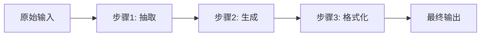

**适用场景**：任务可分解为明确的子步骤，且**前一步输出错误会污染后续**——所以每步单独校验/格式化工件再传给下一步。典型：先抽取 → 再生成 → 再格式化；文档先总结再分析；代码先生成再检查。

**反模式**：
- 步骤之间只是"纯传递"（上一步输出原封不动给下一步，没有任何处理）→ 应该合并成一步。
- 步骤数太多导致延迟不可接受 → 评估是否真的每步都有价值。

**Java 实现思路**：就是 N 次顺序 `ChatClient` 调用，每步不同 system prompt：

```java
@Service
public class ChainingPipeline {
    private final ChatClient chatClient;

    public ChainingPipeline(ChatClient.Builder builder) {
        this.chatClient = builder.build();
    }

    public String run(String rawDoc) {
        // 步骤1: 抽取关键事实（结构化输出）
        ExtractedFact fact = chatClient.prompt()
                .system("你是信息抽取器。从输入中抽取{客户, 产品, 金额, 日期}，输出 JSON，缺失填 null。")
                .user(rawDoc)
                .call()
                .entity(ExtractedFact.class);
        // 步骤2: 基于抽取结果生成摘要（绝不直接看原始文档）
        return chatClient.prompt()
                .system("你是摘要生成器。基于抽取的事实生成 100 字以内的摘要，不得编造事实。")
                .user("客户=%s 产品=%s 金额=%s 日期=%s".formatted(
                        fact.customer(), fact.product(), fact.amount(), fact.date()))
                .call()
                .content();
    }
}
```

#### 2.4.2 Parallelization（并行）

**定义**：把任务拆成多个**互不依赖**的子任务并行执行，再合并。分两种：

| 子类型 | 做法 | 目的 |
|--------|------|------|
| **分段（Sectioning）** | 把输入切成多段，每段独立处理（如长文档每章各写一份分析） | 摊薄单次上下文、提高并行度 |
| **投票（Voting）** | 同一任务跑多次，取多数/最高分结果 | 提高准确率（有标准答案的任务） |

**适用场景**：子任务确实独立（长文档分章、多文件评审、多来源检索核对）；或者任务有明确答案、需要降随机性（分类、抽取 → 投票）。

**反模式**：
- 子任务有顺序依赖却强行并行 → 结果乱、浪费 token。
- 任务太简单/太少，并行开销（线程、token ×N）不划算。
- 开放生成类任务用投票（没有"多数对"）→ 投票对开放式写作没有意义。

**Java 实现思路**：JDK 21 虚拟线程（或 `CompletableFuture`）+ 每路独立 `ChatClient` 调用，最后聚合：

```java
@Service
public class ParallelPipeline {
    private final ChatClient chatClient;

    public ParallelPipeline(ChatClient.Builder builder) {
        this.chatClient = builder.build();
    }

    // 分段并行：一份长代码按类拆开，各自评审
    public List<String> reviewFiles(List<String> fileContents) {
        List<CompletableFuture<String>> futures = fileContents.stream()
                .map(code -> CompletableFuture.supplyAsync(() ->
                        chatClient.prompt()
                                .system("你是代码评审员。指出问题并给修复建议，输出结构化评审意见。")
                                .user(code)
                                .call()
                                .content()))
                .toList();
        return futures.stream().map(CompletableFuture::join).toList();
    }

    // 投票：同一分类问题跑 3 次，取多数
    public String classify(String text) {
        List<Category> votes = IntStream.range(0, 3)
                .mapToObj(i -> chatClient.prompt()
                        .system("把文本分类为 BUG / FEATURE / QUESTION，输出 JSON {category}。")
                        .user(text)
                        .call()
                        .entity(Category.class))
                .toList();
        return majorityCategory(votes);   // 统计出现最多的类别
    }
}
```

#### 2.4.3 Routing（路由）

**定义**：先对输入做**分类**，再把它分发给**专门的** prompt / 工具 / 处理路径。

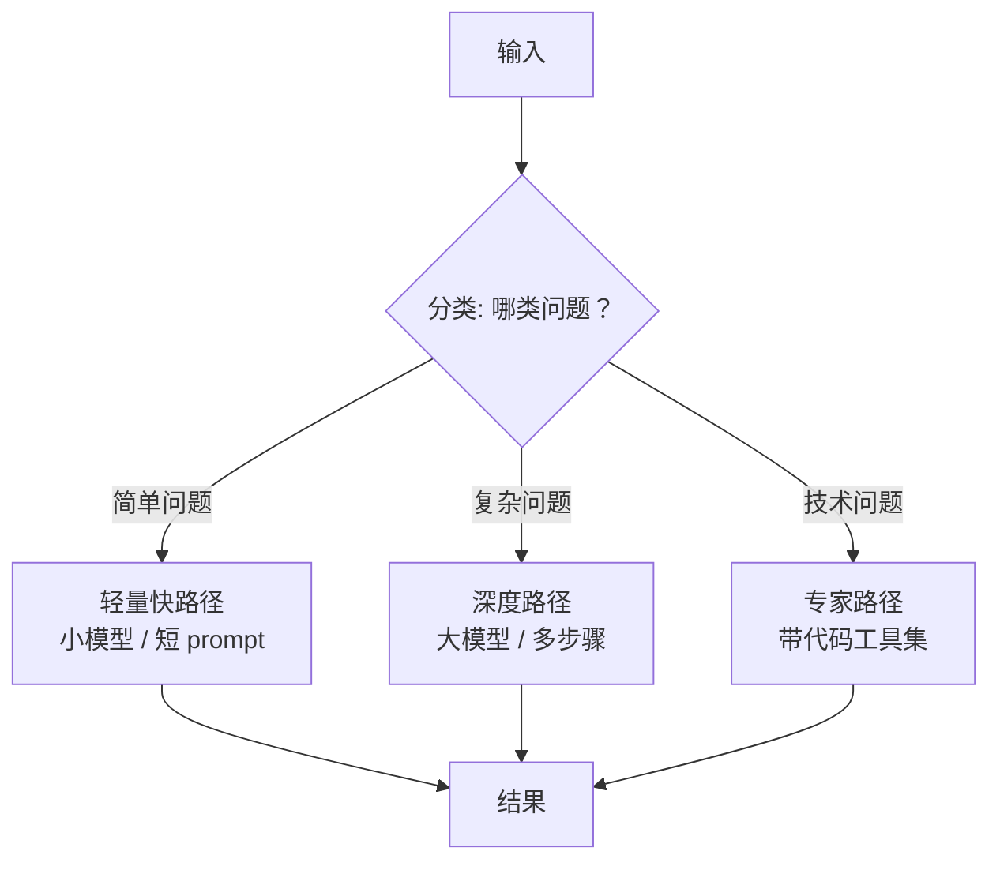

**适用场景**：不同输入确实需要不同处理——简单 vs 复杂分流（省钱省延迟）、不同领域分流（各配专家 prompt 和工具集）、不同意图分流（客服问题 vs 售后问题）。

**反模式**：
- 只有一条处理路径却硬加路由 → 路由本身就是浪费。
- 分类本身不准 → 先评估分类准确率，别让路由成为新的错误源。
- 用大模型做简单分类 → 分类用便宜小模型足够（这是成本治理，阶段4 展开）。

**Java 实现思路**：一个便宜的"分类器调用"返回结构化意图，然后 `switch` 或 Map 分发给不同的 `ChatClient`（每个 `ChatClient` 有独立的 system prompt / 工具集）：

```java
@Service
public class Router {
    // 三个专业 client：每个绑定不同的系统提示与工具
    private final ChatClient router;
    private final ChatClient simpleClient;
    private final ChatClient deepClient;

    public String route(String question) {
        // 1) 分类（用小模型/短 prompt，快而便宜）
        Intent intent = router.prompt()
                .system("把用户问题分为 simple / deep 两类，输出 JSON {intent}。"
                        + "simple=一句话可答、事实查询；deep=需要多步推理或工具。")
                .user(question)
                .call()
                .entity(Intent.class);
        // 2) 分流
        return switch (intent.intent()) {
            case "deep"   -> deepClient.prompt().user(question).call().content();
            case "simple" -> simpleClient.prompt().user(question).call().content();
            default       -> simpleClient.prompt().user(question).call().content();
        };
    }
}
```

> 路由是**最容易被滥用的模式**：很多"路由"其实是"类型单一、一个 prompt 就能答"，先问自己"不路由会怎样？"

#### 2.4.4 Orchestrator-Workers（编排者-工人）

**定义**：一个中心的 LLM（编排者 Orchestrator）动态地把任务**拆成子任务**、**派给**多个 Worker（Worker 通常是带工具或带子 prompt 的执行单元）、再**汇总**结果。子任务的**数量和内容事先不确定**——这是它与固定并行/串联的关键区别。

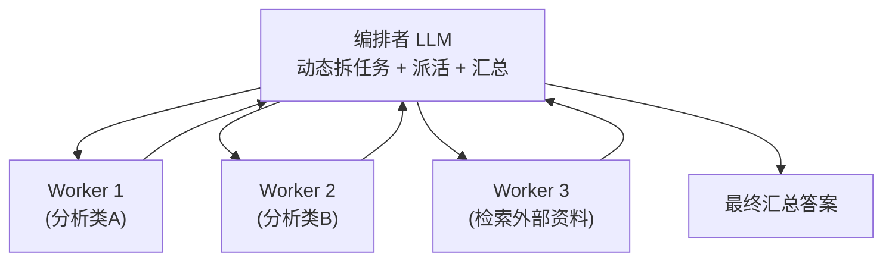

**适用场景**：任务可拆、但拆成几块、每块做什么**事先不知道**，要模型动态决定——多文档研究、复杂问题分解、代码库多文件分析、写书/报告（每章一个 Worker）。

**反模式**：
- 子任务固定已知 → 用固定并行/串联更简单、更可控。
- Worker 之间强依赖（后一个要等前一个的产物）→ 不适合"派出去就完事"的模型，应该用串联。

**Java 实现思路**：**把 Worker 实现为编排者的工具**——编排者 Agent 通过 `@Tool` 调 Worker，Worker 是独立的 `ChatClient` 或纯函数：

```java
@Service
public class OrchestratorWorkers {
    private final ChatClient orchestrator;

    public OrchestratorWorkers(ChatClient.Builder builder, WorkerTools workerTools,
                               ChatModel chatModel) {
        // 编排者：绑定"指挥"系统提示 + Worker 工具 + 工具循环
        ToolCallingAdvisor advisor = new ToolCallingAdvisor(chatModel);
        advisor.setMaxToolCallIterations(8);   // 编排者可能拆很多子任务
        this.orchestrator = builder
                .defaultSystem("你是指挥官。把任务拆成互不依赖的子任务，逐个调用工具执行，"
                        + "收集所有结果后汇总成最终答案。不要编造工具结果。")
                .defaultTools(workerTools)
                .defaultAdvisors(advisor)
                .build();
    }

    public String run(String task) {
        return orchestrator.prompt().user(task).call().content();
    }
}

@Component
class WorkerTools {
    private final ChatClient workerClient;

    WorkerTools(ChatClient.Builder builder) {
        this.workerClient = builder.build();
    }

    @Tool(name = "analyze_section",
          description = "分析输入的一段内容，返回要点与问题。当任务包含多段独立内容时，对每段调用一次。")
    public String analyzeSection(@ToolParam(description = "一段文本") String section) {
        return workerClient.prompt()
                .system("你是专业分析员，输出结构化要点与问题。")
                .user(section)
                .call()
                .content();
    }
}
```

> 注意：Orchestrator-Workers 的"派活"靠的是 **Tool Calling + 循环**——编排者每拆出一个子任务就调一次 Worker 工具，循环兜住"一次拆不完、继续拆"的情况。这正是 2.2 的循环在编排场景的应用。

#### 2.4.5 Evaluator-Optimizer（评估者-优化者）

**定义**：一个 LLM **生成**候选输出，另一个 LLM（或同一 LLM 的不同角色）**按明确标准评估**，不合格就带着评估反馈**重新生成**，循环直到通过或达到上限。

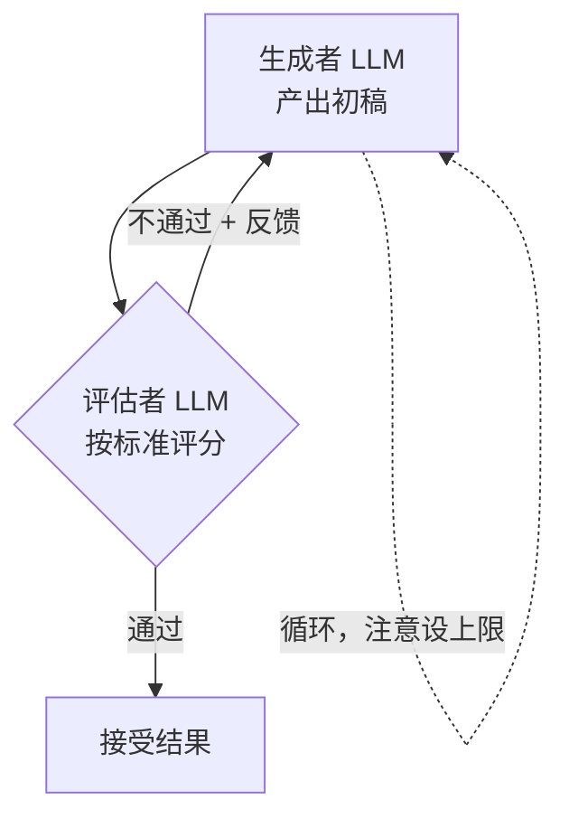

**适用场景**：有**明确、可表述**的评估标准，且迭代确实能提高质量——文案/营销内容改写、代码生成（用测试结果当评估信号）、翻译、结构化报告。

**反模式**：
- 评估标准模糊（"好不好""自然不自然"说不清）→ 评估靠运气，循环白跑，**死循环风险高**。
- 实时对话场景（延迟翻倍）→ 评估-优化是有成本的重循环，只用于可接受延迟的离线/准离线任务。
- 忘设迭代上限 → 无限烧钱。**必须配 maxIterations**。

**Java 实现思路**：一个循环 + 两个角色（生成、评估）。评估用结构化输出返回 `passed` + `feedback`：

```java
@Service
public class EvaluatorOptimizer {
    private final ChatClient generator;
    private final ChatClient evaluator;
    private final int maxIterations = 4;

    public EvaluatorOptimizer(ChatClient.Builder builder) {
        this.generator = builder.build();
        this.evaluator = builder.build();
    }

    public String improve(String task) {
        String draft = generator.prompt()
                .system("你是技术文案撰写人。")
                .user(task)
                .call()
                .content();

        for (int i = 0; i < maxIterations; i++) {
            Review review = evaluator.prompt()
                    .system("你是严格评审。按标准评估：①是否覆盖需求 ②是否有事实错误 ③是否简洁。"
                            + "输出 JSON {passed: boolean, feedback: string}，不通过时 feedback 必须给可执行的改进意见。")
                    .user("需求: " + task + "\n\n当前稿:\n" + draft)
                    .call()
                    .entity(Review.class);

            if (review.passed()) {
                return draft;
            }
            draft = generator.prompt()
                    .user("需求: " + task
                          + "\n\n上一版:\n" + draft
                          + "\n\n评审意见:\n" + review.feedback()
                          + "\n请按意见改进。")
                    .call()
                    .content();
        }
        return draft;   // 达到上限，返回当前最优版本
    }
}
```

> **自测**：把 `Review` 的评估标准写具体一点，跑 5 个案例观察"几轮收敛"。如果你的评估标准连你自己都说不清，就别用这个模式。

#### 2.4.6 5 大模式对比表与选型

**对比表**（背下来）：

| 模式 | 一句话 | 控制流 | 适用 | 反模式 | 成本 |
|------|--------|--------|------|--------|:---:|
| **① Prompt Chaining 串联** | 上一步输出 = 下一步输入，固定流水线 | 固定串行 | 可分解、每步有独立产出、前步错污染后步 | 步骤纯传递却拆开 | 低 |
| **② Parallelization 并行** | 多个独立子任务并行 / 同任务多次投票 | 并行 | 子任务独立；有标准答案要降随机性 | 有依赖却并行；任务太少 | 低-中 |
| **③ Routing 路由** | 先分类再分发到专门路径 | 分类+分发 | 不同类型输入要不同处理 | 单一路径却硬分流 | 低 |
| **④ Orchestrator-Workers 编排** | 中心 LLM 动态拆任务派给 Worker | 动态派工 | 子任务数量和内容不确定 | 子任务固定却动态派 | 中 |
| **⑤ Evaluator-Optimizer 评估优化** | 生成 → 评估 → 按反馈重写，循环 | 生成-评估循环 | 有明确评估标准、迭代提质量 | 标准模糊（死循环风险） | 中-高 |

**选型口诀**：**先问"能不能不用 LLM 循环"——能用确定性代码/DAG 就用；能单次就用单次；能固定就固定；能简单就不复杂。** Workflow 是"确定性骨架 + LLM 局部负责"，Agent 才是"LLM 全权决策"。

选型图：

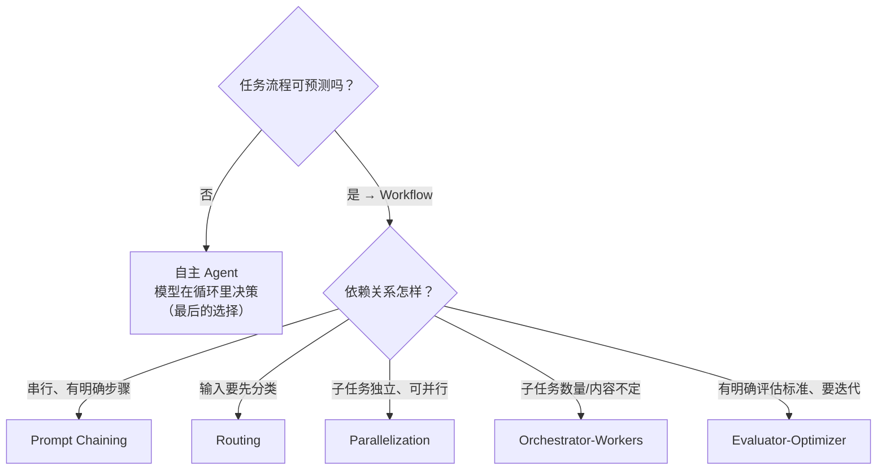

---

### 2.5 记忆架构

模型本身**无状态**（每次调用独立 HTTP 请求），所有"记忆"都是**外部系统**提供的。记忆架构决定 Agent 能多轮对话、能记住用户、能用知识库。

#### 2.5.1 三类记忆（必记框架）

| 类型 | 是什么 | 存哪 | 生命周期 | 用途 |
|------|--------|------|---------|------|
| **对话记忆（工作记忆）** | 当前上下文窗口内的对话历史 | 上下文窗口（由框架注入） | 单次会话，随窗口裁剪 | 多轮对话连贯性 |
| **长期记忆（存储）** | 跨会话的用户画像 / 偏好 / 历史行为 | 向量库 / 关系库 / Redis | 跨会话持久 | 个性化、记住用户 |
| **知识记忆（RAG）** | 外部知识库（文档、手册、FAQ） | 向量库 + 检索/重排（阶段2 已做） | 随知识库更新 | 回答"不知道就查" |

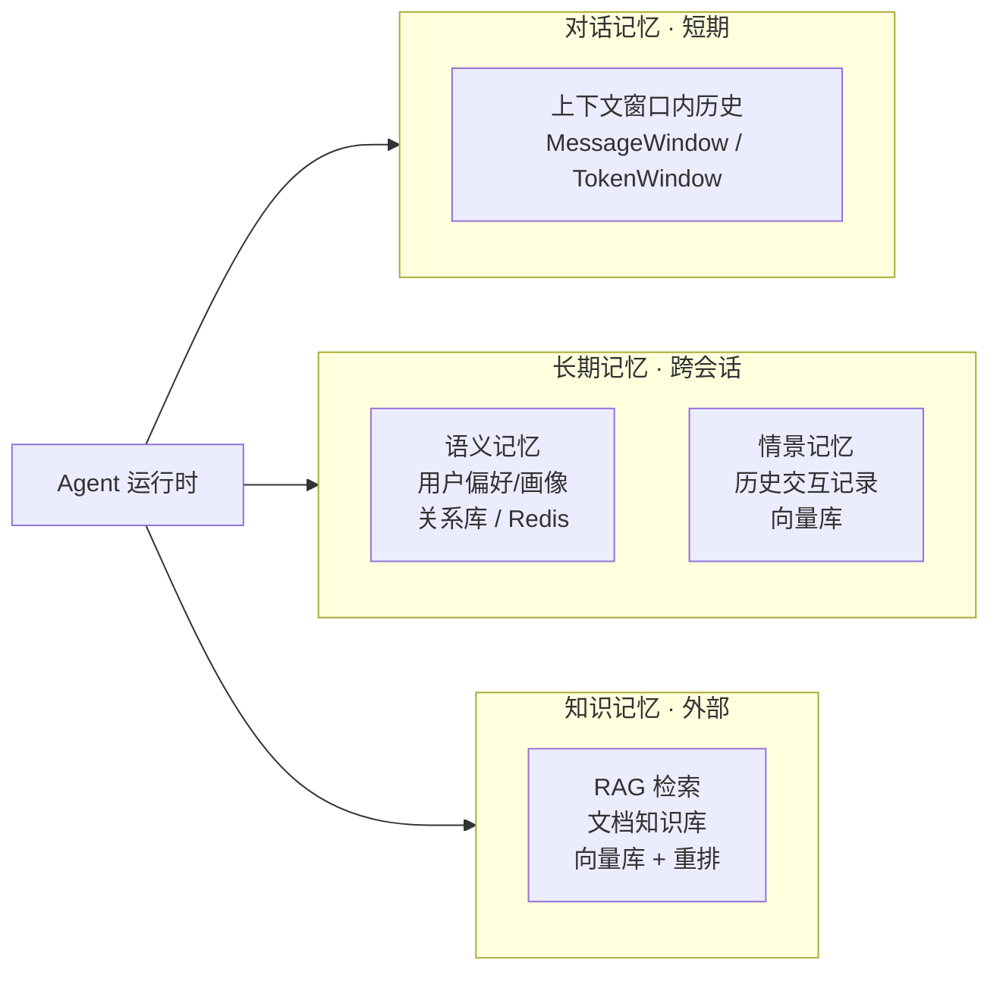

#### 2.5.2 对话记忆（上下文窗口管理）

对话记忆就是"把历史消息塞进上下文窗口"。核心矛盾：**窗口有限、成本随长度上涨**。三种管理策略（阶段1 已学，这里给出"何时用哪个"）：

| 策略 | 做法 | 适用 |
|------|------|------|
| **裁剪** | 只保留最近 N 轮 | 简单对话，能接受"早一点的细节丢失" |
| **摘要** | 把旧对话压成一段摘要，替换原文 | 长会话、信息密度高（要注意摘要本身也占 token） |
| **检索注入** | 只注入"与当前问题相关"的历史（向量召回） | 会话历史极长、相关性稀疏 |

Spring AI 里的对应物（以官方文档为准）：`ChatMemory` 体系提供 `MessageWindowChatMemory`（按轮数）、`TokenWindowChatMemory`（按 token 数）等实现，配 `conversationId` 做多会话隔离。

```java
// Spring AI 2.0：多会话对话记忆（ChatMemory 体系）
@Bean
ChatMemory chatMemory() {
    return MessageWindowChatMemory.builder()
            .maxMessages(20)                  // 保留最近 20 条消息
            .build();
}

@Bean
ChatClient chatClient(ChatClient.Builder builder, ChatMemory chatMemory) {
    return builder
            .defaultAdvisors(MessageChatMemoryAdvisor.builder(chatMemory).build())
            .build();
}

// 使用：用 conversationId 隔离不同用户的会话
String answer = chatClient.prompt()
        .user("我的订单到哪了？")
        .advisors(a -> a.param("chat_memory_conversation_id", "user-1024"))
        .call()
        .content();
```

> 注意：`MessageChatMemoryAdvisor` 负责把历史注入请求 + 把新消息写回 memory。API 细节（advisor 名、param 名）以官方文档为准。要点是**记住思路**：对话记忆 = 外部存储 + 注入/回写两个钩子。

#### 2.5.3 长期记忆

长期记忆让 Agent **跨会话记住用户**。分两类：

- **语义记忆（Semantic）**：稳定事实——"用户偏好中文回复""用户是 VIP""用户常用的仓库是 demo01"。存结构：关系库表 `user_preference(user_id, key, value)`，或 Redis。
- **情景记忆（Episodic）**：历史事件——"用户上周问过 Kafka 幂等问题"。存向量库，靠语义检索召回"相关历史"。

**工程要点**（这是 JD"实现 Agent 记忆与上下文管理"的实际内容）：
1. **写入时机**：在关键节点（对话结束、检测到新事实）把事实提取出来写入长期记忆。通常用一个小 LLM 调用做"事实抽取"，或规则提取。
2. **读取时机**：每次请求开头，按 userId 召回相关记忆，注入 system/user 消息。
3. **一致性与时效**：用户改了偏好，旧记录要能覆盖（用 key 覆盖）或过期（TTL）。
4. **隐私与合规**：长期记忆存的是个人信息，要有删除能力（"忘记我"），这在企业里是合规要求。

```java
// 示例思路：长期记忆 = "会话开始时召回 + 会话结束时写入"
@Service
public class LongTermMemory {
    private final ChatClient chatClient;
    private final UserPrefRepository prefs;   // 关系库

    public ChatResponse chat(String userId, String userMessage) {
        // 1) 召回长期记忆
        String prefsText = prefs.findByUserId(userId).stream()
                .map(p -> p.key() + "=" + p.value())
                .reduce((a, b) -> a + "; " + b)
                .orElse("");
        // 2) 注入 + 对话
        ChatResponse resp = chatClient.prompt()
                .system("以下是关于该用户的已知偏好（如有）：" + prefsText)
                .user(userMessage)
                .call();
        // 3) 事后：检测新事实写入（示例用规则，生产可用小模型抽取）
        if (userMessage.contains("用中文")) {
            prefs.save(userId, "language", "中文");
        }
        return resp;
    }
}
```

#### 2.5.4 知识记忆（RAG 回顾）

知识记忆就是阶段2 的 RAG：外部文档 → 分块 → 向量化 → 检索 → 注入。在 Agent 语境里，RAG 通常被实现成一个**工具**（`search_knowledge`），让 Agent 按需查询——而不是每轮都注入。这有两点好处：

1. **省上下文**：只有 Agent 决定要查知识时，检索结果才占用窗口。
2. **可观测**：工具调用记录能看出"它是否主动去查了知识库"（评估 faithfulness 的线索）。

```java
@Component
public class KnowledgeTools {
    private final VectorStore vectorStore;   // 阶段2 已配好

    @Tool(name = "search_knowledge",
          description = "检索内部知识库回答技术/业务问题。当问题涉及公司文档、手册、规范时调用；"
                        + "不要用这个工具查询订单或用户信息。")
    public String searchKnowledge(@ToolParam(description = "查询内容") String query,
                                  @ToolParam(description = "返回条数，默认3") Integer topK) {
        List<Document> hits = vectorStore.similaritySearch(
                SearchRequest.builder().query(query).topK(topK == null ? 3 : topK).build());
        return hits.stream().map(Document::getText).toList().toString();
    }
}
```

#### 2.5.5 会话持久化：spring-ai-session（事件溯源）

**问题**：对话记忆在内存里，服务一重启就丢；生产上要求"重启不丢、多实例共享、可审计"。

**传统做法（快照）**：把"当前会话状态"作为一个整体存下来（如 Redis 存整个消息列表）。简单，但：
- 每次都要序列化/反序列化整个状态；
- 无法回答"这个会话一步步是怎么演变的"；
- 多端/多实例并发写同一会话时冲突难解。

**Spring AI 2.0 的做法（事件溯源 event-sourced）**——`spring-ai-session` 模块：
- 不再存"当前状态"，而是**追加记录"发生了什么"**（每个事件：用户消息、模型回复、工具调用、元数据变更）。
- **当前会话状态 = 从事件流重放（replay）得到的投影**。
- 好处：天然可审计（能看会话全史）、可还原任意时点、多实例可从同一事件流恢复、契合事件驱动架构。
- 代价：读状态需要重放事件（通常加物化投影缓存加速）。

> 事件溯源这个概念你并不陌生——把状态变化记成一条不可变的事件流，需要时从事件流重放恢复状态。这里它作为**对话记忆的存储底座**，就是同一套思想：不存"当前状态"，存"发生了什么"，用时重建。

概念架构：

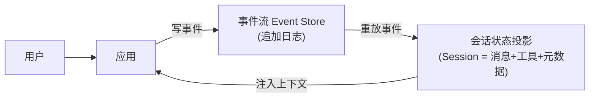

**Spring AI 2.0 用法**（API 细节以官方文档为准，下面是概念性代码）：

```java
// 1) 配置事件溯源会话仓库（示例用 JDBC 存储事件）
@Configuration
public class SessionConfig {
    @Bean
    SessionRepository sessionRepository(DataSource dataSource) {
        return new JdbcSessionRepository(dataSource);   // 事件存库，重启不丢
    }
}

// 2) 使用：ChatClient 支持按 sessionId 恢复/继续会话
@RestController
public class ChatController {
    private final ChatClient chatClient;

    @PostMapping("/chat")
    public String chat(@RequestParam String sessionId, @RequestBody String userText) {
        return chatClient.prompt()
                .user(userText)
                // 会话按 id 从事件流恢复；不存在的 id 会新建
                .session(sessionId, s -> s.setProperty("userId", "u-1024"))
                .call()
                .content();
    }
}
```

> 核心理解：**Spring AI 2.0 用事件溯源把"对话记忆"升级成了"可持久化、可审计、可多实例共享的会话流"**。这是它相对早期版本的最大架构变化之一。`SessionRepository` / `Session` / `.session(id, spec)` 的确切签名以官方文档为准。

---

### 2.6 防失控：三重保护

Agent 会循环，循环就可能失控：卡在重复调用、烧钱、无限重试。生产 Agent 的护栏是**强制性**的，不是可选项。本阶段先上"三重保护"，阶段4 再补全可观测和更多安全护栏。

| 保护 | 防止什么 | 原理 | 阈值经验值 |
|------|---------|------|-----------|
| **① maxTurns（迭代上限）** | 模型无限循环调工具 | 工具调用次数封顶，超了就终止并返回"已达上限" | 简单任务 3-5；编排类 8-10（**经验值，需自行验证**） |
| **② 美元预算** | 单任务/单会话烧钱 | 累加每步 token 数 × 单价，超预算终止 | 按你的模型价格和业务单客成本定 |
| **③ 死循环检测** | 模型反复做同一件事（同工具同参数） | 检测"重复特征"（如 transitionReason 连续相同），连续 N 次终止 | N=3（**经验值**） |

#### 2.6.1 做法一：maxTurns（最常用，框架内置）

Spring AI 的 `ToolCallingAdvisor` 内置迭代上限（前面已用 `setMaxToolCallIterations(5)`）。这是**第一道、也是兜底的一道**。

#### 2.6.2 做法二：美元预算

需要两样东西：① 每一步的 token 用量（Spring AI 响应里带 usage：promptTokens / completionTokens）；② 模型单价表。累计估算，超了抛"预算超限"。

```java
@Component
public class BudgetGuard {
    private final Map<String, Double> spends = new ConcurrentHashMap<>();
    private final double maxUsd = 0.10;      // 单会话预算 $0.10（经验值，按你模型定价调）

    /** 在每次模型调用返回后累加成本 */
    public void charge(String sessionId, ChatResponse resp) {
        ChatUsage usage = resp.getMetadata().getUsage();
        double cost = usage.getPromptTokens() * PRICE_IN_PER_1K +
                      usage.getCompletionTokens() * PRICE_OUT_PER_1K;   // 单价查模型定价页
        double total = spends.merge(sessionId, cost, Double::sum);
        if (total > maxUsd) {
            throw new BudgetExceededException("会话 " + sessionId + " 预算超限: $" + total);
        }
    }
}
```

#### 2.6.3 做法三：死循环检测（transitionReason 重复）

**思路**：记录每次"状态转移"的签名，连续重复就终止。签名可以是：
- `(工具名 + 参数哈希)`：模型反复用同样的参数调同一个工具 → 大概率在绕圈；
- **`transitionReason`**：如果框架/你的循环为每次跳转记录了原因（如"工具结果提示重试"），检测这些 reason 是否连续相同。

**关键点**：不是"出现重复就杀"，因为有些重复是合理的（如分页查询下一页，参数其实在变）。所以用**"连续 N 次完全相同"**而不是"出现过一次"。参数哈希会自然区分"下一页"和"又翻回上一页"。

```java
@Component
public class LoopDetector {
    private final Map<String, Deque<String>> signatures = new ConcurrentHashMap<>();
    private final int maxRepeats = 3;

    /** 每次工具调用后调用：返回 true 表示检测到死循环 */
    public boolean detect(String sessionId, String toolName, String argsJson, String transitionReason) {
        String sig = toolName + "|" + argsJson.hashCode() + "|" + transitionReason;
        Deque<String> deque = signatures.computeIfAbsent(sessionId, k -> new ArrayDeque<>());
        deque.addLast(sig);
        if (deque.size() > maxRepeats) deque.removeFirst();
        return deque.size() == maxRepeats &&
               deque.stream().distinct().count() == 1;   // 连续 N 次签名完全相同
    }
}
```

> `transitionReason` 不是标准 API 里的强制字段——它是你在设计循环/状态机时主动记录的跳转原因（例如"工具返回 NOT_FOUND，要求重试"）。把这种"原因"纳入签名，能比裸参数哈希更稳地识别"同一个死胡同"。具体字段命名是你自己的设计，不是框架约定。

#### 2.6.4 把三重保护挂进 Advisor 链

Spring AI 2.0 的 **Advisor 链**是在模型调用前后插桩的标准机制，正好用来挂护栏。三个 Advisor 各管一道，按顺序执行：

```java
// 一个示意性 Advisor：在调用前检查"该会话是否已超预算/已超轮次/已死循环"
// （Advisor 接口的准确签名以官方文档为准：CallAdvisedRequest / CallAroundAdvisorChain）
@Component
public class GuardrailAdvisor implements Advisor {
    private final LoopDetector loopDetector;
    private final Map<String, Integer> turnCounts = new ConcurrentHashMap<>();
    private final int maxTurns = 8;

    @Override
    public AdvisedResponse around(CallAdvisedRequest request, CallAroundAdvisorChain chain) {
        String sessionId = request.conversationId();
        // ① maxTurns
        int turns = turnCounts.merge(sessionId, 1, Integer::sum);
        if (turns > maxTurns) {
            throw new AgentLoopException("超过最大迭代次数 " + maxTurns);
        }
        // ② 预算（在链最外层检查）
        if (budget.exceeded(sessionId)) {
            throw new BudgetExceededException("预算已超限");
        }
        // ③ 死循环（在工具调用后由 LoopDetector 登记）
        //    —— 这里示意：在执行前先看一下上一步是否已判定死循环
        if (loopDetector.isLocked(sessionId)) {
            throw new AgentLoopException("检测到重复执行，已终止");
        }
        return chain.next(request);
    }
}
```

**完整链条示意**（Advisor 顺序 = 注入顺序）：

```text
GuardrailAdvisor(预算/轮次/死循环) → ToolCallingAdvisor(工具循环) → ChatMemoryAdvisor(记忆) → 模型
```

> 一句话：**护栏要成为体系，不能靠"记得在代码里 if 一下"**——用 Advisor 链把护栏做成横切逻辑，所有 ChatClient 统一生效。这也是阶段4 "生产护栏设计"的基础。

---

### 2.7 MCP：Model Context Protocol

#### 2.7.1 是什么 & 为什么是事实标准

**MCP（Model Context Protocol，模型上下文协议）** 是 Anthropic 于 2024 年 11 月开源的开放协议，定义"应用如何给 LLM 提供上下文（工具、资源、提示词）"。它解决的核心问题是：

> **在 MCP 之前，每个应用接入工具都是各自为政的私有集成**——"我这个 Agent 要接 10 个工具，就写 10 套自定义调用代码；换个应用又要重写"。MCP 把"工具接入"标准化成一种通用协议：**一个 MCP Server 暴露工具，任何支持 MCP 的客户端（Claude、你的 Spring AI 应用）都能直接调用**。

它很快成为"工具接入的事实标准"（OpenAI 也宣布兼容 Anthropic 的 MCP），因为：
1. **一个 Server 处处复用**：工具实现一次，跨应用、跨语言复用。
2. **工具可以出进程**：MCP Server 可以是独立进程/独立部署，天然跨语言（Python 写的工具，Java Agent 能调）。
3. **生态现成**：已经有很多现成 MCP Server（数据库、浏览器、GitHub、飞书……）可以直接消费。

**MCP 的三种原语**：
- **Tools（工具）**：可被模型调用执行的动作（本阶段重点）。
- **Resources（资源）**：像文件一样的只读上下文（如文档片段）。
- **Prompts（提示词）**：可复用的提示词模板。

**传输**：`stdio`（本地进程，走标准输入输出）和 HTTP（远程，支持 SSE / streamable HTTP）。

#### 2.7.2 Client / Server 模型

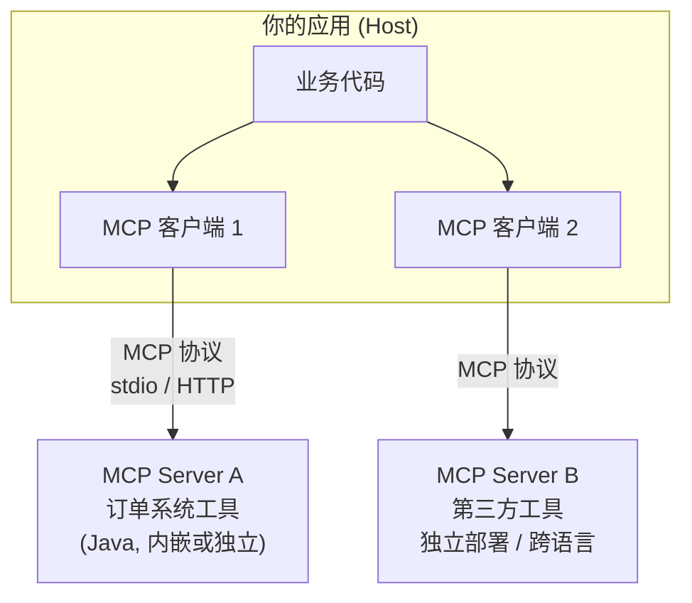

| 角色 | 是什么 | 例子 |
|------|--------|------|
| **Host** | 承载 LLM 与应用逻辑的程序 | Claude Desktop、你的 Spring Boot 应用 |
| **Client** | Host 内部、与 Server 建立连接的组件 | 你的应用里每个 MCP 客户端实例 |
| **Server** | 暴露工具/资源/提示词的进程 | 订单系统 MCP Server、GitHub MCP Server |

**关键认知**：你的应用既可以是 **Client**（连接并消费别人的 MCP Server），也可以是 **Host**（内部用 `@McpTool` 把方法暴露成 MCP 工具，供外部 Client 调用）。两边都做才叫会。

#### 2.7.3 用 `@McpTool` 暴露工具

Spring AI 提供 `@McpTool` 注解：把一个 Spring Bean 方法暴露成 MCP 工具。它和 `@Tool` 长得几乎一样，区别在于 `@Tool` 是应用内工具，`@McpTool` 是走 MCP 协议、可被外部客户端发现的工具。

```java
// 把方法暴露成 MCP 工具（API/包名以官方文档为准）
@Component
public class RefundMcpTools {

    @McpTool(name = "refund_order",
             description = "发起订单退款。仅当订单已支付、未完成且未超过退货期时调用；"
                           + "退款前请先确认订单状态，不要对未支付订单调用。")
    public RefundResult refund(@McpToolParam(name = "orderId") String orderId,
                               @McpToolParam(name = "reason", required = false) String reason) {
        // ... 真实退款逻辑，失败返回 ToolResult.fail（见 2.3）
        return refundService.refund(orderId, reason);
    }
}
```

**在 Spring Boot 里把 MCP Server 跑起来**（概念性配置，以官方文档为准）：

```yaml
# application.yaml
spring:
  ai:
    mcp:
      server:
        enabled: true          # 启动内嵌 MCP Server
        name: my-tools
        version: "1.0.0"
        transport: http        # 或 stdio；http 走 HTTP/SSE 可被远程客户端访问
        # ...
```

启动后，任何 MCP 客户端（Claude Desktop、另一个 Spring AI 应用、Python 客户端）都能发现并调用 `refund_order`。

#### 2.7.4 消费外部 MCP Server（应用做 Client）

你的 Spring AI 应用也可以作为 MCP 客户端，把**远端 MCP Server 的工具**注册进 ChatClient，让模型直接调用（概念性代码，以官方文档为准）：

```java
// 连接远端 MCP Server，把它的工具注册进 ChatClient
@Configuration
public class McpClientConfig {
    @Bean
    ChatClient chatClient(ChatClient.Builder builder, ChatModel chatModel) {
        // 1) 建立到远端 MCP Server 的客户端连接（传输方式：stdio 或 http）
        McpSyncClient mcpClient = McpClient.sync(
                HttpClientTransport.builder("http://localhost:8081/mcp").build());
        mcpClient.initialize();

        // 2) 把 Server 暴露的工具转成 Spring AI 的 ToolSpecification
        List<ToolSpecification> remoteTools = McpToolUtils.getToolSpecifications(mcpClient);

        // 3) 注册进 ChatClient（这些工具会和本地 @Tool 一起参与工具循环）
        return builder
                .defaultToolSpecifications(remoteTools)
                .build();
    }
}
```

#### 2.7.5 决策：什么时候用 MCP，什么时候直接 @Tool

不要盲目上 MCP。决策看**工具要不要出进程**：

| 用直接 `@Tool`（首选） | 用 MCP |
|------------------------|--------|
| 工具与主应用同进程、同语言（Java） | 工具要**出进程**（独立进程/容器/服务） |
| 简单、私有、紧耦合，只给自己用 | 要**跨语言**（Python 工具给 Java Agent 用） |
| 改动频繁，跟着应用一起发布 | 要**独立部署 / 独立发布 / 多处复用**（一个 Server 多客户端共享） |
| 不希望引入协议层开销 | 要**消费现成生态**（接第三方 MCP Server） |
| 本地一次性逻辑（如解析一段文本） | 工具是**长期存在的独立能力**（订单系统、数据平台） |

**一句话判断**：**先问"这个工具能不能安全地活在应用进程里"——能，就 `@Tool`；必须独立部署/跨语言/给别人复用，才上 MCP。** MCP 是解决"分布式工具接入"问题的，不是给所有工具加一层协议。

> 市场上 MCP 的"占据率"数据大多不可信（研究报告中已把 17-24% 之类的数字推翻）。但方向确定：MCP 是工具接入标准化的主流方向，值得掌握。别被炒作带偏——**你的项目里 70% 的工具用 `@Tool` 就够**。

---

### 2.8 多 Agent：何时需要，以及它的真实成本

#### 2.8.1 什么时候真的需要多 Agent

先记住铁律（来自《Building Effective Agents》并被业界反复验证）：

> **95% 的场景，一个 Agent + 好工具就够。** 上多 Agent 之前，先回答一个问题：**"为什么一个 Agent + 一组好工具做不到？"** 答不上来，就不要上。

真正需要多 Agent 的信号（这些是"角色天然分离"的具体形态）：

| 信号 | 说明 | 例子 |
|------|------|------|
| **角色天然分离** | 不同角色需要**不同 system prompt / 工具集 / 上下文**，塞进一个 Agent 会互相干扰 | 研究 Agent（要搜索工具）vs 写作 Agent（要风格约束）vs 评审 Agent（要严格标准） |
| **安全隔离** | 不同 Agent 有不同权限/工具白名单；高权限工具不能给通用对话 Agent | 运维 Agent 有删除权限，客服 Agent 只能只读查询 |
| **专业化上下文** | 每个 Agent 上下文更小更聚焦，质量更高 | 一个 Agent 装所有知识会又长又乱，拆开后每个更准 |
| **可独立演化** | 每个 Agent 可单独评估、单独迭代、单独部署 | 写作 Agent 改风格不影响评审 Agent |
| **并行独立任务** | 多个独立任务需要同时跑 | 多文件并行评审（但这也可能只是 Parallelization Workflow） |

**反直觉点**：很多"看起来该用多 Agent"的场景，其实是**单 Agent + 工具路由**或**Workflow**——比如"客服系统"一个 Agent + 一堆工具 + Routing 就够，不需要三个 Agent 互相传消息。

#### 2.8.2 多 Agent 的三种协作模式

| 协作模式 | 结构 | 适用 | 类比 |
|---------|------|------|------|
| **路由式（Router）** | 中枢分类，分发给专业 Agent，各自独立返回 | 类型天然不同、互不依赖 | 客服总机 → 转接到不同专家 |
| **编排式（Orchestrator）** | 中心 Agent 动态拆任务、派给 Worker、汇总 | 子任务动态不确定（见 2.4.4） | 项目经理 → 派活给组员 |
| **评审式（Reviewer）** | 生成 Agent + 评审 Agent 迭代 | 有明确标准、要质量把关（见 2.4.5） | 作者 → 审稿人 → 改稿 |

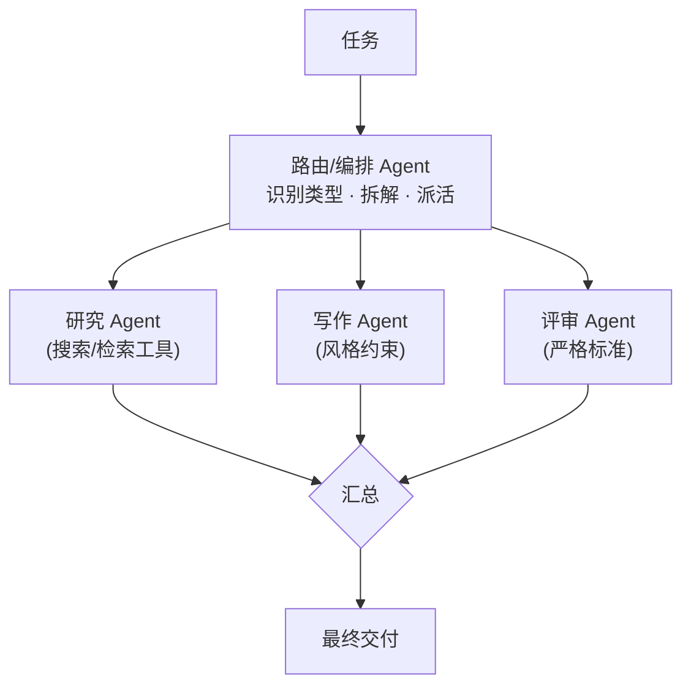

#### 2.8.3 复杂度是真实的成本

多 Agent 不是"更高级"，而是"更贵、更难"。列清账单：

| 成本维度 | 具体损失 |
|---------|---------|
| **金钱成本** | 每个 Agent 都是独立 LLM 调用链 → 总 token 随 Agent 数近似线性上涨 |
| **延迟** | 串行协作 = 延迟叠加；每次跨 Agent 传递都要一轮模型调用 |
| **上下文碎片化** | 信息在 Agent 之间传递会丢失/失真（写总结再传递 = 有损压缩） |
| **协调复杂度** | 状态同步、消息协议、失败如何传播（Worker 挂了，Orchestrator 怎么办？） |
| **调试难度** | 链路变长，一个错误可能来自任何一个 Agent，难以定位 |
| **评估复杂度** | 端到端指标难以归因到单个 Agent；每个 Agent 都要单独的评估集 |

**架构判断力要点**：
1. **从单 Agent 起步**：先一个 Agent + 好工具 + 好 Workflow，把问题压到"确实单 Agent 撑不住"再上多 Agent。
2. **按角色分，不按功能分**：多 Agent 的拆分维度是"角色的 system prompt / 权限 / 上下文天然不同"，不是"功能多就多开几个 Agent"。
3. **给多 Agent 上护栏**：多 Agent 更需要 maxTurns/预算/死循环检测（每个 Agent 都可能失控），甚至要做"编排级护栏"（编排者超时、Worker 超时熔断）。

#### 2.8.4 Java 实现思路

多 Agent 在 Spring AI 里最简单可靠的实现：**每个 Agent = 一个独立的 ChatClient Bean**（各自的 system prompt + 工具集 + 记忆），再写一个"协调者"代码（路由逻辑或编排循环）把它们串起来：

```java
@Configuration
public class MultiAgentConfig {

    @Bean
    ChatClient researchAgent(ChatClient.Builder builder, KnowledgeTools knowledgeTools) {
        return builder
                .defaultSystem("你是研究员。只负责收集事实，引用来源，不下结论。")
                .defaultTools(knowledgeTools)
                .build();
    }

    @Bean
    ChatClient writerAgent(ChatClient.Builder builder) {
        return builder
                .defaultSystem("你是撰稿人。把输入的事实整理成清晰的技术文章，风格客观。")
                .build();
    }

    @Bean
    ChatClient reviewerAgent(ChatClient.Builder builder) {
        return builder
                .defaultSystem("你是审稿人。严格检查事实准确性与结构，给出可执行修改意见。")
                .build();
    }
}

@Service
public class ResearchPipeline {
    private final ChatClient researchAgent;
    private final ChatClient writerAgent;
    private final ChatClient reviewerAgent;

    public String write(String topic) {
        String facts  = researchAgent.prompt().user("收集关于「" + topic + "」的事实").call().content();
        String draft  = writerAgent.prompt().user("基于以下事实写作:\n" + facts).call().content();
        String review = reviewerAgent.prompt().user("评审以下文章:\n" + draft).call().content();
        // 简化：评审结果可回灌给 writer 再迭代（即评审式协作，见 2.4.5）
        return writerAgent.prompt()
                .user("按评审意见改进:\n原稿:\n" + draft + "\n评审:\n" + review)
                .call()
                .content();
    }
}
```

> 更复杂的编排（动态拆任务、状态机、跨 Agent 共享状态）可以用 LangGraph4j 这样的状态图框架——那是阶段5 源码精读的内容。本阶段先掌握"多 Agent = 多个专业 ChatClient + 协调代码"这一最小形态。

---

### 2.9 本阶段思维框架小结

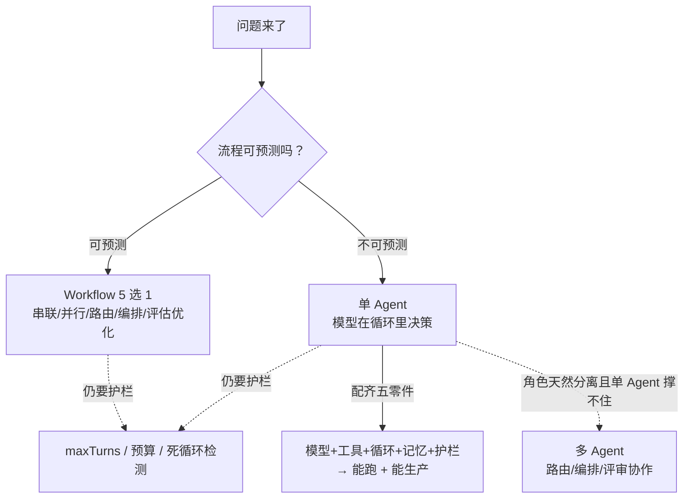

---

## 3. 动手任务（可执行清单）

> 纪律提醒：每周 5-7 次 Git 提交；所有改动配评估（工具选对率 / 步骤数 / 是否收敛）；每周 1 篇 300 字以上笔记。

### 第 1 周（第 15 周）· Agent Loop 本质

- [ ] 写一个 `while(true)` 的最小 Agent 循环（纯 Java，不依赖框架）：模型 → 解析 tool_calls → 执行工具 → 回传 → 再调，直到无工具调用。跑通"查天气"这个小工具
- [ ] 用 Spring AI 2.0 的 `ToolCallingAdvisor` 重写同一个 Agent，对比"自己写循环 vs 框架循环"的差别
- [ ] 画出一次完整 Agent 调用的**消息序列图**（参考 2.2.3），标注每条消息的 role 和 tool_call_id 配对
- [ ] 笔记：Agent 和"普通 LLM 调用"的本质区别（用你自己的话 + 一张图）

### 第 2 周（第 16 周）· 工具系统

- [ ] 为一个领域（订单/用户/库存）设计 3 个工具，逐个填写"设计五件事"（做什么/何时调/何时别调/参数/返回）
- [ ] 定义统一的 `ToolResult`（success/code/message/fixHint），改造 2 个工具让它们**失败返回 error 而不是抛异常**
- [ ] 构造一个"工具失败"场景，验证模型能看到 error 并自我修复（记录修复过程）
- [ ] 用 20 条真实问题测"工具选对率"，≥80% 才算通过；低于则调整工具描述
- [ ] 给每个工具写单元测试（正常/边界/异常参数）

### 第 3-4 周（第 17-18 周）· 5 大 Workflow 各 1 个 demo

- [ ] **Prompt Chaining**：文档 → 抽取 → 生成 → 格式化流水线
- [ ] **Parallelization**：长文本分段并行分析 + 一次投票（分类/抽取）
- [ ] **Routing**：简单/复杂问题分流（用便宜的模型做分类）
- [ ] **Orchestrator-Workers**：多段代码拆给多个 Worker 评审、编排者汇总
- [ ] **Evaluator-Optimizer**：文案/代码生成 → 评估 → 改进循环（带 maxIterations）
- [ ] 每个 demo 记录：调用次数、延迟、token 成本，填进对比表
- [ ] 用 2.4.6 的选型图，把 5 个 demo 的"为什么用这个模式"写进 README

### 第 5 周（第 19 周）· 记忆架构

- [ ] 用 `ChatMemory`（MessageWindowChatMemory / TokenWindowChatMemory）做多会话对话记忆，验证不同 conversationId 互不串话
- [ ] 实现一个最简单的**长期记忆**：用户偏好存关系库，会话开始时注入、结束时写入
- [ ] 把 RAG 封装成 `search_knowledge` 工具，让 Agent 按需查知识库
- [ ] 用 spring-ai-session 做**事件溯源会话持久化**，验证"服务重启后会话不丢"（重启进程再提问，模型记得上文）

### 第 6 周（第 20 周）· 防失控

- [ ] 用 `ToolCallingAdvisor` 的 maxToolCallIterations 设迭代上限，构造"模型反复调工具"的用例，验证被截断
- [ ] 实现美元预算守卫（按 usage 累加成本，超预算抛异常），记录一个超预算用例
- [ ] 实现死循环检测（工具名+参数哈希签名，连续 3 次相同终止），构造一个死循环用例
- [ ] 把三重保护挂进 Advisor 链，写一个"失控测试"JUnit 用例，断言护栏生效
- [ ] 笔记：三种护栏各自防什么、阈值怎么定（写清你的"经验值"和推理）

### 第 7 周（第 21 周）· MCP

- [ ] 用 `@McpTool` 暴露 1-2 个工具，启动内嵌 MCP Server，用 MCP Inspector 或一个测试客户端验证工具可被发现、可被调用
- [ ] 消费一个现成/自建的 MCP Server：应用做 Client，把远端工具注册进 ChatClient 并让模型调用
- [ ] 写一份决策笔记：项目里哪些工具该 `@Tool`、哪些该上 MCP（用 2.7.5 的判断标准，给理由）

### 第 8 周（第 22 周）· 多 Agent

- [ ] 把第 4 周的 Orchestrator-Workers 升级成"多 Agent"（研究 Agent / 写作 Agent / 评审 Agent 三个独立 ChatClient + 协调代码）
- [ ] 用 2.8.1 的信号清单，给你的 P3 项目做一次"是否真的需要多 Agent"论证，写下结论
- [ ] 给多 Agent 系统加"编排级护栏"（协调者超时、Worker 超时）
- [ ] 笔记：多 Agent 的成本账单（token ×N、延迟叠加、调试难度）

### 第 9-10 周（第 23-24 周）· 项目 P3 收尾

- [ ] **代码评审助手**整合：提交 .java 文件 → Routing（简单/复杂文件分流）→ Parallelization（多文件并行）→ Orchestrator（大文件拆段）→ Evaluator-Optimizer（评审报告迭代）→ 输出结构化评审报告
- [ ] 跑 30+ 评估集，出指标基线：faithfulness / 问题覆盖率 / 评审准确性（至少 3 个量化指标）
- [ ] 演示脚本 + README（含架构图、5 个 Workflow 的取舍说明、护栏说明）
- [ ] 1 篇阶段复盘笔记：本阶段最强的 3 个认知、最痛的 3 个坑

---

## 4. 验收标准（可勾选）

> 全部打勾才算通过本阶段。**没通过不进入阶段4。**

**核心理解**
- [ ] 能用自己的话+一张图画清 Agent 最小循环（decide/act/observe），说清"模型在循环里做决策"
- [ ] 能画出 ReAct/Function Calling 的**完整消息序列**（含 role 配对、tool_call_id）
- [ ] 能说出五个零件里哪些决定"能跑"、哪些决定"能生产"
- [ ] 能背出 Anthropic 5 大 Workflow 的对比表，并各举一个"反模式"
- [ ] 能说出"Workflow > Agent"金科玉律的含义，并解释为什么

**代码能力**
- [ ] P3 代码评审助手完整可运行：提交 .java 文件 → 输出结构化评审报告
- [ ] 5 大 Workflow 各至少 1 个可运行 demo（含记录成本/延迟/步数的对比表）
- [ ] 所有工具失败时返回 `ToolResult.error` 且模型能自我修复（有记录）
- [ ] 工具选对率 ≥ 80%（20 条真实问题测过）

**工程能力**
- [ ] Agent 有三重保护（maxTurns / 美元预算 / 死循环检测）+ 失控测试用例（JUnit 断言护栏生效）
- [ ] 会话持久化验证通过：重启进程后会话不丢（spring-ai-session 事件溯源）
- [ ] MCP 双向跑通：`@McpTool` 暴露 + 消费 MCP Server，工具可用
- [ ] 多 Agent 论证文档：写明"为什么 P3 需要/不需要多 Agent"，附成本账单

**评估**
- [ ] P3 评估集 ≥ 30 条，至少 3 个量化指标（faithfulness / 覆盖率 / 准确性），有基线数据
- [ ] 所有改动都跑过评估（过程纪律）

**自测问题**（能口头答出即视为掌握）
- [ ] "普通 LLM 调用"和 Agent 的本质区别是什么？
- [ ] 工具抛异常 vs 返回 `ToolResult.error`，对模型行为有什么不同影响？
- [ ] 5 大 Workflow 各自的适用和反模式是什么？你的 P3 里哪个环节用了哪个、为什么？
- [ ] 三类记忆各解决什么问题？spring-ai-session 的事件溯源和"存快照"比有什么好处？
- [ ] 什么信号下你才会上多 Agent？多 Agent 的真实成本有哪些？
- [ ] 一个工具"要出进程/跨语言/独立部署"时选 MCP，否则选 `@Tool`——为什么？

---

## 5. 高质量英文资料

| 资料 | 一句话中文点评 | 优先级 |
|------|---------------|:---:|
| Anthropic《Building Effective Agents》（anthropic.com/engineering/building-effective-agents） | **本阶段圣经**：Workflow vs Agent 的完整论述，5 大模式原文出处，"find the simplest solution"是整篇灵魂 | 必读 |
| ReAct 论文《ReAct: Synergizing Reasoning and Acting in Language Models》（Yao et al. 2023，arXiv:2210.03629） | Agent 思考-行动循环的源头论文，理解 Thought/Action/Observation 的最一手材料 | 必读 |
| Anthropic《Effective Tool Use》（anthropic.com/engineering/effective-tool-use） | 工具设计最佳实践的官方工程文章：错误返回、工具语义、不要重复造"万能工具" | 强烈推荐 |
| MCP 官方文档（modelcontextprotocol.io） | 协议本身最权威的来源：Architecture、Tools/Resources/Prompts、Transport、各语言 SDK | 强烈推荐 |
| Spring AI 官方参考文档（docs.spring.io/spring-ai） | ChatClient / Advisor / ToolCalling / Session（事件溯源）/ MCP 集成的权威 API 出处——**代码以它为准** | 必查 |
| LangGraph 官方文档（langchain-ai.github.io/langgraph） | 状态机 / 多 Agent / 持久化的进阶编排参考，阶段5 会精读，本阶段可先浏览 | 备查 |
| 《A Survey on LLM-based Autonomous Agents》（2024，arXiv:2308.11432） | Agent 系统全景综述：记忆、规划、工具、多 Agent 的学术框架，建立全景认知 | 备查 |

**阅读方法提醒**：英语资料"翻译 + 内化"，别只收藏——每篇读完在笔记里写"它讲的核心问题是什么 / 我能否用自己的话讲清 / 我能否在 Java 里复现"。

---

## 6. 下一阶段预告

本阶段你学会了"把 Agent 做出来"。阶段4（生产化工程）要回答"让它扛住生产"：可观测（OTel trace / token 计费）、成本治理（Prompt Cache / 模型路由）、安全（Prompt Injection 防御 / OWASP LLM Top10）、可靠性（重试 / 幂等 / 熔断）、评估进 CI。到时候你现在的三重保护会升级成完整的生产护栏体系，你的 Advisor 链会从"能跑"变成"能扛"。
