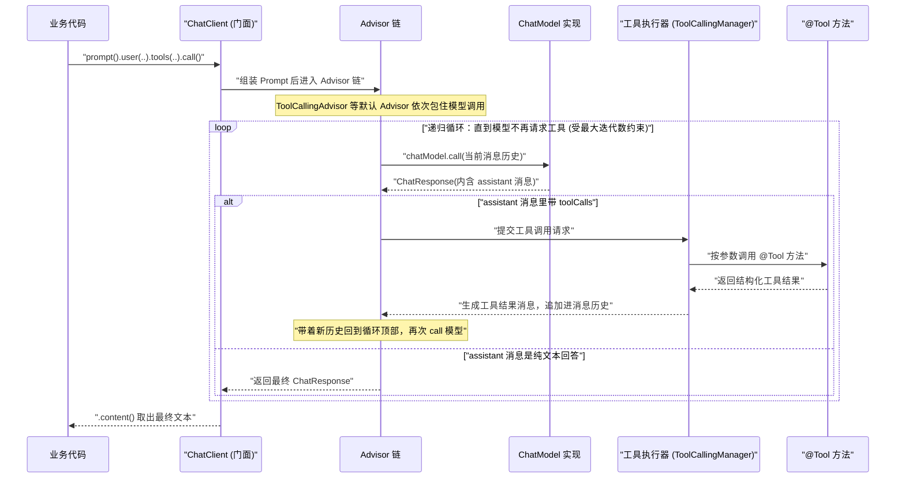
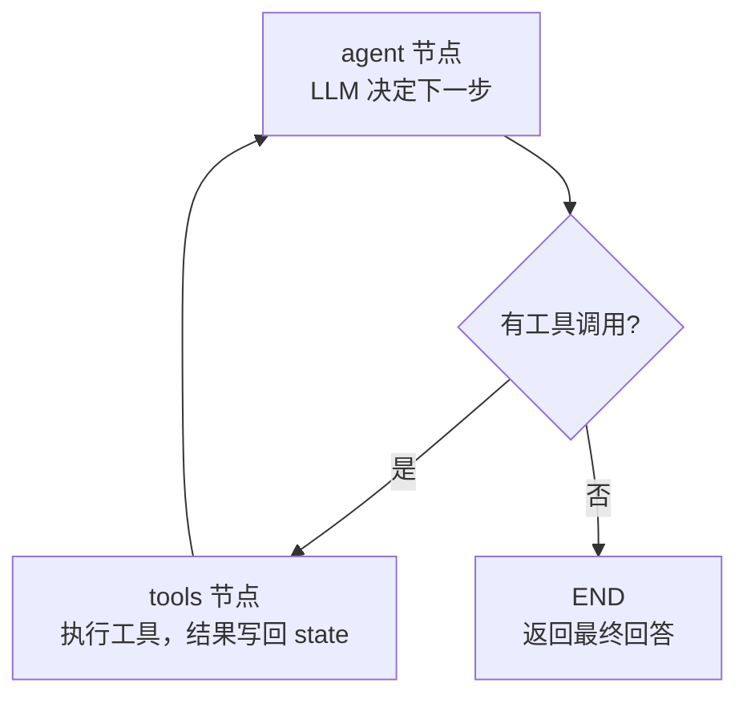
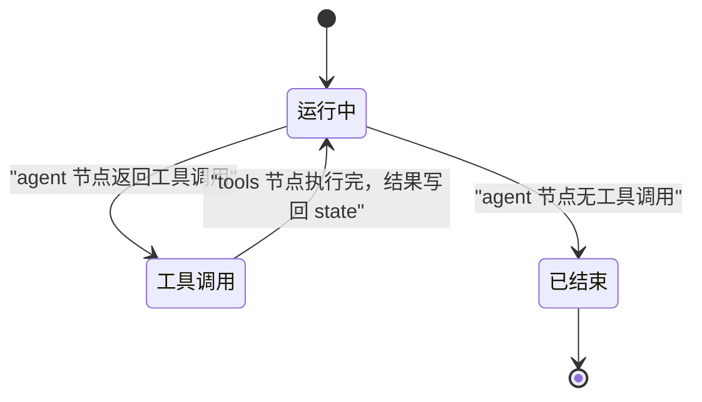
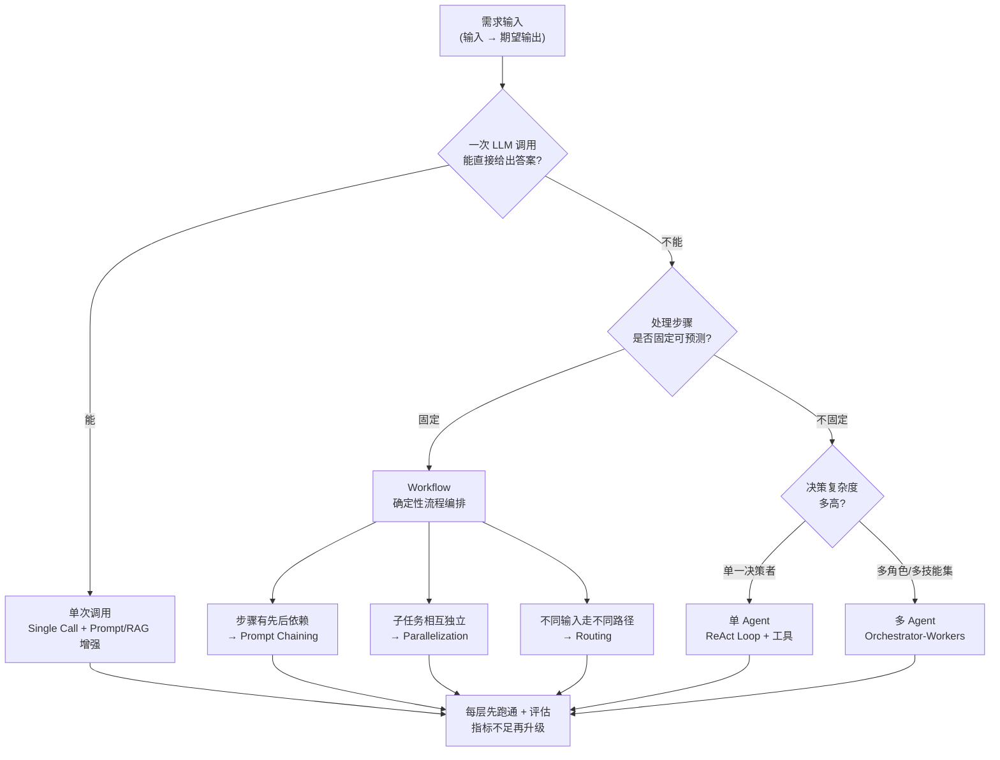
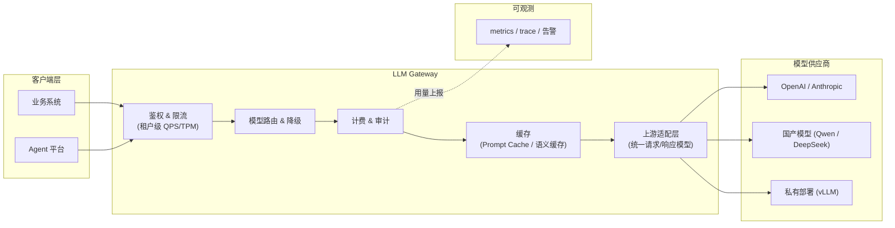
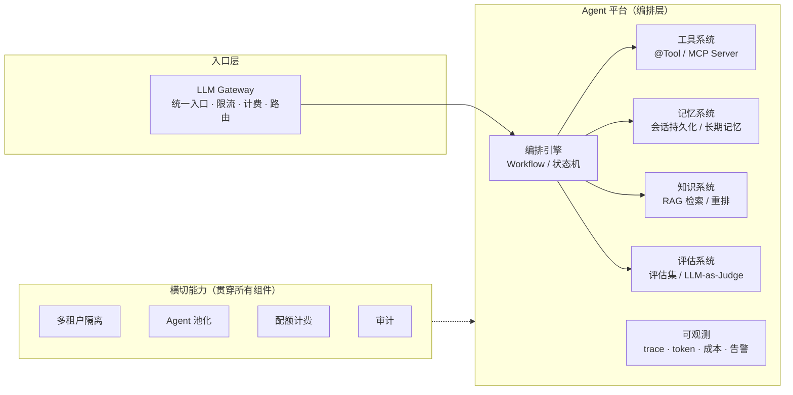

# 09 · 阶段 5-6 · 框架源码精读 + 架构师与平台设计

> **本份是什么**：把 03 学习计划总览里「阶段 5 框架源码精读（贯穿 10-16 周）」与「阶段 6 架构师与平台设计（第 33-44 周）」两份材料**合并**成一份自包含学习材料。看完这一份，你要能：读懂一个 Agent 框架的源码并复刻最小实现；面对需求 30 分钟出架构选型；评审陌生 Agent 系统能不能上生产；画出并讲清 LLM Gateway 与 Agent 平台的最小架构。
>
> **你的主栈**：JDK 21 + Spring AI 2.0 + Spring Boot 4。所有 Java/配置示例都按这个风格写；凡是 API 细节可能随版本变化的，一律标注「以官方文档为准」。
>
> **诚实声明**：本文把「市场经验值」与「可查证事实」分开标注。凡是用**斜体**标「经验值」的，来自行业惯例/招聘观察，需要你在真实项目里自行验证；其余尽量给出可查证的机制与结构。

---

## 0. 一句话

> **阶段 5 让你从「会用框架」变成「读得懂框架」——这是 AI Agent 开发工程师溢价 20-30% 的硬门槛；阶段 6 让你从「做一个 Agent 系统」升级成「设计一个 Agent 平台」——这是 principal agent architect 溢价 2-3 倍对应的能力。两个阶段串起来，就是你从「会写代码的人」变成「做架构决策的人」的那道坎。**

---

## 1. 本阶段目标

### 1.1 阶段 5 · 框架源码精读的目标

- 能讲清「一次 `ChatClient.call` 到底发生了什么」的**完整调用链**（含工具调用的递归循环）；
- 能讲清状态机「节点 / 边 / 状态 / checkpoint」各自解决什么问题；
- 能讲清结构化输出「校验失败后如何重试」的机制；
- 亲手**复刻**一个 50-100 行的最小 Agent Loop / 最小状态机；
- 产出 3 篇以上「精读笔记」：每个模块回答「解决什么问题 / 为什么这么设计 / 如果我来写会怎么改」。

### 1.2 阶段 6 · 架构师与平台设计的目标

- 面对一个需求，**30 分钟**内给出架构选型（结构 + 权衡 + 风险）；
- 用 **8 项评审清单**给陌生 Agent 系统做评审，给出「能不能上生产」的结论；
- 画出并讲清 **LLM Gateway** 架构（统一入口 / 限流 / 计费 / 路由 / 多租户上下文 / 缓存）；
- 画出并讲清 **Agent 平台最小架构**（Gateway → 编排引擎 → 工具 / 记忆 / 知识 / 评估 / 可观测 + 多租户隔离 / Agent 池化 / 配额计费 / 审计）；
- 会用 **ADR 模板**做「自研 vs 框架」的决策；
- 能把一个架构决策**翻译成 System Prompt 与工具清单**。

### 1.3 里程碑定位（来自市场研究的职级映射）

| 阶段 | 完成后你是谁 | 市场对应岗位 | 市场溢价 |
|:---:|------------|------------|---------|
| 阶段 5（贯穿） | L2 会扛 | AI Agent 开发工程师 | 比 AI 应用开发工程师 **+20-30%**，硬门槛 = 至少读过一个框架源码 |
| 阶段 6 | L3 会设计 | AI Agent 架构师 / principal agent architect | 资深 AI 工程师 +40-70%；**principal 2-3 倍** |

> 市场洞察（来自本专题 01 报告）：JD 里「AI Agent 工程师」的核心不是提示词，而是三件事——**编排多组件 Agent 系统、实现 Agent 记忆与上下文管理、设计生产环境的护栏**。读源码正是理解这三件事底层机制的唯一途径；而设计平台是把这三件事规模化、产品化的动作。

---

## 2. 阶段 5 · 核心知识：框架源码精读

### 2.1 为什么读源码是分水岭

**先纠正一个误区**：「读源码」不是让你背类名、背方法签名——那是记 API 手册，面试一问就穿。读源码的目的是获得三种**无法通过看文档获得**的能力：

1. **解释异常的能力**。框架文档只讲「怎么用」，不讲「边界和坑」。线上出问题（比如工具调用结果没被模型看到、上下文被意外截断、校验重试没生效），只有读过源码你才知道去查哪一层。文档告诉你「能做什么」，源码告诉你「为什么有时做不到」。
2. **架构品味的来源**。框架是顶级工程师做的架构决策的结晶。你读 Spring AI 的 Advisor 链、读 LangGraph 的状态机，等于把一流团队的取舍（接口怎么分层、循环怎么收敛、扩展点开在哪里）直接吸收成自己的设计直觉。这是架构师「看一眼就知道这样设计对不对」的来源。
3. **面试与定价的分水岭**。市场研究报告的结论：「AI Agent 开发工程师」比「AI 应用开发工程师」溢价 20-30%，两者的核心技能差异就是**是否读过至少一个框架源码**。JD 里写的「精通 LangChain/Spring AI」只有源码级的理解才能撑起来。面试官问你「一次工具调用循环怎么终止的」，背文档的人答不上来，读过源码的人能画出来。

**读源码读的是「决策」，不是「代码」**：每个模块问三句话——
- 它解决什么问题？（不解决会怎样）
- 为什么这么设计？（备选方案是什么，为什么被否掉）
- 如果我来写，我会怎么改？改完是更好还是更差？

> 经验值：读透 1 个框架（能画出主流程调用链）的效果，远好于 4 个框架各读一半。精读顺序就按 2.3 来，前一个没验收，不进下一个。

### 2.2 精读方法论（五步，每一步怎么做）

不要从头到尾读源码——那是阅读顺序，不是理解顺序。用下面的五步，每读一个模块走一遍：

**第 1 步 · 先跑后读（建立行为基线）**

先写一个「最小可用程序」把这个模块跑通，并且**故意加日志**。目的：在你读代码之前，先知道这段代码「在行为上应该做什么」，这样读源码时你能对照「行为」找「实现」。

怎么做：
- 用 Spring AI 2.0 写一个 `ChatClient` + 1 个 `@Tool` 的最小程序（比如「查询城市天气」），跑通；
- 打开 DEBUG 日志（`logging.level.org.springframework.ai=DEBUG`），观察一次带工具调用的请求打出了哪些日志；
- 把观察到的「行为顺序」记下来。这一步通常 30 分钟内完成。

**第 2 步 · 追主流程（从入口追一条主线，不遍历分支）**

从你代码调用的入口方法（比如 `ChatClient.call()`）开始，用 IDE 的 debugger 单步或「点击跳到实现」，**只追一条主线**：一次正常的、带一次工具调用的调用，经过哪些关键对象。遇到不影响主线的分支（异常处理、可选日志、边角配置）先跳过，记下来「这里还有分支，后面再回来看」。

怎么做：
- 在入口方法打断点，看调用栈（call stack），这是最快的地图；
- 追的时候只记录「对象名 → 方法名 → 职责一句话」，记成列表；
- 遇到接口，看它的默认实现类是什么（比如 `ChatClient` 的默认实现是 `DefaultChatClient`），进默认实现。

**第 3 步 · 画调用链（把主线可视化）**

把你追到的主线画成**时序图或流程图**。图的价值：你会立刻发现「我其实没搞懂这一段」——画不出来的地方就是你没读懂的地方。

怎么做：
- 用 Mermaid 画时序图（参与者：业务代码 / ChatClient / Advisor 链 / ChatModel / 工具执行器 / @Tool 方法）；
- 节点文字保持短，箭头标签写条件；
- 画完对照源码再走一遍，修正不对的地方。2.4.1 给你一份画好的参考图，但**你要自己重画一遍**才有效。

**第 4 步 · 复刻最小版（用 50-100 行证明你懂了）**

自己写一个「伪框架」，复刻核心逻辑，不接真实模型、只接 mock。目标不是工程化，是**验证你的理解**：如果你能写出一个能跑的最小 Agent Loop / 最小状态机，说明你读懂了这个框架的核心抽象。

怎么做：
- 最小 Agent Loop 参考 2.4.2 的 `MiniAgentLoop`；
- 最小状态机参考 2.4.3；
- 写完拿一个真实场景跑一遍（哪怕用 `return "mock"` 代替模型回答），能收敛就行。

**第 5 步 · 写笔记（沉淀为你的资产）**

每读一个模块，写 100-300 字笔记，固定回答三个问题：它解决什么问题？为什么这么设计？如果我来写会怎么改？笔记是面试时你能讲出来的「你的版本」——源码是别人的，笔记才是你的。

---

### 2.3 精读顺序（从熟悉到陌生）

| 顺序 | 读什么 | 为什么 | 主要产出 |
|:--:|--------|--------|---------|
| 1 | **Spring AI 2.0**：`ChatClient` + `ToolCallingAdvisor` | 你的主栈，先读透 Agent Loop 的官方实现；你写代码天天经过它 | 完整调用链图 + 精读笔记 |
| 2 | **LangChain4j**：`AiServices` + 内部 Agent 循环 | 对照第二个实现，看不同框架对同一问题怎么取舍（比如「循环在哪一层」「工具结果怎么回传」） | 对照笔记 |
| 3 | **LangGraph4j**：`StateGraph` 状态机 | 进阶编排：理解节点/边/状态/checkpoint 的抽象，这是阶段 6 编排引擎的原型 | 复刻最小状态机 |
| 4 | **LangGraph（Python）**：对应模块 | 市场主流是 Python（岗位出现率 LangGraph 22.6%，LangChain 34.5%）；你不需要会写 Python，但要**读得懂**主流生态 | 双语对照笔记 |

**顺序的设计逻辑**：先读自己天天用的（成本最低、收益最快），再读对照实现（用差异加深理解），最后读市场主流（扩大覆盖面）。不要从 LangGraph 论文读起——从自己用的框架开始，你才有「我已经知道它该做什么」的行为基线。

#### 2.3.1 源码地图：先知道去哪找（Spring AI 2.0 仓库）

读源码最怕的是「打开仓库不知道从哪下手」。先把仓库结构摸清楚，你就有了地图。Spring AI 是**多模块**仓库（`spring-projects/spring-ai`），读的时候按「用到什么看什么」，别整个仓库通读：

| 你关心的 | 去哪个模块/包找（以你 clone 的版本为准） | 重点类 |
|---------|---------------------------------------|--------|
| ChatClient 门面 | `spring-ai-client-chat` | `ChatClient`、`DefaultChatClient`、`ChatClientBuilder` |
| Advisor 链 | `spring-ai-client-chat` 的 `advisor` 子包 | `Advisor`、`SimpleLoggerAdvisor`、`MessageChatMemoryAdvisor`、`QuestionAnswerAdvisor`、`StructuredOutputValidationAdvisor` |
| 工具调用循环 | `spring-ai-model` 的 `tool` 相关包 | `ToolCallingAdvisor`、`ToolCallingManager`、`ToolCallback`、`ToolResult` |
| @Tool 注解 | `spring-ai-model` 的 `tool.annotation` | `Tool`、`MethodToolCallbackProvider` |
| 结构化输出 | `spring-ai-model` 的 `converter` | `StructuredOutputConverter`、`BeanOutputConverter`、`StructuredOutputValidationAdvisor` |
| 具体模型实现（OpenAI） | `spring-ai-openai` | `OpenAiChatModel`、`OpenAiChatOptions` |

> 读的时候顺手做一件事：把「我用过的每个 Spring AI 类」在源码里找到它的**包路径**。你会发现它们天然分成几层（client 层 / model 层 / 具体供应商层）——这个分层结构本身就是架构设计的教材。

读 LangChain4j（`入门-LangChain4j-langchain4j`）时同理：核心循环在 `langchain4j-core` 与 `langchain4j` 模块里，`AiServices` 的代理生成逻辑在 `langchain4j` 模块的 `service` 包。**对照这两个框架时，永远问同一个问题：工具调用循环放在哪一层、谁来触发递归**——两个框架的答案不同，这就是「设计取舍」。

---

### 2.4 要读懂的关键点

这一节是阶段 5 的核心知识本体。四个关键点，每一个都要「读懂 + 能画出/能写出」。

#### 2.4.1 关键点一：一次 `ChatClient.call` 到底发生了什么

**先说分层直觉**：`ChatClient` 是**门面（Facade）**——它自己不调模型，它做三件事：
1. 把你写的 `.user(..)` / `.system(..)` / `.tools(..)` / `.options(..)` 组装成一个 `Prompt`（一组 `Message` + 一组 `ChatOptions`）；
2. 把组装好的 `Prompt` 丢进一条 **Advisor 链**（责任链模式）；
3. Advisor 链里的每个 Advisor 包一层 `chatModel.call(prompt)`，可以「调模型之前」和「拿到响应之后」做手脚。

这就是为什么读 Spring AI 源码，第一座要爬的山是「**Advisor 链 + ChatModel 分层**」，而不是「模型 API 怎么封装」。

**核心调用链（带一次工具调用的完整过程）**：



**逐层拆解（你要在源码里找到这些对象）**：

| 对象 | 职责 | 你要在源码里确认的点 |
|------|------|---------------------|
| `ChatClient` / `DefaultChatClient` | 门面：组装 Prompt、调 Advisor 链、把 ChatResponse 转成用户友好的返回 | `.call()` 和 `.stream()` 走的是不是同一条链 |
| `Advisor` 接口 | 责任链元素：`around` 模型调用 | 链的顺序是否可配、默认有哪些 Advisor |
| `ToolCallingAdvisor` | 工具调用循环的核心：发现 toolCalls → 执行 → 回传结果 → 再次调用 | **循环终止条件在哪一行**；最大迭代数上限在哪定义 |
| `ChatModel` 实现（如 `OpenAiChatModel`） | 与具体供应商的 HTTP 协议对接；返回 `ChatResponse` | 工具定义（JSON Schema）在请求里怎么拼装 |
| `ToolCallingManager` | 把模型请求的工具调用分派给对应的 `ToolCallback` | 工具结果消息的类型与 toolCallId 的匹配机制 |
| `ToolCallback` / `@Tool` | 把 Java 方法暴露成模型可调用的工具 | 方法参数怎么变成 JSON Schema |

> **读源码时的三个验证实验**（自己动手做）：
> 1. 把工具调用循环的最大迭代数调成 1，观察模型「第一次请求工具后」会发生什么（应该直接返回带工具调用的响应，不再执行）；
> 2. 让工具抛异常，看框架把异常包装成什么样的「工具结果」回给模型（好的设计会让模型「看到错误并自我修复」）；
> 3. 在 `ToolCallingAdvisor` 打断点，数一数循环里消息历史是「累积」还是「替换」。

#### 2.4.2 关键点二：Agent Loop 如何递归迭代工具调用

**Agent Loop 的本质**（阶段 3 已经学过，这里看源码级实现）：`while(true) { decide(); act(); observe(); }`——模型每一步决定「直接回答」还是「调用工具」，工具结果再喂回去，直到模型认为不需要工具了。

**Spring AI 2.0 的实现位置**：`ToolCallingAdvisor` 就是那个循环。它的工作顺序是：

1. 调用 `chatModel.call(prompt)` 拿到 `ChatResponse`；
2. 取出 assistant 消息，看它是否带有 `toolCalls`；
3. **如果没有工具调用 → 循环结束**，返回该响应；
4. **如果有 → 把每个工具调用交给 `ToolCallingManager` 执行**，拿到结果，把「assistant 消息 + 工具结果消息」追加进消息历史；
5. 用**累积后的新历史**再次调用 `chatModel.call(...)`，回到第 2 步。

**为什么「追加历史」而不是「替换」**：模型是**无状态**的（阶段 0 的心智模型），每次调用只看到你传给它的消息。要让模型理解「你上一步调用了工具、工具返回了 `XX`」，你必须把「模型请求工具的 assistant 消息」和「工具结果消息」都放进下一次调用的输入里。这就是「上下文管理」在源码里的具体体现——你读到的 `history.add(...)` 就是 JD 里写的「上下文管理」能力。

**递归的终止（护栏）**：无限循环是 Agent 最大的运行时风险。框架里至少有三层保护，你要在源码里找到它们：
- **最大迭代数**（`maxIterations` / `maxTurns`）：超过即抛异常或返回带说明的响应；
- **成本/配额**（通常由阶段 6 的 Gateway 层做，不在这层）；
- **重复检测**：检测到相同工具调用反复触发（死循环特征），提前终止。

**复刻一个最小 Agent Loop（这是你「读懂」的证明）**：

```java
// 最小 Agent Loop —— Spring AI 2.0 风格示意
// 注意：类名/方法以你本机 Spring AI 2.0 源码为准；这一步读完源码后，
// 你可以回来把这里的类名改成分毫不差的真实类名——这就是读源码的副产品。
public class MiniAgentLoop {

    private final ChatModel chatModel;
    private final Map<String, ToolCallback> tools = new HashMap<>();

    public MiniAgentLoop(ChatModel chatModel, ToolCallbackProvider toolProvider) {
        this.chatModel = chatModel;
        toolProvider.getToolCallbacks()
                .forEach(tc -> tools.put(tc.getToolDefinition().name(), tc));
    }

    public String run(String userInput) {
        List<Message> history = new ArrayList<>();
        history.add(new UserMessage(userInput));

        final int MAX_ITERATIONS = 5;   // 护栏 ①：迭代上限
        for (int i = 0; i < MAX_ITERATIONS; i++) {
            ChatResponse resp = chatModel.call(new Prompt(history));
            AssistantMessage assistant = resp.getResult().getOutput();
            history.add(assistant);                        // 记住：模型消息要进历史

            if (assistant.getToolCalls() == null || assistant.getToolCalls().isEmpty()) {
                return assistant.getText();                // ① 模型直接回答 → 收敛
            }

            for (ToolCall toolCall : assistant.getToolCalls()) {  // ② 执行每个工具
                ToolCallback callback = tools.get(toolCall.name());
                String result = callback.call(toolCall.arguments());
                history.add(new ToolResponseMessage(toolCall.id(), result)); // ③ 结果回传
            }
            // ④ 带新历史回到循环顶部，模型可能继续调工具，也可能最终回答
        }
        throw new IllegalStateException("达到最大迭代次数，Agent Loop 未收敛");
    }
}
```

> 这个 `MiniAgentLoop` 就是你复刻的「最小 Agent Loop」的骨架。把它跑通（模型用 mock），再对照 `ToolCallingAdvisor` 源码，你会发现官方实现多了什么——通常多的是：更细致的错误处理、`stream` 版本、Advisor 可插拔。**你能说清楚「官方多出来的每一块是干什么的」，这一关就过了。**

#### 2.4.3 关键点三：状态机「节点 / 边 / 状态 / checkpoint」各自解决什么

LangGraph4j / LangGraph 的核心抽象是**图（Graph）**。它把 Agent 的执行建模成一张有向图：数据在「状态」里流动，被「节点」处理，沿着「边」前进，在「checkpoint」处留下快照。

**先看一张图长什么样**（这是 LangGraph 风格的 Agent 拓扑，两个节点 + 一条条件边）：



**四个要素各解决什么问题**：

| 要素 | 是什么 | 解决什么问题 | 反例（没有它会怎样） |
|------|--------|------------|--------------------|
| **节点 Node** | 一个「单元工作」：读入 state，处理后把更新写回 state（如 `agent` 节点调 LLM、`tools` 节点执行工具） | 把复杂 Agent 拆成可复用、可单独测试的步骤 | 一个巨型函数做所有事 → 无法测试、无法复用、无法中断 |
| **边 Edge** | 节点之间的连接：普通边（无条件走）与**条件边**（根据 state 里的值决定走哪条） | 表达「流程的拓扑」，特别是分支逻辑 | 所有分支都写死在节点里 → 图不可见、流程不可配 |
| **状态 State** | 贯穿整个 run 的共享数据结构（如累积的消息列表、中间结果、计数器） | 节点之间传递数据的「管道」；它让每个节点无状态化（节点只看 state、改 state） | 节点之间靠隐式全局变量传参 → 顺序耦合、不可回放 |
| **Checkpoint** | 在每一步（superstep）把 state 持久化成一个快照 | ① **断点续跑**（崩溃/暂停后从快照恢复）；② **时间旅行调试**（回退到某一步重看）；③ **人机协同**（跑到某步暂停等人工确认） | 长任务中断就全部重来；出问题无法回放定位 |

**为什么「节点 + 边 + 状态」比「if/else 控制流」强**：
- **可观测**：每一步之后 state 是什么，都有据可查（配合 checkpoint）；
- **可组合**：节点像积木，换边、加节点就是改配置，不用重写逻辑；
- **可恢复**：checkpoint 让「中断续跑」成为可能——这对企业长任务（多步骤、耗时几分钟的 Agent）是刚需。

**一个状态迁移的直观例子**（一个 agent run 的生命周期）：



**LangGraph4j 最小状态机的骨架（复刻用）**：

```java
// LangGraph4j 最小状态机示意 —— 类名/API 以你读到的版本为准
// StateGraph：节点 + 边 + 编译；StateSnapshot：checkpoint 结果

StateGraph<MyState> graph = new StateGraph<>(MyState.class);

graph.addNode("agent", this::agentNode);      // 节点：调 LLM
graph.addNode("tools", this::toolsNode);      // 节点：执行工具

graph.addEdge("agent", "tools");              // 普通边（示意）
graph.addConditionalEdge("tools", this::shouldContinue, Map.of(
        "end", END,               // 无工具调用 → 结束
        "agent", "agent"          // 有工具调用 → 回到 agent
));

graph.setEntryPoint("agent");                 // 入口
CompiledGraph<MyState> app = graph.compile(); // 编译成可执行图

StateSnapshot<MyState> result = app.invoke(initialState, config); // 跑一次
```

**LangGraph（Python）对应写法**（市场主流，要求读得懂）：

```python
from langgraph.graph import StateGraph, END
from typing import TypedDict

class State(TypedDict):
    messages: list

builder = StateGraph(State)
builder.add_node("agent", agent_node)     # 节点
builder.add_node("tools", tools_node)     # 节点
builder.set_entry_point("agent")          # 入口
builder.add_conditional_edges("agent", should_continue, {"end": END, "tools": "tools"})
builder.add_edge("tools", "agent")        # 边
app = builder.compile(checkpointer=MemorySaver())  # checkpoint
```

> 读 LangGraph4j 时重点看两件事：① **checkpoint 存的是什么**（整个 state？增量？），② **条件边的判定函数签名**（读什么字段、返回什么值）。这两个设计点直接决定你阶段 6 做「编排引擎」时怎么选型。

#### 2.4.4 关键点四：结构化输出校验与重试机制

**为什么需要它**：LLM 输出是字符串，模型「声称」输出 JSON 但不保证合法。不校验直接 `JSON.parse`，生产环境必崩。Spring AI 的结构化输出三件套：**类型定义 → 转换器 → 校验+重试**。

**第一步 · 定义类型**（Java record，Spring AI 用它生成 JSON Schema 交给模型）：

```java
// 期望的结构化输出类型
public record Weather(
        String city,
        double temperature,
        String condition,   // 天气状况
        String unit         // 温度单位
) {}
```

**第二步 · 转换器**：`BeanOutputConverter` 做两件事——把你的 Java 类型变成 JSON Schema（在请求里告诉模型「输出长这样」），再把模型输出的字符串 `convert` 回 Java 对象：

```java
StructuredOutputConverter<Weather> converter = new BeanOutputConverter<>(Weather.class);

String json = chatClient.prompt()
        .user("北京天气怎么样？")
        .call()
        .content();

Weather weather = converter.convert(json);   // 解析失败会抛异常
```

**第三步 · 校验 + 重试（关键机制）**：只有「类型能解析」还不够，还要「业务上合法」（比如 `temperature` 是数字但落在 `-273` 这种不合理值）。Spring AI 提供 `StructuredOutputValidationAdvisor`，它做的是：

1. 模型输出 → 转换器解析成对象；
2. 用 Spring Validator（`Validator` 接口）校验业务规则；
3. **校验失败 → 把「错误信息 + 纠正提示」追加成一条消息**，带着它**再次调用模型**（这就是「重试」的本质——不是无脑重发，是**把错误反馈给模型让它修正**）；
4. 重试次数达到上限（`maxRetries`）仍失败 → 抛异常。

```java
// 校验器：业务规则
public class WeatherValidator implements Validator {
    @Override
    public boolean supports(Class<?> clazz) {
        return Weather.class.isAssignableFrom(clazz);
    }

    @Override
    public void validate(Object target, Errors errors) {
        Weather w = (Weather) target;
        if (w.temperature() < -100 || w.temperature() > 100) {
            errors.rejectValue("temperature", "out.of.range", "温度超出合理范围");
        }
    }
}

// 组装：默认校验 + 校验失败自动重试
ChatClient chatClient = ChatClient.builder(chatModel)
        .defaultAdvisors(new StructuredOutputValidationAdvisor(converter, new WeatherValidator()))
        .build();
```

**配置项**（是否开启、最大重试次数；属性路径以官方文档为准）：

```yaml
spring:
  ai:
    chat:
      client:
        structured-output-validation:
          enabled: true        # 开启结构化输出校验
          max-retries: 2       # 校验失败最多重试 2 次
```

> **读源码时要确认的点**：重试时框架把「错误信息」拼成什么样的消息、放在消息历史的哪个位置（System？User？）、会不会和上一轮的工具调用消息冲突。这些细节决定你在生产里配多高的 `max-retries` 才既不浪费 token 又能有效纠错。

---

### 2.5 精读笔记模板（每模块一份）

```markdown
## 精读笔记：<模块名>（如 ToolCallingAdvisor）

### 它解决什么问题
<2-3 句话，不解决会怎样>

### 为什么这么设计
<核心取舍：循环放在哪层 / 为什么用 Advisor 责任链 / 备选方案是什么>

### 关键源码位置
- <类名>.<方法名> —— 职责（如 ToolCallingAdvisor#around 完成循环）
- <类名>.<方法名> —— 职责

### 如果我来写会怎么改
<你的想法，以及"改了更好还是更差、为什么">

### 我踩的坑 / 读懂的瞬间
<记录你从源码里确认的、文档里没写的 API 真相>
```

---

## 3. 阶段 5 · 动手任务（可执行清单）

> 任务按周排布，每周约 2-4 小时（穿插在阶段 3/4 的编码空档）。**每一周都要有 Git 提交 + 一段笔记**，这是「学 + 做」的铁律。

| 周 | 任务 | 怎么做（自包含步骤） | 完成标志 |
|:--:|------|---------------------|---------|
| W1 | 跑通「先跑后读」的最小程序 | 用 Spring AI 2.0 写 `ChatClient` + 1 个 `@Tool`（如查天气）的最小程序；开 DEBUG 日志跑一次；记录行为顺序 | 日志能看出「模型请求工具 → 工具执行 → 再次调用模型」 |
| W2 | 追主流程 + 画调用链 | 从 `ChatClient.call()` 打断点追主线；按 2.4.1 的图自己重画一张（不准抄，自己画） | 画完能对着图讲 3 分钟，中间不卡壳 |
| W3 | 复刻最小 Agent Loop | 写 `MiniAgentLoop`（2.4.2 骨架），模型用 mock，跑通「一次工具调用 + 最终回答」 | 代码在仓库里，跑通 |
| W4 | 对照读 LangChain4j `AiServices` | 用 `AiServices.builder(接口).tools(..).build()` 写一个 Assistant 接口；找它生成的代理类里的循环；对照 Spring AI 的循环写「差异笔记」 | 差异笔记 ≥ 300 字，说出两个框架循环「至少 2 处不同取舍」 |
| W5 | 复刻最小状态机 | 用 LangGraph4j 写 2 节点（agent/tools）+ 1 条件边的图；编译跑通；验证 checkpoint 能「断点续跑」 | 图能跑，checkpoint 能恢复 |
| W6 | 读 LangGraph（Python）对照 | 读懂 2.4.3 的 Python 示例；对照 Java 版写「双语对照笔记」 | 对照笔记 ≥ 300 字 |
| W7 | 结构化输出校验实验 | 复刻 2.4.4 的 `Weather` 例子；故意让模型输出不合理温度，观察重试日志 | 日志能看到「校验失败 → 追加错误消息 → 重试」 |
| W8 | 收尾：3 篇笔记 + 调用链图归档 | 把 W1-W7 的笔记整理成 3 篇；把调用链图/复刻代码/实验结论放进一个「源码精读」目录 | 目录结构清晰，笔记可公开 |
| 贯穿 | 每周至少 1 次 Git 提交 + 1 段「我学会了什么」 | 见 03 的学习纪律 | commit 历史完整 |

---

## 4. 阶段 5 · 验收标准（可勾选）

- [ ] 能不看源码，画出 Spring AI 2.0「一次带工具调用的 ChatClient 调用」完整调用链（含递归循环与终止条件）
- [ ] 能讲清 `ToolCallingAdvisor` 里循环的终止条件在哪个位置、由什么控制
- [ ] 能讲清状态机「节点 / 边 / 状态 / checkpoint」各自解决什么问题，并各举一个反例
- [ ] 复刻的最小 Agent Loop / 最小状态机代码在仓库里，能跑、能收敛
- [ ] 结构化输出「校验失败 → 重试」的实验有日志证据
- [ ] 3 篇以上精读笔记（每篇回答「解决什么 / 为何设计 / 怎么改」）
- [ ] 能回答面试题：「LangGraph4j 的 checkpoint 存的是什么？为什么能断点续跑？」
- [ ] 能回答面试题：「模型是递归调用工具，如果模型陷入死循环，框架怎么兜底？」

---

## 5. 阶段 6 · 核心知识：架构师与平台设计

### 5.1 架构决策框架（核心技能）

**架构师每天做的最重要的事，是「选结构」**。选错结构，后面所有优化都是在错误的地基上打补丁。核心是**两轴判断**：

- **轴 1 · 流程可预测性**：这个任务的「输入 → 处理步骤」是不是固定的、预先知道的？
  - 可预测：步骤固定，可以写成确定的流程（如「先查订单 → 再查物流 → 汇总」）；
  - 不可预测：步骤取决于模型每一步的决策（如「根据用户意图决定接下来查什么」）。
- **轴 2 · 任务复杂度**：需要多组件/多步协调，还是一个决策就能完成？

**四象限选型表**：

|  | 可预测 | 不可预测 |
|---|---|---|
| **简单** | **单次调用**（Single Call）+ Prompt/RAG 增强 | **单 Agent**（ReAct Loop + 工具） |
| **复杂** | **Workflow**（确定性流程编排） | **多 Agent**（Orchestrator-Workers） |

**决策树（30 分钟选型的路径）**：



**架构师第一原则（最重要的一条）**：

> **先用最便宜的结构跑通 + 评估，指标证明不够了再升级。别让架构为「想象中未来的复杂度」买单。**

这背后的道理：Agent 系统的复杂度是**真实的成本**（更长的链路 = 更多失败点 = 更高延迟 = 更难排查）。90% 的需求用最便宜的结构（单次调用 / 简单 Workflow）就能满足。你的职责不是「设计得最华丽」，而是「用最少的复杂度达到业务指标」。

**升级路径（什么时候从低层升到高层）**：

| 当前结构 | 观察到什么指标不达标 | 升级到 |
|---------|--------------------|--------|
| 单次调用 | 准确率不足（答案经常缺信息/错） | Workflow（加 RAG 检索 / 加步骤） |
| Workflow | 流程分支太多、步骤不再固定 | 单 Agent（让模型自己决定路径） |
| 单 Agent | 一个模型做所有决策，角色冲突、工具太多路由混乱 | 多 Agent（角色分离，如路由者 / 执行者 / 评审者） |

> 每次升级都要有**评估数据**支撑——「准确率从 0.72 升到 0.85，代价是 p95 延迟 +40%」，这样的决策记录才有说服力。拍脑袋升级 = 让复杂度替你付账。

**决策树应用示例（三个真实需求走一遍）**：

| 需求 | 走决策树 | 选型 | 理由 |
|------|---------|------|------|
| ① 官网「查订单」：用户输入订单号，返回物流状态 | 一次调用能答吗？需要查库 → 不能；步骤固定吗？固定（查库→回答）→ **Workflow** | 简单 Workflow（或单次 + 工具调用） | 步骤确定、无自主决策，不需要 Agent |
| ② 客服助手：用户自由提问，可能查订单、退换货、查政策 | 一次调用能答吗？不能；步骤固定吗？不固定（取决于问什么）→ **单 Agent** | 单 Agent + 工具集（查询/退换/政策） | 单一决策者 + 多工具，ReAct 循环足够 |
| ③ 技术架构评审助手：读代码库 → 出评审报告 → 多角色（路由/检索/评审/汇总） | 不固定；复杂度高（多技能、多角色）→ **多 Agent** | Orchestrator-Workers | 角色天然分离，单 Agent 会角色冲突 |

> 注意①②③的差别：**大多数需求落在①和②**（单次/Workflow/单 Agent），多 Agent（③）是少数。如果你发现自己「什么都要上多 Agent」，大概率是没走两轴判断，而是被「Agent 很酷」带偏了。

---

### 5.2 四目标权衡：准确率 / 成本 / 延迟 / 风险

**设计本质是取舍，四者互相打架，没有免费午餐**。一个目标的最优解，几乎必然牺牲另一个目标：

| 目标 | 典型手段 | 通常牺牲的 |
|------|---------|-----------|
| **准确率** | 旗舰/推理模型、RAG + 重排、self-consistency（多次采样投票）、更长的评估优化 | 成本↑、延迟↑ |
| **成本** | 小模型、模型路由分级（简单走便宜/复杂走旗舰）、Prompt Cache、语义缓存、少迭代步数 | 准确率可能↓ |
| **延迟** | 并行调用（Parallelization）、少步数、快模型、流式输出（先出首 token） | 准确率可能↓、成本↑ |
| **风险** | 护栏（maxTurns/预算）、工具白名单、高危操作二次确认、人工兜底、审计日志 | 用户体验变重、开发成本↑ |

**权衡的关键不是「哪个最好」，而是「业务约束先定死哪个」**：
- 有 SLA 硬约束（如客服响应 < 3 秒）→ 延迟是**红线**，先锁定延迟上限，再在约束内最大化准确率/最小化成本；
- 有合规约束（如金融审计）→ 风险是红线，先加护栏和审计，再谈成本；
- 创业验证期 → 成本是红线，先用最便宜的跑通验证价值。

**默认起步策略（没有特殊约束时推荐）**：

1. **低配跑通**：便宜模型 + 单次调用（或最简 Workflow）+ 关闭不必要的重试。
2. **立评估基线**：先跑一个评估集，记录三个数——准确率、单次成本、p95 延迟。**没有基线之前，任何优化都是玄学**（阶段 2 的铁律）。
3. **只看最痛的指标升级**：一次只动一个维度。
   - 准确率不够 → 先加 RAG/重排/提示词（便宜），再考虑换模型（贵）；
   - 成本爆 → 先加 Prompt Cache/语义缓存/模型路由（便宜），再考虑砍迭代步数；
   - 延迟超 → 先并行化/少步数（便宜），再考虑换快模型（可能牺牲准确率）。
4. **把目标写成 SLO，不写感觉**：如「准确率 ≥ 0.85」「p95 延迟 ≤ 3s」「单任务成本 ≤ ¥0.05」。可量化的目标才能驱动取舍决策。

---

### 5.3 系统设计评审清单（8 项）

架构师的核心工作之一是**评审**：给你一个陌生系统，你要能在 30 分钟内判断「能不能上生产」。评审不是找茬，是**按维度系统性排查**。八个维度如下：

| # | 维度 | 评审问题（逐条问） | 红线信号（看到就亮红灯） |
|:--:|------|-------------------|------------------------|
| 1 | **结构** | 用的什么结构（单次/Workflow/Agent/多 Agent）？结构匹配问题复杂度吗？有没有过度设计或设计不足？ | 简单任务套多 Agent；或明显需要编排却用单次硬怼 |
| 2 | **工具** | 工具边界清晰吗（做什么/何时调用/何时**别**调用/参数 Schema/返回结构）？工具数量是否多到模型路由困难？工具失败时返回结构化错误让模型自修复吗？ | 工具描述含糊；失败直接抛异常没有回传给模型 |
| 3 | **护栏** | 有 maxTurns、美元预算、死循环检测吗？危险操作有白名单/二次确认吗？外部内容与系统指令隔离了吗？ | 没有任何迭代上限；外部数据直接进 System Prompt |
| 4 | **评估** | 有评估集吗？指标是什么？评估进 CI 吗（改 prompt 必须过评估）？用 LLM-as-Judge 吗？有 ground truth 吗？ | 没有任何评估集；「我改了一下感觉更好了」 |
| 5 | **记忆** | 会话记忆怎么存？重启不丢吗？长期记忆会污染上下文吗？上下文窗口有管理（裁剪/摘要/检索）吗？ | 全量历史无限累积；重启后记忆消失 |
| 6 | **可观测** | 有 trace 吗（每步 model/token/latency）？工具调用成功率/步数有统计吗？有成本计量和告警吗？ | 出了问题无从查起；「上线靠猜」 |
| 7 | **安全** | Prompt Injection 有防御吗（OWASP LLM Top10）？工具权限最小化了吗？PII 过滤？审计日志？多租户隔离？ | 用户输入直接拼进 System Prompt；工具能删库 |
| 8 | **成本** | 每任务成本可量化吗？有预算上限吗？缓存命中率多少？模型路由有降级吗？ | 成本无感知；同一个请求全走旗舰模型 |

**30 分钟评审流程**（建议形成肌肉记忆）：

- **前 10 分钟 · 读结构**：看架构图（没有就画一张），找到入口、主链路、各组件；
- **中 10 分钟 · 过清单**：按上面 8 项逐条过，每项打分（通过/风险/红线），记下证据；
- **后 10 分钟 · 给结论**：输出三句话——① 能不能上生产（能 / 有条件能 / 不能）；② 最重要的 3 个风险（按影响排序）；③ 最小修复路径（先修什么最划算）。

> 评审的产出不是「行不行」的结论本身，而是「证据 + 优先级」。说「不能上生产」必须指出是哪个维度、什么证据、先修什么。

---

### 5.4 LLM Gateway 设计

**为什么要 Gateway**：业务系统直接调各模型供应商 API，会撞上五堵墙——供应商差异（每家协议/格式不同）、无统一限流（一个租户打爆全平台）、计费散乱（成本归不到租户）、路由困难（想换模型要改业务代码）、上下文/审计缺失。**Gateway 把「模型调用」从业务代码里抽出来，变成平台的公共服务**。

**六大职责**：

| 职责 | 做什么 | 关键设计点 |
|------|--------|-----------|
| **统一入口** | 所有 LLM 调用走一个 API，屏蔽上游差异（OpenAI/Anthropic/国产/私有） | 内部统一请求/响应模型（UIM，Unified Interface Model） |
| **限流** | 按租户/按应用/按模型的 QPS 与 TPM 限流 | 令牌桶 / 滑动窗口；超出返回 429 + 排队 |
| **计费** | 按 token 用量计费（输入/输出分开，缓存命中折扣），按租户汇总 | token 数在哪统计（Gateway 层统计，业务无感） |
| **模型路由** | 按规则/成本/延迟/可用性把请求路由到具体模型；失败降级到备用模型 | 路由规则可配置；健康检查 + 熔断 |
| **多租户上下文透传** | 透传 `tenantId`/`userId`/`traceId` 等元数据，用于计费、审计、上下文隔离 | 从鉴权 token 解析租户，注入请求上下文 |
| **缓存** | 利用 Provider 侧 Prompt Cache；可选语义缓存（相同问题复用结果） | 缓存命中即省钱又降延迟，但注意动态数据的正确性 |

**Gateway 架构图**：



**最小落地示例**（Spring AI 2.0 的 `RouterChatModel` 就是「模型路由」的内置雏形；`以官方文档为准`）：

```yaml
spring:
  ai:
    openai:
      api-key: ${OPENAI_API_KEY}
      chat:
        options:
          model: gpt-4o-mini        # 默认模型（便宜，兜底）
    anthropic:
      api-key: ${ANTHROPIC_API_KEY}
```

```java
// 路由使用示意：简单请求走便宜模型，复杂请求显式指定旗舰模型
ChatClient chatClient = ChatClient.builder(routerChatModel).build();

// 简单问题：走默认（便宜）模型
String quick = chatClient.prompt().user("1+1=?").call().content();

// 复杂任务：显式指定旗舰模型（RouterChatOptions 以官方文档为准）
String deep = chatClient.prompt()
        .user("分析这份财报的风险点")
        .options(RouterChatOptions.builder().model("claude-sonnet-4-5").build())
        .call()
        .content();
```

**Gateway 内部一次请求的处理顺序**（你在设计时按这个顺序编排，别反过来）：

1. **鉴权**：从请求头解析 token → 得到 `tenantId` + `userId` + 权限；
2. **限流**：按 `(tenantId, 模型)` 查 QPS/TPM 配额 → 超限返回 429（或排队）；
3. **构造统一请求**：把业务请求转成平台内部的「统一请求模型」（统一 system/user 结构、统一工具 Schema 格式）；
4. **路由**：按规则选模型（默认模型 / 显式指定 / 按成本·延迟·可用性），失败则降级到备用模型；
5. **调用上游**：适配层把统一请求翻译成具体供应商格式，发起 HTTP/流式调用；
6. **计费与审计**：从响应统计输入/输出 token，折算成本，写入 `(tenantId, userId, 模型, tokens, 成本)` 审计记录；
7. **返回**：统一响应模型（含 token 用量元数据）回给业务层。

**限流与多租户上下文透传的最小实现示意**（骨架，细节以你的技术选型为准）：

```yaml
# Gateway 配置示意：租户配额与路由
gateway:
  tenants:
    tenant-a:
      qps: 50            # 每秒请求上限
      daily-token-limit: 1000000   # 每日 token 配额
      models: [gpt-4o-mini, claude-sonnet-4-5]   # 允许使用的模型白名单
  routing:
    default-model: gpt-4o-mini
    fallback-model: deepseek-chat     # 旗舰超限/故障时降级
```

```java
// 上下文透传示意：从鉴权结果把租户信息塞进每个 LLM 请求的元数据
public record GatewayContext(String tenantId, String userId, String traceId) {}

// 在统一入口处注入租户约束（示例——把租户信息透传给模型/计费/审计）
public ChatResponse call(GatewayRequest req, GatewayContext ctx) {
    if (!rateLimiter.tryAcquire(ctx.tenantId(), req.model())) {
        throw new RateLimitedException("租户 " + ctx.tenantId() + " 超限");
    }
    // 把租户上下文透传给：① 模型侧（prompt 注入租户约束）② 计费（按租户记账）③ 审计（落日志）
    return upstreamAdapter.call(req, ctx);
}
```

> 自研 Gateway 时，**计费与审计不要放在业务层**——那必然漏计。把「用量上报」做成 Gateway 的横切动作（在适配层统一统计输入/输出 token 数），这是阶段 6 评审别人系统时最常抓到的漏洞。

---

### 5.5 Agent 平台最小架构

**Gateway 是「模型层」的公共服务；Agent 平台是「Agent 层」的公共服务**。企业要让业务部门自助构建 Agent，必须把下面这些能力产品化。这是 principal agent architect 溢价 2-3 倍对应的核心设计能力。

**最小架构（组件 + 依赖）**：



**每个组件解决什么问题**：

| 组件 | 解决什么问题 | 关键设计点 |
|------|-------------|-----------|
| **LLM Gateway** | 模型调用的统一入口与治理 | 见 5.4；平台里每个 Agent 的每次调用都过它 |
| **编排引擎** | 怎么把 Agent 跑起来（Workflow/状态机）；对应阶段 5 读的 LangGraph4j | 支持 checkpoint（断点续跑）、人工介入（human-in-the-loop） |
| **工具系统** | Agent 能做什么事（`@Tool` / MCP Server / 第三方工具接入） | 工具注册表 + 权限白名单 + 审计日志 |
| **记忆系统** | Agent 跨会话记得住（会话持久化 / 长期记忆 / 向量记忆） | 分「短期对话记忆」与「长期事实记忆」；记忆容量治理 |
| **知识系统** | 让 Agent 有「私有知识」（RAG） | 向量库 / 混合检索 / 重排；权限控制到知识库粒度 |
| **评估系统** | 证明 Agent 好还是坏（评估集 / LLM-as-Judge / 线上评估） | 离线评估 + 线上监控双通道；评估结果进 CI |
| **可观测** | 出问题能查（trace / token / 成本 / 告警） | 每步记录 model/token/latency/工具调用；租户级成本视图 |

**四个横切能力（平台能不能「企业级」的关键）**：

1. **多租户隔离**——三层隔离：
   - 数据隔离：每租户独立向量库/命名空间（或行级 `tenant_id`），知识库互不可见；
   - 上下文隔离：prompt 里注入租户约束（不能回答其他租户数据），模型回答不串；
   - 配额隔离：每租户独立模型配额与预算，一个租户打爆不影响别人。
2. **Agent 池化**——预置一批「Agent 模板」（客服 / 文档问答 / 代码助手等），按租户实例化，管理生命周期（创建/扩容/下线），避免每个租户自己造 Agent。
3. **配额计费**——租户级 token 配额、余额、超限拦截；计费口径与 Gateway 一致（用 Gateway 上报的用量）。
4. **审计**——谁在何时调了哪个工具、消耗多少 token、输入输出是什么；合规场景（金融/医疗）审计是硬要求。

> **平台化的顺序建议**：先有 3-5 个真实 Agent 在跑（证明模式），再抽平台（把重复的能力下沉）。**不要先建平台再等业务**——没有真实负载驱动的平台都是空壳。

---

### 5.6 自研 vs 框架：边界判断

**问题**：阶段 6 你要设计平台，处处是「用框架还是自己写」。这个决策要用 **ADR（Architecture Decision Record）** 记录下来，因为它是「做过决定、有理由、可追溯」的证据。

**边界判断表**：

| 场景 | 用框架 | 自研 |
|------|:---:|:---:|
| 标准能力（调模型、简单工具调用、基础 RAG） | ✅ | |
| 快速验证 / 原型 / 团队不熟 | ✅ | |
| 需要深度定制控制循环（自定义收敛逻辑、自定义重试语义） | | ✅ |
| 性能瓶颈（框架抽象层开销不可接受） | | ✅ |
| 需要自己的领域抽象（业务特定的工作流语言） | | ✅ |
| 安全/审计特殊要求（数据不出域、自定义密钥、自定义审计格式） | 视框架 | ✅ |
| 框架维护停滞 / 社区萎缩 / 锁定风险 | | ✅ |

**判断的三个问题**（先问自己）：
1. **框架的扩展点够用吗**？框架设计时就预留了扩展点（如 Spring AI 的 Advisor、自定义 `ToolCallback`）——优先用扩展点，别急着重写；
2. **重写的成本有人买单吗**？自研意味着长期维护、文档、测试。**框架的 bug 有社区修，自研的 bug 只有你修**；
3. **这是不是你的差异化**？如果你的产品核心就是「编排引擎」本身（比如你卖的是 Agent 编排平台），那自研编排是合理的；如果你只是「用 Agent 做业务」，自研编排就是给自己挖坑。

**ADR 模板（直接抄着用）**：

```markdown
# ADR-00XX：<决策标题，如「编排引擎：用 LangGraph4j vs 自研」>

- 状态：已接受 / 提议 / 已废弃
- 日期：YYYY-MM-DD
- 决策人：<你>

## 背景
<为什么有这个决策：约束、痛点、目标。如「我们要支持 checkpoint 断点续跑，框架 X 不支持」>

## 备选方案
- 方案 A：<描述> —— 优点 / 缺点
- 方案 B：<描述> —— 优点 / 缺点
- 方案 C：<描述> —— 优点 / 缺点

## 决策
<最终选择 + 一句核心理由>

## 后果
- 正面：<收益>
- 负面：<代价，如「自研维护成本上升」>
- 缓解：<怎么降低代价，如「只自研循环，模型调用仍走框架」>

## 重新评估的触发条件
<什么情况出现时，这个决策要重新翻案>
```

**示例片段**（工具执行循环的 ADR 决策）：

```markdown
## 决策
方案 B：自研工具执行循环，但模型调用层仍走框架（Spring AI ChatModel）。

## 后果
- 正面：能自定义「工具调用成功率阈值熔断」「工具结果做 PII 过滤后再回传」两个业务特有逻辑；
- 负面：不享受框架对循环的后续修复，需自己维护循环的边界情况（并发、超时、幂等）；
- 缓解：循环代码控制在 200 行内，单测覆盖到「正常/超时/异常/死循环」四种路径。
```

---

### 5.7 架构师能力：把决策变成落地物

架构师不只是「画图」，最终要输出三样落地物：**选型结论、评审意见、System Prompt + 工具清单**。

**能力一 · 30 分钟出选型（流程化）**：

| 时间段 | 动作 |
|:---:|------|
| 0-5 分钟 | 需求澄清：输入是什么？期望输出是什么？有没有 SLA/预算/合规约束？ |
| 5-10 分钟 | 两轴定位：可预测性 × 复杂度 → 落在哪个象限（见 5.1） |
| 10-15 分钟 | 定结构：单次 / Workflow / 单 Agent / 多 Agent；顺带定「最便宜的起步版本」 |
| 15-25 分钟 | 列风险与权衡：四目标里哪个是红线；主要失败点在哪 |
| 25-30 分钟 | 输出草案：结构图 + 理由 + 评估指标 + 下一步（跑通 + 立基线） |

**能力二 · 评审别人的系统**：用 5.3 的 8 项清单。评审意见的输出格式固定为「结论 + Top3 风险 + 最小修复路径」。

**能力三 · 把决策翻译成 System Prompt 和工具清单**：

架构决策最终要落到「模型实际看到的文本」和「模型实际能调的工具」。翻译模板如下——

**System Prompt 骨架**（把设计决策写成模型规则）：

```text
你是<角色>。你的职责是<职责一句话>。

【工作流程】（来自 Workflow/Agent 结构决策）
1. 先<第一步>；
2. 若<条件>，调用 <工具A>；
3. 输出前，必须<检查项>。

【硬性约束】（来自护栏/风险决策）
- 不知道的不要编造，明确回答「不知道」；
- 涉及<敏感操作>时，必须先请求用户二次确认；
- 只使用下面列出的工具，不要编造不存在的工具。

【输出格式】（来自结构化输出决策）
- 输出 JSON，字段为：<字段列表>；
- <字段> 取值必须满足 <规则>。
```

**工具清单**（把「能做什么」翻译成工具注册表）：

```markdown
| 工具名 | 描述（做什么/何时调用/何时别调用） | 参数 Schema 要点 | 返回结构 | 错误处理 |
|--------|--------------------------------|-----------------|---------|---------|
| queryOrder | 查询订单状态；用户在问订单进度时调用；不要在用户没提订单时调用 | orderId: string | {status, eta} | 查不到返回 {error: NOT_FOUND}，不要抛异常 |
| refundOrder | 发起退款；仅在用户明确要求且订单可退时调用 | orderId, reason | {refundId} | 权限不足返回 {error: FORBIDDEN}，请求人工 |
```

**完整示例：把一个设计决策翻译成 System Prompt + 工具清单**

场景：选型决策是「客服助手 = 单 Agent（ReAct Loop）+ 3 个工具 + 护栏 + 结构化输出」。把它翻译成模型实际看到的东西：

```text
你是企业客服助手。你的职责是：基于订单系统与退换货政策，准确回答用户的售后问题。

【工作流程】
1. 用户提问后，先判断需要什么信息；
2. 需要订单信息时，调用 queryOrder 查询；
3. 用户要求退款/退货时，先核对订单状态，再调用 refundOrder，并明确告知退款周期；
4. 涉及政策问题时，调用 searchPolicy 查询，引用原文回答。

【硬性约束】
- 不知道或查不到的，明确说「无法确认」，禁止编造订单状态或退款时间；
- 只有用户明确要求退款时才能调用 refundOrder，否则只说明规则；
- 只使用下方列出的工具，禁止编造工具名或参数；
- 涉及敏感信息（如他人订单）时，先要求验证身份。

【输出格式】
- 回答必须以 JSON 输出，字段：{ answer: string, confidence: "high"|"low" }；
- 无法确认时 confidence 必须为 "low"。
```

```markdown
| 工具名 | 描述 | 参数 | 返回 | 错误处理 |
|--------|------|------|------|---------|
| queryOrder | 查订单状态；用户问「我的订单/物流」时调用；用户没提订单时不调用 | orderId: string | {status, eta} | 查不到返回 {error:"NOT_FOUND"}，不抛异常 |
| refundOrder | 发起退款；仅用户明确要求且订单可退时调用 | orderId, reason | {refundId, eta} | 不可退返回 {error:"NOT_REFUNDABLE"}，引导走人工 |
| searchPolicy | 查退换货政策原文；政策类问题调用 | keyword: string | {content, source} | 无结果返回 {error:"NO_RESULT"}，回复「请咨询人工」 |
```

> 这一个示例就是「架构决策落地」的模板：**决策树（选单 Agent）→ 护栏（约束里禁止编造/二次确认）→ 结构化输出（JSON + confidence）→ 工具清单（边界 + 错误处理）**。你能把任何一个设计这样翻译出来，就具备了「架构师把决策变成可执行系统」的能力。

> **练习方法**：拿你阶段 3/4 做过的项目，反向做一遍——把当时「脑子里的设计」现在翻译成「System Prompt + 工具清单」+「ADR」。这一步是把你从「会做的人」变成「会讲设计的人」的最短路径。

---

## 6. 阶段 6 · 动手任务（可执行清单）

| 周 | 任务 | 怎么做（自包含步骤） | 完成标志 |
|:--:|------|---------------------|---------|
| W1-W2 | 架构决策实战 | 拿你阶段 3 的项目 P3，用 5.1 的决策树重新做一次选型（30 分钟），记录当时的决策 vs 现在的选型差异 | 一张决策树应用记录 + 一篇复盘 |
| W3 | 四目标权衡表 | 给 P4 运维助手做一张四目标权衡表，标出红线目标与默认起步策略 | 权衡表 + 起步策略，有量化指标 |
| W4 | 评审练习 | 找 2 个开源 Agent 项目，用 5.3 的 8 项清单各做一次评审（30 分钟），输出「结论 + Top3 风险 + 修复路径」 | 2 份评审文档 |
| W5 | Gateway 设计 | 画出 Gateway 架构图（5.4 参考但自己画），写一份 Gateway 需求说明（六大职责怎么落地） | 架构图 + 需求说明 |
| W6-W7 | Agent 平台设计 | 画出 Agent 平台最小架构（5.5），写平台设计文档（组件职责 + 4 个横切能力怎么实现） | 平台设计文档 |
| W8 | 自研 vs 框架 ADR | 对「编排引擎用框架还是自研」写一份完整 ADR（5.6 模板） | 一份 ADR 文档 |
| W9-W12 | 项目 P5（毕业项目） | 企业级多租户客服系统：复用 P1-P4 全部能力，实现「多租户 + 记忆 + 评估 + 可观测 + 护栏」 | 见第 7 节验收标准 |
| 可选 | 项目 P6（可选） | **多 Agent 研究助手 / 平台落地**：路由 Agent → 检索 Agent → 分析 Agent → 综合 Agent → 评审 Agent，或用阶段 5 的状态机把 P5 复杂部分重写 | 平台 MVP 可跑（对应 03 计划第 43-44 周） |

> P5 是毕业项目，是前面所有阶段的整合。设计它的时候，刻意用 5.1 的决策树、5.3 的评审清单**自审一遍**——这是「会设计」的实证。P6 是可选延伸，只在你想把「平台化」真正落地时做。

---

## 7. 阶段 6 · 验收标准（毕业标准）

### 7.1 能力验收

- [ ] 面对一个**陌生需求**，能在 30 分钟内给出：结构选型 + 权衡表 + Top3 风险 + 评估指标
- [ ] 能用 8 项评审清单评审一个**陌生系统**，输出「能不能上生产」的结论与依据
- [ ] 能画出并讲清 LLM Gateway 六大职责与架构图
- [ ] 能画出并讲清 Agent 平台最小架构（7 组件 + 4 横切能力）
- [ ] 会写一份完整的 ADR（背景/备选/决策/后果/触发条件）
- [ ] 能把一个设计决策翻译成 System Prompt + 工具清单

### 7.2 项目 P5 毕业标准（对照勾选）

- [ ] 代码完整可运行，README 清晰
- [ ] 至少一个架构图（Gateway 或平台）
- [ ] **评估达标：faithfulness > 0.85**
- [ ] Docker Compose 一键部署
- [ ] 3 分钟演示视频
- [ ] **技术博客发布**（掘金 / 知乎 / 个人博客）
- [ ] **简历亮点：3 个量化指标**（QPS / 准确率 / 成本）

### 7.3 面试自测（能答上来才算过关）

- [ ] 「你会怎么设计一个企业内部 Agent 平台？」→ 能答出 7 组件 + 4 横切能力
- [ ] 「这个需求你会用 Agent 还是 Workflow？」→ 能答出两轴判断 + 第一原则
- [ ] 「你们的成本怎么控制？」→ 能答出四目标权衡 + 具体手段（缓存/路由/少步数）
- [ ] 「你怎么评审一个不熟悉的 Agent 系统？」→ 能答出 8 项清单 + 30 分钟流程

---

## 8. 高质量英文资料（含一句中文点评）

| 资料 | 读它为什么 | 一句中文点评 |
|------|-----------|-------------|
| Spring AI 官方源码（GitHub `spring-projects/spring-ai`） | 阶段 5 主读对象：`ChatClient` / `ToolCallingAdvisor` / `ToolCallingManager` 的源码都在这里 | 你天天用的框架，源码是最真实的第一手文档。 |
| LangChain4j 官方源码与文档（`docs.langchain4j.dev`） | 阶段 5 对照读：看 Java 系框架对 Agent 循环的另一种实现 | 与 Spring AI 的实现差异，就是你理解「设计取舍」的最佳教材。 |
| LangGraph 官方教程（`langchain-ai.github.io/langgraph`） | 阶段 5/6 状态机与编排引擎的权威参考 | 状态机/checkpoint/human-in-the-loop 的概念都从这里来，读它前先读透 Java 版。 |
| Anthropic《Building Effective Agents》 | 阶段 6 架构决策的圣经：Workflow vs Agent、5 大模式 | 阶段 3 读它是「会用」，阶段 6 重读能看出「为什么这么拆」。 |
| Chip Huyen《Building LLM Applications for Production》（`huyenchip.com`） | 生产级 LLM 应用全景：评估、成本、安全、架构 | 架构师的床头书，覆盖你能想到的每个生产维度。 |
| OWASP LLM Top 10（`genai.owasp.org`） | 安全维度的权威清单：Prompt Injection 等威胁 | 评审「安全」这一项时，照着它一条条对。 |
| OpenTelemetry GenAI Semantic Conventions（`opentelemetry.io/docs/specs/semconv/gen-ai`） | 可观测的标准：LLM 调用的 trace 字段怎么定义 | 你设计平台「可观测」组件时，先对齐标准，别自己发明。 |
| eugeneyan.com《Patterns for Building LLM-based Systems & Products》 | 工业界实践模式汇总 | 比论文接地气，都是真实产品踩出来的模式。 |
| 论文《A Survey on LLM-based Autonomous Agents》(2024) | Agent 系统全景综述 | 读框架前用它建立全景图，避免「只见树木」。 |

---

## 结语

阶段 5 和阶段 6 是「做」与「设计」的分界。阶段 5 让你低下头读懂别人的决策，阶段 6 让你抬起头做自己的决策。两个阶段共同的验收标准只有一句话：**你讲的东西，能不能配得上一个真实的、跑在生产的系统**。读源码的笔记、复刻的代码、评审的文档、平台的架构图——把它们放进你的仓库、写进你的博客，那就是你从 L2 走向 L3 的脚印。
