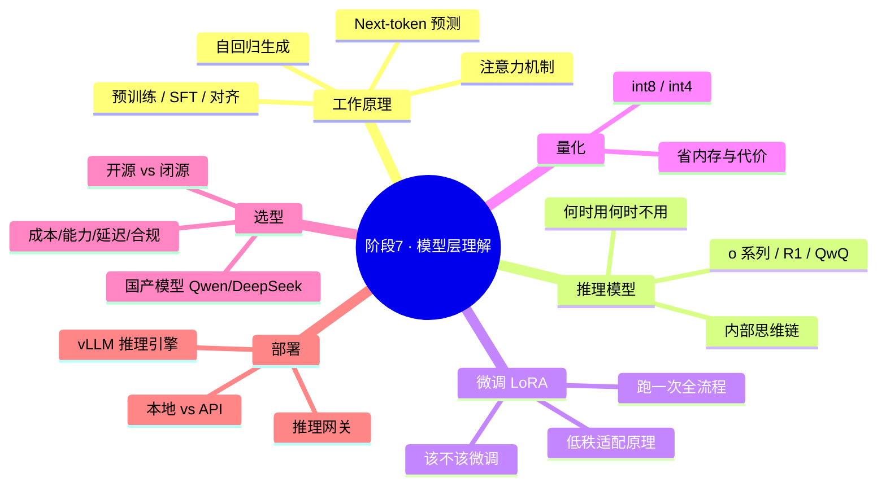
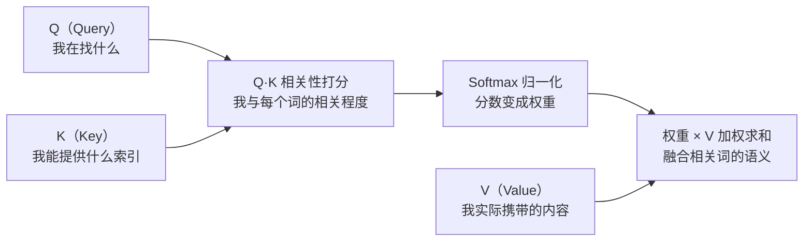
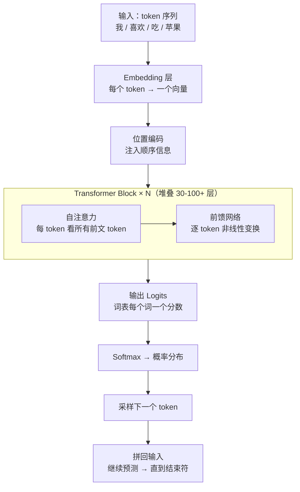
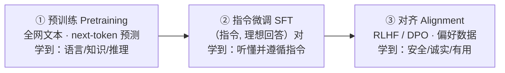
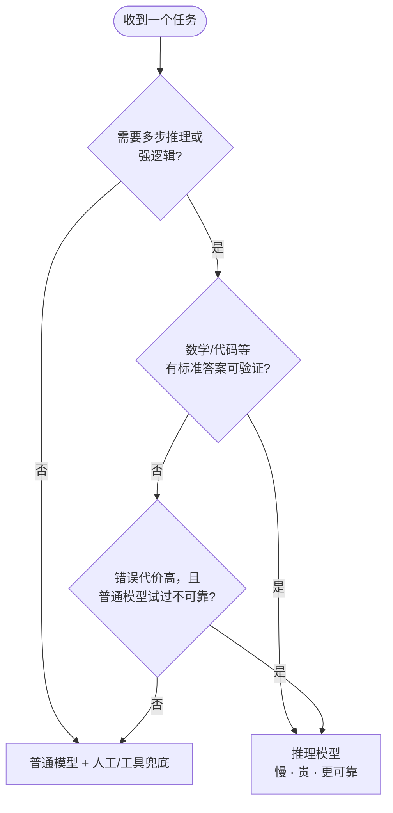
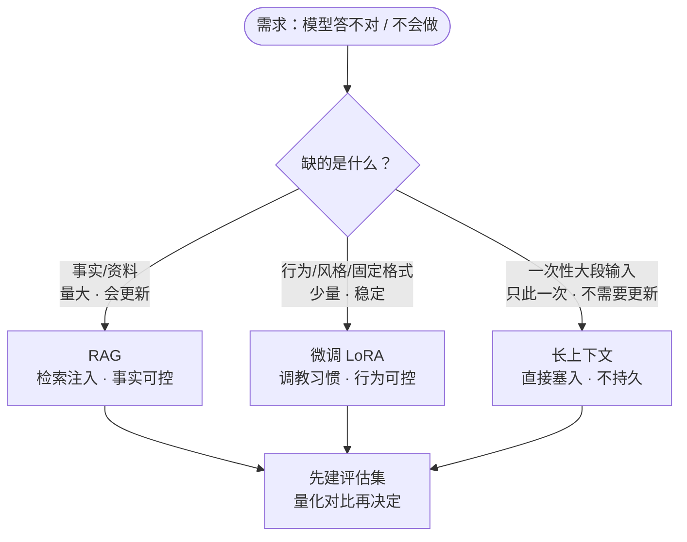
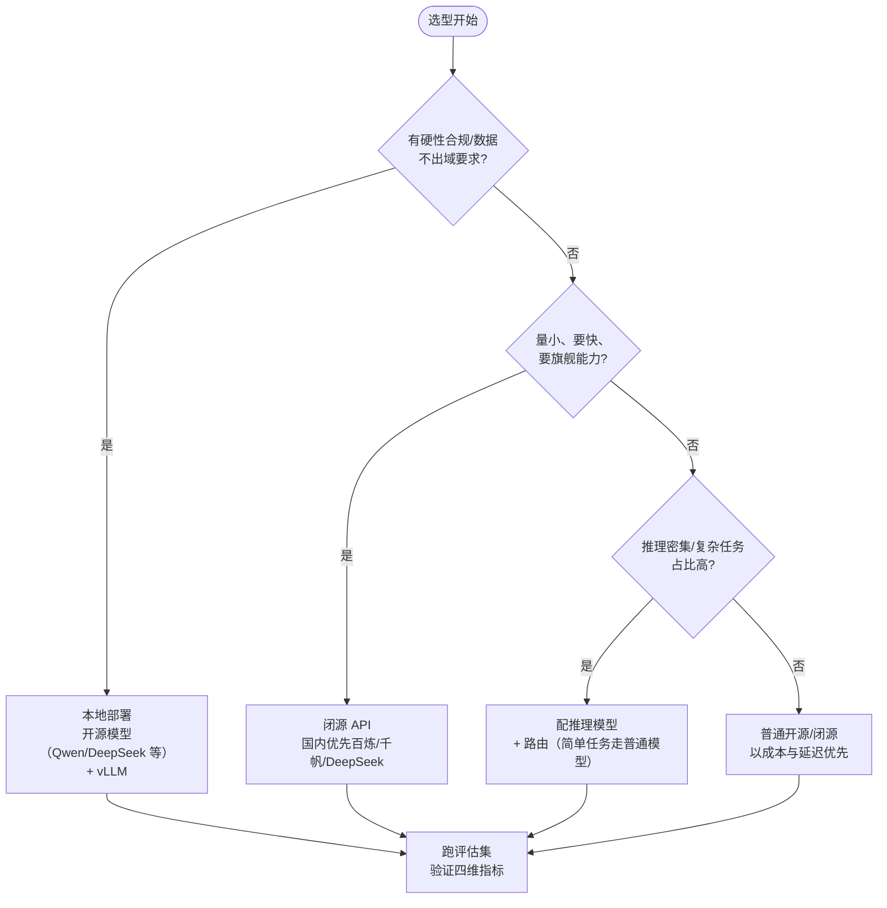
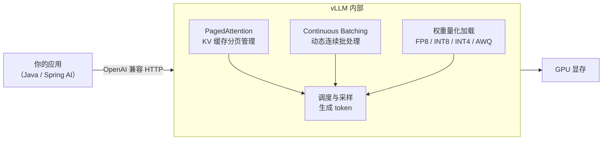
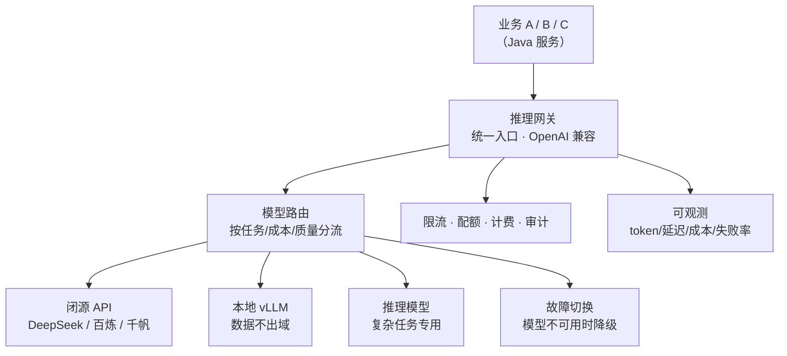

# 10 · 阶段7 模型层理解——从"会用模型"到"懂模型"

> **本份是什么**：本阶段的自包含学习材料。把"模型层"这一层讲清楚——不写公式推导、不让你自己训模型，而是建立**工作知识**：能选模型、能部署模型、能跟算法/模型团队对话。
>
> **你的定位**：1-3 年 Java 后端工程师，主栈 JDK 21 + Spring AI 2.0。你的主业在上层（Agent 编排、RAG、工程化），模型层是"穿插学习、持续进行"的必修课——每周给 2-3 小时即可，不必一口气读完。
>
> **学习姿态**：模型层是**基础设施**，不是研究前沿。你不必读懂《Attention Is All You Need》的数学证明，但要看懂它到底解决了什么；你不必自己从零训练大模型，但应该亲手跑通一次 LoRA 微调、本地部署过一个开源模型。**所有具体参数、价格、模型版本都在快速变化，标注"随时间变化，以官方为准"的数据一律以官方文档/模型卡为准。**

---

## 0. 一句话

> **把模型层当成"你要选型、要部署、要对话的基础设施"来掌握：懂它为什么这么工作（next-token 预测 + 注意力）、什么时候选哪种模型（推理模型 / 普通模型 / 微调 / RAG）、怎么把它跑在自己手里（vLLM / 量化 / 推理网关），就能在任何会议上和算法团队平等对话。**

---

## 1. 本阶段目标

本阶段结束时的能力画像：

| 能力 | 达到的水准 | 表现 |
|------|-----------|------|
| 懂原理 | 概念级 | 能对非技术同事讲清"为什么 LLM 是在预测下一个词"；能画出 Transformer 数据流 |
| 懂选型 | 决策级 | 面对"这个场景该用推理模型还是普通模型""该微调还是 RAG"能给出理由和评估计划 |
| 懂部署 | 实操级 | 本地用 vLLM 部署过开源模型，跑通 OpenAI 兼容 API；知道量化省什么、损失什么 |
| 懂对话 | 沟通级 | 认识算法团队口中的词（loss / 评估集 / checkpoint / LoRA / 幻觉 / benchmark），能听懂、能提问 |
| 懂市场 | 信号级 | 知道国内模型平台（阿里百炼 / 百度千帆等）是 JD 里的常见要求，微调是"加分项不是门槛" |

### 1.1 为什么架构师必须懂模型层（不是可选项）

1. **选型是架构师最常做的决策**：企业里"用哪个模型"是最贵的单一决策——它决定能力上限、成本、合规。不懂模型，你只能被模型厂商/算法团队牵着走。
2. **国内 JD 的真实信号**：真实招聘要求原文写着"了解**阿里百炼/百度千帆**等模型平台""有**模型微调经验者优先**"。注意——**"了解平台"是入门要求，"微调经验"是加分项不是门槛**。这正好对应本阶段的定位：懂、能对话、最好亲手跑过。
3. **你的上层经验大量复用**：你在阶段 4 做的成本治理、模型路由、缓存、可观测，全部建立在"模型有分层定价、推理有开销"这个事实上。懂模型层，上层决策才有根。

### 1.2 本阶段的地图



### 1.3 学习节奏建议

- **第 1 个月**：2.1 工作原理 + 2.5 选型矩阵（建立心智模型）
- **第 2 个月**：2.6 部署（本地跑通一个开源模型）+ 2.4 量化
- **第 3 个月**：2.2 推理模型 + 2.3 微调（跑一次 LoRA）
- **持续**：每次换模型/换平台，都回到 2.5 的选型表更新记录

---

## 2. 核心知识

### 2.1 LLM 工作原理（概念级）

本节目标：用**不涉及数学推导**的方式，讲清 LLM 最核心的四个概念——next-token 预测、注意力机制、位置编码、自回归生成，外加训练三阶段和 Karpathy 类比。

#### 2.1.1 一句话本质：LLM 在预测"下一个最可能出现的词"

LLM（大语言模型）本质是一个**函数**：给它一段 token 序列（文本被切成的单元），它输出一个**概率分布**——词表里每个 token 作为"下一个 token"的概率。

```text
输入："中国的首都是"
输出（概率分布，节选）：
  北    -> 92%
  上    ->  3%
  深    ->  1%
  ...
```

于是：
- **最可能的下一个词**：如果取概率最高的那个（贪心/greedy），就得到"北"。
- **生成 = 不断重复**：把"北"拼回输入 → 再预测下一个 → 拼回 → ……直到遇到结束符。

```python
# 观察 next-token 预测（用任一 OpenAI 兼容 API，本地 vLLM 或在线平台）
import requests

resp = requests.post(
    "http://localhost:8000/v1/chat/completions",  # 本地 vLLM
    json={
        "model": "Qwen/Qwen2.5-7B-Instruct",
        "messages": [{"role": "user", "content": "中国的首都是"}],
        "max_tokens": 16,
        "stream": True,
    },
    stream=True,
)
for line in resp.iter_lines(decode_unicode=True):
    if line and line.startswith("data:"):
        print(line)
```

**为什么是"最可能的下一个词"而不是"正确答案"？** 因为模型在训练时唯一的监督信号就是"原文里下一个词是什么"。它学到的是"给定这段上下文，人类文本里通常接什么"，而不是"这道题正确答案是什么"。所以：
- 它擅长**接续**——这就是为什么它像"会说话"；
- 它也会**一本正经地接错**——这就是幻觉的根源（见 2.1.5）。

#### 2.1.2 注意力机制：模型在找"哪些词彼此相关"

早期的文本模型（RNN/LSTM）逐个词处理，前面的词要穿过整个序列才能影响后面的词——长距离信息会"遗忘"。

**Transformer 的思路完全相反**：处理一个词时，让它可以**同时"看"序列里的所有词**，并给每个词分配一个权重，表示"这个词和我有多相关"。然后把这些词的信息按权重加权求和，融入自己的表示。这个机制叫**自注意力（self-attention）**。

它问的三个问题（QKV 概念，不需要公式）：



一句话类比：**这就像你在开会时，每个发言人都同时听所有人，并根据"谁的话跟我要讲的主题相关"来决定重点吸收谁的信息。** 注意力权重就是"相关性打分"。

- **多头注意力（Multi-Head）**：做多组独立的"相关性打分"，捕捉不同关系（语法关系、指代关系、语义相似……），最后拼起来。
- **它能并行**：所有词同时计算，天然适合 GPU——这是 Transformer 取代 RNN 的工程原因。

#### 2.1.3 位置编码：让模型知道"顺序"

注意力机制有个"盲区"：加权求和时，词的顺序不影响结果（把"猫追狗"和"狗追猫"打散重排，注意力权重一样）。所以必须**显式注入位置信息**，模型才知道"这是第几个词"。

- 早期方案：固定三角函数（sinusoidal）。
- 现代主流：**RoPE（旋转位置编码）**——把位置信息编码进 Q 和 K 的夹角里，既保留顺序信息，又对相对位置敏感（"紧挨着"和"隔很远"编码出不同但可比较的关系）。

**注意**：位置编码 + 注意力共同决定了模型的"上下文窗口"能力——窗口内它能"看到"所有词，窗口外彻底看不到。

#### 2.1.4 自回归生成：生成是"一步一个词"地来

现代主流 LLM（GPT 系列、Llama、Qwen、DeepSeek）都是**自回归（autoregressive）解码器**：



两个关键点：

1. **因果掩码（causal mask）**：每个 token 只能"看"它前面的 token，不能看后面的——否则预测下一个词时"偷看答案"。这是自回归的纪律。
2. **采样不是唯一解**：除了取概率最高的（greedy），还可以按概率采样。`temperature`（温度）控制概率分布"尖不尖"：温度越低越接近贪心（确定），越高越发散（多样）。`top-p` 控制只从累计概率前 p 的词里采样。**所以温度=0 输出仍可能变化**——浮点不确定性 + 采样路径。

#### 2.1.5 训练三阶段：模型是怎么"长大"的

一个能用的 LLM 不是一次训出来的，而是三个阶段：



| 阶段 | 数据 | 训练目标 | 解决什么问题 |
|------|------|---------|-------------|
| ① 预训练 | 海量文本（数万亿 token，网页/书籍/代码） | next-token 预测（交叉熵损失） | 让模型"学会语言"——语法、事实、常识、推理能力都在这里涌现 |
| ② 指令微调（SFT） | 人工/模型生成的（指令, 理想回答）对 | 给定指令，最大化输出理想回答的概率 | "会语言但不听话" → 让模型学会按指令回答、格式化输出 |
| ③ 对齐 | 人类偏好数据（哪个回答更好） | RLHF：训奖励模型 + PPO 强化学习；DPO：直接从偏好对优化 | 让输出符合人类偏好：有用、诚实、无害 |

- **预训练** 是"读万卷书"，阶段 ② 是"学规矩"，阶段 ③ 是"学做人"。
- **RLHF** 经典三件套：先 SFT → 让人类对比两个回答训出一个"奖励模型" → 用强化学习（PPO）让主模型尽量拿到高分。**DPO** 是它的简化版：跳过奖励模型和 RL，直接用"偏好对"更新权重，更简单稳定，近年被广泛采用。
- **对架构师的意义**：你在 API 上用的模型，是这三阶段完成后的成品。你不需要自己训，但**你微调时是在阶段 ② 的位置上做小规模改造**（见 2.3）——理解这个位置，才知道微调能改什么、不能改什么（**改不了预训练阶段的世界知识**，改的是行为与格式）。

#### 2.1.6 Karpathy 类比：LLM 是"压缩的互联网"

Andrej Karpathy 有一个非常利于理解的类比：**LLM 权重是对整个训练数据集的"有损压缩"。**

- 预训练把数万亿 token 的互联网文本，压缩成几十到几百 GB 的权重。权重里没有"存着原文"，存的是**能重构原文模式的统计规律**。
- 就像 ZIP 压缩：**出现频率高、规律性强的内容，压缩率高、还原度好**（常见句法、常识、热门知识）；**罕见、一次性的内容，压缩率低、还原时变形**（某个冷门网页、某人的私人聊天）。
- 所以模型"记得"热门事实、忘掉冷门细节；被问冷门问题时，它**不是在"查"，而是在"按平均规律重构"**——重构出来面目全非，就是**幻觉（hallucination）**。

这个类比给了你两个架构师级的推论：

1. **模型不是数据库**：需要精确、可更新的知识 → 不要指望模型"背下来"，用 **RAG**（阶段 2 已经会了）。
2. **幻觉是结构性的**：不是 bug，是"有损压缩"的必然副产品。任何只靠模型记忆的方案都要假设它可能记错。评估、检索、人工兜底因此不是可选而是必需。

**本节自查（能答出即算过）**：
- [ ] 为什么说 LLM 是"预测下一个词"？生成过程是什么？
- [ ] 注意力在找什么？Q/K/V 各代表什么？
- [ ] 为什么要位置编码？
- [ ] 预训练 / SFT / 对齐各解决什么问题？
- [ ] 为什么说 LLM 是"压缩的互联网"？这跟幻觉什么关系？

---

### 2.2 推理模型（Reasoning Models）：什么时候该让它"多想一会"

#### 2.2.1 什么是推理模型

推理模型（OpenAI o 系列、DeepSeek-R1、Claude 推理模型、Qwen 的 QwQ 等）是**在回答前先产生一段长长的内部思考（思维链，Chain of Thought）**的模型。它不是"换了个提示词让你多想"，而是**训练方式上专门强化了"长思考"能力**：

- 训练时用强化学习（RL），对"能一步步推理到正确答案"的长思考轨迹给予奖励（尤其是数学/代码这类**结果可自动验证**的任务）。
- 涌现出的行为：模型会在内部写草稿、试错、自我检查，再给出最终答案。
- 代价：**每个问题要先生成大量思考 token → 延迟更高、成本更高**（可能数倍）。

**对外表现的区别**：

| 维度 | 普通模型 | 推理模型 |
|------|---------|---------|
| 回答方式 | 直接给答案 | 内部先长思考（思维链）再给答案 |
| 复杂推理（数学/代码/多步规划） | 容易中途出错 | 明显更可靠 |
| 简单任务 | 又快又好 | 浪费（想太多、慢、贵） |
| 延迟与成本 | 低 | 高（思考 token 也要计费） |
| 典型代表 | GPT-4o、Claude 非推理模式、Qwen 普通版 | o1/o3、DeepSeek-R1、Claude 推理模式、QwQ |

> ⚠️ 具体型号与能力随时间快速变化，以各家官方模型卡为准。

#### 2.2.2 什么时候该用推理模型

**判断的本质是"任务的推理难度 × 错误代价"**：



**典型的"用推理模型"场景**：
- 数学证明、复杂算法题、逻辑谜题
- 多步规划（把大目标拆成可执行步骤并排序）
- 复杂代码生成与调试（一次性写对很重要）
- 长文档综合、需要跨多段材料推理
- Agent 里的"调度者/规划者"角色（决定下一步做什么）

**典型的"普通模型就够了"场景**：
- 抽取、分类、格式化、改写、翻译
- 简单问答、闲聊、客服
- 大部分工具调用（调用哪个函数、填什么参数）
- RAG 的答案生成（答案都在检索来的材料里）
- 高并发、低延迟、海量调用的场景

#### 2.2.3 对架构师的三点实操建议

1. **用路由分流，而不是全上推理模型**：推理模型贵且慢，适合"少而难"；普通模型适合"多而易"。在推理网关/应用层做**难度路由**（简单→便宜快模型，复杂→推理模型），成本可以省一个数量级。这是阶段 4"模型分级"的具体实现。
2. **给 Agent 设定推理预算**：推理模型的思考 token 是真实成本。Agent 循环里每多一轮推理，成本翻倍级上升。设 maxTurns、每轮 token 上限、美元预算（阶段 3 的三重保护在这里尤其重要）。
3. **把"推理"当可观测指标**：记录每个任务的推理 token 数、思考时长。它和准确率直接相关——你可以量化"多花了多少钱，换来了多少准确率提升"，这是跟算法团队谈判的最有力证据。

**本节自查**：
- [ ] 推理模型和普通模型的本质区别是什么？
- [ ] 说出 3 个该用推理模型的场景、3 个不该用的场景。
- [ ] 为什么 Agent 系统里通常"规划者用推理模型、执行者用普通模型"？

---

### 2.3 微调（LoRA）实操级：什么时候该微调，以及怎么跑一次

#### 2.3.1 该不该微调：先会判断，再会动手

微调（fine-tuning）是**在已有模型基础上，用你自己的数据继续训练**，让它更贴合你的场景。但**多数场景不需要微调**——先解决 RAG 和提示词。

**该微调（能用 LoRA 解决）**：
- 要**固定输出格式/风格**：比如永远输出特定结构的 JSON、特定腔调/文风的公文、特定领域术语的翻译。
- 要**领域风格模仿**：让模型说话像你的客服、像你的老师、像你的行业专家。
- 要**少量专有行为**：你们团队特有的处理规则、路由逻辑（提示词写不下或写不清的）。
- **数据量够**：一般以"百~千条高质量示例"为起点，质量远重要于数量。

**不该微调（改用其他手段）**：
- **要的是"资料/事实"** → 用 RAG。模型记不住也更新不动的事实，检索注入最可靠。
- **数据太少**（几十条） → 先强化提示词；数据不够，微调只会把模型"带偏"（灾难性遗忘）。
- **基座模型本来就会** → 不要为了"有微调经验"硬微调，先评估。
- **需求要快速上线** → RAG 一周能上线，微调要数据集+训练+评估+重训，周期长。
- **你只想"更聪明"** → 那是换更大/更强模型或推理模型的事，微调不提升通用智能。

> **一句话铁律**：**微调改变"行为"，RAG 提供"事实"，长上下文应对"一次性大输入"。** 微调不是让模型变聪明的开关，是"调教它的固定习惯"的手段。

#### 2.3.2 RAG vs 微调 vs 长上下文：一张决策表



| 判断维度 | RAG | 长上下文 | 微调（LoRA） |
|---------|-----|---------|-------------|
| 本质 | 检索资料注入 prompt | 把资料直接塞进上下文窗口 | 改模型权重（行为） |
| 适用知识 | **事实/数据**（动态、量大） | 一次性大段材料 | **风格/格式/行为**（固定、少量） |
| 数据规模 | 无上限（资料越多越好） | 受窗口限制（16K~200K+ token） | 需要数据但量不用大（百~千条） |
| 更新成本 | 低（改文档重新入库） | 低（改输入即可） | **高**（要重新训练+评估+部署） |
| 幻觉风险 | **最低**（答案来自资料） | 中（"Lost in the Middle"长文中间记不住） | 中（可能编造微调外的知识） |
| 延迟/成本 | 检索有额外开销 | 输入 token 贵（长上下文按量计费） | 推理时无额外输入成本 |
| 你的掌握程度 | ✅ 已会（阶段 2） | 会用（调参数即可） | 本阶段要学 |

**典型组合用法**：RAG 提供事实底座 + 微调固定输出格式 + 提示词约束表达。三者不互斥，往往一起上。

#### 2.3.3 LoRA 原理：只训练"一小块"新增参数

**全参数微调**：更新模型全部权重。一个 7B 模型 ≈ 140 亿参数，用 FP16 全参数微调需要 ~140GB+ 显存（光梯度就要翻倍）——一般团队没有这种卡。

**LoRA（Low-Rank Adaptation，低秩适配）** 的思路：**不动原模型权重，在旁边接两条小矩阵**。

```text
权重增量 ΔW ≈ B × A
  A：d × r（r 很小，比如 8~64）
  B：r × d
  最终权重：W' = W + (alpha / r) × B·A
```

- **低秩**：语言模型权重的更新往往集中在少数方向（低秩结构），所以用一个很小的 r 维矩阵就能近似表达"要改的方向"。
- **只训练 A、B**：原模型权重全部冻结。7B 模型可训练参数从 140 亿降到几千万~几亿，**约省 99%**。
- **好处**：显存需求大降（一张消费级显卡可跑小模型的 LoRA）；训练快；**adapter 是独立文件**，同一基座可挂多个 adapter 随时切换（不同客服风格、不同业务），不用部署多个模型。

| 方案 | 可训练参数 | 显存需求（约） | 适用 |
|------|-----------|--------------|------|
| 全参数微调 | 100% | 极高（7B 需 >140GB） | 极少（预算充足、要彻底改） |
| LoRA | 0.1%~1% | 中（7B 约 16~24GB） | 主流方案 |
| **QLoRA** | 0.1%~1% | **低（7B 约 6~10GB）** | **消费级单卡首选** |

> QLoRA = 基座模型量化到 4bit + LoRA 微调。用 4bit 省显存，LoRA 在量化模型上微调，质量损失小。**这是个人/小团队跑微调的主流方式。**

#### 2.3.4 跑一次 LoRA 的完整流程（数据集 → 训练 → 评估 → 对比）

以 HuggingFace `transformers` + `peft` 为例（模型层工具以 Python 生态为主，Java 工程师把它当"命令行工具"用即可）。**版本 API 随时间变化，以官方文档为准。**

**第 0 步：环境与显存评估**

```bash
# 创建虚拟环境
python -m venv .venv && source .venv/bin/activate

# 安装核心依赖（版本以官方为准）
pip install transformers peft accelerate datasets bitsandbytes

# 确认你的 GPU 显存（决定能训多大模型）
nvidia-smi
```

> 没有本地大显存怎么办？用 **QLoRA + 小模型**（Qwen2.5-1.5B/3B）在消费级显卡上跑；或用免费/低价 GPU（Colab、AutoDL 等）。第一次跑通流程比跑大模型重要。

**第 1 步：准备数据集（质量 > 数量）**

微调数据是"（指令, 期望输出）"对，存成 JSONL。**关键：格式要和你线上真实用法一致**。

```jsonl
{"instruction": "你是客服。用简洁专业的中文回答。", "input": "你们发货后多久能到？", "output": "您好，商品发货后一般 3-5 个工作日内送达，偏远地区可能稍慢。请问您的订单号是多少？我可以帮您查询具体物流。"}
{"instruction": "你是客服。用简洁专业的中文回答。", "input": "我要退换货，怎么操作？", "output": "您好，请在订单详情页点击「申请售后」，选择退换货并填写原因，我们会在 24 小时内审核。审核通过后您会收到退货地址。"}
```

```python
# 把 JSONL 转成模型能吃的格式（用对话模板，不是简单拼字符串）
from datasets import load_dataset
from transformers import AutoTokenizer

tokenizer = AutoTokenizer.from_pretrained("Qwen/Qwen2.5-3B-Instruct")  # 与训练模型一致

raw = load_dataset("json", data_files="train.jsonl")

def format_example(row):
    # 用模型的 chat template 把 instruction/input/output 变成 (input, output) 对
    messages = [
        {"role": "system", "content": row["instruction"]},
        {"role": "user", "content": row["input"]},
    ]
    # input 部分用模板处理（不含结束符），output 作为要生成的文本
    prompt = tokenizer.apply_chat_template(messages, tokenize=False, add_generation_prompt=True)
    return {"text": prompt + row["output"]}

dataset = raw.map(format_example)
print(dataset["train"][0]["text"])
```

**第 2 步：加载基座模型 + 挂 LoRA**

```python
from transformers import AutoModelForCausalLM, AutoTokenizer
from peft import LoraConfig, get_peft_model

model_id = "Qwen/Qwen2.5-3B-Instruct"
tokenizer = AutoTokenizer.from_pretrained(model_id)

# QLoRA：基座用 4bit 加载（省显存）
from transformers import BitsAndBytesConfig
bnb = BitsAndBytesConfig(load_in_4bit=True, bnb_4bit_quant_type="nf4")
model = AutoModelForCausalLM.from_pretrained(model_id, quantization_config=bnb)

# LoRA 配置：只训练注入的低秩矩阵
lora_config = LoraConfig(
    r=16,                 # 低秩维度（越大表达力越强、越费显存）
    lora_alpha=32,        # 缩放系数（经验上 alpha≈2r）
    target_modules=["q_proj", "k_proj", "v_proj", "o_proj"],
    lora_dropout=0.05,
    bias="none",
    task_type="CAUSAL_LM",
)
model = get_peft_model(model, lora_config)
print(f"可训练参数：{model.num_parameters(only_trainable=True) / 1e6:.1f}M")
```

**第 3 步：训练（观察 loss 曲线）**

```python
from transformers import TrainingArguments, Trainer

args = TrainingArguments(
    output_dir="./lora-ckpt",
    per_device_train_batch_size=2,
    gradient_accumulation_steps=8,   # 等效 batch_size = 16
    num_train_epochs=3,
    learning_rate=2e-4,
    logging_steps=10,
    save_strategy="epoch",
    fp16=True,                        # 半精度训练
)

trainer = Trainer(model=model, args=args, train_dataset=dataset)
trainer.train()
trainer.model.save_pretrained("./lora-adapter")   # 只保存 adapter（几 MB~几十 MB）
```

> **怎么看训练好坏**：训练 loss 应下降并趋于平稳。**别只看训练 loss**——它可能只是"背住了训练集"。真正的验收在下一步评估。

**第 4 步：评估（必须对比，不评估不算完成）**

准备一个**训练时没见过的测试集**（20~50 条），同一个问题分别问"基座模型"和"微调后模型"，对比输出：

```python
from peft import PeftModel

# 基座模型 + 加载 adapter（device_map="auto" 自动放 GPU）
base = AutoModelForCausalLM.from_pretrained(model_id, device_map="auto")
ft = PeftModel.from_pretrained(base, "./lora-adapter")

def ask(model, prompt):
    text = tokenizer.apply_chat_template(
        [{"role": "user", "content": prompt}],
        tokenize=False, add_generation_prompt=True,
    )
    inputs = tokenizer(text, return_tensors="pt").to(model.device)
    out = model.generate(**inputs, max_new_tokens=128)
    return tokenizer.decode(out[0], skip_special_tokens=True)

prompt = "你们的退换货流程是什么？"
print("基座：", ask(base, prompt))
print("微调后：", ask(ft, prompt))
```

评估维度（可以打分或直接看）：
- **格式符合度**：输出是否固定成你想要的格式（客服腔、JSON 结构）
- **准确性**：关键事实是否对（注意：微调不增加知识，测试别用需要新知识的题）
- **回归检查**：原来就会的能力有没有被"带坏"（灾难性遗忘）

**第 5 步：上线对比（A/B）**

- 推理服务（vLLM）加载 adapter 或合并权重后部署。
- 线上分流一部分流量，用阶段 2 的评估集对比"微调前 vs 微调后"的指标，再决定全量。

> ⚠️ **微调经验 = 加分项，不是门槛**。你不需要把微调做成产品核心，但**跑通过一次完整流程**，就够你在简历上写"有模型微调经验"，也够你跟算法团队对话——你知道数据集怎么来、loss 怎么读、评估怎么做，这正是他们关心的工程问题。

**本节自查**：
- [ ] 说出 3 个"该微调"和 3 个"不该微调"的场景。
- [ ] 用一句话讲清 LoRA 为什么省显存（只训低秩小矩阵）。
- [ ] 跑通过一次 LoRA 全流程，并有基座 vs 微调的对比记录。

---

### 2.4 量化：用更少内存跑更大的模型

#### 2.4.1 量化是什么

模型的权重是一堆浮点数。**量化就是把权重从高精度（FP32/FP16）降到低精度整数（INT8/INT4）**。直观上：原来每个参数用 2 个字节（FP16）存，改成 1 字节（INT8）甚至 0.5 字节（INT4），显存占用直接减半/减到 1/4。

| 精度 | 每参数字节数 | 7B 模型权重显存 | 说明 |
|------|:---:|:---:|------|
| FP32 | 4 | ~28GB | 训练精度，推理不用 |
| FP16 / BF16 | 2 | ~14GB | 推理默认精度 |
| INT8 | 1 | ~7GB | 量化后质量损失很小 |
| INT4 | 0.5 | ~3.5GB | 省最多，质量损失明显些 |

> 显存 ≈ 参数量 × 每参数字节数（再留一点给 KV 缓存和激活，见下）。这个换算你做选型时天天用。

#### 2.4.2 为什么能省内存，代价是什么

**为什么能省**：
1. **冗余**：训练好的权重里大量信息是冗余的，相邻参数高度相关，可以压缩。
2. **分布集中**：权重值大多聚集在一个小范围，少数是大值（outlier），可以用缩放把范围映射到整数区间。
3. **量化不重训**：后训练量化（PTQ）直接在训练好的模型上做，不需要重训。

**代价（精度损失）**：
- INT8：质量损失通常很小，多数任务看不出差别 → **高性价比，推理服务常用**。
- INT4：可感知的下降，尤其在**小模型**（7B 以下）和**复杂任务**（推理、代码）上；大模型（70B）量化到 INT4 反而常见，因为大模型冗余更多、抗量化能力强。
- 不是所有模型都量化后一样好：**用你的评估集实测**，而不是只看宣传。

#### 2.4.3 对部署的影响：能本地跑更大模型

量化最大的价值是**"在有限显存里跑更大的模型"**：

- 24GB 显存（如 RTX 4090）：FP16 只能跑 7B；INT4 能跑 **14B~32B**。
- 推理时**内存带宽是瓶颈**：参数越小，读取越快 → 量化还经常**提升吞吐**（同样显存、更多 batch）。
- 生产选型常组合：**量化 + vLLM 的 FP8/INT8/INT4 权重加载**，在大模型上用 FP8 几乎无损，小模型谨慎用 INT4。

**常见量化方法速查**：

| 方法/工具 | 是什么 | 特点 |
|----------|--------|------|
| GPTQ | 权重后训练量化，适合 GPU | 主流量化格式，模型卡常见 `-GPTQ-Int4` 版本 |
| AWQ | 按敏感度选重要权重保留高精度 | 激活感知，通常比 GPTQ 质量稍好 |
| bitsandbytes | 动态量化（`load_in_4bit`） | **QLoRA 训练专用**，也用于推理 |
| GGUF（llama.cpp） | 支持 CPU/混合推理的量化格式 | 本地 Mac/CPU 跑模型首选，Ollama 底层就是它 |

**动手体验量化（推荐）**：

```bash
# 方式一：Ollama（Mac/本地一键跑，GGUF 量化）
ollama pull qwen2.5:7b        # 拉取（自动选适合本机的量化版本）
ollama run qwen2.5:7b         # 交互式对话

# 方式二：vLLM 加载 GPTQ 量化版（GPU）
pip install vllm
vllm serve Qwen/Qwen2.5-7B-Instruct-GPTQ-Int4 --gpu-memory-utilization 0.9
```

```python
# 方式三：bitsandbytes 4bit 加载（不落盘，内存中量化）
from transformers import BitsAndBytesConfig, AutoModelForCausalLM

bnb = BitsAndBytesConfig(load_in_4bit=True, bnb_4bit_quant_type="nf4", bnb_4bit_compute_dtype="bfloat16")
model = AutoModelForCausalLM.from_pretrained("Qwen/Qwen2.5-7B-Instruct", quantization_config=bnb)
```

> **经验法则**：先跑 FP16/原始精度做基准 → 需要时上 INT8/FP8 → 实在要省才用 INT4，**每一步都用评估集确认质量没崩**。量化省下的显存要用在刀刃上（更大的模型、更大的 KV 缓存），否则没有意义。

**补充：KV 缓存也是显存大户**。长上下文 + 高并发时，KV 缓存占的显存往往超过权重。这也是 vLLM 的 PagedAttention 优化对象（见 2.6），也是"长上下文很贵"的物理原因。

**本节自查**：
- [ ] 7B 模型 FP16、INT8、INT4 的权重显存大概是多少？怎么算的？
- [ ] 为什么量化能省内存？精度代价是什么？
- [ ] 24GB 显存，INT4 下你能跑多大模型？

---

### 2.5 模型选型矩阵：四维选模型

架构师最常做的决策就是"这个场景用哪个模型"。别凭感觉，用一个**四维矩阵**逼自己把每项摆上桌。

#### 2.5.1 四个维度

| 维度 | 要问的问题 | 关键指标 |
|------|-----------|---------|
| **成本** | 每百万 token 输入/输出多少钱？有缓存折扣吗？量大了能压到多少？ | 价格、缓存命中率、吞吐 |
| **能力** | 推理行不行？代码行不行？中文行不行？支持工具调用/结构化输出/长上下文吗？ | 基准分、上下文长度、功能支持 |
| **延迟** | 首个 token 多久？（TTFT）每秒多少 token？（TPS）推理模型额外想多久？ | TTFT、TPS、推理 token 数 |
| **合规** | 数据能出域吗？有备案/合规要求吗？模型许可证允许商用吗？供应商稳定性？ | 部署位置、许可证、数据协议 |

> **四个维度永远在打架**：能力最强的往往最贵最慢；合规最稳的往往要本地部署、能力受限。**选型 = 在你的约束下做权衡，不是找"最好"的模型。**

#### 2.5.2 开源 vs 闭源

| 维度 | 闭源 API（DeepSeek / 百炼 / 千帆 / OpenAI） | 开源权重（Qwen / DeepSeek 开源版 / Llama） |
|------|--------------------------------------------|-------------------------------------------|
| 能力上限 | 通常最高（旗舰模型） | 追平但略落后旗舰 |
| 部署 | 零部署，调 API | 自建 GPU 集群 + 推理引擎 |
| 数据合规 | 数据出域（签协议/走国内平台可缓解） | **数据不出域**（最大卖点） |
| 成本 | 按 token 付费，小量便宜 | 固定基础设施成本，**量大摊薄后更便宜** |
| 迭代 | 厂商替你迭代，开箱即用 | 升级要自己换模型重新评估部署 |
| 定制 | 难（最多用平台微调服务） | 可任意微调/量化/改造 |
| 风险 | 供应商锁定、涨价、下线 | 自己运维，出问题自己扛 |

**架构师的判断**：
- 快速验证、需要旗舰能力、没有硬合规 → **闭源 API**（国内优先走百炼/千帆等平台，数据不出境）。
- 数据敏感、量大、长期成本敏感、需要深度定制 → **开源权重自部署**。
- **"先 API 后自部署"是常见路径**：用 API 验证业务价值，量起来/合规需要时再切开源自部署——前提是模型选型时就想好"这条路径的可行性"。

#### 2.5.3 国产模型：Qwen / DeepSeek 及其他

国产模型已从"能用"进化到"够强且便宜"，是国内企业的默认选择。**具体能力/版本/价格随时间变化，以下为方向性认知，以官方模型卡为准。**

| 模型/厂商 | 特点 | 典型适用 | 平台 |
|----------|------|---------|------|
| **Qwen（通义千问）** | 家族最全：小到 0.5B 大到旗舰，含视觉/语音/推理（QwQ）；开源 + 商用 | 国内通用场景首选，中文好，可本地部署 | 阿里**百炼** |
| **DeepSeek** | 推理强（R1 系列）、**性价比极高**、开源 | 成本敏感 + 要推理能力；可自部署 | DeepSeek 开放平台 |
| GLM（智谱） | 中英均衡、CodeGeeX 代码助手 | 通用 + 代码场景 | 智谱开放平台 |
| Kimi（月之暗面） | 长文本强（超长上下文） | 长文档处理 | Kimi 开放平台 |
| Doubao（豆包/字节） | 免费额度大、价格极低 | 成本敏感的大规模调用 | 火山方舟 |
| Ernie（文心/百度） | 老牌、生态成熟、合规本地化好 | 企业采购、政务类场景 | 百度**千帆** |

**国内模型平台**（JD 里被点名的就是这类，见 1.1）：
- **阿里百炼（Bailian）**：阿里云上的一站式模型平台，Qwen 全家族 + 微调 + 部署服务。
- **百度千帆（Qianfan）**：百度智能云上的模型平台，文心 + 大量第三方模型 + 微调。
- **火山方舟**：字节的模型平台，豆包 + 第三方模型。
- **DeepSeek 开放平台**：直接提供 DeepSeek API。

> **对 Java 工程师**：这些平台大多提供 OpenAI 兼容的 API 和 MCP 服务，Spring AI 2.0 可以直接对接（配置 base-url + api-key 即可）。**动手任务里"注册一个平台、跑通一次调用"就是 JD 里"了解平台"的最小兑现。**

#### 2.5.4 选型决策流程 + 决策表模板



**决策表模板**（每次选型填一次，填完你就有了跟算法团队谈判的底稿）：

| 候选模型 | 成本（元/百万token） | 能力（你的评估集得分） | 延迟（TTFT/TPS） | 合规（部署位） | 结论 |
|---------|:---:|:---:|:---:|:---:|------|
| A：DeepSeek（闭源 API） | ? | 90 | 0.5s / 40 | 国内平台，可接受 | 待定 |
| B：Qwen2.5-72B（本地 INT8） | 固定成本 | 88 | 1.2s / 25 | 数据不出域 | 待定 |
| C：Qwen2.5-7B（本地） | 固定成本低 | 70 | 0.2s / 80 | 数据不出域 | 简单任务候选 |

> **架构师必做**：选型结果**必须落到"你的评估集"上**，不是看厂商 benchmark。用阶段 2 的评估集，同一个 prompt 集跑不同模型，比指标、比成本、比延迟——这叫"用数据选型"，是你区别于"哪个模型新用哪个"的根本。

**本节自查**：
- [ ] 说出四维选型是哪四维，各问什么问题。
- [ ] 什么信号指向"开源自部署"，什么信号指向"闭源 API"？
- [ ] 用决策表模板给一个真实场景填过一张表。

---

### 2.6 部署：vLLM、本地 vs API、推理网关

#### 2.6.1 vLLM：为什么它是主流推理引擎

vLLM 是当下最主流的**开源大模型推理服务引擎**，两个核心技术让它成为事实标准：

1. **PagedAttention（分页注意力）**：把 KV 缓存切成固定大小的"页"，像操作系统虚拟内存一样按需分配。**解决 KV 缓存碎片化** → 显存利用率大幅提升 → 能同时服务更多请求。
2. **Continuous Batching（连续批处理）**：不等一个批次全部完成才接收新请求，而是**每生成一个 token 就动态调整批次**（完成的走、新来的进）→ 吞吐量提升数倍。

外加它是 **OpenAI 兼容 API**（`/v1/chat/completions`），你的 Java 服务只需换 base-url 就能从云端 API 切到本地 vLLM。



```bash
# 部署一个开源模型（OpenAI 兼容）
pip install vllm

vllm serve Qwen/Qwen2.5-7B-Instruct \
    --gpu-memory-utilization 0.9 \
    --max-model-len 8192 \
    --dtype bfloat16

# 启动后：http://localhost:8000/v1/chat/completions
```

```python
# 用 OpenAI SDK 调本地 vLLM（Java 里同理，只是把 base-url 指向本地）
from openai import OpenAI

client = OpenAI(base_url="http://localhost:8000/v1", api_key="EMPTY")
resp = client.chat.completions.create(
    model="Qwen/Qwen2.5-7B-Instruct",
    messages=[{"role": "user", "content": "用一句话解释什么是 RAG"}],
)
print(resp.choices[0].message.content)
```

**vLLM 能干什么（选型/架构层面要知道的）**：
- 加载多种量化格式（AWQ / GPTQ / FP8 / INT4）
- 运行时挂载/切换 LoRA adapter
- 多模态（视觉等，看模型支持）
- 前缀缓存（类似 prompt cache，重复前缀省算力）

**其他推理引擎速查**：

| 引擎 | 特点 | 适用 |
|------|------|------|
| vLLM | 高吞吐、GPU、OpenAI 兼容 | **生产主力** |
| SGLang | 更快的前缀/结构化推理优化 | 高性能场景备选 |
| TGI（HuggingFace） | 生态成熟 | 生产备选 |
| llama.cpp / Ollama | CPU/Mac 也能跑、GGUF 量化 | 本地开发、原型 |
| LM Studio | 图形界面本地跑 | 纯探索/学习 |

#### 2.6.2 本地部署 vs API：一条取舍表

| 维度 | 闭源 API | 本地/私有部署 |
|------|---------|--------------|
| 上线速度 | 分钟级 | 需要买卡/运维/调优 |
| 数据安全 | 数据出域（走国内平台可缓解） | **数据不出域**（合规硬要求时唯一解） |
| 成本 | 按 token，量小便宜；量大贵 | 固定基建成本，**量大摊薄便宜** |
| 能力上限 | 旗舰模型最强 | 受显存限制（72B 需多卡或量化） |
| 延迟 | 网络往返 + 服务端排队 | 无网络，但吞吐受 GPU 限制 |
| 运维 | 厂商负责 | 你要负责可用性/升级/容量 |

**架构师判断**：
- **合规优先**（金融、政务、医疗、数据敏感） → 本地部署是硬需求，"数据不出域"是你选型的最高优先级。
- **成本曲线**：算一下"月度调用量 × 单价" vs "GPU 月成本 + 运维成本"，交点决定了什么时候该切本地。一般量大到一定程度，本地更便宜。
- **最佳实践：混合**。敏感数据走本地小模型/私有部署，非敏感高难任务走云端旗舰，中间用推理网关统一路由。

#### 2.6.3 推理网关（LLM Gateway）：多模型统一入口

当你开始同时用"云端 API + 本地 vLLM + 推理模型 + 普通模型"，混乱随之而来：每个模型一个 base-url、一套鉴权、一种计费。**推理网关**就是模型层的"服务网格"——统一入口，内部做路由、限流、计费、观测、容灾。



**推理网关给你带来的价值**（这是阶段 6 里 LLM Gateway 的具体形态）：
1. **统一 API**：业务只认一个 base-url，底层换模型不影响业务代码（Spring AI 只配一个 provider）。
2. **成本治理**：按团队/按项目分账；简单任务路由到便宜模型；记录每任务 token。
3. **容灾与降级**：主模型超时/限流自动切备用模型。
4. **A/B 与灰度**：新模型先小流量，评估达标再放大。
5. **审计合规**：所有请求留痕，满足合规要求。

**轻量起步**（不用从零造轮子，先用现成的）：

```yaml
# LiteLLM Proxy 配置示例（统一多模型，OpenAI 兼容）
# 更多配置项以官方文档为准
model_list:
  - model_name: cheap
    litellm_params:
      model: deepseek/deepseek-chat
  - model_name: reasoning
    litellm_params:
      model: openai/o1
  - model_name: local
    litellm_params:
      model: openai/qwen2.5-7b
      api_base: http://localhost:8000/v1
      api_key: EMPTY
```

```bash
litellm --config config.yaml --port 4000
# 你的应用只需要调 http://localhost:4000/v1/chat/completions
```

> 常见开源推理网关：**LiteLLM**（轻量、OpenAI 兼容、多 provider）、**OpenRouter**（云端聚合 API）、**one-api / new-api**（国内常用来聚合多厂商）。生产自研时，把限流/计费/审计/路由做成你自己的网关服务（阶段 6 的内容）。

**本节自查**：
- [ ] 用一句话讲清 vLLM 为什么吞吐高（PagedAttention + Continuous Batching）。
- [ ] 本地部署 vs API，列出 3 条取舍判断依据。
- [ ] 推理网关解决什么问题？画出它的架构。

---

### 2.7 跟算法/模型团队对话的词汇表

**这是本阶段最有"架构师"味道的一节**——你会听不懂的不是产品需求，而是这些词：

| 词 | 白话解释 | 你的应对 |
|----|---------|---------|
| Loss（损失） | 训练时模型"错得多惨"的数字，越低越好 | 问"当前 loss 多少、下降趋势如何" |
| Perplexity（困惑度） | 预测文本的"吃力度"，越低越流畅 | 衡量语言流畅度，不等同于能力 |
| 评估集 / Eval | 固定问题集，用来量化模型好坏 | **问"用什么评估集、指标是什么"**——这是你的主场 |
| 幻觉 | 一本正经编造 | 提"幻觉率"、问"哪些类别容易幻觉" |
| Benchmark | 行业标准测试（MMLU/HumanEval/GSM8K/AIME 等） | 知道即可，别拿它当你的验收标准 |
| Checkpoint | 训练过程中的一次模型快照 | 相当于"版本号" |
| Adapter | LoRA 微调产出的独立小权重文件 | 微调后你交付的东西 |
| 量化 | 降精度省显存 | 见 2.4 |
| 上下文窗口 | 一次能塞的最大 token 数 | 见阶段 0 |
| 采样 / Temperature | 生成随机性控制 | 见 2.1.4 |
| RLHF / DPO | 对齐的两种方法 | 见 2.1.5 |
| RAG | 检索增强 | 你的主场（阶段 2） |
| 推理 token | 推理模型思考时产生的 token | 见 2.2，要计入成本 |
| 灾难性遗忘 | 微调后忘了原有能力 | 微调后必须做回归测试 |
| 数据不出域 | 数据不允许离开公司环境 | 本地部署的核心理由 |

> **对话心法**：跟算法团队开会，**别聊"哪个模型最好"，聊"你的约束和评估"**——"我们这场景 90% 是抽取 + 10% 是复杂推理，成本上限是 X，数据不能出域，你们建议主模型 + 路由怎么搭？"这个问题一出口，你已经是架构师了。

---

## 3. 动手任务（可执行清单）

> 铁律：**每个概念都配一个"做"**。下面按顺序做，每个任务都有可验收的产出。

### 任务 A：观察 next-token 生成（半天）

- [ ] 找一个模型服务（本地 vLLM / Ollama，或注册**阿里百炼**或**百度千帆**——顺带满足 JD 的"了解平台"）
- [ ] 用 curl 或 Python 发起一次流式调用，观察 token 一个接一个到达
- [ ] 同一个问题，temperature=0 和 temperature=1 各问 5 次，记录输出差异
- [ ] 观察一次 Function Calling 返回的 JSON（要求模型调用一个函数）
- **产出**：一段"我观察到什么"的笔记（3 条以上观察）

### 任务 B：本地部署一个开源模型（1-2 天）

- [ ] 安装 Ollama（Mac 最快）或 vLLM（GPU 机器）
- [ ] 部署 Qwen2.5-7B-Instruct（或你显存允许的模型）
- [ ] 用 OpenAI SDK / curl 调通 `/v1/chat/completions`
- [ ] 再部署一个 INT4/GPTQ 量化版，对比显存占用和输出质量
- [ ] （进阶）用 Spring AI 2.0 把 base-url 指向本地 vLLM，跑通一次 Java 调用
- **产出**：能演示"本地模型 + OpenAI 兼容 API 被 Java 服务调用"

### 任务 C：推理模型 vs 普通模型对比实验（半天）

- [ ] 准备 5 个难题（数学/逻辑/代码，如"求 1+2+…+100 的奇数和并给步骤"）
- [ ] 准备 5 个简单任务（抽取/分类/改写）
- [ ] 同一模型家族里分别用"普通版"和"推理版"跑（如 DeepSeek chat vs DeepSeek R1，或 Qwen 普通 vs QwQ）
- [ ] 记录：准确率、延迟、token 消耗、成本估算
- **产出**：一张对比表 + 结论"什么任务值得用推理模型"

### 任务 D：跑一次 LoRA 微调（1 周，可拆散做）

- [ ] 自选一个小场景（客服腔调 / 固定 JSON 输出 / 公文风格）
- [ ] 准备 100~300 条（instruction, input, output）JSONL 数据
- [ ] 用 QLoRA 训练（Qwen2.5-1.5B/3B，消费级显卡或租卡）
- [ ] 记录训练 loss 曲线
- [ ] 准备 20~50 条**训练集外**测试集，对比"基座 vs 微调后"输出
- [ ] 用 vLLM 或 Ollama 加载训练好的 adapter 上线
- **产出**：微调后模型 + 对比记录（**这就是简历上"有模型微调经验"的实据**）

### 任务 E：模型选型实战演练（半天）

- [ ] 选 2 个真实业务场景（如：内部客服系统 / 高并发内容抽取）
- [ ] 各填一张 2.5.4 的**四维选型决策表**（至少 3 个候选模型）
- [ ] 用你的评估集（阶段 2 的）跑 2 个候选，记录指标对比
- [ ] 写一段 200 字选型结论（含理由和取舍）
- **产出**：2 张填好的决策表 + 选型结论

### 任务 F：搭一个推理网关（1 天）

- [ ] 用 LiteLLM 配两个后端（如一个闭源 API + 一个本地 vLLM）
- [ ] 你的应用只调网关，网关内做路由（简单任务→cheap，复杂→reasoning）
- [ ] 观察网关日志里的模型/token/延迟
- **产出**：一张"统一入口"的调用演示（画图 + 截图）

---

## 4. 验收标准（可勾选）

**概念层（过关标志：能用自己的话讲清，不用背定义）**

- [ ] 能用一句话讲清"LLM 是预测下一个词"，并描述生成过程
- [ ] 能画出 Transformer 数据流（embedding → 位置编码 → 注意力 → 前馈 → softmax → 采样）
- [ ] 能讲清 Q/K/V 在注意力里各是什么角色
- [ ] 能讲清预训练 / SFT / 对齐各解决什么问题
- [ ] 能用"压缩的互联网"类比解释幻觉为什么存在
- [ ] 能说出推理模型 vs 普通模型的本质区别 + 3 个该用/3 个不该用的场景
- [ ] 能说出"该微调 / 该 RAG / 该长上下文"的判断依据（各 2 条以上）

**实操层（过关标志：亲手做过）**

- [ ] 本地部署过至少一个开源模型，并跑通 OpenAI 兼容 API
- [ ] 跑通过一次 LoRA 微调全流程（数据 → 训练 → 评估 → 对比）
- [ ] 完成过推理模型 vs 普通模型的对比实验，有数据记录
- [ ] 用四维选型表给至少 2 个真实场景做过选型
- [ ] 搭过/用过推理网关做多模型统一入口
- [ ] 体验过量化（INT8/INT4），能说出省了什么、损失了什么
- [ ] 注册并实际用过至少一个国内模型平台（百炼 / 千帆 / 火山方舟 / DeepSeek）

**对话层（过关标志：能跟算法团队开会）**

- [ ] 认识词汇表里 80% 的词，能听懂算法团队在说什么
- [ ] 能主动问出"约束 + 评估"式的问题（而不是"哪个模型最好"）
- [ ] 能在 5 分钟内给一个场景说出"主模型 + 路由 + 部署位"的初步建议

**最终验收**：以上全部打勾，且能对任意非技术同事做一次 10 分钟"模型层科普"。

---

## 5. 高质量英文资料（含中文点评）

> 原则：**少而精，按需读**。读资料时带着你在任务里踩的坑去读，效果最好。

1. **Andrej Karpathy《Intro to Large Language Models》**（YouTube 视频 + 文字稿）
   —— 架构师的模型入门首选。一小时讲清"模型是什么、为什么是预测下一个词、训练三阶段、压缩类比"，全程无公式。**看完你就能跟别人聊模型了。**

2. **HuggingFace NLP Course**（huggingface.co/learn）
   —— Transformer / Tokenizer / 微调全流程的实操教程，代码可直接跑。**动手任务的官方参考，比任何二手教程都靠谱。**

3. **《LoRA: Low-Rank Adaptation of Large Language Models》（Hu et al. 2021，论文）**
   —— LoRA 原始论文，很薄很短。**读 Introduction + Method 就能完全理解 LoRA 原理，不读数学细节也够。**

4. **vLLM 官方文档**（docs.vllm.ai）
   —— PagedAttention 原理 + 部署 + 量化 + LoRA 加载的一手来源。**部署任务卡住时先查这里。**

5. **《Lost in the Middle: How Language Models Use Long Contexts》（Liu et al. 2023，论文）**
   —— 长上下文中间部分记忆差的实证研究，是"长上下文不能替代 RAG"的学术依据。**跟算法团队聊长上下文时引这一篇，很有说服力。**

6. **LiteLLM 官方文档**（docs.litellm.ai）
   —— 多模型代理、路由、预算控制的一手参考。**做推理网关任务的官方手册。**

7. **Qwen / DeepSeek 官方模型卡**（qwenlm.github.io、deepseek.com）
   —— 国产模型能力、版本、License、部署方式的权威来源。**选型时以模型卡为准，不看二手介绍。**

---

> **下一步**：本阶段是"穿插学习"，没有固定的下一个文档。当你觉得自己能"用评估数据说话"地做选型时，回到本专题 03 学习计划总览的第 11 节，进入阶段 8（长期引领）的持续行动。想补上层工程能力，回到阶段 4（生产化）和阶段 6（架构师与平台）。
