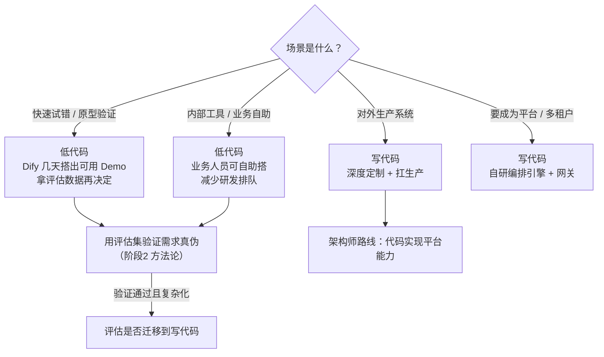

# 11 · 补充 · 低代码平台（Dify/MaxKB）与国产模型平台（百炼/千帆）

> **本份是什么**：这是 13 迭代检查报告迭代发现的**技能缺口补齐**——真实国内 JD 明确要求"基于 Dify/MaxKB 等低代码平台构建与部署智能体"，但主线学习材料（05-10）未覆盖。本份补上。
>
> **定位**：不是让你成为 Dify 深度专家，而是让你**认识它、会用它的 API、能判断什么时候该用低代码、什么时候该写代码**——这是国内市场的架构师判断力。
>
> **阅读时机**：可穿插在阶段 3（Agent 核心）之后阅读，作为"工具生态"的补充视角。不影响主线验收。

---

## 0. 一句话

> **Dify/MaxKB 是"AI 应用的组装工厂"**：把模型、知识库、工作流、工具、聊天界面做成可视化搭建的成品，非程序员也能拼出 Agent。**架构师的判断是——快速试错、内部工具、业务自助用低代码；要深度定制、要扛住生产、要成为平台，写代码。**

---

## 1. 为什么必须认识它们（市场依据）

真实核验过的国内 JD（合肥大智慧财汇，2025-09）明确要求：

> "基于 **Dify/MaxKB** 等低代码平台或 LangChain/LlamaIndex 等框架，**构建与部署智能体（Agent）及自动化工作流**……了解**阿里百炼/百度千帆**等模型平台。"

拆解出的技能簇（见 01 方向研究报告 §4）：

| 技能簇 | 主线材料 | 本份补充 |
|--------|---------|---------|
| ① LLM 开发框架 | 04-08 ✅ | - |
| ② **低代码平台 Dify/MaxKB** | ❌ 缺失 | ✅ 本份 §2-4 |
| ③ **国产模型平台 百炼/千帆** | 09 部分 ✅ | ✅ 本份 §5 |
| ④ Agent 工作流 | 06 ✅ | §4（低代码怎么表达工作流） |
| ⑤ RAG + Prompt | 04/05 ✅ | §4（Dify 的 RAG） |
| ⑥ 模型微调 | 09 ✅ | - |

> **为什么 JD 要它**：国内大量企业（尤其金融、政企、传统行业）不用代码搭建 Agent 原型和内部工具，Dify/MaxKB 是事实标准。你会写代码是一回事，**能读懂企业用 Dify 搭了什么、知道怎么跟它集成**，是市场认可的差异化。

---

## 2. 认识主角：Dify 和 MaxKB

### 2.1 Dify（最流行的国产开源 LLM 应用/Agent 平台）

| 维度 | 说明 |
|------|------|
| 是什么 | 开源 LLM 应用开发平台，可视化搭建 RAG、Agent、工作流、聊天应用 |
| 核心能力 | ① 工作流编排（可视化画布）② Agent（支持工具调用/多模型）③ 知识库（RAG）④ 模型管理（对接多家 API）⑤ 应用发布（API/Web 界面） |
| 谁在用 | 企业快速搭内部客服/知识助手/工作流自动化；产品原型验证 |
| 技术栈 | 前端 Vue + 后端 Python/Flask，自身也接 LLM API |
| 部署 | Docker 一键起，可私有化（国内合规场景重要） |
| 开放能力 | **对外提供 REST API**（chat-messages / workflow-runs），应用可被你的 Java 服务调用 |

### 2.2 MaxKB（知识库问答为主的开源平台）

| 维度 | 说明 |
|------|------|
| 是什么 | 基于大模型的**知识库问答**开源平台（飞致云 2024 发布，社区活跃） |
| 核心能力 | 知识库导入（PDF/Word/网页）→ 向量化 → 问答；模型对接（OpenAI 兼容/国产模型）；API 集成 |
| 与 Dify 区别 | **MaxKB 更聚焦"知识库问答"**；Dify 更强在"工作流 + Agent 编排"。做客服问答 MaxKB 够用，做复杂工作流选 Dify |
| 部署 | Docker 私有化，国内企业接受度高 |

> **记忆口诀**：**MaxKB = 知识库问答专用；Dify = 全能 Agent/工作流平台**。JD 同时提两者，说明企业两种场景都在用。

---

## 3. 架构师的判断：低代码 vs 写代码（核心价值）

这是本份最重要的部分——**不是让你选边，而是让你会做决策**：



| 决策维度 | 用低代码（Dify/MaxKB） | 写代码（Spring AI 自研） |
|---------|----------------------|------------------------|
| **速度** | 天级（可视化拖拽） | 周-月级（但可控） |
| **可定制深度** | 受平台能力边界限制 | 无边界 |
| **生产扛压** | 平台自身性能/安全是瓶颈 | 你控制 |
| **多租户/计费/审计** | 平台能力有限 | 完全可控（阶段6 平台设计） |
| **评估嵌入** | 平台有基础评测，深度有限 | 可完全自定义（阶段4） |
| **适合** | 原型、内部工具、业务自助、中小流量 | 对外生产、复杂编排、企业级平台 |

> **架构师原则**：先用低代码/最简方案跑通 + 评估，**指标和复杂度**证明不够了再迁移到代码。低代码不是"low"，是"低成本验证"——国内很多成功 AI 项目都是从 Dify 原型开始的。

---

## 4. 怎么和低代码平台集成（Java 工程师实操）

即使你不深度用 Dify，**你写的服务很可能要调用 Dify 的应用**，或把 Dify 当 Agent 后端。三种集成方式：

### 4.1 方式一：Java 服务调用 Dify 应用 API（最常见）

Dify 发布应用后给一个 `API Key` 和 `chat-messages` 接口，Java 侧用 WebClient 调用：

```java
// Spring AI 项目里用 WebClient 调 Dify chat-messages 接口
@Configuration
public class DifyClientConfig {
    @Bean
    public WebClient difyWebClient(@Value("${dify.api-key}") String apiKey) {
        return WebClient.builder()
            .baseUrl("https://your-dify-host/v1")
            .defaultHeader("Authorization", "Bearer " + apiKey)
            .build();
    }
}

// 调用示例：把用户问题发给 Dify 应用，拿回答
public Mono<String> chat(String conversationId, String query) {
    Map<String, Object> body = Map.of(
        "inputs", Map.of(),
        "query", query,
        "response_mode", "streaming",      // 或 blocking
        "conversation_id", conversationId
    );
    return difyWebClient.post().uri("/chat-messages")
        .bodyValue(body)
        .retrieve()
        .bodyToMono(String.class);
}
```

> **适用**：你的 Java 系统需要把某个问答/Agent 能力"外包"给 Dify 上已搭好的应用时。

### 4.2 方式二：把 Dify/MaxKB 变成你 Agent 的 Tool

你的 Java Agent（阶段3 成果）可以**把 Dify 应用当作一个外部工具**来调用——用 `@Tool` 封装：

```java
@Component
public class KnowledgeTools {
    private final WebClient dify;

    public KnowledgeTools(WebClient dify) { this.dify = dify; }

    @Tool(description = "查询企业知识库：当用户问公司制度/政策/产品文档时调用")
    public String searchKB(String question) {
        // 调 Dify/MaxKB 的知识库问答应用
        return dify.post().uri("/chat-messages")
            .bodyValue(Map.of("query", question, "response_mode", "blocking"))
            .retrieve().bodyToMono(String.class).block();
    }
}
```

> **适用**：知识库已经在 Dify/MaxKB 里管理得很好（企业现状），你的 Agent 要复用这个能力。

### 4.3 方式三：把 Dify 工作流当作编排参照

Dify 的可视化工作流（节点：开始→LLM→知识检索→条件判断→代码节点→结束）**是"Anthropic 5 大 Workflow 模式"的可视化形态**——在 Dify 里搭一遍工作流，你会更直观地理解阶段3 学的 Workflow 模式。**这是免费的教学**：把你 P3 的代码评审助手流程，用 Dify 画一遍，对比你的代码实现。

---

## 5. 国产模型平台（阿里百炼 / 百度千帆）

### 5.1 它们是什么

| 平台 | 厂商 | 核心 | 你的 Java 接入方式 |
|------|------|------|-------------------|
| **阿里百炼**（Model Studio/Bailian） | 阿里云 | 通义千问系列 + 众多开源模型托管 + RAG + 智能体编排 | OpenAI 兼容接口；Spring AI 有 `spring-ai-starter-model-dashscope`（DashScope = 百炼的 API 名） |
| **百度千帆**（Qianfan） | 百度 | 文心一言系列 + 第三方模型 + 数据集/微调 | OpenAI 兼容接口；Spring AI 有 Qianfan starter（社区/官方维护） |
| 智谱开放平台（BigModel） | 智谱 | GLM 系列 | OpenAI 兼容 |
| DeepSeek 开放平台 | 深度求索 | DeepSeek-V3/R1 | OpenAI 兼容 |

> **关键洞察**：2026 年国产模型平台普遍提供 **OpenAI 兼容接口**——意味着你学了 OpenAI/Spring AI 的调用方式，接国产平台就是**换 baseUrl + apiKey** 的事。Spring AI 的模型抽象让你**一套代码切换多家**。

### 5.2 为什么架构师要会（市场依据）

- JD 明写"了解阿里百炼/百度千帆等模型平台"——**面试会被问到**，你要能说出它们是干什么的、怎么接。
- 国内生产场景的合规要求（数据不出域、信创）让国产平台是**必选项**，不是可选项。
- 百炼/千帆不只是模型 API，还有 **RAG 托管、智能体编排、模型微调服务**——企业可能已经把部分 AI 能力放在这些平台上，你的系统要跟它们共存。

### 5.3 最小实操（半小时）

1. 注册阿里百炼（`bailian.console.aliyun.com`），开通 DashScope，拿 API Key（有免费额度）。
2. 用 curl 验证 OpenAI 兼容接口：
```bash
curl https://dashscope.aliyuncs.com/compatible-mode/v1/chat/completions \
  -H "Authorization: Bearer $DASHSCOPE_API_KEY" \
  -H "Content-Type: application/json" \
  -d '{"model":"qwen-plus","messages":[{"role":"user","content":"你好"}]}'
```
3. 在 Spring AI 里加 DashScope starter，把 model 换成 `qwen-plus`，跑通一次对话。
4. 对比 DeepSeek / 通义 / 智谱 三家的模型卡，记录各自的强项与价格（随时间变化，以官方为准）。

---

## 6. 验收标准

- [ ] 能用一句话说清 Dify 和 MaxKB 的区别（全能工作流 vs 知识库问答）
- [ ] 面对一个需求，能按"低代码 vs 写代码"决策表给出选择并讲清理由
- [ ] 能用 WebClient 从 Java 调用一个 Dify 应用的 API
- [ ] 能用 `@Tool` 把 Dify/MaxKB 知识库封装成你 Agent 的工具
- [ ] 至少用一个国产模型平台（百炼/千帆/智谱/DeepSeek）跑通 Spring AI 对话
- [ ] 能跟面试官讲清"为什么企业会先用 Dify 搭原型，再决定要不要写代码"

---

## 7. 高质量英文/中文资料（含点评）

| 资料 | 一句话点评 |
|------|-----------|
| Dify 官方文档（`docs.dify.ai`，有中文） | 看"工作流 / Agent / 知识库"三块即可，了解能力边界 |
| MaxKB 官方文档（`maxkb.cn`，中文） | 知识库问答场景的一手资料 |
| 阿里云百炼文档（`help.aliyun.com`，中文） | 看"DashScope 兼容 OpenAI 接口"和模型列表 |
| 百度智能云千帆文档（中文） | 文心/第三方模型的接入方式 |
| Anthropic《Building Effective Agents》（英文，主线材料 07 已精读） | **把 Dify 工作流画一遍，你就理解了它的可视化和"Workflow > Agent"的关系** |

---

## 8. 迭代说明

本份由 13 迭代检查报告的覆盖核对发现：真实国内 JD 的 6 大技能簇中"低代码平台（Dify/MaxKB）"未被主线材料覆盖，故新增本份补齐。这也是本专题"往复检查、循环迭代"的产物之一。
