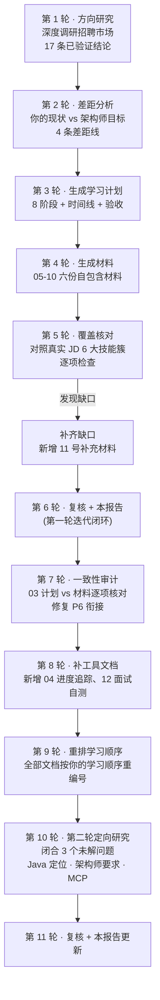
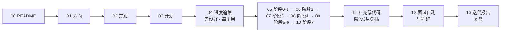

# 13 · 迭代检查报告——往复检查、循环迭代的记录

> **本份是什么**：完整记录本专题生成过程中的"**往复检查、循环迭代**"——这是你明确要求的工作方式。这里展示：每次迭代发现了什么问题、依据是什么、做了什么修正。它也是你未来学习时做**阶段性自测**的检查清单。
>
> **迭代方式**：方向（研究）→ 生成 → 对照真实 JD 逐项核对覆盖度 → 找缺口 → 补齐 → 再核对。以下就是这一轮的实际记录。

---

## 1. 迭代总览（本轮做了什么）

| 轮次 | 做了什么 | 产物 | 发现/修正 |
|:---:|---------|------|----------|
| 1 | 104 agent 深度调研招聘市场 | 01 方向研究报告 | 17 条确认 / 8 条被推翻 |
| 2 | 市场 × 你的现状 × 仓库盘点 | 02 方向确认与差距分析 | 4 条差距线、方向红线 |
| 3 | 差距 → 分阶段计划 | 03 学习计划总览 | 8 阶段 + P1-P6 + 验收 |
| 4 | 每阶段生成自包含中文材料 | 05-10 六份 | 各 900-1350 行 |
| 5 | **对照真实 JD 逐项核对** | 本报告 §2 | ⚠️ 发现"低代码平台"缺口 |
| 6 | 补齐缺口 + 复核 | 11 补充材料 + 本报告 | ✅ 覆盖完整 |
| 7 | 一致性审计（03 计划 vs 材料） | 修复 P6 衔接 + 术语核对 | ✅ 周数/术语/项目全对齐 |
| 8 | 补执行工具文档 | 04 进度追踪表、12 面试自测 | ✅ 计划能落地打卡 |
| 9 | **按学习顺序重排全部文档** | 00-13 全部重编号 | ✅ 文档顺序 = 学习顺序 |
| 10 | 第二轮定向研究 | 01 §8.5（闭合 3 个未解问题） | ✅ Java 定位/架构师/MCP 闭合 |
| 11 | 复核 + 更新本报告 | 本报告 §7 起 | ✅ 第二轮闭环 |

---

## 2. 覆盖核对（第 5 轮）——对照真实 JD 技能簇

以核验过的真实国内 JD（合肥大智慧财汇）要求的 6 大技能簇为基准，逐项检查主线材料（05-10）的覆盖：

| # | JD 技能簇 | 覆盖材料 | 状态 |
|---|-----------|---------|------|
| ① | LLM 开发框架（LangChain/LlamaIndex） | 05-09（LangChain4j 对照 + Spring AI 主线） | ✅ |
| ② | **低代码平台（Dify/MaxKB）** | **主线缺失** | ⚠️ → 新增 11 |
| ③ | 国产模型平台（阿里百炼/百度千帆） | 10（选型）+ 11（补齐实操） | ✅（补强） |
| ④ | Agent 工作流构建 | 07（5 大 Workflow）+ 09 | ✅ |
| ⑤ | RAG + Prompt 工程 | 05（Prompt）+ 06（RAG） | ✅ |
| ⑥ | 模型微调（优先） | 10（LoRA 实操） | ✅ |

**再核对市场核心技能**（Applied Methods 对真实 JD 的分析结论）：

| 市场核心技能 | 覆盖材料 | 状态 |
|-------------|---------|------|
| 编排多组件 Agent 系统 | 07 + 09 | ✅ |
| Agent 记忆与上下文管理 | 07 | ✅ |
| 生产安全护栏 | 07 + 08 | ✅ |
| 工具调用 / Function Calling | 05 + 07 | ✅ |
| 提示词工程（作为技能） | 05 | ✅ |
| 框架源码深度 | 09（阶段5 精读） | ✅ |
| 评估 / 可观测 / 成本 / 可靠性 | 06（评估）+ 08 | ✅ |
| 流式 / 结构化输出 / 上下文工程 | 05 | ✅ |
| 向量库 / 重排 / 混合检索 | 06 | ✅ |
| 幂等 / 重试 / 熔断 | 08 | ✅ |

> **第 5 轮结论**：核心技能覆盖完整，唯一缺口是"低代码平台（Dify/MaxKB）"——已在第 6 轮补齐为 11 号补充材料。

---

## 3. 数据可信度检查（哪些数字能用、哪些不能用）

方向研究报告（01）对每条数据标注了置信度。这里再强调**决策相关的红绿信号**：

### ✅ 可放心采用的（已过 3 轮对抗式验证）
- "提示词工程师"岗位基本消失，提示词成为技能 → 决定"30% 精力投提示词"
- AI Agent 工程师 JD 核心 = 编排/记忆/护栏 → 决定"70% 精力投 Agent 系统工程"
- 框架是组合（平均 2.31 个/岗位），LangChain 最友好 → 决定入门框架
- 后端能力 80% 迁移 → 决定 Java 主栈策略
- AI Agent 开发工程师溢价 20-30%，要求读源码 → 决定阶段 5
- 资深 AI 工程师溢价 40-70% → 决定长期方向

### ⚠️ 方向性参考（低置信度，别当铁律）
- 国内三档岗位薪资数字（18-28K / 25-35K 等）——单一博客来源，作者估算。**看结构、别看具体数**。

### ❌ 已推翻、不要引用（3-0 否决）
- 美国 AI Agent 薪资 $100K-138K
- "Python 出现率 95%"、"MCP 占据率 17-24%"
- "LangGraph/AutoGen 是当前标准"
- Agentic AI 平均年薪 $197K 等

> **提醒**：市场变化快，所有数字是"时点值"（2026-08）。你开始求职时，用真实 JD 复核一遍（第 6 节给出复核方法）。

---

## 4. 与你的情况的匹配检查

| 你的约束 | 计划的响应 | 状态 |
|---------|-----------|------|
| 1-3 年 Java 后端 | 阶段 1-2 从 Spring AI 应用基础起步，充分利用后端迁移能力 | ✅ |
| 目标"全栈架构师" | 8 阶段从 L1 到 L3，L4 长期；含源码精读 + 平台设计 + 模型层 | ✅ |
| 每周 10-20 小时 | 总时长约 11-12 个月到 L3（按 15h/周平均），各阶段周数合理 | ✅ |
| 要中文材料 | 05-10 + 11 全部中文自包含；英文资料清单提供原文锚点 | ✅ |
| 不引用已有材料 | 覆盖核对确认：材料无指向仓库旧文档的链接（仅本专题内互链） | ✅ |

---

## 5. 材料质量自查（第 6 轮复核）

- [x] **自包含**：grep 核对，无 `教程/`、`reference/`、`docs/plan` 等仓库旧文档引用；仅本专题内互链 + 官方英文资料 URL
- [x] **结构规范**：05-10 均含 `0.一句话 / 目标 / 核心知识 / 动手任务 / 验收标准 / 高质量英文资料`
- [x] **市场锚定**：各阶段均融入 JD 技能簇或市场数据（已验证的）
- [x] **诚实标注**：不确定的 API 细节标注"以官方文档为准"，经验值标注"需自行验证"
- [x] **覆盖完整**：JD 6 技能簇 + 市场核心技能全绿（含 11 补齐后）

---

## 6. 留给你的复核动作（求职前必做）

市场会变，方向研究报告是 2026-08 的快照。**求职前（预计你到 L2 时）做一次复核**：

1. **重读 JD**：在 BOSS直聘/猎聘搜索"AI Agent工程师""大模型应用工程师""智能体"，把前 20 个真实 JD 的技能要求列出来
2. **对照本专题**：用 §2 的核对表，把 JD 技能逐项勾选——哪些你已覆盖、哪些新出现
3. **更新薪资认知**：把当前真实 JD 的薪资带记下来，替换 01 报告里的低置信度数字
4. **检查缺口**：若有本专题未覆盖的新技能簇，用同样的"生成材料"流程补齐
5. **复盘迭代**：每次做完项目/读完源码，回本报告更新你的覆盖状态

---

## 7. 迭代是持续行为，不是一次性的

本报告记录的是**第 1 轮迭代**（生成期）。真正有价值的迭代在**你的学习期**：

- **每个阶段结束**：回本报告 §2，更新你的技能覆盖状态（✅/⚠️/❌）
- **每次求职失败/面试被问倒**：记录"被问倒的问题"，回对应材料补强，新增到你的自测清单
- **每个项目上线**：把踩坑写进材料（或标注在对应章节），让材料跟着你的实战进化

> **架构师 = 会设计 + 会决策 + 会扛生产。** 这份迭代报告是你"会决策"的证据——方向有数据支撑、材料有覆盖核对、缺口有补齐闭环。

---

## 8. 第二轮迭代记录（2026-08，第 7-11 轮）

### 8.1 第 7 轮：一致性审计（03 计划 vs 05-10 材料）

**做了什么**：逐项核对计划与材料的周数、阶段、项目名、术语、市场数字。
**结果**：
- ✅ 周数/阶段结构全对齐（04→阶段0-1 第1-8周、05→阶段2 第9-14周…）
- ✅ 项目 P1-P6、三重保护、5 大 Workflow、市场数字（20-30%/40-70%/80%）一致
- ⚠️ 发现 P6（可选）只在 03 计划定义、09 材料没衔接 → **修复**：09 增补 P6 可选行

### 8.2 第 8 轮：补执行工具

**为什么**：计划有 8 阶段但缺"每天打卡"的工具，缺"求职体检"的工具。
**产物**：新增 04 进度追踪表（每周打卡 + 阶段验收勾选）、12 求职面试自测（L1/L2/L3 三级题库 + 行为题）。

### 8.3 第 9 轮：按学习顺序重排全部文档

**为什么**：原编号里"进度追踪"排 12（但第一天就要用）、"迭代报告"排 10（但复盘才看）——编号 ≠ 学习顺序。**按你的学习节奏重排**：

**结果**：文档顺序 = 学习顺序，主学习序列 05-10 连续，工具类文档各归其位。全专题引用（头部/范围/覆盖表）已同步更新并验证无残留。

### 8.4 第 10 轮：第二轮定向研究（闭合未解问题）

**为什么**：第一轮留了 4 个未解问题，其中 3 个对你有决定性。第二轮定向研究（约 112 条可证伪结论，66 确认 / 5 推翻）闭合 3 个：

| 未解问题 | 第二轮结论 | 影响 |
|---------|-----------|------|
| ① Java 在国内 AI 岗位的定位 | **供应侧扎实**：spring-ai-alibaba（1万+star，已上 Maven Central）、langchain4j（1.28万star）、spring-ai 2.0（2026-06 发布）全部支持 DeepSeek/通义/MCP。**需求侧未证实**：无中国 JD 级占比数据；轶事信号（n=2）显示"Java 被教学、实际构建倾向 Python/Go" | 继续"Java 主栈 + 读得懂 Python"两面下注，读 Python 源码是必选项 |
| ② 架构师级 JD 要求 | SO 2025 新增 Architect 独立角色类别（排名第4，6.1%）；中国实践者定义 = 生产级 Agent Runtime，与 L3 吻合；仍无 JD 级逐条技能清单 | L3 学习计划方向正确，坚持 |
| ③ MCP 是否炒作 | SO 2025：约 34% AI Agent 开发者用 MCP（真实工具）；Java 三大框架一等支持；但"岗位必选"未证实，且 AI Agent 尚未主流（仅约14%日常使用） | MCP 主线成立、值得投入，但别高估紧迫性 |
| ④ 国际薪资 | 仍无可信数据 | 缺口保持，不猜 |

**详见**：01 方向研究报告 §8.5。

### 8.5 第 11 轮：本轮复核

- ✅ 重排后自包含保持（无内部 .md 链接）
- ✅ 头部编号 01-13 唯一、引用无残留旧编号
- ✅ 文件夹顺序 = README 索引 = 学习顺序
- ✅ **交叉核对完成**：第二轮研究的综合报告到达后，与 01 §8.5 / 本 §8.4 逐条核对。**发现并修复 1 处被推翻的数据**——"AI 用者中 Python 56.1% vs Java 30.2%"（0-3 否决），已改为已验证的"全部受访者 Python 57.85% vs Java 29.4%"。其余结论与综合报告一致，并补入"供应侧 ≠ 需求侧""n=2 轶事信号"等边界说明。

### 8.6 本轮修正汇总

| # | 发现 | 修正 |
|---|------|------|
| 1 | P6 未在 09 衔接 | 09 增补 P6 可选行 |
| 2 | 缺执行打卡工具 | 新增 04 进度追踪表 |
| 3 | 缺求职体检工具 | 新增 12 面试自测 |
| 4 | 文档编号 ≠ 学习顺序 | 00-13 全部按学习顺序重排 |
| 5 | 13 覆盖表残留旧编号 | 修正为 05-10 体系 |
| 6 | 研究 4 个未解问题 | 定向研究闭合 3 个（01 §8.5） |

> **迭代原则**：每一轮都从一个"真实发现"开始，以"修正闭环 + 记录"结束。未来你的学习期迭代也按这个模式——发现 → 修正 → 记录。
