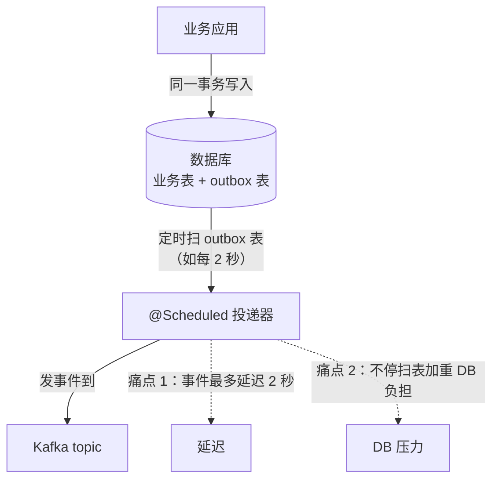
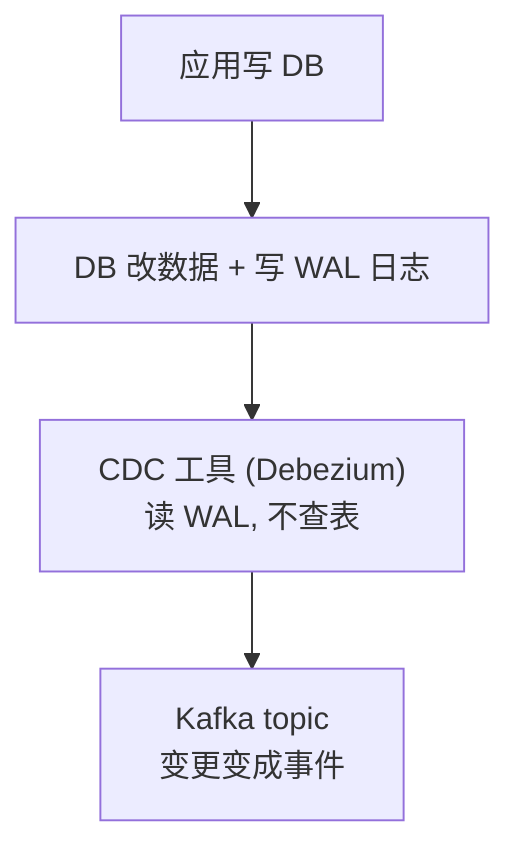
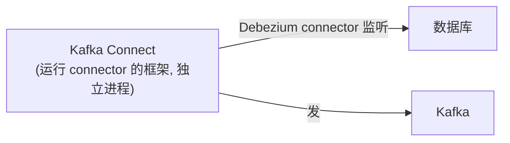
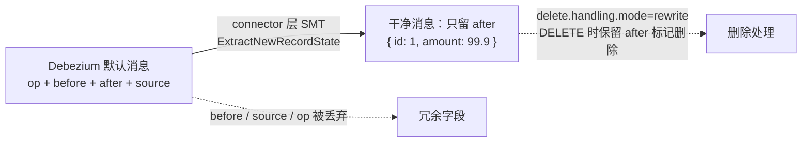
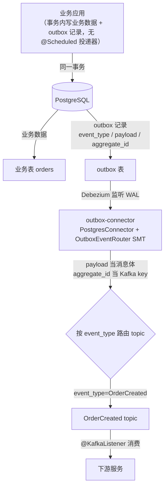
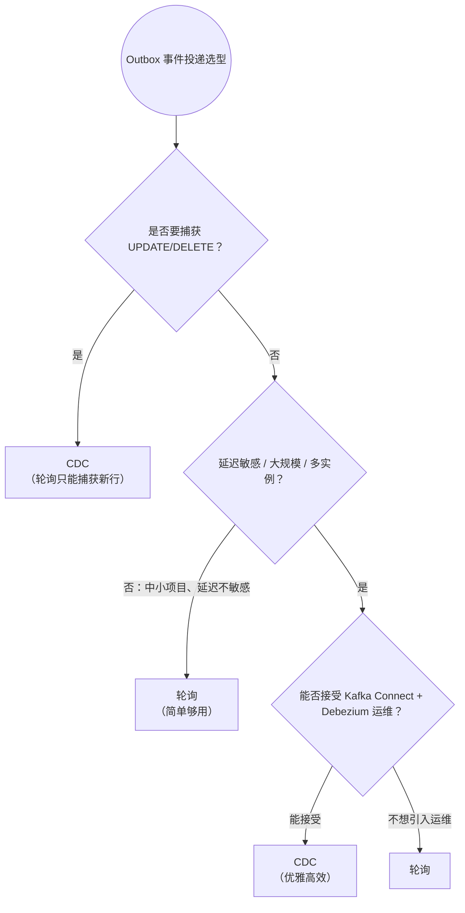

# Debezium CDC 实战（从轮询到变更数据捕获）

> **这份文档是什么**：一篇**独立专题**，讲 **Debezium**——业界主流的 **CDC（Change Data Capture，变更数据捕获）** 工具。它监听数据库的变更日志，把"数据库的每一次改动"自动变成事件流。
>
> **写给谁**：读完了 [Spring Cloud Stream 专题 04 生产级进阶](../Kafka消息队列实战专题/04-生产级进阶-Outbox与Schema与分区调优.md) 方向 A（Outbox 模式）的人。那篇讲了 Outbox 的"轮询投递"，并提到"CDC 是更优雅但更重的方案"。**本篇就是那个 CDC 的深度落地。**
>
> **和消息框架的关系**：CDC 是 Outbox 模式的进阶投递方式（04 方向 A.4 只讲概念，本篇落地）。它本身不是 Spring Cloud Stream，但常和消息框架配合——Debezium 把变更发到 Kafka，下游服务用 Kafka（`@KafkaListener`）消费。
>
> **版本前提（已校验）**：Debezium 3.x（2025 最新）+ Kafka Connect + PostgreSQL 16。配置对照 [Confluent Debezium PG 文档](https://docs.confluent.io/kafka-connectors/debezium-postgres-source/current/overview.html) 和 [Debezium 官方示例](https://github.com/debezium/debezium-examples/blob/main/tutorial/docker-compose-postgres.yaml) 校验。

---

## 目录

- [第 1 章：为什么需要 CDC——轮询的痛点](#第-1-章为什么需要-cdc轮询的痛点)
- [第 2 章：CDC 与 Debezium 是什么](#第-2-章cdc-与-debezium-是什么)
- [第 3 章：动手——PG + Debezium 完整搭建](#第-3-章动手pg--debezium-完整搭建)
- [第 4 章：SMT——把 Debezium 消息变成你要的样子](#第-4-章smt把-debezium-消息变成你要的样子)
- [第 5 章：Outbox + CDC 落地](#第-5-章outbox--cdc-落地)
- [第 6 章：架构师取舍](#第-6-章架构师取舍)

---

## 第 1 章：为什么需要 CDC——轮询的痛点

### 1.1 回顾 Outbox 轮询投递（04 方向 A.3）

[04 生产级进阶](../Kafka消息队列实战专题/04-生产级进阶-Outbox与Schema与分区调优.md) 讲过：Outbox 模式里，业务数据 + outbox 事件写同一事务，再用一个 `@Scheduled` 投递器定时扫 outbox 表发 Kafka。

轮询投递有两个痛点：

1. **延迟**：定时扫表（如每 2 秒），事件最多延迟 2 秒才到 Kafka。延迟敏感场景不够。
2. **DB 压力**：不停扫表，给数据库增加查询负担。表越大、扫得越频繁，负担越重。

**轮询投递流程**：



### 1.2 有没有"事件一来就立刻捕获、还不查表"的办法

有——**CDC（Change Data Capture）**。它不查表，而是**读数据库的变更日志**（binlog/WAL），一旦表有新数据，日志里立刻有，CDC 立刻捕获。**毫秒级延迟、零查询压力**。

---

## 第 2 章：CDC 与 Debezium 是什么

### 2.1 CDC 的原理

数据库每次写操作（INSERT/UPDATE/DELETE），除了改数据，还会往**变更日志**（MySQL binlog、PostgreSQL WAL）写一条记录。**CDC 工具伪装成数据库的"副本订阅者"，读这个日志**，把每条变更转成事件。



**关键**：CDC **不查表**，读的是数据库用来保证持久化的日志——所以零查询压力、毫秒延迟。

### 2.2 Debezium：业界主流 CDC

**Debezium** 是开源 CDC 项目的标准，构建在 **Kafka Connect**（Kafka 的数据集成框架）之上。它支持 PG/MySQL/MySQL/MongoDB/Oracle/SQL Server 等主流数据库。

**部署形态**：Debezium 是 Kafka Connect 的一个 **connector（连接器）** 插件。架构：



### 2.3 Debezium 的事件结构

Debezium 发出的每条消息，包含**变更前后**的数据：

```json
{
  "op": "c",                       // ▼ 操作类型：c=create, u=update, d=delete, r=snapshot
  "before": null,                  // 变更前（INSERT 时为 null）
  "after": { "id": 1, "balance": 150 },   // 变更后（DELETE 时为 null）
  "source": { "db": "postgres", "ts_ms": 1234567890 }  // 变更来源元数据
}
```

默认结构较臃肿（含 before/after/source 等），第 4 章用 SMT 精简。

---

## 第 3 章：动手——PG + Debezium 完整搭建

### 3.1 PG 开启逻辑解码（前置必做）

Debezium 监听 PG 靠的是 **逻辑解码（logical decoding）**——PG 必须开启这个能力。改 `postgresql.conf`：

```
wal_level = logical
max_replication_slots = 4
max_wal_senders = 4
```

并创建一个有复制权限的角色：

```sql
CREATE ROLE debezium REPLICATION LOGIN PASSWORD 'debezium';
GRANT USAGE ON SCHEMA public TO debezium;
GRANT SELECT ON ALL TABLES IN SCHEMA public TO debezium;
```

> **这是 PG + CDC 的硬前提**。不开 logical decoding，Debezium 连不上。官方文档明确要求。

### 3.2 docker-compose：Kafka + Connect + PG

官方有 [docker-compose 模板](https://github.com/debezium/debezium-examples/blob/main/tutorial/docker-compose-postgres.yaml)，这里精简版：

```yaml
version: "3"
services:
  postgres:
    image: postgres:16
    environment:
      POSTGRES_PASSWORD: postgres
      # ▼ 启动时开启逻辑解码（免去手改配置文件）
      POSTGRES_INITDB_ARGS: "--wal_level=logical"
    command: ["postgres", "-c", "wal_level=logical"]
    ports: ["5432:5432"]

  kafka:
    image: confluentinc/cp-kafka:latest
    environment:
      KAFKA_NODE_ID: 1
      KAFKA_PROCESS_ROLES: broker,controller
      KAFKA_LISTENERS: PLAINTEXT://:9092
      KAFKA_ADVERTISED_LISTENERS: PLAINTEXT://kafka:9092
      KAFKA_CONTROLLER_QUORUM_VOTERS: 1@kafka:9092
      KAFKA_INTER_BROKER_LISTENER_NAME: PLAINTEXT
      CLUSTER_ID: mike-must-cluster-id-1

  connect:
    image: debezium/connect:3.1       # ▼ Debezium 3.1（2025 版，自带 PG connector）
    depends_on: [kafka, postgres]
    environment:
      BOOTSTRAP_SERVERS: kafka:9092
      GROUP_ID: connect-cluster
      CONFIG_STORAGE_TOPIC: connect-configs
      OFFSET_STORAGE_TOPIC: connect-offsets
      STATUS_STORAGE_TOPIC: connect-status
    ports: ["8083:8083"]              # ▼ Kafka Connect REST API 端口
```

```bash
docker-compose up -d
# 三个容器：postgres、kafka、connect
```

### 3.3 注册 PG connector（让 Debezium 监听 PG）

Kafka Connect 用 **REST API** 注册 connector。发个 POST：

```bash
curl -X POST http://localhost:8083/connectors -H "Content-Type: application/json" -d '{
  "name": "pg-connector",
  "config": {
    "connector.class": "io.debezium.connector.postgresql.PostgresConnector",
    "database.hostname": "postgres",
    "database.port": "5432",
    "database.user": "debezium",
    "database.password": "debezium",
    "database.dbname": "postgres",
    "database.server.name": "pgserver",          ▼ topic 前缀
    "plugin.name": "pgoutput",                    ▼ PG 逻辑解码插件（PG10+ 默认）
    "table.include.list": "public.orders,public.outbox"   ▼ 只监听这两张表
  }
}'
```

**注册后发生了什么**：
1. Debezium 先对 `orders`/`outbox` 表做**初始快照**（snapshot，把现有数据全发一遍）。
2. 之后监听 WAL，表一有变更立刻发 Kafka。

### 3.4 验证：改一条数据，看 Kafka

```bash
# 往 PG 插一条订单
docker exec -it <pg容器> psql -U postgres -c "INSERT INTO orders(id, amount) VALUES(1, 99.9);"

# 看 Kafka 收到了（topic 名 = server名.模式.表名 = pgserver.public.orders）
docker exec -it <kafka容器> kafka-console-consumer --bootstrap-server kafka:9092 \
  --topic pgserver.public.orders --from-beginning
# 立刻看到 Debezium 发的变更事件（含 after: {id:1, amount:99.9}）
```

**毫秒级延迟、零查询压力**——这就是 CDC 的魔力。

---

## 第 4 章：SMT——把 Debezium 消息变成你要的样子

### 4.1 默认消息太臃肿

Debezium 默认消息含 `before/after/source/op` 一堆字段，下游消费者通常只想要 `after`（变更后的数据）。**SMT（Single Message Transform，单消息转换）** 在 connector 层把消息精简成你要的样子。

### 4.2 常用 SMT（对照 Confluent 文档校验）

| SMT | 作用 |
|-----|------|
| **ExtractNewRecordState** | 只取 `after`，丢弃 before/source/op（Debezium 自带，最常用） |
| **SetSchemaMetadata** | 设置消息的 schema 名/版本 |
| **TopicRouter** | 按内容路由到不同 topic |

### 4.3 配置 ExtractNewRecordState

在 connector 配置里加 `transforms`：

```json
{
  "name": "pg-connector",
  "config": {
    "connector.class": "io.debezium.connector.postgresql.PostgresConnector",
    "...": "（其他配置）",
    "transforms": "unwrap",
    "transforms.unwrap.type": "io.debezium.transforms.ExtractNewRecordState",
    "transforms.unwrap.drop.tombstones": "true",          ▼ 丢弃 DELETE 的 tombstone 消息
    "transforms.unwrap.delete.handling.mode": "rewrite"    ▼ DELETE 时保留 after（标记删除）
  }
}
```

**转换后**：消息从臃肿的 `{op, before, after, source}` 变成干净的 `{id: 1, amount: 99.9}`——下游消费者拿到的是干净数据，不用处理 Debezium 的包装。

**SMT 消息转换**：



### 4.4 Outbox Event Router SMT（专门给 Outbox 用）

04 方向 A.4 提过，Debezium 有专门给 Outbox 模式的 SMT。它把 outbox 表的行**自动路由**：用 `aggregate_id` 当 Kafka key、`payload` 当消息体、`event_type` 决定 topic。

```json
"transforms": "outbox",
"transforms.outbox.type": "io.debezium.transforms.OutboxEventRouter",
"transforms.outbox.table.field.event.id": "id",
"transforms.outbox.table.field.event.key": "aggregate_id",
"transforms.outbox.table.field.event.payload": "payload",
"transforms.outbox.table.fields.additional.placement": "event_type:header:eventType",
"transforms.outbox.route.by.field": "event_type",
"transforms.outbox.route.topic.replacement": "${routedByValue}"
```

效果：outbox 表插一行 `event_type=OrderCreated, payload=...` → Debezium 自动把 payload 发到 `OrderCreated` topic，key 用 aggregate_id。**业务代码不用发 Kafka，写 outbox 表就行，CDC 自动投递**——这是 Outbox 模式的优雅形态。

---

## 第 5 章：Outbox + CDC 落地

把 04 方向 A 的 Outbox 模式用 CDC 投递（而不是轮询）。

### 5.1 业务代码（和轮询方案完全一样）

业务代码不变——还是事务里写业务数据 + outbox 表（见 [04 方向 A.3.2](../Kafka消息队列实战专题/04-生产级进阶-Outbox与Schema与分区调优.md)）。**没有 `@Scheduled` 投递器了**——Debezium 监听 outbox 表自动投递。

### 5.2 Debezium 监听 outbox 表 + Outbox SMT

```json
{
  "name": "outbox-connector",
  "config": {
    "connector.class": "io.debezium.connector.postgresql.PostgresConnector",
    "...": "PG 连接配置",
    "table.include.list": "public.outbox",          ▼ 只监听 outbox 表
    "transforms": "outbox",
    "transforms.outbox.type": "io.debezium.transforms.OutboxEventRouter",
    "transforms.outbox.table.field.event.payload": "payload",
    "transforms.outbox.route.by.field": "event_type",
    "transforms.outbox.route.topic.replacement": "${routedByValue}"
  }
}
```

**Outbox + CDC 整体架构**：



### 5.3 效果对比轮询

| 维度 | 轮询投递（04 A.3） | CDC 投递（本篇） |
|------|------------------|----------------|
| 延迟 | 秒级（轮询间隔） | **毫秒级** |
| DB 压力 | 有（定时查表） | **无**（读 WAL） |
| 业务代码 | 要写 `@Scheduled` 投递器 | **不用**（CDC 自动） |
| 多实例 | 要 SKIP LOCKED | **天然无冲突**（WAL 单线程序列） |
| 运维成本 | 低 | **高**（要部署 Kafka Connect + Debezium） |

> **这是 Outbox 模式的"终极形态"**：业务只管写 outbox 表，CDC 自动把事件毫秒级投递到 Kafka，无重复无丢失（Debezium 有 offset 管理），多实例无冲突。代价是引入 Kafka Connect + Debezium 的运维。

---

## 第 6 章：架构师取舍

### 6.1 CDC 的价值

- **低延迟**：毫秒级捕获变更。
- **零查询压力**：读日志不查表。
- **解耦**：业务不用管"发事件"，只管写 DB。
- **完整**：连 UPDATE/DELETE 都能捕获（轮询只捕获新行）。

### 6.2 代价

1. **运维复杂**：要部署 Kafka Connect + Debezium connector，监控它们的健康。
2. **DB 配置**：PG 要开逻辑解码、建复制角色，有运维要求。
3. **DDL 变更脆弱**：表结构变了（加列/改列），connector 可能要重新配置/重启。
4. **消息顺序**：单分区内有序，但跨表/跨行无全局顺序保证。

### 6.3 决策表：轮询 vs CDC（Outbox 投递）

| 场景 | 用哪个 |
|------|--------|
| 中小项目、团队小、延迟不敏感 | **轮询**（简单够用） |
| 大规模、延迟敏感、多实例 | **CDC**（优雅高效） |
| 要捕获 UPDATE/DELETE（不只新增） | **CDC**（轮询只能捕获新行） |
| 不想引入 Kafka Connect 运维 | **轮询** |

**选型决策**：



### 6.4 架构师的一句话

> **CDC 把"数据库变更"变成了一等公民的事件流**。它让 Outbox 模式达到优雅形态（业务只写表，事件自动流），也是数据同步（DB→搜索/缓存/数仓）的利器。但它的运维成本（Kafka Connect + connector 管理）不低——**小项目用轮询，规模到了再上 CDC**。这是"演进"出来的架构，不是一步到位。

---

## 配套学习资料

- [Spring Cloud Stream 专题 04 生产级进阶 方向 A](../Kafka消息队列实战专题/04-生产级进阶-Outbox与Schema与分区调优.md)（Outbox 轮询投递，本篇是其 CDC 升级）
- [Confluent：Debezium PG connector 文档](https://docs.confluent.io/kafka-connectors/debezium-postgres-source/current/overview.html)（配置权威）
- [Debezium 官方 docker-compose 示例](https://github.com/debezium/debezium-examples/blob/main/tutorial/docker-compose-postgres.yaml)（搭建模板）
- [Debezium 官方博客：Outbox 模式](https://debezium.io/blog/2019/02/19/reliable-microservices-data-exchange-with-the-outbox-pattern/)（Outbox+CDC 经典）
- [Docker 与 Docker-Compose 入门](../Docker与工具/01-Docker与Docker-Compose入门.md)（本章 docker-compose 的基础）

---

> **写在最后**：CDC 是事件驱动架构里"基础设施级"的能力——它让数据库变更自动变成事件流，是 Outbox 模式的终极形态、也是数据同步的利器。但它的运维成本决定了它属于"规模到了再上"的进阶方案。掌握它的标志：你能说清"轮询和 CDC 各自适合什么场景"，并在对的阶段选择对的方案。到此，你的事件驱动系统能力链已经覆盖到数据基础设施层。
