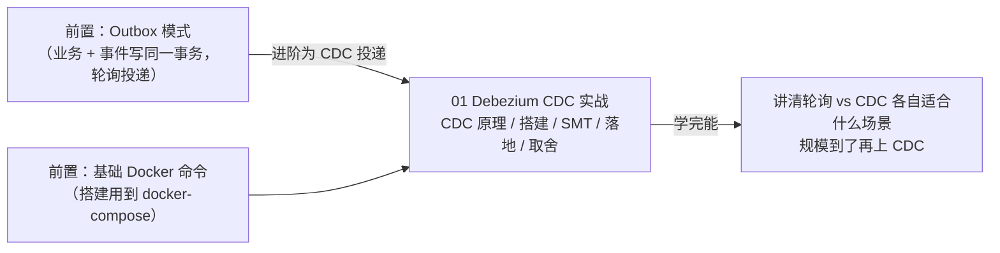

# Debezium CDC 实战专题
> 📌 辅线定位：专为《附录/Kafka消息队列实战专题》补充数据管道（CDC）背景

本专题讲 **CDC（变更数据捕获）**——用 Debezium 监听数据库变更日志，自动把数据变更变成事件流。是 Outbox 模式（业务数据 + 事件写同一事务）的 CDC 投递落地。

| 顺序 | 文档 | 你将学到 |
|:---:|------|---------|
| **01** | Debezium CDC 实战 | CDC 原理；PG 逻辑解码；Kafka Connect + Debezium 搭建；SMT 消息转换；Outbox+CDC 落地；轮询 vs CDC 取舍 |

**学习路线**：

> **前置**：理解 Outbox 模式（业务数据 + 事件写同一事务）并会用基础 Docker 命令（本篇搭建要用 docker-compose）。
>
> **适合谁**：Outbox 模式要做到毫秒级低延迟、或要做 DB→搜索/缓存/数仓数据同步的场景。中小项目用轮询即可，规模到了再上 CDC。
