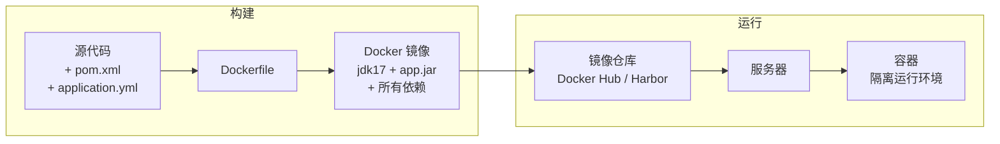
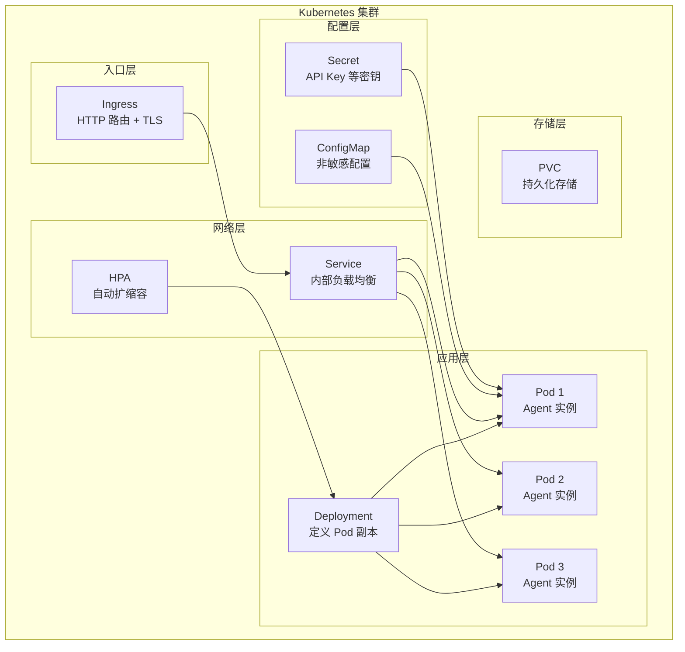

# 附录：Docker 与 Kubernetes 速成

> 这不是主线文档。当你在部署 Agent 系统时卡壳时，回来查阅。

---

## Docker：容器化打包

Docker 把你的 Spring AI 应用 + JDK + 所有依赖打包成一个**镜像（Image）**，在任何环境都能一致运行。



---

## Spring AI 应用的 Dockerfile

```dockerfile
# 多阶段构建
# 阶段1：构建
FROM maven:3.9-eclipse-temurin-17 AS builder
WORKDIR /app
COPY pom.xml .
RUN mvn dependency:go-offline  # 缓存依赖层
COPY src ./src
RUN mvn package -DskipTests

# 阶段2：运行（更小的镜像）
FROM eclipse-temurin:17-jre-alpine
WORKDIR /app
COPY --from=builder /app/target/*.jar app.jar

# Agent 应用的 JVM 参数
ENV JAVA_OPTS="-Xms512m -Xmx2g -XX:+UseG1GC"

# 健康检查
HEALTHCHECK --interval=30s --timeout=10s --retries=3 \
    CMD wget --no-verbose --tries=1 --spider http://localhost:8080/actuator/health || exit 1

EXPOSE 8080
ENTRYPOINT ["sh", "-c", "java $JAVA_OPTS -jar app.jar"]
```

---

## Docker Compose：多容器编排

Agent 系统通常包含多个服务。Docker Compose 用一个 YAML 定义全部：

```yaml
version: '3.8'
services:
  agent-app:
    build: .
    ports:
      - "8080:8080"
    environment:
      - OPENAI_API_KEY=${OPENAI_API_KEY}
      - SPRING_AI_OPENAI_API_KEY=${OPENAI_API_KEY}
      - SPRING_DATA_REDIS_HOST=redis
      - VECTOR_STORE_HOST=qdrant
    depends_on:
      - redis
      - qdrant
      - postgres

  redis:
    image: redis:7-alpine
    ports:
      - "6379:6379"
    volumes:
      - redis-data:/data

  qdrant:
    image: qdrant/qdrant:latest
    ports:
      - "6333:6333"
    volumes:
      - qdrant-data:/qdrant/storage

  postgres:
    image: pgvector/pgvector:pg16
    environment:
      - POSTGRES_DB=agentdb
      - POSTGRES_USER=agent
      - POSTGRES_PASSWORD=secret
    ports:
      - "5432:5432"
    volumes:
      - pg-data:/var/lib/postgresql/data

volumes:
  redis-data:
  qdrant-data:
  pg-data:
```

---

## Kubernetes：生产级容器编排



---

## K8s 核心概念速查

| 概念 | 定义 | Agent 场景 |
|------|------|-----------|
| **Pod** | K8s 最小部署单元（1+容器） | 运行 1 个 Agent 实例 |
| **Deployment** | 管理 Pod 副本和滚动更新 | 管理 3-10 个 Agent 副本 |
| **Service** | 内部负载均衡 + 服务发现 | 多个 Agent 实例的流量分发 |
| **Ingress** | 外部 HTTP 入口 + TLS | 用户请求入口 |
| **ConfigMap** | 非敏感配置 | Prompt 模板、模型参数 |
| **Secret** | 敏感配置 | API Key、数据库密码 |
| **HPA** | 水平 Pod 自动扩缩容 | 根据流量自动扩缩 Agent 实例 |
| **PDB** | Pod Disruption Budget | 确保至少 N 个 Agent 实例存活 |

---

## Agent 应用的 K8s 部署

```yaml
apiVersion: apps/v1
kind: Deployment
metadata:
  name: agent-service
spec:
  replicas: 3
  selector:
    matchLabels:
      app: agent-service
  template:
    metadata:
      labels:
        app: agent-service
    spec:
      containers:
      - name: agent
        image: registry.example.com/agent-service:v1.2.0
        ports:
        - containerPort: 8080
        env:
        - name: OPENAI_API_KEY
          valueFrom:
            secretKeyRef:
              name: agent-secrets
              key: openai-api-key
        - name: JAVA_OPTS
          value: "-Xms512m -Xmx2g -XX:+UseG1GC"
        resources:
          requests:
            memory: "1Gi"
            cpu: "500m"
          limits:
            memory: "3Gi"
            cpu: "2000m"
        # Agent 专属：就绪探针检查 LLM 连通性
        readinessProbe:
          httpGet:
            path: /actuator/health/readiness
            port: 8080
          initialDelaySeconds: 30
          periodSeconds: 10
        livenessProbe:
          httpGet:
            path: /actuator/health/liveness
            port: 8080
          initialDelaySeconds: 60
          periodSeconds: 30
---
apiVersion: autoscaling/v2
kind: HorizontalPodAutoscaler
metadata:
  name: agent-hpa
spec:
  scaleTargetRef:
    apiVersion: apps/v1
    kind: Deployment
    name: agent-service
  minReplicas: 3
  maxReplicas: 20
  metrics:
  - type: Resource
    resource:
      name: cpu
      target:
        type: Utilization
        averageUtilization: 70
  # Agent 专属：基于自定义指标（QPS）扩缩
  - type: Pods
    pods:
      metric:
        name: agent_requests_per_second
      target:
        type: AverageValue
        averageValue: "50"
```

---

## Agent 应用的 K8s 注意事项

| 问题 | 解决方案 |
|------|---------|
| **启动慢**（连 LLM、加载向量库） | 增大 readinessProbe 的 initialDelaySeconds |
| **内存波动大**（上下文大小变化） | 设置合理的 memory limit + GC 策略 |
| **优雅停机**（Agent 正在处理请求） | `terminationGracePeriodSeconds: 60` + Spring 的 graceful shutdown |
| **配置热更新**（Prompt 变更不停机） | ConfigMap + Spring Cloud Kubernetes + 热刷新 |
| **GPU 调度**（自建推理服务） | `resources.limits: nvidia.com/gpu: 1` |
| **长连接**（SSE 流式输出） | Ingress 配置 `proxy-read-timeout: 300s` |

---

## 常用命令

```bash
# 构建 & 推送镜像
docker build -t agent-service:v1.0 .
docker push registry.example.com/agent-service:v1.0

# 部署 & 更新
kubectl apply -f deployment.yaml
kubectl set image deployment/agent-service agent=agent-service:v1.1

# 查看状态
kubectl get pods -l app=agent-service
kubectl logs -f deployment/agent-service
kubectl describe pod <pod-name>

# 扩缩容
kubectl scale deployment agent-service --replicas=5

# 进入容器调试
kubectl exec -it <pod-name> -- sh

# 端口转发调试
kubectl port-forward <pod-name> 8080:8080
```

---

## 相关文档

- [阶段4-生产化/22-灾备与多活部署](../阶段4-生产化/22-灾备与多活部署.md)
- [阶段4-生产化/24-容量规划与弹性伸缩](../阶段4-生产化/24-容量规划与弹性伸缩.md)
- [阶段5-架构师/04-AI原生架构设计](../阶段5-架构师/04-AI原生架构设计.md)
- [阶段5-架构师/08-Agent平台化设计](../阶段5-架构师/08-Agent平台化设计.md)
