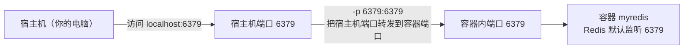
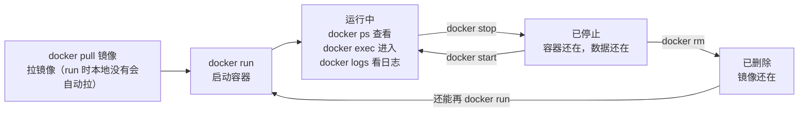
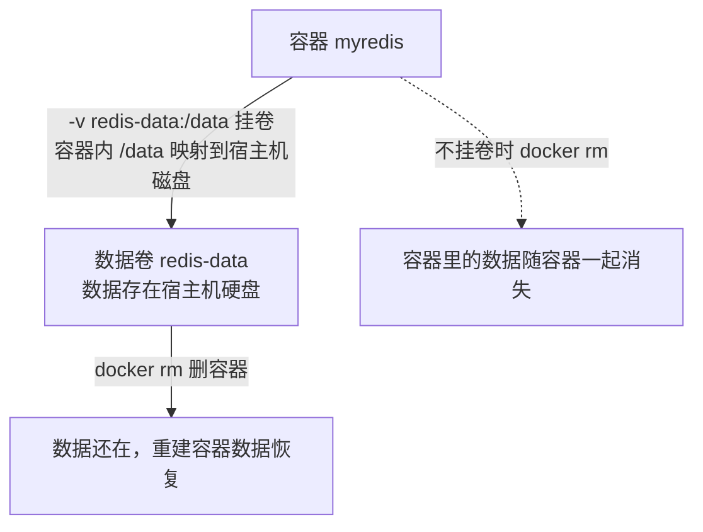
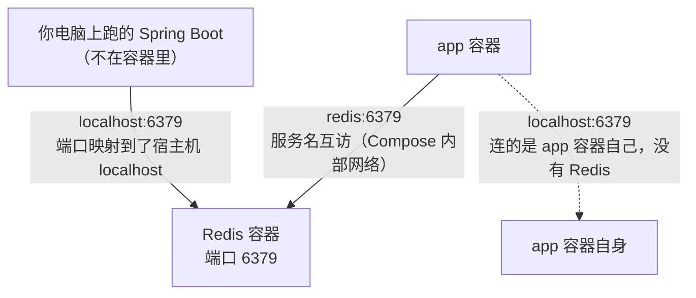

# Docker 与 Docker Compose 入门（给第一次跑示例的人）

> **配套文档**：本系列教程里大量用到 Docker——起 Redis、起 Kafka、起向量数据库、跑示例。但如果你从没接触过 Docker，看到一长串 `docker run -e KAFKA_NODE_ID=1 ...` 会直接懵。本篇从零讲清楚 Docker 是什么、常用命令、怎么用 `docker-compose.yml` 一次起一堆服务。**学完这篇，教程里的 docker 命令你全能看懂、能改、能排查问题。**
>
> **难度假设**：你装过软件、会用命令行，但没碰过 Docker，分不清"镜像"和"容器"。

---

## 第 1 章：Docker 是什么，解决什么问题

### 1.1 一个你一定遇过的痛苦

回想你装某个软件的经历（比如 MySQL）：

1. 去官网找对应操作系统的安装包。
2. 下载、配置环境变量、改配置文件。
3. 报错"端口被占用"。
4. 报错"依赖版本不对"。
5. 换台电脑，**全重来一遍**，可能又遇到不同的报错。

**Docker 解决的就是这个**：把"软件 + 它的运行环境 + 配置"打包成一个**标准化的盒子**（镜像）。你要用，只要一句命令把这个盒子"启动"起来，**不管在什么机器上，行为都一模一样**。

> 一句话：**Docker 让"在我电脑上能跑"这句话变成真的。**

### 1.2 核心概念：镜像 vs 容器（必须分清）

这是 Docker 最基础的两个词，分不清后面全乱。

| | 镜像（Image） | 容器（Container） |
|---|--------------|------------------|
| 类比 | **程序安装包/菜谱** | **运行起来的程序实例/做好的菜** |
| 状态 | 静态的、只读的 | 活的、正在运行的 |
| 可否同时多个 | 一个镜像只有一份 | 一个镜像可以**启动多个容器实例** |
| 命令 | `docker pull`/`docker images` | `docker run`/`docker ps` |

**比喻**：镜像是"菜谱"（红烧肉的做法），容器是"按菜谱做出来、正在桌上的一盘红烧肉"。一份菜谱可以做出很多盘菜（一个镜像启动多个容器）。

```
镜像 redis:7  ──docker run──→  容器A（正在跑的 Redis，端口 6379）
              ──docker run──→  容器B（另一个 Redis，端口 6380）
```

### 1.3 和虚拟机的区别（顺带理解）

虚拟机是**整套操作系统**（带内核），重、慢、占资源。
Docker 容器**共享宿主机内核**，只是隔离了进程和文件系统，**轻量、秒级启动**。可以理解成"轻量版的虚拟机"，但原理不同。

---

## 第 2 章：装好 Docker，跑第一个容器

### 2.1 安装

- **Mac / Windows**：装 **Docker Desktop**（官网下载，图形界面，自带命令行）。
- **Linux**：按官方文档装 Docker Engine。

装完命令行验证：

```bash
docker --version        # 看到 Docker version ... 就成功了
docker info             # 看到一堆信息说明 Docker 守护进程在跑
```

> Mac/Windows 用户：必须**打开 Docker Desktop 应用**，Docker 才在后台跑着。命令行报 "Cannot connect to the Docker daemon" 通常是没打开 Docker Desktop。

### 2.2 跑第一个容器：Redis

教程里起 Redis 的标准命令长这样：

```bash
docker run -d --name myredis -p 6379:6379 redis:7
```

**逐个参数解释**（这是本篇最重要的部分）：

| 参数 | 含义 |
|------|------|
| `docker run` | 启动一个容器 |
| `-d` | **detach**，后台运行（不占住当前终端） |
| `--name myredis` | 给容器起个名字叫 `myredis`（不写的话 Docker 随机起名） |
| `-p 6379:6379` | **端口映射**：宿主机端口:容器端口。把容器内的 6379 映射到你电脑的 6379 |
| `redis:7` | 用哪个**镜像**（`镜像名:标签`，标签是版本号） |

**端口映射 `-p` 最该理解**：容器里的 Redis 默认监听 6379 端口，但容器是隔离的，你电脑（宿主机）默认**访问不到**容器的 6379。`-p 6379:6379` 就是"在你电脑的 6379 端口开个口子，转发到容器里的 6379"。这样你电脑上 `redis-cli` 连 `localhost:6379` 就连到了容器里的 Redis。

> **为什么教程里 Kafka 用 `-p 9092:9092`**：一样的道理，把容器里 Kafka 的 9092 端口映射到你电脑的 9092。

**端口映射 -p 的原理**：



### 2.3 第一次启动会发生什么：自动拉镜像

`docker run redis:7` 如果你本地没有 `redis:7` 这个镜像，Docker 会**自动去仓库拉取**（pull），拉完再启动。第一次会看到一堆下载进度，正常现象。

镜像仓库默认是 **Docker Hub**（hub.docker.com），类似"应用商店"。你可以 `docker pull 镜像名` 单独拉镜像而不启动。

---

## 第 3 章：日常五条命令（记住这些就够用）

### 3.1 查看在跑的容器

```bash
docker ps              # 只看正在运行的容器
docker ps -a           # -a = all，包括已停止的容器
```

输出有 CONTAINER ID、IMAGE、STATUS（Up / Exited）、PORTS、NAMES 等列。

### 3.2 停止 / 启动 / 重启容器

```bash
docker stop myredis    # 停止（容器还在，只是不跑了）
docker start myredis   # 再次启动（不用重新 run）
docker restart myredis # 重启
```

> **stop 后数据还在吗？** 看**有没有挂载数据卷**（见第 5 章）。没挂卷的话，删容器（`docker rm`）数据就没了；只是 stop 不删，数据还在。

### 3.3 删除容器

```bash
docker rm myredis              # 删除已停止的容器
docker rm -f myredis           # -f 强制删（还在跑也能删）
```

> **注意**：删容器 ≠ 删镜像。删了容器，镜像还在，下次还能 `run`。

### 3.4 进容器里看（调试神器）

```bash
docker exec -it myredis sh        # 进容器的 shell（有的镜像用 bash）
docker exec -it myredis redis-cli # 直接进 Redis 命令行
```

| 参数 | 含义 |
|------|------|
| `exec` | 在正在运行的容器里执行命令 |
| `-it` | `-i` 保持输入 + `-t` 分配终端（合起来 = 交互式） |

教程里 `docker exec -it kafka kafka-console-producer ...` 就是"进 Kafka 容器，跑一个生产者命令行"。

### 3.5 看容器日志

```bash
docker logs myredis              # 看全部日志
docker logs -f myredis           # -f = follow，实时滚动（像 tail -f）
docker logs --tail 100 myredis   # 只看最后 100 行
```

**容器跑不起来、行为异常，第一步永远是 `docker logs` 看日志。**

### 3.6 其他常用

```bash
docker images              # 列出本地所有镜像
docker rmi redis:7         # 删除镜像（删前要先删掉用它的容器）
docker pull mysql:8        # 单纯拉镜像不启动
```

**容器生命周期与常用命令**：



---

## 第 4 章：环境变量（`-e`）——配置容器

教程里 Kafka 的命令有一大串 `-e`：

```bash
docker run -d --name kafka -p 9092:9092 \
  -e KAFKA_NODE_ID=1 \
  -e KAFKA_PROCESS_ROLES=broker,controller \
  -e KAFKA_LISTENERS=PLAINTEXT://:9092 \
  confluentinc/cp-kafka:latest
```

**`-e 变量名=值` 就是给容器传环境变量**。镜像作者预设了一堆"可配置项"，你通过 `-e` 告诉它怎么配。

比如 Kafka 镜像预设了 `KAFKA_NODE_ID`（节点编号）、`KAFKA_LISTENERS`（监听地址）等，你用 `-e` 设定它们。**具体有哪些可配项，查镜像的文档**（Docker Hub 页面会写）。

> **不必死记这些变量名**。教程给什么就照抄什么。出问题了再去镜像文档查那个变量的含义。本系列附录的 [Kafka核心概念](../Kafka消息队列实战专题/01-Kafka消息队列从入门到架构师.md) 第 5 章那串命令就是这种写法。

---

## 第 5 章：数据持久化——别让数据随容器消失

### 5.1 问题：容器删了，数据没了

容器是"临时的"——你 `docker rm` 删掉它，**容器里的文件全没了**。比如 Redis 容器删了，里面的数据全没了。这对数据库是灾难。

### 5.2 解决：挂载数据卷（Volume / Bind Mount）

把容器里的某个目录，**映射到你电脑上的真实目录**。这样数据存在你电脑硬盘上，容器删了重建，数据还在。

```bash
docker run -d --name myredis -p 6379:6379 \
  -v redis-data:/data \
  redis:7
```

| 参数 | 含义 |
|------|------|
| `-v redis-data:/data` | 把 Docker 管理的数据卷 `redis-data` 挂载到容器内 `/data` 目录 |

- `-v 卷名:容器内路径`：用 Docker 管理的命名卷（Docker 帮你存在一个固定位置）。
- `-v /你电脑的路径:容器内路径`：bind mount，直接指向你电脑上的某个目录（开发时方便看数据）。

```bash
# bind mount：把容器 /data 指向你电脑的 ~/redis-data，能直接在文件夹里看到数据文件
docker run -d --name myredis -v ~/redis-data:/data redis:7
```

> **教程里数据库类容器，建议养成习惯加 `-v` 挂卷**，否则删容器等于丢数据。

**挂卷 vs 不挂卷**：



---

## 第 6 章：Docker Compose——一次起一堆服务

### 6.1 为什么需要 Compose

教程很多示例要同时起**多个服务**（比如应用 + Redis + Kafka + 向量库）。用 `docker run` 要敲好几条又长又乱的命令，记不住、难维护。

**Docker Compose** 用一个 `docker-compose.yml` 文件，把"要起哪些服务、各自什么配置、怎么互连"全写清楚，**一条命令 `docker compose up` 全部起好**。

### 6.2 一个完整例子：应用 + Redis + Kafka

新建 `docker-compose.yml`：

```yaml
services:
  redis:                          # 服务1：Redis
    image: redis:7                # 用哪个镜像
    ports:
      - "6379:6379"               # 端口映射（等价 -p 6379:6379）
    volumes:
      - redis-data:/data          # 挂卷（等价 -v）

  kafka:                          # 服务2：Kafka
    image: confluentinc/cp-kafka:latest
    ports:
      - "9092:9092"
    environment:                  # 环境变量（等价 -e）
      KAFKA_NODE_ID: 1
      KAFKA_PROCESS_ROLES: broker,controller
      KAFKA_LISTENERS: PLAINTEXT://:9092
      KAFKA_ADVERTISED_LISTENERS: PLAINTEXT://localhost:9092
      KAFKA_CONTROLLER_QUORUM_VOTERS: 1@localhost:9092
      KAFKA_INTER_BROKER_LISTENER_NAME: PLAINTEXT
      CLUSTER_ID: MkU3OEVBNTcwNTJENDlENk

  app:                            # 服务3：你自己的应用（可选）
    build: .                      # 从当前目录的 Dockerfile 构建
    ports:
      - "8080:8080"
    depends_on:                   # 依赖：先起 redis 和 kafka 再起 app
      - redis
      - kafka

volumes:                          # 声明用到的命名卷
  redis-data:
```

### 6.3 yml 字段 ↔ docker run 参数 对照

| `docker run` 参数 | `docker-compose.yml` 字段 |
|-------------------|--------------------------|
| `镜像名` | `image: 镜像名` |
| `-d` | （`up` 默认加 `-d` 后台；不加则前台看日志） |
| `--name xxx` | 服务名 `xxx:`（服务名即容器名一部分） |
| `-p 6379:6379` | `ports: - "6379:6379"` |
| `-e KEY=VAL` | `environment: KEY: VAL` |
| `-v 卷:路径` | `volumes: - 卷:路径` |

**所以看 yml 就是把命令行参数写成结构化文件**，一一对应。

### 6.4 Compose 命令

在 `docker-compose.yml` 所在目录运行：

```bash
docker compose up -d        # 启动所有服务（-d 后台）
docker compose up -d redis  # 只起 redis 这一个服务
docker compose ps           # 看 compose 管理的容器状态
docker compose logs -f kafka # 看 kafka 日志（实时）
docker compose stop         # 停止所有服务（容器保留，可再 start）
docker compose down         # 停止并删除容器（卷默认保留，数据不丢）
docker compose down -v      # 连数据卷一起删（数据也没了，慎用）
```

> **`down` vs `stop`**：`stop` 只是暂停（容器还在，能再 `start`）；`down` 是停止并删除容器（要重新 `up` 才能恢复，但数据卷默认还在）。

---

## 第 7 章：服务间怎么互相访问（容器网络）

### 7.1 在容器里 vs 在容器外，地址不同

这是初学者高频困惑点：

- **你从电脑（宿主机）访问容器里的服务**：用 `localhost:端口`（因为 `-p` 映射到了 localhost）。
- **容器之间互相访问**：用**服务名**，不是 localhost！

### 7.2 例子

在 `docker-compose.yml` 里，你的 `app` 服务要连 Redis：

```yaml
app:
  environment:
    SPRING_REDIS_HOST: redis    # ← 用服务名 redis，不是 localhost！
    SPRING_REDIS_PORT: 6379
```

**为什么不是 localhost**：每个容器有自己的 `localhost`，`app` 容器的 `localhost` 是它自己，不是 Redis 容器。Compose 自动建了一个内部网络，**服务之间用服务名当主机名互访**。

- `app` 容器里 `redis:6379` → 连到 Redis 容器 ✅
- `app` 容器里 `localhost:6379` → 连的是自己（没有 Redis）❌

> **你电脑上跑的 Spring Boot（不在容器里）要连容器里的 Redis**：用 `localhost:6379`（因为端口映射到了 localhost）。**只有"容器连容器"才用服务名。**

**容器网络访问**：



---

## 第 8 章：常见坑

### 坑 1：端口被占用

```
Bind for 0.0.0.0:6379 failed: port is already allocated
```

**原因**：你电脑上已经有个程序占了 6379（可能是之前起的容器没停，或本地装过 Redis）。
**解决**：`docker ps` 看是不是有旧容器占着，`docker stop` 它；或换端口 `-p 6380:6379`（用 6380 访问）。

### 坑 2："Cannot connect to the Docker daemon"

**原因**：Docker 守护进程没在跑。
**解决**：打开 Docker Desktop（Mac/Windows）；Linux 上 `sudo systemctl start docker`。

### 坑 3：容器一启动就退出（Exited）

**解决**：`docker logs 容器名` 看报错。常见原因：配置错误、端口冲突、命令写错。容器内的前台进程结束了容器就退出——`-d` 后台跑的服务型镜像（redis/kafka）会一直占着前台不退出。

### 坑 4：删了容器数据没了

见第 5 章。**解决**：重要数据挂卷 `-v`。

### 坑 5：改了配置不知道怎么生效

容器配置在 `run` 时固定。改配置的两种方式：
- **重新 `docker run`**（删旧容器，用新参数跑）。
- **用 Compose**：改 yml 后 `docker compose up -d`（会自动重建变化的容器）。

### 坑 6：磁盘被镜像/容器塞满

```bash
docker system df            # 看磁盘占用
docker system prune -a      # 清理无用镜像、停止的容器、悬空卷（-a 连未使用的镜像也删）
```

**慎用 prune**，确认没有要保留的再清。

---

## 总结

- **Docker 是什么**：把"软件+环境+配置"打包成标准化镜像，一句命令启动，处处一致。
- **镜像 vs 容器**：镜像是静态菜谱，容器是运行实例。
- **核心命令**：`run`（起）、`ps`（查）、`stop/start/rm`（停启删）、`exec`（进）、`logs`（日志）、`pull`（拉镜像）。
- **关键参数**：`-d`（后台）、`-p`（端口映射）、`-v`（挂卷持久化）、`-e`（环境变量）、`--name`（命名）。
- **Docker Compose**：用 `docker-compose.yml` 描述多个服务，`docker compose up -d` 一键全起。
- **容器互访用服务名**，外部访问容器用 `localhost:端口`。

学完本篇，教程里所有 `docker run`、`docker-compose.yml` 你都能看懂、能改。遇到 Redis/Kafka/向量库的启动命令，照着本篇逐个参数对照即可。
