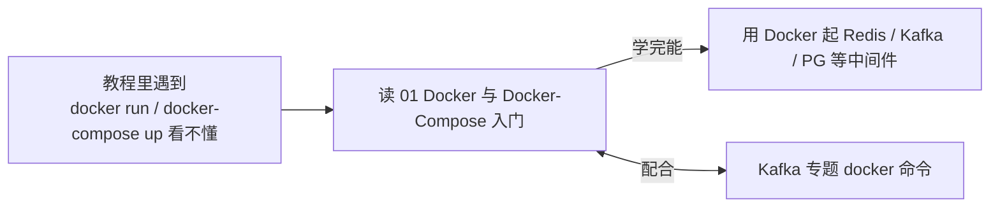

# Docker 与工具（学习顺序）

本文件夹收录 **环境与工具类** 文档，帮你把教程里依赖的中间件跑起来。

| 顺序 | 文档 | 你将学到 |
|:---:|------|---------|
| **01** | Docker 与 Docker-Compose 入门 | 用 Docker 起 Redis/Kafka/PG 等中间件——跑通教程的环境基础 |

**学习路线**：

> **何时读**：教程里遇到 `docker run ...` / `docker-compose up` 看不懂时，回来补这一篇。配合 Kafka 专题里的 docker 命令一起看。
