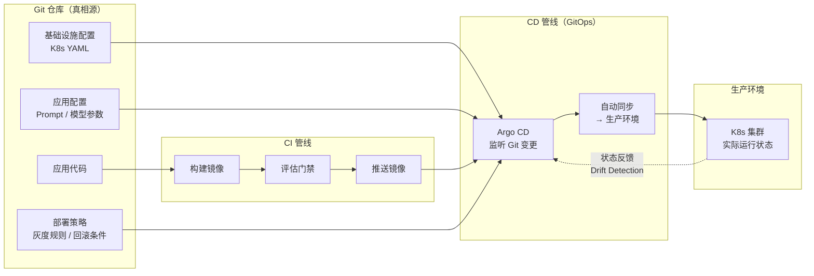
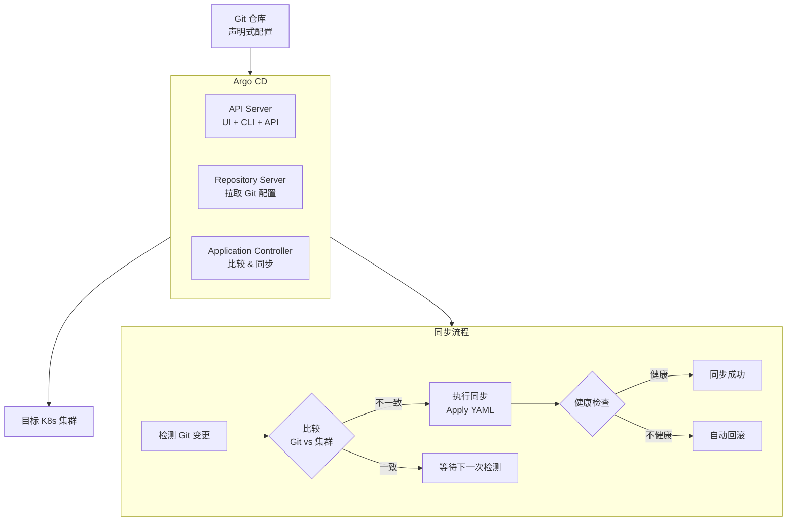
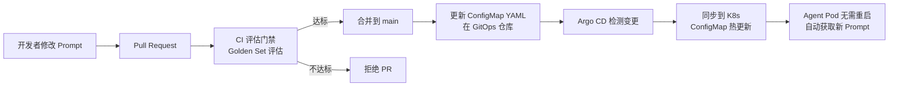
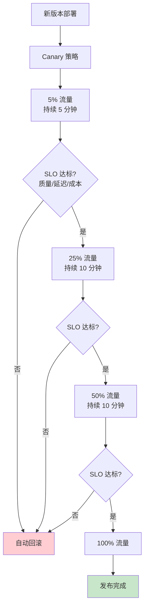

# 附录：GitOps 与 Argo CD 速成

> 这不是主线文档。当你在 Agent CI/CD 和部署管理时卡壳时，回来查阅。

---

## 什么是 GitOps

GitOps 是**以 Git 仓库为唯一真相源（Single Source of Truth）**的部署运维方法论——你把基础设施配置、应用配置、部署清单全部存入 Git，由自动化工具确保实际环境与 Git 声明的状态一致。



---

## GitOps vs 传统 CI/CD

| 维度 | 传统 CI/CD | GitOps |
|------|-----------|--------|
| 部署触发 | CI 管线直接 `kubectl apply` | Git 变更触发 Argo CD 同步 |
| 真相源 | 集群实际状态 | Git 仓库声明状态 |
| 回滚 | 手动重新部署 | `git revert` 自动回滚 |
| 审计 | CI 日志 | Git 历史（天然审计日志） |
| 配置漂移 | 难检测 | Argo CD 自动检测并修复 |
| 权限 | CI 需要 K8s 凭证 | CI 不需要集群访问权限 |

---

## Argo CD 架构



---

## Agent 应用的 GitOps 实践

### Prompt 版本管理



### 目录结构

```
gitops-repo/
├── apps/
│   ├── agent-service/
│   │   ├── base/                    # 基础配置
│   │   │   ├── deployment.yaml
│   │   │   ├── service.yaml
│   │   │   ├── configmap.yaml       # Prompt 模板
│   │   │   └── kustomization.yaml
│   │   └── overlays/                # 环境差异
│   │       ├── staging/             # 预发环境
│   │       │   ├── configmap-patch.yaml
│   │       │   └── kustomization.yaml
│   │       └── production/          # 生产环境
│   │           ├── configmap-patch.yaml
│   │           └── kustomization.yaml
│   └── rag-service/
├── infra/                           # 基础设施
│   ├── redis/
│   ├── qdrant/
│   └── postgres/
└── policies/                        # 部署策略
    ├── sync-policy.yaml             # 自动同步规则
    └── rollback-policy.yaml         # 回滚规则
```

### Argo CD Application 定义

```yaml
apiVersion: argoproj.io/v1alpha1
kind: Application
metadata:
  name: agent-service
spec:
  source:
    repoURL: https://github.com/company/agent-gitops
    path: apps/agent-service/overlays/production
    targetRevision: main
  destination:
    server: https://kubernetes.default.svc
    namespace: production
  syncPolicy:
    automated:
      prune: true           # 删除 Git 中已删除的资源
      selfHeal: true        # 自动修复配置漂移
    syncOptions:
    - CreateNamespace=true
    # Agent 专属：渐进式同步
  strategy:
    type: RollingSync        # 滚动同步而非一次性全量
```

---

## 灰度发布与 Argo Rollouts



### Argo Rollouts 定义

```yaml
apiVersion: argoproj.io/v1alpha1
kind: Rollout
metadata:
  name: agent-service
spec:
  replicas: 10
  strategy:
    canary:
      steps:
      - setWeight: 5
      - pause: { duration: 5m }
      - setWeight: 25
      - pause: { duration: 10m }
      - setWeight: 50
      - pause: { duration: 10m }
      - setWeight: 100
      analysis:              # 自动分析 SLO
        templates:
        - templateName: agent-slo-check
```

---

## 常用命令

```bash
# Argo CD CLI
argocd app create agent-service \
  --repo https://github.com/company/agent-gitops \
  --path apps/agent-service/overlays/production \
  --dest-server https://kubernetes.default.svc \
  --dest-namespace production

argocd app sync agent-service         # 手动触发同步
argocd app history agent-service      # 查看部署历史
argocd app rollback agent-service <id> # 回滚到历史版本
argocd app diff agent-service         # 查看 Git vs 集群差异
```

---

## 相关文档

- [阶段4-生产化/06-LLMOps与CICD](../阶段4-生产化/06-LLMOps与CICD.md)
- [阶段4-生产化/09-Agent配置中心](../阶段4-生产化/09-Agent配置中心.md)
- [阶段4-生产化/23-Agent版本兼容性管理](../阶段4-生产化/23-Agent版本兼容性管理.md)
- [附录/Docker与Kubernetes速成](Docker与Kubernetes速成.md)
