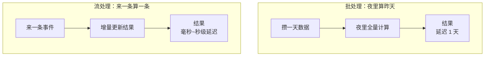
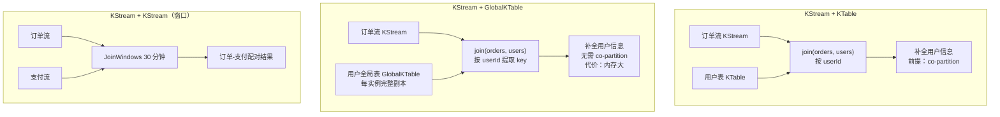
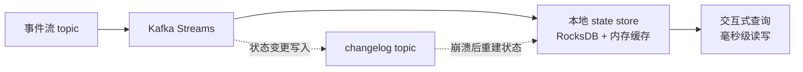
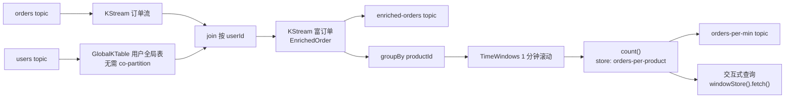
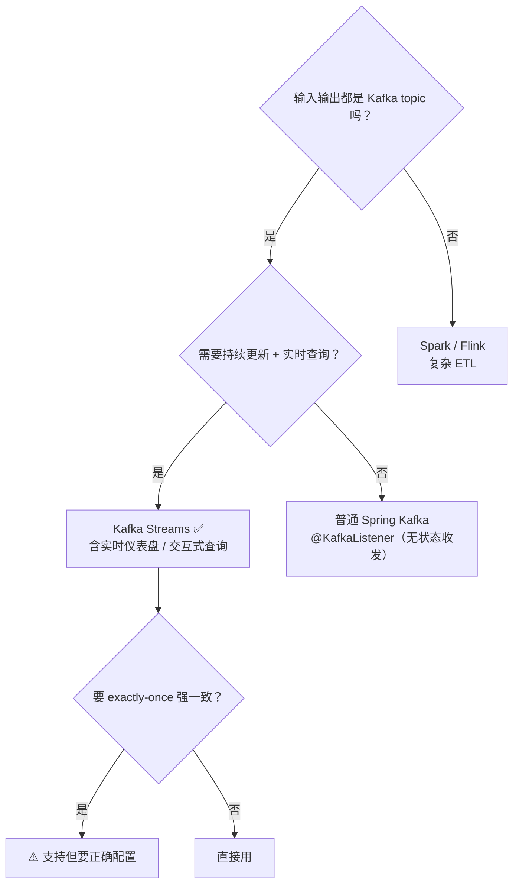

# Kafka Streams 流处理实战（从批处理到实时计算）

> **这份文档是什么**：一篇**独立专题**，讲 **Kafka Streams**——在消息流上做**有状态的实时计算**。它是 Kafka 自带的流处理库，spring-kafka 原生支持它（`@EnableKafkaStreams` + `StreamsBuilder`），**不需要任何 Stream Binder**，直接用 Kafka Streams DSL 写拓扑。
>
> **写给谁**：读完了 [Kafka 进阶实战第 3 章](../Kafka消息队列实战专题/02-Kafka进阶实战.md)（Kafka Streams 词频统计）的人。那章是入门，这篇是**深度展开**——窗口、JOIN、状态存储、交互式查询。
>
> **和 Kafka 专题的关系**：Kafka 进阶实战第 3 章只讲了 Kafka Streams 的"hello world"（词频）。真正用 Kafka Streams 做实时计算（每分钟订单量、流 JOIN、会话统计），需要这篇。本篇用**原生 Kafka Streams DSL**（spring-kafka 直接托管），是第 3 章的深化。
>
> **版本前提（已校验）**：Spring Boot **4.1.0**（父工程，BOM 托管所有依赖版本）+ `spring-boot-starter-kafka` + `org.apache.kafka:kafka-streams` + Kafka。窗口/JOIN/交互式查询 API 对照 [Kafka 官方 Streams DSL](https://kafka.apache.org/41/streams/developer-guide/dsl-api.html) 校验。

---

## 目录

- [第 1 章：为什么需要流处理——批处理 vs 流处理](#-第-1-章为什么需要流处理批处理-vs-流处理)
- [第 2 章：窗口（Windowing）——把无限流切成有限块](#-第-2-章窗口windowing把无限流切成有限块)
- [第 3 章：JOIN——流与流的关联](#-第-3-章join流与流的关联)
- [第 4 章：状态存储与交互式查询](#-第-4-章状态存储与交互式查询)
- [第 5 章：实战——实时电商指标](#-第-5-章实战实时电商指标)
- [第 6 章：架构师取舍](#-第-6-章架构师取舍)

---

## 第 1 章：为什么需要流处理——批处理 vs 流处理

### 1.1 批处理的局限

传统数据分析：白天攒数据，**夜里跑一批**统计昨天的订单量、GMV、用户数。问题：

- **延迟一天**：白天出了异常（如订单暴跌），明天才知道。
- **数据量大扛不住**：每天重算全量，数据一多就慢。

### 1.2 流处理：来一条算一条

**流处理（Stream Processing）**：数据**一来就处理**，持续维护计算结果。订单一来就累加到"今日订单量"——任意时刻查都是最新的。

```
批处理：[攒一天数据] → [夜里全量算] → 结果（延迟1天）
流处理：[来一条] → [增量更新结果]（持续，毫秒~秒级延迟）
```

**批处理 vs 流处理**：



**例子**：
- 每分钟各商品订单量
- 实时用户画像（订单流 JOIN 用户流）
- 异常检测（同用户 1 秒内 10 单 → 欺诈告警）

### 1.3 为什么用 Kafka Streams 而不是 Spark/Flink

| 方案 | 特点 |
|------|------|
| **Kafka Streams** | 轻量库（不是独立集群），嵌在 Spring Boot 应用里。和 Kafka 原生集成。适合"输入输出都是 Kafka topic"的场景。 |
| **Spark Streaming / Flink** | 重（独立集群），功能更强（复杂窗口、exactly-once、批流统一）。适合大规模、复杂 ETL。 |

> **本篇选 Kafka Streams**：因为我们的数据源就是 Kafka（配合前面的 Kafka 消息队列专题），且它轻量、和 Spring Boot 天然集成。**输入输出是 Kafka topic 的流处理，Kafka Streams 是最直接的选择。**

### 1.4 工程依赖（原生 Kafka Streams）

Kafka Streams 就是 **Apache Kafka 自带的一个标准 Java 库**。Spring Boot 4.1.0 的 `spring-boot-starter-kafka` 自带 `spring-kafka`，它原生支持 Kafka Streams（`@EnableKafkaStreams` 自动装配 `KafkaStreams` + `StreamsBuilder`）。我们只需要**再加一个 `kafka-streams` 本体依赖**，不用引入任何 Spring Cloud Stream / Binder。

```xml
<parent>
    <groupId>org.springframework.boot</groupId>
    <artifactId>spring-boot-starter-parent</artifactId>
    <version>4.1.0</version>
    <relativePath/>
</parent>

<dependencies>
    <!-- spring-kafka：KafkaTemplate / @KafkaListener / Kafka Streams 支持（自带） -->
    <dependency>
        <groupId>org.springframework.boot</groupId>
        <artifactId>spring-boot-starter-kafka</artifactId>
    </dependency>

    <!-- Kafka Streams 本体（spring-boot-starter-kafka 不带它，需单独加） -->
    <!-- 版本由 Boot 4.1.0 的 BOM 托管，不写版本号 -->
    <dependency>
        <groupId>org.apache.kafka</groupId>
        <artifactId>kafka-streams</artifactId>
    </dependency>

    <!-- 交互式查询的 REST 接口用到（第 4/5 章） -->
    <dependency>
        <groupId>org.springframework.boot</groupId>
        <artifactId>spring-boot-starter-web</artifactId>
    </dependency>
</dependencies>
```

> **为什么不是 Spring Cloud Stream？** Kafka Streams 本身就是标准 Java 库，spring-kafka 直接托管它，没有 Binder/Binding/Destination 那层抽象。**原生写法的核心**：`@EnableKafkaStreams` 开启支持 → 注入 `StreamsBuilder` → `builder.stream("topic")` 建拓扑 → 返回 `KStream`/`KTable` Bean。yaml 里只剩 `spring.kafka.streams.application-id` 和 `spring.kafka.streams.properties.*`。**没有 `spring.cloud.function`、没有 `bindings`、没有函数式通道。**

> **版本注意**：Boot 4.1.0 需要 **JDK 17+**。Kafka 客户端与 Kafka 服务端需版本匹配（本专题用 Kafka 3.x）。

---

## 第 2 章：窗口（Windowing）——把无限流切成有限块

### 2.1 为什么要窗口

流是**无限的**（订单永远在产生）。无限数据没法直接聚合（"全部订单量"会无限增长）。**窗口**把无限流切成有限的时间块——"每 5 分钟一块"，每块单独聚合，结果有意义（"每 5 分钟的订单量"）。

### 2.2 四种窗口（对照 Kafka 官方校验）

| 窗口类型 | 特点 | 例子 |
|---------|------|------|
| **滚动（Tumbling）** | 固定大小、不重叠 | 每 5 分钟一块，5:00-5:05、5:05-5:10 |
| **跳跃（Hopping）** | 固定大小、按步长前进、可重叠 | 5 分钟窗口、每 1 分钟前进：5:00-5:05、5:01-5:06（重叠） |
| **滑动（Sliding）** | 以事件为中心、连续 | 每来一条事件，往前看 N 时间 |
| **会话（Session）** | 按活动间隙聚合，间隙大则切分会话 | 用户操作间隔 <30 分钟算同一会话 |

### 2.3 滚动窗口实战：每 5 分钟订单量

原生 DSL：`builder.stream("orders")` 读流 → `groupBy` 分组 → `windowedBy(TimeWindows...)` 加窗口 → `count()` 计数。

```java
import org.apache.kafka.common.serialization.Serdes;
import org.apache.kafka.streams.StreamsBuilder;
import org.apache.kafka.streams.kstream.Consumed;
import org.apache.kafka.streams.kstream.KStream;
import org.apache.kafka.streams.kstream.KTable;
import org.apache.kafka.streams.kstream.Produced;
import org.apache.kafka.streams.kstream.TimeWindows;
import org.apache.kafka.streams.kstream.Windowed;
import org.springframework.context.annotation.Bean;
import org.springframework.context.annotation.Configuration;
import org.springframework.kafka.annotation.EnableKafkaStreams;
import org.springframework.kafka.support.serializer.JsonSerde;
import java.time.Duration;

@Configuration
@EnableKafkaStreams          // ▼ 开启 Kafka Streams（spring-kafka 原生支持）
public class TumblingWindowTopology {

    // ▼ 注入 StreamsBuilder，在里面建拓扑；返回 KStream/KTable 会被注册进拓扑
    @Bean
    public KTable<Windowed<String>, Long> ordersPer5Min(StreamsBuilder builder) {
        // ① 从 orders topic 读订单流（key=订单id，value=Order JSON）
        KStream<String, Order> orders = builder.stream(
                "orders",
                Consumed.with(Serdes.String(), new JsonSerde<>(Order.class)));

        // ② 按 productId 分组（每个商品分别统计）
        KTable<Windowed<String>, Long> counts = orders
                .groupBy((key, order) -> order.getProductId())
                // ▼ 滚动窗口：5分钟一块，无宽限期（grace=0，超窗口就关闭）
                .windowedBy(TimeWindows.ofSizeWithNoGrace(Duration.ofMinutes(5)))
                .count();

        // ③ 结果写回 topic：Windowed key 转成商品 id（便于外部消费/验证）
        counts.toStream((windowedKey, count) -> windowedKey.key())
              .to("orders-per-5min", Produced.with(Serdes.String(), Serdes.Long()));

        return counts;
    }
}
```

**`Windowed<String>`**：窗口化后的 key 带了窗口信息（窗口起始时间），所以查询结果能知道"哪个商品、哪个 5 分钟段"。

> **原生 DSL 的关键区别（对比 Binder）**：topic 名直接在 `builder.stream("orders")` 里写，**没有 bindings 映射**；Serde 在 `Consumed.with(...)` 里显式指定——`new JsonSerde<>(Order.class)` 把目标类型写进反序列化器，普通 JSON（无类型头）也能解析。

**本章验证**：

```bash
# 往 orders 写订单（value 是 Order 的 JSON，无类型头也能被 JsonSerde 解析）
docker exec -it kafka kafka-console-producer --bootstrap-server localhost:9092 --topic orders
> {"productId":"p001","userId":"u001","amount":100}
> {"productId":"p002","userId":"u001","amount":50}

# 看每5分钟订单量（key=商品id，value=窗口计数）
docker exec -it kafka kafka-console-consumer --bootstrap-server localhost:9092 \
  --topic orders-per-5min --property print.key=true --from-beginning
# p001  1
# p002  1
```

### 2.4 会话窗口实战：用户会话统计

```java
import org.apache.kafka.common.serialization.Serdes;
import org.apache.kafka.streams.StreamsBuilder;
import org.apache.kafka.streams.kstream.Consumed;
import org.apache.kafka.streams.kstream.KStream;
import org.apache.kafka.streams.kstream.KTable;
import org.apache.kafka.streams.kstream.Produced;
import org.apache.kafka.streams.kstream.SessionWindows;
import org.apache.kafka.streams.kstream.Windowed;
import org.springframework.context.annotation.Bean;
import org.springframework.context.annotation.Configuration;
import org.springframework.kafka.annotation.EnableKafkaStreams;
import org.springframework.kafka.support.serializer.JsonSerde;
import java.time.Duration;

@Configuration
@EnableKafkaStreams
public class SessionWindowTopology {

    @Bean
    public KTable<Windowed<String>, Long> sessionStats(StreamsBuilder builder) {
        KStream<String, UserAction> actions = builder.stream(
                "user-actions",
                Consumed.with(Serdes.String(), new JsonSerde<>(UserAction.class)));

        KTable<Windowed<String>, Long> sessions = actions
                .groupBy((key, action) -> action.getUserId())
                // ▼ 会话窗口：同用户操作间隔 <30分钟算同一会话，超过则切分会话
                .windowedBy(SessionWindows.ofInactivityGapWithNoGrace(Duration.ofMinutes(30)))
                .count();   // 每个会话的操作数

        sessions.toStream((wk, count) -> wk.key())
                .to("user-sessions", Produced.with(Serdes.String(), Serdes.Long()));
        return sessions;
    }
}
```

**会话窗口的特殊性**：窗口大小不固定——用户活跃则窗口变长，停了 30 分钟则窗口关闭、开新会话。适合"分析用户行为模式"。

> **两个拓扑是并列的可选示例**，实际工程里选一个 `@Configuration` 类即可。`@EnableKafkaStreams` 在任一配置类上声明一次，全应用生效。

### 2.5 Grace（宽限期）——重要的窗口概念

窗口到点后，可能有**迟到的数据**（网络延迟，事件 5:04 生成但 5:07 才到）。默认窗口到点就关，迟到数据丢弃。**Grace** 给一段宽限期：

```java
// 窗口5分钟 + 1分钟宽限期：5:00-5:05的窗口，容忍迟到数据到5:06
TimeWindows.ofSizeAndGrace(Duration.ofMinutes(5), Duration.ofMinutes(1));
```

> **Grace 是窗口的"迟到容忍"**。延迟敏感用小 grace，正确性敏感用大 grace。`ofSizeWithNoGrace` = 不容忍迟到（吞吐优先）。会话窗口同理有 `ofInactivityGapAndGrace(...)`。

---

## 第 3 章：JOIN——流与流的关联

### 3.1 三种 JOIN（对照官方校验）

| JOIN | 用途 |
|------|------|
| **KStream + KTable** | 流 + 表（如订单流 JOIN 用户表，给订单补用户信息） |
| **KStream + GlobalKTable** | 流 + 全局表（每个实例有完整副本，无需 co-partition） |
| **KStream + KStream（windowed）** | 流 + 流（两个流在时间窗口内的关联，如订单流 JOIN 支付流） |

**三种 JOIN 的拓扑**：



### 3.2 KStream + KTable：给订单补用户信息

场景：订单流（只有 userId）要 JOIN 用户表（userId → 用户信息），输出带完整用户信息的订单。

```java
import org.apache.kafka.common.serialization.Serdes;
import org.apache.kafka.streams.StreamsBuilder;
import org.apache.kafka.streams.kstream.Consumed;
import org.apache.kafka.streams.kstream.KStream;
import org.apache.kafka.streams.kstream.KTable;
import org.apache.kafka.streams.kstream.Produced;
import org.springframework.context.annotation.Bean;
import org.springframework.context.annotation.Configuration;
import org.springframework.kafka.annotation.EnableKafkaStreams;
import org.springframework.kafka.support.serializer.JsonSerde;

@Configuration
@EnableKafkaStreams
public class JoinTopology {

    @Bean
    public KStream<String, EnrichedOrder> enrichOrder(StreamsBuilder builder) {
        // 订单流
        KStream<String, Order> orders = builder.stream(
                "orders",
                Consumed.with(Serdes.String(), new JsonSerde<>(Order.class)));

        // ▼ 用户表：users topic 物化为 KTable（本地状态，持续更新）
        KTable<String, User> users = builder.table(
                "users",
                Consumed.with(Serdes.String(), new JsonSerde<>(User.class)));

        // ▼ 流 JOIN 表：用 userId 关联，给订单补上用户信息
        KStream<String, EnrichedOrder> enriched = orders.join(users,
                (order, user) -> new EnrichedOrder(order, user));

        enriched.to("enriched-orders",
                Produced.with(Serdes.String(), new JsonSerde<>(EnrichedOrder.class)));
        return enriched;
    }
}
```

**前提**：KStream 和 KTable 要 **co-partitioned**（按相同 key、相同分区数分区）。这里订单和用户都以 userId 为 key、分区数相同。

**本章验证**：

```bash
# 先写用户表（KTable 需要先有数据，JOIN 才能补上）
docker exec -it kafka kafka-console-producer --bootstrap-server localhost:9092 --topic users
> {"id":"u001","name":"Alice","level":"gold"}

# 再写订单
docker exec -it kafka kafka-console-producer --bootstrap-server localhost:9092 --topic orders
> {"productId":"p001","userId":"u001","amount":100}

# 看补全后的富订单
docker exec -it kafka kafka-console-consumer --bootstrap-server localhost:9092 \
  --topic enriched-orders --from-beginning
# {"productId":"p001","userId":"u001","amount":100,"name":"Alice","level":"gold"}
```

### 3.3 GlobalKTable：无需 co-partition 的查找式 JOIN

KStream+KTable 要求 co-partition（同 key 同分区），有时做不到（如用户表分区和订单表不同）。**GlobalKTable** 每个 Streams 实例都有**完整副本**，JOIN 时直接本地查找，不要求 co-partition：

```java
import org.apache.kafka.common.serialization.Serdes;
import org.apache.kafka.streams.StreamsBuilder;
import org.apache.kafka.streams.kstream.Consumed;
import org.apache.kafka.streams.kstream.GlobalKTable;
import org.apache.kafka.streams.kstream.KStream;
import org.apache.kafka.streams.kstream.Produced;
import org.springframework.context.annotation.Bean;
import org.springframework.context.annotation.Configuration;
import org.springframework.kafka.annotation.EnableKafkaStreams;
import org.springframework.kafka.support.serializer.JsonSerde;

@Configuration
@EnableKafkaStreams
public class GlobalJoinTopology {

    @Bean
    public KStream<String, EnrichedOrder> enrichGlobal(StreamsBuilder builder) {
        KStream<String, Order> orders = builder.stream(
                "orders",
                Consumed.with(Serdes.String(), new JsonSerde<>(Order.class)));

        // ▼ 全局表：users topic 每个 Streams 实例一份完整副本
        GlobalKTable<String, User> users = builder.globalTable(
                "users",
                Consumed.with(Serdes.String(), new JsonSerde<>(User.class)));

        KStream<String, EnrichedOrder> enriched = orders.join(users,
                (orderKey, order) -> order.getUserId(),   // ▼ 从订单里提取要 JOIN 的 key
                (order, user) -> new EnrichedOrder(order, user));

        enriched.to("enriched-orders",
                Produced.with(Serdes.String(), new JsonSerde<>(EnrichedOrder.class)));
        return enriched;
    }
}
```

**代价**：GlobalKTable 每实例全量数据，**内存/存储消耗大**。只用于小表（如配置表、字典表）的查找。

### 3.4 KStream + KStream（窗口 JOIN）：订单 JOIN 支付

场景：订单流和支付流，30 分钟内配对（订单 → 支付），找出"下了单但 30 分钟没支付"的订单。

```java
import org.apache.kafka.common.serialization.Serdes;
import org.apache.kafka.streams.StreamsBuilder;
import org.apache.kafka.streams.kstream.Consumed;
import org.apache.kafka.streams.kstream.JoinWindows;
import org.apache.kafka.streams.kstream.KStream;
import org.apache.kafka.streams.kstream.Produced;
import org.apache.kafka.streams.kstream.StreamJoined;
import org.springframework.context.annotation.Bean;
import org.springframework.context.annotation.Configuration;
import org.springframework.kafka.annotation.EnableKafkaStreams;
import org.springframework.kafka.support.serializer.JsonSerde;
import java.time.Duration;

@Configuration
@EnableKafkaStreams
public class OrderPaymentTopology {

    @Bean
    public KStream<String, OrderPayment> joinOrderPayment(StreamsBuilder builder) {
        KStream<String, Order> orders = builder.stream(
                "orders",
                Consumed.with(Serdes.String(), new JsonSerde<>(Order.class)));
        KStream<String, Payment> payments = builder.stream(
                "payments",
                Consumed.with(Serdes.String(), new JsonSerde<>(Payment.class)));

        // ▼ 流 JOIN 流，必须带窗口（流无界，要界定关联时间）
        KStream<String, OrderPayment> joined = orders.join(payments,
                (order, payment) -> new OrderPayment(order, payment),
                JoinWindows.ofTimeDifferenceWithNoGrace(Duration.ofMinutes(30)),  // 30分钟窗口内配对
                // ▼ 流JOIN流要暂存两侧事件做匹配（状态），必须显式给 Serde
                StreamJoined.with(Serdes.String(),
                        new JsonSerde<>(Order.class),
                        new JsonSerde<>(Payment.class)));

        joined.to("order-payments",
                Produced.with(Serdes.String(), new JsonSerde<>(OrderPayment.class)));
        return joined;
    }
}
```

> **流 JOIN 流必须带窗口**——因为流无界，不限定时间窗口关联结果会无限累积。`JoinWindows` 定义"两流事件时间差多少内算配对"。**流 JOIN 流还会产生中间状态**（暂存待配对的订单/支付），所以要比 KStream+KTable 多传一个 `StreamJoined.with(...)` 指定 Serde。

---

## 第 4 章：状态存储与交互式查询

### 4.1 State Store——流处理的状态住哪

前面 `count`/`aggregate`/`JOIN` 都产生**状态**（计数、表）。这些状态存在哪？**不是外部数据库，是 Streams 自带的本地状态存储（state store）**——默认用 RocksDB（磁盘）+ 内存缓存。

```
事件流 → Kafka Streams → [ 本地 state store (RocksDB) ]  ← 状态在这，毫秒级读写
```

好处：状态在本地，读写极快，不依赖外部 DB。崩溃后能从 Kafka changelog topic 重建（容错）。

**状态存储与容错**：



### 4.2 交互式查询（Interactive Queries）——直接查状态

State store 不只是中间产物——你可以**直接查它**（Kafka 进阶实战第 3 章提过）。比如统计后，直接查"某商品累计订单量"，不用另存数据库。

先建一个**非窗口**聚合（普通 KV store，方便演示最简单查询）：

```java
import org.apache.kafka.common.serialization.Serdes;
import org.apache.kafka.streams.StreamsBuilder;
import org.apache.kafka.streams.kstream.Consumed;
import org.apache.kafka.streams.kstream.KTable;
import org.apache.kafka.streams.kstream.Materialized;
import org.springframework.context.annotation.Bean;
import org.springframework.context.annotation.Configuration;
import org.springframework.kafka.annotation.EnableKafkaStreams;
import org.springframework.kafka.support.serializer.JsonSerde;

@Configuration
@EnableKafkaStreams
public class ProductTotalTopology {

    @Bean
    public KTable<String, Long> productTotal(StreamsBuilder builder) {
        return builder.<String, Order>stream(
                        "orders",
                        Consumed.with(Serdes.String(), new JsonSerde<>(Order.class)))
                .groupBy((key, order) -> order.getProductId())
                .count(Materialized.as("product-total"));   // ▼ 普通 KV store 名
    }
}
```

查它（spring-kafka 用 `KafkaStreamsInteractiveQueryService`，是对 `KafkaStreams.store()` 的封装）：

```java
import org.apache.kafka.streams.state.QueryableStoreTypes;
import org.apache.kafka.streams.state.ReadOnlyKeyValueStore;
import org.springframework.kafka.config.KafkaStreamsInteractiveQueryService;
import org.springframework.web.bind.annotation.GetMapping;
import org.springframework.web.bind.annotation.PathVariable;
import org.springframework.web.bind.annotation.RestController;

@RestController
public class QueryController {

    private final KafkaStreamsInteractiveQueryService iqService;

    public QueryController(KafkaStreamsInteractiveQueryService iqService) {
        this.iqService = iqService;
    }

    @GetMapping("/count/{productId}")
    public Long getCount(@PathVariable String productId) {
        // ▼ 直接查本地 state store（不用查外部 DB！）
        ReadOnlyKeyValueStore<String, Long> store = iqService.getQueryableStore(
                "product-total",
                QueryableStoreTypes.keyValueStore());
        Long count = store.get(productId);
        return count == null ? 0L : count;
    }
}
```

**这就是流处理的杀手锏**：实时计算的结果存在本地，查询毫秒级——天然适合"实时仪表盘"。

**本章验证**：

```bash
docker exec -it kafka kafka-console-producer --bootstrap-server localhost:9092 --topic orders
> {"productId":"p001","userId":"u001","amount":100}
> {"productId":"p001","userId":"u001","amount":50}

curl http://localhost:8080/count/p001
# 2
```

### 4.3 多实例查询的坑

State store 是**分片**的——每个 Streams 实例只持有部分分区的状态。如果某 productId 的状态在实例 A，但请求打到实例 B，B 查不到。

**解法**：先问 Streams"这个 key 的状态在哪个实例"，是本机就查，不是就转发请求：

```java
import org.apache.kafka.streams.KeyQueryMetadata;
import org.apache.kafka.streams.state.HostInfo;

KafkaStreams streams = iqService.getKafkaStreams();   // 拿到底层 KafkaStreams

// ▼ 查 productId 状态落在哪个实例（RPC 元数据）
KeyQueryMetadata metadata = streams.queryMetadataForKey(
        "product-total", productId, Serdes.String().serializer());
HostInfo owner = metadata.activeHost();

if (owner.equals(localHostInfo)) {
    // 本机：直接查 store（见 4.2）
} else {
    // 别的实例：把请求转发到 owner 的 REST 查询接口（或用 RPC）
}
```

这是多实例 Streams 查询的标准处理。单机演示直接查即可。

---

## 第 5 章：实战——实时电商指标

把前面串起来：实时计算"每分钟各商品订单量"+"订单补用户信息"+"查询接口"。

### 5.1 完整拓扑

原生 DSL 把整个拓扑写在一个 `@Bean` 方法里：`builder.stream` 建流 → `builder.globalTable` 建全局表 → JOIN → 窗口计数 → `to()` 写回 topic。

```java
import org.apache.kafka.common.serialization.Serdes;
import org.apache.kafka.streams.StreamsBuilder;
import org.apache.kafka.streams.kstream.*;
import org.springframework.context.annotation.Bean;
import org.springframework.context.annotation.Configuration;
import org.springframework.kafka.annotation.EnableKafkaStreams;
import org.springframework.kafka.support.serializer.JsonSerde;
import java.time.Duration;

@Configuration
@EnableKafkaStreams
public class RealtimeMetrics {

    @Bean
    public KTable<Windowed<String>, Long> ordersPerMin(StreamsBuilder builder) {
        // ① 订单流：orders topic（key=订单id，value=Order JSON）
        KStream<String, Order> orders = builder.stream(
                "orders",
                Consumed.with(Serdes.String(), new JsonSerde<>(Order.class)));

        // ② 用户 GlobalKTable：users topic 全量副本，无需 co-partition
        GlobalKTable<String, User> users = builder.globalTable(
                "users",
                Consumed.with(Serdes.String(), new JsonSerde<>(User.class)));

        // ③ 订单流 JOIN 用户全局表：补全用户信息（订单 → 富订单）
        KStream<String, EnrichedOrder> enriched = orders.join(users,
                (orderKey, order) -> order.getUserId(),   // 从订单提取 JOIN key
                (order, user) -> new EnrichedOrder(order, user));

        // ④ 富订单写回 enriched-orders topic（外部消费者可用）
        enriched.to("enriched-orders",
                Produced.with(Serdes.String(), new JsonSerde<>(EnrichedOrder.class)));

        // ⑤ 每分钟各商品订单量（滚动窗口），state store 名 orders-per-product
        KTable<Windowed<String>, Long> perMin = enriched
                .groupBy((key, e) -> e.getProductId())
                .windowedBy(TimeWindows.ofSizeWithNoGrace(Duration.ofMinutes(1)))
                .count(Materialized.as("orders-per-product"));   // ▼ store 名，供交互查询

        // ⑥ 结果写回 orders-per-min topic（key 转成商品 id，便于消费/验证）
        perMin.toStream((windowedKey, count) -> windowedKey.key())
              .to("orders-per-min", Produced.with(Serdes.String(), Serdes.Long()));

        return perMin;
    }
}
```

> **原生 DSL 里"多个算子怎么串联"**：所有东西都发生在同一个 `StreamsBuilder` 里——`builder.stream` 的返回值往下流，最后 `return` 的 `KTable`/`KStream` 会被 spring-kafka 注册进拓扑。**不再有 Binder 的"多个 Function Bean + 通道拼接"**，一个方法就是一条完整的处理管道。

**完整拓扑**：



### 5.2 配置

```yaml
spring:
  kafka:
    bootstrap-servers: localhost:9092
    streams:
      application-id: realtime-metrics-app   # ▼ 必配：兼作消费组名 & changelog topic 前缀
      properties:
        default.key.serde: org.apache.kafka.common.serialization.Serdes$StringSerde
        default.value.serde: org.springframework.kafka.support.serializer.JsonSerde
        state.dir: /tmp/kafka-streams        # ▼ 可选：state store 落盘目录
        num.stream.threads: 2                # ▼ 可选：Streams 线程数（分区多时调大）
        commit.interval.ms: 3000             # ▼ 可选：状态/进度提交间隔
```

**几个必须懂的点**：
- `application-id`：Kafka Streams 的应用标识。**它兼做消费组名**（Streams 内部用 application.id 当 group.id）。不同 Streams 应用要不同 application-id。
- `default.key.serde` / `default.value.serde`：默认 Serde。**原生 DSL 建议在代码里显式指定**（`Consumed.with(...)` / `new JsonSerde<>(Xxx.class)`），yaml 默认值只对没显式指定的地方生效。
- **输入输出 topic 不再在 yaml 里配置**——没有 `bindings` 了。`builder.stream("orders")` / `builder.globalTable("users")` / `.to("orders-per-min")` 里的字符串就是**真实 topic 名**，全在代码里。
- 对比旧 Binder 写法：`spring.cloud.stream.kafka.streams.binder.configuration` → `spring.kafka.streams.properties`；`application-id` 从 binder 挪到 `spring.kafka.streams.application-id`。

### 5.3 查询接口

`orders-per-product` 是**窗口聚合**产生的 store——它是 **WindowStore**，不是普通 KV store，查询类型要用 `windowStore()`，用 `fetch(key, from, to)` 按时间范围查：

```java
import org.apache.kafka.streams.state.QueryableStoreTypes;
import org.apache.kafka.streams.state.ReadOnlyWindowStore;
import org.apache.kafka.streams.state.WindowStoreIterator;
import org.springframework.kafka.config.KafkaStreamsInteractiveQueryService;
import org.springframework.web.bind.annotation.GetMapping;
import org.springframework.web.bind.annotation.PathVariable;
import org.springframework.web.bind.annotation.RestController;
import java.time.Duration;
import java.time.Instant;

@RestController
public class RealtimeMetricsController {

    private final KafkaStreamsInteractiveQueryService iqService;

    public RealtimeMetricsController(KafkaStreamsInteractiveQueryService iqService) {
        this.iqService = iqService;
    }

    /** 查"当前 1 分钟窗口该商品订单量" */
    @GetMapping("/orders-per-min/{productId}")
    public Long getOrdersPerMin(@PathVariable String productId) {
        // ▼ 窗口聚合产生的 store 是 WindowStore，查询类型要用 windowStore()！
        ReadOnlyWindowStore<String, Long> store = iqService.getQueryableStore(
                "orders-per-product",
                QueryableStoreTypes.windowStore());

        // ▼ WindowStore 用 fetch(key, from, to) 按时间范围查
        long now = System.currentTimeMillis();
        try (WindowStoreIterator<Long> it = store.fetch(
                productId,
                Instant.ofEpochMilli(now - Duration.ofMinutes(1).toMillis()),
                Instant.ofEpochMilli(now))) {
            return it.hasNext() ? it.next().value : 0L;   // 当前 1 分钟窗口的计数
        }
    }
}
```

> **坑提醒**：窗口聚合的 store 是 `WindowStore`，**不是**普通 `KeyValueStore`——用 `QueryableStoreTypes.keyValueStore()` 去查会抛 `InvalidStateStoreException`。这就是 4.2 与 5.3 用了两种查询类型的区别。

**本章验证**：

```bash
# ① 准备用户全局表（先写，供 JOIN 补信息）
docker exec -it kafka kafka-console-producer --bootstrap-server localhost:9092 --topic users
> {"id":"u001","name":"Alice","level":"gold"}

# ② 写订单
docker exec -it kafka kafka-console-producer --bootstrap-server localhost:9092 --topic orders
> {"productId":"p001","userId":"u001","amount":100}
> {"productId":"p001","userId":"u001","amount":50}

# ③ 看补全后的富订单
docker exec -it kafka kafka-console-consumer --bootstrap-server localhost:9092 \
  --topic enriched-orders --from-beginning
# {"productId":"p001","userId":"u001","amount":100,"name":"Alice","level":"gold"}

# ④ 看每分钟订单量（key=商品id，value=窗口计数）
docker exec -it kafka kafka-console-consumer --bootstrap-server localhost:9092 \
  --topic orders-per-min --property print.key=true --from-beginning
# p001  1
# p001  2

# ⑤ 查询接口：秒级更新的实时订单量
curl http://localhost:8080/orders-per-min/p001
# 2
```

---

## 第 6 章：架构师取舍

### 6.1 Kafka Streams 的价值

- **实时**：来一条算一条，毫秒~秒级延迟。
- **状态本地化**：RocksDB 本地状态，快且可查询。
- **轻量**：嵌在 Spring Boot 里，不用独立集群。
- **容错**：状态从 Kafka changelog 重建。

### 6.2 代价

1. **复杂度**：窗口/JOIN/state store 概念多，学习陡。
2. **调试难**：流处理出错定位比批处理难（数据在流动）。
3. **co-partition 约束**：KStream JOIN KTable 要同 key 同分区，有时难满足（可用 GlobalKTable 绕开，但费内存）。
4. **不擅长大规模 ETL**：那种用 Spark/Flink。

### 6.3 决策表

| 场景 | 用不用 Kafka Streams |
|------|---------------------|
| 输入输出是 Kafka topic 的实时计算 | ✅ 首选 |
| 实时仪表盘（配合交互式查询） | ✅ |
| 复杂 ETL / 大规模批流统一 | ❌ 用 Spark/Flink |
| 简单消息收发（无状态） | ❌ 用普通 Spring Kafka（@KafkaListener） |
| 要 exactly-once 强一致 | ⚠️ Kafka Streams 支持但要正确配置 |

**选型决策**：



### 6.4 架构师的一句话

> **Kafka Streams 让 Kafka 从"消息管道"升级成"实时计算平台"**。但它有适用边界——输入输出都是 Kafka、需要有状态实时计算时用它；无状态收发用普通 Spring Kafka（`@KafkaListener`）；复杂 ETL 用 Spark。**判断标志：你的计算结果需要"持续更新、实时查询"吗？** 是→Kafka Streams；否→别用。

---

## 配套学习资料

- [Kafka 进阶实战第 3 章](../Kafka消息队列实战专题/02-Kafka进阶实战.md)（Kafka Streams 词频入门，本篇是其深化；同一套原生 `@EnableKafkaStreams` + `StreamsBuilder` 写法）
- [Kafka 官方 Streams DSL 文档](https://kafka.apache.org/41/streams/developer-guide/dsl-api.html)（窗口/JOIN 权威）
- [Kafka 交互式查询文档](https://kafka.apache.org/41/streams/developer-guide/interactive-queries.html)（state store 查询）
- [Kafka 核心概念与 Spring Boot 实战](../Kafka消息队列实战专题/01-Kafka消息队列从入门到架构师.md)（Kafka 基础，分区/消费组是 Streams 前置）
- [Reactor 响应式入门](../Reactor响应式编程/01-Reactor响应式入门.md)（Streams 用到响应式思维）

---

> **写在最后**：Kafka Streams 让你从"搬消息"进入"算消息"的领域——实时聚合、流 JOIN、状态查询。用 spring-kafka 原生支持（`@EnableKafkaStreams` + `StreamsBuilder`）就能写，**不用引入 Spring Cloud Stream Binder 那套抽象**。掌握后你能做实时仪表盘、实时风控、实时推荐。但记住它的边界：有状态、实时、输入输出是 Kafka——满足这三条才是它的主场。学到这儿，你的流式系统能力又上了一个台阶。
