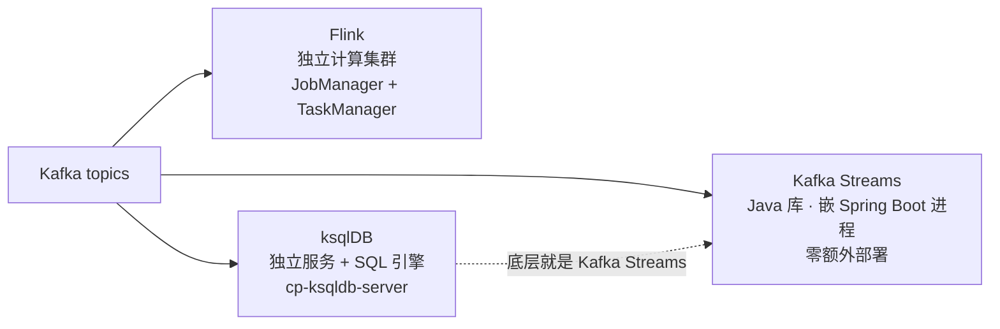
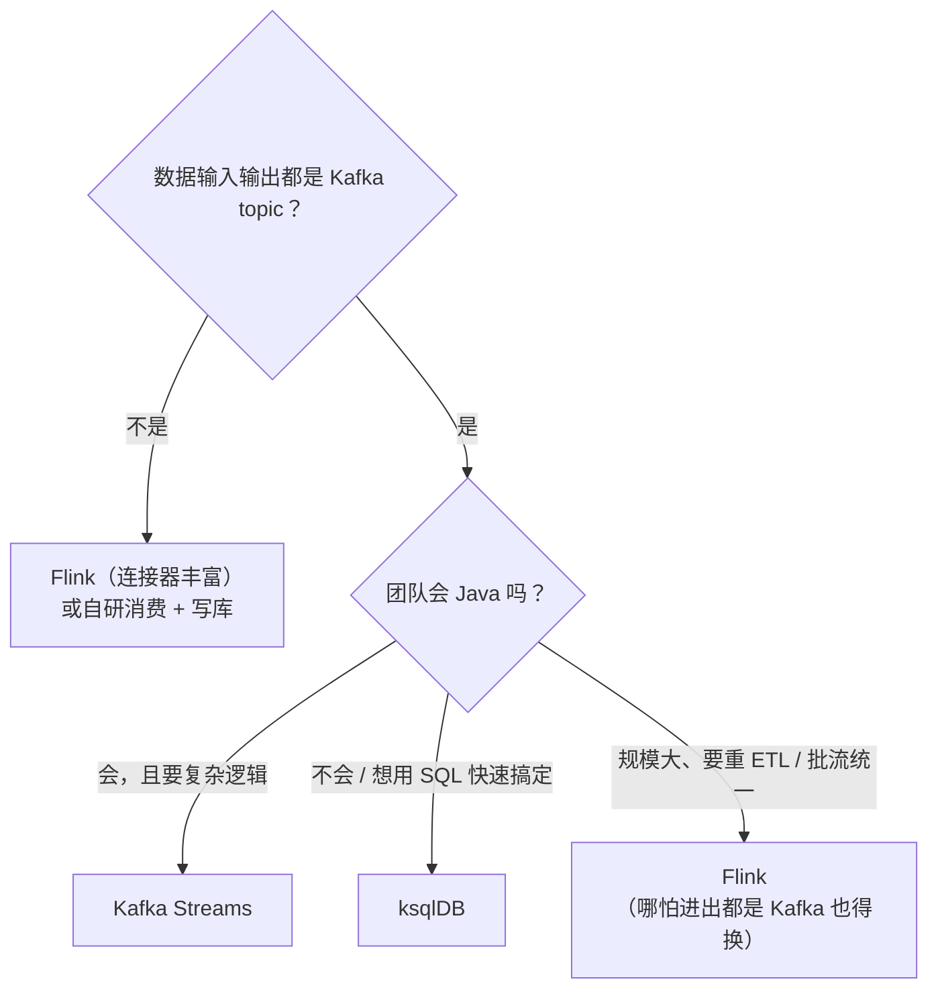
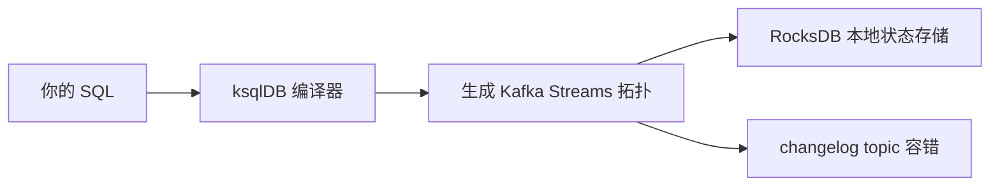
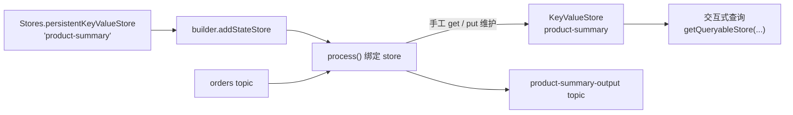
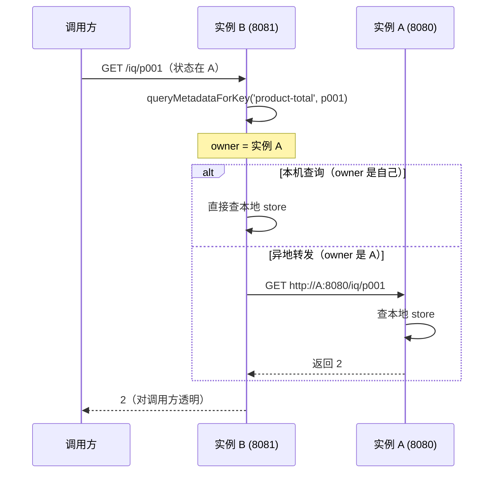

# 02 流计算选型与 ksqlDB（Kafka Streams / Flink / ksqlDB）

> **这份文档是什么**：一篇**独立专题**，把"在消息流上做实时计算"这件事放回**十字路口**——`Kafka Streams`、`Flink`、`ksqlDB` 三条路怎么选？选完怎么落地？本篇给出**三方案选型对比** + **ksqlDB 实操**（用 SQL 写流处理）+ **Kafka Streams 高级编程**（自定义状态存储、聚合优化、交互式查询 REST 化）。
>
> **写给谁**：已经读完了 [01 Kafka Streams 流处理实战](./01-Kafka-Streams流处理实战.md)（窗口/JOIN/状态查询）的人。01 是"Kafka Streams 怎么用"，本篇是"**什么时候用 Kafka Streams、什么时候用别人**"+"Kafka Streams 用到生产级该知道的高级姿势"。
>
> **和 Kafka 专题的关系**：[Kafka 进阶实战第 3 章](../Kafka消息队列实战专题/02-Kafka进阶实战.md) 只教了 Kafka Streams 的"hello world"（词频统计三步走）。01 是它的深度展开（窗口、JOIN、状态查询）。**本篇是再往上一层**：从"一种方案怎么用"上升到"多种方案怎么选"，并补齐 01 没讲的**自定义状态存储、聚合优化、分布式交互查询**。
>
> **版本前提（已校验）**：Spring Boot **4.1.0**（父工程，BOM 托管所有依赖版本）+ `spring-boot-starter-kafka` + `org.apache.kafka:kafka-streams` + Kafka 3.x + ksqlDB（Confluent 7.7.x，`cp-ksqldb-server`）。Kafka Streams DSL 对照 [Kafka 官方 Streams DSL](https://kafka.apache.org/41/streams/developer-guide/dsl-api.html) 校验。

---

## 目录

- [第 1 章：三种流计算方案选型——Kafka Streams / Flink / ksqlDB](#第-1-章三种流计算方案选型kafka-streams--flink--ksqldb)
- [第 2 章：ksqlDB 实操——用 SQL 写流处理](#第-2-章ksqldb-实操用-sql-写流处理)
- [第 3 章：自定义状态存储——不用 Materialized 默认仓库](#第-3-章自定义状态存储不用-materialized-默认仓库)
- [第 4 章：聚合优化——从 count 到生产级聚合](#第-4-章聚合优化从-count-到生产级聚合)
- [第 5 章：交互式查询 REST 化——分布式查询的正确姿势](#第-5-章交互式查询-rest-化分布式查询的正确姿势)
- [第 6 章：架构师决策——一张表定方案](#第-6-章架构师决策一张表定方案)

---

## 第 1 章：三种流计算方案选型——Kafka Streams / Flink / ksqlDB

### 1.1 一句话认识三个选手

做实时计算，生态里"输入输出是 Kafka topic"的主流方案就三个：

| 方案 | 本质 | 一句话 | 谁来写 |
|------|------|--------|--------|
| **Kafka Streams** | **Java 库**（不是独立服务） | 嵌在你的 Spring Boot 进程里，用 DSL 写拓扑 | Java 开发 |
| **Flink** | **独立计算集群**（重框架） | 自己的集群自己调度，批流统一 | 大数据团队 |
| **ksqlDB** | **独立服务 + SQL 引擎** | 用 SQL 描述流处理，底层就是 Kafka Streams | 业务/数据开发 |

> **关键区分（记住这三个词）**：**库 vs 集群 vs SQL 服务**。Kafka Streams 是"库"，往你现有进程里塞；Flink 是"集群"，你得再部署一套；ksqlDB 是"服务"，你在它上面写 SQL。三者的选型本质是问"**我愿意为计算额外部署和维护什么**"。

**三选手架构对比**：



### 1.2 Kafka Streams：库（和 01 同一套）

[01 第 1 章](./01-Kafka-Streams流处理实战.md#-第-1-章为什么需要流处理批处理-vs-流处理) 已铺过：`@EnableKafkaStreams` + `StreamsBuilder`，`builder.stream("orders")` 读流 → 算子链 → `to()` 写回。它是**库**意味着：

- **零额外部署**：跑在 Spring Boot 进程里，依赖 `kafka-streams` 即可。
- **和 Spring Boot 天然集成**：配置走 `spring.kafka.streams.*`，结果 store 直接交互查询。
- **水平扩展 = 多跑几个实例**：Kafka Streams 自己会分区重平衡（rebalance），多实例自动分摊分区。
- **局限**：只支持"输入输出都是 Kafka"，出 Kafka 的（写数据库、调外部 API 做 ETL）要自己用 Processor API 或旁路写代码。

### 1.3 Flink：独立集群的重型框架

Flink 是**独立运行的流处理集群**（JobManager + TaskManager），编程模型更重但也更强：

| Flink 强在哪 | 说明 |
|------|------|
| **复杂窗口/事件时间** | Watermark、乱序处理、精确事件时间语义比 Kafka Streams 的窗口更完善 |
| **exactly-once 端到端** | 配合 Kafka 事务，精确一次（Kafka Streams 也有，但配置复杂） |
| **批流统一** | 同一套 API 既能跑批又能跑流 |
| **丰富连接器** | 各种数据库/文件/HBase/ES 的 source/sink，ETL 场景碾压 |
| **背压处理** | 分布式背压，下游慢会反压上游 |

**代价**：一套独立集群（部署、监控、运维成本），Job 用 DataStream/SQL 写，和 Spring Boot 是两套代码体系。

> **什么时候 Flink**：数据不只是 Kafka 进出（要连库/文件/HBase）、要重 ETL、要复杂事件时间窗口、团队能养一套大数据平台。**Kafka 进 Kafka 出的轻量计算，上 Flink 是杀鸡用牛刀。**

### 1.4 ksqlDB：用 SQL 写流处理

ksqlDB 把 Kafka Streams 的 DSL **包成 SQL**——`CREATE STREAM`、`CREATE TABLE`、`SELECT ... GROUP BY`、JOIN，底层跑的还是 Kafka Streams（同一个 RocksDB 状态存储、同一个 changelog 容错机制）。

- **SQL 即声明式**：不用写 Java，`CREATE TABLE orders_per_5min AS SELECT productId, COUNT(*) FROM orders GROUP BY productId EMIT CHANGES;` 就是一个持续运行的窗口聚合。
- **学习门槛低**：会 SQL 就会写流处理。
- **也是独立服务**：`cp-ksqldb-server`，但它不搬数据（数据还是留在 Kafka topic 里，它只存计算结果状态）。
- **局限**：表达能力 < DSL 和 Flink，复杂的自定义逻辑（自定义 Serde、自定义状态结构、Processor API）SQL 写不了。

### 1.5 对比总表与决策树

| 维度 | Kafka Streams | Flink | ksqlDB |
|------|:---:|:---:|:---:|
| 形态 | 库（嵌进程） | 独立集群 | 独立服务 |
| 编程 | Java DSL / Processor API | Java DataStream / SQL | SQL |
| 部署运维 | 无（随应用） | 重（要部署监控） | 轻（一个容器） |
| 延迟 | 毫秒~秒 | 毫秒~秒 | 秒级 |
| exactly-once | 支持（配置较多） | 端到端精确一次（强） | 支持 |
| 复杂窗口/乱序 | 中等 | 最强 | 中等 |
| 输入输出约束 | 只能 Kafka | 任意（连接器丰富） | 只能 Kafka |
| 适合团队 | Java 后端团队 | 大数据团队 | 业务/数据开发 |
| 生产级自定义 | 强（Processor API） | 强 | 弱（SQL 上限） |

**决策树**（一图流）：

```
你的数据输入输出都是 Kafka topic 吗？
├─ 不是 → Flink（连接器丰富）或自研消费+写库
└─ 是 ↓
   团队会不会 Java？
   ├─ 会，且要复杂逻辑 → Kafka Streams（本篇主角，01 是它的入门）
   └─ 不会 / 想用 SQL 快速搞定 → ksqlDB
   规模大、要重 ETL / 批流统一？
   └─ 是 → Flink（哪怕进出都是 Kafka，量级和复杂度到了也得换）
```

**选型决策树**：



> **本篇的立场**：主推 **Kafka Streams**（和 01 一致，因为我们的数据源就是 Kafka、团队是 Spring 技术栈），但**用第 2 章把 ksqlDB 也讲透**——很多"临时分析"场景，起一个 ksqlDB 容器比写一整套 Java 拓扑快得多。第 3~5 章则把 Kafka Streams 推到生产级。

**本章验证（选型不是写代码，是一道决策题演练）**：

```text
场景 A：订单流(orders) JOIN 用户流(users)，补全信息后写回 enriched-orders，团队全是 Java。
        → 选 Kafka Streams（01 第 3 章就是现成答案）

场景 B：业务想"看一眼前 10 商品每 5 分钟销量"，不想写 Java，就想用 SQL。
        → 选 ksqlDB（第 2 章现成答案）

场景 C：订单数据要 JOIN 同步到 MySQL 的千万级用户表，再算 T+0 复购率，还要批跑历史。
        → 选 Flink（要连库、要批流统一，Kafka Streams 的 Kafka-only 约束扛不住）
```

---

## 第 2 章：ksqlDB 实操——用 SQL 写流处理

> 前置认知：ksqlDB 是**独立服务**，不跑在 Spring Boot 里。所以这一章**没有 Java 代码**，全是 SQL + Docker。但和 01 的场景完全复用——还是 `orders` / `users` 两个 topic，你会直观看到"同一个需求，Java DSL 写了三章，SQL 三行搞定"。

### 2.1 起 ksqlDB 服务（Docker，连接到已有的 Kafka）

假设你已经有一个 Kafka 在 `localhost:9092`（01 用的就是这个）。用 Docker 起 ksqlDB server：

```bash
# 起 ksqlDB server（连已有的 Kafka）
docker run -d --name ksqldb-server \
  -p 8088:8088 \
  -e KSQL_BOOTSTRAP_SERVERS=PLAINTEXT://host.docker.internal:9092 \
  -e KSQL_LISTENERS=http://0.0.0.0:8088 \
  -e KSQL_KSQL_SERVICE_ID=ksql-service-01 \
  confluentinc/cp-ksqldb-server:7.7.0
```

> **连不上 Kafka 的坑**：容器里访问宿主机 Kafka 用 `host.docker.internal`（macOS/Windows Docker 内置域名）；如果 Kafka 也跑在容器里，用它的容器名/网络别名。

进 ksqlDB 交互终端（CLI）：

```bash
docker exec -it ksqldb-server ksql http://localhost:8088
```

### 2.2 第一个 STREAM：把 orders topic 声明成流

**Stream** 对应 Kafka Streams 的 `KStream`（事件流，同 key 多条都保留）。把已有的 `orders` topic 声明成 STREAM：

```sql
-- ksql 终端里执行
SET 'auto.offset.reset' = 'earliest';   -- 从最早开始读（否则只读新数据）

CREATE STREAM orders (
  productId VARCHAR,
  userId    VARCHAR,
  amount    DOUBLE
) WITH (
  KAFKA_TOPIC = 'orders',      -- 绑定已有的真实 topic
  VALUE_FORMAT = 'JSON',       -- value 是 JSON
  KEY_FORMAT = 'KAFKA'         -- key 保持 Kafka 原始格式（String）
);
```

这等价于 01 里的 `builder.stream("orders", Consumed.with(Serdes.String(), new JsonSerde<>(Order.class)))`——**只是把 Java 换成了 SQL**。

### 2.3 即时查询：SELECT ... EMIT CHANGES

**EMIT CHANGES** 是"持续输出"（push query），对应 `KStream` 的持续流：

```sql
SELECT productId, userId, amount
FROM orders
EMIT CHANGES;
```

**验证**（另开一个终端往 orders 写数据，ksql 终端实时打印）：

```bash
docker exec -it kafka kafka-console-producer --bootstrap-server localhost:9092 --topic orders
> {"productId":"p001","userId":"u001","amount":100}
> {"productId":"p002","userId":"u001","amount":50}
```

ksql 终端会实时输出这两行。**这就完成了"一条 SQL 读流"的验证。**

### 2.4 CREATE TABLE：持续聚合（GROUP BY）

**Table** 对应 `KTable`（状态表，同 key 只保留最新状态）。把聚合结果建成一个**持久化查询**（`CREATE TABLE ... AS`），它会持续运行、把结果存成一张表：

```sql
-- 每商品累计订单数（KTable，同 key 最新值）
CREATE TABLE orders_per_product AS
  SELECT productId, COUNT(*) AS cnt, SUM(amount) AS total_amount
  FROM orders
  GROUP BY productId
  EMIT CHANGES;
```

窗口版（滚动窗口，等价于 01 第 2 章的 `TimeWindows.ofSizeWithNoGrace(Duration.ofMinutes(5))`）：

```sql
CREATE TABLE orders_per_5min AS
  SELECT productId, COUNT(*) AS cnt
  FROM orders
  WINDOW TUMBLING (SIZE 5 MINUTES)   -- 滚动窗口
  GROUP BY productId
  EMIT CHANGES;
```

**验证**：

```bash
# 再写 2 条 p001
docker exec -it kafka kafka-console-producer --bootstrap-server localhost:9092 --topic orders
> {"productId":"p001","userId":"u001","amount":100}
> {"productId":"p001","userId":"u001","amount":50}

# ksql 终端：拉取式查询（pull query）——查当前状态，像查数据库
SELECT productId, cnt FROM orders_per_product WHERE ROWKEY = 'p001';
# +------------+-----+
# |PRODUCTID   |CNT  |
# +------------+-----+
# |p001        |3    |

# 或者持续打印表的最新变化
SELECT productId, cnt FROM orders_per_product EMIT CHANGES;
```

> **KStream/KTable 在 SQL 里就是 STREAM/TABLE**，和 01 第 3.1 节的概念一一对应。`ROWKEY` 是隐式主键列（就是 Kafka 记录的 key）。

### 2.5 ksqlDB 的 JOIN：和 01 第 3 章同一个需求

01 用 Java 做"订单流 JOIN 用户表补全信息"，ksqlDB 三行：

```sql
-- 先声明用户表（注意 TABLE 要声明 PRIMARY KEY，即 Kafka 记录的 key）
CREATE TABLE users (
  id    VARCHAR PRIMARY KEY,
  name  VARCHAR,
  level VARCHAR
) WITH (
  KAFKA_TOPIC = 'users',
  VALUE_FORMAT = 'JSON',
  KEY_FORMAT = 'KAFKA'
);

-- STREAM JOIN TABLE：左连接补全用户信息
CREATE STREAM enriched_orders AS
  SELECT o.productId, o.userId, u.name, u.level
  FROM orders o
  LEFT JOIN users u ON o.userId = u.id
  EMIT CHANGES;
```

**验证**：

```bash
# 先写用户表（TABLE 的 key 必须显式给，格式 key:value）
docker exec -it kafka kafka-console-producer --bootstrap-server localhost:9092 \
  --topic users --property parse.key=true --property key.separator=:
> u001:{"id":"u001","name":"Alice","level":"gold"}

# 写一条订单
docker exec -it kafka kafka-console-producer --bootstrap-server localhost:9092 --topic orders
> {"productId":"p001","userId":"u001","amount":100}

# ksql 终端看 enriched_orders 持续输出
SELECT productId, userId, name, level FROM enriched_orders EMIT CHANGES;
# p001 | u001 | Alice | gold
```

> **对比 01 的 Java 实现**：同样的"流 JOIN 表 + co-partition 前提"（第 3 章 3.2/3.3），ksqlDB 完全隐藏了 `GlobalKTable`/co-partition 这些概念——代价是"为什么能 JOIN"对你透明了。**这正是选型的本质：可维护性 vs 控制力。**

### 2.6 ksqlDB 与 Kafka Streams 的关系——底层是同一个引擎

ksqlDB 不是又造了一个轮子，它是 **Kafka Streams 的 SQL 壳**：

```
你的 SQL → ksqlDB 编译器 → 生成 Kafka Streams 拓扑 → 同一个 RocksDB + changelog 容错
```

**SQL 到状态的链路**：



- 状态存储：都是本地 RocksDB（01 第 4 章那个概念）。
- 容错：都靠 Kafka changelog topic 重建状态。
- 所以 01 学的"窗口/JOIN/状态"概念，在 ksqlDB 里**全部复用**。

**什么时候用 ksqlDB、什么时候用 Kafka Streams**：

| 场景 | 用哪个 |
|------|--------|
| 快速做分析、探索数据、业务自助查 | ksqlDB |
| 要部署进 Spring Boot、要交互查询 REST 化 | Kafka Streams |
| 自定义 Serde / 自定义状态结构 / Processor API | Kafka Streams（SQL 到不了） |
| 生产核心链路、要代码评审/测试 | Kafka Streams（Java 可单测） |

---

## 第 3 章：自定义状态存储——不用 Materialized 默认仓库

> 01 第 4 章用的是 `Materialized.as("product-total")`——这是 DSL 帮你建的**默认状态仓库**（内部是持久化 KeyValueStore）。但生产里经常要"自定义"：**想控制 store 的 Serde、想用 Transformer 手工维护状态、想换一种存储语义**。这一章讲自定义状态存储的两条路。

### 3.1 为什么需要自定义

`Materialized.as(...)` 能覆盖 80% 场景，但以下场景必须自定义：

1. **想用 Transformer**：`transform()` / `process()` 里手工读写状态，需要自己往拓扑里**注册 store**。
2. **自定义值类型**：默认存 Long/自定义 POJO，想存"累加和 + 条数 + 最近一条"这种**复合状态**。
3. **自定义 Serde**：store 的 key/value 用自定义序列化（如紧凑二进制、Avro）。
4. **自定义保留策略/命名**：store 的 retention、cache 行为。

### 3.2 自定义 KeyValueStore + Transformer：每商品"累计金额 + 最近金额"

场景：订单流进来，对每个商品维护 `ProductSummary{sum, lastAmount, count}` 复合状态，并写入 topic 供外部消费。用 `Stores.persistentKeyValueStore(...)` 创建 store → `builder.addStateStore(...)` 注册 → `.transform(..., storeName)` 绑定。

```java
import org.apache.kafka.common.serialization.Serdes;
import org.apache.kafka.streams.StreamsBuilder;
import org.apache.kafka.streams.kstream.Consumed;
import org.apache.kafka.streams.kstream.KStream;
import org.apache.kafka.streams.kstream.Produced;
import org.apache.kafka.streams.processor.ProcessorContext;
import org.apache.kafka.streams.processor.api.Processor;
import org.apache.kafka.streams.processor.api.Record;
import org.apache.kafka.streams.state.KeyValueStore;
import org.apache.kafka.streams.state.StoreBuilder;
import org.apache.kafka.streams.state.Stores;
import org.springframework.context.annotation.Bean;
import org.springframework.context.annotation.Configuration;
import org.springframework.kafka.annotation.EnableKafkaStreams;
import org.springframework.kafka.support.serializer.JsonSerde;

@Configuration
@EnableKafkaStreams
public class CustomStoreTopology {

    @Bean
    public KStream<String, ProductSummary> productSummary(StreamsBuilder builder) {
        // ① 自定义 store：持久化 KeyValueStore<String, ProductSummary>
        //    显式指定 key/value 的 Serde（自定义 Serde 就在这换）
        StoreBuilder<KeyValueStore<String, ProductSummary>> storeBuilder =
                Stores.keyValueStoreBuilder(
                        Stores.persistentKeyValueStore("product-summary"),
                        Serdes.String(),
                        new JsonSerde<>(ProductSummary.class));

        // ② 把 store 注册进拓扑（不注册，transform 拿不到）
        builder.addStateStore(storeBuilder);

        // ③ 用 Processor API 手工维护状态（transform 的底层实现方式）
        KStream<String, Order> orders = builder.stream(
                "orders",
                Consumed.with(Serdes.String(), new JsonSerde<>(Order.class)));

        KStream<String, ProductSummary> summarized = orders
                .process(() -> new Processor<String, Order, String, ProductSummary>() {
                    private KeyValueStore<String, ProductSummary> store;

                    @Override
                    public void init(ProcessorContext context) {
                        // ▼ 在 init 里从 context 拿到注册的 store
                        this.store = context.getStateStore("product-summary");
                    }

                    @Override
                    public void process(Record<String, Order> record) {
                        Order order = record.value();
                        ProductSummary prev = store.get(order.getProductId());
                        ProductSummary next = (prev == null)
                                ? new ProductSummary(order.getAmount(), order.getAmount(), 1)
                                : new ProductSummary(prev.getSum() + order.getAmount(),
                                                     order.getAmount(),
                                                     prev.getCount() + 1);
                        // ▼ 手工写状态
                        store.put(order.getProductId(), next);
                        context.forward(record.withValue(next));
                    }
                }, "product-summary");

        // ④ 写回 topic，供外部消费/验证
        summarized.to("product-summary-output",
                Produced.with(Serdes.String(), new JsonSerde<>(ProductSummary.class)));
        return summarized;
    }
}
```

> **`process` 与 `transform`**：`process()` 用 `Processor` 接口（上面这种），`transform()` 用 `Transformer` 接口——都要求把 store 名作为最后一个参数传进去。**自定义状态的本质就是：自己 `get`/`put` 这个 store，而不是依赖 DSL 的 `count`/`aggregate` 自动维护。**

**自定义状态存储拓扑**：



### 3.3 验证：交互查询自定义 store

自定义 store 一旦 `addStateStore` 注册，**同样可以被交互查询**（01 第 4 章那套查询方式直接复用）：

```java
import org.apache.kafka.streams.state.QueryableStoreTypes;
import org.apache.kafka.streams.state.ReadOnlyKeyValueStore;
import org.springframework.kafka.config.KafkaStreamsInteractiveQueryService;
import org.springframework.web.bind.annotation.GetMapping;
import org.springframework.web.bind.annotation.PathVariable;
import org.springframework.web.bind.annotation.RestController;

@RestController
public class CustomStoreController {

    private final KafkaStreamsInteractiveQueryService iqService;

    public CustomStoreController(KafkaStreamsInteractiveQueryService iqService) {
        this.iqService = iqService;
    }

    @GetMapping("/summary/{productId}")
    public ProductSummary getSummary(@PathVariable String productId) {
        // ▼ 和 01 第 4 章一模一样的查询方式，store 名换成自定义的
        ReadOnlyKeyValueStore<String, ProductSummary> store = iqService.getQueryableStore(
                "product-summary", QueryableStoreTypes.keyValueStore());
        return store.get(productId);
    }
}
```

**验证步骤**：

```bash
# ① 写 3 条 p001 的订单
docker exec -it kafka kafka-console-producer --bootstrap-server localhost:9092 --topic orders
> {"productId":"p001","userId":"u001","amount":100}
> {"productId":"p001","userId":"u001","amount":50}
> {"productId":"p001","userId":"u001","amount":25}

# ② 消费输出 topic，看复合状态被逐条更新
docker exec -it kafka kafka-console-consumer --bootstrap-server localhost:9092 \
  --topic product-summary-output --from-beginning
# {"sum":100,"lastAmount":100,"count":1}
# {"sum":150,"lastAmount":50,"count":2}
# {"sum":175,"lastAmount":25,"count":3}

# ③ 交互查询直接读状态（sum 是累计，lastAmount 是最新一笔）
curl http://localhost:8080/summary/p001
# {"sum":175,"lastAmount":25,"count":3}
```

> **本章小结**：`Materialized.as(...)` 是"默认仓库"，`Stores.persistentKeyValueStore + addStateStore + process` 是"自定义仓库"。二者查法一样、容错机制一样（changelog），区别只在"状态怎么维护"。

---

## 第 4 章：聚合优化——从 count 到生产级聚合

> 01 第 2/5 章用 `count()` 做聚合。生产里三个痛点：**要自定义聚合逻辑**（用 `aggregate`）、**中间结果刷屏**（用 `suppress`）、**吞吐与乱序**（调优参数 + emit 策略）。这一章逐个解决。

### 4.1 用 aggregate 替代 count：自定义累加器

`count()` 只能计数。要"每商品累计金额 + 最高单笔"，用 `aggregate(initializer, aggregator, materialized)`：

```java
import org.apache.kafka.common.serialization.Serdes;
import org.apache.kafka.streams.StreamsBuilder;
import org.apache.kafka.streams.kstream.Aggregator;
import org.apache.kafka.streams.kstream.Consumed;
import org.apache.kafka.streams.kstream.Grouped;
import org.apache.kafka.streams.kstream.Initializer;
import org.apache.kafka.streams.kstream.KStream;
import org.apache.kafka.streams.kstream.KTable;
import org.apache.kafka.streams.kstream.Materialized;
import org.springframework.context.annotation.Bean;
import org.springframework.context.annotation.Configuration;
import org.springframework.kafka.annotation.EnableKafkaStreams;
import org.springframework.kafka.support.serializer.JsonSerde;

@Configuration
@EnableKafkaStreams
public class AggregateTopology {

    @Bean
    public KTable<String, ProductAgg> productAgg(StreamsBuilder builder) {
        KStream<String, Order> orders = builder.stream(
                "orders",
                Consumed.with(Serdes.String(), new JsonSerde<>(Order.class)));

        // ▼ aggregate：三件套 = 初始值 + 累加器 + 物化（store 名 + Serde）
        return orders
                .groupBy((key, order) -> order.getProductId(),
                        Grouped.with("product-agg-group", Serdes.String(), new JsonSerde<>(Order.class)))
                .aggregate(
                        ProductAgg::new,                                  // 初始值（空累加器）
                        (productId, order, agg) -> agg.update(order),    // 累加器：返回新状态
                        Materialized.<String, ProductAgg>as("product-agg")
                                .withKeySerde(Serdes.String())
                                .withValueSerde(new JsonSerde<>(ProductAgg.class)));
    }
}
```

> **何时 count 何时 aggregate**：只是"数个数"用 `count()`（更省）；要"累计值、求和、最大最小、去重"用 `aggregate()`。`aggregate` 的累加器是**可变更的**（上面返回 `agg.update(order)` 同一个对象），这也是比 `reduce` 更灵活的地方。

### 4.2 suppress：别让中间结果刷屏

窗口聚合默认**每来一条就输出一次**（01 第 5 章验证里看到 `p001 1`、`p001 2`）。吞吐高时输出 topic 会被刷爆。**`suppress`** 把中间结果攒起来，**只在窗口关闭时输出一条最终值**：

```java
import org.apache.kafka.common.serialization.Serdes;
import org.apache.kafka.streams.StreamsBuilder;
import org.apache.kafka.streams.kstream.Consumed;
import org.apache.kafka.streams.kstream.KStream;
import org.apache.kafka.streams.kstream.KTable;
import org.apache.kafka.streams.kstream.Materialized;
import org.apache.kafka.streams.kstream.Produced;
import org.apache.kafka.streams.kstream.Suppressed;
import org.apache.kafka.streams.kstream.TimeWindows;
import org.apache.kafka.streams.kstream.Windowed;
import org.springframework.context.annotation.Bean;
import org.springframework.context.annotation.Configuration;
import org.springframework.kafka.annotation.EnableKafkaStreams;
import org.springframework.kafka.support.serializer.JsonSerde;
import java.time.Duration;

@Configuration
@EnableKafkaStreams
public class SuppressTopology {

    @Bean
    public KTable<Windowed<String>, Long> ordersPer5minFinal(StreamsBuilder builder) {
        KStream<String, Order> orders = builder.stream(
                "orders",
                Consumed.with(Serdes.String(), new JsonSerde<>(Order.class)));

        KTable<Windowed<String>, Long> counts = orders
                .groupBy((key, order) -> order.getProductId())
                .windowedBy(TimeWindows.ofSizeWithNoGrace(Duration.ofMinutes(5)))
                .count()
                // ▼ 抑制：窗口关闭前不输出，关闭时只输出一条最终结果
                .suppress(Suppressed.untilWindowCloses(Suppressed.BufferConfig.unbounded()));

        // ▼ 窗口关闭后才有一条输出（changelog 从"每次变化"变成"每次窗口收尾"）
        counts.toStream((wk, cnt) -> wk.key())
              .to("orders-per-5min-final", Produced.with(Serdes.String(), Serdes.Long()));
        return counts;
    }
}
```

> **suppress 的两面**：优点是输出 topic 只写窗口最终值、下游（如写 HBase）负担小；代价是**窗口关闭前查不到中间态**（交互查询看到的是"抑制后"的状态），且要用 `BufferConfig.unbounded()` 或受限缓冲。**实时仪表盘通常不能 suppress（要实时数值）；报表/入库类输出强烈建议 suppress。**

**验证（对比 suppress 前后）**：

```bash
# 往 5 分钟窗口内连续写 3 条 p001
docker exec -it kafka kafka-console-producer --bootstrap-server localhost:9092 --topic orders
> {"productId":"p001","userId":"u001","amount":100}
> {"productId":"p001","userId":"u001","amount":50}
> {"productId":"p001","userId":"u001","amount":25}

# 不 suppress（01 第 5 章）：立刻看到 p001 1 / p001 2 / p001 3（3 条）
# suppress 后：窗口关闭前什么都不输出，关闭瞬间只有 1 条 p001 3
docker exec -it kafka kafka-console-consumer --bootstrap-server localhost:9092 \
  --topic orders-per-5min-final --from-beginning --property print.key=true
# p001  3        （只有一条，5 分钟后才出现）
```

### 4.3 吞吐优化三板斧：缓存 / changelog / 分区

**① 调大状态缓存**（`cache.max.bytes.buffering`）：聚合结果先攒内存、批量提交，减少 changelog 写入频率——吞吐大头靠它：

```yaml
spring:
  kafka:
    streams:
      application-id: metrics-optimized-app
      properties:
        cache.max.bytes.buffering: 10485760    # ▼ 10MB 状态缓存（默认 10MB，热点聚合可调大）
        commit.interval.ms: 3000               # ▼ 提交间隔：越大越省，但故障恢复损失越多
        num.stream.threads: 4                  # ▼ Streams 线程数：约等于分区数的 1/2~1
        default.key.serde: org.apache.kafka.common.serialization.Serdes$StringSerde
        default.value.serde: org.springframework.kafka.support.serializer.JsonSerde
```

**② 保 changelog 用 compact**：KTable 的 changelog topic 默认 `compact`（Kafka Streams 会自动建），但**手动物化的中间 store 要确认**。用 `Materialized.withLoggingEnabled(...)` 指定 changelog 配置：

```java
// ▼ 强制 changelog 使用 compact（KTable 是"最新状态"，不需要全量保留）
Materialized.<String, ProductAgg>as("product-agg")
        .withKeySerde(Serdes.String())
        .withValueSerde(new JsonSerde<>(ProductAgg.class))
        .withLoggingEnabled(java.util.Collections.singletonMap("cleanup.policy", "compact"));
```

**③ 预分组与 repartition 陷阱**：`groupBy` 改变 key 会触发**重分区**（Kafka 里写一遍中间 topic，贵）。**能不重分区就不重分区**——如果流 key 已经是目标 key，用 `groupByKey`（同分区聚合，零重分区）；要重分区时，把 `Grouped` 的分区数配成和下游一致，避免二次分区：

```java
// ▼ groupByKey：不重分区（key 已是聚合键），吞吐比 groupBy 高一截
orders.groupByKey()
      .aggregate(ProductAgg::new,
                 (k, order, agg) -> agg.update(order),
                 Materialized.as("product-agg-fast"));
```

**验证（重分区看中间 topic）**：

```bash
# groupBy 改变 key 时，Kafka 里会出现一个 ___streams-processor-repartition 中间 topic
docker exec -it kafka kafka-topics --bootstrap-server localhost:9092 --list | grep repartition
# ___streams-<app>-product-agg-group-repartition
```

> **一句话**：聚合优化的三件套是 **cache（降 changelog 压力）+ suppress（降输出压力）+ groupByKey（免重分区）**。先把这三样做到，再看要不要加机器。

### 4.4 乱序与 emit 策略：别把结果输出错时间

事件时间乱序（01 第 2.5 节 Grace 那套）。除了 grace，还能控制**窗口结果何时输出**：

```java
import org.apache.kafka.streams.kstream.EmitStrategy;
import org.apache.kafka.streams.kstream.TimeWindows;
import java.time.Duration;

// ▼ onWindowUpdate：窗口内每次状态变化都输出（默认，实时但刷屏）
TimeWindows.ofSizeAndGrace(Duration.ofMinutes(5), Duration.ofMinutes(1))
           .emitStrategy(EmitStrategy.onWindowUpdate());

// ▼ onWindowClose：只在窗口关闭后输出一次（配合 suppress 更省）
TimeWindows.ofSizeAndGrace(Duration.ofMinutes(5), Duration.ofMinutes(1))
           .emitStrategy(EmitStrategy.onWindowClose());
```

> **配合使用**：`suppress` 控制"输出几条"，`emitStrategy` 控制"什么时候算输出"，`grace` 控制"迟到多久还算数"——三个旋钮组合出你要的"实时性 vs 准确性"。

**本章验证**：发一条 `amount` 乱序（事件时间比前面早）的订单，观察：

```bash
# 用带事件时间戳的生产者发乱序数据（key=p001, value=amount, 时间戳回拨 3 分钟）
docker exec -it kafka kafka-console-producer --bootstrap-server localhost:9092 \
  --topic orders --property parse.key=true --property key.separator=:
> p001:{"productId":"p001","userId":"u001","amount":999}

# 观察 orders-per-5min-final：宽限期内(1分钟)到达的乱序数据会进入所属窗口；
# 超过 grace 的会被丢弃，不污染当前窗口
docker exec -it kafka kafka-console-consumer --bootstrap-server localhost:9092 \
  --topic orders-per-5min-final --from-beginning --property print.key=true
```

---

## 第 5 章：交互式查询 REST 化——分布式查询的正确姿势

> 01 第 4/5 章教的交互查询是**单机版**：`iqService.getQueryableStore("product-total", ...)` 直接查。但它有个致命前提——**key 恰好落在本实例**。多实例部署时状态是分片的（01 第 4.3 节提了一句），这一章把它**做成真正的 REST 服务**：本机就查，异地就转发。

### 5.1 先交代"状态分片"这个前提

Kafka Streams 多实例部署时，每个实例只持有**自己负责的分区**的状态：

```
实例 A（持有分区 0/1 状态）        实例 B（持有分区 2/3 状态）
  ├─ product-total store             ├─ product-total store
  └─ 有 p001 / p002 的状态           └─ 有 p003 / p004 的状态
```

请求打给 A 查 p003 → A 本地查不到。**必须**：先问 Streams "p003 在哪个实例"，查到是 B，就把请求**转发给 B**。

### 5.2 配置 application.server：让 Streams 知道"我是谁"

每个实例要对外广播自己的地址（供元数据查询用）：

```yaml
spring:
  kafka:
    streams:
      application-id: metrics-rpc-app
      properties:
        # ▼ 本实例对外地址：host:port（交互查询转发依赖它）
        application.server: localhost:8080
        default.key.serde: org.apache.kafka.common.serialization.Serdes$StringSerde
        default.value.serde: org.springframework.kafka.support.serializer.JsonSerde
```

> **多实例时**：实例 A 配 `application.server: 192.168.1.10:8080`，实例 B 配 `192.168.1.11:8080`。每个实例的 REST 端口一致、地址不同即可。

### 5.3 REST 查询接口：先问元数据，本机查 / 异地转发

```java
import org.apache.kafka.streams.KeyQueryMetadata;
import org.apache.kafka.streams.KafkaStreams;
import org.apache.kafka.streams.state.HostInfo;
import org.apache.kafka.streams.state.QueryableStoreTypes;
import org.apache.kafka.streams.state.ReadOnlyKeyValueStore;
import org.springframework.kafka.config.KafkaStreamsInteractiveQueryService;
import org.springframework.web.bind.annotation.GetMapping;
import org.springframework.web.bind.annotation.PathVariable;
import org.springframework.web.bind.annotation.RestController;
import org.springframework.web.client.RestTemplate;

@RestController
public class DistributedQueryController {

    private final KafkaStreamsInteractiveQueryService iqService;
    private final RestTemplate restTemplate;

    // 本实例的 HostInfo（和 yaml 里 application.server 保持一致）
    private final HostInfo localHost = new HostInfo("localhost", 8080);

    public DistributedQueryController(KafkaStreamsInteractiveQueryService iqService,
                                      RestTemplate restTemplate) {
        this.iqService = iqService;
        this.restTemplate = restTemplate;
    }

    @GetMapping("/iq/{productId}")
    public Long getCount(@PathVariable String productId) {
        KafkaStreams streams = iqService.getKafkaStreams();

        // ① 问 Streams：这个 key 的 store 状态在哪个实例
        KeyQueryMetadata metadata = streams.queryMetadataForKey(
                "product-total", productId, 
                org.apache.kafka.common.serialization.Serdes.String().serializer());
        HostInfo owner = metadata.activeHost();

        // ② 是本实例 → 直接查本地 store
        if (localHost.equals(owner)) {
            ReadOnlyKeyValueStore<String, Long> store = iqService.getQueryableStore(
                    "product-total", QueryableStoreTypes.keyValueStore());
            Long count = store.get(productId);
            return count == null ? 0L : count;
        }

        // ③ 异地 → 把请求转发给 owner 实例的相同接口
        String url = "http://" + owner.host() + ":" + owner.port() + "/iq/" + productId;
        return restTemplate.getForObject(url, Long.class);
    }
}
```

> **为什么能转发**：`queryMetadataForKey` 返回的 `activeHost` 正是持有该 key 状态的实例的 `application.server` 地址。**REST 化之后，无论打哪个实例，都能拿到正确结果**——这就是"分布式交互查询"。

**核心时序（本机查询 / 异地转发）**：



### 5.4 窗口聚合 store 的 REST 化（补全类型）

聚合是窗口 store 时（01 第 5.3 节），同一套 REST 框架，查询类型换成 `windowStore()` + `fetch` 时间范围：

```java
import org.apache.kafka.streams.state.QueryableStoreTypes;
import org.apache.kafka.streams.state.ReadOnlyWindowStore;
import org.apache.kafka.streams.state.WindowStoreIterator;
import org.springframework.web.bind.annotation.GetMapping;
import org.springframework.web.bind.annotation.PathVariable;
import org.springframework.web.bind.annotation.RequestParam;
import org.springframework.web.bind.annotation.RestController;
import java.time.Instant;

@RestController
public class WindowQueryController {

    private final KafkaStreamsInteractiveQueryService iqService;

    public WindowQueryController(KafkaStreamsInteractiveQueryService iqService) {
        this.iqService = iqService;
    }

    /** GET /window?productId=p001&from=2026-08-01T00:00:00Z&to=2026-08-01T00:10:00Z */
    @GetMapping("/window")
    public Long getWindowCount(@RequestParam String productId,
                               @RequestParam Instant from,
                               @RequestParam Instant to) {
        // ▼ 窗口聚合的 store 是 WindowStore，查询类型用 windowStore()
        ReadOnlyWindowStore<String, Long> store = iqService.getQueryableStore(
                "orders-per-product", QueryableStoreTypes.windowStore());
        long total = 0;
        try (WindowStoreIterator<Long> it = store.fetch(productId, from, to)) {
            while (it.hasNext()) {
                total += it.next().value;
            }
        }
        return total;
    }
}
```

**验证（分布式转发链路）**：

```bash
# ① 写订单
docker exec -it kafka kafka-console-producer --bootstrap-server localhost:9092 --topic orders
> {"productId":"p001","userId":"u001","amount":100}
> {"productId":"p001","userId":"u001","amount":50}

# ② 打任意一个实例（假设打了 B，而 p001 状态在 A）
curl "http://localhost:8081/iq/p001"
# 2        （B 自动转发给 A 并返回，对调用方透明）

# ③ 窗口查询（时间范围参数）
curl "http://localhost:8080/window?productId=p001&from=2026-08-01T00:00:00Z&to=2026-08-02T00:00:00Z"
# 2
```

> **单机演示**：`application.server: localhost:8080`，`queryMetadataForKey` 返回的 owner 就是本机，永远走"本机查询"分支——你复现不了转发，但代码是对的。**多实例才能看到转发**（起两个实例、配不同端口）。

---

## 第 6 章：架构师决策——一张表定方案

### 6.1 三方案最终对照

| 你的诉求 | Kafka Streams | ksqlDB | Flink |
|------|:---:|:---:|:---:|
| 输入输出都是 Kafka 的轻量实时计算 | ✅ 首选 | ✅ 也快 | ⚠️ 重 |
| 业务人员自助分析 | ❌ | ✅ | ❌ |
| 复杂 ETL / 连库连文件 / 批流统一 | ❌ | ❌ | ✅ |
| 自定义状态 / Processor API / 精确控制 | ✅ | ❌ | ✅（但更重） |
| 和 Spring Boot 应用集成 | ✅ 零部署 | 独立服务 | 独立集群 |
| 实时仪表盘交互查询 | ✅（第 5 章 REST 化） | ✅（pull query） | ⚠️ 要另搭查询层 |

### 6.2 决策一句话

> **Kafka 进 Kafka 出的轻量实时计算 → Kafka Streams（库，嵌 Spring Boot，01 是基础本篇是进阶）；想用 SQL 快速分析 → ksqlDB（同一引擎换个壳）；数据不只在 Kafka、要重 ETL/批流统一 → Flink。** 判断标志就一句：**"我愿不愿意为这个计算额外部署/维护一套东西？"** 不想 → Kafka Streams；只想写 SQL → ksqlDB；愿意养大数据平台 → Flink。

### 6.3 本篇与 01 的分工

| 能力 | 在哪学 |
|------|--------|
| 窗口、JOIN、状态查询（入门~中级） | [01 Kafka Streams 流处理实战](./01-Kafka-Streams流处理实战.md) |
| 三种方案选型 + ksqlDB SQL 实操 | 本篇第 1~2 章 |
| 自定义状态存储、聚合优化、分布式交互查询 | 本篇第 3~5 章 |
| Kafka Streams 词频入门（三步走） | [Kafka 进阶实战第 3 章](../Kafka消息队列实战专题/02-Kafka进阶实战.md) |

---

## 配套学习资料

- [01 Kafka Streams 流处理实战](./01-Kafka-Streams流处理实战.md)（本篇的入门篇：窗口/JOIN/状态查询；本篇第 3~5 章是它的生产级补全）
- [Kafka 进阶实战第 3 章](../Kafka消息队列实战专题/02-Kafka进阶实战.md)（Kafka Streams 词频三步走，同一套原生 `@EnableKafkaStreams` + `StreamsBuilder` 写法）
- [Kafka 官方 Streams DSL 文档](https://kafka.apache.org/41/streams/developer-guide/dsl-api.html)（suppress / aggregate / emit 权威）
- [Kafka 官方 Processor API 文档](https://kafka.apache.org/41/streams/developer-guide/processor-api.html)（自定义 store / Transformer）
- [Kafka 交互式查询文档](https://kafka.apache.org/41/streams/developer-guide/interactive-queries.html)（分布式查询 / application.server）
- [ksqlDB 官方文档](https://docs.ksqldb.io/)（SQL 语法 / STREAM / TABLE）
- [Kafka 核心概念与 Spring Boot 实战](../Kafka消息队列实战专题/01-Kafka消息队列从入门到架构师.md)（Kafka 地基：分区/消费组是选型的前提）

---

> **写在最后**：01 教会你用 Kafka Streams 做实时计算，本篇把你从"会用一种方案"带到"**会选方案**"。三条路不是竞争关系——Kafka Streams 是库（嵌你的 Spring Boot）、ksqlDB 是同一引擎的 SQL 壳（快速分析）、Flink 是独立集群（重活累活）。真正的高手是**按场景换工具**：核心实时链路用 Kafka Streams（Java 可测可控、可 REST 化查询），临时分析丢给 ksqlDB 一条 SQL，量级和复杂度到了再上 Flink。掌握这个"选型 + 实操 + 高级编程"的完整拼图，你的实时计算能力就真正闭环了。
